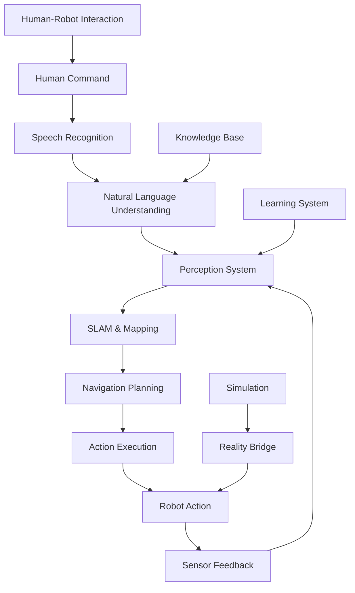
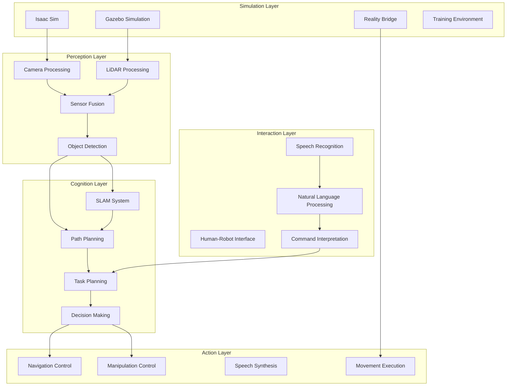

# Capstone Project: Autonomous Physical AI System

Welcome to the Capstone Project of the Physical AI curriculum! This comprehensive project integrates everything you've learned across all modules to build a complete autonomous robot system capable of perception, reasoning, planning, and action in real-world environments.

## Project Overview

Your capstone project is to build an **Autonomous Physical AI System** that combines:
- **Robotic Nervous System**: ROS 2 communication and coordination
- **Digital Twin**: Simulation and reality bridging
- **AI Robot Brain**: Perception, planning, and decision making
- **Vision-Language-Action**: Multimodal understanding and interaction



## Capstone Objectives

### Primary Objective
Build a complete autonomous robot system that can:
1. **Understand** natural language commands from users
2. **Perceive** and map unknown environments
3. **Navigate** safely through complex spaces
4. **Manipulate** objects based on commands
5. **Learn** and adapt from interactions
6. **Communicate** effectively with humans

### Learning Goals
- Integrate multiple complex systems
- Handle real-world complexity and uncertainty
- Apply best practices for system design
- Demonstrate professional-level implementation
- Solve challenging robotics problems end-to-end

## Capstone Project Requirements

### Technical Requirements

| Component | Requirement | Points |
|-----------|-------------|--------|
| **SLAM System** | Build and maintain accurate map | 20 |
| **Navigation** | Navigate to specified locations | 20 |
| **Perception** | Detect and classify objects | 15 |
| **Manipulation** | Pick and place objects | 15 |
| **Natural Language** | Understand and execute commands | 15 |
| **Integration** | All systems work together seamlessly | 10 |
| **Documentation** | Complete system documentation | 5 |

### Performance Requirements

- **Success Rate**: 80%+ for basic navigation tasks
- **Response Time**: < 3 seconds for command interpretation
- **Mapping Accuracy**: < 10cm error in known environments
- **Manipulation Success**: 70%+ for simple objects
- **System Availability**: 95%+ uptime during testing

### Quality Requirements

- **Robustness**: Handle unexpected situations gracefully
- **Safety**: Implement proper safety measures
- **Usability**: Intuitive human-robot interaction
- **Maintainability**: Well-structured, documented code
- **Scalability**: Architecture supports future extensions

## System Architecture

### High-Level Architecture



### Component Integration Points

1. **SLAM ↔ Navigation**: Map sharing and localization
2. **Perception ↔ Task Planning**: Object detection results
3. **Language ↔ Task Planning**: Command interpretation
4. **Navigation ↔ Manipulation**: Waypoint coordination
5. **Simulation ↔ Reality**: Domain transfer bridge

## Implementation Phases

### Phase 1: System Foundation (Week 1)
- Set up development environment
- Create basic ROS 2 package structure
- Implement skeleton nodes
- Establish communication interfaces
- Basic simulation setup

### Phase 2: Perception Integration (Week 2)
- Implement SLAM system
- Integrate object detection
- Create sensor fusion pipeline
- Validate perception accuracy
- Connect with simulation

### Phase 3: Navigation and Planning (Week 3)
- Implement navigation stack
- Create path planning algorithms
- Integrate with perception system
- Test in simulation
- Validate safety systems

### Phase 4: Human-Robot Interaction (Week 4)
- Implement speech recognition
- Create natural language understanding
- Build command interpretation
- Implement action execution
- Test human-robot interface

### Phase 5: System Integration and Testing (Week 5)
- Integrate all components
- Optimize performance
- Conduct system testing
- Implement learning capabilities
- Final validation and documentation

## Project Deliverables

### 1. Complete System Implementation
- Source code for all components
- Configuration files
- Launch scripts
- Documentation

### 2. Technical Report
- System architecture overview
- Implementation details
- Performance evaluation
- Lessons learned
- Future improvements

### 3. Demonstration Video
- System walkthrough
- Feature demonstrations
- Performance metrics
- Problem-solving examples

### 4. Presentation
- Technical presentation (20 minutes)
- Live demonstration
- Q&A session
- Code review

## Evaluation Criteria

### Technical Excellence (40%)
- **System Integration**: How well components work together
- **Technical Sophistication**: Advanced features and algorithms
- **Code Quality**: Clean, well-documented, maintainable code
- **Performance**: Meeting specified performance requirements

### Innovation (25%)
- **Novel Solutions**: Creative approaches to challenges
- **Problem Solving**: Handling of complex scenarios
- **Learning Features**: Adaptive capabilities
- **User Experience**: Intuitive interaction design

### Documentation (20%)
- **Code Documentation**: Comments, docstrings, API docs
- **System Documentation**: Architecture, installation, usage
- **Technical Report**: Clear explanations and analysis
- **Tutorials**: Examples and guides for others

### Presentation (15%)
- **Clarity**: Clear communication of concepts
- **Technical Depth**: Understanding of implementation
- **Demonstration**: Effective system showcase
- **Professionalism**: Quality of presentation

## Getting Started

### 1. Environment Setup

```bash
# Create project workspace
mkdir -p ~/capstone_project/src
cd ~/capstone_project

# Clone any necessary repositories
git clone https://github.com/your-org/capstone-templates.git src/

# Build workspace
colcon build
source install/setup.bash
```

### 2. Project Planning

Create a detailed project plan:
- Break down requirements into tasks
- Estimate timeline for each component
- Identify dependencies between components
- Plan for testing and integration phases

### 3. Architecture Design

Design your system architecture:
- Define component interfaces
- Plan data flow between components
- Consider error handling and safety
- Plan for scalability and maintainability

## Recommended Approach

### Agile Development
- **Weekly Sprints**: Focus on specific features each week
- **Continuous Integration**: Regular testing and integration
- **Iterative Development**: Build and test incrementally
- **Regular Reviews**: Assess progress and adjust plans

### Best Practices
- **Version Control**: Use Git for code management
- **Code Review**: Peer review of implementations
- **Testing**: Unit and integration tests
- **Documentation**: Document as you develop
- **Performance Monitoring**: Track system metrics

## Resources and Support

### Technical Resources
- ROS 2 documentation
- Isaac Sim tutorials
- Computer vision libraries
- Deep learning frameworks
- Navigation stack guides

### Support Channels
- Instructor office hours
- Peer collaboration
- Online forums and communities
- Technical documentation

## Milestones

### Week 1: Foundation
- [ ] Development environment set up
- [ ] Basic package structure created
- [ ] Skeleton nodes implemented
- [ ] Communication interfaces established

### Week 2: Perception
- [ ] SLAM system integrated
- [ ] Object detection working
- [ ] Sensor fusion functional
- [ ] Simulation connection established

### Week 3: Navigation
- [ ] Path planning implemented
- [ ] Navigation stack configured
- [ ] Safety systems in place
- [ ] Basic navigation working

### Week 4: Interaction
- [ ] Speech recognition integrated
- [ ] Natural language processing working
- [ ] Command execution functional
- [ ] Human-robot interface tested

### Week 5: Integration
- [ ] All components integrated
- [ ] Performance optimized
- [ ] System validated
- [ ] Documentation completed

## Success Strategies

### 1. Start Simple
- Begin with basic functionality
- Gradually add complexity
- Test each component individually
- Ensure basic integration works before adding features

### 2. Focus on Core Functionality
- Prioritize essential features
- Implement MVP first
- Add advanced features after core works
- Don't over-engineer initially

### 3. Plan for Integration
- Design modular, well-defined interfaces
- Consider data formats and communication
- Plan for error handling and recovery
- Test components together early

### 4. Document Continuously
- Document code as you write it
- Keep design decisions recorded
- Track performance metrics
- Create usage examples

## Common Challenges

### Integration Challenges
- **Timing Issues**: Different components running at different rates
- **Data Format Mismatch**: Incompatible data between components
- **Coordinate Frame Issues**: Different reference frames
- **Resource Conflicts**: Competing for computational resources

### Performance Challenges
- **Real-time Requirements**: Meeting timing constraints
- **Memory Management**: Efficient resource usage
- **Computation Overhead**: Optimizing for target hardware
- **Network Latency**: Communication delays in distributed systems

### Robustness Challenges
- **Error Handling**: Graceful degradation
- **Safety Systems**: Preventing harmful actions
- **Uncertainty Management**: Handling incomplete information
- **Failure Recovery**: Returning to safe states

## Next Steps

Begin with [Phase 1: System Foundation](./phase-1-foundation) to establish your development environment and basic system architecture.

## Questions and Support

For technical questions about the capstone project:
- Attend instructor office hours
- Participate in peer collaboration sessions
- Use the course discussion forum
- Consult the technical documentation

Remember: The capstone project is designed to challenge you while providing opportunities to demonstrate your mastery of Physical AI concepts. Focus on building a working system first, then iterate to add sophistication and polish.