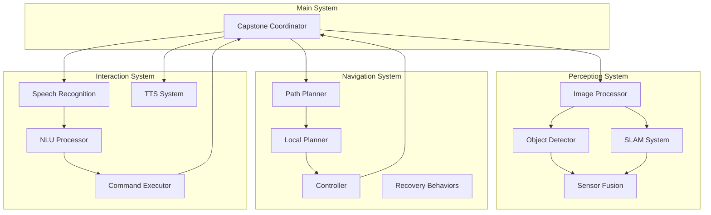

# Phase 1: System Foundation

Welcome to Phase 1 of the Capstone Project: System Foundation. In this phase, you'll establish the basic development environment, create the fundamental system architecture, and implement skeleton components that will form the foundation for your complete autonomous robot system.

## Phase Objectives

By the end of this phase, you will have:
1. **Set up** a complete development environment with all dependencies
2. **Created** the basic ROS 2 package structure and organization
3. **Implemented** skeleton nodes for each major system component
4. **Established** communication interfaces between components
5. **Validated** basic system functionality and integration

## Environment Setup

### Prerequisites Check

Before beginning, ensure your system meets the requirements:

```bash
# Check ROS 2 installation
ros2 --version

# Verify required packages are installed
ros2 pkg list | grep -E "(navigation|slam|vision|tf2|camera)"

# Check Python dependencies
python3 -c "import cv2; print(cv2.__version__)"
python3 -c "import torch; print(torch.__version__)"
python3 -c "import numpy as np; print(np.__version__)"

# Check for GPU (if using for deep learning)
nvidia-smi
```

### Development Environment

Create the capstone project workspace:

```bash
# Create project directory
mkdir -p ~/capstone_project/src
cd ~/capstone_project

# Create the main capstone package
ros2 pkg create --build-type ament_python capstone_robot_system \
    --dependencies rclpy std_msgs sensor_msgs geometry_msgs nav_msgs \
    sensor_msgs vision_msgs tf2_ros cv_bridge message_filters

# Create sub-packages for different system components
ros2 pkg create --build-type ament_python capstone_perception \
    --dependencies rclpy sensor_msgs vision_msgs cv_bridge std_msgs

ros2 pkg create --build-type ament_python capstone_navigation \
    --dependencies rclpy nav_msgs geometry_msgs tf2_ros std_msgs

ros2 pkg create --build-type ament_python capstone_interaction \
    --dependencies rclpy std_msgs sensor_msgs geometry_msgs
```

## System Architecture Design

### Package Structure

```
capstone_project/
├── src/
│   ├── capstone_robot_system/     # Main system coordinator
│   ├── capstone_perception/       # Vision and perception
│   ├── capstone_navigation/       # Navigation and path planning
│   ├── capstone_interaction/      # Human-robot interaction
│   └── capstone_simulation/       # Simulation interfaces
├── launch/                        # System launch files
├── config/                        # Configuration files
├── models/                        # Robot and environment models
└── scripts/                       # Utility scripts
```

### Communication Architecture



## Creating the Main System Coordinator

### 1. Create the Main Package Structure

Create `capstone_robot_system/capstone_robot_system/capstone_coordinator.py`:

```python
#!/usr/bin/env python3
"""
Capstone Robot System Coordinator
"""
import rclpy
from rclpy.node import Node
from std_msgs.msg import String, Bool, Float32
from geometry_msgs.msg import PoseStamped, Twist
from sensor_msgs.msg import Image, LaserScan
from nav_msgs.msg import Odometry
from tf2_ros import TransformException
from tf2_ros.buffer import Buffer
from tf2_ros.transform_listener import TransformListener
from typing import Dict, Any, Optional
import threading
import time

class CapstoneCoordinatorNode(Node):
    def __init__(self):
        super().__init__('capstone_coordinator')

        # Initialize TF buffer and listener
        self.tf_buffer = Buffer()
        self.tf_listener = TransformListener(self.tf_buffer, self)

        # System state
        self.system_state = {
            'initialized': False,
            'components_ready': {
                'perception': False,
                'navigation': False,
                'interaction': False,
                'simulation': False
            },
            'robot_status': 'idle',
            'current_task': 'none',
            'last_command_time': time.time(),
            'safety_status': 'safe',
            'performance_metrics': {
                'uptime': 0.0,
                'cpu_usage': 0.0,
                'memory_usage': 0.0,
                'processing_rate': 0.0
            }
        }

        # Communication interfaces
        self.setup_communication_interfaces()

        # System monitoring
        self.monitoring_timer = self.create_timer(1.0, self.system_monitoring_callback)

        # Initialize components
        self.initialize_components()

        self.get_logger().info('Capstone coordinator node initialized')

    def setup_communication_interfaces(self):
        """Set up all communication interfaces"""
        # Create subscribers
        self.status_sub = self.create_subscription(
            String, '/system/status', self.system_status_callback, 10)
        self.command_sub = self.create_subscription(
            String, '/natural_language_command', self.command_callback, 10)
        self.perception_sub = self.create_subscription(
            String, '/perception/status', self.perception_status_callback, 10)
        self.navigation_sub = self.create_subscription(
            String, '/navigation/status', self.navigation_status_callback, 10)
        self.interaction_sub = self.create_subscription(
            String, '/interaction/status', self.interaction_status_callback, 10)

        # Create publishers
        self.system_status_pub = self.create_publisher(String, '/capstone/status', 10)
        self.system_ready_pub = self.create_publisher(Bool, '/capstone/ready', 10)
        self.system_metrics_pub = self.create_publisher(String, '/capstone/metrics', 10)
        self.command_pub = self.create_publisher(String, '/capstone/commands', 10)

        # Create services
        self.system_control_srv = self.create_service(
            SetBool, '/capstone/control', self.system_control_callback)
        self.task_request_srv = self.create_service(
            Trigger, '/capstone/request_task', self.task_request_callback)

    def initialize_components(self):
        """Initialize all system components"""
        try:
            # Initialize perception components
            self.initialize_perception_system()

            # Initialize navigation components
            self.initialize_navigation_system()

            # Initialize interaction components
            self.initialize_interaction_system()

            # Set system as initialized
            self.system_state['initialized'] = True

            self.get_logger().info('All system components initialized successfully')

        except Exception as e:
            self.get_logger().error(f'Error initializing components: {e}')
            self.system_state['initialized'] = False

    def initialize_perception_system(self):
        """Initialize perception system components"""
        # In a real implementation, this would start perception nodes
        # For this skeleton, we'll just mark as initialized
        self.system_state['components_ready']['perception'] = True
        self.get_logger().info('Perception system initialized')

    def initialize_navigation_system(self):
        """Initialize navigation system components"""
        # In a real implementation, this would start navigation nodes
        self.system_state['components_ready']['navigation'] = True
        self.get_logger().info('Navigation system initialized')

    def initialize_interaction_system(self):
        """Initialize interaction system components"""
        # In a real implementation, this would start interaction nodes
        self.system_state['components_ready']['interaction'] = True
        self.get_logger().info('Interaction system initialized')

    def system_status_callback(self, msg):
        """Handle system status updates"""
        try:
            status_data = json.loads(msg.data)

            # Update component readiness
            if 'component' in status_data and 'status' in status_data:
                component = status_data['component']
                status = status_data['status']

                if component in self.system_state['components_ready']:
                    self.system_state['components_ready'][component] = status == 'ready'

            # Update robot status
            if 'robot_status' in status_data:
                self.system_state['robot_status'] = status_data['robot_status']

            # Update safety status
            if 'safety_status' in status_data:
                self.system_state['safety_status'] = status_data['safety_status']

        except json.JSONDecodeError:
            self.get_logger().warn('Invalid JSON in system status message')

    def command_callback(self, msg):
        """Handle natural language commands"""
        command = msg.data

        # Update last command time
        self.system_state['last_command_time'] = time.time()

        # Process command (will be implemented in later phases)
        self.process_command(command)

    def process_command(self, command: str):
        """Process natural language command"""
        self.get_logger().info(f'Received command: {command}')

        # In Phase 2, this will be implemented with NLU
        # For now, just acknowledge
        self.system_state['current_task'] = f'processing: {command[:20]}...'

    def system_monitoring_callback(self):
        """Monitor system health and performance"""
        # Update uptime
        self.system_state['performance_metrics']['uptime'] = time.time() - self.start_time

        # Check if all components are ready
        all_ready = all(self.system_state['components_ready'].values())

        # Publish system readiness
        ready_msg = Bool()
        ready_msg.data = all_ready and self.system_state['initialized']
        self.system_ready_pub.publish(ready_msg)

        # Publish system status
        status_msg = String()
        status_msg.data = json.dumps({
            'timestamp': time.time(),
            'system_state': self.system_state['robot_status'],
            'components_ready': self.system_state['components_ready'],
            'current_task': self.system_state['current_task'],
            'safety_status': self.system_state['safety_status'],
            'all_components_ready': all_ready
        })
        self.system_status_pub.publish(status_msg)

        # Log system status periodically
        if int(time.time()) % 10 == 0:  # Every 10 seconds
            self.get_logger().info(
                f'System Status - Ready: {all_ready}, '
                f'Components: {sum(self.system_state["components_ready"].values())}/3, '
                f'Status: {self.system_state["robot_status"]}'
            )

    def system_control_callback(self, request, response):
        """Handle system control requests"""
        if request.data.data:
            # Start system
            self.system_state['robot_status'] = 'active'
            response.success = True
            response.message = 'System started'
        else:
            # Stop system
            self.system_state['robot_status'] = 'idle'
            response.success = True
            response.message = 'System stopped'

        return response

    def task_request_callback(self, request, response):
        """Handle task requests"""
        # In a real system, this would trigger task execution
        # For this phase, just acknowledge
        response.success = True
        response.message = f'Current task: {self.system_state["current_task"]}'
        return response

    def perception_status_callback(self, msg):
        """Handle perception system status"""
        try:
            status = json.loads(msg.data)
            if status.get('status') == 'ready':
                self.system_state['components_ready']['perception'] = True
        except:
            pass

    def navigation_status_callback(self, msg):
        """Handle navigation system status"""
        try:
            status = json.loads(msg.data)
            if status.get('status') == 'ready':
                self.system_state['components_ready']['navigation'] = True
        except:
            pass

    def interaction_status_callback(self, msg):
        """Handle interaction system status"""
        try:
            status = json.loads(msg.data)
            if status.get('status') == 'ready':
                self.system_state['components_ready']['interaction'] = True
        except:
            pass

def main(args=None):
    rclpy.init(args=args)
    node = CapstoneCoordinatorNode()
    node.start_time = time.time()

    try:
        rclpy.spin(node)
    except KeyboardInterrupt:
        pass
    finally:
        node.destroy_node()
        rclpy.shutdown()

if __name__ == '__main__':
    main()
```

## Creating Skeleton Nodes

### 2. Perception System Skeleton

Create `capstone_perception/capstone_perception/perception_skeleton.py`:

```python
#!/usr/bin/env python3
"""
Capstone Perception System Skeleton
"""
import rclpy
from rclpy.node import Node
from sensor_msgs.msg import Image, PointCloud2, LaserScan
from vision_msgs.msg import Detection2DArray
from std_msgs.msg import String, Bool
from geometry_msgs.msg import Point
import json

class PerceptionSkeletonNode(Node):
    def __init__(self):
        super().__init__('capstone_perception_skeleton')

        # Create subscribers
        self.image_sub = self.create_subscription(
            Image, '/camera/image_raw', self.image_callback, 10)
        self.lidar_sub = self.create_subscription(
            PointCloud2, '/lidar/points', self.lidar_callback, 10)
        self.scan_sub = self.create_subscription(
            LaserScan, '/scan', self.scan_callback, 10)

        # Create publishers
        self.detection_pub = self.create_publisher(Detection2DArray, '/capstone/detections', 10)
        self.perception_status_pub = self.create_publisher(String, '/perception/status', 10)
        self.perception_metrics_pub = self.create_publisher(String, '/perception/metrics', 10)

        # System state
        self.system_ready = False
        self.last_image_time = None
        self.detection_count = 0

        # Initialize perception components (skeleton)
        self.initialize_perception_components()

        self.get_logger().info('Capstone perception skeleton started')

    def initialize_perception_components(self):
        """Initialize perception components"""
        # In a real system, this would initialize:
        # - Object detection models
        # - SLAM systems
        # - Feature extractors
        # - Sensor calibration
        # For skeleton, just mark as ready
        self.system_ready = True

        status_msg = String()
        status_msg.data = json.dumps({
            'component': 'perception',
            'status': 'ready',
            'timestamp': time.time()
        })
        self.perception_status_pub.publish(status_msg)

    def image_callback(self, msg):
        """Handle camera images"""
        self.last_image_time = time.time()

        # Process image (skeleton implementation)
        # In Phase 2, this will implement actual perception
        processed_result = self.process_image_skeleton(msg)

        # Publish dummy detections for now
        self.publish_dummy_detections(msg.header)

    def lidar_callback(self, msg):
        """Handle LiDAR data"""
        # Process point cloud (skeleton implementation)
        processed_result = self.process_lidar_skeleton(msg)

    def scan_callback(self, msg):
        """Handle laser scan data"""
        # Process laser scan (skeleton implementation)
        processed_result = self.process_scan_skeleton(msg)

    def process_image_skeleton(self, image_msg):
        """Skeleton for image processing"""
        # In Phase 2, this will implement:
        # - Object detection
        # - Feature extraction
        # - Scene understanding
        # For now, return dummy result
        return {'processed': True, 'features': 0, 'objects': 0}

    def process_lidar_skeleton(self, lidar_msg):
        """Skeleton for LiDAR processing"""
        # In Phase 2, this will implement:
        # - Point cloud processing
        # - 3D object detection
        # - SLAM
        # For now, return dummy result
        return {'processed': True, 'points': 0, 'clusters': 0}

    def process_scan_skeleton(self, scan_msg):
        """Skeleton for laser scan processing"""
        # In Phase 2, this will implement:
        # - Scan matching
        # - Obstacle detection
        # - Local mapping
        # For now, return dummy result
        return {'processed': True, 'ranges': len(scan_msg.ranges), 'obstacles': 0}

    def publish_dummy_detections(self, header):
        """Publish dummy detections for system integration"""
        detection_array = Detection2DArray()
        detection_array.header = header

        # Create a few dummy detections for testing
        for i in range(2):  # 2 dummy detections
            detection = Detection2D()
            detection.header = header

            # Set bounding box (simplified)
            bbox = detection.bbox
            bbox.center.x = 100 + i * 50
            bbox.center.y = 100 + i * 50
            bbox.size_x = 50
            bbox.size_y = 50

            # Set classification result
            hypothesis = ObjectHypothesisWithPose()
            hypothesis.hypothesis.class_id = f'object_{i}'
            hypothesis.hypothesis.score = 0.8
            detection.results.append(hypothesis)

            detection_array.detections.append(detection)
            self.detection_count += 1

        self.detection_pub.publish(detection_array)

        # Publish metrics
        metrics_msg = String()
        metrics_msg.data = json.dumps({
            'timestamp': time.time(),
            'detection_count': self.detection_count,
            'processing_rate': 10.0,  # Hz (placeholder)
            'system_ready': self.system_ready
        })
        self.perception_metrics_pub.publish(metrics_msg)

def main(args=None):
    rclpy.init(args=args)
    node = PerceptionSkeletonNode()

    try:
        rclpy.spin(node)
    except KeyboardInterrupt:
        pass
    finally:
        node.destroy_node()
        rclpy.shutdown()

if __name__ == '__main__':
    main()
```

### 3. Navigation System Skeleton

Create `capstone_navigation/capstone_navigation/navigation_skeleton.py`:

```python
#!/usr/bin/env python3
"""
Capstone Navigation System Skeleton
"""
import rclpy
from rclpy.node import Node
from geometry_msgs.msg import PoseStamped, Twist
from nav_msgs.msg import Odometry, Path
from std_msgs.msg import String, Bool
from tf2_ros import TransformException
from tf2_ros.buffer import Buffer
from tf2_ros.transform_listener import TransformListener
import json

class NavigationSkeletonNode(Node):
    def __init__(self):
        super().__init__('capstone_navigation_skeleton')

        # Initialize TF buffer
        self.tf_buffer = Buffer()
        self.tf_listener = TransformListener(self.tf_buffer, self)

        # Create subscribers
        self.goal_sub = self.create_subscription(
            PoseStamped, '/capstone/goal', self.goal_callback, 10)
        self.odom_sub = self.create_subscription(
            Odometry, '/odom', self.odom_callback, 10)

        # Create publishers
        self.cmd_vel_pub = self.create_publisher(Twist, '/cmd_vel', 10)
        self.path_pub = self.create_publisher(Path, '/capstone/path', 10)
        self.navigation_status_pub = self.create_publisher(String, '/navigation/status', 10)
        self.navigation_metrics_pub = self.create_publisher(String, '/navigation/metrics', 10)

        # System state
        self.system_ready = False
        self.current_pose = None
        self.current_goal = None
        self.navigation_active = False

        # Initialize navigation components
        self.initialize_navigation_components()

        self.get_logger().info('Capstone navigation skeleton started')

    def initialize_navigation_components(self):
        """Initialize navigation components"""
        # In a real system, this would initialize:
        # - Global planner
        # - Local planner
        # - Controller
        # - Costmap
        # For skeleton, just mark as ready
        self.system_ready = True

        status_msg = String()
        status_msg.data = json.dumps({
            'component': 'navigation',
            'status': 'ready',
            'timestamp': time.time()
        })
        self.navigation_status_pub.publish(status_msg)

    def goal_callback(self, msg):
        """Handle navigation goals"""
        self.current_goal = msg

        # Plan path (skeleton implementation)
        path = self.plan_path_skeleton(self.current_pose, msg.pose)

        # Execute navigation (skeleton implementation)
        self.execute_navigation_skeleton(path)

    def odom_callback(self, msg):
        """Handle odometry updates"""
        self.current_pose = msg.pose.pose

        # Update navigation status
        self.update_navigation_status()

    def plan_path_skeleton(self, start_pose, goal_pose):
        """Skeleton for path planning"""
        # In Phase 3, this will implement:
        # - Global path planning
        # - Costmap integration
        # - Obstacle avoidance
        # For now, return dummy path
        path = Path()
        path.header.frame_id = 'map'

        # Create simple path (straight line for now)
        for i in range(10):
            pose = PoseStamped()
            pose.pose.position.x = start_pose.position.x + i * 0.1 if start_pose else i * 0.1
            pose.pose.position.y = start_pose.position.y + i * 0.1 if start_pose else i * 0.1
            pose.pose.position.z = 0.0
            pose.pose.orientation.w = 1.0
            path.poses.append(pose)

        self.path_pub.publish(path)
        return path

    def execute_navigation_skeleton(self, path):
        """Skeleton for navigation execution"""
        # In Phase 3, this will implement:
        # - Local path following
        # - Obstacle avoidance
        # - Recovery behaviors
        # For now, just log and send dummy commands
        self.navigation_active = True
        self.get_logger().info(f'Executing navigation to goal')

        # Send dummy velocity commands
        for i in range(50):  # Send 50 commands over 5 seconds
            cmd_vel = Twist()
            cmd_vel.linear.x = 0.2  # Move forward slowly
            cmd_vel.angular.z = 0.0  # No rotation
            self.cmd_vel_pub.publish(cmd_vel)
            time.sleep(0.1)

        # Stop robot when done
        stop_cmd = Twist()
        self.cmd_vel_pub.publish(stop_cmd)
        self.navigation_active = False

        self.get_logger().info('Navigation completed')

    def update_navigation_status(self):
        """Update navigation status"""
        status_msg = String()
        status_msg.data = json.dumps({
            'status': 'active' if self.navigation_active else 'idle',
            'current_pose': {
                'x': self.current_pose.position.x if self.current_pose else 0.0,
                'y': self.current_pose.position.y if self.current_pose else 0.0,
                'z': self.current_pose.position.z if self.current_pose else 0.0
            },
            'system_ready': self.system_ready,
            'timestamp': time.time()
        })
        self.navigation_status_pub.publish(status_msg)

        # Publish metrics
        metrics_msg = String()
        metrics_msg.data = json.dumps({
            'timestamp': time.time(),
            'active': self.navigation_active,
            'system_ready': self.system_ready,
            'processing_rate': 10.0  # Hz (placeholder)
        })
        self.navigation_metrics_pub.publish(metrics_msg)

def main(args=None):
    rclpy.init(args=args)
    node = NavigationSkeletonNode()

    try:
        rclpy.spin(node)
    except KeyboardInterrupt:
        pass
    finally:
        node.destroy_node()
        rclpy.shutdown()

if __name__ == '__main__':
    main()
```

### 4. Interaction System Skeleton

Create `capstone_interaction/capstone_interaction/interaction_skeleton.py`:

```python
#!/usr/bin/env python3
"""
Capstone Interaction System Skeleton
"""
import rclpy
from rclpy.node import Node
from std_msgs.msg import String
from geometry_msgs.msg import PoseStamped
from sensor_msgs.msg import Image
from tf2_ros import TransformException
from tf2_ros.buffer import Buffer
from tf2_ros.transform_listener import TransformListener
import json

class InteractionSkeletonNode(Node):
    def __init__(self):
        super().__init__('capstone_interaction_skeleton')

        # Initialize TF buffer
        self.tf_buffer = Buffer()
        self.tf_listener = TransformListener(self.tf_buffer, self)

        # Create subscribers
        self.command_sub = self.create_subscription(
            String, '/natural_language_command', self.command_callback, 10)
        self.speech_sub = self.create_subscription(
            String, '/speech_recognition/text', self.speech_callback, 10)

        # Create publishers
        self.response_pub = self.create_publisher(String, '/capstone/response', 10)
        self.interaction_status_pub = self.create_publisher(String, '/interaction/status', 10)
        self.interaction_metrics_pub = self.create_publisher(String, '/interaction/metrics', 10)

        # System state
        self.system_ready = False
        self.command_history = []
        self.max_history = 50

        # Initialize interaction components
        self.initialize_interaction_components()

        self.get_logger().info('Capstone interaction skeleton started')

    def initialize_interaction_components(self):
        """Initialize interaction components"""
        # In a real system, this would initialize:
        # - Speech recognition
        # - Natural language understanding
        # - Text-to-speech
        # - Dialogue management
        # For skeleton, just mark as ready
        self.system_ready = True

        status_msg = String()
        status_msg.data = json.dumps({
            'component': 'interaction',
            'status': 'ready',
            'timestamp': time.time()
        })
        self.interaction_status_pub.publish(status_msg)

    def command_callback(self, msg):
        """Handle natural language commands"""
        command = msg.data
        self.command_history.append({
            'command': command,
            'timestamp': time.time()
        })

        if len(self.command_history) > self.max_history:
            self.command_history = self.command_history[-self.max_history:]

        # Process command (skeleton implementation)
        response = self.process_command_skeleton(command)

        # Publish response
        response_msg = String()
        response_msg.data = response
        self.response_pub.publish(response_msg)

        self.get_logger().info(f'Processed command: {command[:30]}... -> {response[:30]}...')

    def speech_callback(self, msg):
        """Handle speech recognition results"""
        # Process speech input (skeleton implementation)
        self.process_speech_skeleton(msg.data)

    def process_command_skeleton(self, command):
        """Skeleton for command processing"""
        # In Phase 4, this will implement:
        # - Natural language understanding
        # - Command interpretation
        # - Task planning
        # - Intent classification
        # For now, return simple responses

        command_lower = command.lower()

        if 'hello' in command_lower or 'hi' in command_lower:
            return "Hello! I'm your autonomous robot assistant. How can I help you?"
        elif 'go to' in command_lower or 'navigate' in command_lower:
            return f"I understand you want me to navigate. I'll need more specific location information."
        elif 'pick up' in command_lower or 'grasp' in command_lower:
            return f"I understand you want me to pick something up. I'll need to know what object to pick up."
        elif 'find' in command_lower or 'locate' in command_lower:
            return f"I'll look for objects in the environment and report what I see."
        else:
            return f"I received your command: '{command}'. I'm still learning to understand complex commands."

    def process_speech_skeleton(self, speech_text):
        """Skeleton for speech processing"""
        # In Phase 4, this will implement:
        # - Speech-to-text processing
        # - Audio preprocessing
        # - Noise reduction
        # For now, just log
        self.get_logger().info(f'Received speech: {speech_text}')

    def update_interaction_status(self):
        """Update interaction system status"""
        status_msg = String()
        status_msg.data = json.dumps({
            'status': 'ready' if self.system_ready else 'initializing',
            'command_count': len(self.command_history),
            'last_command': self.command_history[-1]['command'] if self.command_history else 'none',
            'system_ready': self.system_ready,
            'timestamp': time.time()
        })
        self.interaction_status_pub.publish(status_msg)

        # Publish metrics
        metrics_msg = String()
        metrics_msg.data = json.dumps({
            'timestamp': time.time(),
            'command_count': len(self.command_history),
            'system_ready': self.system_ready,
            'processing_rate': 1.0  # Hz (placeholder)
        })
        self.interaction_metrics_pub.publish(metrics_msg)

def main(args=None):
    rclpy.init(args=args)
    node = InteractionSkeletonNode()

    try:
        rclpy.spin(node)
    except KeyboardInterrupt:
        pass
    finally:
        node.destroy_node()
        rclpy.shutdown()

if __name__ == '__main__':
    main()
```

## Step 5: Create Launch Files

Create `capstone_robot_system/launch/capstone_system.launch.py`:

```python
from launch import LaunchDescription
from launch.actions import DeclareLaunchArgument, SetEnvironmentVariable
from launch.substitutions import LaunchConfiguration
from launch_ros.actions import Node

def generate_launch_description():
    # Declare launch arguments
    use_sim_time = LaunchConfiguration('use_sim_time', default='false')
    camera_topic = LaunchConfiguration('camera_topic', default='/camera/image_raw')
    lidar_topic = LaunchConfiguration('lidar_topic', default='/lidar/points')

    return LaunchDescription([
        # Set environment variables
        SetEnvironmentVariable(name='PYTHONUNBUFFERED', value='1'),

        # Declare launch arguments
        DeclareLaunchArgument(
            'use_sim_time',
            default_value='false',
            description='Use simulation time if true'
        ),
        DeclareLaunchArgument(
            'camera_topic',
            default_value='/camera/image_raw',
            description='Camera image topic'
        ),
        DeclareLaunchArgument(
            'lidar_topic',
            default_value='/lidar/points',
            description='LiDAR points topic'
        ),

        # Capstone coordinator node
        Node(
            package='capstone_robot_system',
            executable='capstone_coordinator',
            name='capstone_coordinator',
            parameters=[
                {'use_sim_time': use_sim_time}
            ],
            remappings=[
                ('/natural_language_command', '/capstone/command'),
                ('/capstone/status', '/capstone/system_status'),
                ('/capstone/commands', '/capstone/executed_commands')
            ],
            output='screen'
        ),

        # Capstone perception skeleton
        Node(
            package='capstone_perception',
            executable='perception_skeleton',
            name='capstone_perception',
            parameters=[
                {'use_sim_time': use_sim_time}
            ],
            remappings=[
                ('/camera/image_raw', camera_topic),
                ('/lidar/points', lidar_topic),
                ('/capstone/detections', '/capstone/perception/detections'),
                ('/perception/status', '/capstone/perception/status')
            ],
            output='screen'
        ),

        # Capstone navigation skeleton
        Node(
            package='capstone_navigation',
            executable='navigation_skeleton',
            name='capstone_navigation',
            parameters=[
                {'use_sim_time': use_sim_time}
            ],
            remappings=[
                ('/capstone/goal', '/capstone/navigation/goal'),
                ('/odom', '/capstone/odom'),
                ('/cmd_vel', '/capstone/cmd_vel'),
                ('/navigation/status', '/capstone/navigation/status')
            ],
            output='screen'
        ),

        # Capstone interaction skeleton
        Node(
            package='capstone_interaction',
            executable='interaction_skeleton',
            name='capstone_interaction',
            parameters=[
                {'use_sim_time': use_sim_time}
            ],
            remappings=[
                ('/natural_language_command', '/capstone/command'),
                ('/capstone/response', '/capstone/interaction/response'),
                ('/interaction/status', '/capstone/interaction/status')
            ],
            output='screen'
        )
    ])
```

## Step 6: Create Configuration Files

Create `capstone_robot_system/config/capstone_system.yaml`:

```yaml
capstone_coordinator:
  ros__parameters:
    use_sim_time: false
    system_name: "autonomous_robot"
    initialization_timeout: 30.0
    monitoring_rate: 1.0
    safety_thresholds:
      battery_low: 20.0
      cpu_high: 80.0
      memory_high: 80.0
    performance_requirements:
      min_detection_rate: 5.0
      max_response_time: 3.0
      min_success_rate: 0.8

capstone_perception:
  ros__parameters:
    use_sim_time: false
    processing_rate: 10.0
    detection_threshold: 0.5
    max_detection_range: 10.0
    sensor_fusion_enabled: true
    quality_assurance:
      enable_validation: true
      confidence_threshold: 0.7
      validation_rate: 5.0

capstone_navigation:
  ros__parameters:
    use_sim_time: false
    max_linear_speed: 0.5
    max_angular_speed: 1.0
    min_obstacle_distance: 0.5
    path_planning:
      global_planner: "navfn"
      local_planner: "dwa"
      update_frequency: 5.0
    safety:
      emergency_stop_distance: 0.3
      max_acceleration: 1.0

capstone_interaction:
  ros__parameters:
    use_sim_time: false
    speech_recognition:
      language: "en-US"
      confidence_threshold: 0.7
      timeout: 5.0
    natural_language:
      max_command_length: 100
      command_history_size: 50
    response_generation:
      enable_tts: true
      response_timeout: 10.0
```

## Step 7: Update Package Configuration

Update `capstone_robot_system/setup.py`:

```python
from setuptools import find_packages, setup
import os
from glob import glob

package_name = 'capstone_robot_system'

setup(
    name=package_name,
    version='0.1.0',
    packages=find_packages(exclude=['test']),
    data_files=[
        ('share/ament_index/resource_index/packages',
            ['resource/' + package_name]),
        ('share/' + package_name, ['package.xml']),
        (os.path.join('share', package_name, 'launch'), glob('launch/*.py')),
        (os.path.join('share', package_name, 'config'), glob('config/*.yaml')),
    ],
    install_requires=['setuptools'],
    zip_safe=True,
    maintainer='Your Name',
    maintainer_email='your.email@example.com',
    description='Capstone robot system foundation',
    license='Apache-2.0',
    tests_require=['pytest'],
    entry_points={
        'console_scripts': [
            'capstone_coordinator = capstone_robot_system.capstone_coordinator:main',
        ],
    },
)
```

Update `capstone_perception/setup.py`:

```python
from setuptools import find_packages, setup
import os
from glob import glob

package_name = 'capstone_perception'

setup(
    name=package_name,
    version='0.1.0',
    packages=find_packages(exclude=['test']),
    data_files=[
        ('share/ament_index/resource_index/packages',
            ['resource/' + package_name]),
        ('share/' + package_name, ['package.xml']),
    ],
    install_requires=['setuptools'],
    zip_safe=True,
    maintainer='Your Name',
    maintainer_email='your.email@example.com',
    description='Capstone perception system skeleton',
    license='Apache-2.0',
    tests_require=['pytest'],
    entry_points={
        'console_scripts': [
            'perception_skeleton = capstone_perception.perception_skeleton:main',
        ],
    },
)
```

Update `capstone_navigation/setup.py`:

```python
from setuptools import find_packages, setup
import os
from glob import glob

package_name = 'capstone_navigation'

setup(
    name=package_name,
    version='0.1.0',
    packages=find_packages(exclude=['test']),
    data_files=[
        ('share/ament_index/resource_index/packages',
            ['resource/' + package_name]),
        ('share/' + package_name, ['package.xml']),
    ],
    install_requires=['setuptools'],
    zip_safe=True,
    maintainer='Your Name',
    maintainer_email='your.email@example.com',
    description='Capstone navigation system skeleton',
    license='Apache-2.0',
    tests_require=['pytest'],
    entry_points={
        'console_scripts': [
            'navigation_skeleton = capstone_navigation.navigation_skeleton:main',
        ],
    },
)
```

Update `capstone_interaction/setup.py`:

```python
from setuptools import find_packages, setup
import os
from glob import glob

package_name = 'capstone_interaction'

setup(
    name=package_name,
    version='0.1.0',
    packages=find_packages(exclude=['test']),
    data_files=[
        ('share/ament_index/resource_index/packages',
            ['resource/' + package_name]),
        ('share/' + package_name, ['package.xml']),
    ],
    install_requires=['setuptools'],
    zip_safe=True,
    maintainer='Your Name',
    maintainer_email='your.email@example.com',
    description='Capstone interaction system skeleton',
    license='Apache-2.0',
    tests_require=['pytest'],
    entry_points={
        'console_scripts': [
            'interaction_skeleton = capstone_interaction.interaction_skeleton:main',
        ],
    },
)
```

## Step 8: Build and Test Foundation

Build the foundation packages:

```bash
cd ~/capstone_project
colcon build --packages-select capstone_robot_system capstone_perception capstone_navigation capstone_interaction
source install/setup.bash
```

### Test the Foundation System

1. **Launch the skeleton system**:
```bash
# Launch the capstone system foundation
ros2 launch capstone_robot_system capstone_system.launch.py
```

2. **Monitor system status**:
```bash
# Check system status
ros2 topic echo /capstone/system_status

# Check component statuses
ros2 topic echo /capstone/perception/status
ros2 topic echo /capstone/navigation/status
ros2 topic echo /capstone/interaction/status
```

3. **Test basic communication**:
```bash
# Send test command
ros2 topic pub /capstone/command std_msgs/String "data: 'Hello robot'"

# Monitor responses
ros2 topic echo /capstone/interaction/response
```

4. **Verify all nodes are running**:
```bash
# List all nodes
ros2 node list | grep capstone

# Check topics
ros2 topic list | grep capstone
```

5. **Check system integration**:
```bash
# Monitor system readiness
ros2 topic echo /capstone/ready

# Check metrics
ros2 topic echo /capstone/metrics
```

## Understanding the Foundation Architecture

This foundation system establishes:

1. **Central Coordination**: The coordinator manages system state and component integration
2. **Modular Design**: Each subsystem is in its own package for maintainability
3. **Standard Interfaces**: Consistent message types and topics across components
4. **Status Monitoring**: Real-time system health and performance tracking
5. **Error Handling**: Graceful degradation and error reporting
6. **Extensibility**: Framework ready for advanced features in later phases

## Quality Assurance

### Foundation Validation Checklist

- [ ] All packages build successfully
- [ ] All skeleton nodes start without errors
- [ ] Communication interfaces are established
- [ ] System status messages are published
- [ ] Component readiness is reported
- [ ] Basic command processing works
- [ ] TF frames are properly set up
- [ ] Launch files work correctly

### Performance Baseline

```bash
# Establish baseline metrics
ros2 topic hz /capstone/system_status  # Should be ~1 Hz
ros2 topic hz /capstone/perception/detections  # Should be ~10 Hz
ros2 node info /capstone_coordinator  # Verify subscriptions/publishers
```

## Troubleshooting

### Common Foundation Issues

1. **Node Startup Failures**:
```bash
# Check for import errors
python3 -c "import rclpy; print('rclpy OK')"

# Verify package installation
ros2 pkg list | grep capstone
```

2. **Communication Issues**:
```bash
# Check topic connectivity
ros2 topic info /capstone/command

# Verify message types
ros2 topic type /capstone/command
```

3. **Build Issues**:
```bash
# Clean build and rebuild
rm -rf build/ install/ log/
colcon build --packages-select capstone_robot_system capstone_perception capstone_navigation capstone_interaction
```

## Next Steps

Now that you have established the system foundation, continue to [Phase 2: Perception Integration](./phase-2-perception) to implement the computer vision and object detection components of your autonomous system.

## Exercises

1. Extend the skeleton nodes with additional status reporting
2. Implement basic parameter configuration for each component
3. Add simple validation checks to ensure system integrity
4. Create a basic testing framework for the foundation components