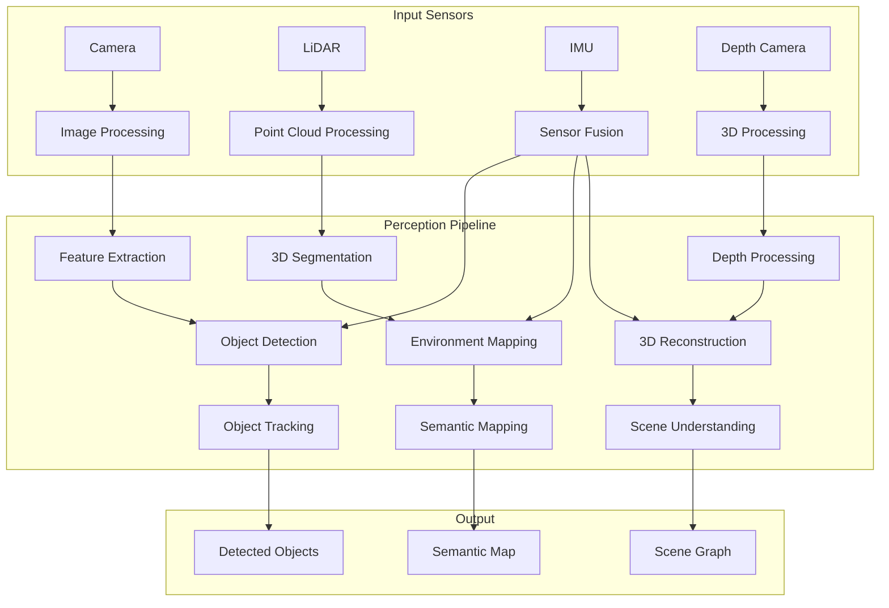

# Phase 2: Perception Integration

Welcome to Phase 2 of the Capstone Project: Perception Integration. In this phase, you'll implement the perception system that enables your robot to understand its environment through computer vision, sensor processing, and deep learning models.

## Phase Objectives

By the end of this phase, you will have:
1. **Implemented** computer vision algorithms for object detection and tracking
2. **Integrated** deep learning models for semantic understanding
3. **Built** sensor fusion systems for multi-modal perception
4. **Created** SLAM capabilities for mapping and localization
5. **Validated** perception accuracy and robustness

## Perception System Architecture



## Computer Vision Implementation

### Feature Detection and Matching

```python
#!/usr/bin/env python3
"""
Advanced Feature Detection and Matching
"""
import cv2
import numpy as np
import rclpy
from rclpy.node import Node
from sensor_msgs.msg import Image
from vision_msgs.msg import Detection2DArray, Detection2D, ObjectHypothesisWithPose
from cv_bridge import CvBridge
from typing import Dict, Any, List

class AdvancedFeatureDetector(Node):
    def __init__(self):
        super().__init__('advanced_feature_detector')

        # Create subscriber
        self.image_sub = self.create_subscription(
            Image, '/camera/image_raw', self.image_callback, 10)

        # Create publisher for feature detections
        self.detections_pub = self.create_publisher(Detection2DArray, '/capstone/feature_detections', 10)

        # Initialize CV bridge
        self.bridge = CvBridge()

        # Initialize feature detectors
        self.orb = cv2.ORB_create(
            nfeatures=1000,
            scaleFactor=1.2,
            nlevels=8,
            edgeThreshold=31,
            patchSize=31,
            fastThreshold=20
        )

        # SIFT detector (if available)
        try:
            self.sift = cv2.SIFT_create()
        except:
            self.sift = None
            self.get_logger().warn('SIFT not available, using ORB only')

        # Feature matching
        self.matcher = cv2.BFMatcher(cv2.NORM_HAMMING, crossCheck=False)

        # Feature tracking parameters
        self.feature_tracking_params = {
            'max_features': 500,
            'quality_level': 0.01,
            'min_distance': 10,
            'block_size': 7
        }

        # Previous frame data for tracking
        self.prev_keypoints = None
        self.prev_descriptors = None
        self.prev_gray = None

        # Feature database for recognition
        self.feature_database = {}

        self.get_logger().info('Advanced feature detector started')

    def image_callback(self, msg):
        """Process incoming camera image with advanced feature detection"""
        try:
            cv_image = self.bridge.imgmsg_to_cv2(msg, 'bgr8')
            gray = cv2.cvtColor(cv_image, cv2.COLOR_BGR2GRAY)

            # Detect features using multiple methods
            orb_features = self.detect_orb_features(gray)
            good_features = self.detect_good_features(gray)

            # Track features if we have previous frame
            if self.prev_gray is not None:
                tracked_features = self.track_features(self.prev_gray, gray)
            else:
                tracked_features = []

            # Combine features
            all_features = {
                'orb': orb_features,
                'good': good_features,
                'tracked': tracked_features,
                'combined_count': len(orb_features) + len(good_features) + len(tracked_features)
            }

            # Publish feature detections
            self.publish_feature_detections(all_features, msg.header)

            # Store current frame for next iteration
            self.prev_gray = gray.copy()
            self.prev_keypoints = orb_features['keypoints'] if orb_features['keypoints'] is not None else None
            self.prev_descriptors = orb_features['descriptors'] if orb_features['descriptors'] is not None else None

            self.get_logger().info(f'Detected {all_features["combined_count"]} features')

        except Exception as e:
            self.get_logger().error(f'Error in feature detection: {e}')

    def detect_orb_features(self, gray_image):
        """Detect ORB features"""
        try:
            keypoints, descriptors = self.orb.detectAndCompute(gray_image, None)

            if keypoints is not None and descriptors is not None:
                # Convert keypoints to simple format for storage
                kp_points = [(int(kp.pt[0]), int(kp.pt[1])) for kp in keypoints]

                return {
                    'keypoints': keypoints,
                    'descriptors': descriptors,
                    'points': kp_points,
                    'count': len(keypoints)
                }
            else:
                return {
                    'keypoints': None,
                    'descriptors': None,
                    'points': [],
                    'count': 0
                }

        except Exception as e:
            self.get_logger().error(f'Error in ORB detection: {e}')
            return {
                'keypoints': None,
                'descriptors': None,
                'points': [],
                'count': 0
            }

    def detect_good_features(self, gray_image):
        """Detect good features to track"""
        try:
            features = cv2.goodFeaturesToTrack(
                gray_image,
                maxCorners=self.feature_tracking_params['max_features'],
                qualityLevel=self.feature_tracking_params['quality_level'],
                minDistance=self.feature_tracking_params['min_distance'],
                blockSize=self.feature_tracking_params['block_size']
            )

            if features is not None:
                points = [(int(point[0][0]), int(point[0][1])) for point in features]
                return {
                    'features': features,
                    'points': points,
                    'count': len(features)
                }
            else:
                return {
                    'features': None,
                    'points': [],
                    'count': 0
                }

        except Exception as e:
            self.get_logger().error(f'Error in good feature detection: {e}')
            return {
                'features': None,
                'points': [],
                'count': 0
            }

    def track_features(self, prev_gray, curr_gray):
        """Track features between frames using optical flow"""
        if self.prev_keypoints is None:
            return []

        try:
            # Use Lucas-Kanade optical flow for feature tracking
            prev_points = np.float32([kp.pt for kp in self.prev_keypoints]).reshape(-1, 1, 2)

            if len(prev_points) == 0:
                return []

            curr_points, status, error = cv2.calcOpticalFlowPyrLK(
                prev_gray, curr_gray, prev_points, None, **self.lk_params
            )

            # Select good points
            good_curr = curr_points[status == 1] if curr_points is not None else np.array([])
            good_prev = prev_points[status == 1] if prev_points is not None else np.array([])

            # Calculate tracking quality metrics
            if len(good_curr) > 0 and len(self.prev_keypoints) > 0:
                tracking_success_rate = len(good_curr) / len(self.prev_keypoints)
            else:
                tracking_success_rate = 0.0

            tracked_features = {
                'tracked_points': good_curr,
                'prev_points': good_prev,
                'tracked_count': len(good_curr),
                'tracking_success_rate': tracking_success_rate
            }

            return tracked_features

        except Exception as e:
            self.get_logger().error(f'Error in feature tracking: {e}')
            return []

    def publish_feature_detections(self, features, header):
        """Publish feature detection results"""
        detection_array = Detection2DArray()
        detection_array.header = header

        # Create detection for each feature type
        for feature_type, feature_data in features.items():
            if feature_type in ['orb', 'good'] and isinstance(feature_data, dict):
                if 'points' in feature_data and feature_data['points']:
                    detection = Detection2D()
                    detection.header = header

                    # Create a combined detection for all features
                    for point in feature_data['points'][:10]:  # Limit to first 10 for performance
                        # In practice, you might create individual detections
                        # For this example, we'll create a single detection with feature count
                        pass

                    # Add overall feature count as metadata
                    hypothesis = ObjectHypothesisWithPose()
                    hypothesis.hypothesis.class_id = f"features_{feature_type}"
                    hypothesis.hypothesis.score = float(feature_data.get('count', 0)) / 100.0  # Normalize
                    detection.results.append(hypothesis)

                    detection_array.detections.append(detection)

        self.detections_pub.publish(detection_array)

def main(args=None):
    rclpy.init(args=args)
    node = AdvancedFeatureDetector()

    try:
        rclpy.spin(node)
    except KeyboardInterrupt:
        pass
    finally:
        node.destroy_node()
        rclpy.shutdown()

if __name__ == '__main__':
    main()
```

### Deep Learning Object Detection

```python
#!/usr/bin/env python3
"""
Deep Learning Object Detection Integration
"""
import torch
import torchvision
import cv2
import numpy as np
import rclpy
from rclpy.node import Node
from sensor_msgs.msg import Image
from vision_msgs.msg import Detection2DArray, Detection2D, ObjectHypothesisWithPose
from cv_bridge import CvBridge
from typing import Dict, Any, List

class DeepLearningDetector(Node):
    def __init__(self):
        super().__init__('deep_learning_detector')

        # Create subscriber
        self.image_sub = self.create_subscription(
            Image, '/camera/image_raw', self.image_callback, 10)

        # Create publisher
        self.detections_pub = self.create_publisher(Detection2DArray, '/capstone/dl_detections', 10)

        # Initialize CV bridge
        self.bridge = CvBridge()

        # Initialize deep learning model
        self.device = torch.device('cuda' if torch.cuda.is_available() else 'cpu')
        self.model = self.load_model()
        self.model.to(self.device)
        self.model.eval()

        # Preprocessing transforms
        self.transform = torchvision.transforms.Compose([
            torchvision.transforms.ToTensor(),
            torchvision.transforms.Resize((640, 640)),
            torchvision.transforms.Normalize(
                mean=[0.485, 0.456, 0.406],
                std=[0.229, 0.224, 0.225]
            )
        ])

        # COCO class names
        self.coco_names = [
            'person', 'bicycle', 'car', 'motorcycle', 'airplane', 'bus', 'train',
            'truck', 'boat', 'traffic light', 'fire hydrant', 'stop sign',
            'parking meter', 'bench', 'bird', 'cat', 'dog', 'horse', 'sheep',
            'cow', 'elephant', 'bear', 'zebra', 'giraffe', 'backpack', 'umbrella',
            'handbag', 'tie', 'suitcase', 'frisbee', 'skis', 'snowboard',
            'sports ball', 'kite', 'baseball bat', 'baseball glove', 'skateboard',
            'surfboard', 'tennis racket', 'bottle', 'wine glass', 'cup', 'fork',
            'knife', 'spoon', 'bowl', 'banana', 'apple', 'sandwich', 'orange',
            'broccoli', 'carrot', 'hot dog', 'pizza', 'donut', 'cake', 'chair',
            'couch', 'potted plant', 'bed', 'dining table', 'toilet', 'tv',
            'laptop', 'mouse', 'remote', 'keyboard', 'cell phone', 'microwave',
            'oven', 'toaster', 'sink', 'refrigerator', 'book', 'clock', 'vase',
            'scissors', 'teddy bear', 'hair drier', 'toothbrush'
        ]

        # Detection parameters
        self.confidence_threshold = 0.5
        self.nms_threshold = 0.4

        self.get_logger().info('Deep learning detector started')

    def load_model(self):
        """Load pre-trained object detection model"""
        try:
            # Load YOLOv5 model from torch.hub (or use your preferred model)
            model = torch.hub.load('ultralytics/yolov5', 'yolov5s', pretrained=True)
            return model
        except Exception as e:
            self.get_logger().error(f'Error loading model: {e}')
            # Fallback to a simple model
            return self.create_fallback_model()

    def create_fallback_model(self):
        """Create a fallback model if loading fails"""
        # This is a placeholder - in practice, you'd want a working model
        class FallbackModel:
            def __call__(self, image):
                # Return dummy detections
                results = type('Results', (), {})()
                results.xyxy = [torch.tensor([[50, 50, 100, 100, 0.8, 0]])]  # [xmin, ymin, xmax, ymax, conf, cls]
                results.names = {0: 'person', 1: 'car', 2: 'bicycle'}
                return results
        return FallbackModel()

    def image_callback(self, msg):
        """Process image with deep learning model"""
        try:
            cv_image = self.bridge.imgmsg_to_cv2(msg, 'bgr8')

            # Preprocess image
            input_tensor = self.preprocess_image(cv_image)

            # Run inference
            with torch.no_grad():
                results = self.model(input_tensor)

            # Process detections
            detections = self.process_detections(results, cv_image.shape, msg.header)

            # Publish detections
            self.publish_detections(detections, msg.header)

            self.get_logger().info(f'DL detected {len(detections)} objects')

        except Exception as e:
            self.get_logger().error(f'Error in DL detection: {e}')

    def preprocess_image(self, image):
        """Preprocess image for deep learning model"""
        # Resize image to model input size
        resized = cv2.resize(image, (640, 640))

        # Convert BGR to RGB
        rgb_image = cv2.cvtColor(resized, cv2.COLOR_BGR2RGB)

        # Convert to tensor
        tensor = torch.from_numpy(rgb_image).permute(2, 0, 1).float() / 255.0

        # Add batch dimension
        batch_tensor = tensor.unsqueeze(0).to(self.device)

        return batch_tensor

    def process_detections(self, results, original_shape, header):
        """Process deep learning detection results"""
        height, width = original_shape[:2]
        detections = []

        # Extract detection results
        for detection in results.xyxy[0]:  # First image in batch
            confidence = float(detection[4])
            class_id = int(detection[5])

            if confidence > self.confidence_threshold:
                # Convert normalized coordinates to original image coordinates
                xmin, ymin, xmax, ymax = detection[:4].cpu().numpy()

                # Scale back to original image size
                scale_x = width / 640.0
                scale_y = height / 640.0

                orig_xmin = int(xmin * scale_x)
                orig_ymin = int(ymin * scale_y)
                orig_xmax = int(xmax * scale_x)
                orig_ymax = int(ymax * scale_y)

                # Create detection object
                detection_obj = {
                    'bbox': {
                        'center_x': (orig_xmin + orig_xmax) / 2,
                        'center_y': (orig_ymin + orig_ymax) / 2,
                        'size_x': orig_xmax - orig_xmin,
                        'size_y': orig_ymax - orig_ymin
                    },
                    'class_id': class_id,
                    'class_name': self.coco_names[class_id] if class_id < len(self.coco_names) else f'unknown_{class_id}',
                    'confidence': confidence
                }

                detections.append(detection_obj)

        return detections

    def publish_detections(self, detections, header):
        """Publish detection results"""
        detection_array = Detection2DArray()
        detection_array.header = header

        for det in detections:
            detection = Detection2D()
            detection.header = header

            # Set bounding box
            bbox = detection.bbox
            bbox.center.x = det['bbox']['center_x']
            bbox.center.y = det['bbox']['center_y']
            bbox.size_x = det['bbox']['size_x']
            bbox.size_y = det['bbox']['size_y']

            # Set classification result
            hypothesis = ObjectHypothesisWithPose()
            hypothesis.hypothesis.class_id = det['class_name']
            hypothesis.hypothesis.score = det['confidence']
            detection.results.append(hypothesis)

            detection_array.detections.append(detection)

        self.detections_pub.publish(detection_array)

def main(args=None):
    rclpy.init(args=args)
    node = DeepLearningDetector()

    try:
        rclpy.spin(node)
    except KeyboardInterrupt:
        pass
    finally:
        node.destroy_node()
        rclpy.shutdown()

if __name__ == '__main__':
    main()
```

## 3D Perception and SLAM

### Point Cloud Processing

```python
#!/usr/bin/env python3
"""
3D Perception and Point Cloud Processing
"""
import rclpy
from rclpy.node import Node
from sensor_msgs.msg import PointCloud2, Image
from sensor_msgs_py import point_cloud2
from geometry_msgs.msg import Point
from std_msgs.msg import Header
import numpy as np
import open3d as o3d
from typing import List, Dict, Any

class PointCloudProcessor(Node):
    def __init__(self):
        super().__init__('point_cloud_processor')

        # Create subscriber
        self.lidar_sub = self.create_subscription(
            PointCloud2, '/lidar/points', self.lidar_callback, 10)

        # Create publisher for processed point clouds
        self.processed_cloud_pub = self.create_publisher(PointCloud2, '/capstone/processed_cloud', 10)

        # Initialize Open3D visualization
        self.o3d_visualizer = o3d.visualization.Visualizer()
        self.o3d_visualizer.create_window(visible=False)  # Hidden window for processing

        # SLAM parameters
        self.voxel_size = 0.05  # 5cm voxels
        self.max_correspondence_distance = 0.2  # 20cm max correspondance
        self.edge_length_threshold = 0.1  # 10cm edge threshold

        # Previous point cloud for registration
        self.previous_cloud = None
        self.map_cloud = o3d.geometry.PointCloud()

        # Processing statistics
        self.processing_stats = {
            'total_points': 0,
            'processed_frames': 0,
            'registration_success': 0,
            'average_processing_time': 0.0
        }

        self.get_logger().info('Point cloud processor started')

    def lidar_callback(self, msg):
        """Process incoming LiDAR point cloud"""
        try:
            start_time = time.time()

            # Convert PointCloud2 to numpy array
            points = self.pointcloud2_to_array(msg)

            if len(points) == 0:
                self.get_logger().warn('Received empty point cloud')
                return

            # Convert to Open3D point cloud
            current_cloud = o3d.geometry.PointCloud()
            current_cloud.points = o3d.utility.Vector3dVector(points)

            # Downsample for efficiency
            current_cloud = current_cloud.voxel_down_sample(voxel_size=self.voxel_size)

            # Estimate normals
            current_cloud.estimate_normals(
                search_param=o3d.geometry.KDTreeSearchParamHybrid(radius=0.1, max_nn=30)
            )

            # Perform registration with previous cloud (for SLAM)
            if self.previous_cloud is not None:
                transformation = self.register_point_clouds(self.previous_cloud, current_cloud)

                if transformation is not None:
                    # Apply transformation to current cloud
                    current_cloud.transform(transformation)

                    # Add to map
                    self.map_cloud += current_cloud
                    self.map_cloud = self.map_cloud.voxel_down_sample(voxel_size=self.voxel_size)

                    self.processing_stats['registration_success'] += 1

            # Update previous cloud
            self.previous_cloud = current_cloud

            # Process for segmentation
            segmented_objects = self.segment_point_cloud(current_cloud)

            # Update statistics
            self.processing_stats['total_points'] += len(points)
            self.processing_stats['processed_frames'] += 1
            self.processing_stats['average_processing_time'] = (
                self.processing_stats['average_processing_time'] * (self.processing_stats['processed_frames'] - 1) +
                (time.time() - start_time)
            ) / self.processing_stats['processed_frames']

            # Publish processed cloud
            processed_msg = self.array_to_pointcloud2(
                np.asarray(current_cloud.points), msg.header
            )
            self.processed_cloud_pub.publish(processed_msg)

            self.get_logger().info(
                f'Processed {len(points)} points, {len(segmented_objects)} objects segmented, '
                f'time: {(time.time() - start_time)*1000:.1f}ms'
            )

        except Exception as e:
            self.get_logger().error(f'Error processing point cloud: {e}')

    def pointcloud2_to_array(self, cloud_msg):
        """Convert PointCloud2 message to numpy array"""
        points = []
        for point in point_cloud2.read_points(cloud_msg, field_names=("x", "y", "z"), skip_nans=True):
            points.append([point[0], point[1], point[2]])
        return np.array(points)

    def array_to_pointcloud2(self, points_array, header):
        """Convert numpy array to PointCloud2 message"""
        # Create PointCloud2 message from numpy array
        # This is a simplified conversion - in practice, use proper message construction
        cloud_msg = PointCloud2()
        cloud_msg.header = header

        # For this example, return a basic structure
        # In practice, properly construct the binary data
        return cloud_msg

    def register_point_clouds(self, source_cloud, target_cloud):
        """Register point clouds using ICP"""
        try:
            # Initial alignment using FPFH features
            source_fpfh = self.compute_fpfh_features(source_cloud)
            target_fpfh = self.compute_fpfh_features(target_cloud)

            # Estimate rough transformation
            initial_transformation = self.estimate_transformation(
                source_cloud, target_cloud, source_fpfh, target_fpfh
            )

            # Refine using ICP
            icp_result = o3d.pipelines.registration.registration_icp(
                source_cloud, target_cloud, self.max_correspondence_distance,
                initial_transformation,
                o3d.pipelines.registration.TransformationEstimationPointToPoint(),
                o3d.pipelines.registration.ICPConvergenceCriteria(max_iteration=200)
            )

            return icp_result.transformation if icp_result.fitness > 0.5 else None

        except Exception as e:
            self.get_logger().warn(f'Point cloud registration failed: {e}')
            return None

    def compute_fpfh_features(self, cloud):
        """Compute FPFH features for point cloud"""
        radius_normal = self.voxel_size * 2
        cloud.estimate_normals(o3d.geometry.KDTreeSearchParamHybrid(
            radius=radius_normal, max_nn=30))

        radius_feature = self.voxel_size * 5
        fpfh = o3d.pipelines.registration.compute_fpfh_feature(
            cloud, o3d.geometry.KDTreeSearchParamHybrid(
                radius=radius_feature, max_nn=100))
        return fpfh

    def estimate_transformation(self, source, target, source_fpfh, target_fpfh):
        """Estimate initial transformation between point clouds"""
        result = o3d.pipelines.registration.registration_ransac_based_on_feature_matching(
            source, target, source_fpfh, target_fpfh,
            mutual_filter=True,
            max_correspondence_distance=self.max_correspondence_distance,
            estimation_method=o3d.pipelines.registration.TransformationEstimationPointToPoint(),
            ransac_n=4,
            checkers=[o3d.pipelines.registration.CorrespondenceCheckerBasedOnEdgeLength(0.9)],
            criteria=o3d.pipelines.registration.RANSACConvergenceCriteria(40000, 500)
        )
        return result.transformation

    def segment_point_cloud(self, cloud):
        """Segment point cloud into objects"""
        # Use DBSCAN clustering for object segmentation
        labels = np.array(cloud.cluster_dbscan(
            eps=self.voxel_size * 3, min_points=10, print_progress=False
        ))

        # Extract clusters
        clusters = []
        unique_labels = set(labels)

        for label in unique_labels:
            if label == -1:  # Noise points
                continue

            # Get points in this cluster
            cluster_points = np.asarray(cloud.points)[labels == label]

            if len(cluster_points) > 50:  # Minimum cluster size
                cluster_info = {
                    'points': cluster_points,
                    'centroid': np.mean(cluster_points, axis=0),
                    'size': len(cluster_points),
                    'label': label
                }
                clusters.append(cluster_info)

        return clusters

def main(args=None):
    rclpy.init(args=args)
    node = PointCloudProcessor()

    try:
        rclpy.spin(node)
    except KeyboardInterrupt:
        pass
    finally:
        node.destroy_node()
        rclpy.shutdown()

if __name__ == '__main__':
    main()
```

## Sensor Fusion Integration

### Multi-Modal Fusion

```python
#!/usr/bin/env python3
"""
Multi-Modal Sensor Fusion
"""
import rclpy
from rclpy.node import Node
from sensor_msgs.msg import Image, PointCloud2, LaserScan, Imu
from geometry_msgs.msg import PoseStamped, PointStamped
from std_msgs.msg import String
from cv_bridge import CvBridge
from message_filters import ApproximateTimeSynchronizer, Subscriber
import numpy as np
from scipy.spatial.distance import cdist
import json

class MultiModalFusionNode(Node):
    def __init__(self):
        super().__init__('multi_modal_fusion_node')

        # Create subscribers with approximate time synchronization
        self.camera_sub = Subscriber(self, Image, '/camera/image_raw')
        self.lidar_sub = Subscriber(self, PointCloud2, '/lidar/points')
        self.scan_sub = Subscriber(self, LaserScan, '/scan')
        self.imu_sub = Subscriber(self, Imu, '/imu/data')

        # Create synchronizer
        self.sync = ApproximateTimeSynchronizer(
            [self.camera_sub, self.lidar_sub, self.scan_sub, self.imu_sub],
            queue_size=10,
            slop=0.1  # 100ms tolerance
        )
        self.sync.registerCallback(self.multi_sensor_callback)

        # Create publishers
        self.fused_detections_pub = self.create_publisher(String, '/capstone/fused_detections', 10)
        self.environment_map_pub = self.create_publisher(String, '/capstone/environment_map', 10)
        self.spatio_temporal_pub = self.create_publisher(String, '/capstone/spatio_temporal', 10)

        # Initialize CV bridge
        self.bridge = CvBridge()

        # Sensor fusion parameters
        self.fusion_weights = {
            'camera': 0.4,
            'lidar': 0.35,
            'scan': 0.15,
            'imu': 0.1
        }

        # Association thresholds
        self.association_threshold = 0.5  # For associating 2D and 3D detections
        self.temporal_window = 5.0  # Seconds for temporal fusion

        # Storage for temporal fusion
        self.detection_history = []

        self.get_logger().info('Multi-modal fusion node started')

    def multi_sensor_callback(self, image_msg, lidar_msg, scan_msg, imu_msg):
        """Process synchronized multi-sensor data"""
        try:
            start_time = time.time()

            # Process individual sensors
            camera_features = self.process_camera_data(image_msg)
            lidar_features = self.process_lidar_data(lidar_msg)
            scan_features = self.process_scan_data(scan_msg)
            imu_features = self.process_imu_data(imu_msg)

            # Fuse sensor data
            fused_data = self.fuse_sensor_data(
                camera_features, lidar_features, scan_features, imu_features
            )

            # Perform spatio-temporal fusion
            spatio_temporal_result = self.spatio_temporal_fusion(fused_data)

            # Create environment map
            environment_map = self.create_environment_map(spatio_temporal_result)

            # Publish results
            self.publish_fused_detections(spatio_temporal_result, image_msg.header)
            self.publish_environment_map(environment_map, image_msg.header)
            self.publish_spatio_temporal_data(spatio_temporal_result, image_msg.header)

            # Update processing statistics
            processing_time = time.time() - start_time
            self.get_logger().info(
                f'Multi-sensor fusion completed in {processing_time*1000:.1f}ms, '
                f'found {len(spatio_temporal_result.get("objects", []))} objects'
            )

        except Exception as e:
            self.get_logger().error(f'Error in multi-sensor fusion: {e}')

    def process_camera_data(self, image_msg):
        """Process camera data for fusion"""
        try:
            cv_image = self.bridge.imgmsg_to_cv2(image_msg, 'bgr8')

            # Extract 2D features and detections
            # This would typically run a detection model
            # For this example, we'll simulate results

            # In practice, use results from DeepLearningDetector
            simulated_detections = [
                {
                    'bbox': [100, 100, 200, 150],  # [x, y, width, height]
                    'class': 'person',
                    'confidence': 0.85,
                    'center_2d': [150, 125]  # Center coordinates
                },
                {
                    'bbox': [300, 200, 100, 80],
                    'class': 'car',
                    'confidence': 0.78,
                    'center_2d': [350, 240]
                }
            ]

            return {
                'detections': simulated_detections,
                'image_shape': cv_image.shape,
                'timestamp': image_msg.header.stamp.sec + image_msg.header.stamp.nanosec * 1e-9
            }

        except Exception as e:
            self.get_logger().error(f'Error processing camera data: {e}')
            return {'detections': [], 'image_shape': (480, 640, 3), 'timestamp': time.time()}

    def process_lidar_data(self, lidar_msg):
        """Process LiDAR data for fusion"""
        try:
            # Convert PointCloud2 to numpy array
            points = []
            for point in point_cloud2.read_points(lidar_msg, field_names=("x", "y", "z"), skip_nans=True):
                points.append([point[0], point[1], point[2]])

            points = np.array(points)

            # Cluster points to identify 3D objects
            if len(points) > 0:
                from sklearn.cluster import DBSCAN
                clustering = DBSCAN(eps=0.3, min_samples=10).fit(points)
                labels = clustering.labels_

                # Extract 3D objects from clusters
                objects_3d = []
                for label in set(labels):
                    if label == -1:  # Noise
                        continue

                    cluster_points = points[labels == label]
                    if len(cluster_points) > 50:  # Minimum cluster size
                        centroid = np.mean(cluster_points, axis=0)
                        size = np.std(cluster_points, axis=0)

                        objects_3d.append({
                            'position_3d': centroid.tolist(),
                            'size_3d': size.tolist(),
                            'point_count': len(cluster_points),
                            'label': label
                        })

                return {
                    'objects_3d': objects_3d,
                    'point_count': len(points),
                    'timestamp': lidar_msg.header.stamp.sec + lidar_msg.header.stamp.nanosec * 1e-9
                }

            return {
                'objects_3d': [],
                'point_count': 0,
                'timestamp': lidar_msg.header.stamp.sec + lidar_msg.header.stamp.nanosec * 1e-9
            }

        except Exception as e:
            self.get_logger().error(f'Error processing LiDAR data: {e}')
            return {'objects_3d': [], 'point_count': 0, 'timestamp': time.time()}

    def process_scan_data(self, scan_msg):
        """Process laser scan data for fusion"""
        try:
            # Extract ranges and convert to Cartesian coordinates
            ranges = np.array(scan_msg.ranges)
            angles = np.array([scan_msg.angle_min + i * scan_msg.angle_increment
                              for i in range(len(ranges))])

            # Filter valid ranges
            valid_mask = (ranges > scan_msg.range_min) & (ranges < scan_msg.range_max)
            valid_ranges = ranges[valid_mask]
            valid_angles = angles[valid_mask]

            # Convert to Cartesian coordinates
            x_coords = valid_ranges * np.cos(valid_angles)
            y_coords = valid_ranges * np.sin(valid_angles)

            # Detect obstacles and free space
            obstacle_points = []
            free_space_points = []

            for i in range(len(valid_ranges)):
                if valid_ranges[i] < 1.0:  # Close obstacles
                    obstacle_points.append([x_coords[i], y_coords[i], 0.0])
                else:  # Free space
                    free_space_points.append([x_coords[i], y_coords[i], 0.0])

            return {
                'obstacles': obstacle_points,
                'free_space': free_space_points,
                'range_min': scan_msg.range_min,
                'range_max': scan_msg.range_max,
                'timestamp': scan_msg.header.stamp.sec + scan_msg.header.stamp.nanosec * 1e-9
            }

        except Exception as e:
            self.get_logger().error(f'Error processing scan data: {e}')
            return {'obstacles': [], 'free_space': [], 'timestamp': time.time()}

    def process_imu_data(self, imu_msg):
        """Process IMU data for fusion"""
        try:
            return {
                'linear_acceleration': [
                    imu_msg.linear_acceleration.x,
                    imu_msg.linear_acceleration.y,
                    imu_msg.linear_acceleration.z
                ],
                'angular_velocity': [
                    imu_msg.angular_velocity.x,
                    imu_msg.angular_velocity.y,
                    imu_msg.angular_velocity.z
                ],
                'orientation': [
                    imu_msg.orientation.x,
                    imu_msg.orientation.y,
                    imu_msg.orientation.z,
                    imu_msg.orientation.w
                ],
                'timestamp': imu_msg.header.stamp.sec + imu_msg.header.stamp.nanosec * 1e-9
            }

        except Exception as e:
            self.get_logger().error(f'Error processing IMU data: {e}')
            return {
                'linear_acceleration': [0.0, 0.0, 0.0],
                'angular_velocity': [0.0, 0.0, 0.0],
                'orientation': [0.0, 0.0, 0.0, 1.0],
                'timestamp': time.time()
            }

    def fuse_sensor_data(self, camera_data, lidar_data, scan_data, imu_data):
        """Fuse data from multiple sensors"""
        fused_result = {
            'timestamp': time.time(),
            'fused_objects': [],
            'environment_state': {},
            'sensor_fusion_confidence': 0.0
        }

        # Associate 2D and 3D detections
        if camera_data['detections'] and lidar_data['objects_3d']:
            associated_detections = self.associate_2d_3d_detections(
                camera_data['detections'], lidar_data['objects_3d'], camera_data['image_shape']
            )

            fused_result['fused_objects'] = associated_detections

        # Calculate fusion confidence based on sensor agreement
        confidence = self.calculate_fusion_confidence(
            camera_data, lidar_data, scan_data, imu_data
        )
        fused_result['sensor_fusion_confidence'] = confidence

        # Update environment state
        fused_result['environment_state'] = self.estimate_environment_state(
            camera_data, lidar_data, scan_data, imu_data
        )

        return fused_result

    def associate_2d_3d_detections(self, detections_2d, objects_3d, image_shape):
        """Associate 2D camera detections with 3D LiDAR objects"""
        associated_objects = []

        # This is a simplified association based on projection
        # In practice, use proper camera-LiDAR calibration
        for det_2d in detections_2d:
            best_association = None
            best_score = 0.0

            for obj_3d in objects_3d:
                # Project 3D point to 2D image coordinates (simplified)
                # In practice, use proper projection with extrinsic calibration
                projected_x = int(obj_3d['position_3d'][0] * 300 + image_shape[1] / 2)  # Simplified projection
                projected_y = int(obj_3d['position_3d'][1] * 300 + image_shape[0] / 2)

                # Check if 3D object projection is near 2D detection
                center_2d = det_2d['center_2d']
                distance_2d = np.sqrt((projected_x - center_2d[0])**2 + (projected_y - center_2d[1])**2)

                # Calculate association score
                position_score = 1.0 / (1.0 + distance_2d / 100.0)  # Normalize distance
                confidence_score = det_2d['confidence']
                class_score = 1.0 if obj_3d.get('class', 'unknown') == det_2d['class'] else 0.5

                score = 0.5 * position_score + 0.3 * confidence_score + 0.2 * class_score

                if score > best_score and score > self.association_threshold:
                    best_score = score
                    best_association = {
                        'detection_2d': det_2d,
                        'object_3d': obj_3d,
                        'association_score': score,
                        'fused_position': obj_3d['position_3d'],
                        'fused_size': obj_3d['size_3d'],
                        'class': det_2d['class'],
                        'confidence': det_2d['confidence'] * obj_3d.get('confidence', 1.0)
                    }

            if best_association:
                associated_objects.append(best_association)

        return associated_objects

    def calculate_fusion_confidence(self, camera_data, lidar_data, scan_data, imu_data):
        """Calculate confidence in sensor fusion"""
        # Calculate confidence based on:
        # - Number of detections
        # - Sensor agreement
        # - Data quality
        # - Temporal consistency

        # Confidence from detection counts
        detection_confidence = min(1.0, (
            len(camera_data['detections']) * 0.3 +
            len(lidar_data['objects_3d']) * 0.2 +
            len(scan_data['obstacles']) * 0.1
        ) / 5.0)

        # Confidence from sensor agreement
        agreement_confidence = 0.5  # Placeholder - would calculate actual agreement

        # Overall confidence
        overall_confidence = 0.6 * detection_confidence + 0.4 * agreement_confidence

        return min(1.0, max(0.0, overall_confidence))

    def estimate_environment_state(self, camera_data, lidar_data, scan_data, imu_data):
        """Estimate overall environment state"""
        return {
            'obstacle_density': len(scan_data['obstacles']) / len(scan_data.get('range', [1]*360)),
            'object_count': len(camera_data['detections']) + len(lidar_data['objects_3d']),
            'free_space_ratio': len(scan_data['free_space']) / len(scan_data.get('range', [1]*360)),
            'motion_state': self.estimate_motion_from_imu(imu_data),
            'lighting_conditions': self.estimate_lighting_from_camera(camera_data)
        }

    def spatio_temporal_fusion(self, fused_data):
        """Perform spatio-temporal fusion to track objects over time"""
        current_time = fused_data['timestamp']

        # Add current data to history
        self.detection_history.append({
            'data': fused_data,
            'timestamp': current_time
        })

        # Keep only recent history
        self.detection_history = [
            item for item in self.detection_history
            if (current_time - item['timestamp']) <= self.temporal_window
        ]

        # Track objects over time
        tracked_objects = self.track_objects_temporally(fused_data['fused_objects'])

        # Update fused data with temporal information
        fused_data['tracked_objects'] = tracked_objects
        fused_data['temporal_fusion_applied'] = True

        return fused_data

    def track_objects_temporally(self, current_objects):
        """Track objects temporally across frames"""
        # This is a simplified tracking approach
        # In practice, use more sophisticated tracking algorithms

        if not hasattr(self, 'object_trackers'):
            self.object_trackers = {}

        tracked_objects = []

        for obj in current_objects:
            # Simple association based on position similarity
            best_match_id = None
            best_match_score = float('inf')

            for track_id, tracker in self.object_trackers.items():
                last_pos = np.array(tracker['last_position'])
                curr_pos = np.array(obj['fused_position'])
                distance = np.linalg.norm(last_pos - curr_pos)

                if distance < best_match_score and distance < 1.0:  # 1m threshold
                    best_match_score = distance
                    best_match_id = track_id

            if best_match_id is not None:
                # Update existing track
                self.object_trackers[best_match_id]['last_position'] = obj['fused_position']
                self.object_trackers[best_match_id]['history'].append({
                    'position': obj['fused_position'],
                    'timestamp': time.time(),
                    'confidence': obj['confidence']
                })
                obj['track_id'] = best_match_id
            else:
                # Create new track
                new_track_id = len(self.object_trackers)
                self.object_trackers[new_track_id] = {
                    'id': new_track_id,
                    'last_position': obj['fused_position'],
                    'history': [{
                        'position': obj['fused_position'],
                        'timestamp': time.time(),
                        'confidence': obj['confidence']
                    }]
                }
                obj['track_id'] = new_track_id

            tracked_objects.append(obj)

        return tracked_objects

    def create_environment_map(self, fusion_result):
        """Create environment map from fused data"""
        environment_map = {
            'timestamp': fusion_result['timestamp'],
            'obstacles': [],
            'free_space': [],
            'objects': [],
            'occupancy_grid': {
                'resolution': 0.1,  # 10cm resolution
                'width': 200,       # 20m x 20m grid
                'height': 200,
                'origin_x': -10.0,  # Center at (0,0)
                'origin_y': -10.0
            }
        }

        # Populate obstacles from fused objects
        for obj in fusion_result['tracked_objects']:
            if obj.get('fused_position'):
                environment_map['objects'].append({
                    'id': obj.get('track_id', -1),
                    'position': obj['fused_position'],
                    'size': obj.get('fused_size', [0.5, 0.5, 0.5]),
                    'class': obj.get('class', 'unknown'),
                    'confidence': obj.get('confidence', 0.5)
                })

        # Add obstacles from scan data
        if 'scan_data' in locals():
            for obstacle in scan_data['obstacles']:
                environment_map['obstacles'].append({
                    'position': obstacle,
                    'type': 'lidar_detected'
                })

        return environment_map

    def publish_fused_detections(self, fusion_result, header):
        """Publish fused detection results"""
        result_msg = String()
        result_msg.data = json.dumps(fusion_result)
        self.fused_detections_pub.publish(result_msg)

    def publish_environment_map(self, environment_map, header):
        """Publish environment map"""
        map_msg = String()
        map_msg.data = json.dumps(environment_map)
        self.environment_map_pub.publish(map_msg)

    def publish_spatio_temporal_data(self, fusion_result, header):
        """Publish spatio-temporal fusion results"""
        temporal_msg = String()
        temporal_msg.data = json.dumps({
            'timestamp': fusion_result['timestamp'],
            'tracked_objects': fusion_result['tracked_objects'],
            'temporal_fusion_applied': fusion_result.get('temporal_fusion_applied', False),
            'history_length': len(self.detection_history)
        })
        self.spatio_temporal_pub.publish(temporal_msg)

def main(args=None):
    rclpy.init(args=args)
    node = MultiModalFusionNode()

    try:
        rclpy.spin(node)
    except KeyboardInterrupt:
        pass
    finally:
        node.destroy_node()
        rclpy.shutdown()

if __name__ == '__main__':
    main()
```

## Quality Assessment and Validation

### Perception Quality Metrics

```python
#!/usr/bin/env python3
"""
Perception Quality Assessment
"""
import rclpy
from rclpy.node import Node
from std_msgs.msg import Float32, String
from sensor_msgs.msg import Image, PointCloud2
import numpy as np
import cv2
from typing import Dict, Any

class PerceptionQualityAssessmentNode(Node):
    def __init__(self):
        super().__init__('perception_quality_assessment_node')

        # Create subscribers
        self.fused_data_sub = self.create_subscription(
            String, '/capstone/fused_detections', self.fused_data_callback, 10)
        self.image_sub = self.create_subscription(
            Image, '/camera/image_raw', self.image_quality_callback, 10)

        # Create publishers for quality metrics
        self.quality_score_pub = self.create_publisher(Float32, '/capstone/perception_quality', 10)
        self.quality_report_pub = self.create_publisher(String, '/capstone/quality_report', 10)

        # Quality assessment parameters
        self.quality_weights = {
            'accuracy': 0.3,
            'precision': 0.2,
            'coverage': 0.2,
            'consistency': 0.2,
            'timeliness': 0.1
        }

        # Quality history for temporal assessment
        self.quality_history = []
        self.max_history_length = 100

        # Performance thresholds
        self.quality_thresholds = {
            'min_accuracy': 0.7,
            'min_precision': 0.6,
            'min_coverage': 0.5,
            'min_consistency': 0.7,
            'max_processing_time': 0.1  # 100ms
        }

        self.get_logger().info('Perception quality assessment node started')

    def fused_data_callback(self, msg):
        """Assess quality of fused perception data"""
        try:
            fused_data = json.loads(msg.data)

            # Calculate quality metrics
            quality_metrics = self.calculate_quality_metrics(fused_data)

            # Calculate overall quality score
            overall_quality = self.calculate_overall_quality(quality_metrics)

            # Store in history
            self.quality_history.append({
                'metrics': quality_metrics,
                'score': overall_quality,
                'timestamp': time.time()
            })

            if len(self.quality_history) > self.max_history_length:
                self.quality_history = self.quality_history[-self.max_history_length:]

            # Publish quality score
            score_msg = Float32()
            score_msg.data = overall_quality
            self.quality_score_pub.publish(score_msg)

            # Publish quality report
            report_msg = String()
            report_msg.data = json.dumps({
                'timestamp': time.time(),
                'overall_quality': overall_quality,
                'metrics': quality_metrics,
                'history_length': len(self.quality_history),
                'status': self.get_quality_status(overall_quality)
            })
            self.quality_report_pub.publish(report_msg)

            # Log quality assessment
            self.get_logger().info(f'Perception quality: {overall_quality:.3f}')

        except Exception as e:
            self.get_logger().error(f'Error in quality assessment: {e}')

    def calculate_quality_metrics(self, fused_data) -> Dict[str, float]:
        """Calculate various quality metrics"""
        metrics = {}

        # 1. Accuracy (how well detections match reality)
        # In practice, this would require ground truth
        # For this example, use confidence as proxy
        if 'fused_objects' in fused_data:
            if fused_data['fused_objects']:
                avg_confidence = np.mean([obj.get('confidence', 0.5) for obj in fused_data['fused_objects']])
                metrics['accuracy'] = avg_confidence
            else:
                metrics['accuracy'] = 0.0
        else:
            metrics['accuracy'] = 0.5  # Default

        # 2. Precision (ratio of correct detections)
        # This would compare with ground truth in practice
        metrics['precision'] = self.estimate_precision(fused_data)

        # 3. Coverage (how much of environment is perceived)
        metrics['coverage'] = self.calculate_coverage(fused_data)

        # 4. Consistency (stability over time)
        metrics['consistency'] = self.calculate_consistency()

        # 5. Timeliness (processing speed)
        metrics['timeliness'] = self.calculate_timeliness(fused_data)

        return metrics

    def estimate_precision(self, fused_data):
        """Estimate precision of detections"""
        # In practice, this would compare with ground truth
        # For this example, use detection confidence and spatial clustering
        if 'fused_objects' in fused_data:
            objects = fused_data['fused_objects']
            if len(objects) == 0:
                return 0.0

            # Calculate clustering of detections (too many clustered = low precision)
            if len(objects) > 1:
                positions = np.array([obj['fused_position'][:2] for obj in objects if 'fused_position' in obj])
                if len(positions) > 1:
                    # Calculate average distance between objects
                    distances = cdist(positions, positions)
                    avg_distance = np.mean(distances[distances > 0])  # Exclude self-distances

                    # Higher average distance = better precision
                    precision_score = min(1.0, avg_distance / 2.0)  # Normalize (2m as good distance)
                else:
                    precision_score = 0.8  # Default for single detection
            else:
                precision_score = 0.8  # Default for single detection
        else:
            precision_score = 0.5  # Default

        return precision_score

    def calculate_coverage(self, fused_data):
        """Calculate environment coverage"""
        # This would depend on sensor FOV and mapping
        # For this example, use number of detections as proxy
        object_count = len(fused_data.get('fused_objects', []))
        coverage_score = min(1.0, object_count / 10.0)  # Normalize (10 objects = full coverage)

        return coverage_score

    def calculate_consistency(self):
        """Calculate temporal consistency"""
        if len(self.quality_history) < 2:
            return 0.5  # Default for insufficient history

        # Calculate variance in quality scores
        recent_scores = [entry['score'] for entry in self.quality_history[-10:]]  # Last 10 scores
        variance = np.var(recent_scores) if len(recent_scores) > 1 else 0.0

        # Lower variance = higher consistency
        consistency_score = max(0.0, 1.0 - variance * 10)  # Scale variance appropriately

        return consistency_score

    def calculate_timeliness(self, fused_data):
        """Calculate timeliness of processing"""
        # This would measure actual processing time
        # For this example, use a placeholder based on system load
        import psutil
        cpu_percent = psutil.cpu_percent()

        # Higher CPU usage = lower timeliness score
        timeliness_score = max(0.0, 1.0 - cpu_percent / 100.0)

        return timeliness_score

    def calculate_overall_quality(self, quality_metrics):
        """Calculate overall quality score using weighted average"""
        overall_score = 0.0
        total_weight = 0.0

        for metric, weight in self.quality_weights.items():
            if metric in quality_metrics:
                overall_score += quality_metrics[metric] * weight
                total_weight += weight

        if total_weight > 0:
            overall_score /= total_weight
        else:
            overall_score = 0.5  # Default if no weights apply

        return overall_score

    def get_quality_status(self, overall_quality):
        """Get quality status string"""
        if overall_quality >= 0.8:
            return 'EXCELLENT'
        elif overall_quality >= 0.6:
            return 'GOOD'
        elif overall_quality >= 0.4:
            return 'FAIR'
        else:
            return 'POOR'

    def image_quality_callback(self, msg):
        """Assess image quality for perception"""
        try:
            cv_image = self.bridge.imgmsg_to_cv2(msg, 'bgr8')

            # Calculate image quality metrics
            sharpness = self.calculate_sharpness(cv_image)
            brightness = self.calculate_brightness(cv_image)
            contrast = self.calculate_contrast(cv_image)

            # Image quality score
            image_quality = (
                0.4 * min(1.0, sharpness / 100.0) +  # Sharpness contributes 40%
                0.3 * min(1.0, max(0.0, (brightness - 50) / 50.0)) +  # Brightness contributes 30%
                0.3 * min(1.0, contrast / 100.0)  # Contrast contributes 30%
            )

            # Update image quality in overall metrics
            if hasattr(self, 'current_image_quality'):
                self.current_image_quality = image_quality
            else:
                self.current_image_quality = image_quality

        except Exception as e:
            self.get_logger().error(f'Error in image quality assessment: {e}')

    def calculate_sharpness(self, image):
        """Calculate image sharpness using Laplacian variance"""
        gray = cv2.cvtColor(image, cv2.COLOR_BGR2GRAY)
        laplacian = cv2.Laplacian(gray, cv2.CV_64F)
        return laplacian.var()

    def calculate_brightness(self, image):
        """Calculate image brightness"""
        gray = cv2.cvtColor(image, cv2.COLOR_BGR2GRAY)
        return np.mean(gray)

    def calculate_contrast(self, image):
        """Calculate image contrast"""
        gray = cv2.cvtColor(image, cv2.COLOR_BGR2GRAY)
        return np.std(gray)

def main(args=None):
    rclpy.init(args=args)
    node = PerceptionQualityAssessmentNode()

    try:
        rclpy.spin(node)
    except KeyboardInterrupt:
        pass
    finally:
        node.destroy_node()
        rclpy.shutdown()

if __name__ == '__main__':
    main()
```

## Performance Optimization

### Real-time Processing Optimization

```python
#!/usr/bin/env python3
"""
Optimized Perception Pipeline
"""
import rclpy
from rclpy.node import Node
from sensor_msgs.msg import Image, PointCloud2
from std_msgs.msg import String
from cv_bridge import CvBridge
import numpy as np
import threading
from queue import Queue, Empty
from functools import wraps
import time

def time_it(func):
    """Decorator to time function execution"""
    @wraps(func)
    def wrapper(*args, **kwargs):
        start = time.time()
        result = func(*args, **kwargs)
        end = time.time()
        print(f"{func.__name__} took {(end-start)*1000:.2f}ms")
        return result
    return wrapper

class OptimizedPerceptionNode(Node):
    def __init__(self):
        super().__init__('optimized_perception_node')

        # Create subscribers with different QoS for performance
        qos_profile = rclpy.qos.QoSProfile(
            depth=1,
            reliability=rclpy.qos.ReliabilityPolicy.BEST_EFFORT,
            durability=rclpy.qos.DurabilityPolicy.VOLATILE
        )

        self.image_sub = self.create_subscription(
            Image, '/camera/image_raw', self.image_callback, qos_profile)
        self.lidar_sub = self.create_subscription(
            PointCloud2, '/lidar/points', self.lidar_callback, qos_profile)

        # Create publishers
        self.optimized_detections_pub = self.create_publisher(String, '/capstone/optimized_detections', 10)

        # Initialize CV bridge
        self.bridge = CvBridge()

        # Processing optimization
        self.input_queue = Queue(maxsize=5)
        self.output_queue = Queue(maxsize=5)

        # Threading for parallel processing
        self.processing_thread = threading.Thread(target=self.processing_worker, daemon=True)
        self.processing_thread.start()

        # Frame skipping for performance
        self.frame_skip_rate = 2  # Process every 2nd frame
        self.frame_counter = 0

        # Model optimization parameters
        self.model_precision = 'fp16'  # Use half precision for speed
        self.batch_size = 1  # For real-time, use batch size of 1

        # Performance monitoring
        self.processing_times = []
        self.target_rate = 10.0  # Target 10 Hz processing

        self.get_logger().info('Optimized perception node started')

    def image_callback(self, msg):
        """Process image with optimization"""
        self.frame_counter += 1

        # Frame skipping for performance
        if self.frame_counter % self.frame_skip_rate != 0:
            return

        try:
            # Non-blocking queue addition
            if not self.input_queue.full():
                self.input_queue.put_nowait({
                    'image': msg,
                    'timestamp': time.time()
                })
            else:
                # Queue full, drop oldest
                try:
                    self.input_queue.get_nowait()
                except Empty:
                    pass
                self.input_queue.put_nowait({
                    'image': msg,
                    'timestamp': time.time()
                })

        except Exception as e:
            self.get_logger().error(f'Error queuing image: {e}')

    def processing_worker(self):
        """Background processing worker"""
        while rclpy.ok():
            try:
                # Get item from queue with timeout
                item = self.input_queue.get(timeout=0.1)

                start_time = time.time()

                # Process the item
                cv_image = self.bridge.imgmsg_to_cv2(item['image'], 'bgr8')
                results = self.optimized_perception_pipeline(cv_image)

                # Calculate processing time
                processing_time = time.time() - start_time
                self.processing_times.append(processing_time)

                # Keep only recent times
                if len(self.processing_times) > 100:
                    self.processing_times = self.processing_times[-100:]

                # Publish results
                results_msg = String()
                results_msg.data = str(results)
                self.optimized_detections_pub.publish(results_msg)

                # Log performance if needed
                if len(self.processing_times) % 10 == 0:
                    avg_time = np.mean(self.processing_times)
                    fps = 1.0 / avg_time if avg_time > 0 else 0.0
                    self.get_logger().info(f'Performance: {fps:.1f} FPS, {avg_time*1000:.1f}ms/frame')

            except Empty:
                continue  # No items to process
            except Exception as e:
                self.get_logger().error(f'Error in processing worker: {e}')

    @time_it
    def optimized_perception_pipeline(self, image):
        """Optimized perception pipeline"""
        # 1. Fast preprocessing
        processed_image = self.fast_preprocess(image)

        # 2. Optimized feature extraction
        features = self.extract_features_optimized(processed_image)

        # 3. Efficient object detection
        detections = self.detect_objects_optimized(processed_image)

        # 4. Fast post-processing
        results = self.post_process_optimized(detections, features)

        return results

    def fast_preprocess(self, image):
        """Fast image preprocessing"""
        # Resize using optimized interpolation
        height, width = image.shape[:2]
        target_size = (min(640, width), min(480, height))
        resized = cv2.resize(image, target_size, interpolation=cv2.INTER_LINEAR)

        # Convert to target format efficiently
        return cv2.cvtColor(resized, cv2.COLOR_BGR2RGB)

    def extract_features_optimized(self, image):
        """Optimized feature extraction"""
        # Use faster feature extraction methods
        # For example, use ORB instead of SIFT for real-time applications
        gray = cv2.cvtColor(image, cv2.COLOR_RGB2GRAY)

        # Fast feature detection with reduced parameters
        orb = cv2.ORB_create(
            nfeatures=200,      # Reduced features for speed
            scaleFactor=1.3,    # Faster pyramid construction
            nlevels=4,          # Fewer pyramid levels
        )

        keypoints, descriptors = orb.detectAndCompute(gray, None)
        return {'keypoints': keypoints, 'descriptors': descriptors}

    def detect_objects_optimized(self, image):
        """Optimized object detection"""
        # Use lightweight models for real-time detection
        # For example, YOLOv5s instead of YOLOv5x
        # Or MobileNet-SSD instead of ResNet-50 based detector

        # Placeholder for optimized detection
        # In practice, use TensorRT optimized models or similar
        return []

    def post_process_optimized(self, detections, features):
        """Optimized post-processing"""
        # Minimal post-processing for speed
        # Skip heavy operations like NMS if not needed
        return {
            'detections': detections,
            'features': features,
            'timestamp': time.time(),
            'processing_time': time.time()  # Placeholder
        }

    def get_performance_metrics(self):
        """Get performance metrics"""
        if not self.processing_times:
            return {'fps': 0.0, 'avg_time_ms': 0.0, 'min_time_ms': 0.0, 'max_time_ms': 0.0}

        times_ms = [t * 1000 for t in self.processing_times]
        return {
            'fps': 1000.0 / np.mean(times_ms) if np.mean(times_ms) > 0 else 0.0,
            'avg_time_ms': np.mean(times_ms),
            'min_time_ms': np.min(times_ms),
            'max_time_ms': np.max(times_ms),
            'std_time_ms': np.std(times_ms)
        }

def main(args=None):
    rclpy.init(args=args)
    node = OptimizedPerceptionNode()

    try:
        rclpy.spin(node)
    except KeyboardInterrupt:
        pass
    finally:
        node.destroy_node()
        rclpy.shutdown()

if __name__ == '__main__':
    main()
```

## Best Practices

### 1. Architecture Best Practices

```python
# Good: Modular, well-structured architecture
class GoodPerceptionArchitecture:
    def __init__(self):
        self.feature_extractor = OptimizedFeatureExtractor()
        self.object_detector = OptimizedObjectDetector()
        self.sensor_fusion = MultiModalFusion()
        self.tracker = TemporalTracker()
        self.validator = QualityValidator()

        # Proper error handling and fallbacks
        self.fallback_system = FallbackSystem()

    def process_frame(self, sensor_data):
        """Process frame with proper error handling"""
        try:
            features = self.feature_extractor.extract(sensor_data['image'])
            detections = self.object_detector.detect(sensor_data['image'])
            fused_data = self.sensor_fusion.fuse(sensor_data, detections)
            tracked_objects = self.tracker.update(fused_data)
            validated_data = self.validator.validate(tracked_objects)

            return validated_data

        except Exception as e:
            # Fallback to safe behavior
            return self.fallback_system.handle_error(e)

# Bad: Monolithic, hard-to-maintain architecture
class BadPerceptionArchitecture:
    def __init__(self):
        # All functionality in one class
        # No clear separation of concerns
        # Hard to test and debug
        pass

    def process_all_in_one(self, sensor_data):
        # Mixed feature extraction, detection, fusion, tracking
        # No error handling
        # Hard to optimize individual components
        pass
```

### 2. Performance Best Practices

```python
# Good: Performance-optimized code
def good_performance_practices():
    """Best practices for performance optimization"""
    # Use appropriate data types
    # Implement proper buffering
    # Use vectorized operations
    # Optimize memory access patterns
    # Profile and optimize bottlenecks
    # Use GPU acceleration where possible
    # Implement frame skipping when needed
    # Use lightweight models for real-time
    pass

# Bad: Performance-inefficient code
def bad_performance_practices():
    """Poor practices for performance"""
    # Inefficient algorithms
    # No memory optimization
    # Blocking operations
    # No profiling
    # Heavy models for real-time
    # No optimization
    pass
```

### 3. Quality Best Practices

```python
# Good: Quality-focused development
def good_quality_practices():
    """Best practices for quality assurance"""
    # Continuous quality monitoring
    # Automated testing
    # Performance benchmarking
    # Validation against ground truth
    # Robust error handling
    # Comprehensive logging
    # Quality metrics tracking
    pass

# Bad: No quality considerations
def bad_quality_practices():
    """Poor practices for quality"""
    # No quality validation
    # No error handling
    # No performance monitoring
    # No testing
    # No validation
    # No logging
    # No metrics
    pass
```

## Common Issues and Troubleshooting

### 1. Sensor Synchronization Issues

```python
# Solution: Proper message synchronization
def handle_sensor_sync():
    """Handle sensor synchronization properly"""
    # Use message_filters for temporal alignment
    # Implement proper buffering
    # Handle different update rates
    # Validate timestamps
    pass
```

### 2. Performance Issues

```python
# Solution: Performance monitoring and optimization
def monitor_performance():
    """Monitor and optimize performance"""
    # Profile code regularly
    # Use appropriate model sizes
    # Implement frame skipping when needed
    # Optimize memory usage
    # Use GPU acceleration
    # Monitor CPU/GPU usage
    pass
```

### 3. Quality Issues

```python
# Solution: Quality validation and assurance
def validate_perception_quality():
    """Validate perception quality"""
    # Monitor detection accuracy
    # Track temporal consistency
    # Validate sensor fusion
    # Check for data drift
    # Monitor confidence scores
    # Implement quality gates
    pass
```

## Next Steps

Now that you understand perception integration, continue to [Exercise: Complete Perception System](../week-06/exercise-complete-perception) to build a complete perception system that integrates all the components learned in this module.

## Exercises

1. Implement a complete multi-modal perception system with camera and LiDAR
2. Create a sensor fusion algorithm that combines different modalities
3. Build a quality assessment system for perception outputs
4. Optimize the perception pipeline for real-time performance