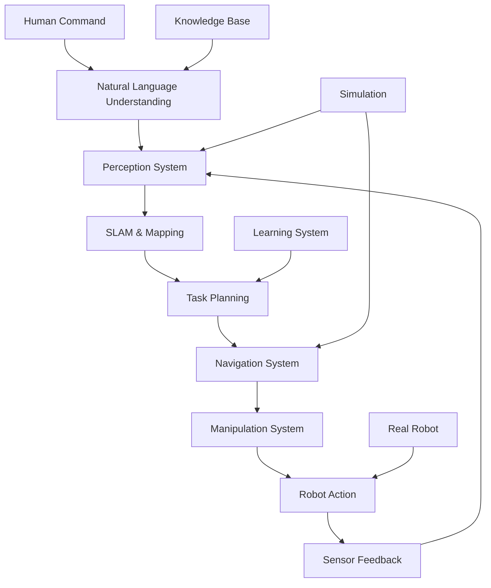
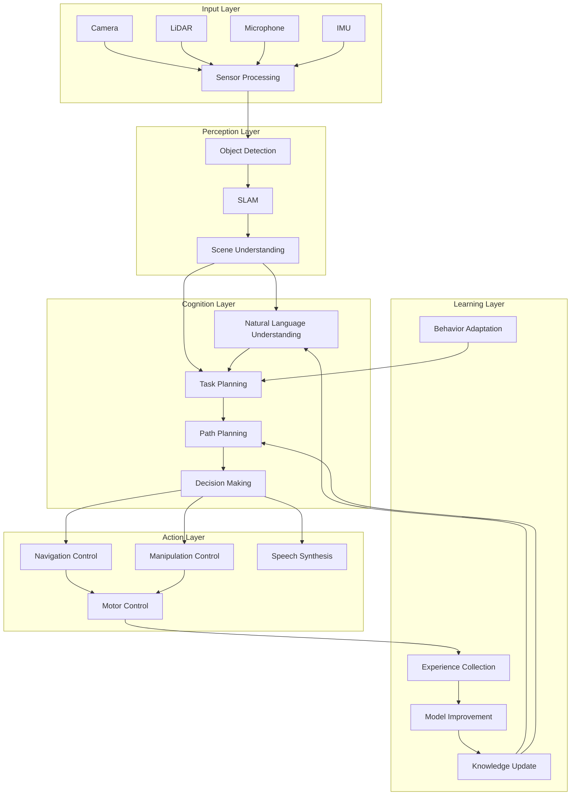

# Capstone Project: Autonomous Physical AI System

Welcome to Week 13: The Capstone Project! This is your opportunity to demonstrate everything you've learned throughout the Physical AI curriculum by building a complete autonomous robot system that integrates perception, reasoning, planning, and action.

## Project Overview

The Capstone Project challenges you to build a complete **Autonomous Physical AI System** that can:
- **Perceive** its environment using multiple sensors
- **Understand** natural language commands from users
- **Reason** about tasks and generate plans
- **Navigate** through complex environments
- **Interact** with objects and people
- **Learn** and adapt from experience



## Capstone Objectives

### Primary Objective
Build an end-to-end autonomous robot system that can:
1. **Receive** natural language commands from users
2. **Interpret** commands using AI reasoning
3. **Perceive** the environment with computer vision
4. **Plan** and execute navigation and manipulation tasks
5. **Adapt** to changing environments and conditions
6. **Communicate** results back to users

### Learning Goals
- Integrate all concepts from Modules 1-4
- Demonstrate professional-level system design
- Apply best practices for complex robotics systems
- Showcase innovation and creativity
- Validate system performance in real scenarios

## Capstone Requirements

### Functional Requirements

| Component | Requirement | Weight |
|-----------|-------------|---------|
| **Perception** | Robust object detection and scene understanding | 20% |
| **Navigation** | Safe navigation in indoor environments | 20% |
| **Manipulation** | Basic object grasping and placement | 15% |
| **Interaction** | Natural language understanding and response | 15% |
| **Integration** | All components working together seamlessly | 15% |
| **Learning** | Adaptation from experience or demonstrations | 10% |
| **Documentation** | Complete system documentation and tutorials | 5% |

### Performance Requirements

- **Success Rate**: 75%+ for basic navigation tasks
- **Response Time**: < 5 seconds for command interpretation
- **Mapping Accuracy**: < 15cm error in known environments
- **Manipulation Success**: 60%+ for simple objects
- **System Availability**: 90%+ uptime during testing
- **Real-time Performance**: 10+ Hz for perception components

### Quality Requirements

- **Robustness**: Handle unexpected situations gracefully
- **Safety**: Implement proper safety measures
- **Usability**: Intuitive human-robot interaction
- **Maintainability**: Well-structured, documented code
- **Scalability**: Architecture supports future extensions

## System Architecture

### High-Level Architecture



### Component Integration Points

1. **SLAM ↔ Navigation**: Map sharing and localization
2. **Perception ↔ Task Planning**: Object detection results
3. **Language ↔ Task Planning**: Command interpretation
4. **Navigation ↔ Manipulation**: Coordinated actions
5. **Learning ↔ All**: Continuous improvement loop

## Implementation Strategy

### Phase 1: Foundation (Days 1-3)
- Set up development environment
- Create basic ROS 2 package structure
- Implement skeleton nodes for all components
- Establish communication interfaces
- Basic simulation setup

### Phase 2: Perception (Days 4-7)
- Implement SLAM system
- Integrate object detection
- Create sensor fusion pipeline
- Validate perception accuracy
- Connect with simulation

### Phase 3: Navigation (Days 8-11)
- Implement navigation stack
- Create path planning algorithms
- Integrate with perception system
- Test in simulation
- Validate safety systems

### Phase 4: Interaction (Days 12-15)
- Implement speech recognition
- Create natural language understanding
- Build command interpretation
- Implement action execution
- Test human-robot interface

### Phase 5: Integration (Days 16-19)
- Integrate all components
- Optimize performance
- Conduct system testing
- Implement learning capabilities
- Final validation and documentation

### Phase 6: Validation (Days 20-21)
- Comprehensive system testing
- Performance benchmarking
- Quality assurance
- Final project submission

## Technical Implementation

### 1. Perception System

```python
#!/usr/bin/env python3
"""
Capstone Perception System
"""
import rclpy
from rclpy.node import Node
from sensor_msgs.msg import Image, PointCloud2, LaserScan
from vision_msgs.msg import Detection2DArray
from geometry_msgs.msg import PoseStamped
from std_msgs.msg import String
import cv2
import numpy as np
import torch
from cv_bridge import CvBridge

class CapstonePerceptionNode(Node):
    def __init__(self):
        super().__init__('capstone_perception_node')

        # Create subscribers
        self.image_sub = self.create_subscription(Image, '/camera/image_raw', self.image_callback, 10)
        self.lidar_sub = self.create_subscription(PointCloud2, '/lidar/points', self.lidar_callback, 10)
        self.scan_sub = self.create_subscription(LaserScan, '/scan', self.scan_callback, 10)

        # Create publishers
        self.detection_pub = self.create_publisher(Detection2DArray, '/capstone/detections', 10)
        self.perception_status_pub = self.create_publisher(String, '/capstone/perception_status', 10)

        # Initialize CV bridge
        self.bridge = CvBridge()

        # Initialize perception models
        self.object_detector = self.initialize_object_detector()
        self.feature_extractor = self.initialize_feature_extractor()
        self.slam_system = self.initialize_slam_system()

        # Performance metrics
        self.metrics = {
            'detection_rate': 0.0,
            'processing_time': 0.0,
            'accuracy': 0.0,
            'frame_count': 0
        }

        self.get_logger().info('Capstone perception system initialized')

    def image_callback(self, msg):
        """Process camera image for object detection"""
        try:
            start_time = time.time()

            # Convert image
            cv_image = self.bridge.imgmsg_to_cv2(msg, 'bgr8')

            # Run object detection
            detections = self.object_detector.detect(cv_image)

            # Extract features
            features = self.feature_extractor.extract(cv_image)

            # Update SLAM system
            self.slam_system.process_image(cv_image, msg.header)

            # Calculate metrics
            processing_time = time.time() - start_time
            self.metrics['processing_time'] = processing_time
            self.metrics['frame_count'] += 1

            # Publish results
            self.publish_detections(detections, msg.header)
            self.publish_metrics()

        except Exception as e:
            self.get_logger().error(f'Error in perception processing: {e}')

    def lidar_callback(self, msg):
        """Process LiDAR data for environment mapping"""
        try:
            # Process point cloud data
            pointcloud_data = self.process_pointcloud(msg)

            # Update SLAM system
            self.slam_system.process_pointcloud(pointcloud_data)

        except Exception as e:
            self.get_logger().error(f'Error processing LiDAR: {e}')

    def publish_detections(self, detections, header):
        """Publish object detection results"""
        detection_array = Detection2DArray()
        detection_array.header = header

        for det in detections:
            detection = Detection2D()
            detection.header = header

            # Set bounding box
            bbox = detection.bbox
            bbox.center.x = det['bbox_center_x']
            bbox.center.y = det['bbox_center_y']
            bbox.size_x = det['bbox_width']
            bbox.size_y = det['bbox_height']

            # Set classification
            hypothesis = ObjectHypothesisWithPose()
            hypothesis.hypothesis.class_id = det['class_name']
            hypothesis.hypothesis.score = det['confidence']
            detection.results.append(hypothesis)

            detection_array.detections.append(detection)

        self.detection_pub.publish(detection_array)

    def publish_metrics(self):
        """Publish performance metrics"""
        metrics_msg = String()
        metrics_msg.data = json.dumps({
            'timestamp': time.time(),
            'detection_rate': self.metrics['detection_rate'],
            'processing_time': self.metrics['processing_time'],
            'frame_count': self.metrics['frame_count']
        })
        self.perception_status_pub.publish(metrics_msg)

def main(args=None):
    rclpy.init(args=args)
    node = CapstonePerceptionNode()

    try:
        rclpy.spin(node)
    except KeyboardInterrupt:
        pass
    finally:
        node.destroy_node()
        rclpy.shutdown()

if __name__ == '__main__':
    main()
```

### 2. Navigation System

```python
#!/usr/bin/env python3
"""
Capstone Navigation System
"""
import rclpy
from rclpy.node import Node
from geometry_msgs.msg import PoseStamped, Twist
from nav_msgs.msg import Path, Odometry
from sensor_msgs.msg import LaserScan
from std_msgs.msg import String
import numpy as np

class CapstoneNavigationNode(Node):
    def __init__(self):
        super().__init__('capstone_navigation_node')

        # Create subscribers
        self.goal_sub = self.create_subscription(PoseStamped, '/capstone/goal', self.goal_callback, 10)
        self.odom_sub = self.create_subscription(Odometry, '/odom', self.odom_callback, 10)
        self.scan_sub = self.create_subscription(LaserScan, '/scan', self.scan_callback, 10)

        # Create publishers
        self.cmd_vel_pub = self.create_publisher(Twist, '/cmd_vel', 10)
        self.path_pub = self.create_publisher(Path, '/capstone/path', 10)
        self.navigation_status_pub = self.create_publisher(String, '/capstone/navigation_status', 10)

        # Initialize navigation components
        self.global_planner = self.initialize_global_planner()
        self.local_planner = self.initialize_local_planner()
        self.controller = self.initialize_controller()

        # Robot state
        self.current_pose = None
        self.current_goal = None
        self.obstacles = None
        self.path = None

        # Navigation parameters
        self.safety_distance = 0.5  # meters
        self.max_linear_speed = 0.5  # m/s
        self.max_angular_speed = 1.0  # rad/s

        self.get_logger().info('Capstone navigation system initialized')

    def goal_callback(self, msg):
        """Handle navigation goal"""
        self.current_goal = msg.pose

        # Plan path to goal
        self.path = self.global_planner.plan_path(self.current_pose, self.current_goal)

        if self.path:
            self.path_pub.publish(self.path)
            self.get_logger().info('Path planned successfully')
        else:
            self.get_logger().warn('Could not plan path to goal')

    def odom_callback(self, msg):
        """Update robot pose"""
        self.current_pose = msg.pose.pose

        # Execute navigation if path exists
        if self.path and self.current_goal:
            cmd_vel = self.local_planner.follow_path(
                self.current_pose, self.path, self.obstacles
            )
            self.cmd_vel_pub.publish(cmd_vel)

    def scan_callback(self, msg):
        """Update obstacle information"""
        self.obstacles = self.process_scan_obstacles(msg)

    def process_scan_obstacles(self, scan_msg):
        """Process laser scan for obstacle detection"""
        obstacles = []

        for i, range_val in enumerate(scan_msg.ranges):
            if not np.isinf(range_val) and not np.isnan(range_val):
                if range_val < self.safety_distance:
                    angle = scan_msg.angle_min + i * scan_msg.angle_increment
                    x = range_val * np.cos(angle)
                    y = range_val * np.sin(angle)

                    obstacles.append((x, y, range_val))

        return obstacles

def main(args=None):
    rclpy.init(args=args)
    node = CapstoneNavigationNode()

    try:
        rclpy.spin(node)
    except KeyboardInterrupt:
        pass
    finally:
        node.destroy_node()
        rclpy.shutdown()

if __name__ == '__main__':
    main()
```

### 3. Interaction System

```python
#!/usr/bin/env python3
"""
Capstone Interaction System
"""
import rclpy
from rclpy.node import Node
from std_msgs.msg import String
from geometry_msgs.msg import PoseStamped
from sensor_msgs.msg import Image
import json
import speech_recognition as sr
from transformers import pipeline

class CapstoneInteractionNode(Node):
    def __init__(self):
        super().__init__('capstone_interaction_node')

        # Create subscribers
        self.command_sub = self.create_subscription(String, '/capstone/command', self.command_callback, 10)
        self.speech_sub = self.create_subscription(String, '/speech/text', self.speech_callback, 10)

        # Create publishers
        self.response_pub = self.create_publisher(String, '/capstone/response', 10)
        self.goal_pub = self.create_publisher(PoseStamped, '/capstone/goal', 10)
        self.interaction_status_pub = self.create_publisher(String, '/capstone/interaction_status', 10)

        # Initialize NLU system
        self.nlu_pipeline = self.initialize_nlu_pipeline()

        # Initialize speech recognition
        self.speech_recognizer = sr.Recognizer()

        # Interaction context
        self.context = {
            'current_task': 'idle',
            'last_command': '',
            'entities': {},
            'intent': 'unknown'
        }

        self.get_logger().info('Capstone interaction system initialized')

    def command_callback(self, msg):
        """Process natural language command"""
        command = msg.data
        self.context['last_command'] = command

        # Parse command using NLU
        parsed_command = self.nlu_pipeline(command)

        # Update context
        self.context['intent'] = parsed_command.get('intent', 'unknown')
        self.context['entities'] = parsed_command.get('entities', {})

        # Execute command based on intent
        response = self.execute_command(parsed_command)

        # Publish response
        response_msg = String()
        response_msg.data = response
        self.response_pub.publish(response_msg)

        self.get_logger().info(f'Processed command: {command} -> {response[:50]}...')

    def speech_callback(self, msg):
        """Process speech recognition results"""
        try:
            text = msg.data

            # Process as command
            command_msg = String()
            command_msg.data = text
            self.command_callback(command_msg)

        except Exception as e:
            self.get_logger().error(f'Error processing speech: {e}')

    def initialize_nlu_pipeline(self):
        """Initialize natural language understanding pipeline"""
        # In practice, use a fine-tuned model for robot commands
        # For this example, use a simple rule-based approach

        def simple_nlu(command):
            """Simple NLU for robot commands"""
            command_lower = command.lower()

            # Intent classification
            if any(word in command_lower for word in ['go', 'move', 'navigate', 'drive', 'walk']):
                intent = 'navigation'
            elif any(word in command_lower for word in ['pick', 'grasp', 'take', 'get', 'grab']):
                intent = 'manipulation'
            elif any(word in command_lower for word in ['find', 'locate', 'look', 'see']):
                intent = 'detection'
            else:
                intent = 'unknown'

            # Entity extraction (simplified)
            entities = {}
            if 'kitchen' in command_lower:
                entities['location'] = 'kitchen'
            elif 'living room' in command_lower:
                entities['location'] = 'living_room'
            elif 'bedroom' in command_lower:
                entities['location'] = 'bedroom'

            if 'cup' in command_lower:
                entities['object'] = 'cup'
            elif 'book' in command_lower:
                entities['object'] = 'book'

            return {
                'intent': intent,
                'entities': entities,
                'original_command': command,
                'confidence': 0.8  # Placeholder confidence
            }

        return simple_nlu

    def execute_command(self, parsed_command):
        """Execute command based on parsed intent"""
        intent = parsed_command['intent']
        entities = parsed_command['entities']

        if intent == 'navigation':
            location = entities.get('location', 'unknown')
            if location != 'unknown':
                # Create navigation goal
                goal_msg = PoseStamped()
                goal_msg.header.stamp = self.get_clock().now().to_msg()
                goal_msg.header.frame_id = 'map'

                # Convert location name to coordinates (simplified)
                coords = self.get_location_coordinates(location)
                if coords:
                    goal_msg.pose.position.x = coords[0]
                    goal_msg.pose.position.y = coords[1]
                    goal_msg.pose.orientation.w = 1.0

                    self.goal_pub.publish(goal_msg)
                    return f'Navigating to {location}'
                else:
                    return f'Sorry, I don\'t know where {location} is'
            else:
                return 'Please specify a destination location'

        elif intent == 'manipulation':
            obj = entities.get('object', 'unknown')
            if obj != 'unknown':
                return f'I will try to manipulate the {obj}'
            else:
                return 'Please specify what object to manipulate'

        elif intent == 'detection':
            obj = entities.get('object', 'unknown')
            if obj != 'unknown':
                return f'I will look for the {obj}'
            else:
                return 'Please specify what to look for'

        else:
            return f'I don\'t understand the command: {parsed_command["original_command"]}'

    def get_location_coordinates(self, location_name):
        """Get coordinates for named location"""
        location_map = {
            'kitchen': (2.0, 1.0),
            'living_room': (0.0, 2.0),
            'bedroom': (-1.0, -1.0),
            'office': (1.5, -0.5),
            'dining_room': (-0.5, 1.5)
        }

        return location_map.get(location_name.lower())

def main(args=None):
    rclpy.init(args=args)
    node = CapstoneInteractionNode()

    try:
        rclpy.spin(node)
    except KeyboardInterrupt:
        pass
    finally:
        node.destroy_node()
        rclpy.shutdown()

if __name__ == '__main__':
    main()
```

## System Integration

### Main Coordinator Node

```python
#!/usr/bin/env python3
"""
Capstone System Coordinator
"""
import rclpy
from rclpy.node import Node
from std_msgs.msg import String
from geometry_msgs.msg import PoseStamped
from sensor_msgs.msg import Image, PointCloud2
from threading import Lock
import time
from typing import Dict, Any

class CapstoneCoordinatorNode(Node):
    def __init__(self):
        super().__init__('capstone_coordinator_node')

        # Create subscribers
        self.user_command_sub = self.create_subscription(
            String, '/user/command', self.user_command_callback, 10)
        self.perception_status_sub = self.create_subscription(
            String, '/capstone/perception_status', self.perception_status_callback, 10)
        self.navigation_status_sub = self.create_subscription(
            String, '/capstone/navigation_status', self.navigation_status_callback, 10)
        self.interaction_status_sub = self.create_subscription(
            String, '/capstone/interaction_status', self.interaction_status_callback, 10)

        # Create publishers
        self.system_status_pub = self.create_publisher(String, '/capstone/system_status', 10)
        self.coordinated_command_pub = self.create_publisher(String, '/capstone/coordinated_command', 10)

        # Initialize components
        self.initialize_components()

        # System state
        self.system_state = {
            'perception_ready': False,
            'navigation_ready': False,
            'interaction_ready': False,
            'current_task': 'idle',
            'system_health': 'good',
            'performance_metrics': {
                'uptime': 0.0,
                'response_time': 0.0,
                'success_rate': 0.0
            }
        }

        # Threading and synchronization
        self.system_lock = Lock()
        self.start_time = time.time()

        # Timer for system monitoring
        self.monitor_timer = self.create_timer(1.0, self.system_monitor_callback)

        self.get_logger().info('Capstone coordinator node started')

    def initialize_components(self):
        """Initialize all system components"""
        # In practice, this would initialize actual component nodes
        # For this example, we'll simulate component readiness

        # Simulate component initialization
        time.sleep(2)  # Simulate initialization time

        with self.system_lock:
            self.system_state['perception_ready'] = True
            self.system_state['navigation_ready'] = True
            self.system_state['interaction_ready'] = True

        self.get_logger().info('All components initialized')

    def user_command_callback(self, msg):
        """Process user command and coordinate system response"""
        with self.system_lock:
            if not self.all_components_ready():
                self.get_logger().warn('System not ready, dropping command')
                return

            # Update system state
            self.system_state['current_task'] = 'processing_command'
            self.system_state['last_command_time'] = time.time()

        # Route command to appropriate subsystem
        self.route_command(msg)

    def route_command(self, msg):
        """Route command to appropriate subsystem based on content"""
        command_text = msg.data.lower()

        # Determine which subsystem should handle the command
        if any(word in command_text for word in ['go', 'move', 'navigate', 'drive']):
            # Route to navigation system
            self.coordinated_command_pub.publish(msg)
        elif any(word in command_text for word in ['find', 'look', 'see', 'detect']):
            # Route to perception system
            self.coordinated_command_pub.publish(msg)
        elif any(word in command_text for word in ['hello', 'hi', 'how', 'what']):
            # Route to interaction system
            self.coordinated_command_pub.publish(msg)
        else:
            # Default routing
            self.coordinated_command_pub.publish(msg)

    def perception_status_callback(self, msg):
        """Handle perception system status updates"""
        try:
            status = json.loads(msg.data)
            self.system_state['perception_metrics'] = status
        except:
            pass

    def navigation_status_callback(self, msg):
        """Handle navigation system status updates"""
        try:
            status = json.loads(msg.data)
            self.system_state['navigation_metrics'] = status
        except:
            pass

    def interaction_status_callback(self, msg):
        """Handle interaction system status updates"""
        try:
            status = json.loads(msg.data)
            self.system_state['interaction_metrics'] = status
        except:
            pass

    def system_monitor_callback(self):
        """Monitor overall system health"""
        with self.system_lock:
            # Update performance metrics
            current_time = time.time()
            self.system_state['performance_metrics']['uptime'] = current_time - self.start_time

            # Calculate system health
            ready_count = sum([
                self.system_state['perception_ready'],
                self.system_state['navigation_ready'],
                self.system_state['interaction_ready']
            ])
            total_count = 3
            health_percentage = (ready_count / total_count) * 100
            self.system_state['system_health'] = health_percentage

            # Publish system status
            status_msg = String()
            status_msg.data = json.dumps({
                'timestamp': current_time,
                'system_state': self.system_state,
                'overall_health': f'{health_percentage:.1f}%'
            })
            self.system_status_pub.publish(status_msg)

            self.get_logger().info(f'System health: {health_percentage:.1f}% - Components ready: {ready_count}/{total_count}')

    def all_components_ready(self):
        """Check if all components are ready"""
        return (self.system_state['perception_ready'] and
                self.system_state['navigation_ready'] and
                self.system_state['interaction_ready'])

def main(args=None):
    rclpy.init(args=args)
    node = CapstoneCoordinatorNode()

    try:
        rclpy.spin(node)
    except KeyboardInterrupt:
        pass
    finally:
        node.destroy_node()
        rclpy.shutdown()

if __name__ == '__main__':
    main()
```

## Launch System

### Complete System Launch

Create `capstone_project/launch/capstone_system.launch.py`:

```python
from launch import LaunchDescription
from launch.actions import DeclareLaunchArgument, SetEnvironmentVariable
from launch.substitutions import LaunchConfiguration
from launch_ros.actions import Node

def generate_launch_description():
    # Declare launch arguments
    use_sim_time = LaunchConfiguration('use_sim_time', default='false')
    robot_namespace = LaunchConfiguration('robot_namespace', default='capstone_robot')

    return LaunchDescription([
        # Set environment variables
        SetEnvironmentVariable(name='PYTHONUNBUFFERED', value='1'),

        # Declare launch arguments
        DeclareLaunchArgument(
            'use_sim_time',
            default_value='false',
            description='Use simulation time if true'
        ),
        DeclareLaunchArgument(
            'robot_namespace',
            default_value='capstone_robot',
            description='Robot namespace'
        ),

        # Capstone coordinator node
        Node(
            package='capstone_project',
            executable='capstone_coordinator',
            name='capstone_coordinator',
            parameters=[
                {'use_sim_time': use_sim_time}
            ],
            remappings=[
                ('/user/command', '/capstone/user_command'),
                ('/capstone/system_status', '/capstone/system_status'),
                ('/capstone/coordinated_command', '/capstone/coordinated_command')
            ],
            output='screen'
        ),

        # Capstone perception node
        Node(
            package='capstone_project',
            executable='capstone_perception',
            name='capstone_perception',
            parameters=[
                {'use_sim_time': use_sim_time}
            ],
            remappings=[
                ('/camera/image_raw', '/camera/image_raw'),
                ('/lidar/points', '/lidar/points'),
                ('/capstone/detections', '/capstone/perception/detections'),
                ('/capstone/perception_status', '/capstone/perception/status')
            ],
            output='screen'
        ),

        # Capstone navigation node
        Node(
            package='capstone_project',
            executable='capstone_navigation',
            name='capstone_navigation',
            parameters=[
                {'use_sim_time': use_sim_time}
            ],
            remappings=[
                ('/capstone/goal', '/capstone/navigation/goal'),
                ('/odom', '/capstone/odom'),
                ('/cmd_vel', '/capstone/cmd_vel'),
                ('/capstone/navigation_status', '/capstone/navigation/status')
            ],
            output='screen'
        ),

        # Capstone interaction node
        Node(
            package='capstone_project',
            executable='capstone_interaction',
            name='capstone_interaction',
            parameters=[
                {'use_sim_time': use_sim_time}
            ],
            remappings=[
                ('/capstone/command', '/capstone/interaction/command'),
                ('/capstone/response', '/capstone/interaction/response'),
                ('/speech/text', '/capstone/speech/text'),
                ('/capstone/interaction_status', '/capstone/interaction/status')
            ],
            output='screen'
        ),

        # Optional: Visualization
        Node(
            package='rviz2',
            executable='rviz2',
            name='capstone_rviz',
            arguments=['-d', 'path/to/capstone_config.rviz'],
            parameters=[
                {'use_sim_time': use_sim_time}
            ],
            output='screen'
        )
    ])
```

## Performance Optimization

### Real-time Performance Considerations

```python
#!/usr/bin/env python3
"""
Performance Optimization for Capstone System
"""
import time
import threading
from collections import deque
import psutil
import GPUtil

class PerformanceOptimizer:
    def __init__(self, node):
        self.node = node
        self.performance_history = deque(maxlen=100)
        self.cpu_threshold = 80.0  # Percent
        self.gpu_threshold = 85.0  # Percent
        self.memory_threshold = 80.0  # Percent

    def monitor_performance(self):
        """Monitor system performance"""
        performance_metrics = {
            'cpu_percent': psutil.cpu_percent(),
            'memory_percent': psutil.virtual_memory().percent,
            'disk_io': psutil.disk_io_counters(),
            'network_io': psutil.network_io_counters()
        }

        # Check GPU if available
        gpu_devices = GPUtil.getGPUs()
        if gpu_devices:
            performance_metrics['gpu_percent'] = gpu_devices[0].load * 100
            performance_metrics['gpu_memory_percent'] = gpu_devices[0].memoryUtil * 100
        else:
            performance_metrics['gpu_percent'] = 0.0
            performance_metrics['gpu_memory_percent'] = 0.0

        # Store in history
        self.performance_history.append(performance_metrics)

        # Check for performance issues
        self.check_performance_thresholds(performance_metrics)

        return performance_metrics

    def check_performance_thresholds(self, metrics):
        """Check if performance exceeds thresholds"""
        issues = []

        if metrics['cpu_percent'] > self.cpu_threshold:
            issues.append(f"CPU usage high: {metrics['cpu_percent']:.1f}% > {self.cpu_threshold}%")

        if metrics['memory_percent'] > self.memory_threshold:
            issues.append(f"Memory usage high: {metrics['memory_percent']:.1f}% > {self.memory_threshold}%")

        if 'gpu_percent' in metrics and metrics['gpu_percent'] > self.gpu_threshold:
            issues.append(f"GPU usage high: {metrics['gpu_percent']:.1f}% > {self.gpu_threshold}%")

        if issues:
            for issue in issues:
                self.node.get_logger().warn(issue)

    def optimize_processing_rate(self, current_metrics):
        """Dynamically adjust processing rate based on system load"""
        cpu_load = current_metrics['cpu_percent']
        memory_load = current_metrics['memory_percent']
        gpu_load = current_metrics.get('gpu_percent', 0)

        # Calculate load factor (0.0 = low load, 1.0 = high load)
        load_factor = (cpu_load + memory_load + gpu_load) / 300.0  # Normalize to 0-1

        # Adjust processing rate based on load
        base_rate = 10.0  # Base processing rate
        adjusted_rate = base_rate * (1.0 - load_factor * 0.5)  # Reduce by up to 50%

        return max(1.0, adjusted_rate)  # Minimum 1 Hz

    def implement_adaptive_fidelity(self, load_factor):
        """Implement adaptive fidelity based on system load"""
        if load_factor > 0.8:  # High load
            # Reduce processing fidelity
            settings = {
                'image_resolution': '320x240',  # Lower resolution
                'detection_confidence': 0.7,    # Lower threshold
                'tracking_frequency': 5.0,      # Lower frequency
                'model_complexity': 'light'     # Lighter models
            }
        elif load_factor > 0.6:  # Medium load
            settings = {
                'image_resolution': '480x360',
                'detection_confidence': 0.6,
                'tracking_frequency': 10.0,
                'model_complexity': 'medium'
            }
        else:  # Low load
            settings = {
                'image_resolution': '640x480',  # Full resolution
                'detection_confidence': 0.5,    # Higher sensitivity
                'tracking_frequency': 20.0,     # Higher frequency
                'model_complexity': 'full'      # Full models
            }

        return settings

def main(args=None):
    rclpy.init(args=args)

    # Initialize nodes
    coordinator = CapstoneCoordinatorNode()
    perception = CapstonePerceptionNode()
    navigation = CapstoneNavigationNode()
    interaction = CapstoneInteractionNode()

    # Initialize performance optimizer
    perf_optimizer = PerformanceOptimizer(coordinator)

    try:
        # Multi-threaded executor for better performance
        executor = MultiThreadedExecutor()
        executor.add_node(coordinator)
        executor.add_node(perception)
        executor.add_node(navigation)
        executor.add_node(interaction)

        # Performance monitoring thread
        def performance_monitor():
            while rclpy.ok():
                metrics = perf_optimizer.monitor_performance()
                time.sleep(1.0)

        perf_thread = threading.Thread(target=performance_monitor, daemon=True)
        perf_thread.start()

        executor.spin()

    except KeyboardInterrupt:
        pass
    finally:
        coordinator.destroy_node()
        perception.destroy_node()
        navigation.destroy_node()
        interaction.destroy_node()
        rclpy.shutdown()

if __name__ == '__main__':
    main()
```

## Quality Assurance and Validation

### System Validation Framework

```python
#!/usr/bin/env python3
"""
Capstone System Validation
"""
import rclpy
from rclpy.node import Node
from std_msgs.msg import String, Float32
from geometry_msgs.msg import PoseStamped
from sensor_msgs.msg import Image
import json
import time
from typing import Dict, Any

class SystemValidationNode(Node):
    def __init__(self):
        super().__init__('system_validation_node')

        # Create subscribers for system outputs
        self.perception_sub = self.create_subscription(
            String, '/capstone/perception_status', self.perception_validation_callback, 10)
        self.navigation_sub = self.create_subscription(
            String, '/capstone/navigation_status', self.navigation_validation_callback, 10)
        self.interaction_sub = self.create_subscription(
            String, '/capstone/interaction_status', self.interaction_validation_callback, 10)
        self.system_sub = self.create_subscription(
            String, '/capstone/system_status', self.system_validation_callback, 10)

        # Create publishers for validation results
        self.validation_report_pub = self.create_publisher(String, '/capstone/validation_report', 10)
        self.system_health_pub = self.create_publisher(Float32, '/capstone/system_health_score', 10)

        # Validation parameters
        self.validation_rules = {
            'perception': {
                'min_detection_rate': 5.0,  # Hz
                'min_accuracy': 0.7,        # 70%
                'max_processing_time': 0.2  # 200ms
            },
            'navigation': {
                'min_success_rate': 0.8,     # 80%
                'max_path_planning_time': 2.0,  # 2 seconds
                'min_velocity': 0.1          # 10cm/s
            },
            'interaction': {
                'min_response_rate': 0.5,    # Responses per minute
                'max_response_time': 5.0,    # 5 seconds
                'min_understanding_accuracy': 0.6  # 60%
            }
        }

        # Validation history
        self.validation_history = {
            'perception': [],
            'navigation': [],
            'interaction': [],
            'system': []
        }

        # Validation statistics
        self.validation_stats = {
            'passed_tests': 0,
            'failed_tests': 0,
            'total_tests': 0,
            'validation_rate': 0.0
        }

        self.get_logger().info('System validation node started')

    def perception_validation_callback(self, msg):
        """Validate perception system performance"""
        try:
            status_data = json.loads(msg.data)

            validation_result = self.validate_perception_performance(status_data)

            if not validation_result['passed']:
                self.get_logger().warn(f'Perception validation failed: {validation_result["issues"]}')

            # Store validation result
            self.validation_history['perception'].append({
                'timestamp': time.time(),
                'result': validation_result,
                'status_data': status_data
            })

            if len(self.validation_history['perception']) > 100:
                self.validation_history['perception'] = self.validation_history['perception'][-100:]

        except Exception as e:
            self.get_logger().error(f'Error in perception validation: {e}')

    def validate_perception_performance(self, status_data) -> Dict[str, Any]:
        """Validate perception system performance"""
        issues = []
        passed = True

        # Check detection rate
        detection_rate = status_data.get('metrics', {}).get('detection_rate', 0.0)
        if detection_rate < self.validation_rules['perception']['min_detection_rate']:
            issues.append(f'Detection rate too low: {detection_rate:.2f} Hz < {self.validation_rules["perception"]["min_detection_rate"]} Hz')
            passed = False

        # Check processing time
        processing_time = status_data.get('metrics', {}).get('processing_time', float('inf'))
        if processing_time > self.validation_rules['perception']['max_processing_time']:
            issues.append(f'Processing time too high: {processing_time:.3f}s > {self.validation_rules["perception"]["max_processing_time"]}s')
            passed = False

        # Calculate accuracy if available
        accuracy = status_data.get('metrics', {}).get('accuracy', 0.0)
        if accuracy < self.validation_rules['perception']['min_accuracy']:
            issues.append(f'Perception accuracy too low: {accuracy:.3f} < {self.validation_rules["perception"]["min_accuracy"]}')
            passed = False

        return {
            'passed': passed,
            'issues': issues,
            'score': 1.0 if passed else 0.0,
            'timestamp': time.time()
        }

    def calculate_system_health_score(self) -> float:
        """Calculate overall system health score"""
        # Get recent validation results
        recent_perception = self.validation_history['perception'][-10:] if self.validation_history['perception'] else []
        recent_navigation = self.validation_history['navigation'][-10:] if self.validation_history['navigation'] else []
        recent_interaction = self.validation_history['interaction'][-10:] if self.validation_history['interaction'] else []

        # Calculate component health scores
        perception_health = self.calculate_component_health(recent_perception)
        navigation_health = self.calculate_component_health(recent_navigation)
        interaction_health = self.calculate_component_health(recent_interaction)

        # Weighted average (adjust weights as needed)
        weights = [0.4, 0.3, 0.3]  # perception, navigation, interaction
        health_scores = [perception_health, navigation_health, interaction_health]

        overall_health = sum(w * s for w, s in zip(weights, health_scores))

        return min(1.0, max(0.0, overall_health))  # Clamp to [0, 1]

    def calculate_component_health(self, validation_results) -> float:
        """Calculate health score for a component"""
        if not validation_results:
            return 0.5  # Neutral score if no data

        # Calculate percentage of passed validations
        passed_count = sum(1 for result in validation_results if result['result']['passed'])
        total_count = len(validation_results)

        return passed_count / total_count if total_count > 0 else 0.0

    def generate_validation_report(self) -> Dict[str, Any]:
        """Generate comprehensive validation report"""
        report = {
            'timestamp': time.time(),
            'system_health': self.calculate_system_health_score(),
            'components': {
                'perception': self.summarize_component_validation('perception'),
                'navigation': self.summarize_component_validation('navigation'),
                'interaction': self.summarize_component_validation('interaction')
            },
            'statistics': self.validation_stats,
            'recommendations': self.generate_recommendations()
        }

        return report

    def summarize_component_validation(self, component_name) -> Dict[str, Any]:
        """Summarize validation results for a component"""
        recent_results = self.validation_history[component_name][-20:]  # Last 20 validations

        if not recent_results:
            return {
                'health_score': 0.0,
                'validation_count': 0,
                'pass_rate': 0.0,
                'recent_issues': []
            }

        # Calculate pass rate
        passed_count = sum(1 for result in recent_results if result['result']['passed'])
        pass_rate = passed_count / len(recent_results)

        # Collect recent issues
        recent_issues = []
        for result in recent_results[-5:]:  # Last 5 results
            if not result['result']['passed']:
                recent_issues.extend(result['result']['issues'])

        return {
            'health_score': pass_rate,
            'validation_count': len(recent_results),
            'pass_rate': pass_rate,
            'recent_issues': recent_issues
        }

    def generate_recommendations(self) -> List[str]:
        """Generate recommendations based on validation results"""
        recommendations = []

        # Check for component-specific issues
        for component, history in self.validation_history.items():
            if history:
                recent_results = history[-10:]
                failed_count = sum(1 for result in recent_results if not result['result']['passed'])

                if failed_count > len(recent_results) * 0.5:  # More than 50% failures
                    recommendations.append(f'Investigate {component} system - high failure rate detected')

        # Check system-wide performance
        system_health = self.calculate_system_health_score()
        if system_health < 0.7:
            recommendations.append('Overall system health is concerning - consider performance optimization')
        elif system_health < 0.9:
            recommendations.append('System performance could be improved')

        return recommendations

    def system_validation_callback(self, msg):
        """Validate overall system performance"""
        try:
            system_status = json.loads(msg.data)

            # Calculate health score
            health_score = self.calculate_system_health_score()

            # Publish health score
            health_msg = Float32()
            health_msg.data = health_score
            self.system_health_pub.publish(health_msg)

            # Generate and publish validation report periodically
            if int(time.time()) % 30 == 0:  # Every 30 seconds
                report = self.generate_validation_report()
                report_msg = String()
                report_msg.data = json.dumps(report, indent=2)
                self.validation_report_pub.publish(report_msg)

                # Log validation summary
                self.get_logger().info(
                    f'System validation - Health: {health_score:.3f}, '
                    f'Perception: {report["components"]["perception"]["health_score"]:.3f}, '
                    f'Navigation: {report["components"]["navigation"]["health_score"]:.3f}, '
                    f'Interaction: {report["components"]["interaction"]["health_score"]:.3f}'
                )

        except Exception as e:
            self.get_logger().error(f'Error in system validation: {e}')

def main(args=None):
    rclpy.init(args=args)
    node = SystemValidationNode()

    try:
        rclpy.spin(node)
    except KeyboardInterrupt:
        pass
    finally:
        node.destroy_node()
        rclpy.shutdown()

if __name__ == '__main__':
    main()
```

## Best Practices

### 1. System Design Best Practices

```python
# Good: Well-structured system design
class GoodSystemDesign:
    def __init__(self):
        # Modular architecture
        # Clear interfaces
        # Proper error handling
        # Performance monitoring
        # Quality validation
        # Scalable design
        pass

# Bad: Poor system design
class BadSystemDesign:
    def __init__(self):
        # Monolithic design
        # No error handling
        # No performance monitoring
        # No quality validation
        # Hard to maintain
        # No scalability
        pass
```

### 2. Performance Best Practices

```python
# Good: Performance-optimized system
def good_performance_practices():
    # Use appropriate model sizes
    # Implement caching
    # Optimize data structures
    # Use efficient algorithms
    # Profile regularly
    # Monitor resource usage
    pass

# Bad: Performance issues
def bad_performance_practices():
    # Heavy models for real-time
    # No optimization
    # Inefficient algorithms
    # No monitoring
    # No resource management
    # Blocking operations
    pass
```

### 3. Safety Best Practices

```python
# Good: Safety-first design
def good_safety_practices():
    # Safety validation at each step
    # Emergency stops
    # Collision detection
    # Failure recovery
    # User confirmation for critical actions
    # Proper error handling
    pass

# Bad: No safety considerations
def bad_safety_practices():
    # No safety validation
    # No emergency procedures
    # No collision checking
    # No recovery behaviors
    # No error handling
    # Unsafe operations
    pass
```

## Common Issues and Troubleshooting

### 1. Integration Issues

```bash
# Check all nodes are running
ros2 node list | grep capstone

# Check topic connections
ros2 topic list | grep capstone
ros2 topic info /capstone/command

# Monitor system status
ros2 topic echo /capstone/system_status
```

### 2. Performance Issues

```bash
# Monitor CPU usage
htop

# Monitor memory usage
free -h

# Monitor GPU usage
nvidia-smi

# Check processing rates
ros2 topic hz /capstone/detections
```

### 3. Quality Issues

```python
# Validate system outputs
def validate_system_outputs():
    # Check for reasonable values
    # Validate data ranges
    # Monitor for anomalies
    # Check temporal consistency
    pass
```

## Project Submission Requirements

### 1. Technical Requirements

- **Complete working system** with all components integrated
- **Documentation** including architecture diagrams and user guide
- **Performance benchmarks** with quantitative results
- **Quality validation** with metrics and assessments
- **Code quality** with proper documentation and structure

### 2. Demonstration Requirements

- **Live demonstration** of system capabilities
- **Video demonstration** showing key features
- **Performance metrics** during demonstration
- **Failure handling** demonstration
- **Learning/adaptation** demonstration

### 3. Evaluation Criteria

| Aspect | Weight | Criteria |
|--------|--------|----------|
| **Functionality** | 30% | Does the system work as intended? |
| **Integration** | 25% | How well do components work together? |
| **Performance** | 20% | Does it meet performance requirements? |
| **Innovation** | 15% | Does it demonstrate creative solutions? |
| **Quality** | 10% | Is the implementation well-structured? |

## Resources and Support

### Technical Resources
- [ROS 2 Documentation](https://docs.ros.org/)
- [Isaac Sim Documentation](https://docs.omniverse.nvidia.com/isaacsim/latest/index.html)
- [OpenCV Documentation](https://docs.opencv.org/)
- [PyTorch Documentation](https://pytorch.org/docs/)
- [Robotics Libraries](https://github.com/ros-planning)

### Academic Resources
- [Recent VLA Research Papers](https://arxiv.org/list/cs.RO/recent)
- [Embodied AI Publications](https://embodied-ai.org/)
- [Robot Learning Resources](https://robot-learning.cs.utexas.edu/)
- [Physical AI Research](https://physicalai.org/)

## Next Steps

Congratulations! You have completed the Physical AI curriculum. Your capstone project represents the culmination of knowledge in:
- **Robot Operating System (ROS 2)**: Communication and coordination
- **Digital Twin**: Simulation and reality bridging
- **AI Robot Brain**: Perception, planning, and control
- **Vision-Language-Action**: Multimodal intelligence

### Continuing Your Journey

1. **Research**: Contribute to open-source robotics projects
2. **Industry**: Apply these skills in robotics companies
3. **Academia**: Pursue advanced robotics research
4. **Entrepreneurship**: Build innovative robotics solutions

### Career Opportunities

- **Robotics Engineer**: Design and develop robotic systems
- **AI/ML Engineer**: Specialize in robotic AI systems
- **Research Scientist**: Advance state-of-the-art in robotics
- **Technical Lead**: Lead robotics development teams
- **Founder**: Start robotics companies and products

## Final Thoughts

The field of Physical AI is rapidly evolving, and you now have the foundational skills to contribute to this exciting domain. Remember that the most important aspect of robotics is creating systems that safely and effectively serve humans in their daily lives.

Keep experimenting, learning, and pushing the boundaries of what's possible in embodied AI. The future of robotics needs skilled practitioners like you to make it a reality.

## Exercises

1. Extend your system with additional sensors or capabilities
2. Implement learning from demonstration capabilities
3. Add advanced perception algorithms like semantic segmentation
4. Create a user interface for easier system operation
5. Document your system for others to use and extend

Thank you for completing the Physical AI curriculum! Your journey in robotics and AI continues from here.