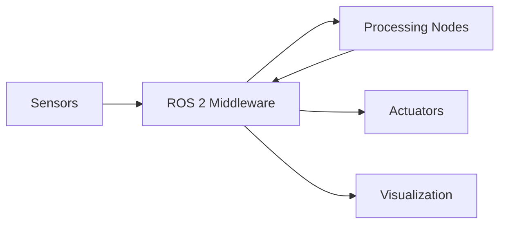

# Introduction to ROS 2

Welcome to Module 1 of the Physical AI curriculum. In this module, you'll learn ROS 2 (Robot Operating System 2), the middleware that serves as the "nervous system" for modern robots.

## What is ROS 2?

ROS 2 is not an operating system—it's a **middleware framework** that provides:

- **Communication infrastructure** between software components
- **Hardware abstraction** for sensors and actuators
- **Ecosystem of reusable packages** for common robotics tasks
- **Tools for visualization, debugging, and simulation**



## Why ROS 2?

ROS 2 builds on the success of ROS 1 while addressing its limitations:

| Feature | ROS 1 | ROS 2 |
|---------|-------|-------|
| Real-time support | Limited | Native via DDS |
| Multi-robot | Difficult | Built-in namespacing |
| Security | None | DDS-Security |
| Platform | Linux only | Linux, Windows, macOS |
| Lifecycle | No control | Managed nodes |

## ROS 2 Distributions

We use **ROS 2 Humble Hawksbill** (or Iron Irwini) in this curriculum:

- **Humble**: Long-term support (LTS) until May 2027
- **Iron**: Latest features, supported until November 2024

:::tip Distribution Choice
For production systems, prefer Humble (LTS). For learning the latest features, Iron is also supported.
:::

## Core Concepts Preview

This module covers these fundamental concepts:

### Week 1: Nodes and Communication
- **Nodes**: Independent executables that perform computation
- **Topics**: Named buses for publish-subscribe messaging
- **Messages**: Typed data structures for communication

### Week 2: Services and Actions
- **Services**: Synchronous request-response patterns
- **Actions**: Long-running tasks with feedback

### Week 3: Lifecycle and Launch
- **Lifecycle Nodes**: Managed state transitions
- **Launch Files**: System orchestration and configuration

## Setting Up Your Environment

Before proceeding, ensure your development environment is configured:

```bash
# Verify ROS 2 installation
ros2 doctor

# Check version
ros2 --version

# List available packages
ros2 pkg list
```

Expected output:
```
ROS 2 Humble Hawksbill
```

## Your First ROS 2 Command

Let's verify everything works with a simple demonstration:

```bash
# Terminal 1: Start a demo publisher
ros2 run demo_nodes_cpp talker

# Terminal 2: Start a demo subscriber
ros2 run demo_nodes_cpp listener
```

You should see the talker publishing "Hello World" messages and the listener receiving them.

## Module Learning Objectives

By the end of this module, you will be able to:

1. **Understand** the ROS 2 computation graph architecture
2. **Create** custom nodes in Python and C++
3. **Implement** publisher-subscriber communication patterns
4. **Build** service servers and clients for request-response interactions
5. **Design** action servers for long-running tasks with feedback
6. **Configure** lifecycle nodes for managed state transitions
7. **Write** launch files to orchestrate complex robot systems

## Prerequisites

- Python 3.10+ programming experience
- Basic Linux command line familiarity
- Completed Lab Setup for your hardware profile

## Workspace Setup

Create your ROS 2 workspace for this module:

```bash
# Create workspace
mkdir -p ~/ros2_ws/src
cd ~/ros2_ws

# Build the empty workspace
colcon build

# Source the workspace
source install/setup.bash

# Add to your shell configuration
echo 'source ~/ros2_ws/install/setup.bash' >> ~/.bashrc
```

## Next Steps

Continue to [ROS 2 Nodes](./nodes) to learn about the fundamental building blocks of ROS 2 applications.

## Resources

- [ROS 2 Documentation](https://docs.ros.org/en/humble/)
- [ROS 2 Tutorials](https://docs.ros.org/en/humble/Tutorials.html)
- [ROS 2 API Reference](https://docs.ros.org/en/humble/p/)
