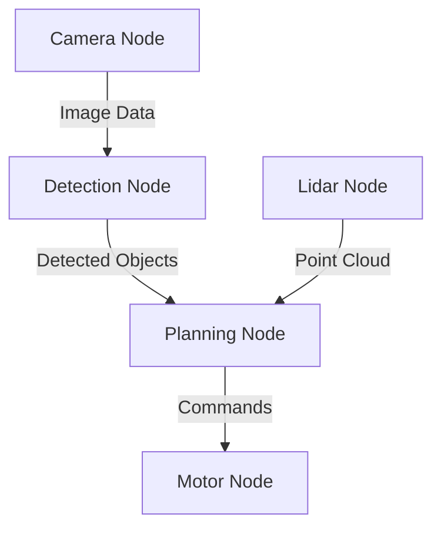
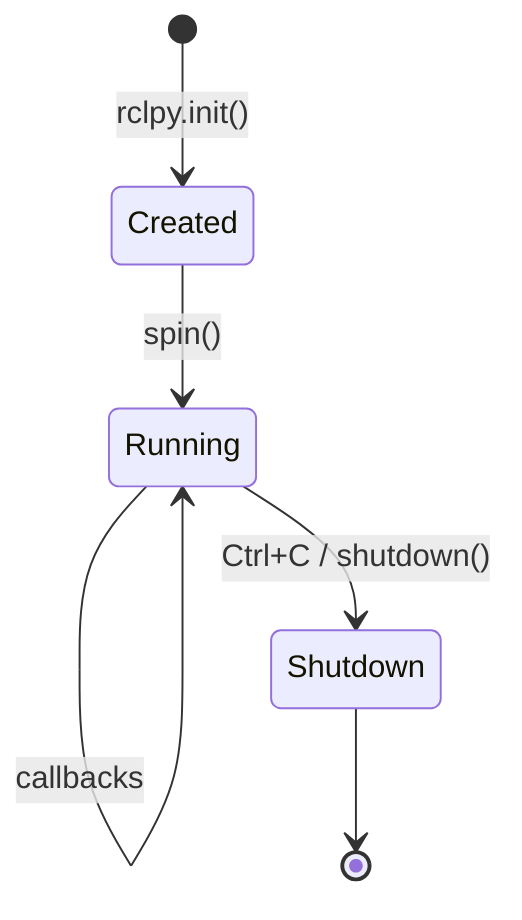

# ROS 2 Nodes

Nodes are the fundamental building blocks of ROS 2 applications. Each node is an independent process that performs a specific computational task.

## What is a Node?

A **node** is an executable that uses ROS 2 to communicate with other nodes. Think of nodes as specialized workers in a factory:



Each node:
- Has a unique name in the ROS graph
- Can publish or subscribe to topics
- Can provide or call services
- Can provide or call actions
- Runs as a separate OS process

## Node Naming

Node names follow strict conventions:

```
/namespace/node_name
```

Examples:
- `/robot1/camera_driver`
- `/robot1/object_detector`
- `/robot2/camera_driver`

:::warning Naming Rules
- Must start with a letter or underscore
- Can contain letters, numbers, underscores
- Case-sensitive
- No spaces or special characters
:::

## Creating a Python Node

### Basic Node Structure

```python
#!/usr/bin/env python3
import rclpy
from rclpy.node import Node

class MyFirstNode(Node):
    def __init__(self):
        super().__init__('my_first_node')
        self.get_logger().info('Hello from my first node!')

def main(args=None):
    rclpy.init(args=args)
    node = MyFirstNode()
    rclpy.spin(node)
    node.destroy_node()
    rclpy.shutdown()

if __name__ == '__main__':
    main()
```

### Understanding the Code

1. **`rclpy.init()`**: Initializes the ROS 2 Python client library
2. **`Node` class**: Base class for all ROS 2 Python nodes
3. **`super().__init__('name')`**: Registers the node with the given name
4. **`get_logger()`**: Access the node's logging interface
5. **`rclpy.spin()`**: Keeps the node running and processing callbacks
6. **`destroy_node()`**: Cleans up node resources
7. **`rclpy.shutdown()`**: Shuts down the ROS 2 client library

## Creating a C++ Node

### Basic Node Structure

```cpp
#include "rclcpp/rclcpp.hpp"

class MyFirstNode : public rclcpp::Node
{
public:
    MyFirstNode() : Node("my_first_node")
    {
        RCLCPP_INFO(this->get_logger(), "Hello from my first node!");
    }
};

int main(int argc, char *argv[])
{
    rclcpp::init(argc, argv);
    auto node = std::make_shared<MyFirstNode>();
    rclcpp::spin(node);
    rclcpp::shutdown();
    return 0;
}
```

## Node Lifecycle

Nodes go through a simple lifecycle:



## Node Discovery

ROS 2 uses DDS for automatic node discovery:

```bash
# List all running nodes
ros2 node list

# Get info about a specific node
ros2 node info /my_first_node
```

Example output:
```
/my_first_node
  Subscribers:

  Publishers:
    /rosout: rcl_interfaces/msg/Log

  Service Servers:
    /my_first_node/describe_parameters: ...
    /my_first_node/get_parameters: ...

  Service Clients:

  Action Servers:

  Action Clients:
```

## Node Parameters

Nodes can have configurable parameters:

```python
class ParameterizedNode(Node):
    def __init__(self):
        super().__init__('parameterized_node')

        # Declare parameters with defaults
        self.declare_parameter('update_rate', 10.0)
        self.declare_parameter('robot_name', 'robot1')

        # Get parameter values
        rate = self.get_parameter('update_rate').value
        name = self.get_parameter('robot_name').value

        self.get_logger().info(f'Rate: {rate}, Name: {name}')
```

Set parameters at runtime:
```bash
# Set parameter when launching
ros2 run my_package my_node --ros-args -p update_rate:=20.0

# Set parameter on running node
ros2 param set /parameterized_node update_rate 30.0

# Get parameter value
ros2 param get /parameterized_node update_rate
```

## Creating a ROS 2 Package

Nodes live inside packages. Create one:

```bash
cd ~/ros2_ws/src

# Create a Python package
ros2 pkg create --build-type ament_python my_first_package \
    --dependencies rclpy

# Or a C++ package
ros2 pkg create --build-type ament_cmake my_cpp_package \
    --dependencies rclcpp
```

### Package Structure (Python)

```
my_first_package/
├── package.xml           # Package metadata
├── setup.py              # Python build configuration
├── setup.cfg             # Additional setup configuration
├── resource/
│   └── my_first_package  # Marker file
└── my_first_package/     # Python module
    ├── __init__.py
    └── my_node.py        # Your node
```

### Configuring the Package

Edit `setup.py`:
```python
entry_points={
    'console_scripts': [
        'my_node = my_first_package.my_node:main',
    ],
},
```

## Building and Running

```bash
# Build the package
cd ~/ros2_ws
colcon build --packages-select my_first_package

# Source the workspace
source install/setup.bash

# Run the node
ros2 run my_first_package my_node
```

## Multi-Node Applications

A robot system typically runs many nodes:

```bash
# Check what's running
ros2 node list

# Output example:
/camera_driver
/object_detector
/path_planner
/motor_controller
```

Each node can run in its own terminal or be managed by a launch file (covered in Week 3).

## Best Practices

### 1. Single Responsibility
Each node should do one thing well:
- ✅ `camera_driver` - Only handles camera hardware
- ✅ `object_detector` - Only performs detection
- ❌ `camera_and_detection` - Too many responsibilities

### 2. Meaningful Names
```python
# Good
super().__init__('lidar_point_cloud_processor')

# Bad
super().__init__('node1')
```

### 3. Proper Shutdown Handling
```python
import signal

def main():
    rclpy.init()
    node = MyNode()

    try:
        rclpy.spin(node)
    except KeyboardInterrupt:
        pass
    finally:
        node.destroy_node()
        rclpy.shutdown()
```

### 4. Use Logging Levels
```python
self.get_logger().debug('Detailed debug info')
self.get_logger().info('Normal operation info')
self.get_logger().warn('Warning message')
self.get_logger().error('Error occurred')
self.get_logger().fatal('Critical failure')
```

## Next Steps

Now that you understand nodes, continue to [Topics and Messages](../week-02/topics) to learn how nodes communicate with each other.

## Exercises

1. Create a node that logs "Hello, ROS 2!" every second
2. Add a parameter to control the logging rate
3. Create two nodes that run simultaneously and log different messages
