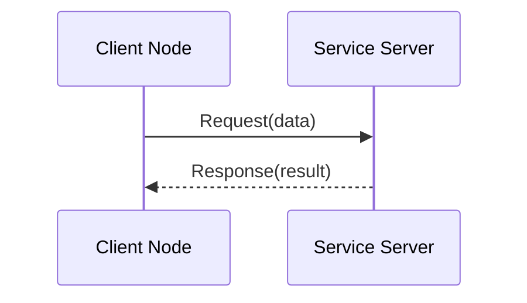
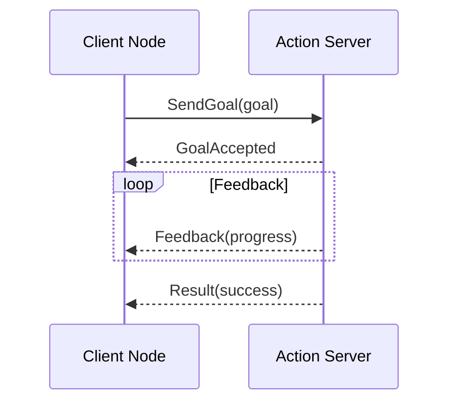

# Services and Actions

In Week 1, you learned about nodes, and in the previous section you learned about topics for asynchronous, broadcast communication. Now you'll learn about **services** and **actions** - communication patterns for request-response interactions and long-running tasks with feedback.

## What are Services?

**Services** provide synchronous request-response communication between nodes. Unlike topics, services are:
- **Synchronous**: Request waits for response
- **Point-to-point**: One client, one server
- **Request-response**: Client sends request, server sends response



## Service Architecture

### Service Types
Services have strict type definitions with request and response parts:
- `std_srvs/Empty` - No request, no response
- `std_srvs/SetBool` - Request with boolean, response with success and message
- `nav2_msgs/LoadMap` - Request with map path, response with success

### Service Interface Definition
Service definition files (`.srv`) have format:
```
# Request part (above ---)
string map_file
int32 resolution
---
# Response part (below ---)
bool success
string message
```

## Creating Services

### Python Service Server

```python
#!/usr/bin/env python3
import rclpy
from rclpy.node import Node
from std_srvs.srv import SetBool

class ToggleService(Node):
    def __init__(self):
        super().__init__('toggle_service')

        # Create a service
        self.srv = self.create_service(
            SetBool,           # Service type
            'toggle_led',      # Service name
            self.toggle_callback  # Callback function
        )

        self.led_state = False
        self.get_logger().info('Toggle service started')

    def toggle_callback(self, request, response):
        """Handle service requests"""
        self.led_state = request.data
        response.success = True
        response.message = f'LED set to {self.led_state}'

        self.get_logger().info(f'Request: {request.data}, Response: {response.message}')
        return response

def main(args=None):
    rclpy.init(args=args)
    node = ToggleService()

    try:
        rclpy.spin(node)
    except KeyboardInterrupt:
        pass
    finally:
        node.destroy_node()
        rclpy.shutdown()

if __name__ == '__main__':
    main()
```

### Python Service Client

```python
#!/usr/bin/env python3
import rclpy
from rclpy.node import Node
from std_srvs.srv import SetBool

class ToggleClient(Node):
    def __init__(self):
        super().__init__('toggle_client')

        # Create a client
        self.cli = self.create_client(SetBool, 'toggle_led')

        # Wait for service to be available
        while not self.cli.wait_for_service(timeout_sec=1.0):
            self.get_logger().info('Service not available, waiting again...')

        self.req = SetBool.Request()

    def send_request(self, state):
        self.req.data = state
        self.future = self.cli.call_async(self.req)
        rclpy.spin_until_future_complete(self, self.future)
        return self.future.result()

def main(args=None):
    rclpy.init(args=args)
    client = ToggleClient()

    # Send request
    response = client.send_request(True)
    if response:
        client.get_logger().info(f'Response: {response.success}, {response.message}')
    else:
        client.get_logger().info('Service call failed')

    client.destroy_node()
    rclpy.shutdown()

if __name__ == '__main__':
    main()
```

### C++ Service Server

```cpp
#include "rclcpp/rclcpp.hpp"
#include "std_srvs/srv/set_bool.hpp"

class ToggleService : public rclcpp::Node
{
public:
    ToggleService() : Node("toggle_service")
    {
        service_ = this->create_service<std_srvs::srv::SetBool>(
            "toggle_led",
            [this](const std::shared_ptr<rmw_request_id_t> request_header,
                   const std::shared_ptr<std_srvs::srv::SetBool::Request> request,
                   const std::shared_ptr<std_srvs::srv::SetBool::Response> response) {
                (void)request_header;
                led_state_ = request->data;
                response->success = true;
                response->message = "LED set to " + std::to_string(led_state_);
                RCLCPP_INFO(this->get_logger(), "Request: %s, Response: %s",
                           request->data ? "true" : "false", response->message.c_str());
            });

        RCLCPP_INFO(this->get_logger(), "Toggle service started");
    }

private:
    rclcpp::Service<std_srvs::srv::SetBool>::SharedPtr service_;
    bool led_state_ = false;
};
```

### C++ Service Client

```cpp
#include "rclcpp/rclcpp.hpp"
#include "std_srvs/srv/set_bool.hpp"

class ToggleClient : public rclcpp::Node
{
public:
    ToggleClient() : Node("toggle_client")
    {
        client_ = this->create_client<std_srvs::srv::SetBool>("toggle_led");

        while (!client_->wait_for_service(std::chrono::seconds(1))) {
            if (!rclcpp::ok()) {
                RCLCPP_ERROR(this->get_logger(), "Interrupted while waiting for service");
                return;
            }
            RCLCPP_INFO(this->get_logger(), "Service not available, waiting again...");
        }
    }

    void send_request(bool state)
    {
        auto request = std::make_shared<std_srvs::srv::SetBool::Request>();
        request->data = state;

        auto future = client_->async_send_request(request);
        auto status = rclcpp::spin_until_future_complete(
            shared_from_this(), future, std::chrono::seconds(3));

        if (status == rclcpp::FutureReturnCode::SUCCESS) {
            auto result = future.get();
            RCLCPP_INFO(this->get_logger(), "Response: %s, %s",
                       result->success ? "true" : "false", result->message.c_str());
        } else {
            RCLCPP_ERROR(this->get_logger(), "Service call failed");
        }
    }

private:
    rclcpp::Client<std_srvs::srv::SetBool>::SharedPtr client_;
};
```

## Service Commands

### Command Line Tools

```bash
# List all services
ros2 service list

# Get info about a service
ros2 service info /toggle_led

# Call a service from command line
ros2 service call /toggle_led std_srvs/srv/SetBool "{data: true}"

# Show service types
ros2 service types
```

## What are Actions?

**Actions** are designed for long-running tasks that require feedback and goal management. They provide:
- **Long-running operations** with feedback
- **Goal preemption** - ability to cancel/restart
- **Result reporting** when complete
- **Status tracking** throughout execution



## Action Architecture

### Action Types
Actions have three parts in their definition:
- **Goal** - Request for the action to start
- **Feedback** - Progress updates during execution
- **Result** - Final outcome when complete

### Action Interface Definition
Action definition files (`.action`) have format:
```
# Goal
int32 target_position
---
# Result
bool success
string message
---
# Feedback
float32 current_position
float32 progress_percentage
```

## Creating Actions

### Python Action Server

```python
#!/usr/bin/env python3
import time
import rclpy
from rclpy.action import ActionServer
from rclpy.node import Node
from rclpy.executors import MultiThreadedExecutor
from rclpy.callback_groups import ReentrantCallbackGroup

# Import your action type (e.g., using example_interfaces)
from example_interfaces.action import Fibonacci

class FibonacciActionServer(Node):
    def __init__(self):
        super().__init__('fibonacci_action_server')

        # Create action server with reentrant callback group for multiple goals
        self._action_server = ActionServer(
            self,
            Fibonacci,
            'fibonacci',
            self.execute_callback,
            callback_group=ReentrantCallbackGroup()
        )

        self.get_logger().info('Fibonacci action server started')

    def execute_callback(self, goal_handle):
        """Execute the action goal"""
        self.get_logger().info(f'Executing goal: {goal_handle.request.order}')

        feedback_msg = Fibonacci.Feedback()
        feedback_msg.sequence = [0, 1]

        for i in range(1, goal_handle.request.order):
            # Check if goal was canceled
            if goal_handle.is_cancel_requested:
                goal_handle.canceled()
                self.get_logger().info('Goal canceled')
                return Fibonacci.Result()

            # Update feedback
            feedback_msg.sequence.append(
                feedback_msg.sequence[i] + feedback_msg.sequence[i-1])
            goal_handle.publish_feedback(feedback_msg)

            self.get_logger().info(f'Feedback: {feedback_msg.sequence}')

            # Simulate work
            time.sleep(1)

        # Goal completed successfully
        goal_handle.succeed()
        result = Fibonacci.Result()
        result.sequence = feedback_msg.sequence
        self.get_logger().info(f'Result: {result.sequence}')

        return result

def main(args=None):
    rclpy.init(args=args)
    node = FibonacciActionServer()

    try:
        executor = MultiThreadedExecutor()
        executor.add_node(node)
        executor.spin()
    except KeyboardInterrupt:
        pass
    finally:
        node.destroy_node()
        rclpy.shutdown()

if __name__ == '__main__':
    main()
```

### Python Action Client

```python
#!/usr/bin/env python3
import time
import rclpy
from rclpy.action import ActionClient
from rclpy.node import Node
from example_interfaces.action import Fibonacci

class FibonacciActionClient(Node):
    def __init__(self):
        super().__init__('fibonacci_action_client')

        # Create action client
        self._action_client = ActionClient(
            self,
            Fibonacci,
            'fibonacci'
        )

    def send_goal(self, order):
        # Wait for action server
        self._action_client.wait_for_server()

        # Create goal
        goal_msg = Fibonacci.Goal()
        goal_msg.order = order

        # Send goal and get future
        self._send_goal_future = self._action_client.send_goal_async(
            goal_msg,
            feedback_callback=self.feedback_callback
        )

        self._send_goal_future.add_done_callback(self.goal_response_callback)

    def goal_response_callback(self, future):
        goal_handle = future.result()
        if not goal_handle.accepted:
            self.get_logger().info('Goal rejected')
            return

        self.get_logger().info('Goal accepted')

        # Get result future
        self._get_result_future = goal_handle.get_result_async()
        self._get_result_future.add_done_callback(self.get_result_callback)

    def feedback_callback(self, feedback_msg):
        self.get_logger().info(f'Received feedback: {feedback_msg.feedback.sequence}')

    def get_result_callback(self, future):
        result = future.result().result
        self.get_logger().info(f'Result: {result.sequence}')

def main(args=None):
    rclpy.init(args=args)
    action_client = FibonacciActionClient()

    # Send goal
    action_client.send_goal(10)

    try:
        rclpy.spin(action_client)
    except KeyboardInterrupt:
        pass
    finally:
        action_client.destroy_node()
        rclpy.shutdown()

if __name__ == '__main__':
    main()
```

## When to Use Each Communication Pattern

### Topics vs Services vs Actions

| Pattern | Use Case | Characteristics |
|---------|----------|----------------|
| **Topics** | Continuous data flow | Async, broadcast, loose coupling |
| **Services** | Request-response | Sync, point-to-point, immediate result |
| **Actions** | Long-running tasks | Async, with feedback, goal management |

### Decision Matrix

```
Need continuous data? → TOPICS
Need immediate response? → SERVICES
Need long-running task with feedback? → ACTIONS
```

## Advanced Service Patterns

### Service with Custom Type

`srv/AddTwoInts.srv`:
```
int64 a
int64 b
---
int64 sum
```

Server implementation:
```python
from my_package.srv import AddTwoInts

def add_callback(self, request, response):
    response.sum = request.a + request.b
    self.get_logger().info(f'{request.a} + {request.b} = {response.sum}')
    return response
```

### Service with Complex Data

```python
from geometry_msgs.msg import Pose
from nav2_msgs.srv import NavigateToPose

def navigate_callback(self, request, response):
    target_pose = request.pose
    # Perform navigation logic
    response.result = True
    response.message = f'Navigating to {target_pose.pose.position.x}, {target_pose.pose.position.y}'
    return response
```

## Advanced Action Patterns

### Preemptible Actions

```python
def execute_callback(self, goal_handle):
    self.get_logger().info('Executing goal...')

    # Check for cancellation periodically
    for step in range(100):
        if goal_handle.is_cancel_requested:
            goal_handle.canceled()
            result = MyAction.Result()
            result.success = False
            result.message = 'Goal canceled'
            return result

        # Publish feedback
        feedback_msg = MyAction.Feedback()
        feedback_msg.progress = step
        goal_handle.publish_feedback(feedback_msg)

        time.sleep(0.1)  # Simulate work

    # Complete successfully
    goal_handle.succeed()
    result = MyAction.Result()
    result.success = True
    result.message = 'Goal completed'
    return result
```

### Multiple Concurrent Goals

```python
def __init__(self):
    super().__init__('concurrent_action_server')
    self._action_server = ActionServer(
        self,
        MyAction,
        'my_action',
        self.execute_callback,
        callback_group=ReentrantCallbackGroup()  # Allows concurrent execution
    )
    self.active_goals = {}

def execute_callback(self, goal_handle):
    goal_id = goal_handle.goal_id.uuid
    self.active_goals[goal_id] = goal_handle

    # Execute goal logic here
    result = self.execute_goal_logic(goal_handle)

    # Remove from active goals when done
    del self.active_goals[goal_id]
    return result
```

## Best Practices

### Service Best Practices

1. **Keep Services Fast**: Services are synchronous - don't do heavy processing
2. **Use Appropriate Types**: Choose message types that match your data
3. **Handle Errors Gracefully**: Always return valid responses

```python
def service_callback(self, request, response):
    try:
        # Process request
        result = self.process_request(request)
        response.success = True
        response.result = result
    except Exception as e:
        response.success = False
        response.message = str(e)
    return response
```

### Action Best Practices

1. **Provide Meaningful Feedback**: Update progress regularly
2. **Handle Cancellation**: Check `is_cancel_requested` periodically
3. **Use Appropriate Update Frequency**: Don't overwhelm with feedback

```python
def execute_callback(self, goal_handle):
    for step in range(total_steps):
        # Check for cancellation
        if goal_handle.is_cancel_requested:
            goal_handle.canceled()
            return MyAction.Result()

        # Do work
        self.do_work_step(step)

        # Provide feedback every 10 steps
        if step % 10 == 0:
            feedback = MyAction.Feedback()
            feedback.progress = step / total_steps * 100
            goal_handle.publish_feedback(feedback)

        time.sleep(0.1)

    goal_handle.succeed()
    return MyAction.Result()
```

## Common Pitfalls

### Service Pitfalls

1. **Blocking Operations**: Services are synchronous - avoid long operations
2. **Service Discovery**: Client must wait for service to be available
3. **Error Handling**: Always handle service call failures

### Action Pitfalls

1. **Feedback Overload**: Don't send feedback too frequently
2. **Cancellation Logic**: Always check for cancellation in loops
3. **Result Handling**: Ensure results are properly returned

## Next Steps

Now that you understand services and actions, continue to [Lifecycle and Launch](../week-03/lifecycle) to learn about managed node states and system orchestration.

## Exercises

1. Create a service that calculates the distance between two points
2. Create an action that simulates a robot moving to a goal position with feedback
3. Implement a service client that calls your distance service
4. Create a custom action type for a robot arm movement task