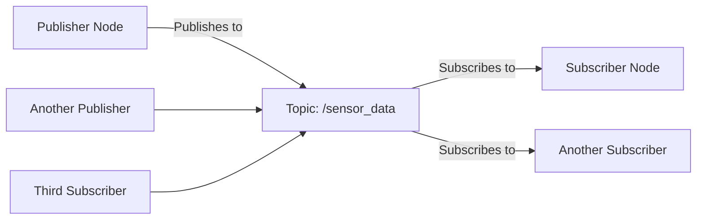

# Topics and Messages

In Week 1, you learned about nodes - the fundamental building blocks of ROS 2. Now you'll learn how nodes communicate with each other using **topics** and **messages** - the publish-subscribe communication pattern that enables distributed robot systems.

## What are Topics and Messages?

**Topics** are named buses over which nodes exchange messages. **Messages** are the data structures that carry information between nodes. This publish-subscribe pattern allows for loose coupling between nodes - publishers don't need to know who subscribes, and subscribers don't need to know who publishes.



## Topic Architecture

### Publish-Subscribe Pattern
- **Publishers** send messages to a topic
- **Subscribers** receive messages from a topic
- **Topics** are uniquely named (e.g., `/cmd_vel`, `/laser_scan`, `/image_raw`)
- Communication is **asynchronous** and **broadcast** - one publisher can have many subscribers

### Message Types
Messages have strict type definitions:
- `std_msgs/Int32` - 32-bit integer
- `sensor_msgs/LaserScan` - Laser range data
- `geometry_msgs/Twist` - Velocity commands
- `sensor_msgs/Image` - Image data

## Creating Publishers

### Python Publisher

```python
#!/usr/bin/env python3
import rclpy
from rclpy.node import Node
from std_msgs.msg import String

class TalkerNode(Node):
    def __init__(self):
        super().__init__('talker')

        # Create a publisher
        self.publisher = self.create_publisher(
            String,           # Message type
            'chatter',        # Topic name
            10                # Queue size
        )

        # Create a timer to publish periodically
        timer_period = 0.5  # seconds
        self.timer = self.create_timer(timer_period, self.timer_callback)

        self.i = 0
        self.get_logger().info('Talker node started')

    def timer_callback(self):
        msg = String()
        msg.data = f'Hello World: {self.i}'
        self.publisher.publish(msg)
        self.get_logger().info(f'Publishing: "{msg.data}"')
        self.i += 1

def main(args=None):
    rclpy.init(args=args)
    node = TalkerNode()

    try:
        rclpy.spin(node)
    except KeyboardInterrupt:
        pass
    finally:
        node.destroy_node()
        rclpy.shutdown()

if __name__ == '__main__':
    main()
```

### C++ Publisher

```cpp
#include "rclcpp/rclcpp.hpp"
#include "std_msgs/msg/string.hpp"

class TalkerNode : public rclcpp::Node
{
public:
    TalkerNode() : Node("talker")
    {
        publisher_ = this->create_publisher<std_msgs::msg::String>(
            "chatter", 10);

        timer_ = this->create_wall_timer(
            std::chrono::milliseconds(500),
            std::bind(&TalkerNode::timer_callback, this));

        RCLCPP_INFO(this->get_logger(), "Talker node started");
    }

private:
    void timer_callback()
    {
        auto message = std_msgs::msg::String();
        message.data = "Hello World: " + std::to_string(count_++);
        RCLCPP_INFO(this->get_logger(), "Publishing: '%s'", message.data.c_str());
        publisher_->publish(message);
    }

    rclcpp::TimerBase::SharedPtr timer_;
    rclcpp::Publisher<std_msgs::msg::String>::SharedPtr publisher_;
    size_t count_ = 0;
};
```

## Creating Subscribers

### Python Subscriber

```python
#!/usr/bin/env python3
import rclpy
from rclpy.node import Node
from std_msgs.msg import String

class ListenerNode(Node):
    def __init__(self):
        super().__init__('listener')

        # Create a subscription
        self.subscription = self.create_subscription(
            String,           # Message type
            'chatter',        # Topic name
            self.listener_callback,  # Callback function
            10                # Queue size
        )
        # Prevent unused variable warning
        self.subscription

        self.get_logger().info('Listener node started')

    def listener_callback(self, msg):
        self.get_logger().info(f'I heard: "{msg.data}"')

def main(args=None):
    rclpy.init(args=args)
    node = ListenerNode()

    try:
        rclpy.spin(node)
    except KeyboardInterrupt:
        pass
    finally:
        node.destroy_node()
        rclpy.shutdown()

if __name__ == '__main__':
    main()
```

### C++ Subscriber

```cpp
#include "rclcpp/rclcpp.hpp"
#include "std_msgs/msg/string.hpp"

class ListenerNode : public rclcpp::Node
{
public:
    ListenerNode() : Node("listener")
    {
        subscription_ = this->create_subscription<std_msgs::msg::String>(
            "chatter", 10,
            [this](const std_msgs::msg::String::SharedPtr msg) {
                RCLCPP_INFO(this->get_logger(), "I heard: '%s'", msg->data.c_str());
            });

        RCLCPP_INFO(this->get_logger(), "Listener node started");
    }

private:
    rclcpp::Subscription<std_msgs::msg::String>::SharedPtr subscription_;
};
```

## Message Types

### Standard Message Types

ROS 2 provides many standard message types:

**Basic Types:**
- `std_msgs/Bool`, `std_msgs/Int32`, `std_msgs/Float64`
- `std_msgs/String`, `std_msgs/ColorRGBA`

**Geometry:**
- `geometry_msgs/Twist` - Linear and angular velocities
- `geometry_msgs/Pose` - Position and orientation
- `geometry_msgs/Point` - 3D point coordinates

**Sensors:**
- `sensor_msgs/LaserScan` - Laser range finder data
- `sensor_msgs/Image` - Camera image data
- `sensor_msgs/Imu` - Inertial measurement unit data

### Creating Custom Messages

Create a custom message by defining a `.msg` file:

`msg/RobotStatus.msg`:
```
# Custom robot status message
string robot_name
int32 battery_level
bool is_moving
geometry_msgs/Pose current_pose
```

Package configuration for custom messages:
```xml
<!-- package.xml -->
<build_depend>rosidl_default_generators</build_depend>
<exec_depend>rosidl_default_runtime</exec_depend>
<member_of_group>rosidl_interface_packages</member_of_group>
```

```python
# setup.py
('share/' + package_name + '/msg', ['msg/RobotStatus.msg']),
```

## Quality of Service (QoS)

QoS settings control how messages are delivered:

```python
from rclpy.qos import QoSProfile, ReliabilityPolicy, DurabilityPolicy

# Configure QoS for sensor data (may lose messages)
sensor_qos = QoSProfile(
    depth=10,
    reliability=ReliabilityPolicy.BEST_EFFORT,
    durability=DurabilityPolicy.VOLATILE
)

# Configure QoS for critical commands (must not lose messages)
command_qos = QoSProfile(
    depth=1,
    reliability=ReliabilityPolicy.RELIABLE,
    durability=DurabilityPolicy.TRANSIENT_LOCAL
)

# Use in publisher/subscriber
publisher = self.create_publisher(String, 'topic', sensor_qos)
subscription = self.create_subscription(String, 'topic', callback, command_qos)
```

## Topic Commands

### Command Line Tools

```bash
# List all topics
ros2 topic list

# Get info about a topic
ros2 topic info /chatter

# Echo messages from a topic
ros2 topic echo /chatter std_msgs/msg/String

# Publish to a topic from command line
ros2 topic pub /chatter std_msgs/msg/String "data: 'Hello from CLI'"

# Show topic statistics
ros2 topic hz /chatter
ros2 topic bw /chatter
```

### Programmatic Discovery

```python
# Get list of topics
topics = self.get_topic_names_and_types()

# Check if topic exists
if '/chatter' in [name for name, _ in topics]:
    self.get_logger().info('Topic exists')
```

## Advanced Patterns

### Multiple Publishers/One Topic

```python
class MultiSourceNode(Node):
    def __init__(self):
        super().__init__('multi_source')

        # Same topic, different publishers
        self.pub_sensor = self.create_publisher(String, 'data_stream', 10)
        self.pub_control = self.create_publisher(String, 'data_stream', 10)

        # Both publish to the same topic
        self.timer = self.create_timer(1.0, self.publish_data)

    def publish_data(self):
        self.pub_sensor.publish(String(data=f'Sensor: {self.get_clock().now()}'))
        self.pub_control.publish(String(data=f'Control: {self.get_clock().now()}'))
```

### Topic Remapping

```bash
# Remap topic names when running
ros2 run my_package my_node --ros-args --remap chatter:=robot1_chatter
```

```python
# Remap in code
self.publisher = self.create_publisher(String, 'robot1/chatter', 10)
```

## Best Practices

### 1. Choose Appropriate QoS
```python
# For sensor data that can tolerate some loss
sensor_pub = self.create_publisher(LaserScan, 'scan',
    QoSProfile(depth=5, reliability=ReliabilityPolicy.BEST_EFFORT))

# For critical commands that must be delivered
cmd_pub = self.create_publisher(Twist, 'cmd_vel',
    QoSProfile(depth=1, reliability=ReliabilityPolicy.RELIABLE))
```

### 2. Use Meaningful Topic Names
```
# Good
/cmd_vel
/sensor/scan
/navigation/goal
/robot1/joint_states

# Avoid
/data
/msgs
/topic1
```

### 3. Manage Queue Sizes
```python
# Small queue for real-time data
realtime_pub = self.create_publisher(Image, 'image_raw', 1)

# Larger queue for processing
buffered_pub = self.create_publisher(PointCloud2, 'points', 100)
```

### 4. Handle Message Callbacks Efficiently
```python
def callback(self, msg):
    # Process quickly or use threading for heavy processing
    if self.processing_needed:
        # Move heavy processing to separate thread
        self.processing_thread = threading.Thread(
            target=self.heavy_processing, args=(msg,))
        self.processing_thread.start()
    else:
        # Quick processing directly in callback
        self.quick_process(msg)
```

## Common Pitfalls

### 1. Topic Matching
Ensure publisher and subscriber use identical topic names and message types:
```python
# Publisher
pub = self.create_publisher(Image, 'camera/image_raw', 10)

# Subscriber must match exactly
sub = self.create_subscription(Image, 'camera/image_raw', callback, 10)
# NOT: 'camera/image' or sensor_msgs/Image
```

### 2. Message Serialization
Messages are serialized when published - avoid publishing large data frequently:
```python
# Bad - publishing large point clouds at high frequency
# Better - downsample or use separate topics for different data rates
```

### 3. Memory Management
```python
# Keep queue sizes reasonable to avoid memory issues
publisher = self.create_publisher(LargeMessage, 'topic', 10)  # Not 1000
```

## Next Steps

Now that you understand topics and messages, continue to [Services and Actions](../week-02/services) to learn about request-response communication patterns and long-running tasks with feedback.

## Exercises

1. Create a publisher that sends temperature readings every 2 seconds
2. Create a subscriber that processes and logs these temperature readings
3. Add QoS settings appropriate for temperature data
4. Create a custom message type for sensor fusion data