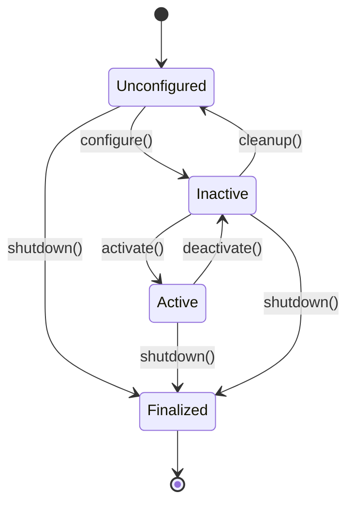

# Lifecycle and Launch

In previous weeks, you learned about nodes and communication patterns. Now you'll learn about **lifecycle nodes** and **launch systems** - essential tools for building robust, production-ready robotic systems that can be managed, monitored, and orchestrated effectively.

## What are Lifecycle Nodes?

**Lifecycle nodes** are nodes that implement a well-defined state machine for managing their lifecycle. Unlike regular nodes that start and run continuously, lifecycle nodes can be:
- **Configured**: Set up with parameters
- **Activated**: Started to begin operations
- **Deactivated**: Paused without shutting down
- **Cleaned up**: Prepared for shutdown
- **Unconfigured**: Returned to initial state



## Why Lifecycle Nodes?

Regular nodes have a simple lifecycle:
- Start → Run → Shutdown

Lifecycle nodes provide **managed state transitions**:
- **Graceful startup**: Configure resources before activation
- **Runtime management**: Pause/resume without restart
- **Resource management**: Proper cleanup of hardware resources
- **Monitoring**: Track node health and state
- **Fault tolerance**: Handle failures gracefully

## Lifecycle Node States

### State Definitions
- **Unconfigured**: Node created, waiting for configuration
- **Inactive**: Configured but not running, resources allocated
- **Active**: Running and operational
- **Finalized**: Shut down and destroyed

### Transition Callbacks
Lifecycle nodes implement specific callbacks for each transition:
- `on_configure()`: Prepare resources
- `on_activate()`: Start operations
- `on_deactivate()`: Pause operations
- `on_cleanup()`: Release resources
- `on_shutdown()`: Final cleanup

## Creating Lifecycle Nodes

### Python Lifecycle Node

```python
#!/usr/bin/env python3
import rclpy
from rclpy.lifecycle import LifecycleNode, LifecycleState, TransitionCallbackReturn
from rclpy.lifecycle import Publisher
from std_msgs.msg import String

class LifecycleTalker(LifecycleNode):
    def __init__(self):
        super().__init__('lifecycle_talker')
        self.timer = None
        self.pub = None

        self.get_logger().info('Lifecycle talker node created, waiting for configuration')

    def on_configure(self, state):
        """Called when node transitions to configuring state"""
        self.get_logger().info(f'Configuring node from state: {state.label}')

        # Create publisher (but not active yet)
        self.pub = self.create_publisher(String, 'lifecycle_chatter', 10)

        # Create timer (but not started yet)
        self.timer_period = 1.0
        self.timer = self.create_timer(self.timer_period, self.timer_callback)
        self.timer.cancel()  # Don't start timer yet

        # Return success to allow transition to inactive
        return TransitionCallbackReturn.SUCCESS

    def on_activate(self, state):
        """Called when node transitions to activating state"""
        self.get_logger().info(f'Activating node from state: {state.label}')

        # Activate publisher
        self.pub.on_activate()

        # Start timer
        self.timer.reset()

        # Return success to allow transition to active
        return TransitionCallbackReturn.SUCCESS

    def on_deactivate(self, state):
        """Called when node transitions to deactivating state"""
        self.get_logger().info(f'Deactivating node from state: {state.label}')

        # Pause publisher
        self.pub.on_deactivate()

        # Stop timer
        self.timer.cancel()

        # Return success to allow transition to inactive
        return TransitionCallbackReturn.SUCCESS

    def on_cleanup(self, state):
        """Called when node transitions to cleaning up state"""
        self.get_logger().info(f'Cleaning up node from state: {state.label}')

        # Destroy timer
        self.timer.destroy()
        self.timer = None

        # Destroy publisher
        self.pub.destroy()
        self.pub = None

        # Return success to allow transition to unconfigured
        return TransitionCallbackReturn.SUCCESS

    def on_shutdown(self, state):
        """Called when node transitions to shutting down state"""
        self.get_logger().info(f'Shutting down node from state: {state.label}')

        # Clean up any remaining resources
        if self.timer:
            self.timer.cancel()
            self.timer.destroy()

        if self.pub:
            self.pub.destroy()

        # Return success
        return TransitionCallbackReturn.SUCCESS

    def timer_callback(self):
        """Timer callback - only active when in Active state"""
        if self.pub is not None and self.pub.is_activated:
            msg = String()
            msg.data = f'Lifecycle message at {self.get_clock().now().nanoseconds}'
            self.pub.publish(msg)
            self.get_logger().info(f'Published: {msg.data}')

def main(args=None):
    rclpy.init(args=args)

    # Create lifecycle node
    node = LifecycleTalker()

    # Spin to process callbacks
    try:
        rclpy.spin(node)
    except KeyboardInterrupt:
        pass
    finally:
        node.destroy_node()
        rclpy.shutdown()

if __name__ == '__main__':
    main()
```

### C++ Lifecycle Node

```cpp
#include "rclcpp/rclcpp.hpp"
#include "rclcpp_lifecycle/lifecycle_node.hpp"
#include "rclcpp_lifecycle/lifecycle_publisher.hpp"
#include "std_msgs/msg/string.hpp"

using namespace std::chrono_literals;

class LifecycleTalker : public rclcpp_lifecycle::LifecycleNode
{
public:
    LifecycleTalker() : rclcpp_lifecycle::LifecycleNode("lifecycle_talker")
    {
        RCLCPP_INFO(get_logger(), "Lifecycle talker node created, waiting for configuration");
    }

private:
    // Lifecycle callbacks
    rclcpp_lifecycle::node_interfaces::LifecycleNodeInterface::CallbackReturn
    on_configure(const rclcpp_lifecycle::State &)
    {
        RCLCPP_INFO(get_logger(), "Configuring lifecycle talker");

        // Create publisher and timer
        pub_ = this->create_publisher<std_msgs::msg::String>("lifecycle_chatter", 10);
        timer_ = this->create_wall_timer(
            1s, std::bind(&LifecycleTalker::timer_callback, this));
        timer_->cancel();  // Don't start yet

        return rclcpp_lifecycle::node_interfaces::LifecycleNodeInterface::CallbackReturn::SUCCESS;
    }

    rclcpp_lifecycle::node_interfaces::LifecycleNodeInterface::CallbackReturn
    on_activate(const rclcpp_lifecycle::State &)
    {
        RCLCPP_INFO(get_logger(), "Activating lifecycle talker");

        // Activate publisher and start timer
        pub_->on_activate();
        timer_->reset();

        return rclcpp_lifecycle::node_interfaces::LifecycleNodeInterface::CallbackReturn::SUCCESS;
    }

    rclcpp_lifecycle::node_interfaces::LifecycleNodeInterface::CallbackReturn
    on_deactivate(const rclcpp_lifecycle::State &)
    {
        RCLCPP_INFO(get_logger(), "Deactivating lifecycle talker");

        // Deactivate publisher and stop timer
        pub_->on_deactivate();
        timer_->cancel();

        return rclcpp_lifecycle::node_interfaces::LifecycleNodeInterface::CallbackReturn::SUCCESS;
    }

    rclcpp_lifecycle::node_interfaces::LifecycleNodeInterface::CallbackReturn
    on_cleanup(const rclcpp_lifecycle::State &)
    {
        RCLCPP_INFO(get_logger(), "Cleaning up lifecycle talker");

        // Destroy timer and publisher
        timer_.reset();
        pub_.reset();

        return rclcpp_lifecycle::node_interfaces::LifecycleNodeInterface::CallbackReturn::SUCCESS;
    }

    rclcpp_lifecycle::node_interfaces::LifecycleNodeInterface::CallbackReturn
    on_shutdown(const rclcpp_lifecycle::State &)
    {
        RCLCPP_INFO(get_logger(), "Shutting down lifecycle talker");

        // Final cleanup
        timer_.reset();
        pub_.reset();

        return rclcpp_lifecycle::node_interfaces::LifecycleNodeInterface::CallbackReturn::SUCCESS;
    }

    void timer_callback()
    {
        if (pub_ && pub_->is_activated()) {
            auto msg = std_msgs::msg::String();
            msg.data = "Lifecycle message at " + std::to_string(this->now().nanoseconds());
            pub_->publish(msg);
            RCLCPP_INFO(get_logger(), "Published: %s", msg.data.c_str());
        }
    }

    rclcpp_lifecycle::LifecyclePublisher<std_msgs::msg::String>::SharedPtr pub_;
    rclcpp::TimerBase::SharedPtr timer_;
};
```

## Lifecycle Commands

### Command Line Tools

```bash
# List lifecycle nodes
ros2 lifecycle list /lifecycle_talker

# Get current state
ros2 lifecycle get /lifecycle_talker

# Trigger state transitions
ros2 lifecycle configure /lifecycle_talker
ros2 lifecycle activate /lifecycle_talker
ros2 lifecycle deactivate /lifecycle_talker
ros2 lifecycle cleanup /lifecycle_talker
ros2 lifecycle shutdown /lifecycle_talker

# Trigger transition directly
ros2 lifecycle set /lifecycle_talker configure
```

## Launch Systems

**Launch systems** allow you to start multiple nodes with a single command, configure parameters, and manage complex robot systems.

### Launch File Structure

Launch files are Python scripts that define node configurations:

`launch/example_launch.py`:
```python
from launch import LaunchDescription
from launch_ros.actions import Node
from launch.actions import DeclareLaunchArgument
from launch.substitutions import LaunchConfiguration
from launch.conditions import IfCondition

def generate_launch_description():
    # Declare launch arguments
    use_sim_time = LaunchConfiguration('use_sim_time', default='false')

    return LaunchDescription([
        # Declare launch arguments
        DeclareLaunchArgument(
            'use_sim_time',
            default_value='false',
            description='Use simulation time if true'
        ),

        # Launch lifecycle talker node
        Node(
            package='my_package',
            executable='lifecycle_talker',
            name='lifecycle_talker',
            parameters=[
                {'use_sim_time': use_sim_time},
                {'publish_rate': 1.0}
            ],
            output='screen'
        ),

        # Launch regular node
        Node(
            package='my_package',
            executable='listener',
            name='listener',
            parameters=[
                {'use_sim_time': use_sim_time}
            ],
            output='screen'
        )
    ])
```

### Launch with Arguments

```bash
# Launch with default arguments
ros2 launch my_package example_launch.py

# Launch with custom arguments
ros2 launch my_package example_launch.py use_sim_time:=true

# Launch specific nodes only
ros2 launch my_package example_launch.py --show-args
```

## Advanced Launch Features

### Conditional Launch

```python
from launch.conditions import IfCondition, UnlessCondition
from launch.substitutions import LaunchConfiguration

def generate_launch_description():
    sim_mode = LaunchConfiguration('sim_mode', default='false')

    return LaunchDescription([
        DeclareLaunchArgument(
            'sim_mode',
            default_value='false',
            description='Run in simulation mode'
        ),

        # Launch different nodes based on condition
        Node(
            package='my_package',
            executable='sim_sensor',
            name='sensor',
            condition=IfCondition(sim_mode)  # Only if sim_mode is true
        ),

        Node(
            package='my_package',
            executable='real_sensor',
            name='sensor',
            condition=UnlessCondition(sim_mode)  # Only if sim_mode is false
        )
    ])
```

### Composable Nodes

Launch multiple nodes in a single process:

```python
from launch_ros.actions import ComposableNodeContainer
from launch_ros.descriptions import ComposableNode

def generate_launch_description():
    container = ComposableNodeContainer(
        name='image_processing_container',
        namespace='',
        package='rclcpp_components',
        executable='component_container',
        composable_node_descriptions=[
            ComposableNode(
                package='image_proc',
                plugin='image_proc::RectifyNode',
                name='rectify_node'
            ),
            ComposableNode(
                package='image_view',
                plugin='image_view::ImageViewNode',
                name='image_view_node'
            )
        ],
        output='screen'
    )

    return LaunchDescription([container])
```

### Launch Substitutions

```python
from launch.substitutions import TextSubstitution, PathJoinSubstitution
from launch_ros.substitutions import FindPackageShare

def generate_launch_description():
    config_file = PathJoinSubstitution([
        FindPackageShare('my_package'),
        'config',
        'robot.yaml'
    ])

    return LaunchDescription([
        Node(
            package='my_package',
            executable='robot_node',
            name='robot_node',
            parameters=[config_file],
            output='screen'
        )
    ])
```

## Launch Parameters and Configuration

### YAML Parameter Files

`config/robot.yaml`:
```yaml
robot_node:
  ros__parameters:
    wheel_radius: 0.05
    base_width: 0.3
    max_velocity: 1.0
    use_sim_time: false
    sensors:
      lidar_enabled: true
      camera_enabled: false
```

Use in launch file:
```python
from launch.substitutions import PathJoinSubstitution
from launch_ros.substitutions import FindPackageShare

def generate_launch_description():
    config_file = PathJoinSubstitution([
        FindPackageShare('my_package'),
        'config',
        'robot.yaml'
    ])

    return LaunchDescription([
        Node(
            package='my_package',
            executable='robot_node',
            name='robot_node',
            parameters=[config_file],
            output='screen'
        )
    ])
```

## Best Practices

### Lifecycle Node Best Practices

1. **Always implement cleanup**: Ensure resources are properly released
2. **Handle failures gracefully**: Return appropriate transition results
3. **Use state for validation**: Check current state before transitions

```python
def on_activate(self, state):
    # Validate preconditions
    if not self.hardware_ready:
        self.get_logger().error('Hardware not ready for activation')
        return TransitionCallbackReturn.FAILURE

    # Perform activation
    self.pub.on_activate()
    self.timer.reset()

    return TransitionCallbackReturn.SUCCESS
```

### Launch Best Practices

1. **Organize by functionality**: Group related nodes together
2. **Use meaningful names**: Make it clear what each launch file does
3. **Provide defaults**: Make launch files easy to use without arguments
4. **Document arguments**: Explain what each launch argument does

```python
def generate_launch_description():
    return LaunchDescription([
        DeclareLaunchArgument(
            'robot_name',
            default_value='robot1',
            description='Name of the robot to launch'
        ),
        # ... nodes using robot_name
    ])
```

## Common Patterns

### Sensor Lifecycle Pattern

```python
def on_configure(self, state):
    # Initialize sensor connection
    self.sensor = SensorDriver()
    return TransitionCallbackReturn.SUCCESS

def on_activate(self, state):
    # Start sensor data collection
    self.sensor.start()
    return TransitionCallbackReturn.SUCCESS

def on_deactivate(self, state):
    # Pause sensor but keep connection
    self.sensor.pause()
    return TransitionCallbackReturn.SUCCESS

def on_cleanup(self, state):
    # Close sensor connection
    self.sensor.close()
    return TransitionCallbackReturn.SUCCESS
```

### Complex Launch Pattern

```python
def generate_launch_description():
    # Common parameters
    declare_use_sim_time = DeclareLaunchArgument(
        'use_sim_time',
        default_value='false',
        description='Use simulation time if true'
    )

    # Robot description
    robot_description = ParameterValue(
        Command(['xacro ', LaunchConfiguration('robot_description_file')]),
        value_type=str
    )

    return LaunchDescription([
        declare_use_sim_time,

        # Robot state publisher
        Node(
            package='robot_state_publisher',
            executable='robot_state_publisher',
            parameters=[{'robot_description': robot_description}],
            output='screen'
        ),

        # Joint state publisher
        Node(
            package='joint_state_publisher',
            executable='joint_state_publisher',
            output='screen'
        )
    ])
```

## Monitoring and Debugging

### Lifecycle Node Monitoring

```bash
# Monitor state changes
ros2 lifecycle list /lifecycle_node

# Watch for state transitions
watch -n 1 'ros2 lifecycle get /lifecycle_node'

# Get detailed state information
ros2 lifecycle get /lifecycle_node --verbose
```

### Launch Debugging

```bash
# Show launch file arguments
ros2 launch my_package my_launch.py --show-args

# Dry run (don't actually launch)
ros2 launch my_package my_launch.py --dry-run

# Launch with verbose output
ros2 launch my_package my_launch.py --log-level debug
```

## Next Steps

Now that you understand lifecycle nodes and launch systems, continue to [System Management](../week-03/system) to learn about monitoring, debugging, and managing complex robot systems.

## Exercises

1. Create a lifecycle node that manages a simulated sensor
2. Create a launch file that starts multiple lifecycle nodes
3. Add conditional launching based on parameters
4. Create a parameter configuration file for your nodes