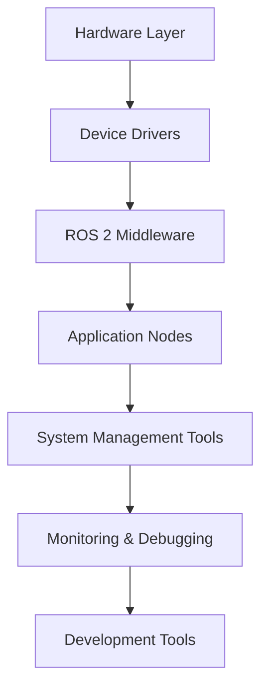

# System Management and Monitoring

In previous weeks, you learned about nodes, communication patterns, and lifecycle management. Now you'll learn about **system management** and **monitoring tools** that are essential for developing, debugging, and maintaining robust robotic systems in both development and production environments.

## System Architecture Overview

A complete robotic system involves multiple layers:



## ROS 2 Command Line Tools

### Node Management

```bash
# List all running nodes
ros2 node list

# Get detailed information about a specific node
ros2 node info /my_node

# List nodes with more details
ros2 node list --all

# Get node parameters
ros2 param list /my_node

# Get a specific parameter
ros2 param get /my_node param_name

# Set a parameter
ros2 param set /my_node param_name value

# Describe parameters
ros2 param describe /my_node param_name
```

### Topic and Service Monitoring

```bash
# List all topics
ros2 topic list

# Get information about a topic
ros2 topic info /topic_name

# Echo messages from a topic
ros2 topic echo /topic_name

# Show topic statistics
ros2 topic hz /topic_name    # Message frequency
ros2 topic bw /topic_name    # Bandwidth usage
ros2 topic delay /topic_name # Message delay

# List all services
ros2 service list

# Call a service
ros2 service call /service_name service_type "request_data"

# Get service info
ros2 service info /service_name
```

### Action Monitoring

```bash
# List all actions
ros2 action list

# Get action info
ros2 action info /action_name

# Send a goal
ros2 action send_goal /action_name action_type "goal_data"
```

## System Monitoring Tools

### Resource Monitoring

```bash
# Monitor ROS 2 processes
ros2 doctor

# Show system information
ros2 doctor --report

# Check network connectivity
ros2 doctor --report --include network

# Check environment
ros2 doctor --report --include environment
```

### Performance Monitoring

```bash
# Monitor CPU and memory usage
htop
# or
top

# Monitor network usage
iftop
# or
nethogs

# Monitor disk usage
df -h
du -sh ~/ros2_ws
```

## Logging and Debugging

### ROS 2 Logging System

ROS 2 provides structured logging with different levels:

```python
# Python logging levels
self.get_logger().debug('Detailed debug information')
self.get_logger().info('Normal operation information')
self.get_logger().warn('Warning message')
self.get_logger().error('Error occurred')
self.get_logger().fatal('Critical failure')
```

### Log Configuration

Configure logging in launch files:

```python
from launch.actions import SetEnvironmentVariable

def generate_launch_description():
    return LaunchDescription([
        # Set log level
        SetEnvironmentVariable(
            name='RCUTILS_LOGGING_SEVERITY_THRESHOLD',
            value='INFO'
        ),

        Node(
            package='my_package',
            executable='my_node',
            name='my_node',
            output='screen',  # or 'log' for file logging
            emulate_tty=True
        )
    ])
```

### Log Files

ROS 2 logs are stored in:
```
~/.ros/log/          # Default location
~/ros2_ws/log/       # Workspace logs
/tmp/ros2_log/       # Temporary logs
```

## Visualization Tools

### RViz2 - 3D Visualization

RViz2 is ROS 2's 3D visualization tool for visualizing robot state, sensor data, and planning information.

```bash
# Launch RViz2
rviz2

# Launch with a specific configuration
rviz2 -d config/my_config.rviz
```

Common RViz2 displays:
- **RobotModel**: Shows robot URDF model
- **LaserScan**: Visualizes laser scan data
- **PointCloud**: Shows 3D point cloud data
- **TF**: Displays coordinate transforms
- **Image**: Shows camera images
- **Marker**: Custom visualization markers

### PlotJuggler - Data Plotting

For plotting numerical data from topics:

```bash
# Install PlotJuggler
sudo apt install ros-humble-plotjuggler-ros

# Launch PlotJuggler
ros2 run plotjuggler plotjuggler
```

## System Architecture Patterns

### Master-Slave Architecture

For distributed systems, use ROS 2's DDS discovery mechanism:

```bash
# On main computer (master)
export ROS_DOMAIN_ID=0
export ROS_LOCALHOST_ONLY=0
ros2 launch my_package master.launch.py

# On robot computer (slave)
export ROS_DOMAIN_ID=0
export ROS_LOCALHOST_ONLY=0
ros2 launch my_package robot.launch.py
```

### Multi-Robot Systems

For multiple robots, use namespace isolation:

```python
# Robot 1
Node(
    package='navigation2',
    executable='nav2',
    name='nav2',
    namespace='robot1',
    parameters=[config_file]
)

# Robot 2
Node(
    package='navigation2',
    executable='nav2',
    name='nav2',
    namespace='robot2',
    parameters=[config_file]
)
```

## Configuration Management

### Parameter Files

Use YAML files for complex parameter configurations:

`config/robot_config.yaml`:
```yaml
/**:  # Apply to all nodes
  ros__parameters:
    use_sim_time: false
    log_level: "INFO"

robot_controller:
  ros__parameters:
    max_velocity: 1.0
    acceleration_limit: 2.0
    control_frequency: 50.0

sensor_processor:
  ros__parameters:
    queue_size: 10
    processing_timeout: 0.1
    calibration_file: "/path/to/calibration.yaml"
```

### Dynamic Parameter Reconfiguration

Use parameters that can be changed at runtime:

```python
def __init__(self):
    super().__init__('dynamic_param_node')

    # Declare parameters with descriptions
    self.declare_parameter(
        'control_gain',
        1.0,
        descriptor=rclpy.node.ParameterDescriptor(
            description='Control system gain factor'
        )
    )

    # Set up parameter callback
    self.add_on_set_parameters_callback(self.parameter_callback)

def parameter_callback(self, params):
    """Handle parameter changes"""
    for param in params:
        if param.name == 'control_gain' and param.type_ == Parameter.Type.DOUBLE:
            self.control_gain = param.value
            self.get_logger().info(f'Control gain updated to: {self.control_gain}')

    return SetParametersResult(successful=True)
```

## System Health Monitoring

### Health Check Patterns

Implement health monitoring in your nodes:

```python
class HealthMonitorNode(Node):
    def __init__(self):
        super().__init__('health_monitor')

        # Create health status publisher
        self.health_pub = self.create_publisher(String, 'system_health', 10)

        # Create timer for health checks
        self.health_timer = self.create_timer(1.0, self.health_check)

        # Track component status
        self.components = {
            'sensors': True,
            'navigation': True,
            'communication': True
        }

    def health_check(self):
        """Perform system health check"""
        # Check component status
        overall_health = all(self.components.values())

        health_msg = String()
        health_msg.data = f'Overall: {"GOOD" if overall_health else "ISSUE"} - ' + \
                         f'Sensors: {"OK" if self.components["sensors"] else "FAIL"} - ' + \
                         f'Nav: {"OK" if self.components["navigation"] else "FAIL"}'

        self.health_pub.publish(health_msg)
```

### Watchdog Nodes

Create watchdog nodes that monitor other nodes:

```python
class WatchdogNode(Node):
    def __init__(self):
        super().__init__('watchdog')

        # Timer to check node status
        self.check_timer = self.create_timer(5.0, self.check_nodes)

        # Track expected nodes
        self.expected_nodes = [
            '/robot_controller',
            '/sensor_processor',
            '/navigation_system'
        ]

    def check_nodes(self):
        """Check if expected nodes are running"""
        current_nodes = [node[0] for node in self.get_node_names_and_namespaces()]

        missing_nodes = []
        for expected_node in self.expected_nodes:
            if expected_node not in current_nodes:
                missing_nodes.append(expected_node)

        if missing_nodes:
            self.get_logger().warn(f'Missing nodes: {missing_nodes}')
            # Take corrective action if needed
```

## System Deployment Strategies

### Containerized Deployment

Use Docker for consistent deployment:

`Dockerfile`:
```dockerfile
FROM ros:humble-ros-base

# Install dependencies
RUN apt-get update && apt-get install -y \
    ros-humble-navigation2 \
    ros-humble-nav2-bringup \
    && rm -rf /var/lib/apt/lists/*

# Copy workspace
COPY . /workspace
WORKDIR /workspace

# Build workspace
RUN source /opt/ros/humble/setup.bash && \
    colcon build --packages-select my_robot_package

# Source workspace
RUN echo "source /workspace/install/setup.bash" >> ~/.bashrc

CMD ["bash", "-c", "source /opt/ros/humble/setup.bash && source /workspace/install/setup.bash && ros2 launch my_robot_package robot.launch.py"]
```

### Compose Files for Multi-Container Systems

`docker-compose.yml`:
```yaml
version: '3.8'
services:
  robot-core:
    build: .
    environment:
      - ROS_DOMAIN_ID=0
    volumes:
      - /tmp/.X11-unix:/tmp/.X11-unix:rw
    network_mode: host

  monitoring:
    image: grafana/grafana
    ports:
      - "3000:3000"
    depends_on:
      - robot-core
```

## Security Considerations

### DDS Security

For production systems, enable DDS security:

```bash
# Set security environment
export ROS_SECURITY_ENABLE=true
export ROS_SECURITY_STRATEGY=Enforce
export ROS_SECURITY_KEYSTORE=/path/to/security/keystore
```

### Network Security

Secure network communications:

```bash
# Use VPN for remote robot access
sudo openvpn --config robot-vpn.ovpn

# Set up firewall rules
sudo ufw allow from 192.168.1.0/24 to any port 11811  # DDS
sudo ufw allow from 192.168.1.0/24 to any port 5678   # ROS 2
```

## Troubleshooting Common Issues

### Node Discovery Issues

```bash
# Check domain ID
echo $ROS_DOMAIN_ID

# Check localhost only setting
echo $ROS_LOCALHOST_ONLY

# Verify network connectivity
ping other_robot_ip

# Check firewall settings
sudo ufw status
```

### Performance Issues

```bash
# Monitor system resources
htop

# Check for message loops
ros2 topic list | xargs -I {} ros2 topic hz {}

# Monitor network usage
iftop

# Check for memory leaks
valgrind --tool=memcheck ros2 run my_package my_node
```

### Parameter Issues

```bash
# Verify parameter exists
ros2 param list /node_name

# Check parameter type
ros2 param describe /node_name param_name

# Verify parameter value
ros2 param get /node_name param_name
```

## Best Practices

### 1. System Design Best Practices

- **Modular Architecture**: Keep nodes focused on single responsibilities
- **Fail-Safe Design**: Plan for component failures gracefully
- **Resource Management**: Properly manage memory, CPU, and network resources
- **Configuration Management**: Use parameter files for easy configuration

### 2. Monitoring Best Practices

- **Health Checks**: Implement regular system health monitoring
- **Logging**: Use structured logging with appropriate levels
- **Metrics**: Track key performance indicators
- **Alerting**: Set up alerts for critical system issues

### 3. Deployment Best Practices

- **Containerization**: Use containers for consistent deployment
- **Version Control**: Track configuration and launch files
- **Rollback Strategy**: Have plans for reverting changes
- **Testing**: Test deployments in simulation first

## System Optimization

### Performance Tuning

```python
# Optimize publisher/subscriber QoS
from rclpy.qos import QoSProfile, ReliabilityPolicy, HistoryPolicy

# For real-time sensor data
sensor_qos = QoSProfile(
    depth=1,
    reliability=ReliabilityPolicy.RELIABLE,
    history=HistoryPolicy.KEEP_LAST
)

# For less critical data
status_qos = QoSProfile(
    depth=10,
    reliability=ReliabilityPolicy.BEST_EFFORT,
    history=HistoryPolicy.KEEP_LAST
)
```

### Resource Management

```python
# Use multi-threaded executor for I/O bound nodes
from rclpy.executors import MultiThreadedExecutor

executor = MultiThreadedExecutor(num_threads=4)
executor.add_node(node1)
executor.add_node(node2)
executor.spin()
```

## Next Steps

Now that you understand system management and monitoring, you have completed Module 1: The Robotic Nervous System! Continue to [Module 2: Building the Digital Twin](../../module-2-digital-twin/week-04/introduction) to learn about simulation and digital twin technologies.

## Exercises

1. Create a health monitoring node for your robot system
2. Set up logging with different severity levels
3. Create a launch file that starts your entire robot system
4. Implement dynamic parameter reconfiguration for a node
5. Use RViz2 to visualize your robot's sensor data