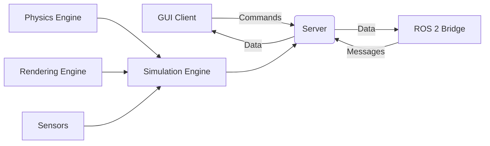

# Gazebo Fundamentals

Gazebo is a powerful robot simulation environment that provides high-fidelity physics simulation, realistic sensor models, and flexible world creation. In this section, you'll learn the core concepts and tools for creating and managing robot simulations.

## Gazebo Architecture

Gazebo operates on a client-server architecture:



### Core Components

- **Server (gz sim)**: Headless simulation engine
- **GUI Client**: Visual interface for interaction
- **Physics Engine**: Simulates rigid body dynamics
- **Rendering Engine**: 3D visualization
- **Sensor Models**: Realistic sensor simulation
- **ROS 2 Bridge**: Connects to ROS 2 ecosystem

## World Files and SDF Format

**SDF (Simulation Description Format)** is Gazebo's native format for describing simulation environments.

### Basic World Structure

`worlds/simple_room.sdf`:
```xml
<?xml version="1.0" ?>
<sdf version="1.7">
  <world name="simple_room">
    <!-- Physics engine configuration -->
    <physics type="ode">
      <max_step_size>0.001</max_step_size>
      <real_time_factor>1.0</real_time_factor>
      <real_time_update_rate>1000</real_time_update_rate>
    </physics>

    <!-- Environment lighting -->
    <light name="sun" type="directional">
      <cast_shadows>true</cast_shadows>
      <pose>0 0 10 0 0 0</pose>
      <diffuse>0.8 0.8 0.8 1</diffuse>
      <specular>0.2 0.2 0.2 1</specular>
      <attenuation>
        <range>1000</range>
        <constant>0.9</constant>
        <linear>0.01</linear>
        <quadratic>0.001</quadratic>
      </attenuation>
      <direction>-0.4 0.2 -0.9</direction>
    </light>

    <!-- Ground plane -->
    <model name="ground_plane">
      <static>true</static>
      <link name="link">
        <collision name="collision">
          <geometry>
            <plane>
              <normal>0 0 1</normal>
              <size>100 100</size>
            </plane>
          </geometry>
        </collision>
        <visual name="visual">
          <geometry>
            <plane>
              <normal>0 0 1</normal>
              <size>100 100</size>
            </plane>
          </geometry>
          <material>
            <ambient>0.7 0.7 0.7 1</ambient>
            <diffuse>0.7 0.7 0.7 1</diffuse>
            <specular>0.7 0.7 0.7 1</specular>
          </material>
        </visual>
      </link>
    </model>

    <!-- Sample object -->
    <model name="box">
      <pose>2 2 1 0 0 0</pose>
      <link name="link">
        <collision name="collision">
          <geometry>
            <box>
              <size>1 1 2</size>
            </box>
          </geometry>
        </collision>
        <visual name="visual">
          <geometry>
            <box>
              <size>1 1 2</size>
            </box>
          </geometry>
          <material>
            <ambient>1 0 0 1</ambient>
            <diffuse>1 0 0 1</diffuse>
            <specular>1 0 0 1</specular>
          </material>
        </visual>
        <inertial>
          <mass>1.0</mass>
          <inertia>
            <ixx>0.166667</ixx>
            <ixy>0</ixy>
            <ixz>0</ixz>
            <iyy>0.166667</iyy>
            <iyz>0</iyz>
            <izz>0.166667</izz>
          </inertia>
        </inertial>
      </link>
    </model>
  </world>
</sdf>
```

## Creating Worlds

### Using Gazebo GUI

```bash
# Launch Gazebo with GUI
gz sim -g

# Launch with a specific world
gz sim -g -r worlds/simple_room.sdf
```

### Command Line Options

```bash
# Headless simulation
gz sim -s worlds/simple_room.sdf

# With GUI
gz sim -g worlds/simple_room.sdf

# Run paused
gz sim -p worlds/simple_room.sdf

# Set real-time update rate
gz sim --iterations-per-second 1000 worlds/simple_room.sdf
```

## Physics Configuration

### Physics Engines

Gazebo supports multiple physics engines:

```xml
<!-- ODE (Open Dynamics Engine) - Default -->
<physics type="ode">
  <max_step_size>0.001</max_step_size>
  <real_time_factor>1.0</real_time_factor>
</physics>

<!-- Bullet Physics -->
<physics type="bullet">
  <max_step_size>0.001</max_step_size>
  <real_time_factor>1.0</real_time_factor>
</physics>

<!-- DART Physics -->
<physics type="dart">
  <max_step_size>0.001</max_step_size>
  <real_time_factor>1.0</real_time_factor>
</physics>
```

### Physics Parameters

Key physics parameters to tune:

- **`max_step_size`**: Simulation time step (smaller = more accurate but slower)
- **`real_time_factor`**: Target simulation speed (1.0 = real-time)
- **`real_time_update_rate`**: Updates per second (higher = more responsive)

## Model Creation

### Basic Model Structure

```xml
<model name="my_robot">
  <!-- Model pose -->
  <pose>0 0 0.5 0 0 0</pose>

  <!-- Static models don't move -->
  <static>false</static>

  <!-- Self-collide for multi-body models -->
  <self_collide>false</self_collide>

  <!-- Kinematic models follow external commands -->
  <kinematic>false</kinematic>

  <link name="base_link">
    <!-- Collision geometry -->
    <collision name="collision">
      <geometry>
        <cylinder>
          <radius>0.2</radius>
          <length>0.4</length>
        </cylinder>
      </geometry>
    </collision>

    <!-- Visual geometry -->
    <visual name="visual">
      <geometry>
        <cylinder>
          <radius>0.2</radius>
          <length>0.4</length>
      </geometry>
    </visual>

    <!-- Mass and inertia -->
    <inertial>
      <mass>5.0</mass>
      <inertia>
        <ixx>0.1</ixx>
        <iyy>0.1</iyy>
        <izz>0.2</izz>
      </inertia>
    </inertial>
  </link>
</model>
```

## Sensor Integration

### Camera Sensor

```xml
<sensor name="camera" type="camera">
  <pose>0.2 0 0.1 0 0 0</pose>
  <camera name="head">
    <horizontal_fov>1.047</horizontal_fov>  <!-- 60 degrees -->
    <image>
      <width>640</width>
      <height>480</height>
      <format>R8G8B8</format>
    </image>
    <clip>
      <near>0.1</near>
      <far>10.0</far>
    </clip>
  </camera>
  <always_on>1</always_on>
  <update_rate>30</update_rate>
  <visualize>true</visualize>
</sensor>
```

### Laser Sensor

```xml
<sensor name="laser" type="ray">
  <pose>0.1 0 0.2 0 0 0</pose>
  <ray>
    <scan>
      <horizontal>
        <samples>360</samples>
        <resolution>1</resolution>
        <min_angle>-3.14159</min_angle>  <!-- -π -->
        <max_angle>3.14159</max_angle>   <!-- π -->
      </horizontal>
    </scan>
    <range>
      <min>0.1</min>
      <max>10.0</max>
      <resolution>0.01</resolution>
    </range>
  </ray>
  <always_on>1</always_on>
  <update_rate>10</update_rate>
  <visualize>true</visualize>
</sensor>
```

### IMU Sensor

```xml
<sensor name="imu" type="imu">
  <pose>0 0 0.1 0 0 0</pose>
  <always_on>1</always_on>
  <update_rate>100</update_rate>
  <imu>
    <angular_velocity>
      <x>
        <noise type="gaussian">
          <mean>0.0</mean>
          <stddev>0.001</stddev>
        </noise>
      </x>
      <y>
        <noise type="gaussian">
          <mean>0.0</mean>
          <stddev>0.001</stddev>
        </noise>
      </y>
      <z>
        <noise type="gaussian">
          <mean>0.0</mean>
          <stddev>0.001</stddev>
        </noise>
      </z>
    </angular_velocity>
    <linear_acceleration>
      <x>
        <noise type="gaussian">
          <mean>0.0</mean>
          <stddev>0.017</stddev>
        </noise>
      </x>
      <y>
        <noise type="gaussian">
          <mean>0.0</mean>
          <stddev>0.017</stddev>
        </noise>
      </y>
      <z>
        <noise type="gaussian">
          <mean>0.0</mean>
          <stddev>0.017</stddev>
        </noise>
      </z>
    </linear_acceleration>
  </imu>
</sensor>
```

## ROS 2 Integration

### Launching with ROS 2

```xml
<!-- launch/gazebo_simulation.launch.py -->
from launch import LaunchDescription
from launch.actions import DeclareLaunchArgument
from launch.substitutions import LaunchConfiguration
from launch_ros.actions import Node
from launch.actions import IncludeLaunchDescription
from launch.launch_description_sources import PythonLaunchDescriptionSource
from ament_index_python.packages import get_launch_package_share_directory

def generate_launch_description():
    # World file argument
    world = LaunchConfiguration('world')

    # Declare launch arguments
    declare_world_cmd = DeclareLaunchArgument(
        'world',
        default_value='empty.sdf',
        description='Choose one of the world files from Gazebo Worlds'
    )

    # Include Gazebo launch
    gazebo = IncludeLaunchDescription(
        PythonLaunchDescriptionSource(
            get_launch_package_share_directory('gazebo_ros') + '/launch/gazebo.launch.py'
        ),
        launch_arguments={
            'world': world
        }.items()
    )

    return LaunchDescription([
        declare_world_cmd,
        gazebo
    ])
```

### Spawning Robots

```python
#!/usr/bin/env python3
"""
Spawn robot in Gazebo
"""
import rclpy
from rclpy.node import Node
from gazebo_msgs.srv import SpawnEntity

class RobotSpawner(Node):
    def __init__(self):
        super().__init__('robot_spawner')

        # Create client for spawn service
        self.spawn_client = self.create_client(SpawnEntity, '/spawn_entity')

        while not self.spawn_client.wait_for_service(timeout_sec=1.0):
            self.get_logger().info('Spawn service not available, waiting again...')

    def spawn_robot(self, robot_name, robot_xml, initial_pose):
        """Spawn robot in Gazebo"""
        request = SpawnEntity.Request()
        request.name = robot_name
        request.xml = robot_xml
        request.initial_pose = initial_pose

        future = self.spawn_client.call_async(request)
        rclpy.spin_until_future_complete(self, future)

        if future.result() is not None:
            response = future.result()
            if response.success:
                self.get_logger().info(f'Successfully spawned {robot_name}')
            else:
                self.get_logger().error(f'Failed to spawn {robot_name}: {response.status_message}')
        else:
            self.get_logger().error('Spawn service call failed')

def main(args=None):
    rclpy.init(args=args)
    spawner = RobotSpawner()

    # Example usage
    robot_xml = """<?xml version="1.0"?>
    <sdf version="1.6">
      <model name="my_robot">
        <link name="chassis">
          <pose>0 0 0.1 0 0 0</pose>
          <collision name="collision">
            <geometry><box><size>0.5 0.3 0.2</size></box></geometry>
          </collision>
          <visual name="visual">
            <geometry><box><size>0.5 0.3 0.2</size></box></geometry>
          </visual>
          <inertial>
            <mass>1.0</mass>
            <inertia><ixx>0.1</ixx><iyy>0.1</iyy><izz>0.1</izz></inertia>
          </inertial>
        </link>
      </model>
    </sdf>"""

    from geometry_msgs.msg import Pose
    initial_pose = Pose()
    initial_pose.position.x = 0.0
    initial_pose.position.y = 0.0
    initial_pose.position.z = 0.1

    spawner.spawn_robot("my_robot", robot_xml, initial_pose)

    spawner.destroy_node()
    rclpy.shutdown()

if __name__ == '__main__':
    main()
```

## Environment Design

### Creating Complex Environments

```xml
<?xml version="1.0" ?>
<sdf version="1.7">
  <world name="maze_world">
    <!-- Physics -->
    <physics name="1ms" type="ode">
      <max_step_size>0.001</max_step_size>
      <real_time_factor>1.0</real_time_factor>
    </physics>

    <!-- Lighting -->
    <light name="sun" type="directional">
      <pose>0 0 10 0 0 0</pose>
      <diffuse>0.8 0.8 0.8 1</diffuse>
      <specular>0.2 0.2 0.2 1</specular>
      <direction>-0.4 0.2 -0.9</direction>
    </light>

    <!-- Ground -->
    <model name="ground_plane">
      <static>true</static>
      <link name="link">
        <collision name="collision">
          <geometry><plane><normal>0 0 1</normal></plane></geometry>
        </collision>
        <visual name="visual">
          <geometry><plane><normal>0 0 1</normal></plane></geometry>
          <material><ambient>0.8 0.8 0.8 1</ambient></material>
        </visual>
      </link>
    </model>

    <!-- Maze walls -->
    <model name="wall_1">
      <pose>0 5 1 0 0 0</pose>
      <link name="link">
        <collision name="collision">
          <geometry><box><size>10 0.2 2</size></box></geometry>
        </collision>
        <visual name="visual">
          <geometry><box><size>10 0.2 2</size></box></geometry>
          <material><ambient>0.5 0.5 0.5 1</ambient></material>
        </visual>
        <static>true</static>
      </link>
    </model>

    <!-- Add more walls to create maze -->
    <!-- ... -->

    <!-- Objects for navigation -->
    <model name="goal">
      <pose>8 8 0.5 0 0 0</pose>
      <link name="link">
        <collision name="collision">
          <geometry><cylinder><radius>0.5</radius><length>1</length></cylinder></geometry>
        </collision>
        <visual name="visual">
          <geometry><cylinder><radius>0.5</radius><length>1</length></cylinder></geometry>
          <material><ambient>0 1 0 1</ambient></material>
        </visual>
        <static>true</static>
      </link>
    </model>
  </world>
</sdf>
```

## Best Practices

### 1. Performance Optimization

```xml
<!-- Optimize physics for performance -->
<physics type="ode">
  <max_step_size>0.01</max_step_size>  <!-- Larger steps = faster but less accurate -->
  <real_time_factor>1.0</real_time_factor>
  <real_time_update_rate>100</real_time_update_rate>  <!-- Lower rate = faster -->
</physics>

<!-- Simplify collision geometry -->
<collision name="collision">
  <geometry>
    <!-- Use simpler shapes when possible -->
    <box><size>1 1 1</size></box>
  </geometry>
</collision>
```

### 2. Realistic Sensor Modeling

```xml
<!-- Include realistic noise models -->
<sensor name="camera" type="camera">
  <camera name="head">
    <noise>
      <type>gaussian</type>
      <mean>0.0</mean>
      <stddev>0.007</stddev>
    </noise>
  </camera>
</sensor>
```

### 3. Proper Mass Properties

```xml
<!-- Use realistic mass and inertia -->
<inertial>
  <mass>10.0</mass>
  <inertia>
    <ixx>0.4</ixx>
    <iyy>0.4</iyy>
    <izz>0.8</izz>
  </inertia>
</inertial>
```

## Troubleshooting Common Issues

### Physics Issues

```bash
# Check physics engine status
gz service -s /gazebo/worlds --reqtype gz.msgs.WorldReset --reptype gz.msgs.Boolean

# Increase physics update rate for stability
gz service -s /gazebo/worlds --reqtype gz.msgs.Physics --reptype gz.msgs.Boolean
```

### Rendering Issues

```bash
# Check graphics drivers
glxinfo | grep "OpenGL renderer"

# Run with software rendering if needed
export LIBGL_ALWAYS_SOFTWARE=1
gz sim -g
```

### ROS 2 Bridge Issues

```bash
# Check ROS 2 bridge status
ros2 node list | grep gazebo

# Check topic connections
ros2 topic list | grep /gazebo
```

## Advanced Features

### Plugins

Gazebo supports custom plugins for extending functionality:

```xml
<model name="my_robot">
  <!-- Custom controller plugin -->
  <plugin name="diff_drive" filename="libgazebo_ros_diff_drive.so">
    <left_joint>left_wheel_joint</left_joint>
    <right_joint>right_wheel_joint</right_joint>
    <wheel_separation>0.4</wheel_separation>
    <wheel_diameter>0.2</wheel_diameter>
    <command_topic>cmd_vel</command_topic>
    <odometry_topic>odom</odometry_topic>
    <publish_odom_tf>true</publish_odom_tf>
  </plugin>
</model>
```

### State Publishers

```xml
<plugin name="joint_state_publisher" filename="libgazebo_ros_joint_state_publisher.so">
  <joint_name>joint1</joint_name>
  <joint_name>joint2</joint_name>
  <update_rate>30</update_rate>
  <topic>joint_states</topic>
</plugin>
```

## Next Steps

Now that you understand Gazebo fundamentals, continue to [Sensors and Perception](../week-04/sensors) to learn about realistic sensor simulation for robotic perception.

## Exercises

1. Create a simple world with multiple objects
2. Add a camera sensor to your world
3. Configure physics parameters for optimal performance
4. Launch your world through ROS 2