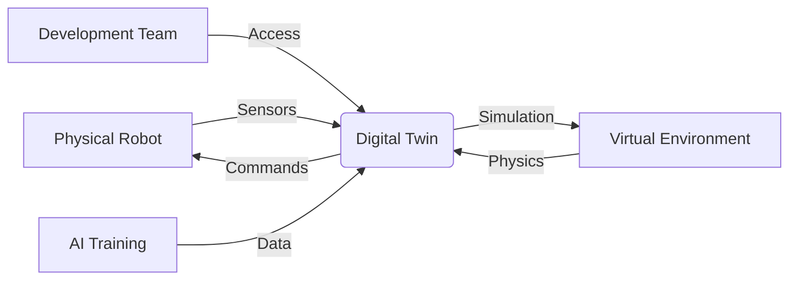

# Introduction to Digital Twins and Simulation

Welcome to Module 2 of the Physical AI curriculum. In this module, you'll learn about **digital twins** and **robot simulation** using Gazebo, the premier simulation environment for robotics. Digital twins are virtual replicas of physical systems that enable safe, cost-effective development and testing of robotic applications.

## What is a Digital Twin?

A **digital twin** is a virtual representation of a physical system that mirrors its real-world counterpart in real-time. In robotics, digital twins enable:

- **Safe Development**: Test algorithms without risking physical hardware
- **Cost-Effective Prototyping**: Validate designs before manufacturing
- **Parallel Development**: Work on software while hardware is being developed
- **Training and Testing**: Generate diverse scenarios for AI training



## Why Simulation in Robotics?

Simulation addresses key challenges in robotics development:

| Challenge | Simulation Solution |
|-----------|-------------------|
| **Hardware Cost** | Test on virtual robots instead of expensive hardware |
| **Safety** | Experiment without risk of damaging equipment |
| **Repeatability** | Run identical experiments multiple times |
| **Scalability** | Test multiple robots simultaneously |
| **Environment Variety** | Access diverse scenarios and edge cases |
| **Development Speed** | Iterate quickly without hardware constraints |

## Gazebo: The Standard for Robot Simulation

**Gazebo** is the most widely-used robot simulation environment, providing:

- **High-Fidelity Physics**: Accurate simulation of rigid body dynamics
- **Sensor Simulation**: Realistic models for cameras, lidars, IMUs, etc.
- **Visual Environment**: 3D rendering with lighting and textures
- **ROS Integration**: Seamless connection with ROS 2
- **Plugin Architecture**: Extensible with custom sensors and controllers

### Gazebo Versions

We use **Gazebo Garden** (or Fortress/Harmonic) in this curriculum:

- **Gazebo Garden**: Latest stable release with modern features
- **Gazebo Fortress**: Long-term support version
- **Ignition Gazebo**: Underlying framework (Gazebo is built on Ignition)

## Simulation Workflow

The typical simulation workflow involves:

1. **Model Creation**: Build accurate 3D models of robots and environments
2. **Physics Configuration**: Define mass, friction, and other physical properties
3. **Sensor Integration**: Add virtual sensors that match real hardware
4. **Environment Design**: Create realistic test environments
5. **Control Integration**: Connect with ROS 2 for control and perception
6. **Testing and Validation**: Run experiments and collect data

## Core Concepts Preview

This module covers these fundamental concepts:

### Week 4: Gazebo Fundamentals
- **World Building**: Creating and customizing simulation environments
- **Physics Simulation**: Understanding rigid body dynamics and constraints
- **Sensor Models**: Simulating realistic sensors for perception
- **Basic Robot Control**: Moving robots in simulation

### Week 5: Robot Modeling
- **URDF/Xacro**: Defining robot kinematics and dynamics
- **SDF Format**: Gazebo's native robot description format
- **Material Properties**: Configuring visual and physical properties
- **Joint Control**: Implementing realistic joint behaviors

### Week 6: Isaac Sim
- **Advanced Simulation**: NVIDIA's high-fidelity simulation platform
- **Photorealistic Rendering**: Computer graphics for synthetic data
- **Domain Randomization**: Improving real-world transfer
- **GPU Acceleration**: Leveraging hardware for faster simulation

## Setting Up Your Simulation Environment

Before proceeding, ensure your development environment includes:

```bash
# Verify Gazebo installation
gz --version
# Should show Gazebo Garden or similar

# Check ROS 2 Gazebo packages
ros2 pkg list | grep gazebo

# Verify physics engine
ign physics --version
```

Expected output:
```
Gazebo Garden
```

## Your First Simulation

Let's verify everything works with a simple demonstration:

```bash
# Launch Gazebo with a default world
gz sim -r shapes.sdf

# Or launch through ROS 2
ros2 launch gazebo_ros empty_world.launch.py
```

You should see the Gazebo interface with a basic environment.

## Module Learning Objectives

By the end of this module, you will be able to:

1. **Design** realistic simulation environments for robotics applications
2. **Create** accurate robot models with proper physics and sensor configurations
3. **Integrate** simulation with ROS 2 for seamless development workflows
4. **Validate** robotic algorithms in simulation before real-world deployment
5. **Generate** synthetic training data for AI models
6. **Optimize** simulation parameters for performance and accuracy
7. **Transition** between simulation and real hardware effectively

## Prerequisites

- Module 1 completion (ROS 2 fundamentals)
- Basic 3D modeling concepts
- Understanding of physics principles
- Completed Lab Setup for simulation

## Simulation Best Practices

### 1. Fidelity vs. Performance Trade-offs
- **High fidelity**: More accurate but slower simulation
- **Real-time factor**: Aim for 1.0x real-time performance
- **Approximation**: Use simplified models when appropriate

### 2. Model Accuracy
- **Mass properties**: Match real robot specifications
- **Inertial tensors**: Use CAD software for accurate calculations
- **Friction coefficients**: Calibrate based on real-world measurements

### 3. Sensor Modeling
- **Noise models**: Include realistic sensor noise and artifacts
- **Update rates**: Match real sensor specifications
- **Field of view**: Accurately model sensor limitations

## Next Steps

Continue to [Gazebo Fundamentals](./gazebo) to learn about the core concepts of robot simulation with Gazebo.

## Resources

- [Gazebo Documentation](https://gazebosim.org/docs)
- [ROS 2 Gazebo Integration](https://github.com/ros-simulation/gazebo_ros_pkgs)
- [Gazebo Tutorials](https://gazebosim.org/tutorials)
- [Simulation Best Practices](https://navigation.ros.org/best_practices/simulation.html)