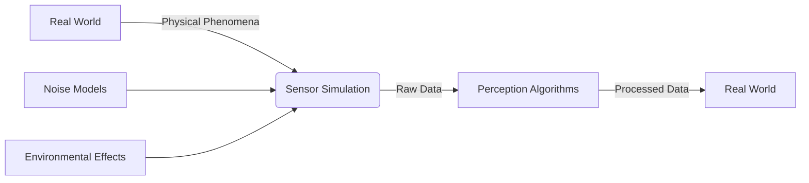

# Sensors and Perception in Simulation

In this section, you'll learn about simulating realistic sensors for robotic perception. Accurate sensor simulation is crucial for developing and testing perception algorithms that will work in the real world.

## Sensor Simulation Overview

Simulated sensors must accurately model:
- **Physical properties**: Range, resolution, field of view
- **Noise characteristics**: Realistic sensor noise and artifacts
- **Environmental effects**: Lighting, weather, occlusions
- **Update rates**: Timing that matches real sensors



## Camera Simulation

### RGB Camera

```xml
<sensor name="camera" type="camera">
  <pose>0.2 0 0.1 0 0 0</pose>
  <camera name="head">
    <horizontal_fov>1.047</horizontal_fov>  <!-- 60 degrees -->
    <image>
      <width>640</width>
      <height>480</height>
      <format>R8G8B8</format>
    </image>
    <clip>
      <near>0.1</near>
      <far>10.0</far>
    </clip>
    <noise>
      <type>gaussian</type>
      <mean>0.0</mean>
      <stddev>0.007</stddev>
    </noise>
  </camera>
  <always_on>1</always_on>
  <update_rate>30</update_rate>
  <visualize>true</visualize>
</sensor>
```

### Depth Camera

```xml
<sensor name="depth_camera" type="depth_camera">
  <pose>0.2 0 0.1 0 0 0</pose>
  <camera name="depth_head">
    <horizontal_fov>1.047</horizontal_fov>
    <image>
      <width>320</width>
      <height>240</height>
      <format>R8G8B8</format>
    </image>
    <depth_camera>
      <output>depths</output>
    </depth_camera>
    <clip>
      <near>0.1</near>
      <far>5.0</far>
    </clip>
  </camera>
  <always_on>1</always_on>
  <update_rate>30</update_rate>
  <visualize>true</visualize>
</sensor>
```

### Stereo Camera

```xml
<sensor name="stereo_camera" type="multicamera">
  <pose>0.2 0 0.1 0 0 0</pose>
  <camera name="left">
    <horizontal_fov>1.047</horizontal_fov>
    <image>
      <width>640</width>
      <height>480</height>
      <format>R8G8B8</format>
    </image>
    <clip>
      <near>0.1</near>
      <far>10.0</far>
    </clip>
  </camera>
  <camera name="right">
    <pose>0 -0.1 0 0 0 0</pose>  <!-- 10cm baseline -->
    <horizontal_fov>1.047</horizontal_fov>
    <image>
      <width>640</width>
      <height>480</height>
      <format>R8G8B8</format>
    </image>
    <clip>
      <near>0.1</near>
      <far>10.0</far>
    </clip>
  </camera>
  <always_on>1</always_on>
  <update_rate>30</update_rate>
  <visualize>true</visualize>
</sensor>
```

## LiDAR Simulation

### 2D LiDAR (Hokuyo-like)

```xml
<sensor name="laser_2d" type="ray">
  <pose>0.1 0 0.3 0 0 0</pose>
  <ray>
    <scan>
      <horizontal>
        <samples>720</samples>
        <resolution>1</resolution>
        <min_angle>-3.14159</min_angle>  <!-- -π -->
        <max_angle>3.14159</max_angle>   <!-- π -->
      </horizontal>
    </scan>
    <range>
      <min>0.1</min>
      <max>30.0</max>
      <resolution>0.01</resolution>
    </range>
  </ray>
  <always_on>1</always_on>
  <update_rate>10</update_rate>
  <visualize>true</visualize>
</sensor>
```

### 3D LiDAR (Velodyne-like)

```xml
<sensor name="velodyne" type="ray">
  <pose>0.0 0 0.5 0 0 0</pose>
  <ray>
    <scan>
      <horizontal>
        <samples>1800</samples>
        <resolution>1</resolution>
        <min_angle>-3.14159</min_angle>
        <max_angle>3.14159</max_angle>
      </horizontal>
      <vertical>
        <samples>32</samples>
        <resolution>1</resolution>
        <min_angle>-0.2618</min_angle>  <!-- -15 degrees -->
        <max_angle>0.2618</max_angle>   <!-- 15 degrees -->
      </vertical>
    </scan>
    <range>
      <min>0.1</min>
      <max>100.0</max>
      <resolution>0.001</resolution>
    </range>
  </ray>
  <always_on>1</always_on>
  <update_rate>10</update_rate>
  <visualize>true</visualize>
</sensor>
```

## IMU Simulation

```xml
<sensor name="imu" type="imu">
  <pose>0 0 0.1 0 0 0</pose>
  <always_on>1</always_on>
  <update_rate>100</update_rate>
  <imu>
    <angular_velocity>
      <x>
        <noise type="gaussian">
          <mean>0.0</mean>
          <stddev>0.001</stddev>
          <bias_mean>0.0</bias_mean>
          <bias_stddev>0.0001</bias_stddev>
        </noise>
      </x>
      <y>
        <noise type="gaussian">
          <mean>0.0</mean>
          <stddev>0.001</stddev>
          <bias_mean>0.0</bias_mean>
          <bias_stddev>0.0001</bias_stddev>
        </noise>
      </y>
      <z>
        <noise type="gaussian">
          <mean>0.0</mean>
          <stddev>0.001</stddev>
          <bias_mean>0.0</bias_mean>
          <bias_stddev>0.0001</bias_stddev>
        </noise>
      </z>
    </angular_velocity>
    <linear_acceleration>
      <x>
        <noise type="gaussian">
          <mean>0.0</mean>
          <stddev>0.017</stddev>
          <bias_mean>0.0</bias_mean>
          <bias_stddev>0.001</bias_stddev>
        </noise>
      </x>
      <y>
        <noise type="gaussian">
          <mean>0.0</mean>
          <stddev>0.017</stddev>
          <bias_mean>0.0</bias_mean>
          <bias_stddev>0.001</bias_stddev>
        </noise>
      </y>
      <z>
        <noise type="gaussian">
          <mean>0.0</mean>
          <stddev>0.017</stddev>
          <bias_mean>0.0</bias_mean>
          <bias_stddev>0.001</bias_stddev>
        </noise>
      </z>
    </linear_acceleration>
  </imu>
</sensor>
```

## GPS Simulation

```xml
<sensor name="gps" type="gps">
  <pose>0 0 0.5 0 0 0</pose>
  <always_on>1</always_on>
  <update_rate>1</update_rate>
  <gps>
    <position_sensing>
      <horizontal>
        <noise type="gaussian">
          <mean>0.0</mean>
          <stddev>2.0</stddev>
        </noise>
      </horizontal>
      <vertical>
        <noise type="gaussian">
          <mean>0.0</mean>
          <stddev>3.0</stddev>
        </noise>
      </vertical>
    </position_sensing>
    <velocity_sensing>
      <horizontal>
        <noise type="gaussian">
          <mean>0.0</mean>
          <stddev>0.1</stddev>
        </noise>
      </horizontal>
      <vertical>
        <noise type="gaussian">
          <mean>0.0</mean>
          <stddev>0.1</stddev>
        </noise>
      </vertical>
    </velocity_sensing>
  </gps>
</sensor>
```

## Sensor Integration with ROS 2

### Camera Integration

```python
#!/usr/bin/env python3
"""
Camera sensor integration example
"""
import rclpy
from rclpy.node import Node
from sensor_msgs.msg import Image, CameraInfo
from cv_bridge import CvBridge
import cv2
import numpy as np

class CameraSensorNode(Node):
    def __init__(self):
        super().__init__('camera_sensor_node')

        # Create publisher for camera images
        self.image_pub = self.create_publisher(Image, '/camera/image_raw', 10)
        self.info_pub = self.create_publisher(CameraInfo, '/camera/camera_info', 10)

        # Create timer for publishing simulated images
        self.timer = self.create_timer(0.1, self.publish_camera_data)  # 10 Hz

        # CV bridge for image conversion
        self.bridge = CvBridge()

        # Camera parameters (should match SDF configuration)
        self.camera_info = self.create_camera_info()

    def create_camera_info(self):
        """Create camera info message"""
        info = CameraInfo()
        info.header.frame_id = 'camera_optical_frame'
        info.width = 640
        info.height = 480
        info.distortion_model = 'plumb_bob'

        # Intrinsic parameters (should match SDF)
        info.k = [525.0, 0.0, 320.0,   # fx, 0, cx
                  0.0, 525.0, 240.0,   # 0, fy, cy
                  0.0, 0.0, 1.0]       # 0, 0, 1
        info.r = [1.0, 0.0, 0.0,       # Rotation (identity)
                  0.0, 1.0, 0.0,
                  0.0, 0.0, 1.0]
        info.p = [525.0, 0.0, 320.0, 0.0,  # Projection matrix
                  0.0, 525.0, 240.0, 0.0,
                  0.0, 0.0, 1.0, 0.0]

        return info

    def publish_camera_data(self):
        """Publish simulated camera data"""
        # Create simulated image (you could load from files or generate procedurally)
        image = np.random.randint(0, 255, (480, 640, 3), dtype=np.uint8)

        # Add some simulated features
        cv2.rectangle(image, (200, 150), (440, 330), (255, 0, 0), 2)
        cv2.circle(image, (320, 240), 50, (0, 255, 0), 2)

        # Convert to ROS message
        image_msg = self.bridge.cv2_to_imgmsg(image, encoding='bgr8')
        image_msg.header.stamp = self.get_clock().now().to_msg()
        image_msg.header.frame_id = 'camera_optical_frame'

        # Publish data
        self.image_pub.publish(image_msg)
        self.info_pub.publish(self.camera_info)

def main(args=None):
    rclpy.init(args=args)
    node = CameraSensorNode()

    try:
        rclpy.spin(node)
    except KeyboardInterrupt:
        pass
    finally:
        node.destroy_node()
        rclpy.shutdown()

if __name__ == '__main__':
    main()
```

### LiDAR Integration

```python
#!/usr/bin/env python3
"""
LiDAR sensor integration example
"""
import rclpy
from rclpy.node import Node
from sensor_msgs.msg import LaserScan
import math

class LidarSensorNode(Node):
    def __init__(self):
        super().__init__('lidar_sensor_node')

        # Create publisher for laser scan
        self.scan_pub = self.create_publisher(LaserScan, '/scan', 10)

        # Create timer for publishing simulated scans
        self.timer = self.create_timer(0.1, self.publish_laser_scan)  # 10 Hz

    def publish_laser_scan(self):
        """Publish simulated laser scan"""
        scan = LaserScan()
        scan.header.stamp = self.get_clock().now().to_msg()
        scan.header.frame_id = 'laser_frame'

        # Set scan parameters (should match SDF)
        scan.angle_min = -math.pi
        scan.angle_max = math.pi
        scan.angle_increment = 2 * math.pi / 720  # 720 samples
        scan.time_increment = 0.0
        scan.scan_time = 0.1
        scan.range_min = 0.1
        scan.range_max = 30.0

        # Generate simulated ranges (with some obstacles)
        ranges = []
        for i in range(720):
            angle = scan.angle_min + i * scan.angle_increment
            # Simulate a circular obstacle at (2, 2) with radius 1
            distance_to_obstacle = math.sqrt((2 - math.cos(angle))**2 + (2 - math.sin(angle))**2)
            range_val = min(5.0, distance_to_obstacle)  # 5m max range

            # Add some noise
            noise = 0.02 * (0.5 - np.random.random())
            ranges.append(range_val + noise)

        scan.ranges = ranges
        scan.intensities = [1.0] * len(ranges)

        self.scan_pub.publish(scan)

def main(args=None):
    rclpy.init(args=args)
    node = LidarSensorNode()

    try:
        rclpy.spin(node)
    except KeyboardInterrupt:
        pass
    finally:
        node.destroy_node()
        rclpy.shutdown()

if __name__ == '__main__':
    import numpy as np
    main()
```

## Perception Algorithms in Simulation

### Object Detection Simulation

```python
#!/usr/bin/env python3
"""
Object detection simulation
"""
import rclpy
from rclpy.node import Node
from sensor_msgs.msg import Image
from vision_msgs.msg import Detection2DArray, Detection2D, ObjectHypothesisWithPose
from cv_bridge import CvBridge
import cv2
import numpy as np

class ObjectDetectionNode(Node):
    def __init__(self):
        super().__init__('object_detection_node')

        # Create subscriber for camera images
        self.image_sub = self.create_subscription(
            Image, '/camera/image_raw', self.image_callback, 10)

        # Create publisher for detections
        self.detection_pub = self.create_publisher(
            Detection2DArray, '/detections', 10)

        self.bridge = CvBridge()

    def image_callback(self, msg):
        """Process incoming camera image"""
        try:
            # Convert ROS image to OpenCV
            cv_image = self.bridge.imgmsg_to_cv2(msg, 'bgr8')

            # Simulate object detection (in real implementation, use actual detector)
            detections = self.simulate_detection(cv_image)

            # Publish detections
            self.detection_pub.publish(detections)

        except Exception as e:
            self.get_logger().error(f'Error processing image: {e}')

    def simulate_detection(self, image):
        """Simulate object detection results"""
        detections = Detection2DArray()
        detections.header = image.header

        # Simulate detection of a blue rectangle in the image
        detection = Detection2D()
        detection.header = image.header

        # Bounding box (simulated detection)
        bbox = detection.bbox
        bbox.center.x = 320  # Center x
        bbox.center.y = 240  # Center y
        bbox.size_x = 240    # Width
        bbox.size_y = 180    # Height

        # Classification hypothesis
        hypothesis = ObjectHypothesisWithPose()
        hypothesis.hypothesis.class_id = 'blue_rectangle'
        hypothesis.hypothesis.score = 0.95

        detection.results.append(hypothesis)
        detections.detections.append(detection)

        return detections

def main(args=None):
    rclpy.init(args=args)
    node = ObjectDetectionNode()

    try:
        rclpy.spin(node)
    except KeyboardInterrupt:
        pass
    finally:
        node.destroy_node()
        rclpy.shutdown()

if __name__ == '__main__':
    main()
```

## Sensor Fusion

### Multi-Sensor Integration

```xml
<model name="sensor_fusion_robot">
  <!-- Robot chassis -->
  <link name="base_link">
    <pose>0 0 0.1 0 0 0</pose>
    <!-- ... chassis definition ... -->
  </link>

  <!-- IMU sensor -->
  <sensor name="imu" type="imu">
    <pose>0 0 0.2 0 0 0</pose>
    <!-- ... IMU definition ... -->
  </sensor>

  <!-- Camera sensor -->
  <sensor name="camera" type="camera">
    <pose>0.1 0 0.3 0 0 0</pose>
    <!-- ... camera definition ... -->
  </sensor>

  <!-- LiDAR sensor -->
  <sensor name="lidar" type="ray">
    <pose>0 0 0.4 0 0 0</pose>
    <!-- ... LiDAR definition ... -->
  </sensor>

  <!-- GPS sensor -->
  <sensor name="gps" type="gps">
    <pose>0 0 0.5 0 0 0</pose>
    <!-- ... GPS definition ... -->
  </sensor>
</model>
```

## Sensor Calibration

### Simulated Calibration

```python
#!/usr/bin/env python3
"""
Sensor calibration simulation
"""
import rclpy
from rclpy.node import Node
from sensor_msgs.msg import CameraInfo
from std_msgs.msg import Float64

class SensorCalibrationNode(Node):
    def __init__(self):
        super().__init__('sensor_calibration_node')

        # Publisher for calibrated camera info
        self.calibrated_info_pub = self.create_publisher(
            CameraInfo, '/camera/calibrated_info', 10)

        # Subscriber for calibration parameters
        self.calibration_sub = self.create_subscription(
            Float64, '/calibration_params', self.calibration_callback, 10)

        # Timer for periodic calibration updates
        self.timer = self.create_timer(1.0, self.publish_calibrated_info)

        # Initial calibration parameters
        self.fx = 525.0
        self.fy = 525.0
        self.cx = 320.0
        self.cy = 240.0

    def calibration_callback(self, msg):
        """Update calibration parameters"""
        # In real system, this would receive actual calibration data
        # For simulation, we'll just log the message
        self.get_logger().info(f'Received calibration parameter: {msg.data}')

    def publish_calibrated_info(self):
        """Publish calibrated camera info"""
        info = CameraInfo()
        info.header.stamp = self.get_clock().now().to_msg()
        info.header.frame_id = 'camera_optical_frame'
        info.width = 640
        info.height = 480
        info.distortion_model = 'plumb_bob'

        # Use calibrated parameters
        info.k = [self.fx, 0.0, self.cx,
                  0.0, self.fy, self.cy,
                  0.0, 0.0, 1.0]

        self.calibrated_info_pub.publish(info)

def main(args=None):
    rclpy.init(args=args)
    node = SensorCalibrationNode()

    try:
        rclpy.spin(node)
    except KeyboardInterrupt:
        pass
    finally:
        node.destroy_node()
        rclpy.shutdown()

if __name__ == '__main__':
    main()
```

## Environmental Effects

### Lighting Simulation

```xml
<!-- Dynamic lighting effects -->
<light name="dynamic_light" type="spot">
  <pose>5 5 5 0 0 0</pose>
  <diffuse>1 1 1 1</diffuse>
  <specular>0.5 0.5 0.5 1</specular>
  <attenuation>
    <range>10</range>
    <constant>0.5</constant>
    <linear>0.1</linear>
    <quadratic>0.01</quadratic>
  </attenuation>
  <direction>-0.5 -0.5 -1</direction>
  <spot>
    <inner_angle>0.1</inner_angle>
    <outer_angle>0.5</outer_angle>
    <falloff>1</falloff>
  </spot>
</light>
```

### Weather Effects

Gazebo supports plugin-based weather simulation:

```xml
<plugin name="weather_plugin" filename="libWeatherPlugin.so">
  <cloud_coverage>0.3</cloud_coverage>
  <precipitation_type>rain</precipitation_type>
  <precipitation_rate>0.1</precipitation_rate>
  <wind_speed>2.0</wind_speed>
  <wind_direction>45</wind_direction>
</plugin>
```

## Noise Modeling

### Realistic Sensor Noise

```xml
<sensor name="realistic_camera" type="camera">
  <camera name="head">
    <!-- ... basic camera config ... -->
    <noise>
      <type>gaussian</type>
      <mean>0.0</mean>
      <stddev>0.01</stddev>
    </noise>
  </camera>
  <!-- Additional noise for specific effects -->
  <plugin name="noise_plugin" filename="libCameraNoisePlugin.so">
    <noise_type>poisson</noise_type>
    <intensity>0.05</intensity>
  </plugin>
</sensor>
```

## Best Practices

### 1. Match Real Sensor Specifications

```xml
<!-- Ensure simulated sensors match real hardware -->
<sensor name="camera" type="camera">
  <camera name="head">
    <horizontal_fov>1.047</horizontal_fov>  <!-- 60 degrees - matches real camera -->
    <image>
      <width>640</width>      <!-- Match real resolution -->
      <height>480</height>
      <format>R8G8B8</format>
    </image>
    <clip>
      <near>0.1</near>        <!-- Match real camera range -->
      <far>10.0</far>
    </clip>
  </camera>
</sensor>
```

### 2. Include Realistic Noise Models

```xml
<!-- Add realistic noise characteristics -->
<sensor name="lidar" type="ray">
  <!-- ... basic config ... -->
  <ray>
    <!-- ... scan config ... -->
    <range>
      <min>0.1</min>
      <max>30.0</max>
      <resolution>0.01</resolution>
    </range>
  </ray>
  <!-- Add noise models -->
  <plugin name="noise_model" filename="libLidarNoise.so">
    <noise_mean>0.01</noise_mean>
    <noise_stddev>0.02</noise_stddev>
  </plugin>
</sensor>
```

### 3. Proper Sensor Placement

```xml
<!-- Place sensors at same positions as real robot -->
<sensor name="camera" type="camera">
  <pose>0.2 0 0.3 0 0 0</pose>  <!-- Same as real camera mount -->
  <!-- ... -->
</sensor>
```

## Troubleshooting

### Sensor Performance Issues

```bash
# Check sensor update rates
ros2 topic hz /camera/image_raw

# Monitor CPU usage
htop

# Reduce sensor resolution if needed
# In SDF: <image><width>320</width><height>240</height></image>
```

### Sensor Data Quality

```bash
# Visualize sensor data
ros2 run rviz2 rviz2

# Check sensor topics
ros2 topic echo /scan

# Monitor sensor status
ros2 topic info /camera/image_raw
```

## Next Steps

Now that you understand sensor simulation and perception, continue to [Exercise: Sensor Fusion Robot](../week-04/exercise-sensors) to build a complete sensor fusion system in simulation.

## Exercises

1. Create a robot model with multiple sensors (camera, LiDAR, IMU)
2. Implement a sensor fusion node that combines data from multiple sensors
3. Add realistic noise models to your sensors
4. Create a perception pipeline that processes simulated sensor data