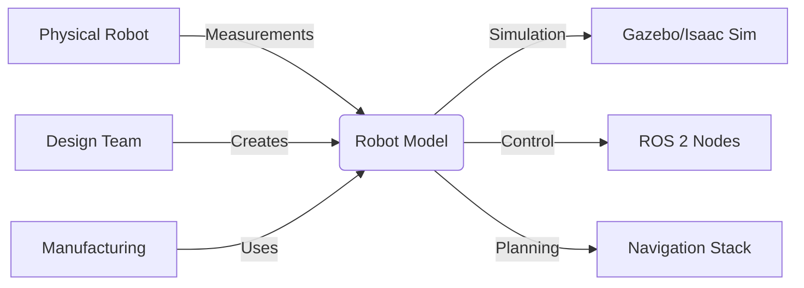

# Introduction to Robot Modeling

Welcome to Week 5 of Module 2: Building the Digital Twin. In this week, you'll learn about **robot modeling** - the process of creating accurate digital representations of physical robots. Robot models are essential for simulation, control, and understanding robot behavior in both virtual and real environments.

## What is Robot Modeling?

**Robot modeling** is the process of creating mathematical and computational representations of robots that capture their physical properties, kinematics, dynamics, and sensor configurations. A good robot model enables:

- **Accurate Simulation**: Realistic behavior in virtual environments
- **Motion Planning**: Computing feasible trajectories
- **Control Design**: Developing effective control algorithms
- **Hardware Validation**: Testing before physical implementation



## Why Robot Modeling Matters

Robot modeling addresses critical challenges in robotics:

| Challenge | Modeling Solution |
|-----------|------------------|
| **Kinematics** | Understand how joints move the robot |
| **Dynamics** | Predict motion under forces and torques |
| **Control** | Design controllers for desired behavior |
| **Simulation** | Test algorithms safely before deployment |
| **Hardware Design** | Validate designs before manufacturing |

## Robot Description Formats

The robotics community uses standardized formats for robot modeling:

### URDF (Unified Robot Description Format)
- **XML-based** format for kinematic and geometric descriptions
- **Widely adopted** in the ROS ecosystem
- **Simple** for basic robot descriptions
- **Limitations** with complex models and macros

### Xacro (XML Macros)
- **Extension** to URDF with macro capabilities
- **Modular** design through includes and macros
- **Parameterized** models with variables
- **Cleaner** code through abstraction

### SDF (Simulation Description Format)
- **Gazebo native** format with physics properties
- **More detailed** than URDF for simulation
- **Simulation-focused** with sensor and plugin support

## Core Concepts Preview

This week covers these fundamental concepts:

### URDF Fundamentals
- **Links and Joints**: Basic building blocks of robot models
- **Geometric Properties**: Shapes, sizes, and visual appearance
- **Kinematic Chains**: How parts connect and move together

### Xacro Advanced Features
- **Macros**: Reusable components and templates
- **Inheritance**: Building complex models from simple parts
- **Parameters**: Configurable robot variants

### Physics Modeling
- **Mass Properties**: Inertial tensors and center of mass
- **Joint Dynamics**: Friction, damping, and limits
- **Collision Detection**: Interaction with environment

### Sensor Integration
- **Mounting**: Proper placement of sensors on robots
- **Calibration**: Aligning virtual and real sensors
- **Validation**: Ensuring model accuracy

## URDF Structure

A basic URDF robot model follows this structure:

```xml
<?xml version="1.0"?>
<robot name="my_robot">
  <!-- Links define rigid bodies -->
  <link name="base_link">
    <visual>
      <geometry>
        <cylinder length="0.2" radius="0.2"/>
      </geometry>
    </visual>
    <collision>
      <geometry>
        <cylinder length="0.2" radius="0.2"/>
      </geometry>
    </collision>
    <inertial>
      <mass value="10.0"/>
      <inertia ixx="1.0" ixy="0.0" ixz="0.0" iyy="1.0" iyz="0.0" izz="1.0"/>
    </inertial>
  </link>

  <!-- Joints define connections between links -->
  <joint name="base_to_wheel" type="continuous">
    <parent link="base_link"/>
    <child link="wheel_link"/>
    <origin xyz="0 0.2 0" rpy="0 0 0"/>
  </joint>

  <link name="wheel_link">
    <!-- ... wheel definition ... -->
  </link>
</robot>
```

## Setting Up Your Modeling Environment

Before proceeding, ensure your development environment includes:

```bash
# Verify URDF tools
ros2 run xacro xacro --help

# Check for robot model packages
ros2 pkg list | grep urdf

# Verify visualization tools
ros2 run rviz2 rviz2
```

## Your First Robot Model

Let's verify the tools work with a simple model:

```bash
# Create a simple URDF file
cat > simple_robot.urdf << 'EOF'
<?xml version="1.0"?>
<robot name="simple_robot">
  <link name="base_link">
    <visual>
      <geometry>
        <box size="0.5 0.3 0.2"/>
      </geometry>
    </visual>
    <collision>
      <geometry>
        <box size="0.5 0.3 0.2"/>
      </geometry>
    </collision>
    <inertial>
      <mass value="1.0"/>
      <inertia ixx="0.1" ixy="0.0" ixz="0.0" iyy="0.1" iyz="0.0" izz="0.1"/>
    </inertial>
  </link>
</robot>
EOF

# Visualize the model
ros2 run rviz2 rviz2
# In RViz2: Add RobotModel display and set Topic to /robot_description
```

## Module Learning Objectives

By the end of this week, you will be able to:

1. **Create** accurate URDF models of wheeled and articulated robots
2. **Use** Xacro to build modular, parameterized robot descriptions
3. **Integrate** physics properties for realistic simulation
4. **Validate** robot models against real hardware specifications
5. **Add** sensors and actuators to robot models
6. **Debug** common modeling issues and errors
7. **Optimize** models for simulation performance

## Prerequisites

- Basic understanding of 3D geometry and transformations
- ROS 2 fundamentals (topics, TF)
- Completed Week 1-4 of this curriculum
- Basic XML knowledge

## Modeling Best Practices

### 1. Hierarchy Design
- **Tree Structure**: Robot models should form a tree (no loops)
- **Base Link**: Define a clear base coordinate frame
- **Naming Convention**: Use consistent, descriptive names

### 2. Coordinate Frames
- **Right-Hand Rule**: Use right-handed coordinate systems
- **Standard Orientation**: Z-up, X-forward, Y-left (REP-103)
- **TF Consistency**: Maintain consistent transforms between frames

### 3. Physical Accuracy
- **Real Measurements**: Use actual robot dimensions
- **Mass Properties**: Accurate mass and inertial tensors
- **Joint Limits**: Realistic position, velocity, and effort limits

## Next Steps

Continue to [URDF Fundamentals](./urdf) to learn about the core concepts of robot modeling with URDF.

## Resources

- [URDF Documentation](http://wiki.ros.org/urdf)
- [Xacro Documentation](http://wiki.ros.org/xacro)
- [REP-103: Standard Units of Measure and Coordinate Conventions](https://ros.org/reps/rep-0103.html)
- [Robot Model Tutorials](http://wiki.ros.org/urdf/Tutorials)