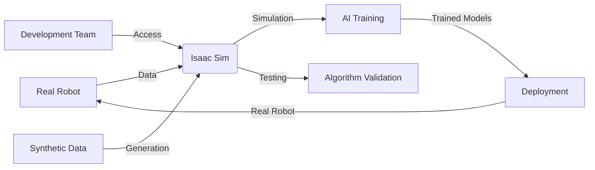

# Introduction to Isaac Sim

Welcome to Week 6 of Module 2: Building the Digital Twin. In this week, you'll learn about **NVIDIA Isaac Sim**, the premier simulation platform for robotics that provides photorealistic rendering, advanced physics simulation, and GPU-accelerated performance for developing and testing AI-powered robots.

## What is Isaac Sim?

**NVIDIA Isaac Sim** is a comprehensive robotics simulation platform built on NVIDIA Omniverse. It provides:

- **Photorealistic Rendering**: High-fidelity visual simulation for computer vision
- **Advanced Physics**: Accurate rigid body dynamics and material properties
- **AI Training Environment**: Synthetic data generation for machine learning
- **GPU Acceleration**: Leverage NVIDIA GPUs for faster simulation
- **Domain Randomization**: Improve real-world transfer of AI models



## Why Isaac Sim?

Isaac Sim addresses advanced robotics simulation needs:

| Challenge | Isaac Sim Solution |
|-----------|-------------------|
| **Photorealistic Vision** | Ray-traced rendering for synthetic data |
| **Physics Fidelity** | Advanced material properties and interactions |
| **AI Training** | Massive synthetic data generation |
| **Performance** | GPU-accelerated simulation |
| **Realism** | Domain randomization and sensor simulation |
| **Integration** | Seamless connection with ROS 2 and Isaac ROS |

## Isaac Sim Architecture

Isaac Sim is built on the NVIDIA Omniverse platform:

- **USD (Universal Scene Description)**: Scene representation format
- **PhysX Engine**: NVIDIA's physics simulation
- **RTX Rendering**: Real-time ray tracing
- **Omniverse Kit**: Extensible platform framework
- **Connectors**: ROS 2, Isaac ROS, and other ecosystem integrations

## Core Concepts Preview

This week covers these fundamental concepts:

### USD Scene Description
- **USD Fundamentals**: Understanding scene structure and composition
- **Asset Creation**: Building and importing 3D models
- **Scene Composition**: Assembling complex environments
- **Material Properties**: Realistic material definitions

### Isaac Sim Features
- **Photorealistic Rendering**: RTX-based visual simulation
- **Advanced Physics**: PhysX engine integration
- **Sensor Simulation**: Realistic camera, LiDAR, and other sensors
- **Domain Randomization**: Improving real-world transfer

### ROS 2 Integration
- **Isaac ROS**: NVIDIA's perception and navigation stack
- **Message Bridge**: Connecting simulation to ROS 2
- **Control Integration**: Robot control in simulation
- **Hardware-in-the-Loop**: Testing with real hardware

### AI Training Pipeline
- **Synthetic Data Generation**: Creating training datasets
- **Domain Randomization**: Improving model robustness
- **Perception Training**: Computer vision model development
- **Validation**: Testing trained models in simulation

## Setting Up Isaac Sim

Before proceeding, ensure your development environment includes:

```bash
# Check NVIDIA GPU
nvidia-smi

# Verify Isaac Sim installation
# Isaac Sim is typically installed via Omniverse Launcher
# or as part of Isaac ROS development kit

# Check for required libraries
ls /opt/nvidia/isaac_sim
# Should show Isaac Sim installation directory
```

## Isaac Sim vs Traditional Simulation

| Aspect | Gazebo | Isaac Sim |
|--------|--------|-----------|
| **Rendering** | Basic OpenGL | RTX ray tracing |
| **Physics** | ODE, Bullet | PhysX |
| **Visual Fidelity** | Moderate | Photorealistic |
| **Performance** | CPU-based | GPU-accelerated |
| **AI Focus** | General robotics | AI training |
| **Realism** | Good for control | Excellent for perception |

## USD (Universal Scene Description)

USD is the foundation of Isaac Sim scenes:

```usd
# Example USD file structure
def Xform "Robot" (
    prepend references = @./robot.usd@
)
{
    def Xform "Environment"
    {
        def Cube "Ground" (
            prepend references = @./ground.usd@
        )
        {
            # Material and physics properties
        }
    }
}
```

## Module Learning Objectives

By the end of this week, you will be able to:

1. **Create** photorealistic simulation environments using USD
2. **Configure** advanced physics properties and materials
3. **Integrate** Isaac Sim with ROS 2 for robot control
4. **Generate** synthetic training data for AI models
5. **Implement** domain randomization techniques
6. **Validate** perception algorithms in simulation
7. **Deploy** trained models to real hardware effectively

## Prerequisites

- Module 1-2 completion (ROS 2 and basic simulation)
- NVIDIA GPU with CUDA support
- Understanding of computer vision concepts
- Basic 3D modeling concepts
- Completed Week 1-5 of this curriculum

## Isaac Sim Best Practices

### 1. Performance Optimization
- **Level of Detail**: Use appropriate polygon counts
- **Material Complexity**: Balance realism with performance
- **Physics Settings**: Tune for simulation speed vs accuracy
- **Caching**: Pre-bake static elements when possible

### 2. Realism vs Performance
- **Selective Realism**: Focus on important visual elements
- **Sensor-Specific Optimization**: Optimize for specific sensor types
- **Batch Processing**: Generate synthetic data in parallel
- **Progressive Enhancement**: Start simple, add complexity gradually

### 3. AI Training Considerations
- **Domain Randomization**: Vary lighting, textures, and materials
- **Synthetic Data Quality**: Ensure realistic sensor outputs
- **Validation**: Test synthetic-trained models in real environments
- **Transfer Learning**: Bridge simulation-to-reality gap

## Next Steps

Continue to [Isaac Sim Fundamentals](./isaac-sim) to learn about the core concepts and tools for creating photorealistic robot simulations.

## Resources

- [Isaac Sim Documentation](https://docs.omniverse.nvidia.com/isaacsim/latest/index.html)
- [Isaac ROS Documentation](https://docs.nvidia.com/isaac/isaac_ros/)
- [USD Specification](https://graphics.pixar.com/usd/release/spec_overview.html)
- [Omniverse Developer Resources](https://developer.nvidia.com/omniverse)