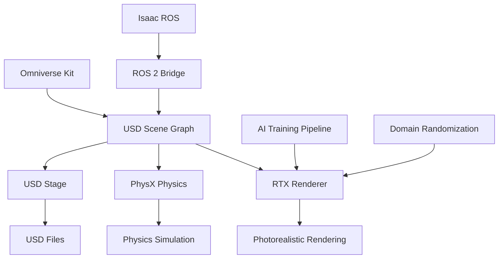

# Isaac Sim Fundamentals

NVIDIA Isaac Sim is a comprehensive robotics simulation platform built on Omniverse that provides photorealistic rendering, advanced physics simulation, and GPU acceleration for AI training and robot development. In this section, you'll learn the core concepts and tools for creating realistic robot simulations.

## Isaac Sim Architecture

Isaac Sim operates on the NVIDIA Omniverse platform with these key components:



### Core Components

- **USD (Universal Scene Description)**: Scene representation and composition
- **PhysX Engine**: NVIDIA's physics simulation engine
- **RTX Renderer**: Real-time ray tracing and photorealistic rendering
- **Omniverse Kit**: Extensible application framework
- **Connectors**: ROS 2, Isaac ROS, and other ecosystem integrations

## USD (Universal Scene Description)

USD is the foundation of Isaac Sim scenes. It's a powerful scene description format that enables:

- **Scene Composition**: Assembling complex scenes from multiple assets
- **Layering**: Managing scene variations and modifications
- **Animation**: Storing and playing back animations
- **Physics**: Defining physical properties and constraints
- **Materials**: Defining realistic surface properties

### USD File Structure

```usda
#usda 1.0

def Xform "Robot" (
    prepend references = @./robot.usd@
)
{
    def Xform "Base"
    {
        def Cylinder "Chassis"
        {
            # Visual and collision properties
        }
    }

    def Xform "Wheels"
    {
        def Cylinder "WheelFrontLeft"
        {
            # Wheel properties
        }
    }
}

def Xform "Environment"
{
    def Cube "GroundPlane"
    {
        # Environment properties
    }

    def Xform "Obstacles"
    {
        # Scene objects
    }
}
```

### USD Prim Types

Common USD primitive types used in Isaac Sim:

```usda
# Basic geometry
def Sphere "sphere1" {
    xformOp:translate = (0, 0, 1)
    radius = 0.5
}

def Cube "cube1" {
    xformOp:translate = (1, 0, 1)
    size = 1.0
}

def Cylinder "cylinder1" {
    xformOp:translate = (2, 0, 1)
    radius = 0.5
    height = 1.0
}

# Complex transforms
def Xform "robot_base" {
    xformOp:translate = (0, 0, 0.5)
    xformOp:rotateXYZ = (0, 0, 45)
    addComposingOps = ["xformOp:translate", "xformOp:rotateXYZ"]
}
```

## Isaac Sim Scene Creation

### Basic Scene Structure

Create a basic scene in Isaac Sim:

```python
#!/usr/bin/env python3
"""
Basic Isaac Sim scene creation example
"""
import omni
import carb
from omni.isaac.core import World
from omni.isaac.core.utils.stage import add_reference_to_stage
from omni.isaac.core.utils.prims import get_prim_at_path
from pxr import UsdGeom, Gf, Sdf

# Initialize Isaac Sim
from omni.isaac.kit import SimulationApp
simulation_app = SimulationApp({"headless": False})

# Import Isaac Sim components
from omni.isaac.core import World
from omni.isaac.core.objects import DynamicCuboid
from omni.isaac.core.utils.nucleus import get_assets_root_path

# Create world
world = World(stage_units_in_meters=1.0)

# Add ground plane
world.scene.add_default_ground_plane()

# Add a cube to the scene
cube = world.scene.add(
    DynamicCuboid(
        prim_path="/World/cube",
        name="cube",
        position=[0, 0, 1.0],
        size=0.5,
        mass=1.0
    )
)

# Reset world
world.reset()

# Simulation loop
for i in range(500):
    world.step(render=True)

simulation_app.close()
```

### Robot Loading

Loading a robot model into Isaac Sim:

```python
#!/usr/bin/env python3
"""
Robot loading example for Isaac Sim
"""
import omni
from omni.isaac.core import World
from omni.isaac.core.utils.stage import add_reference_to_stage
from omni.isaac.core.utils.nucleus import get_assets_root_path
from omni.isaac.core.utils.prims import get_prim_at_path
import carb

# Initialize Isaac Sim
from omni.isaac.kit import SimulationApp
simulation_app = SimulationApp({"headless": False})

# Import robot loading utilities
from omni.isaac.core.utils.stage import add_reference_to_stage
from omni.isaac.core.robots import Robot

# Create world
world = World(stage_units_in_meters=1.0)

# Add ground plane
world.scene.add_default_ground_plane()

# Load robot from USD file
# For this example, we'll use a sample robot
assets_root_path = get_assets_root_path()
if assets_root_path is None:
    carb.log_error("Could not find Isaac Sim assets. Ensure Isaac Sim is properly installed.")

# Add robot to scene
add_reference_to_stage(
    usd_path=f"{assets_root_path}/Isaac/Robots/Franka/franka.usd",
    prim_path="/World/Robot"
)

# Create robot object for control
robot = Robot(
    prim_path="/World/Robot",
    name="franka_robot"
)

# Add robot to world
world.scene.add(robot)

# Reset world
world.reset()

# Simulation loop
for i in range(1000):
    world.step(render=True)

    # Example: Simple robot control
    if i < 500:
        # Move robot forward
        pass
    else:
        # Stop robot
        pass

simulation_app.close()
```

## Physics Configuration

### PhysX Settings

Configure physics properties in Isaac Sim:

```python
#!/usr/bin/env python3
"""
Physics configuration example
"""
import omni
from omni.isaac.core import World
from omni.isaac.core.utils.stage import add_reference_to_stage
from pxr import PhysxSchema, UsdPhysics, Sdf

# Initialize Isaac Sim
from omni.isaac.kit import SimulationApp
simulation_app = SimulationApp({"headless": False})

world = World(stage_units_in_meters=1.0)

# Add ground plane with physics properties
ground = world.scene.add_default_ground_plane()

# Get stage and set physics properties
stage = world.stage

# Set global physics properties
scene_prim = stage.GetPrimAtPath("/World/PhysicsScene")
if scene_prim.IsValid():
    physx_scene_api = PhysxSchema.PhysxSceneAPI.Apply(scene_prim)
    physx_scene_api.GetSolverTypeAttr().Set("TGS")  # TGS solver
    physx_scene_api.GetMaxPositionIterationsAttr().Set(8)
    physx_scene_api.GetMaxVelocityIterationsAttr().Set(1)

# Add object with custom physics properties
from omni.isaac.core.objects import DynamicCuboid
cube = world.scene.add(
    DynamicCuboid(
        prim_path="/World/DynamicCube",
        name="dynamic_cube",
        position=[0, 0, 1.0],
        size=0.2,
        mass=0.5,
        color=None
    )
)

# Configure material properties
cube_prim = world.scene.get_object("dynamic_cube").prim
physx_material = PhysxSchema.PhysxMaterialAPI.Apply(cube_prim)
physx_material.GetStaticFrictionAttr().Set(0.5)
physx_material.GetDynamicFrictionAttr().Set(0.4)
physx_material.GetRestitutionAttr().Set(0.2)

world.reset()

# Simulation loop
for i in range(1000):
    world.step(render=True)

simulation_app.close()
```

## Sensor Integration

### Camera Sensors

Add photorealistic camera sensors to robots:

```python
#!/usr/bin/env python3
"""
Camera sensor integration example
"""
import omni
from omni.isaac.core import World
from omni.isaac.core.utils.stage import add_reference_to_stage
from omni.isaac.sensor import Camera
import numpy as np

# Initialize Isaac Sim
from omni.isaac.kit import SimulationApp
simulation_app = SimulationApp({"headless": False})

world = World(stage_units_in_meters=1.0)
world.scene.add_default_ground_plane()

# Add robot (using a simple cube as example)
from omni.isaac.core.objects import DynamicCuboid
robot = world.scene.add(
    DynamicCuboid(
        prim_path="/World/Robot",
        name="robot",
        position=[0, 0, 0.5],
        size=0.3,
        mass=1.0
    )
)

# Add camera sensor to robot
camera = Camera(
    prim_path="/World/Robot/Camera",
    position=np.array([0.2, 0, 0.1]),
    frequency=30,
    resolution=(640, 480)
)

# Add camera to stage
world.scene.add(camera)

world.reset()

# Simulation loop with camera capture
for i in range(1000):
    world.step(render=True)

    if i % 30 == 0:  # Capture image every 30 steps
        rgb_image = camera.get_rgb()
        print(f"Captured image at step {i}, shape: {rgb_image.shape}")

simulation_app.close()
```

### LiDAR Sensors

Add realistic LiDAR sensors:

```python
#!/usr/bin/env python3
"""
LiDAR sensor integration example
"""
import omni
from omni.isaac.core import World
from omni.isaac.sensor import RotatingLidarSensor
import numpy as np

# Initialize Isaac Sim
from omni.isaac.kit import SimulationApp
simulation_app = SimulationApp({"headless": False})

world = World(stage_units_in_meters=1.0)
world.scene.add_default_ground_plane()

# Add robot
from omni.isaac.core.objects import DynamicCuboid
robot = world.scene.add(
    DynamicCuboid(
        prim_path="/World/Robot",
        name="robot",
        position=[0, 0, 0.5],
        size=0.3,
        mass=1.0
    )
)

# Add LiDAR sensor
lidar = RotatingLidarSensor(
    prim_path="/World/Robot/Lidar",
    translation=np.array([0, 0, 0.5]),
    orientation=np.array([1.0, 0.0, 0.0, 0.0]),
    yaw_resolution=0.4,
    horizontal_fov=360,
    vertical_fov_range=(-5, 5),
    height=16,
    rotation_frequency=10,
    points_per_second=500000
)

world.scene.add(lidar)

world.reset()

# Simulation loop with LiDAR data
for i in range(1000):
    world.step(render=True)

    if i % 100 == 0:  # Sample LiDAR every 100 steps
        lidar_data = lidar.get_point_cloud()
        print(f"LiDAR points at step {i}: {len(lidar_data)} points")

simulation_app.close()
```

## USD Scene Composition

### Creating Complex Environments

Building complex scenes with multiple assets:

```usda
#usda 1.0

def Xform "Scene"
{
    # Ground plane
    def Xform "GroundPlane"
    {
        def Cube "Ground" (
            prepend references = @./assets/ground.usd@
        )
        {
            xformOp:translate = (0, 0, -0.01)
            visibility = "inherited"
        }
    }

    # Robot
    def Xform "Robot" (
        prepend references = @./assets/robot.usd@
    )
    {
        xformOp:translate = (0, 0, 0.5)
        xformOp:rotateXYZ = (0, 0, 0)
    }

    # Environment objects
    def Xform "Obstacles"
    {
        def Xform "Box1"
        {
            def Cube "Obstacle" (
                prepend references = @./assets/obstacle.usd@
            )
            {
                xformOp:translate = (2, 0, 0.5)
            }
        }

        def Xform "Box2"
        {
            def Cube "Obstacle" (
                prepend references = @./assets/obstacle.usd@
            )
            {
                xformOp:translate = (-2, 1, 0.5)
            }
        }
    }

    # Lighting
    def Xform "Lighting"
    {
        def DistantLight "KeyLight"
        {
            xformOp:translate = (0, 0, 10)
            xformOp:rotateXYZ = (-60, 45, 0)
            inputs:intensity = 3000
            inputs:color = (1, 1, 1)
        }

        def DomeLight "EnvironmentLight"
        {
            inputs:texture:file = @./assets/sky.hdr@
            inputs:intensity = 1
        }
    }

    # Physics scene
    def PhysicsScene "PhysicsScene"
    {
        physics:timeStepsPerSecond = 60
        physics:solverType = "TGS"
    }
}
```

### Material Definitions

Creating realistic materials in USD:

```usda
#usda 1.0

def Material "Materials/RobotMaterial"
{
    def Shader "PreviewSurface"
    {
        uniform token info:id = "UsdPreviewSurface"
        color3f inputs:diffuseColor = (0.8, 0.1, 0.1)  # Red
        float inputs:metallic = 0.0
        float inputs:roughness = 0.4
        float inputs:clearcoat = 0.0
        float inputs:clearcoatRoughness = 0.01
        float inputs:opacity = 1.0
        float inputs:ior = 1.5
        float inputs:specularColor = (1.0, 1.0, 1.0)
    }

    def Shader "MaterialX"
    {
        uniform token info:id = "MaterialX"
        # Additional MaterialX properties
    }

    token outputs:surface
    inputs:surface.connect = </Materials/RobotMaterial/PreviewSurface.outputs:surface>
}
```

## Domain Randomization

### Randomizing Scene Properties

Implement domain randomization for AI training:

```python
#!/usr/bin/env python3
"""
Domain randomization example
"""
import omni
from omni.isaac.core import World
from omni.isaac.core.utils.stage import add_reference_to_stage
from omni.isaac.core.utils.prims import get_prim_at_path
import numpy as np
import random

# Initialize Isaac Sim
from omni.isaac.kit import SimulationApp
simulation_app = SimulationApp({"headless": False})

world = World(stage_units_in_meters=1.0)
world.scene.add_default_ground_plane()

# Add objects to randomize
from omni.isaac.core.objects import DynamicCuboid
objects = []
for i in range(5):
    obj = world.scene.add(
        DynamicCuboid(
            prim_path=f"/World/Object{i}",
            name=f"object_{i}",
            position=[random.uniform(-2, 2), random.uniform(-2, 2), 0.5],
            size=random.uniform(0.1, 0.3),
            mass=random.uniform(0.1, 1.0)
        )
    )
    objects.append(obj)

# Domain randomization function
def randomize_scene():
    """Randomize scene properties for domain randomization"""
    # Randomize lighting
    stage = world.stage
    light_prim = stage.GetPrimAtPath("/World/DistantLight")
    if light_prim.IsValid():
        # Randomize light direction and intensity
        import carb
        intensity = random.uniform(1000, 5000)
        # Update light properties...

    # Randomize object positions
    for i, obj in enumerate(objects):
        new_pos = [
            random.uniform(-2, 2),
            random.uniform(-2, 2),
            random.uniform(0.5, 2.0)
        ]
        # Update object position...

    # Randomize colors
    colors = [
        (random.random(), random.random(), random.random())
        for _ in range(len(objects))
    ]
    # Apply random colors...

world.reset()

# Training loop with domain randomization
for episode in range(100):
    if episode % 10 == 0:  # Randomize every 10 episodes
        randomize_scene()

    # Run simulation episode
    for step in range(100):
        world.step(render=True)

simulation_app.close()
```

## ROS 2 Integration

### Isaac ROS Bridge

Connecting Isaac Sim to ROS 2:

```python
#!/usr/bin/env python3
"""
Isaac ROS integration example
"""
import rclpy
from rclpy.node import Node
from sensor_msgs.msg import Image, LaserScan
from geometry_msgs.msg import Twist
from std_msgs.msg import String
import numpy as np

class IsaacROSInterface(Node):
    def __init__(self):
        super().__init__('isaac_ros_interface')

        # Publishers for Isaac Sim sensors
        self.camera_pub = self.create_publisher(Image, '/isaac/camera/rgb', 10)
        self.lidar_pub = self.create_publisher(LaserScan, '/isaac/lidar/scan', 10)

        # Subscribers for robot control
        self.cmd_vel_sub = self.create_subscription(
            Twist, '/cmd_vel', self.cmd_vel_callback, 10)

        # Timer for publishing sensor data
        self.timer = self.create_timer(0.1, self.publish_sensor_data)

        self.get_logger().info('Isaac ROS interface started')

    def cmd_vel_callback(self, msg):
        """Handle velocity commands from ROS 2"""
        # This would interface with Isaac Sim robot control
        linear_vel = msg.linear.x
        angular_vel = msg.angular.z

        self.get_logger().info(f'Received cmd_vel: linear={linear_vel}, angular={angular_vel}')

    def publish_sensor_data(self):
        """Publish sensor data from Isaac Sim to ROS 2"""
        # This would get data from Isaac Sim sensors and publish to ROS 2
        # For simulation, we'll publish dummy data
        camera_msg = Image()
        camera_msg.header.stamp = self.get_clock().now().to_msg()
        camera_msg.header.frame_id = 'camera_frame'
        camera_msg.width = 640
        camera_msg.height = 480
        camera_msg.encoding = 'rgb8'
        camera_msg.is_bigendian = False
        camera_msg.step = 640 * 3  # width * bytes per pixel
        camera_msg.data = [0] * (640 * 480 * 3)  # Dummy data

        self.camera_pub.publish(camera_msg)

def main(args=None):
    rclpy.init(args=args)
    node = IsaacROSInterface()

    try:
        rclpy.spin(node)
    except KeyboardInterrupt:
        pass
    finally:
        node.destroy_node()
        rclpy.shutdown()

if __name__ == '__main__':
    main()
```

## Performance Optimization

### GPU Acceleration

Leveraging GPU acceleration in Isaac Sim:

```python
#!/usr/bin/env python3
"""
Performance optimization example
"""
import omni
from omni.isaac.core import World
from omni.isaac.core.utils.stage import add_reference_to_stage
import carb

# Initialize Isaac Sim with performance settings
from omni.isaac.kit import SimulationApp

# Performance configuration
config = {
    "headless": False,
    "window_width": 1280,
    "window_height": 720,
    "clear_color": [0.2, 0.2, 0.2, 1.0],
    "enable_cameras": True,
    "use_fabric": True,  # Use USD Fabric for better performance
    "multi_gpu": True    # Enable multi-GPU if available
}

simulation_app = SimulationApp(config)

# Set performance-related settings
carb.settings.get_settings().set("/app/window/drawMouse", True)
carb.settings.get_settings().set("/app/asyncRendering/enabled", True)
carb.settings.get_settings().set("/rtx/sceneDb/writeSceneGraph", False)

world = World(stage_units_in_meters=1.0)
world.scene.add_default_ground_plane()

# Add objects
from omni.isaac.core.objects import DynamicCuboid
for i in range(10):
    world.scene.add(
        DynamicCuboid(
            prim_path=f"/World/Object{i}",
            name=f"object_{i}",
            position=[i*0.5, 0, 0.5],
            size=0.2,
            mass=0.5
        )
    )

world.reset()

# Optimized simulation loop
for i in range(1000):
    world.step(render=True)

simulation_app.close()
```

## Best Practices

### 1. Scene Optimization

```python
# Good: Use appropriate level of detail
def create_optimized_robot():
    # Use simplified collision geometry
    # Use efficient materials
    # Optimize polygon count for performance
    pass

# Bad: High-polygon models without optimization
def create_slow_robot():
    # Very detailed models that slow down simulation
    # Complex materials without performance consideration
    pass
```

### 2. Physics Settings

```python
# Good: Balanced physics settings
def configure_physics():
    # Use appropriate solver settings
    # Balance accuracy with performance
    # Tune iteration counts for stability
    pass

# Bad: Too many iterations or too few
def poor_physics_config():
    # Excessive iterations = slow simulation
    # Too few iterations = unstable physics
    pass
```

### 3. Domain Randomization

```python
# Good: Systematic domain randomization
def randomize_realistically():
    # Randomize within realistic bounds
    # Consider physical constraints
    # Track randomization parameters
    pass

# Bad: Extreme randomization
def randomize_extremely():
    # Randomization that breaks physical plausibility
    # No tracking of parameters
    pass
```

## Common Issues and Troubleshooting

### 1. Performance Issues

```bash
# Check GPU utilization
nvidia-smi

# Monitor Isaac Sim performance
# Use Isaac Sim's built-in profiler
```

### 2. USD Loading Issues

```python
# Error: Asset not found
# Solution: Verify asset paths and Isaac Sim installation

# Error: Invalid USD file
# Solution: Validate USD file syntax
```

### 3. Physics Instability

```python
# Error: Objects flying apart
# Solution: Check mass properties and constraints

# Error: Slow simulation
# Solution: Optimize physics settings
```

## Advanced Features

### 1. Custom USD Extensions

```python
# Creating custom USD schemas
from pxr import Tf, Sdf, Usd, UsdGeom

# Custom robot schema
class RobotSchema(UsdGeom.Xform):
    """Custom robot schema with robot-specific properties"""

    @staticmethod
    def Define(stage, path):
        return RobotSchema(Usd.Prim.Define(stage, path))

    def GetBaseLinkAttr(self):
        return self.GetPrim().GetAttribute("robot:baseLink")
```

### 2. Custom Sensors

```python
# Creating custom sensor types
from omni.isaac.sensor import Sensor

class CustomSensor(Sensor):
    """Custom sensor implementation"""

    def __init__(self, prim_path, **kwargs):
        super().__init__(prim_path=prim_path, **kwargs)

    def get_data(self):
        """Get custom sensor data"""
        # Custom data processing
        pass
```

## Next Steps

Now that you understand Isaac Sim fundamentals, continue to [Synthetic Data Generation](../week-06/synthetic-data) to learn about generating training data for AI models.

## Exercises

1. Create a basic Isaac Sim scene with a robot and environment
2. Add realistic camera and LiDAR sensors to your robot
3. Implement domain randomization for your scene
4. Connect your Isaac Sim scene to ROS 2