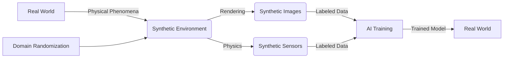

# Synthetic Data Generation

Synthetic data generation is a core capability of Isaac Sim that enables training of AI models with photorealistic, labeled data. In this section, you'll learn how to generate high-quality synthetic datasets for computer vision, perception, and other AI applications.

## Understanding Synthetic Data

Synthetic data in Isaac Sim refers to:
- **Photorealistic images** with perfect ground truth labels
- **Sensor data** with accurate annotations
- **Physics simulations** with controlled parameters
- **Domain randomization** for robust model training



## Synthetic Data Types

### RGB Images

Generating photorealistic RGB images with Isaac Sim:

```python
#!/usr/bin/env python3
"""
RGB image generation example
"""
import omni
from omni.isaac.core import World
from omni.isaac.core.utils.stage import add_reference_to_stage
from omni.isaac.sensor import Camera
import numpy as np
import cv2
import os

# Initialize Isaac Sim
from omni.isaac.kit import SimulationApp
simulation_app = SimulationApp({"headless": False})

world = World(stage_units_in_meters=1.0)
world.scene.add_default_ground_plane()

# Add objects for training
from omni.isaac.core.objects import DynamicCuboid
objects = []
for i in range(5):
    obj = world.scene.add(
        DynamicCuboid(
            prim_path=f"/World/Object{i}",
            name=f"object_{i}",
            position=[i*0.5, 0, 0.5],
            size=0.2,
            mass=0.5
        )
    )
    objects.append(obj)

# Add camera
camera = Camera(
    prim_path="/World/Camera",
    position=np.array([2.0, 0, 1.0]),
    frequency=30,
    resolution=(640, 480)
)
world.scene.add(camera)

world.reset()

# Generate synthetic images
output_dir = "synthetic_images"
os.makedirs(output_dir, exist_ok=True)

for i in range(100):  # Generate 100 images
    world.step(render=True)

    if i % 10 == 0:  # Save every 10th frame
        rgb_image = camera.get_rgb()
        # Convert to OpenCV format (BGR)
        rgb_image_bgr = cv2.cvtColor(rgb_image, cv2.COLOR_RGB2BGR)

        # Save image
        image_path = os.path.join(output_dir, f"image_{i:04d}.png")
        cv2.imwrite(image_path, rgb_image_bgr)
        print(f"Saved RGB image: {image_path}")

simulation_app.close()
```

### Depth Maps

Generating depth maps with perfect ground truth:

```python
#!/usr/bin/env python3
"""
Depth map generation example
"""
import omni
from omni.isaac.core import World
from omni.isaac.sensor import Camera
import numpy as np
import cv2
import os

# Initialize Isaac Sim
from omni.isaac.kit import SimulationApp
simulation_app = SimulationApp({"headless": False})

world = World(stage_units_in_meters=1.0)
world.scene.add_default_ground_plane()

# Add objects
from omni.isaac.core.objects import DynamicCuboid
for i in range(5):
    world.scene.add(
        DynamicCuboid(
            prim_path=f"/World/Object{i}",
            name=f"object_{i}",
            position=[i*0.5, 0, 0.5],
            size=0.2,
            mass=0.5
        )
    )

# Add camera with depth capability
camera = Camera(
    prim_path="/World/Camera",
    position=np.array([2.0, 0, 1.0]),
    frequency=30,
    resolution=(640, 480)
)
world.scene.add(camera)

world.reset()

# Generate depth maps
depth_dir = "synthetic_depth"
os.makedirs(depth_dir, exist_ok=True)

for i in range(100):
    world.step(render=True)

    if i % 10 == 0:
        # Get depth data
        depth_data = camera.get_depth()

        # Normalize depth for visualization (0-255)
        depth_normalized = ((depth_data - depth_data.min()) /
                           (depth_data.max() - depth_data.min()) * 255).astype(np.uint8)

        # Save depth map
        depth_path = os.path.join(depth_dir, f"depth_{i:04d}.png")
        cv2.imwrite(depth_path, depth_normalized)
        print(f"Saved depth map: {depth_path}")

simulation_app.close()
```

### Semantic Segmentation

Generating semantic segmentation masks:

```python
#!/usr/bin/env python3
"""
Semantic segmentation generation example
"""
import omni
from omni.isaac.core import World
from omni.isaac.sensor import Camera
import numpy as np
import cv2
import os

# Initialize Isaac Sim
from omni.isaac.kit import SimulationApp
simulation_app = SimulationApp({"headless": False})

world = World(stage_units_in_meters=1.0)
world.scene.add_default_ground_plane()

# Add objects with different semantic labels
from omni.isaac.core.objects import DynamicCuboid
objects = []
for i in range(5):
    obj = world.scene.add(
        DynamicCuboid(
            prim_path=f"/World/Object{i}",
            name=f"object_{i}",
            position=[i*0.5, 0, 0.5],
            size=0.2,
            mass=0.5
        )
    )
    # Set semantic label for segmentation
    from omni.isaac.core.utils.semantics import add_update_semantics
    add_update_semantics(obj.prim, "semantic:is:object")
    objects.append(obj)

# Add camera with semantic capability
camera = Camera(
    prim_path="/World/Camera",
    position=np.array([2.0, 0, 1.0]),
    frequency=30,
    resolution=(640, 480)
)
world.scene.add(camera)

world.reset()

# Generate semantic segmentation masks
semantic_dir = "synthetic_semantic"
os.makedirs(semantic_dir, exist_ok=True)

for i in range(100):
    world.step(render=True)

    if i % 10 == 0:
        # Get semantic segmentation data
        semantic_data = camera.get_semantic_segmentation()

        # Process semantic data
        # Convert to visualization format
        semantic_vis = (semantic_data * 51).astype(np.uint8)  # Scale for visibility

        # Save semantic mask
        semantic_path = os.path.join(semantic_dir, f"semantic_{i:04d}.png")
        cv2.imwrite(semantic_path, semantic_vis)
        print(f"Saved semantic mask: {semantic_path}")

simulation_app.close()
```

## Domain Randomization

### Lighting Randomization

Randomizing lighting conditions for robust training:

```python
#!/usr/bin/env python3
"""
Lighting domain randomization example
"""
import omni
from omni.isaac.core import World
from omni.isaac.sensor import Camera
import numpy as np
import random
import carb

# Initialize Isaac Sim
from omni.isaac.kit import SimulationApp
simulation_app = SimulationApp({"headless": False})

world = World(stage_units_in_meters=1.0)
world.scene.add_default_ground_plane()

# Add objects
from omni.isaac.core.objects import DynamicCuboid
for i in range(3):
    world.scene.add(
        DynamicCuboid(
            prim_path=f"/World/Object{i}",
            name=f"object_{i}",
            position=[i*0.5, 0, 0.5],
            size=0.2,
            mass=0.5
        )
    )

# Add camera
camera = Camera(
    prim_path="/World/Camera",
    position=np.array([2.0, 0, 1.0]),
    frequency=30,
    resolution=(640, 480)
)
world.scene.add(camera)

world.reset()

def randomize_lighting():
    """Randomize lighting conditions"""
    stage = world.stage

    # Randomize key light
    key_light_path = "/World/Light"
    if not stage.GetPrimAtPath(key_light_path).IsValid():
        # Create light if it doesn't exist
        from omni.isaac.core.utils.prims import create_prim
        create_prim(
            prim_path=key_light_path,
            prim_type="DistantLight",
            position=np.array([5, 5, 10]),
            orientation=np.array([0.707, 0, 0, 0.707])  # 45-degree rotation
        )

    light_prim = stage.GetPrimAtPath(key_light_path)
    if light_prim.IsValid():
        # Randomize light properties
        import omni.kit.commands
        intensity = random.uniform(500, 5000)
        color = (random.random(), random.random(), random.random())

        # Apply changes through Isaac Sim commands
        omni.kit.commands.execute(
            "ChangeProperty",
            prop_path=Sdf.Path(f"{key_light_path}.inputs:intensity"),
            value=intensity,
            prev_value=3000
        )
        omni.kit.commands.execute(
            "ChangeProperty",
            prop_path=Sdf.Path(f"{key_light_path}.inputs:color"),
            value=color,
            prev_value=(1, 1, 1)
        )

# Generate dataset with lighting randomization
for episode in range(50):
    if episode % 5 == 0:  # Randomize lighting every 5 episodes
        randomize_lighting()
        print(f"Randomized lighting for episode {episode}")

    # Generate multiple frames per episode
    for frame in range(10):
        world.step(render=True)

simulation_app.close()
```

### Material Randomization

Randomizing materials and textures:

```python
#!/usr/bin/env python3
"""
Material domain randomization example
"""
import omni
from omni.isaac.core import World
from omni.isaac.sensor import Camera
import numpy as np
import random

# Initialize Isaac Sim
from omni.isaac.kit import SimulationApp
simulation_app = SimulationApp({"headless": False})

world = World(stage_units_in_meters=1.0)
world.scene.add_default_ground_plane()

# Add objects with materials to randomize
from omni.isaac.core.objects import DynamicCuboid
objects = []
for i in range(5):
    obj = world.scene.add(
        DynamicCuboid(
            prim_path=f"/World/Object{i}",
            name=f"object_{i}",
            position=[i*0.5, 0, 0.5],
            size=0.2,
            mass=0.5
        )
    )
    objects.append(obj)

# Add camera
camera = Camera(
    prim_path="/World/Camera",
    position=np.array([2.0, 0, 1.0]),
    frequency=30,
    resolution=(640, 480)
)
world.scene.add(camera)

world.reset()

def randomize_materials():
    """Randomize materials of objects"""
    for obj in objects:
        # Randomize color
        color = (random.random(), random.random(), random.random())

        # Randomize material properties
        metallic = random.uniform(0.0, 1.0)
        roughness = random.uniform(0.1, 0.9)

        # Apply material properties (simplified example)
        # In practice, you would use Isaac Sim's material system
        print(f"Applied random material to {obj.name}: color={color}, metallic={metallic}, roughness={roughness}")

# Generate dataset with material randomization
for episode in range(20):
    if episode % 3 == 0:  # Randomize materials every 3 episodes
        randomize_materials()
        print(f"Randomized materials for episode {episode}")

    # Generate frames
    for frame in range(20):
        world.step(render=True)

simulation_app.close()
```

### Environment Randomization

Randomizing scene environments:

```python
#!/usr/bin/env python3
"""
Environment domain randomization example
"""
import omni
from omni.isaac.core import World
from omni.isaac.sensor import Camera
import numpy as np
import random

# Initialize Isaac Sim
from omni.isaac.kit import SimulationApp
simulation_app = SimulationApp({"headless": False})

world = World(stage_units_in_meters=1.0)

def create_random_environment():
    """Create a random environment"""
    # Clear existing environment
    from omni.isaac.core.utils.stage import clear_stage
    # Don't clear the stage in this example, just add new objects

    # Add random objects
    object_count = random.randint(3, 10)
    for i in range(object_count):
        position = [
            random.uniform(-3, 3),
            random.uniform(-3, 3),
            random.uniform(0.2, 2.0)
        ]

        size = random.uniform(0.1, 0.5)
        mass = random.uniform(0.1, 2.0)

        from omni.isaac.core.objects import DynamicCuboid
        world.scene.add(
            DynamicCuboid(
                prim_path=f"/World/EnvObject{i}",
                name=f"env_object_{i}",
                position=position,
                size=size,
                mass=mass
            )
        )

# Add initial camera
camera = Camera(
    prim_path="/World/Camera",
    position=np.array([3.0, 0, 2.0]),
    frequency=30,
    resolution=(640, 480)
)
world.scene.add(camera)

world.reset()

# Generate dataset with environment randomization
for episode in range(10):
    if episode > 0:  # Clear and recreate environment after first episode
        # In practice, you'd remove existing objects and create new ones
        print(f"Creating new environment for episode {episode}")

    create_random_environment()

    # Generate frames for this environment
    for frame in range(50):
        world.step(render=True)

simulation_app.close()
```

## Data Annotation

### Automatic Annotation

Isaac Sim provides automatic ground truth annotations:

```python
#!/usr/bin/env python3
"""
Automatic annotation example
"""
import omni
from omni.isaac.core import World
from omni.isaac.sensor import Camera
import numpy as np
import json
import os

# Initialize Isaac Sim
from omni.isaac.kit import SimulationApp
simulation_app = SimulationApp({"headless": False})

world = World(stage_units_in_meters=1.0)
world.scene.add_default_ground_plane()

# Add objects with semantic labels
from omni.isaac.core.objects import DynamicCuboid
objects = []
for i in range(5):
    obj = world.scene.add(
        DynamicCuboid(
            prim_path=f"/World/Object{i}",
            name=f"object_{i}",
            position=[i*0.5, 0, 0.5],
            size=0.2,
            mass=0.5
        )
    )
    objects.append(obj)

# Add camera
camera = Camera(
    prim_path="/World/Camera",
    position=np.array([2.0, 0, 1.0]),
    frequency=30,
    resolution=(640, 480)
)
world.scene.add(camera)

world.reset()

# Generate annotated dataset
dataset_dir = "annotated_dataset"
os.makedirs(dataset_dir, exist_ok=True)
os.makedirs(os.path.join(dataset_dir, "images"), exist_ok=True)
os.makedirs(os.path.join(dataset_dir, "annotations"), exist_ok=True)

for i in range(50):
    world.step(render=True)

    if i % 5 == 0:  # Generate annotation every 5 frames
        # Get RGB image
        rgb_image = camera.get_rgb()

        # Get depth data
        depth_data = camera.get_depth()

        # Get semantic segmentation
        semantic_data = camera.get_semantic_segmentation()

        # Create annotation
        annotation = {
            "frame_id": i,
            "timestamp": world.current_time,
            "objects": [],
            "camera_intrinsics": {
                "fx": 320,  # Example values
                "fy": 320,
                "cx": 320,
                "cy": 240
            }
        }

        # Add object annotations
        for j, obj in enumerate(objects):
            # Get object pose in camera frame
            obj_pos = obj.get_world_pose()[0]  # Get position
            # Calculate 2D bounding box from 3D position (simplified)
            bbox_2d = [100, 100, 50, 50]  # Placeholder values

            annotation["objects"].append({
                "id": j,
                "name": obj.name,
                "bbox_2d": bbox_2d,
                "position_3d": obj_pos.tolist(),
                "visibility": True
            })

        # Save image
        import cv2
        image_path = os.path.join(dataset_dir, "images", f"frame_{i:04d}.png")
        cv2.imwrite(image_path, cv2.cvtColor(rgb_image, cv2.COLOR_RGB2BGR))

        # Save annotation
        annotation_path = os.path.join(dataset_dir, "annotations", f"frame_{i:04d}.json")
        with open(annotation_path, 'w') as f:
            json.dump(annotation, f, indent=2)

        print(f"Saved frame {i} with annotations")

simulation_app.close()
```

## Data Pipeline Integration

### ROS 2 Integration

Integrating synthetic data generation with ROS 2:

```python
#!/usr/bin/env python3
"""
ROS 2 synthetic data pipeline example
"""
import rclpy
from rclpy.node import Node
from sensor_msgs.msg import Image, CameraInfo
from std_msgs.msg import String
from cv_bridge import CvBridge
import numpy as np
import threading
import queue

class SyntheticDataNode(Node):
    def __init__(self):
        super().__init__('synthetic_data_node')

        # Create publishers for synthetic data
        self.image_pub = self.create_publisher(Image, '/synthetic/camera/rgb', 10)
        self.info_pub = self.create_publisher(CameraInfo, '/synthetic/camera/info', 10)

        # Create CV bridge
        self.bridge = CvBridge()

        # Data queue for Isaac Sim thread
        self.data_queue = queue.Queue(maxsize=10)

        # Start Isaac Sim data generation in separate thread
        self.isaac_thread = threading.Thread(target=self.run_isaac_sim)
        self.isaac_thread.daemon = True
        self.isaac_thread.start()

        # Timer to publish data from queue
        self.timer = self.create_timer(0.1, self.publish_data)  # 10 Hz

        self.get_logger().info('Synthetic data node started')

    def run_isaac_sim(self):
        """Run Isaac Sim in separate thread"""
        # This would normally run Isaac Sim in a loop
        # For demonstration, we'll simulate data generation
        import time

        for i in range(1000):
            # Simulate Isaac Sim data generation
            synthetic_image = np.random.randint(0, 255, (480, 640, 3), dtype=np.uint8)

            # Add to queue (non-blocking)
            try:
                self.data_queue.put_nowait({
                    'image': synthetic_image,
                    'timestamp': time.time()
                })
            except queue.Full:
                pass  # Skip if queue is full

            time.sleep(0.1)  # Simulate processing time

    def publish_data(self):
        """Publish data from queue"""
        try:
            data = self.data_queue.get_nowait()

            # Convert to ROS message
            image_msg = self.bridge.cv2_to_imgmsg(data['image'], encoding='bgr8')
            image_msg.header.stamp = self.get_clock().now().to_msg()
            image_msg.header.frame_id = 'synthetic_camera'

            # Create camera info
            info_msg = CameraInfo()
            info_msg.header = image_msg.header
            info_msg.width = 640
            info_msg.height = 480
            info_msg.k = [320.0, 0.0, 320.0,  # fx, 0, cx
                         0.0, 320.0, 240.0,   # 0, fy, cy
                         0.0, 0.0, 1.0]       # 0, 0, 1
            info_msg.p = [320.0, 0.0, 320.0, 0.0,  # [fx, 0, cx, 0]
                         0.0, 320.0, 240.0, 0.0,   # [0, fy, cy, 0]
                         0.0, 0.0, 1.0, 0.0]       # [0, 0, 1, 0]

            # Publish messages
            self.image_pub.publish(image_msg)
            self.info_pub.publish(info_msg)

        except queue.Empty:
            pass  # No data available

def main(args=None):
    rclpy.init(args=args)
    node = SyntheticDataNode()

    try:
        rclpy.spin(node)
    except KeyboardInterrupt:
        pass
    finally:
        node.destroy_node()
        rclpy.shutdown()

if __name__ == '__main__':
    main()
```

## Quality Assurance

### Data Quality Metrics

Evaluating synthetic data quality:

```python
#!/usr/bin/env python3
"""
Synthetic data quality assessment
"""
import numpy as np
import cv2
from scipy import ndimage
import os

class SyntheticDataQuality:
    def __init__(self):
        self.metrics = {}

    def calculate_sharpness(self, image):
        """Calculate image sharpness using Laplacian variance"""
        gray = cv2.cvtColor(image, cv2.COLOR_BGR2GRAY) if len(image.shape) == 3 else image
        laplacian = cv2.Laplacian(gray, cv2.CV_64F)
        return laplacian.var()

    def calculate_brightness(self, image):
        """Calculate image brightness"""
        gray = cv2.cvtColor(image, cv2.COLOR_BGR2GRAY) if len(image.shape) == 3 else image
        return np.mean(gray)

    def calculate_contrast(self, image):
        """Calculate image contrast"""
        gray = cv2.cvtColor(image, cv2.COLOR_BGR2GRAY) if len(image.shape) == 3 else image
        return np.std(gray)

    def assess_quality(self, image_path):
        """Assess quality of synthetic image"""
        image = cv2.imread(image_path)
        if image is None:
            return None

        quality_metrics = {
            'sharpness': self.calculate_sharpness(image),
            'brightness': self.calculate_brightness(image),
            'contrast': self.calculate_contrast(image),
            'size': image.shape
        }

        return quality_metrics

    def batch_assessment(self, image_dir):
        """Assess quality of all images in directory"""
        results = {}

        for filename in os.listdir(image_dir):
            if filename.lower().endswith(('.png', '.jpg', '.jpeg')):
                image_path = os.path.join(image_dir, filename)
                quality = self.assess_quality(image_path)
                if quality:
                    results[filename] = quality

        return results

# Example usage
quality_assessor = SyntheticDataQuality()
quality_results = quality_assessor.batch_assessment("synthetic_images")

# Print summary
if quality_results:
    sharpness_values = [v['sharpness'] for v in quality_results.values()]
    brightness_values = [v['brightness'] for v in quality_results.values()]
    contrast_values = [v['contrast'] for v in quality_results.values()]

    print(f"Dataset Quality Summary:")
    print(f"  Images processed: {len(quality_results)}")
    print(f"  Sharpness - Mean: {np.mean(sharpness_values):.2f}, Std: {np.std(sharpness_values):.2f}")
    print(f"  Brightness - Mean: {np.mean(brightness_values):.2f}, Std: {np.std(brightness_values):.2f}")
    print(f"  Contrast - Mean: {np.mean(contrast_values):.2f}, Std: {np.std(contrast_values):.2f}")
```

## Performance Optimization

### Batch Processing

Optimizing synthetic data generation for performance:

```python
#!/usr/bin/env python3
"""
Batch synthetic data generation
"""
import omni
from omni.isaac.core import World
from omni.isaac.sensor import Camera
import numpy as np
import threading
import queue
from concurrent.futures import ThreadPoolExecutor
import os

class BatchSyntheticGenerator:
    def __init__(self, output_dir="batch_synthetic_data"):
        self.output_dir = output_dir
        os.makedirs(output_dir, exist_ok=True)
        os.makedirs(os.path.join(output_dir, "images"), exist_ok=True)
        os.makedirs(os.path.join(output_dir, "depth"), exist_ok=True)

        # Initialize Isaac Sim
        self.simulation_app = None
        self.world = None
        self.camera = None

    def initialize_simulation(self):
        """Initialize Isaac Sim"""
        from omni.isaac.kit import SimulationApp
        self.simulation_app = SimulationApp({"headless": True})  # Headless for batch processing

        self.world = World(stage_units_in_meters=1.0)
        self.world.scene.add_default_ground_plane()

        # Add objects
        from omni.isaac.core.objects import DynamicCuboid
        for i in range(10):
            self.world.scene.add(
                DynamicCuboid(
                    prim_path=f"/World/Object{i}",
                    name=f"object_{i}",
                    position=[i*0.3, 0, 0.5],
                    size=0.2,
                    mass=0.5
                )
            )

        # Add camera
        self.camera = Camera(
            prim_path="/World/Camera",
            position=np.array([2.0, 0, 1.0]),
            frequency=30,
            resolution=(640, 480)
        )
        self.world.scene.add(self.camera)

        self.world.reset()

    def generate_batch(self, batch_size=100, batch_id=0):
        """Generate a batch of synthetic data"""
        self.initialize_simulation()

        for i in range(batch_size):
            self.world.step(render=True)

            if i % 10 == 0:  # Save every 10th frame
                # Get data
                rgb_image = self.camera.get_rgb()
                depth_data = self.camera.get_depth()

                # Save images
                import cv2
                rgb_path = os.path.join(self.output_dir, "images", f"batch_{batch_id}_frame_{i:04d}.png")
                depth_path = os.path.join(self.output_dir, "depth", f"batch_{batch_id}_depth_{i:04d}.png")

                cv2.imwrite(rgb_path, cv2.cvtColor(rgb_image, cv2.COLOR_RGB2BGR))

                # Normalize depth for PNG
                depth_normalized = ((depth_data - depth_data.min()) /
                                   (depth_data.max() - depth_data.min()) * 255).astype(np.uint8)
                cv2.imwrite(depth_path, depth_normalized)

                print(f"Batch {batch_id}: Saved frame {i}")

        # Clean up
        self.simulation_app.close()

# Generate multiple batches in parallel
def generate_multiple_batches():
    batch_generator = BatchSyntheticGenerator()

    # Generate 5 batches in parallel
    with ThreadPoolExecutor(max_workers=2) as executor:  # Limit workers to avoid GPU overload
        futures = []
        for batch_id in range(5):
            future = executor.submit(batch_generator.generate_batch, 100, batch_id)
            futures.append(future)

        # Wait for all batches to complete
        for future in futures:
            future.result()

# Run batch generation
# generate_multiple_batches()
```

## Best Practices

### 1. Data Diversity

```python
# Good: Diverse synthetic dataset
def create_diverse_dataset():
    """Create diverse synthetic data with various conditions"""
    conditions = [
        {"lighting": "bright", "weather": "clear", "objects": 5},
        {"lighting": "dim", "weather": "overcast", "objects": 10},
        {"lighting": "variable", "weather": "sunny", "objects": 3}
    ]

    for condition in conditions:
        # Generate data for each condition
        print(f"Generating data for {condition}")
        # ... generation logic

# Bad: Single condition dataset
def create_homogeneous_dataset():
    """Create limited synthetic data with same conditions"""
    # Only one lighting condition
    # Only one object configuration
    # Limited variation
    pass
```

### 2. Quality Control

```python
# Good: Quality-controlled generation
def generate_with_quality_check():
    """Generate data with quality validation"""
    for i in range(1000):
        # Generate frame
        # Validate quality
        # Only save if quality is acceptable
        pass

# Bad: No quality validation
def generate_without_quality():
    """Generate data without quality validation"""
    # Generate all frames regardless of quality
    # No filtering
    pass
```

### 3. Annotation Accuracy

```python
# Good: Accurate annotations
def generate_accurate_annotations():
    """Generate precise ground truth annotations"""
    # Use Isaac Sim's built-in annotation tools
    # Validate annotation accuracy
    # Include multiple annotation types
    pass

# Bad: Inaccurate annotations
def generate_inaccurate_annotations():
    """Generate potentially inaccurate annotations"""
    # Approximate annotations
    # No validation
    pass
```

## Common Issues and Troubleshooting

### 1. GPU Memory Issues

```python
# Solution: Optimize resolution and batch size
def optimize_gpu_usage():
    """Optimize for GPU memory constraints"""
    # Reduce resolution for generation
    # Process in smaller batches
    # Clear GPU memory between batches
    pass
```

### 2. Quality Degradation

```python
# Solution: Monitor quality metrics
def monitor_quality():
    """Monitor synthetic data quality"""
    # Calculate quality metrics
    # Set quality thresholds
    # Regenerate if below threshold
    pass
```

### 3. Domain Gap

```python
# Solution: Bridge domain gap
def reduce_domain_gap():
    """Reduce gap between synthetic and real data"""
    # Match real-world statistics
    # Add realistic noise
    # Use domain adaptation techniques
    pass
```

## Next Steps

Now that you understand synthetic data generation, continue to [Exercise: Perception Training Dataset](../week-06/exercise-synthetic-data) to build a complete synthetic dataset for AI training.

## Exercises

1. Create a synthetic dataset with RGB, depth, and semantic segmentation
2. Implement domain randomization for lighting and materials
3. Generate a dataset with automatic annotations
4. Create a data quality assessment pipeline