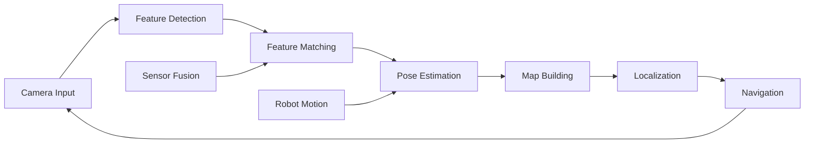
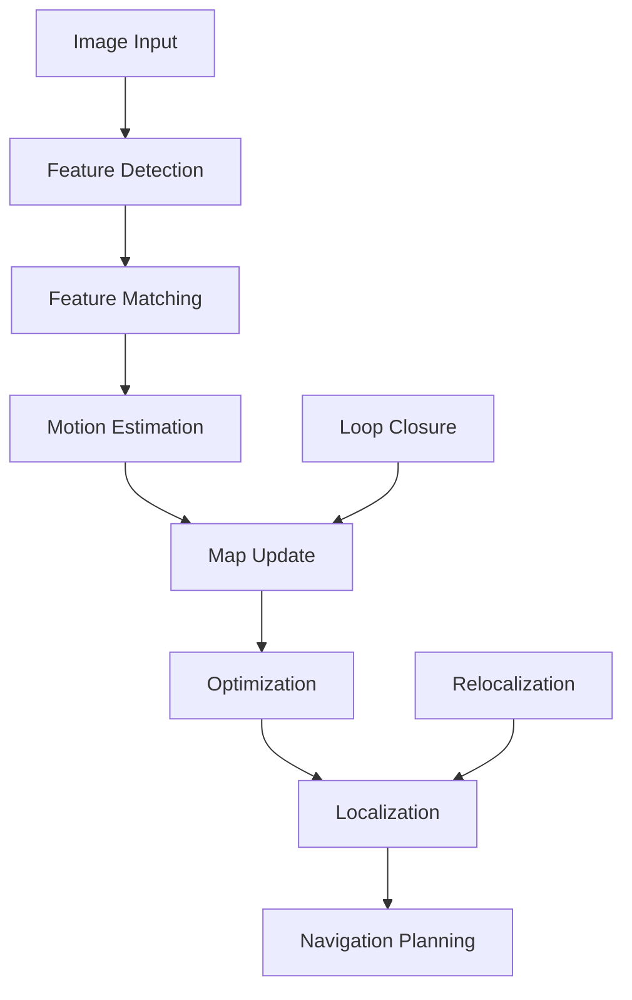

# Introduction to Visual SLAM

Welcome to Module 3: The AI Robot Brain. In this module, you'll learn about **Visual Simultaneous Localization and Mapping (SLAM)** - the technology that enables robots to understand their environment and navigate autonomously. Visual SLAM combines computer vision and robotics to build maps of unknown environments while simultaneously determining the robot's location within them.

## What is Visual SLAM?

**Visual SLAM** (Simultaneous Localization and Mapping) is a fundamental capability for autonomous robots that allows them to:

- **Map** unknown environments using visual sensors
- **Localize** themselves within these maps
- **Navigate** through complex spaces
- **Understand** their surroundings in real-time



## Why Visual SLAM Matters

Visual SLAM addresses critical challenges in robotics:

| Challenge | Visual SLAM Solution |
|-----------|---------------------|
| **Unknown Environments** | Build maps in real-time from visual input |
| **Self-Localization** | Determine position without GPS or beacons |
| **Navigation** | Plan paths through unknown spaces |
| **Dynamic Worlds** | Adapt to changing environments |
| **Cost-Effective** | Use standard cameras instead of expensive sensors |
| **Robustness** | Work in various lighting and environmental conditions |

## Visual SLAM Approaches

### Feature-Based SLAM
- **Detects** distinctive features in images
- **Tracks** features across frames
- **Estimates** camera motion from feature correspondences
- **Builds** sparse or semi-dense maps

### Direct SLAM
- **Uses** pixel intensities directly
- **Estimates** motion from image alignment
- **Builds** dense maps from photometric information
- **Requires** good lighting conditions

### Semantic SLAM
- **Integrates** object recognition with mapping
- **Creates** semantically meaningful maps
- **Improves** long-term mapping and relocalization
- **Enables** higher-level reasoning

## Core Concepts Preview

This week covers these fundamental concepts:

### Visual Feature Detection
- **Keypoints**: Distinctive points in images
- **Descriptors**: Feature representations
- **Matching**: Finding correspondences between frames
- **Tracking**: Following features over time

### Pose Estimation
- **Camera Motion**: Estimating 6-DOF poses
- **Bundle Adjustment**: Optimizing camera and point positions
- **Visual Odometry**: Tracking motion over time
- **Loop Closure**: Recognizing visited locations

### Map Representation
- **Sparse Maps**: Point clouds with feature locations
- **Dense Maps**: Volumetric or surfel representations
- **Hybrid Maps**: Combining multiple representations
- **Semantic Maps**: Including object and semantic information

### Optimization
- **Graph SLAM**: Formulating as graph optimization
- **Bundle Adjustment**: Joint optimization of poses and points
- **Real-time Constraints**: Balancing accuracy and speed
- **Robust Estimation**: Handling outliers and noise

## Visual SLAM Pipeline

The typical Visual SLAM pipeline includes:



## Setting Up Visual SLAM

Before proceeding, ensure your development environment includes:

```bash
# Check for required dependencies
ros2 pkg list | grep -E "(vision|camera|image)"

# Verify OpenCV installation
python3 -c "import cv2; print(cv2.__version__)"

# Check camera drivers
ros2 run camera_calibration cameracalibrator --size 8x6 --square 0.108
```

## Visual SLAM in ROS 2

ROS 2 provides several Visual SLAM solutions:

- **ORB-SLAM2/3**: Feature-based SLAM with loop closure
- **LSD-SLAM**: Direct monocular SLAM
- **SVO**: Semi-direct visual odometry
- **OpenVSLAM**: Open-source visual SLAM framework
- **RTAB-Map**: RGB-D SLAM with loop closure

## Module Learning Objectives

By the end of this week, you will be able to:

1. **Understand** the mathematical foundations of Visual SLAM
2. **Implement** basic visual feature detection and matching
3. **Evaluate** different Visual SLAM approaches and trade-offs
4. **Deploy** Visual SLAM systems in real-world environments
5. **Optimize** Visual SLAM performance for specific applications
6. **Troubleshoot** common Visual SLAM issues
7. **Integrate** Visual SLAM with navigation systems

## Prerequisites

- Basic computer vision knowledge (features, matching, homography)
- Understanding of 3D geometry and camera models
- ROS 2 fundamentals (topics, TF, sensors)
- Completed Module 1-2 of this curriculum
- Basic Python and C++ programming skills

## Visual SLAM Best Practices

### 1. Camera Calibration
- **Intrinsic Parameters**: Properly calibrate focal length and distortion
- **Extrinsic Parameters**: Accurate camera mounting position
- **Multi-camera Systems**: Synchronize and calibrate multiple cameras

### 2. Feature Selection
- **Distinctive Features**: Choose features that are trackable
- **Distribution**: Ensure features are well-distributed in image
- **Scale Invariance**: Handle different viewing scales

### 3. Computational Efficiency
- **Real-time Processing**: Optimize for target frame rates
- **Memory Management**: Efficient data structures for maps
- **Multi-threading**: Parallel processing where possible

### 4. Robustness
- **Lighting Conditions**: Handle varying illumination
- **Motion Blur**: Robust to camera motion
- **Dynamic Objects**: Filter out moving elements

## Next Steps

Continue to [Visual Feature Detection](./visual-features) to learn about detecting and describing visual features for SLAM.

## Resources

- [Visual SLAM Survey Papers](https://arxiv.org/abs/1606.05830)
- [OpenVSLAM Documentation](https://openvslam.readthedocs.io/)
- [ORB-SLAM GitHub](https://github.com/raulmur/ORB-SLAM3)
- [Computer Vision Resources](https://www.cs.ubc.ca/~lowe/keypoints/)
- [ROS 2 Vision Tutorials](http://wiki.ros.org/image_pipeline)