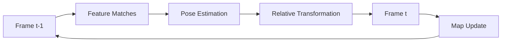

# Pose Estimation and Camera Motion

In Visual SLAM, pose estimation is the process of determining the camera's position and orientation (6-DOF pose) from visual features across frames. This section covers the mathematical foundations and practical implementation of camera motion estimation from visual observations.

## Understanding Camera Pose Estimation

Camera pose estimation determines the transformation between camera coordinate systems at different time steps. The pose consists of:
- **Position**: 3D translation (x, y, z)
- **Orientation**: 3D rotation (roll, pitch, yaw or quaternion)



## Camera Models and Coordinate Systems

### Pinhole Camera Model

The pinhole camera model projects 3D points to 2D image coordinates:

```
[u]   [fx  0  cx 0] [X]
[v] = [0  fy  cy 0] [Y]
[1]   [0   0   1 0] [Z]
                      [1]
```

Where:
- (u, v) are image coordinates
- (X, Y, Z) are 3D world coordinates
- fx, fy are focal lengths
- cx, cy are principal point coordinates

### Coordinate Systems

```python
#!/usr/bin/env python3
"""
Camera coordinate system transformations
"""
import numpy as np
import rclpy
from rclpy.node import Node
from geometry_msgs.msg import TransformStamped, PoseStamped
from sensor_msgs.msg import CameraInfo
from tf2_ros import TransformBroadcaster
import tf_transformations

class CameraPoseEstimator(Node):
    def __init__(self):
        super().__init__('camera_pose_estimator')

        # Create subscribers
        self.camera_info_sub = self.create_subscription(
            CameraInfo, '/camera/camera_info', self.camera_info_callback, 10)

        # Create TF broadcaster
        self.tf_broadcaster = TransformBroadcaster(self)

        # Initialize camera parameters
        self.camera_matrix = None
        self.distortion_coeffs = None

        # Store previous pose
        self.prev_pose = np.eye(4)  # Identity transformation

        self.get_logger().info('Camera pose estimator started')

    def camera_info_callback(self, msg):
        """Handle camera info messages"""
        self.camera_matrix = np.array(msg.k).reshape(3, 3)
        self.distortion_coeffs = np.array(msg.d)

        self.get_logger().info(f'Camera matrix: {self.camera_matrix}')

    def compute_camera_matrix(self, width, height, fov_x, fov_y):
        """Compute camera intrinsic matrix"""
        fx = (width / 2) / np.tan(np.radians(fov_x / 2))
        fy = (height / 2) / np.tan(np.radians(fov_y / 2))
        cx = width / 2
        cy = height / 2

        K = np.array([
            [fx, 0, cx],
            [0, fy, cy],
            [0, 0, 1]
        ])

        return K

    def transform_3d_to_2d(self, points_3d, R, t, K):
        """Project 3D points to 2D image coordinates"""
        # Transform points to camera coordinate system
        points_cam = R @ points_3d + t.reshape(-1, 1)

        # Project to image plane
        points_2d = K @ points_cam
        points_2d = points_2d[:2, :] / points_2d[2, :]

        return points_2d

    def transform_2d_to_3d(self, points_2d, depth, K):
        """Back-project 2D points to 3D using depth"""
        points_2d_h = np.vstack([points_2d, np.ones((1, points_2d.shape[1]))])
        K_inv = np.linalg.inv(K)
        points_3d_norm = K_inv @ points_2d_h
        points_3d = points_3d_norm * depth
        return points_3d

def main(args=None):
    rclpy.init(args=args)
    node = CameraPoseEstimator()

    try:
        rclpy.spin(node)
    except KeyboardInterrupt:
        pass
    finally:
        node.destroy_node()
        rclpy.shutdown()

if __name__ == '__main__':
    main()
```

## Essential Matrix and Fundamental Matrix

### Essential Matrix

The essential matrix relates corresponding points between two views when camera intrinsics are known:

```python
def compute_essential_matrix(R, t):
    """Compute essential matrix from rotation and translation"""
    # Create skew-symmetric matrix from translation
    t_skew = np.array([
        [0, -t[2], t[1]],
        [t[2], 0, -t[0]],
        [-t[1], t[0], 0]
    ])

    # Essential matrix: E = [t]_x * R
    E = t_skew @ R
    return E

def essential_matrix_decomposition(E):
    """Decompose essential matrix into rotation and translation"""
    U, S, Vt = np.linalg.svd(E)

    # Ensure rotation matrix has determinant +1
    if np.linalg.det(U @ Vt) < 0:
        Vt = -Vt

    # Possible rotation matrices
    W = np.array([[0, -1, 0],
                  [1, 0, 0],
                  [0, 0, 1]], dtype=float)

    R1 = U @ W @ Vt
    R2 = U @ W.T @ Vt

    # Translation vector (normalized)
    t = U[:, 2]

    return [R1, R2], [t, -t]
```

### Fundamental Matrix

The fundamental matrix relates corresponding points when camera intrinsics are unknown:

```python
def compute_fundamental_matrix(points1, points2):
    """Compute fundamental matrix from point correspondences"""
    # Normalize points for numerical stability
    points1_norm, T1 = normalize_points(points1)
    points2_norm, T2 = normalize_points(points2)

    # Create constraint matrix
    A = []
    for i in range(len(points1_norm)):
        x1, y1 = points1_norm[i]
        x2, y2 = points2_norm[i]

        A.append([x2*x1, x2*y1, x2, y2*x1, y2*y1, y2, x1, y1, 1])

    A = np.array(A)

    # Solve for fundamental matrix using SVD
    U, S, Vt = np.linalg.svd(A)
    F = Vt[-1].reshape(3, 3)

    # Enforce rank 2 constraint
    U, S, Vt = np.linalg.svd(F)
    S[2] = 0  # Set smallest singular value to 0
    F = U @ np.diag(S) @ Vt

    # Denormalize
    F = T2.T @ F @ T1

    return F / F[2, 2]  # Normalize

def normalize_points(points):
    """Normalize points for numerical stability"""
    centroid = np.mean(points, axis=0)
    std_dev = np.std(points)

    scale = np.sqrt(2) / std_dev
    T = np.array([
        [scale, 0, -scale * centroid[0]],
        [0, scale, -scale * centroid[1]],
        [0, 0, 1]
    ])

    points_norm = np.column_stack([
        points[:, 0], points[:, 1], np.ones(len(points))
    ])
    points_norm = (T @ points_norm.T).T
    points_norm = points_norm[:, :2]  # Remove homogeneous coordinate

    return points_norm, T
```

## Pose Estimation Algorithms

### 5-Point Algorithm

For calibrated cameras, the 5-point algorithm estimates relative pose:

```python
#!/usr/bin/env python3
"""
5-Point Algorithm for Relative Pose Estimation
"""
import numpy as np
import cv2
import rclpy
from rclpy.node import Node
from sensor_msgs.msg import Image
from cv_bridge import CvBridge

class FivePointPoseEstimator(Node):
    def __init__(self):
        super().__init__('five_point_pose_estimator')

        # Create subscribers for stereo images
        self.image_sub = self.create_subscription(
            Image, '/camera/image_raw', self.image_callback, 10)

        # Initialize CV bridge
        self.bridge = CvBridge()

        # Store previous frame data
        self.prev_keypoints = None
        self.prev_descriptors = None
        self.prev_image = None

        # ORB detector
        self.orb = cv2.ORB_create(nfeatures=1000)
        self.bf = cv2.BFMatcher(cv2.NORM_HAMMING, crossCheck=False)

        # Camera intrinsic matrix (example values)
        self.camera_matrix = np.array([
            [640, 0, 320],
            [0, 640, 240],
            [0, 0, 1]
        ], dtype=np.float32)

        self.get_logger().info('5-point pose estimator started')

    def image_callback(self, msg):
        """Process incoming camera image"""
        try:
            cv_image = self.bridge.imgmsg_to_cv2(msg, 'bgr8')
            gray = cv2.cvtColor(cv_image, cv2.COLOR_BGR2GRAY)

            # Detect features
            keypoints, descriptors = self.orb.detectAndCompute(gray, None)

            if self.prev_descriptors is not None and descriptors is not None:
                # Match features
                matches = self.bf.knnMatch(self.prev_descriptors, descriptors, k=2)

                # Apply Lowe's ratio test
                good_matches = []
                for match_pair in matches:
                    if len(match_pair) == 2:
                        m, n = match_pair
                        if m.distance < 0.7 * n.distance:
                            good_matches.append(m)

                # Need at least 5 matches for 5-point algorithm
                if len(good_matches) >= 5:
                    # Extract matched points
                    prev_points = np.float32([self.prev_keypoints[m.queryIdx].pt for m in good_matches]).reshape(-1, 1, 2)
                    curr_points = np.float32([keypoints[m.trainIdx].pt for m in good_matches]).reshape(-1, 1, 2)

                    # Compute essential matrix
                    E, mask = cv2.findEssentialMat(
                        curr_points, prev_points, self.camera_matrix,
                        method=cv2.RANSAC, threshold=1.0, prob=0.999
                    )

                    if E is not None:
                        # Recover pose
                        points, R, t, mask_pose = cv2.recoverPose(
                            E, curr_points, prev_points, self.camera_matrix, mask=mask
                        )

                        # Log pose information
                        self.get_logger().info(
                            f'Recovered pose - R: {R.shape}, t: {t.ravel()}'
                        )

            # Store current data for next iteration
            self.prev_keypoints = keypoints
            self.prev_descriptors = descriptors
            self.prev_image = gray.copy()

        except Exception as e:
            self.get_logger().error(f'Error processing image: {e}')

def main(args=None):
    rclpy.init(args=args)
    node = FivePointPoseEstimator()

    try:
        rclpy.spin(node)
    except KeyboardInterrupt:
        pass
    finally:
        node.destroy_node()
        rclpy.shutdown()

if __name__ == '__main__':
    main()
```

### PnP (Perspective-n-Point) Algorithm

For pose estimation with known 3D-2D correspondences:

```python
#!/usr/bin/env python3
"""
PnP Pose Estimation
"""
import numpy as np
import cv2
import rclpy
from rclpy.node import Node
from sensor_msgs.msg import Image
from cv_bridge import CvBridge

class PnPPoseEstimator(Node):
    def __init__(self):
        super().__init__('pnp_pose_estimator')

        # Create subscriber for camera images
        self.image_sub = self.create_subscription(
            Image, '/camera/image_raw', self.image_callback, 10)

        # Initialize CV bridge
        self.bridge = CvBridge()

        # ORB detector
        self.orb = cv2.ORB_create(nfeatures=500)

        # Camera intrinsic matrix (example values)
        self.camera_matrix = np.array([
            [640, 0, 320],
            [0, 640, 240],
            [0, 0, 1]
        ], dtype=np.float32)

        # Distortion coefficients (assuming no distortion)
        self.dist_coeffs = np.zeros((4, 1))

        # Simulated 3D points (in object coordinate system)
        self.object_points = np.array([
            [0, 0, 0],        # Origin
            [1, 0, 0],        # X-axis
            [0, 1, 0],        # Y-axis
            [0, 0, 1]         # Z-axis
        ], dtype=np.float32)

        self.get_logger().info('PnP pose estimator started')

    def image_callback(self, msg):
        """Process incoming camera image"""
        try:
            cv_image = self.bridge.imgmsg_to_cv2(msg, 'bgr8')
            gray = cv2.cvtColor(cv_image, cv2.COLOR_BGR2GRAY)

            # Detect features
            keypoints, descriptors = self.orb.detectAndCompute(gray, None)

            if keypoints is not None and len(keypoints) >= 4:
                # For demonstration, we'll use the first 4 keypoints as 2D points
                image_points = np.float32([kp.pt for kp in keypoints[:4]]).reshape(-1, 1, 2)

                if len(image_points) >= 4:
                    # Solve PnP
                    success, rvec, tvec = cv2.solvePnP(
                        self.object_points,
                        image_points,
                        self.camera_matrix,
                        self.dist_coeffs
                    )

                    if success:
                        # Convert rotation vector to rotation matrix
                        R, _ = cv2.Rodrigues(rvec)

                        # Create transformation matrix
                        T = np.eye(4)
                        T[:3, :3] = R
                        T[:3, 3] = tvec.ravel()

                        # Log pose information
                        self.get_logger().info(
                            f'PnP Pose - Translation: {tvec.ravel()}, '
                            f'Rotation: {np.degrees(rvec.ravel())}'
                        )

                        # Draw coordinate axes
                        self.draw_axes(cv_image, T)

        except Exception as e:
            self.get_logger().error(f'Error processing image: {e}')

    def draw_axes(self, image, T):
        """Draw coordinate axes on image"""
        # Define 3D points for coordinate axes
        axis_points = np.float32([
            [0, 0, 0],  # Origin
            [1, 0, 0],  # X-axis
            [0, 1, 0],  # Y-axis
            [0, 0, 1]   # Z-axis
        ]).T

        # Transform to camera coordinates
        R = T[:3, :3]
        t = T[:3, 3]
        camera_points = R @ axis_points + t.reshape(-1, 1)

        # Project to image coordinates
        image_points = self.camera_matrix @ camera_points
        image_points = image_points[:2, :] / image_points[2, :]
        image_points = image_points.T.astype(int)

        # Draw axes
        colors = [(0, 0, 255), (0, 255, 0), (255, 0, 0)]  # BGR: Red, Green, Blue
        for i in range(1, 4):  # Skip origin
            cv2.line(image, tuple(image_points[0]), tuple(image_points[i]), colors[i-1], 3)

def main(args=None):
    rclpy.init(args=args)
    node = PnPPoseEstimator()

    try:
        rclpy.spin(node)
    except KeyboardInterrupt:
        pass
    finally:
        node.destroy_node()
        rclpy.shutdown()

if __name__ == '__main__':
    main()
```

## Visual Odometry

Visual odometry estimates camera motion by tracking features between consecutive frames:

```python
#!/usr/bin/env python3
"""
Visual Odometry Implementation
"""
import numpy as np
import cv2
import rclpy
from rclpy.node import Node
from sensor_msgs.msg import Image
from geometry_msgs.msg import PoseStamped, TwistStamped
from cv_bridge import CvBridge
from tf2_ros import TransformBroadcaster
import tf_transformations

class VisualOdometry(Node):
    def __init__(self):
        super().__init__('visual_odometry')

        # Create subscribers
        self.image_sub = self.create_subscription(
            Image, '/camera/image_raw', self.image_callback, 10)

        # Create publishers
        self.pose_pub = self.create_publisher(PoseStamped, '/vo/pose', 10)
        self.twist_pub = self.create_publisher(TwistStamped, '/vo/twist', 10)

        # Initialize CV bridge
        self.bridge = CvBridge()

        # Initialize TF broadcaster
        self.tf_broadcaster = TransformBroadcaster(self)

        # ORB detector
        self.orb = cv2.ORB_create(nfeatures=1000)
        self.bf = cv2.BFMatcher(cv2.NORM_HAMMING, crossCheck=False)

        # Camera intrinsic matrix (example values)
        self.camera_matrix = np.array([
            [640, 0, 320],
            [0, 640, 240],
            [0, 0, 1]
        ], dtype=np.float32)

        # Store previous frame data
        self.prev_keypoints = None
        self.prev_descriptors = None
        self.prev_gray = None

        # Accumulated transformation
        self.current_T = np.eye(4)

        # Previous timestamp for velocity calculation
        self.prev_time = None

        self.get_logger().info('Visual odometry started')

    def image_callback(self, msg):
        """Process incoming camera image"""
        try:
            cv_image = self.bridge.imgmsg_to_cv2(msg, 'bgr8')
            gray = cv2.cvtColor(cv_image, cv2.COLOR_BGR2GRAY)

            # Detect features
            keypoints, descriptors = self.orb.detectAndCompute(gray, None)

            if self.prev_descriptors is not None and descriptors is not None:
                # Match features
                matches = self.bf.knnMatch(self.prev_descriptors, descriptors, k=2)

                # Apply Lowe's ratio test
                good_matches = []
                for match_pair in matches:
                    if len(match_pair) == 2:
                        m, n = match_pair
                        if m.distance < 0.7 * n.distance:
                            good_matches.append(m)

                # Need enough matches for pose estimation
                if len(good_matches) >= 10:
                    # Extract matched points
                    prev_points = np.float32([self.prev_keypoints[m.queryIdx].pt for m in good_matches]).reshape(-1, 1, 2)
                    curr_points = np.float32([keypoints[m.trainIdx].pt for m in good_matches]).reshape(-1, 1, 2)

                    # Compute essential matrix and recover pose
                    E, mask = cv2.findEssentialMat(
                        curr_points, prev_points, self.camera_matrix,
                        method=cv2.RANSAC, threshold=1.0, prob=0.999
                    )

                    if E is not None:
                        points, R, t, mask_pose = cv2.recoverPose(
                            E, curr_points, prev_points, self.camera_matrix, mask=mask
                        )

                        # Create transformation matrix
                        T_rel = np.eye(4)
                        T_rel[:3, :3] = R
                        T_rel[:3, 3] = t.ravel()

                        # Update accumulated transformation
                        self.current_T = self.current_T @ np.linalg.inv(T_rel)

                        # Publish pose
                        self.publish_pose(msg.header, self.current_T)

                        # Calculate and publish velocity
                        if self.prev_time is not None:
                            dt = (msg.header.stamp.sec + msg.header.stamp.nanosec * 1e-9) - \
                                 (self.prev_time.sec + self.prev_time.nanosec * 1e-9)
                            if dt > 0:
                                velocity = self.calculate_velocity(T_rel, dt)
                                self.publish_twist(msg.header, velocity)

                        self.prev_time = msg.header.stamp

            # Store current data for next iteration
            self.prev_keypoints = keypoints
            self.prev_descriptors = descriptors
            self.prev_gray = gray.copy()

        except Exception as e:
            self.get_logger().error(f'Error processing image: {e}')

    def calculate_velocity(self, T_rel, dt):
        """Calculate linear and angular velocity from transformation"""
        # Extract translation
        translation = T_rel[:3, 3]
        linear_velocity = translation / dt

        # Extract rotation
        R = T_rel[:3, :3]
        # Convert rotation matrix to axis-angle representation
        rvec, _ = cv2.Rodrigues(R)
        angular_velocity = rvec.ravel() / dt

        return linear_velocity, angular_velocity

    def publish_pose(self, header, T):
        """Publish estimated pose"""
        pose_msg = PoseStamped()
        pose_msg.header = header
        pose_msg.header.frame_id = 'map'

        # Extract position
        pose_msg.pose.position.x = T[0, 3]
        pose_msg.pose.position.y = T[1, 3]
        pose_msg.pose.position.z = T[2, 3]

        # Extract orientation (convert rotation matrix to quaternion)
        R = T[:3, :3]
        quat = tf_transformations.quaternion_from_matrix(
            np.block([[R, np.zeros((3, 1))], [np.zeros((1, 4))]])
        )
        pose_msg.pose.orientation.x = quat[0]
        pose_msg.pose.orientation.y = quat[1]
        pose_msg.pose.orientation.z = quat[2]
        pose_msg.pose.orientation.w = quat[3]

        self.pose_pub.publish(pose_msg)

        # Broadcast transform
        t = TransformStamped()
        t.header.stamp = header.stamp
        t.header.frame_id = 'map'
        t.child_frame_id = 'camera'
        t.transform.translation.x = T[0, 3]
        t.transform.translation.y = T[1, 3]
        t.transform.translation.z = T[2, 3]

        t.transform.rotation.x = quat[0]
        t.transform.rotation.y = quat[1]
        t.transform.rotation.z = quat[2]
        t.transform.rotation.w = quat[3]

        self.tf_broadcaster.sendTransform(t)

    def publish_twist(self, header, velocity):
        """Publish estimated twist (velocity)"""
        linear_vel, angular_vel = velocity

        twist_msg = TwistStamped()
        twist_msg.header = header
        twist_msg.twist.linear.x = linear_vel[0]
        twist_msg.twist.linear.y = linear_vel[1]
        twist_msg.twist.linear.z = linear_vel[2]
        twist_msg.twist.angular.x = angular_vel[0]
        twist_msg.twist.angular.y = angular_vel[1]
        twist_msg.twist.angular.z = angular_vel[2]

        self.twist_pub.publish(twist_msg)

def main(args=None):
    rclpy.init(args=args)
    node = VisualOdometry()

    try:
        rclpy.spin(node)
    except KeyboardInterrupt:
        pass
    finally:
        node.destroy_node()
        rclpy.shutdown()

if __name__ == '__main__':
    main()
```

## Bundle Adjustment

Bundle adjustment is a global optimization technique that refines camera poses and 3D point positions simultaneously:

```python
#!/usr/bin/env python3
"""
Bundle Adjustment Example (Conceptual - Real implementation would use Ceres or g2o)
"""
import numpy as np
from scipy.optimize import minimize
import rclpy
from rclpy.node import Node

class BundleAdjustmentNode(Node):
    def __init__(self):
        super().__init__('bundle_adjustment')

        # This is a simplified conceptual example
        # Real implementation would use specialized libraries like Ceres or g2o

        self.get_logger().info('Bundle adjustment node started')

    def bundle_adjustment(self, points_3d, camera_poses, points_2d, correspondences):
        """
        Bundle adjustment optimization function
        points_3d: initial 3D point positions
        camera_poses: initial camera poses [R, t] for each camera
        points_2d: observed 2D points in images
        correspondences: mapping of 3D points to 2D observations
        """
        # This is a simplified example - real implementation would be much more complex
        def reprojection_error(params):
            # Extract poses and 3D points from parameter vector
            n_cameras = len(camera_poses)
            n_points = len(points_3d)

            # Reshape parameters (simplified)
            # In reality, you'd separate rotation and translation
            pose_params = params[:n_cameras*6]  # 6 DOF per camera
            point_params = params[n_cameras*6:]  # 3D coordinates per point

            total_error = 0
            # Calculate reprojection error for all correspondences
            for corr in correspondences:
                point_3d_idx = corr['point_3d_idx']
                camera_idx = corr['camera_idx']
                observed_2d = corr['observed_2d']

                # Project 3D point to 2D using current camera pose
                # (simplified projection)
                R = self.axis_angle_to_rotation_matrix(pose_params[camera_idx*6:camera_idx*6+3])
                t = pose_params[camera_idx*6+3:camera_idx*6+6]
                point_3d = point_params[point_3d_idx*3:point_3d_idx*3+3]

                projected_2d = self.project_point(R, t, point_3d)
                error = np.linalg.norm(projected_2d - observed_2d)
                total_error += error**2

            return total_error

        # Initial parameters (flattened)
        initial_poses = np.hstack([self.pose_to_params(pose) for pose in camera_poses])
        initial_points = points_3d.flatten()
        initial_params = np.hstack([initial_poses, initial_points])

        # Optimize
        result = minimize(reprojection_error, initial_params, method='lm')

        # Extract optimized parameters
        optimized_params = result.x
        # ... reshape back to poses and points

        return result

    def pose_to_params(self, pose):
        """Convert pose matrix to parameter vector"""
        R = pose[:3, :3]
        t = pose[:3, 3]

        # Convert rotation matrix to axis-angle
        rvec, _ = cv2.Rodrigues(R)
        return np.hstack([rvec.ravel(), t])

    def axis_angle_to_rotation_matrix(self, axis_angle):
        """Convert axis-angle to rotation matrix"""
        rvec = axis_angle.reshape(3, 1)
        R, _ = cv2.Rodrigues(rvec)
        return R

    def project_point(self, R, t, point_3d):
        """Project 3D point to 2D (simplified)"""
        # Camera intrinsic matrix
        K = np.array([[640, 0, 320],
                      [0, 640, 240],
                      [0, 0, 1]])

        # Transform point to camera coordinates
        point_cam = R @ point_3d + t

        # Project to image plane
        point_img = K @ point_cam
        point_img = point_img[:2] / point_img[2]

        return point_img

def main(args=None):
    rclpy.init(args=args)
    node = BundleAdjustmentNode()

    # Example usage (conceptual)
    # In practice, you'd receive data from visual odometry or SLAM system
    points_3d = np.random.rand(100, 3)  # 100 random 3D points
    camera_poses = [np.eye(4) for _ in range(5)]  # 5 camera poses
    points_2d = np.random.rand(100, 2)  # 2D observations

    # This would be called with real data
    # result = node.bundle_adjustment(points_3d, camera_poses, points_2d, [])

    try:
        rclpy.spin(node)
    except KeyboardInterrupt:
        pass
    finally:
        node.destroy_node()
        rclpy.shutdown()

if __name__ == '__main__':
    main()
```

## Robust Estimation

### RANSAC for Outlier Rejection

RANSAC (Random Sample Consensus) is crucial for robust pose estimation:

```python
def ransac_pose_estimation(points1, points2, camera_matrix, threshold=1.0, max_iterations=1000):
    """RANSAC-based pose estimation"""
    best_inliers = 0
    best_E = None
    best_R = None
    best_t = None

    for _ in range(max_iterations):
        # Randomly sample 5 points
        indices = np.random.choice(len(points1), size=5, replace=False)
        p1_sample = points1[indices]
        p2_sample = points2[indices]

        # Estimate essential matrix from sample
        E_sample = estimate_essential_matrix(p1_sample, p2_sample)

        if E_sample is not None:
            # Count inliers
            inliers = count_inliers(E_sample, points1, points2, camera_matrix, threshold)

            if len(inliers) > best_inliers:
                best_inliers = len(inliers)
                best_E = E_sample

                # Recover best pose
                _, R, t, _ = cv2.recoverPose(E_sample, points1[inliers], points2[inliers], camera_matrix)
                best_R = R
                best_t = t

    return best_E, best_R, best_t, np.arange(len(points1))[best_inliers > len(points1) * 0.1]

def estimate_essential_matrix(points1, points2):
    """Estimate essential matrix from 5 point correspondences"""
    # This would implement the 5-point algorithm
    # For brevity, we'll use OpenCV's implementation
    E, _ = cv2.findEssentialMat(points1, points2, np.eye(3), method=cv2.RANSAC, threshold=1.0)
    return E

def count_inliers(E, points1, points2, camera_matrix, threshold):
    """Count inliers based on reprojection error"""
    # Use the Sampson distance or other geometric error
    inliers = []

    for i in range(len(points1)):
        p1 = np.append(points1[i], 1)
        p2 = np.append(points2[i], 1)

        # Calculate geometric error
        error = calculate_geometric_error(E, p1, p2)

        if error < threshold:
            inliers.append(i)

    return np.array(inliers)

def calculate_geometric_error(E, p1, p2):
    """Calculate geometric error using Sampson approximation"""
    # Sampson distance for essential matrix
    F = camera_matrix.T @ E @ camera_matrix  # Fundamental matrix

    # Calculate Sampson distance
    x1 = p1
    x2 = p2

    l2 = F @ x1  # Line in second image
    l1 = F.T @ x2  # Line in first image

    # Sampson distance
    error = (x2.T @ F @ x1)**2 / (l1[0]**2 + l1[1]**2 + l2[0]**2 + l2[1]**2)
    return np.sqrt(error)
```

## Error Analysis and Optimization

### Covariance Estimation

Estimating uncertainty in pose estimates:

```python
def estimate_pose_covariance(R, t, points_3d, points_2d, camera_matrix):
    """Estimate covariance of pose estimates"""
    # Linearize the projection function
    # J_R = d(projection)/d(R)
    # J_t = d(projection)/d(t)

    # Jacobian computation (simplified)
    n_points = len(points_3d)

    # Compute reprojection errors
    projected_points = []
    for point_3d in points_3d:
        point_cam = R @ point_3d + t
        point_img = camera_matrix @ point_cam
        point_img = point_img[:2] / point_img[2]
        projected_points.append(point_img)

    projected_points = np.array(projected_points)
    errors = points_2d - projected_points

    # Estimate covariance based on reprojection errors
    # This is a simplified approach
    error_variance = np.var(errors)

    # Approximate covariance for rotation and translation
    R_cov = np.eye(3) * error_variance
    t_cov = np.eye(3) * error_variance

    return R_cov, t_cov
```

## Best Practices

### 1. Robust Feature Matching

```python
# Good: Robust feature matching with multiple verification steps
def robust_match(keypoints1, descriptors1, keypoints2, descriptors2):
    # Use multiple matching strategies
    # Apply geometric verification
    # Use RANSAC for outlier rejection
    pass

# Bad: Simple matching without verification
def simple_match(keypoints1, descriptors1, keypoints2, descriptors2):
    # No geometric verification
    # No outlier rejection
    # No quality assessment
    pass
```

### 2. Numerical Stability

```python
# Good: Numerically stable computations
def stable_computation():
    # Normalize points
    # Use SVD for matrix decomposition
    # Apply constraints properly
    pass

# Bad: Numerically unstable
def unstable_computation():
    # Direct matrix inversion
    # No normalization
    # No constraint enforcement
    pass
```

### 3. Computational Efficiency

```python
# Good: Efficient pose estimation
def efficient_pose_estimation():
    # Use appropriate algorithms for the situation
    # Limit feature count for real-time performance
    # Use multi-threading where possible
    pass

# Bad: Computationally expensive
def inefficient_pose_estimation():
    # Process all features
    # Use slow algorithms
    # No optimization
    pass
```

## Common Issues and Troubleshooting

### 1. Drift in Visual Odometry

```python
# Issue: Accumulated pose error over time
# Solution: Implement loop closure or use global optimization
def prevent_drift():
    # Use bundle adjustment
    # Implement place recognition
    # Use sensor fusion
    pass
```

### 2. Degenerate Cases

```python
# Issue: Planar scenes or insufficient features
# Solution: Detect and handle degenerate cases
def handle_degenerate_cases():
    # Check for planar motion
    # Verify sufficient parallax
    # Use alternative sensors if needed
    pass
```

### 3. Scale Ambiguity

```python
# Issue: Monocular SLAM scale ambiguity
# Solution: Use additional sensors or known objects
def handle_scale_ambiguity():
    # Use stereo cameras
    # Use IMU data
    # Use known object sizes
    pass
```

## Next Steps

Now that you understand pose estimation and camera motion, continue to [Exercise: Visual Odometry System](../week-07/exercise-visual-odometry) to build a complete visual odometry system.

## Exercises

1. Implement a visual odometry system that tracks camera motion
2. Create a pose estimation pipeline with RANSAC outlier rejection
3. Build a system that handles degenerate cases in pose estimation
4. Implement bundle adjustment for global optimization