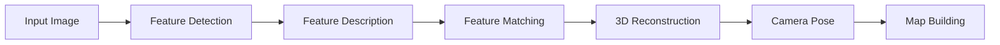

# Visual Feature Detection and Matching

Visual features are the foundation of feature-based Visual SLAM systems. In this section, you'll learn about detecting, describing, and matching visual features that enable robots to understand their environment and track their motion.

## Understanding Visual Features

Visual features are distinctive points in images that can be reliably detected and matched across different views. A good visual feature should be:

- **Repeatable**: Detected in the same location across different images
- **Distinctive**: Uniquely identifiable among other features
- **Localizable**: Precisely located in the image
- **Robust**: Invariant to changes in lighting, viewpoint, and noise



## Feature Detection

### Corner Detection

Corners are among the most stable and distinctive features. The Harris corner detector is a classical approach:

```python
#!/usr/bin/env python3
"""
Harris Corner Detection Example
"""
import cv2
import numpy as np
import rclpy
from rclpy.node import Node
from sensor_msgs.msg import Image
from cv_bridge import CvBridge
from visualization_msgs.msg import MarkerArray, Marker
from geometry_msgs.msg import Point

class HarrisCornerDetector(Node):
    def __init__(self):
        super().__init__('harris_corner_detector')

        # Create subscriber for camera images
        self.image_sub = self.create_subscription(
            Image, '/camera/image_raw', self.image_callback, 10)

        # Create publisher for feature markers
        self.marker_pub = self.create_publisher(MarkerArray, '/feature_markers', 10)

        # Initialize CV bridge
        self.bridge = CvBridge()

        self.get_logger().info('Harris corner detector started')

    def image_callback(self, msg):
        """Process incoming camera image"""
        try:
            # Convert ROS image to OpenCV
            cv_image = self.bridge.imgmsg_to_cv2(msg, 'bgr8')

            # Convert to grayscale
            gray = cv2.cvtColor(cv_image, cv2.COLOR_BGR2GRAY)
            gray = np.float32(gray)

            # Apply Harris corner detection
            dst = cv2.cornerHarris(gray, blockSize=2, ksize=3, k=0.04)

            # Dilate to mark corners more clearly
            dst = cv2.dilate(dst, None)

            # Threshold for an optimal value
            threshold = 0.01 * dst.max()
            corners = np.where(dst > threshold)

            # Create visualization markers
            marker_array = self.create_feature_markers(corners, msg.header)

            # Draw corners on image (optional)
            cv_image[dst > threshold] = [0, 0, 255]  # Red corners

            # Publish markers
            self.marker_pub.publish(marker_array)

        except Exception as e:
            self.get_logger().error(f'Error processing image: {e}')

    def create_feature_markers(self, corners, header):
        """Create visualization markers for detected corners"""
        marker_array = MarkerArray()

        for i, (y, x) in enumerate(zip(corners[0], corners[1])):
            marker = Marker()
            marker.header = header
            marker.ns = "features"
            marker.id = i
            marker.type = Marker.SPHERE
            marker.action = Marker.ADD

            # Position (just for visualization)
            marker.pose.position.x = x * 0.001  # Scale to reasonable units
            marker.pose.position.y = y * 0.001
            marker.pose.position.z = 0.0
            marker.pose.orientation.w = 1.0

            # Scale
            marker.scale.x = 0.01
            marker.scale.y = 0.01
            marker.scale.z = 0.01

            # Color (red)
            marker.color.r = 1.0
            marker.color.g = 0.0
            marker.color.b = 0.0
            marker.color.a = 1.0

            marker_array.markers.append(marker)

        return marker_array

def main(args=None):
    rclpy.init(args=args)
    node = HarrisCornerDetector()

    try:
        rclpy.spin(node)
    except KeyboardInterrupt:
        pass
    finally:
        node.destroy_node()
        rclpy.shutdown()

if __name__ == '__main__':
    main()
```

### FAST Feature Detection

The FAST (Features from Accelerated Segment Test) detector is computationally efficient:

```python
#!/usr/bin/env python3
"""
FAST Feature Detection Example
"""
import cv2
import numpy as np
import rclpy
from rclpy.node import Node
from sensor_msgs.msg import Image
from cv_bridge import CvBridge

class FASTFeatureDetector(Node):
    def __init__(self):
        super().__init__('fast_feature_detector')

        # Create subscriber for camera images
        self.image_sub = self.create_subscription(
            Image, '/camera/image_raw', self.image_callback, 10)

        # Initialize CV bridge
        self.bridge = CvBridge()

        # Create FAST detector
        self.fast = cv2.FastFeatureDetector_create()

        # Set parameters
        self.fast.setThreshold(50)
        self.fast.setNonmaxSuppression(True)

        self.get_logger().info('FAST feature detector started')

    def image_callback(self, msg):
        """Process incoming camera image"""
        try:
            # Convert ROS image to OpenCV
            cv_image = self.bridge.imgmsg_to_cv2(msg, 'bgr8')

            # Convert to grayscale
            gray = cv2.cvtColor(cv_image, cv2.COLOR_BGR2GRAY)

            # Detect FAST features
            keypoints = self.fast.detect(gray, None)

            # Draw keypoints on image
            img_with_keypoints = cv2.drawKeypoints(
                cv_image, keypoints, None, color=(0, 255, 0), flags=0)

            # Log feature count
            self.get_logger().info(f'Detected {len(keypoints)} FAST features')

        except Exception as e:
            self.get_logger().error(f'Error processing image: {e}')

def main(args=None):
    rclpy.init(args=args)
    node = FASTFeatureDetector()

    try:
        rclpy.spin(node)
    except KeyboardInterrupt:
        pass
    finally:
        node.destroy_node()
        rclpy.shutdown()

if __name__ == '__main__':
    main()
```

### ORB Feature Detection

ORB (Oriented FAST and Rotated BRIEF) combines FAST detection with BRIEF descriptors:

```python
#!/usr/bin/env python3
"""
ORB Feature Detection Example
"""
import cv2
import numpy as np
import rclpy
from rclpy.node import Node
from sensor_msgs.msg import Image
from cv_bridge import CvBridge

class ORBFeatureDetector(Node):
    def __init__(self):
        super().__init__('orb_feature_detector')

        # Create subscriber for camera images
        self.image_sub = self.create_subscription(
            Image, '/camera/image_raw', self.image_callback, 10)

        # Initialize CV bridge
        self.bridge = CvBridge()

        # Create ORB detector
        self.orb = cv2.ORB_create(
            nfeatures=1000,      # Number of features to detect
            scaleFactor=1.2,     # Pyramid decimation ratio
            nlevels=8,           # Number of pyramid levels
            edgeThreshold=31,    # Size of border where features are not detected
            patchSize=31,        # Size of patch for computing orientation
            fastThreshold=20     # Threshold for FAST keypoint detector
        )

        self.get_logger().info('ORB feature detector started')

    def image_callback(self, msg):
        """Process incoming camera image"""
        try:
            # Convert ROS image to OpenCV
            cv_image = self.bridge.imgmsg_to_cv2(msg, 'bgr8')

            # Convert to grayscale
            gray = cv2.cvtColor(cv_image, cv2.COLOR_BGR2GRAY)

            # Detect ORB features
            keypoints, descriptors = self.orb.detectAndCompute(gray, None)

            # Draw keypoints on image
            img_with_keypoints = cv2.drawKeypoints(
                cv_image, keypoints, None, color=(0, 255, 0), flags=0)

            # Log feature count
            if descriptors is not None:
                self.get_logger().info(f'Detected {len(keypoints)} ORB features')
            else:
                self.get_logger().info('No features detected')

        except Exception as e:
            self.get_logger().error(f'Error processing image: {e}')

def main(args=None):
    rclpy.init(args=args)
    node = ORBFeatureDetector()

    try:
        rclpy.spin(node)
    except KeyboardInterrupt:
        pass
    finally:
        node.destroy_node()
        rclpy.shutdown()

if __name__ == '__main__':
    main()
```

## Feature Description

### BRIEF Descriptor

BRIEF (Binary Robust Independent Elementary Features) creates binary descriptors:

```python
#!/usr/bin/env python3
"""
BRIEF Descriptor Example
"""
import cv2
import numpy as np
import rclpy
from rclpy.node import Node
from sensor_msgs.msg import Image
from cv_bridge import CvBridge

class BRIEFDescriptor(Node):
    def __init__(self):
        super().__init__('brief_descriptor')

        # Create subscriber for camera images
        self.image_sub = self.create_subscription(
            Image, '/camera/image_raw', self.image_callback, 10)

        # Initialize CV bridge
        self.bridge = CvBridge()

        # Create detectors and descriptors
        self.fast = cv2.FastFeatureDetector_create()
        self.brief = cv2.xfeatures2d.BriefDescriptorExtractor_create()

        self.get_logger().info('BRIEF descriptor started')

    def image_callback(self, msg):
        """Process incoming camera image"""
        try:
            # Convert ROS image to OpenCV
            cv_image = self.bridge.imgmsg_to_cv2(msg, 'bgr8')

            # Convert to grayscale
            gray = cv2.cvtColor(cv_image, cv2.COLOR_BGR2GRAY)

            # Detect keypoints
            keypoints = self.fast.detect(gray, None)

            # Limit number of keypoints for efficiency
            if len(keypoints) > 100:
                keypoints = keypoints[:100]

            # Compute BRIEF descriptors
            if keypoints:
                keypoints, descriptors = self.brief.compute(gray, keypoints)

                # Log descriptor information
                if descriptors is not None:
                    self.get_logger().info(f'Computed {len(keypoints)} BRIEF descriptors')
                    self.get_logger().info(f'Descriptor shape: {descriptors.shape}')

        except Exception as e:
            self.get_logger().error(f'Error processing image: {e}')

def main(args=None):
    rclpy.init(args=args)
    node = BRIEFDescriptor()

    try:
        rclpy.spin(node)
    except KeyboardInterrupt:
        pass
    finally:
        node.destroy_node()
        rclpy.shutdown()

if __name__ == '__main__':
    main()
```

### SIFT Descriptor

SIFT (Scale-Invariant Feature Transform) creates robust descriptors:

```python
#!/usr/bin/env python3
"""
SIFT Descriptor Example
"""
import cv2
import numpy as np
import rclpy
from rclpy.node import Node
from sensor_msgs.msg import Image
from cv_bridge import CvBridge

class SIFTDescriptor(Node):
    def __init__(self):
        super().__init__('sift_descriptor')

        # Create subscriber for camera images
        self.image_sub = self.create_subscription(
            Image, '/camera/image_raw', self.image_callback, 10)

        # Initialize CV bridge
        self.bridge = CvBridge()

        # Create SIFT detector and descriptor
        # Note: SIFT is patented and may not be available in all OpenCV builds
        try:
            self.sift = cv2.SIFT_create()
        except AttributeError:
            self.get_logger().error('SIFT not available in this OpenCV build')
            self.sift = None

        self.get_logger().info('SIFT descriptor started')

    def image_callback(self, msg):
        """Process incoming camera image"""
        if self.sift is None:
            return

        try:
            # Convert ROS image to OpenCV
            cv_image = self.bridge.imgmsg_to_cv2(msg, 'bgr8')

            # Convert to grayscale
            gray = cv2.cvtColor(cv_image, cv2.COLOR_BGR2GRAY)

            # Detect and compute SIFT features
            keypoints, descriptors = self.sift.detectAndCompute(gray, None)

            # Draw keypoints on image
            if keypoints:
                img_with_keypoints = cv2.drawKeypoints(
                    cv_image, keypoints, None, color=(0, 255, 0), flags=0)

                # Log descriptor information
                if descriptors is not None:
                    self.get_logger().info(f'Detected {len(keypoints)} SIFT features')
                    self.get_logger().info(f'Descriptor shape: {descriptors.shape}')

        except Exception as e:
            self.get_logger().error(f'Error processing image: {e}')

def main(args=None):
    rclpy.init(args=args)
    node = SIFTDescriptor()

    try:
        rclpy.spin(node)
    except KeyboardInterrupt:
        pass
    finally:
        node.destroy_node()
        rclpy.shutdown()

if __name__ == '__main__':
    main()
```

## Feature Matching

### Brute-Force Matching

Simple but effective for matching feature descriptors:

```python
#!/usr/bin/env python3
"""
Feature Matching Example
"""
import cv2
import numpy as np
import rclpy
from rclpy.node import Node
from sensor_msgs.msg import Image
from cv_bridge import CvBridge

class FeatureMatcher(Node):
    def __init__(self):
        super().__init__('feature_matcher')

        # Create subscribers for two camera images
        self.image_sub1 = self.create_subscription(
            Image, '/camera1/image_raw', self.image1_callback, 10)
        self.image_sub2 = self.create_subscription(
            Image, '/camera2/image_raw', self.image2_callback, 10)

        # Initialize CV bridge
        self.bridge = CvBridge()

        # Create ORB detector
        self.orb = cv2.ORB_create(nfeatures=500)

        # Brute force matcher
        self.bf = cv2.BFMatcher(cv2.NORM_HAMMING, crossCheck=True)

        # Store previous image features
        self.prev_keypoints = None
        self.prev_descriptors = None

        self.get_logger().info('Feature matcher started')

    def image1_callback(self, msg):
        """Process first camera image"""
        try:
            cv_image = self.bridge.imgmsg_to_cv2(msg, 'bgr8')
            gray = cv2.cvtColor(cv_image, cv2.COLOR_BGR2GRAY)

            # Detect features in current image
            keypoints, descriptors = self.orb.detectAndCompute(gray, None)

            # If we have previous features, match them
            if self.prev_descriptors is not None and descriptors is not None:
                matches = self.bf.match(self.prev_descriptors, descriptors)

                # Sort matches by distance
                matches = sorted(matches, key=lambda x: x.distance)

                # Draw matches
                img_matches = cv2.drawMatches(
                    cv2.cvtColor(self.prev_gray, cv2.COLOR_GRAY2BGR) if hasattr(self, 'prev_gray') else np.zeros_like(cv_image),
                    self.prev_keypoints,
                    cv_image,
                    keypoints,
                    matches[:50],  # Show top 50 matches
                    None,
                    flags=cv2.DrawMatchesFlags_NOT_DRAW_SINGLE_POINTS
                )

                # Log match statistics
                self.get_logger().info(f'Found {len(matches)} matches')

            # Store current features for next iteration
            self.prev_keypoints = keypoints
            self.prev_descriptors = descriptors
            self.prev_gray = gray

        except Exception as e:
            self.get_logger().error(f'Error processing image 1: {e}')

    def image2_callback(self, msg):
        """Process second camera image (placeholder)"""
        pass

def main(args=None):
    rclpy.init(args=args)
    node = FeatureMatcher()

    try:
        rclpy.spin(node)
    except KeyboardInterrupt:
        pass
    finally:
        node.destroy_node()
        rclpy.shutdown()

if __name__ == '__main__':
    main()
```

### FLANN Matching

Fast Library for Approximate Nearest Neighbors for efficient matching:

```python
#!/usr/bin/env python3
"""
FLANN Feature Matching Example
"""
import cv2
import numpy as np
import rclpy
from rclpy.node import Node
from sensor_msgs.msg import Image
from cv_bridge import CvBridge

class FLANNFeatureMatcher(Node):
    def __init__(self):
        super().__init__('flann_feature_matcher')

        # Create subscriber for camera images
        self.image_sub = self.create_subscription(
            Image, '/camera/image_raw', self.image_callback, 10)

        # Initialize CV bridge
        self.bridge = CvBridge()

        # Create ORB detector
        self.orb = cv2.ORB_create(nfeatures=1000)

        # FLANN matcher parameters
        FLANN_INDEX_LSH = 6
        index_params = dict(algorithm=FLANN_INDEX_LSH,
                           table_number=6,
                           key_size=12,
                           multi_probe_level=1)
        search_params = dict(checks=50)
        self.flann = cv2.FlannBasedMatcher(index_params, search_params)

        # Store reference features
        self.ref_keypoints = None
        self.ref_descriptors = None
        self.ref_image = None

        self.get_logger().info('FLANN feature matcher started')

    def image_callback(self, msg):
        """Process incoming camera image"""
        try:
            cv_image = self.bridge.imgmsg_to_cv2(msg, 'bgr8')
            gray = cv2.cvtColor(cv_image, cv2.COLOR_BGR2GRAY)

            # Detect features in current image
            keypoints, descriptors = self.orb.detectAndCompute(gray, None)

            if descriptors is not None:
                # If we have reference features, match them
                if self.ref_descriptors is not None:
                    # Match descriptors using FLANN
                    matches = self.flann.knnMatch(self.ref_descriptors, descriptors, k=2)

                    # Apply Lowe's ratio test
                    good_matches = []
                    for match_pair in matches:
                        if len(match_pair) == 2:
                            m, n = match_pair
                            if m.distance < 0.7 * n.distance:
                                good_matches.append(m)

                    # Draw matches
                    if self.ref_keypoints is not None and len(good_matches) > 10:
                        img_matches = cv2.drawMatches(
                            self.ref_image,
                            self.ref_keypoints,
                            cv_image,
                            keypoints,
                            good_matches,
                            None,
                            flags=cv2.DrawMatchesFlags_NOT_DRAW_SINGLE_POINTS
                        )

                        self.get_logger().info(f'Found {len(good_matches)} good matches')

                else:
                    # Store as reference for next iteration
                    self.ref_keypoints = keypoints
                    self.ref_descriptors = descriptors
                    self.ref_image = cv_image.copy()

        except Exception as e:
            self.get_logger().error(f'Error processing image: {e}')

def main(args=None):
    rclpy.init(args=args)
    node = FLANNFeatureMatcher()

    try:
        rclpy.spin(node)
    except KeyboardInterrupt:
        pass
    finally:
        node.destroy_node()
        rclpy.shutdown()

if __name__ == '__main__':
    main()
```

## Feature Tracking

### Lucas-Kanade Tracking

Efficient tracking of features across frames:

```python
#!/usr/bin/env python3
"""
Lucas-Kanade Feature Tracking Example
"""
import cv2
import numpy as np
import rclpy
from rclpy.node import Node
from sensor_msgs.msg import Image
from cv_bridge import CvBridge

class LucasKanadeTracker(Node):
    def __init__(self):
        super().__init__('lucas_kanade_tracker')

        # Create subscriber for camera images
        self.image_sub = self.create_subscription(
            Image, '/camera/image_raw', self.image_callback, 10)

        # Initialize CV bridge
        self.bridge = CvBridge()

        # Parameters for ShiTomasi corner detection
        self.feature_params = dict(maxCorners=100,
                                  qualityLevel=0.3,
                                  minDistance=7,
                                  blockSize=7)

        # Parameters for Lucas-Kanade optical flow
        self.lk_params = dict(winSize=(15, 15),
                             maxLevel=2,
                             criteria=(cv2.TERM_CRITERIA_EPS | cv2.TERM_CRITERIA_COUNT, 10, 0.03))

        # Create random colors for tracking visualization
        self.colors = np.random.randint(0, 255, (100, 3))

        # Store previous frame and features
        self.prev_gray = None
        self.prev_features = None

        self.get_logger().info('Lucas-Kanade tracker started')

    def image_callback(self, msg):
        """Process incoming camera image"""
        try:
            cv_image = self.bridge.imgmsg_to_cv2(msg, 'bgr8')
            gray = cv2.cvtColor(cv_image, cv2.COLOR_BGR2GRAY)

            # Initialize features if needed
            if self.prev_gray is None:
                # Detect initial features
                self.prev_features = cv2.goodFeaturesToTrack(
                    gray, mask=None, **self.feature_params)
                self.prev_gray = gray.copy()
                return

            # Calculate optical flow
            if self.prev_features is not None:
                new_features, status, error = cv2.calcOpticalFlowPyrLK(
                    self.prev_gray, gray, self.prev_features, None, **self.lk_params)

                # Select good points
                if new_features is not None:
                    good_new = new_features[status == 1]
                    good_old = self.prev_features[status == 1]

                    # Draw tracks
                    for i, (new, old) in enumerate(zip(good_new, good_old)):
                        a, b = new.ravel().astype(int)
                        c, d = old.ravel().astype(int)
                        cv_image = cv2.line(cv_image, (a, b), (c, d), self.colors[i].tolist(), 2)
                        cv_image = cv2.circle(cv_image, (a, b), 5, self.colors[i].tolist(), -1)

                    # Update features
                    self.prev_features = good_new.reshape(-1, 1, 2)
                    self.prev_gray = gray.copy()

                    # Log tracking information
                    self.get_logger().info(f'Tracking {len(good_new)} features')

                    # Re-detect features if too few remain
                    if len(good_new) < 10:
                        self.prev_features = cv2.goodFeaturesToTrack(
                            gray, mask=None, **self.feature_params)

        except Exception as e:
            self.get_logger().error(f'Error processing image: {e}')

def main(args=None):
    rclpy.init(args=args)
    node = LucasKanadeTracker()

    try:
        rclpy.spin(node)
    except KeyboardInterrupt:
        pass
    finally:
        node.destroy_node()
        rclpy.shutdown()

if __name__ == '__main__':
    main()
```

## Advanced Feature Techniques

### Multi-Scale Feature Detection

Detect features at multiple scales for robustness:

```python
#!/usr/bin/env python3
"""
Multi-Scale Feature Detection Example
"""
import cv2
import numpy as np
import rclpy
from rclpy.node import Node
from sensor_msgs.msg import Image
from cv_bridge import CvBridge

class MultiScaleFeatureDetector(Node):
    def __init__(self):
        super().__init__('multi_scale_feature_detector')

        # Create subscriber for camera images
        self.image_sub = self.create_subscription(
            Image, '/camera/image_raw', self.image_callback, 10)

        # Initialize CV bridge
        self.bridge = CvBridge()

        # Create ORB detector
        self.orb = cv2.ORB_create(nfeatures=1000)

        # Scale factors for multi-scale detection
        self.scales = [0.5, 0.75, 1.0, 1.25, 1.5]

        self.get_logger().info('Multi-scale feature detector started')

    def image_callback(self, msg):
        """Process incoming camera image with multi-scale detection"""
        try:
            cv_image = self.bridge.imgmsg_to_cv2(msg, 'bgr8')
            gray = cv2.cvtColor(cv_image, cv2.COLOR_BGR2GRAY)

            all_keypoints = []
            all_descriptors = []

            # Process image at multiple scales
            for scale in self.scales:
                # Resize image
                scaled_gray = cv2.resize(gray, None, fx=scale, fy=scale)

                # Detect features at this scale
                keypoints, descriptors = self.orb.detectAndCompute(scaled_gray, None)

                if keypoints is not None and descriptors is not None:
                    # Adjust keypoint coordinates to original scale
                    for kp in keypoints:
                        kp.pt = (kp.pt[0] / scale, kp.pt[1] / scale)
                        kp.size = kp.size / scale

                    all_keypoints.extend(keypoints)
                    if all_descriptors is None:
                        all_descriptors = descriptors
                    else:
                        all_descriptors = np.vstack((all_descriptors, descriptors))

            # Log feature statistics
            self.get_logger().info(f'Detected {len(all_keypoints)} multi-scale features')

        except Exception as e:
            self.get_logger().error(f'Error processing image: {e}')

def main(args=None):
    rclpy.init(args=args)
    node = MultiScaleFeatureDetector()

    try:
        rclpy.spin(node)
    except KeyboardInterrupt:
        pass
    finally:
        node.destroy_node()
        rclpy.shutdown()

if __name__ == '__main__':
    main()
```

## Feature Quality Assessment

### Feature Stability Analysis

Evaluate the quality and stability of detected features:

```python
#!/usr/bin/env python3
"""
Feature Quality Assessment
"""
import cv2
import numpy as np
import rclpy
from rclpy.node import Node
from sensor_msgs.msg import Image
from cv_bridge import CvBridge

class FeatureQualityAssessor(Node):
    def __init__(self):
        super().__init__('feature_quality_assessor')

        # Create subscriber for camera images
        self.image_sub = self.create_subscription(
            Image, '/camera/image_raw', self.image_callback, 10)

        # Initialize CV bridge
        self.bridge = CvBridge()

        # Create ORB detector
        self.orb = cv2.ORB_create(nfeatures=500)

        # Store feature history for quality analysis
        self.feature_history = []
        self.max_history = 10

        self.get_logger().info('Feature quality assessor started')

    def image_callback(self, msg):
        """Process incoming camera image and assess feature quality"""
        try:
            cv_image = self.bridge.imgmsg_to_cv2(msg, 'bgr8')
            gray = cv2.cvtColor(cv_image, cv2.COLOR_BGR2GRAY)

            # Detect features
            keypoints, descriptors = self.orb.detectAndCompute(gray, None)

            if keypoints is not None:
                # Calculate feature quality metrics
                quality_metrics = self.calculate_feature_quality(keypoints, gray)

                # Store in history
                self.feature_history.append({
                    'keypoints': keypoints,
                    'metrics': quality_metrics,
                    'timestamp': msg.header.stamp
                })

                # Keep only recent history
                if len(self.feature_history) > self.max_history:
                    self.feature_history.pop(0)

                # Log quality metrics
                self.get_logger().info(
                    f'Features: {len(keypoints)}, '
                    f'Quality: {quality_metrics["avg_response"]:.2f}, '
                    f'Distribution: {quality_metrics["distribution_score"]:.2f}'
                )

        except Exception as e:
            self.get_logger().error(f'Error processing image: {e}')

    def calculate_feature_quality(self, keypoints, gray):
        """Calculate various quality metrics for features"""
        if not keypoints:
            return {'avg_response': 0, 'distribution_score': 0}

        # Convert keypoints to numpy array for analysis
        points = np.array([kp.pt for kp in keypoints])

        # Calculate average response (Harris corner response)
        avg_response = np.mean([kp.response for kp in keypoints])

        # Calculate spatial distribution (how well features are spread)
        if len(points) > 1:
            # Calculate average distance between features
            distances = []
            for i in range(len(points)):
                for j in range(i + 1, len(points)):
                    dist = np.linalg.norm(points[i] - points[j])
                    distances.append(dist)

            avg_distance = np.mean(distances) if distances else 0
            # Normalize by image dimensions
            img_diag = np.sqrt(gray.shape[0]**2 + gray.shape[1]**2)
            distribution_score = avg_distance / img_diag
        else:
            distribution_score = 0

        return {
            'avg_response': avg_response,
            'distribution_score': distribution_score
        }

def main(args=None):
    rclpy.init(args=args)
    node = FeatureQualityAssessor()

    try:
        rclpy.spin(node)
    except KeyboardInterrupt:
        pass
    finally:
        node.destroy_node()
        rclpy.shutdown()

if __name__ == '__main__':
    main()
```

## Best Practices

### 1. Feature Selection Best Practices

```python
# Good: Balanced feature detection
def detect_balanced_features(image):
    # Use adaptive parameters based on image content
    # Apply non-maximum suppression
    # Ensure good spatial distribution
    pass

# Bad: Too many or too few features
def detect_poor_features(image):
    # No parameter tuning
    # No quality filtering
    # Poor distribution
    pass
```

### 2. Descriptor Matching Best Practices

```python
# Good: Robust matching with filtering
def robust_match(descriptors1, descriptors2):
    # Use ratio test
    # Apply geometric verification
    # Filter outliers
    pass

# Bad: Simple matching without verification
def simple_match(descriptors1, descriptors2):
    # No outlier filtering
    # No geometric verification
    # No quality assessment
    pass
```

### 3. Computational Efficiency

```python
# Good: Efficient feature processing
def efficient_feature_processing():
    # Limit feature count
    # Use fast descriptors
    # Optimize matching algorithms
    pass

# Bad: Unoptimized processing
def inefficient_feature_processing():
    # Process all features
    # Use slow algorithms
    # No parallelization
    pass
```

## Common Issues and Troubleshooting

### 1. Poor Feature Detection

```python
# Issue: No features detected
# Solution: Adjust detector parameters
detector.setThreshold(10)  # Lower threshold for more features
```

### 2. Feature Drift

```python
# Issue: Features disappearing over time
# Solution: Implement feature re-detection
if len(tracked_features) < min_features:
    re_detect_features()
```

### 3. Matching Failures

```python
# Issue: Poor matching results
# Solution: Use multiple matching strategies
# Try both brute-force and FLANN matching
```

## Next Steps

Now that you understand visual feature detection and matching, continue to [Pose Estimation and Camera Motion](../week-07/pose-estimation) to learn about estimating camera motion from visual features.

## Exercises

1. Implement a feature detector that works with different lighting conditions
2. Create a feature matcher that handles scale changes
3. Build a feature tracker for camera motion estimation
4. Evaluate feature quality in different environments