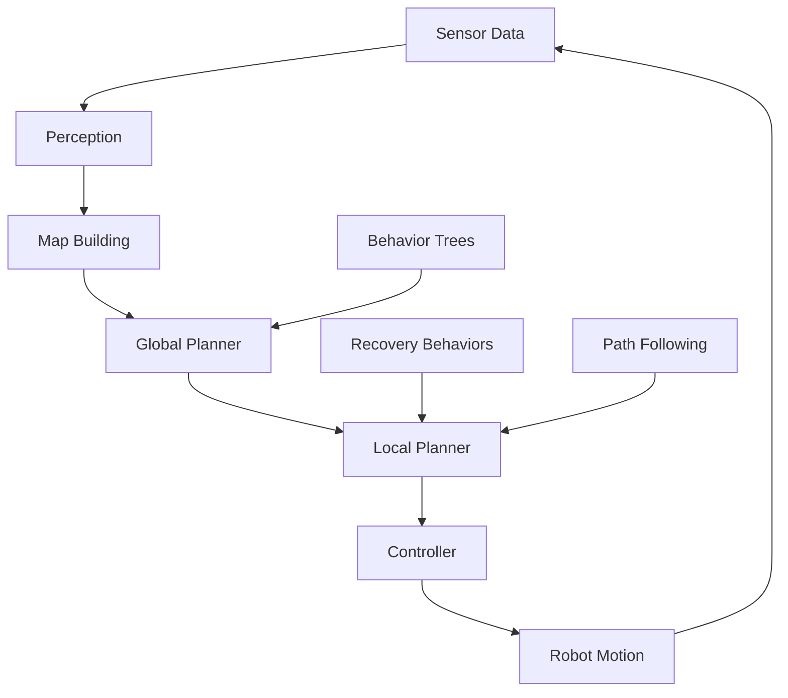

# Introduction to Navigation Stack (Nav2)

Welcome to Week 8 of Module 3: The AI Robot Brain. In this week, you'll learn about the **Navigation Stack 2 (Nav2)** - the premier navigation system for mobile robots in ROS 2. Nav2 enables robots to autonomously navigate through complex environments using perception, planning, and control.

## What is Nav2?

**Navigation Stack 2 (Nav2)** is the next-generation navigation system for ROS 2 that provides:
- **Path Planning**: Computing optimal routes through environments
- **Motion Control**: Following planned paths accurately
- **Recovery Behaviors**: Handling navigation failures gracefully
- **Behavior Trees**: Structuring complex navigation logic
- **Simulation Tools**: Testing navigation in virtual environments



## Why Nav2 Matters

Nav2 addresses critical challenges in robot navigation:

| Challenge | Nav2 Solution |
|-----------|---------------|
| **Path Planning** | Global and local path planning algorithms |
| **Obstacle Avoidance** | Dynamic obstacle detection and avoidance |
| **Motion Control** | Precise path following and velocity control |
| **Recovery** | Robust handling of navigation failures |
| **Flexibility** | Configurable behaviors and parameters |
| **Integration** | Seamless ROS 2 ecosystem integration |

## Nav2 Architecture

Nav2 uses a modern, modular architecture based on:

### Behavior Trees
- **Hierarchical Structure**: Organize navigation tasks in tree structure
- **Reactive Behavior**: Respond to environmental changes
- **Modular Design**: Reusable navigation behaviors
- **Debugging Tools**: Visualize and debug navigation logic

### Action Servers
- **Asynchronous Execution**: Non-blocking navigation tasks
- **Goal Management**: Handle navigation goals with feedback
- **Result Reporting**: Return navigation outcomes
- **Preemption**: Cancel navigation goals when needed

### Plugins Architecture
- **Swappable Components**: Replace planners, controllers, etc.
- **Custom Plugins**: Extend functionality with custom code
- **Standardized Interfaces**: Consistent plugin interfaces
- **Performance**: Optimized for real-time operation

## Core Components

### Global Planner
- **Path Finding**: Compute optimal paths from start to goal
- **Cost Maps**: Consider obstacles and terrain costs
- **Algorithms**: A*, Dijkstra, NavFn, and more
- **Multi-layered**: Combine multiple cost sources

### Local Planner
- **Obstacle Avoidance**: Navigate around dynamic obstacles
- **Path Following**: Follow global plan with local adjustments
- **Velocity Control**: Generate safe velocity commands
- **Collision Prevention**: Ensure robot safety

### Controller
- **Motion Execution**: Send velocity commands to robot
- **Path Tracking**: Follow reference trajectories
- **Feedback Control**: Adjust for tracking errors
- **Safety**: Implement safety constraints

## Setting Up Nav2

Before proceeding, ensure your development environment includes:

```bash
# Check for Nav2 installation
ros2 pkg list | grep nav2

# Verify Nav2 packages
ls /opt/ros/humble/share/ | grep nav2

# Check Nav2 dependencies
python3 -c "import lifecycle_msgs; print('Lifecycle msgs available')"
```

## Nav2 Concepts Preview

This week covers these fundamental concepts:

### Behavior Trees
- **Tree Structure**: Understanding parent-child relationships
- **Control Nodes**: Sequences, selectors, decorators
- **Leaf Nodes**: Actions and conditions
- **Custom Nodes**: Creating custom behaviors

### Path Planning
- **Global Planning**: Long-term route planning
- **Local Planning**: Short-term obstacle avoidance
- **Cost Maps**: Representing environment costs
- **Algorithms**: A*, Dijkstra, and sampling methods

### Motion Control
- **Velocity Commands**: Sending movement commands
- **Path Following**: Following planned trajectories
- **Feedback Control**: Correcting tracking errors
- **Safety Systems**: Collision prevention

### Recovery Behaviors
- **Failure Detection**: Identifying navigation problems
- **Recovery Actions**: Spinning, backing up, clearing
- **Fallback Strategies**: Alternative navigation approaches
- **Robustness**: Handling various failure scenarios

## Nav2 Command Line Tools

Nav2 provides powerful command-line tools:

```bash
# Launch navigation system
ros2 launch nav2_bringup navigation_launch.py

# Launch with simulation
ros2 launch nav2_bringup tb3_simulation_launch.py

# Send navigation goal
ros2 action send_goal /navigate_to_pose nav2_msgs/action/NavigateToPose "{pose: {pose: {position: {x: 1.0, y: 1.0, z: 0.0}, orientation: {w: 1.0}}, header: {frame_id: 'map'}}}"

# Check navigation status
ros2 action list
ros2 action info /navigate_to_pose
```

## Module Learning Objectives

By the end of this week, you will be able to:

1. **Understand** the Nav2 architecture and components
2. **Configure** Nav2 for different robot platforms
3. **Implement** custom navigation behaviors using BTs
4. **Tune** planner and controller parameters
5. **Debug** navigation system performance
6. **Integrate** Nav2 with perception systems
7. **Deploy** navigation in real-world environments

## Prerequisites

- Basic understanding of ROS 2 concepts (actions, services, topics)
- Experience with TF transforms
- Completed Module 1-2 of this curriculum
- Basic knowledge of path planning concepts
- Understanding of robot kinematics

## Nav2 Best Practices

### 1. Configuration Management
- **Modular Config**: Separate parameters for different components
- **Version Control**: Track configuration changes
- **Parameter Validation**: Test configurations thoroughly
- **Documentation**: Document parameter effects

### 2. Performance Optimization
- **Real-time Requirements**: Meet timing constraints
- **Computational Efficiency**: Optimize algorithms
- **Memory Management**: Efficient data structures
- **Threading**: Proper multi-threading usage

### 3. Safety Considerations
- **Collision Avoidance**: Proper safety margins
- **Emergency Stops**: Implement safety mechanisms
- **Validation**: Test in controlled environments
- **Monitoring**: Track navigation performance

## Next Steps

Continue to [Nav2 Architecture and Components](./nav2-architecture) to learn about the core architecture and components of Nav2.

## Resources

- [Nav2 Documentation](https://navigation.ros.org/)
- [Nav2 Tutorials](https://navigation.ros.org/tutorials/index.html)
- [Behavior Trees Documentation](https://behaviortree.dev/)
- [ROS 2 Navigation Repository](https://github.com/ros-planning/navigation2)
- [Navigation Tuning Guide](https://navigation.ros.org/configuration/index.html)