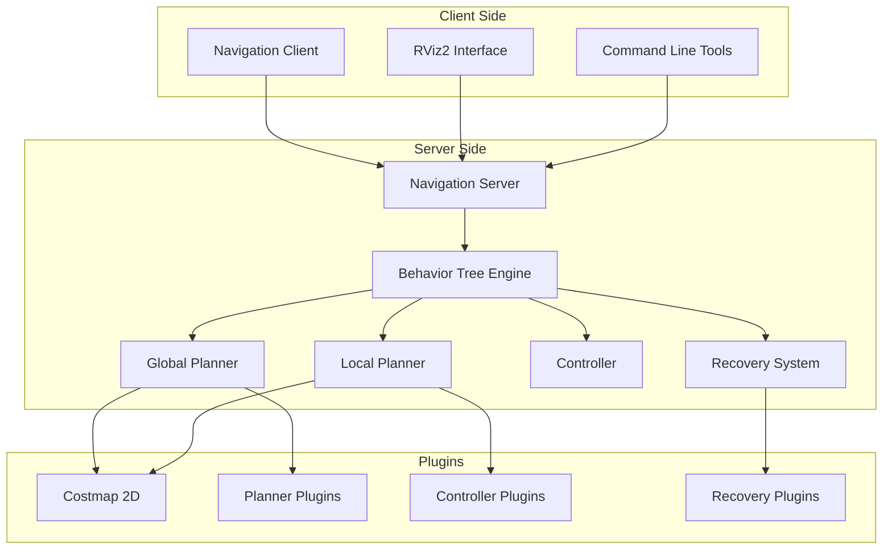

# Nav2 Architecture and Components

Navigation Stack 2 (Nav2) uses a modern, modular architecture built around behavior trees, action servers, and plugin-based components. Understanding this architecture is crucial for configuring and extending Nav2 for your specific robot applications.

## Nav2 System Architecture

The Nav2 system follows a client-server model with behavior trees orchestrating navigation tasks:



## Core Architecture Components

### Navigation Server

The Navigation Server is the central component that manages navigation requests:

```python
#!/usr/bin/env python3
"""
Navigation Server Example
"""
import rclpy
from rclpy.action import ActionServer
from rclpy.node import Node
from nav2_msgs.action import NavigateToPose
from geometry_msgs.msg import PoseStamped
from tf2_ros import Buffer, TransformListener
import threading

class NavigationServer(Node):
    def __init__(self):
        super().__init__('navigation_server')

        # Create action server for navigation
        self._action_server = ActionServer(
            self,
            NavigateToPose,
            'navigate_to_pose',
            self.execute_callback
        )

        # TF buffer for coordinate transformations
        self.tf_buffer = Buffer()
        self.tf_listener = TransformListener(self.tf_buffer, self)

        # Navigation state
        self.current_goal = None
        self.is_navigating = False

        # Behavior tree executor
        self.bt_executor = None

        self.get_logger().info('Navigation server started')

    def execute_callback(self, goal_handle):
        """Execute navigation goal"""
        self.get_logger().info('Received navigation goal')

        # Store current goal
        self.current_goal = goal_handle.request.pose
        self.is_navigating = True

        # Initialize behavior tree
        self.initialize_behavior_tree()

        # Execute navigation
        result = NavigateToPose.Result()
        feedback = NavigateToPose.Feedback()

        try:
            # Execute behavior tree
            while self.is_navigating and not goal_handle.is_cancel_requested:
                # Update feedback
                current_pose = self.get_current_pose()
                if current_pose:
                    distance = self.calculate_distance(current_pose, self.current_goal.pose)
                    feedback.current_pose = current_pose
                    feedback.distance_remaining = distance

                    goal_handle.publish_feedback(feedback)

                    if distance < 0.5:  # Reached goal
                        self.get_logger().info('Goal reached successfully')
                        result.result = 1  # SUCCESS
                        goal_handle.succeed()
                        break

                # Small delay to prevent busy waiting
                self.get_clock().sleep_for(rclpy.duration.Duration(seconds=0.1))

            if goal_handle.is_cancel_requested:
                goal_handle.canceled()
                result.result = 0  # CANCELED

        except Exception as e:
            self.get_logger().error(f'Navigation error: {e}')
            goal_handle.abort()
            result.result = -1  # FAILED

        finally:
            self.is_navigating = False

        return result

    def initialize_behavior_tree(self):
        """Initialize behavior tree for navigation"""
        # In a real implementation, this would load and configure
        # the behavior tree with appropriate plugins
        pass

    def get_current_pose(self):
        """Get current robot pose from TF"""
        try:
            transform = self.tf_buffer.lookup_transform(
                'map', 'base_link', rclpy.time.Time()
            )
            pose = PoseStamped()
            pose.pose.position.x = transform.transform.translation.x
            pose.pose.position.y = transform.transform.translation.y
            pose.pose.position.z = transform.transform.translation.z
            pose.pose.orientation = transform.transform.rotation
            return pose
        except Exception as e:
            self.get_logger().warn(f'Could not get current pose: {e}')
            return None

    def calculate_distance(self, pose1, pose2):
        """Calculate distance between two poses"""
        dx = pose1.pose.position.x - pose2.position.x
        dy = pose1.pose.position.y - pose2.position.y
        return (dx**2 + dy**2)**0.5

def main(args=None):
    rclpy.init(args=args)
    server = NavigationServer()

    try:
        rclpy.spin(server)
    except KeyboardInterrupt:
        pass
    finally:
        server.destroy_node()
        rclpy.shutdown()

if __name__ == '__main__':
    main()
```

## Behavior Trees in Nav2

Behavior trees provide a flexible way to structure navigation logic:

### Basic Behavior Tree Structure

```xml
<root main_tree_to_execute="MainTree">
    <BehaviorTree ID="MainTree">
        <Sequence name="NavigateWithRecovery">
            <PipelineSequence name="GlobalPlan">
                <RecoveryNode number_of_retries="6">
                    <Sequence>
                        <ComputePathToPose goal="{goal}" path="{path}" planner_id="GridBased"/>
                        <SmoothPath path="{path}" output_path="{path}" smoother_id="SimpleSmoother"/>
                    </Sequence>
                    <ReactiveFallback name="PlanRecoveryFallback">
                        <ClearEntireCostmap name="ClearGlobalCostmap" service_name="global_costmap/clear_entirely_global_costmap"/>
                        <BackUp distance="0.30" backup_speed="0.05"/>
                    </ReactiveFallback>
                </RecoveryNode>
            </PipelineSequence>

            <PipelineSequence name="FollowPath">
                <RecoveryNode number_of_retries="6">
                    <FollowPath path="{path}" controller_id="FollowPath"/>
                    <ReactiveFallback name="FollowPathRecoveryFallback">
                        <ClearEntireCostmap name="ClearLocalCostmap" service_name="local_costmap/clear_entirely_local_costmap"/>
                        <Spin spin_dist="1.57"/>
                    </ReactiveFallback>
                </RecoveryNode>
            </PipelineSequence>
        </Sequence>
    </BehaviorTree>
</root>
```

### Behavior Tree Nodes

#### Control Nodes
- **Sequence**: Execute children in order until one fails
- **Fallback**: Try children until one succeeds
- **Parallel**: Execute multiple children simultaneously
- **Decorator**: Modify behavior of child nodes

#### Action Nodes
- **ComputePathToPose**: Plan path to goal
- **FollowPath**: Execute path following
- **SmoothPath**: Smooth the planned path
- **Spin**: Rotate in place
- **BackUp**: Move backward

#### Condition Nodes
- **IsPathValid**: Check if path is valid
- **GoalReached**: Check if goal is reached
- **GoalUpdated**: Check if goal has been updated

## Costmap 2D

Costmap 2D provides a 2D representation of the environment with cost values:

### Global Costmap

```yaml
global_costmap:
  global_frame: map
  robot_base_frame: base_link
  update_frequency: 1.0
  publish_frequency: 1.0
  static_map: true
  rolling_window: false
  resolution: 0.05
  inflation_radius: 0.55
  plugins:
    - {name: static_layer, type: "nav2_costmap_2d::StaticLayer"}
    - {name: obstacle_layer, type: "nav2_costmap_2d::ObstacleLayer"}
    - {name: inflation_layer, type: "nav2_costmap_2d::InflationLayer"}
```

### Local Costmap

```yaml
local_costmap:
  global_frame: odom
  robot_base_frame: base_link
  update_frequency: 5.0
  publish_frequency: 2.0
  static_map: false
  rolling_window: true
  width: 3
  height: 3
  resolution: 0.05
  inflation_radius: 0.35
  plugins:
    - {name: obstacle_layer, type: "nav2_costmap_2d::ObstacleLayer"}
    - {name: voxel_layer, type: "nav2_costmap_2d::VoxelLayer"}
    - {name: inflation_layer, type: "nav2_costmap_2d::InflationLayer"}
```

## Planner Plugins

### Global Planners

```python
#!/usr/bin/env python3
"""
Global Planner Plugin Example
"""
import rclpy
from rclpy.node import Node
from nav2_core.global_planner import GlobalPlanner
from geometry_msgs.msg import PoseStamped
from nav_msgs.msg import Path
from nav2_util import lifecycle
from nav2_costmap_2d import Costmap2DROS
import numpy as np

class ExampleGlobalPlanner(GlobalPlanner):
    def __init__(self):
        super().__init__()
        self._costmap = None
        self._global_frame = None
        self._robot_frame = None

    def configure(self, node, global_costmap, planner_topic):
        """Configure the planner"""
        self._node = node
        self._costmap = global_costmap
        self._global_frame = global_costmap.getGlobalFrameID()
        self._publisher = node.create_publisher(Path, planner_topic, 1)

    def cleanup(self):
        """Clean up the planner"""
        pass

    def setCostmap(self, costmap):
        """Set the costmap for the planner"""
        self._costmap = costmap

    def createPlan(self, start, goal):
        """Create a plan from start to goal"""
        path = Path()
        path.header.frame_id = self._global_frame

        # Simple example: straight line path
        # In practice, implement A*, Dijkstra, or other path planning algorithm
        start_x = start.pose.position.x
        start_y = start.pose.position.y
        goal_x = goal.pose.position.x
        goal_y = goal.pose.position.y

        # Calculate intermediate points
        num_points = max(10, int(np.hypot(goal_x - start_x, goal_y - start_y) / 0.5))
        for i in range(num_points + 1):
            t = i / num_points if num_points > 0 else 0
            x = start_x + t * (goal_x - start_x)
            y = start_y + t * (goal_y - start_y)

            pose = PoseStamped()
            pose.header.frame_id = self._global_frame
            pose.pose.position.x = x
            pose.pose.position.y = y
            pose.pose.position.z = 0.0
            pose.pose.orientation.w = 1.0

            path.poses.append(pose)

        return path

def main(args=None):
    rclpy.init(args=args)

    # In a real plugin, this would be loaded by the plugin system
    planner = ExampleGlobalPlanner()

    rclpy.shutdown()

if __name__ == '__main__':
    main()
```

### Local Planners

Local planners handle path following and obstacle avoidance:

```python
#!/usr/bin/env python3
"""
Local Planner Plugin Example
"""
import rclpy
from rclpy.node import Node
from nav2_core.local_planner import LocalPlanner
from geometry_msgs.msg import Twist, PoseStamped
from nav_msgs.msg import Path
from sensor_msgs.msg import LaserScan
import math

class ExampleLocalPlanner(LocalPlanner):
    def __init__(self):
        super().__init__()
        self._goal = None
        self._path = None
        self._current_pose = None
        self._cmd_vel_pub = None
        self._laser_sub = None

    def configure(self, node, tf, costmap_ros):
        """Configure the local planner"""
        self._node = node
        self._tf = tf
        self._costmap_ros = costmap_ros
        self._cmd_vel_pub = node.create_publisher(Twist, 'cmd_vel', 1)
        self._laser_sub = node.create_subscription(
            LaserScan, 'scan', self.laser_callback, 10
        )

    def activate(self):
        """Activate the local planner"""
        pass

    def deactivate(self):
        """Deactivate the local planner"""
        # Stop the robot
        stop_msg = Twist()
        self._cmd_vel_pub.publish(stop_msg)

    def cleanup(self):
        """Clean up the local planner"""
        pass

    def setPlan(self, path):
        """Set the plan to follow"""
        self._path = path

    def computeVelocityCommands(self, pose, velocity):
        """Compute velocity commands"""
        cmd_vel = Twist()

        if self._path and len(self._path.poses) > 0:
            # Calculate direction to next waypoint
            target_x = self._path.poses[0].pose.position.x
            target_y = self._path.poses[0].pose.position.y
            current_x = pose.pose.position.x
            current_y = pose.pose.position.y

            dx = target_x - current_x
            dy = target_y - current_y
            distance = math.sqrt(dx*dx + dy*dy)

            # Calculate angle to target
            target_angle = math.atan2(dy, dx)
            current_angle = self.get_yaw_from_quaternion(pose.pose.orientation)

            # Simple proportional controller
            angle_error = target_angle - current_angle
            # Normalize angle error to [-π, π]
            while angle_error > math.pi:
                angle_error -= 2 * math.pi
            while angle_error < -math.pi:
                angle_error += 2 * math.pi

            # Set velocities
            if abs(angle_error) > 0.1:  # Turn to face target
                cmd_vel.angular.z = max(-1.0, min(1.0, angle_error * 1.0))
            else:  # Move forward
                cmd_vel.linear.x = max(0.0, min(0.5, distance * 1.0))

        return cmd_vel, True, 0.0  # velocity, valid, time remaining

    def isGoalReached(self):
        """Check if goal is reached"""
        if not self._path or len(self._path.poses) == 0:
            return True
        return False

    def laser_callback(self, msg):
        """Handle laser scan data for obstacle avoidance"""
        # Process laser data for local obstacle avoidance
        min_range = min(msg.ranges) if msg.ranges else float('inf')

        if min_range < 0.5:  # Obstacle too close
            # Emergency stop or avoidance behavior
            stop_msg = Twist()
            self._cmd_vel_pub.publish(stop_msg)

    def get_yaw_from_quaternion(self, quat):
        """Extract yaw from quaternion"""
        siny_cosp = 2 * (quat.w * quat.z + quat.x * quat.y)
        cosy_cosp = 1 - 2 * (quat.y * quat.y + quat.z * quat.z)
        return math.atan2(siny_cosp, cosy_cosp)

def main(args=None):
    rclpy.init(args=args)

    # In a real plugin, this would be loaded by the plugin system
    planner = ExampleLocalPlanner()

    rclpy.shutdown()

if __name__ == '__main__':
    main()
```

## Controller Plugins

Controller plugins handle the low-level path following:

```python
#!/usr/bin/env python3
"""
Controller Plugin Example
"""
import rclpy
from rclpy.node import Node
from nav2_core.controller import Controller
from geometry_msgs.msg import Twist, PoseStamped
from nav_msgs.msg import Path
import math

class ExampleController(Controller):
    def __init__(self):
        super().__init__()
        self._goal_tolerance = 0.25
        self._velocity_limits = {'linear': 0.5, 'angular': 1.0}
        self._pid_params = {'linear': {'kp': 1.0, 'ki': 0.1, 'kd': 0.05},
                           'angular': {'kp': 2.0, 'ki': 0.2, 'kd': 0.1}}

    def configure(self, node, tf, costmap_ros):
        """Configure the controller"""
        self._node = node
        self._tf = tf
        self._costmap_ros = costmap_ros

        # Initialize PID controllers
        self._linear_pid = PIDController(**self._pid_params['linear'])
        self._angular_pid = PIDController(**self._pid_params['angular'])

    def setPlan(self, path):
        """Set the plan to follow"""
        self._path = path
        self._current_waypoint = 0

    def computeVelocityCommands(self, pose, velocity):
        """Compute velocity commands to follow path"""
        cmd_vel = Twist()

        if not self._path or len(self._path.poses) == 0:
            return cmd_vel, True

        # Get current waypoint to follow
        target_pose = self._path.poses[self._current_waypoint]

        # Calculate distance to target
        dx = target_pose.pose.position.x - pose.pose.position.x
        dy = target_pose.pose.position.y - pose.pose.position.y
        distance = math.sqrt(dx*dx + dy*dy)

        # Calculate angle to target
        target_angle = math.atan2(dy, dx)
        current_angle = self.get_yaw_from_quaternion(pose.pose.orientation)

        angle_error = self.normalize_angle(target_angle - current_angle)

        # Use PID controllers
        cmd_vel.linear.x = self._linear_pid.update(distance, 0.0)  # Distance error
        cmd_vel.angular.z = self._angular_pid.update(angle_error, 0.0)  # Angle error

        # Apply velocity limits
        cmd_vel.linear.x = max(-self._velocity_limits['linear'],
                              min(self._velocity_limits['linear'], cmd_vel.linear.x))
        cmd_vel.angular.z = max(-self._velocity_limits['angular'],
                               min(self._velocity_limits['angular'], cmd_vel.angular.z))

        # Check if reached current waypoint
        if distance < self._goal_tolerance:
            if self._current_waypoint < len(self._path.poses) - 1:
                self._current_waypoint += 1

        # Check if reached final goal
        final_waypoint = self._path.poses[-1]
        final_distance = math.sqrt(
            (final_waypoint.pose.position.x - pose.pose.position.x)**2 +
            (final_waypoint.pose.position.y - pose.pose.position.y)**2
        )

        goal_reached = final_distance < self._goal_tolerance

        return cmd_vel, goal_reached

    def get_yaw_from_quaternion(self, quat):
        """Extract yaw from quaternion"""
        siny_cosp = 2 * (quat.w * quat.z + quat.x * quat.y)
        cosy_cosp = 1 - 2 * (quat.y * quat.y + quat.z * quat.z)
        return math.atan2(siny_cosp, cosy_cosp)

    def normalize_angle(self, angle):
        """Normalize angle to [-π, π]"""
        while angle > math.pi:
            angle -= 2 * math.pi
        while angle < -math.pi:
            angle += 2 * math.pi
        return angle

class PIDController:
    def __init__(self, kp=1.0, ki=0.0, kd=0.0, dt=0.1):
        self.kp = kp
        self.ki = ki
        self.kd = kd
        self.dt = dt
        self.prev_error = 0.0
        self.integral = 0.0

    def update(self, error, setpoint=0.0):
        """Update PID controller"""
        self.integral += error * self.dt
        derivative = (error - self.prev_error) / self.dt

        output = (self.kp * error) + (self.ki * self.integral) + (self.kd * derivative)

        self.prev_error = error
        return output

def main(args=None):
    rclpy.init(args=args)

    # In a real plugin, this would be loaded by the plugin system
    controller = ExampleController()

    rclpy.shutdown()

if __name__ == '__main__':
    main()
```

## Recovery Plugins

Recovery plugins handle navigation failures:

```python
#!/usr/bin/env python3
"""
Recovery Plugin Example
"""
import rclpy
from rclpy.node import Node
from nav2_core.recovery import Recovery
from geometry_msgs.msg import Twist
from tf2_ros import Buffer, TransformListener
import math

class SpinRecovery(Recovery):
    def __init__(self):
        super().__init__()
        self._node = None
        self._cmd_vel_pub = None
        self._tf_buffer = None
        self._tf_listener = None

    def configure(self, node, tf, costmap_ros):
        """Configure the recovery behavior"""
        self._node = node
        self._tf_buffer = Buffer()
        self._tf_listener = TransformListener(self._tf_buffer, node)
        self._cmd_vel_pub = node.create_publisher(Twist, 'cmd_vel', 1)
        self._costmap_ros = costmap_ros

    def cleanup(self):
        """Clean up the recovery behavior"""
        # Stop any ongoing motion
        stop_msg = Twist()
        self._cmd_vel_pub.publish(stop_msg)

    def deactivate(self):
        """Deactivate the recovery behavior"""
        stop_msg = Twist()
        self._cmd_vel_pub.publish(stop_msg)

    def execute(self, initial_pose, goal_pose):
        """Execute the recovery behavior"""
        self._node.get_logger().info('Executing spin recovery behavior')

        # Rotate the robot in place
        cmd_vel = Twist()
        cmd_vel.angular.z = 0.5  # Rotate at 0.5 rad/s

        # Rotate for 2π radians (full circle)
        start_angle = self.get_current_yaw()
        target_angle = start_angle + 2 * math.pi

        rate = self._node.create_rate(10)  # 10 Hz

        while rclpy.ok():
            current_angle = self.get_current_yaw()

            # Calculate how much more rotation is needed
            angle_diff = target_angle - current_angle
            if angle_diff < 0:
                angle_diff += 2 * math.pi

            if angle_diff < 0.1:  # Close enough to target
                break

            self._cmd_vel_pub.publish(cmd_vel)
            rate.sleep()

        # Stop the robot
        stop_msg = Twist()
        self._cmd_vel_pub.publish(stop_msg)

        self._node.get_logger().info('Spin recovery completed')

    def get_current_yaw(self):
        """Get current robot yaw from TF"""
        try:
            transform = self._tf_buffer.lookup_transform(
                'map', 'base_link', rclpy.time.Time()
            )
            quat = transform.transform.rotation
            siny_cosp = 2 * (quat.w * quat.z + quat.x * quat.y)
            cosy_cosp = 1 - 2 * (quat.y * quat.y + quat.z * quat.z)
            return math.atan2(siny_cosp, cosy_cosp)
        except:
            return 0.0  # Default to 0 if transform unavailable

class BackUpRecovery(Recovery):
    def __init__(self):
        super().__init__()

    def configure(self, node, tf, costmap_ros):
        """Configure the back up recovery"""
        self._node = node
        self._cmd_vel_pub = node.create_publisher(Twist, 'cmd_vel', 1)
        self._tf_buffer = Buffer()
        self._tf_listener = TransformListener(self._tf_buffer, node)
        self._costmap_ros = costmap_ros

    def execute(self, initial_pose, goal_pose):
        """Execute back up recovery"""
        self._node.get_logger().info('Executing back up recovery behavior')

        # Move backward for 0.3 meters
        cmd_vel = Twist()
        cmd_vel.linear.x = -0.1  # Move backward at 0.1 m/s

        start_pose = self.get_current_pose()
        if start_pose is None:
            return

        start_x = start_pose.pose.position.x
        start_y = start_pose.pose.position.y

        rate = self._node.create_rate(10)  # 10 Hz

        while rclpy.ok():
            current_pose = self.get_current_pose()
            if current_pose is None:
                break

            distance_moved = math.sqrt(
                (current_pose.pose.position.x - start_x)**2 +
                (current_pose.pose.position.y - start_y)**2
            )

            if distance_moved >= 0.3:  # Moved 0.3 meters
                break

            self._cmd_vel_pub.publish(cmd_vel)
            rate.sleep()

        # Stop the robot
        stop_msg = Twist()
        self._cmd_vel_pub.publish(stop_msg)

        self._node.get_logger().info('Back up recovery completed')

    def get_current_pose(self):
        """Get current robot pose from TF"""
        try:
            transform = self._tf_buffer.lookup_transform(
                'map', 'base_link', rclpy.time.Time()
            )
            pose = PoseStamped()
            pose.pose.position.x = transform.transform.translation.x
            pose.pose.position.y = transform.transform.translation.y
            pose.pose.position.z = transform.transform.translation.z
            pose.pose.orientation = transform.transform.rotation
            return pose
        except:
            return None

def main(args=None):
    rclpy.init(args=args)

    # In a real plugin, this would be loaded by the plugin system
    spin_recovery = SpinRecovery()
    backup_recovery = BackUpRecovery()

    rclpy.shutdown()

if __name__ == '__main__':
    main()
```

## Launch System Integration

### Navigation Launch File

```python
from launch import LaunchDescription
from launch.actions import DeclareLaunchArgument, SetEnvironmentVariable
from launch.substitutions import LaunchConfiguration
from launch_ros.actions import Node
from nav2_common.launch import ReplaceString
import os

def generate_launch_description():
    # Launch configuration variables
    namespace = LaunchConfiguration('namespace')
    use_sim_time = LaunchConfiguration('use_sim_time')
    autostart = LaunchConfiguration('autostart')
    params_file = LaunchConfiguration('params_file')
    default_bt_xml_filename = LaunchConfiguration('default_bt_xml_filename')
    map_subscribe_transient_local = LaunchConfiguration('map_subscribe_transient_local')

    return LaunchDescription([
        # Set environment variable
        SetEnvironmentVariable('RCUTILS_LOGGING_SEVERITY_THRESHOLD', 'INFO'),

        # Declare launch arguments
        DeclareLaunchArgument(
            'namespace', default_value='',
            description='Top-level namespace'),
        DeclareLaunchArgument(
            'use_sim_time', default_value='false',
            description='Use simulation (Gazebo) clock if true'),
        DeclareLaunchArgument(
            'autostart', default_value='true',
            description='Automatically startup the nav2 stack'),
        DeclareLaunchArgument(
            'params_file',
            default_value=os.path.join(
                get_package_share_directory('nav2_bringup'),
                'params/nav2_params.yaml'),
            description='Full path to the ROS2 parameters file to use'),
        DeclareLaunchArgument(
            'default_bt_xml_filename',
            default_value=os.path.join(
                get_package_share_directory('nav2_bt_navigator'),
                'behavior_trees/navigate_w_replanning_and_recovery.xml'),
            description='Full path to the behavior tree xml file to use'),
        DeclareLaunchArgument(
            'map_subscribe_transient_local', default_value='false',
            description='Whether to set the map subscriber QoS to transient local'),

        # Navigation Server
        Node(
            package='nav2_bt_navigator',
            executable='bt_navigator',
            name='bt_navigator',
            output='screen',
            parameters=[params_file],
            remappings=[('/tf', 'tf'),
                       ('/tf_static', 'tf_static')]),

        # Planner Server
        Node(
            package='nav2_planner',
            executable='planner_server',
            name='planner_server',
            output='screen',
            parameters=[params_file],
            remappings=[('/tf', 'tf'),
                       ('/tf_static', 'tf_static')]),

        # Controller Server
        Node(
            package='nav2_controller',
            executable='controller_server',
            name='controller_server',
            output='screen',
            parameters=[params_file],
            remappings=[('/tf', 'tf'),
                       ('/tf_static', 'tf_static')]),

        # Recoveries Server
        Node(
            package='nav2_recoveries',
            executable='recoveries_server',
            name='recoveries_server',
            output='screen',
            parameters=[params_file],
            remappings=[('/tf', 'tf'),
                       ('/tf_static', 'tf_static')]),

        # Lifecycle Manager
        Node(
            package='nav2_lifecycle_manager',
            executable='lifecycle_manager',
            name='lifecycle_manager_navigation',
            output='screen',
            parameters=[{'use_sim_time': use_sim_time},
                       {'autostart': autostart},
                       {'node_names': ['map_server',
                                      'planner_server',
                                      'controller_server',
                                      'recoveries_server',
                                      'bt_navigator',
                                      'waypoint_follower']}])
    ])
```

## Configuration Files

### Main Parameters File

```yaml
bt_navigator:
  ros__parameters:
    use_sim_time: false
    global_frame: map
    robot_base_frame: base_link
    odom_topic: /odom
    default_bt_xml_filename: "navigate_w_replanning_and_recovery.xml"
    plugin_lib_names:
      - nav2_compute_path_to_pose_action_bt_node
      - nav2_follow_path_action_bt_node
      - nav2_back_up_action_bt_node
      - nav2_spin_action_bt_node
      - nav2_wait_action_bt_node
      - nav2_clear_costmap_service_bt_node
      - nav2_is_stuck_condition_bt_node
      - nav2_goal_reached_condition_bt_node
      - nav2_goal_updated_condition_bt_node
      - nav2_initial_pose_received_condition_bt_node
      - nav2_reinitialize_global_localization_service_bt_node
      - nav2_rate_controller_bt_node
      - nav2_distance_controller_bt_node
      - nav2_speed_controller_bt_node
      - nav2_truncate_path_action_bt_node
      - nav2_goal_updater_node_bt_node
      - nav2_recovery_node_bt_node
      - nav2_pipeline_sequence_bt_node
      - nav2_round_robin_node_bt_node
      - nav2_transform_available_condition_bt_node
      - nav2_time_expired_condition_bt_node
      - nav2_path_expiring_timer_condition
      - nav2_distance_traveled_condition_bt_node
      - nav2_single_trigger_bt_node
      - nav2_is_battery_low_condition_bt_node
      - nav2_navigate_through_poses_action_bt_node
      - nav2_navigate_to_pose_action_bt_node
      - nav2_remove_passed_goals_action_bt_node
      - nav2_planner_selector_bt_node
      - nav2_controller_selector_bt_node
      - nav2_goal_checker_selector_bt_node
      - nav2_controller_cancel_bt_node
      - nav2_path_longer_on_approach_bt_node
      - nav2_wait_cancel_bt_node

planner_server:
  ros__parameters:
    expected_planner_frequency: 20.0
    use_sim_time: false
    planner_plugins: ["GridBased"]
    GridBased:
      plugin: "nav2_navfn_planner/NavfnPlanner"
      tolerance: 0.5
      use_astar: false
      allow_unknown: true

controller_server:
  ros__parameters:
    use_sim_time: false
    controller_frequency: 20.0
    min_x_velocity_threshold: 0.001
    min_y_velocity_threshold: 0.5
    min_theta_velocity_threshold: 0.001
    controller_plugins: ["FollowPath"]
    FollowPath:
      plugin: "nav2_rotation_shim_controller/RotationShimController"
      progress_checker_plugin: "progress_checker"
      goal_checker_plugin: "goal_checker"
      controller_frequency: 20.0
      min_x_velocity_threshold: 0.001
      min_y_velocity_threshold: 0.5
      min_theta_velocity_threshold: 0.001
      progress_checker:
        plugin: "nav2_controller::SimpleProgressChecker"
        required_movement_radius: 0.5
        movement_time_allowance: 10.0
      goal_checker:
        plugin: "nav2_controller::SimpleGoalChecker"
        xy_goal_tolerance: 0.25
        yaw_goal_tolerance: 0.25
        stateful: True
      RotateShim:
        plugin: "nav2_controller::RotateShimController"
        simulate_to_heading_angular_vel: 1.5
        angular_dist_threshold: 0.15
        forward_sampling_distance: 0.5
        rotate_to_heading_angular_vel: 1.0
        max_angular_accel: 3.2
        goal_tolerance: 0.15

local_costmap:
  local_costmap:
    ros__parameters:
      update_frequency: 5.0
      publish_frequency: 2.0
      global_frame: odom
      robot_base_frame: base_link
      use_sim_time: false
      rolling_window: true
      width: 3
      height: 3
      resolution: 0.05
      robot_radius: 0.22
      plugins: ["voxel_layer", "inflation_layer"]
      inflation_layer:
        plugin: "nav2_costmap_2d::InflationLayer"
        cost_scaling_factor: 3.0
        inflation_radius: 0.55
      voxel_layer:
        plugin: "nav2_costmap_2d::VoxelLayer"
        enabled: True
        publish_voxel_map: True
        origin_z: 0.0
        z_resolution: 0.05
        z_voxels: 16
        max_obstacle_height: 2.0
        mark_threshold: 0
        observation_sources: scan
        scan:
          topic: /scan
          max_obstacle_height: 2.0
          clearing: True
          marking: True
          data_type: "LaserScan"
          raytrace_max_range: 3.0
          raytrace_min_range: 0.0
          obstacle_max_range: 2.5
          obstacle_min_range: 0.0

global_costmap:
  global_costmap:
    ros__parameters:
      update_frequency: 1.0
      publish_frequency: 1.0
      global_frame: map
      robot_base_frame: base_link
      use_sim_time: false
      robot_radius: 0.22
      resolution: 0.05
      track_unknown_space: true
      plugins: ["static_layer", "obstacle_layer", "inflation_layer"]
      obstacle_layer:
        plugin: "nav2_costmap_2d::ObstacleLayer"
        enabled: True
        observation_sources: scan
        scan:
          topic: /scan
          max_obstacle_height: 2.0
          clearing: True
          marking: True
          data_type: "LaserScan"
          raytrace_max_range: 3.0
          raytrace_min_range: 0.0
          obstacle_max_range: 2.5
          obstacle_min_range: 0.0
      static_layer:
        plugin: "nav2_costmap_2d::StaticLayer"
        map_subscribe_transient_local: True
      inflation_layer:
        plugin: "nav2_costmap_2d::InflationLayer"
        cost_scaling_factor: 3.0
        inflation_radius: 0.55

waypoint_follower:
  ros__parameters:
    loop_rate: 20
    stop_on_failure: false
    waypoint_task_executor_plugin: "wait_at_waypoint"
    wait_at_waypoint:
      plugin: "nav2_waypoint_follower::WaitAtWaypoint"
      enabled: True
      waypoint_pause_duration: 200
```

## Best Practices

### 1. Configuration Management

```yaml
# Good: Modular configuration
planner_server:
  ros__parameters:
    expected_planner_frequency: 20.0
    use_sim_time: false
    planner_plugins: ["GridBased"]
    GridBased:
      plugin: "nav2_navfn_planner/NavfnPlanner"
      tolerance: 0.5
      use_astar: false
      allow_unknown: true

# Bad: Monolithic configuration
# All parameters in one large file without clear separation
```

### 2. Plugin Development

```python
# Good: Proper plugin inheritance and interface implementation
class CustomPlanner(GlobalPlanner):
    def __init__(self):
        super().__init__()
        # Proper initialization

    def createPlan(self, start, goal):
        # Implement required interface
        pass

# Bad: Missing required methods or improper inheritance
class BadPlanner:
    def some_method(self):
        # Doesn't implement proper interface
        pass
```

### 3. Error Handling

```python
# Good: Comprehensive error handling
def computeVelocityCommands(self, pose, velocity):
    try:
        # Navigation logic
        cmd_vel = self.calculate_commands(pose, velocity)
        return cmd_vel, True
    except Exception as e:
        self._node.get_logger().error(f'Error computing commands: {e}')
        return Twist(), False  # Return safe command

# Bad: No error handling
def bad_computeVelocityCommands(self, pose, velocity):
    # Direct computation without error handling
    cmd_vel = self.calculate_commands(pose, velocity)
    return cmd_vel, True
```

## Common Issues and Troubleshooting

### 1. Costmap Issues

```bash
# Check costmap status
ros2 service call /global_costmap/clear_entirely_global_costmap std_srvs/srv/Empty

# Check costmap topics
ros2 topic list | grep costmap
ros2 topic echo /global_costmap/costmap
```

### 2. Planning Issues

```bash
# Check planner status
ros2 action list | grep plan
ros2 service call /planner_server/load_follower nav2_msgs/srv/LoadFollower
```

### 3. Control Issues

```bash
# Check controller status
ros2 action list | grep follow
ros2 topic echo /cmd_vel
```

## Next Steps

Now that you understand Nav2 architecture and components, continue to [Navigation Planning and Control](../week-08/navigation-planning) to learn about path planning algorithms and motion control.

## Exercises

1. Create a custom behavior tree for navigation with recovery
2. Implement a simple global planner plugin
3. Configure Nav2 for a specific robot platform
4. Create a custom recovery behavior plugin