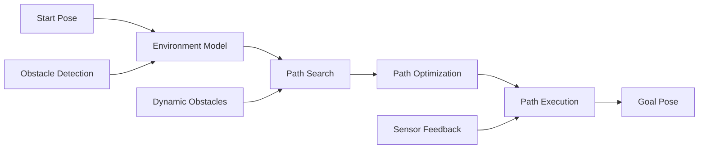

# Navigation Planning and Control

Navigation planning and control are the core capabilities of Nav2 that enable robots to move safely and efficiently through environments. This section covers path planning algorithms, motion control strategies, and the integration of perception data for robust navigation.

## Path Planning Fundamentals

Path planning involves finding a collision-free path from a start location to a goal location. The process involves:

1. **Environment Representation**: Modeling the world as a graph or grid
2. **Path Search**: Finding optimal or feasible paths
3. **Path Optimization**: Smoothing and improving the path
4. **Path Execution**: Following the planned path with motion control



## Global Path Planning

Global planners compute long-term paths from start to goal using static maps and costmaps.

### A* Algorithm Implementation

```python
#!/usr/bin/env python3
"""
A* Path Planner Implementation
"""
import numpy as np
import heapq
from rclpy.node import Node
from nav2_core.global_planner import GlobalPlanner
from geometry_msgs.msg import PoseStamped
from nav_msgs.msg import Path
from nav2_costmap_2d import Costmap2DROS
import math

class AStarPlanner(GlobalPlanner):
    def __init__(self):
        super().__init__()
        self._costmap = None
        self._global_frame = None
        self._robot_frame = None

    def configure(self, node, global_costmap, planner_topic):
        """Configure the planner"""
        self._node = node
        self._costmap = global_costmap
        self._global_frame = global_costmap.getGlobalFrameID()
        self._publisher = node.create_publisher(Path, planner_topic, 1)

    def cleanup(self):
        """Clean up the planner"""
        pass

    def setCostmap(self, costmap):
        """Set the costmap for the planner"""
        self._costmap = costmap

    def createPlan(self, start, goal):
        """Create a plan from start to goal using A* algorithm"""
        path = Path()
        path.header.frame_id = self._global_frame

        # Convert poses to map coordinates
        start_map = self.pose_to_map(start)
        goal_map = self.pose_to_map(goal)

        if start_map is None or goal_map is None:
            return path

        # Run A* algorithm
        path_points = self.a_star_search(start_map, goal_map)

        if path_points:
            # Convert path back to world coordinates
            for point in path_points:
                world_pose = self.map_to_pose(point)
                path.poses.append(world_pose)

        return path

    def a_star_search(self, start, goal):
        """A* pathfinding algorithm"""
        # Get costmap dimensions
        costmap = self._costmap.getCostmap()
        width = costmap.getSizeInCellsX()
        height = costmap.getSizeInCellsY()

        # Convert to integers
        start = (int(start[0]), int(start[1]))
        goal = (int(goal[0]), int(goal[1]))

        # Check bounds
        if not self.is_valid(start[0], start[1], width, height) or \
           not self.is_valid(goal[0], goal[1], width, height):
            return []

        # Check if start and goal are passable
        if self.get_cost(start[0], start[1]) >= 253 or self.get_cost(goal[0], goal[1]) >= 253:
            return []

        # A* algorithm
        open_set = [(0, start)]
        came_from = {}
        g_score = {start: 0}
        f_score = {start: self.heuristic(start, goal)}

        while open_set:
            current = heapq.heappop(open_set)[1]

            if current == goal:
                # Reconstruct path
                path = []
                while current in came_from:
                    path.append(current)
                    current = came_from[current]
                path.append(start)
                path.reverse()
                return path

            for neighbor in self.get_neighbors(current, width, height):
                tentative_g_score = g_score[current] + self.distance(current, neighbor)

                if neighbor not in g_score or tentative_g_score < g_score[neighbor]:
                    came_from[neighbor] = current
                    g_score[neighbor] = tentative_g_score
                    f_score[neighbor] = g_score[neighbor] + self.heuristic(neighbor, goal)
                    heapq.heappush(open_set, (f_score[neighbor], neighbor))

        return []  # No path found

    def heuristic(self, a, b):
        """Heuristic function (Euclidean distance)"""
        return math.sqrt((a[0] - b[0])**2 + (a[1] - b[1])**2)

    def get_neighbors(self, pos, width, height):
        """Get valid neighbors for a position"""
        neighbors = []
        for dx, dy in [(0, 1), (1, 0), (0, -1), (-1, 0), (1, 1), (1, -1), (-1, 1), (-1, -1)]:
            nx, ny = pos[0] + dx, pos[1] + dy
            if self.is_valid(nx, ny, width, height) and self.get_cost(nx, ny) < 253:  # Not lethal obstacle
                neighbors.append((nx, ny))
        return neighbors

    def is_valid(self, x, y, width, height):
        """Check if coordinates are valid"""
        return 0 <= x < width and 0 <= y < height

    def get_cost(self, x, y):
        """Get cost at coordinates"""
        costmap = self._costmap.getCostmap()
        if self.is_valid(x, y, costmap.getSizeInCellsX(), costmap.getSizeInCellsY()):
            return costmap.getCost(x, y)
        return 254  # Lethal obstacle

    def distance(self, a, b):
        """Calculate distance between two points"""
        return math.sqrt((a[0] - b[0])**2 + (a[1] - b[1])**2)

    def pose_to_map(self, pose):
        """Convert world pose to map coordinates"""
        costmap = self._costmap.getCostmap()
        world_x = pose.position.x
        world_y = pose.position.y

        # Convert to map coordinates
        map_x = int((world_x - costmap.getOriginX()) / costmap.getResolution())
        map_y = int((world_y - costmap.getOriginY()) / costmap.getResolution())

        return (map_x, map_y)

    def map_to_pose(self, map_coords):
        """Convert map coordinates to world pose"""
        costmap = self._costmap.getCostmap()
        map_x, map_y = map_coords

        # Convert to world coordinates
        world_x = map_x * costmap.getResolution() + costmap.getOriginX()
        world_y = map_y * costmap.getResolution() + costmap.getOriginY()

        pose = PoseStamped()
        pose.header.frame_id = self._global_frame
        pose.pose.position.x = world_x
        pose.pose.position.y = world_y
        pose.pose.position.z = 0.0
        pose.pose.orientation.w = 1.0

        return pose

def main(args=None):
    rclpy.init(args=args)

    # In a real plugin, this would be loaded by the plugin system
    planner = AStarPlanner()

    rclpy.shutdown()

if __name__ == '__main__':
    main()
```

### Dijkstra's Algorithm Implementation

```python
#!/usr/bin/env python3
"""
Dijkstra's Algorithm Path Planner
"""
import numpy as np
import heapq
from rclpy.node import Node
from nav2_core.global_planner import GlobalPlanner
from geometry_msgs.msg import PoseStamped
from nav_msgs.msg import Path

class DijkstraPlanner(GlobalPlanner):
    def __init__(self):
        super().__init__()
        self._costmap = None
        self._global_frame = None

    def configure(self, node, global_costmap, planner_topic):
        """Configure the planner"""
        self._node = node
        self._costmap = global_costmap
        self._global_frame = global_costmap.getGlobalFrameID()
        self._publisher = node.create_publisher(Path, planner_topic, 1)

    def createPlan(self, start, goal):
        """Create a plan using Dijkstra's algorithm"""
        path = Path()
        path.header.frame_id = self._global_frame

        # Convert poses to map coordinates
        start_map = self.pose_to_map(start)
        goal_map = self.pose_to_map(goal)

        if start_map is None or goal_map is None:
            return path

        # Run Dijkstra's algorithm
        path_points = self.dijkstra_search(start_map, goal_map)

        if path_points:
            # Convert path back to world coordinates
            for point in path_points:
                world_pose = self.map_to_pose(point)
                path.poses.append(world_pose)

        return path

    def dijkstra_search(self, start, goal):
        """Dijkstra's shortest path algorithm"""
        costmap = self._costmap.getCostmap()
        width = costmap.getSizeInCellsX()
        height = costmap.getSizeInCellsY()

        # Convert to integers
        start = (int(start[0]), int(start[1]))
        goal = (int(goal[0]), int(goal[1]))

        # Check bounds
        if not self.is_valid(start[0], start[1], width, height) or \
           not self.is_valid(goal[0], goal[1], width, height):
            return []

        # Check if start and goal are passable
        if self.get_cost(start[0], start[1]) >= 253 or self.get_cost(goal[0], goal[1]) >= 253:
            return []

        # Dijkstra's algorithm
        open_set = [(0, start)]
        came_from = {}
        cost_so_far = {start: 0}

        while open_set:
            current_cost, current = heapq.heappop(open_set)

            if current == goal:
                # Reconstruct path
                path = []
                while current in came_from:
                    path.append(current)
                    current = came_from[current]
                path.append(start)
                path.reverse()
                return path

            for neighbor in self.get_neighbors(current, width, height):
                new_cost = cost_so_far[current] + self.get_edge_cost(current, neighbor)

                if neighbor not in cost_so_far or new_cost < cost_so_far[neighbor]:
                    cost_so_far[neighbor] = new_cost
                    priority = new_cost
                    heapq.heappush(open_set, (priority, neighbor))
                    came_from[neighbor] = current

        return []  # No path found

    def get_edge_cost(self, a, b):
        """Get cost of moving from a to b"""
        base_cost = self.distance(a, b)
        avg_cost = (self.get_cost(a[0], a[1]) + self.get_cost(b[0], b[1])) / 2.0
        # Normalize cost from 0-255 to 0-1 range for path planning
        normalized_cost = avg_cost / 255.0
        return base_cost * (1 + normalized_cost)

    def get_neighbors(self, pos, width, height):
        """Get valid neighbors for a position"""
        neighbors = []
        for dx, dy in [(0, 1), (1, 0), (0, -1), (-1, 0), (1, 1), (1, -1), (-1, 1), (-1, -1)]:
            nx, ny = pos[0] + dx, pos[1] + dy
            if self.is_valid(nx, ny, width, height) and self.get_cost(nx, ny) < 253:  # Not lethal obstacle
                neighbors.append((nx, ny))
        return neighbors

    def is_valid(self, x, y, width, height):
        """Check if coordinates are valid"""
        return 0 <= x < width and 0 <= y < height

    def get_cost(self, x, y):
        """Get cost at coordinates"""
        costmap = self._costmap.getCostmap()
        if self.is_valid(x, y, costmap.getSizeInCellsX(), costmap.getSizeInCellsY()):
            return costmap.getCost(x, y)
        return 254  # Lethal obstacle

    def distance(self, a, b):
        """Calculate distance between two points"""
        return math.sqrt((a[0] - b[0])**2 + (a[1] - b[1])**2)

    def pose_to_map(self, pose):
        """Convert world pose to map coordinates"""
        costmap = self._costmap.getCostmap()
        world_x = pose.position.x
        world_y = pose.position.y

        # Convert to map coordinates
        map_x = int((world_x - costmap.getOriginX()) / costmap.getResolution())
        map_y = int((world_y - costmap.getOriginY()) / costmap.getResolution())

        return (map_x, map_y)

    def map_to_pose(self, map_coords):
        """Convert map coordinates to world pose"""
        costmap = self._costmap.getCostmap()
        map_x, map_y = map_coords

        # Convert to world coordinates
        world_x = map_x * costmap.getResolution() + costmap.getOriginX()
        world_y = map_y * costmap.getResolution() + costmap.getOriginY()

        pose = PoseStamped()
        pose.header.frame_id = self._global_frame
        pose.pose.position.x = world_x
        pose.pose.position.y = world_y
        pose.pose.position.z = 0.0
        pose.pose.orientation.w = 1.0

        return pose
```

## Path Optimization

### Path Smoothing

```python
#!/usr/bin/env python3
"""
Path Smoothing Implementation
"""
import numpy as np
from geometry_msgs.msg import PoseStamped
from nav_msgs.msg import Path
import math

class PathSmoother:
    def __init__(self, weight_data=0.5, weight_smooth=0.1, tolerance=0.000001):
        self.weight_data = weight_data
        self.weight_smooth = weight_smooth
        self.tolerance = tolerance

    def smooth_path(self, path, fixed_points=None):
        """
        Smooth a path using gradient descent optimization
        fixed_points: list of indices that should not be modified
        """
        if len(path.poses) < 3:
            return path

        # Convert path to numpy arrays for processing
        x_coords = np.array([pose.pose.position.x for pose in path.poses])
        y_coords = np.array([pose.pose.position.y for pose in path.poses])

        # Create smoothed arrays
        x_smooth = x_coords.copy()
        y_smooth = y_coords.copy()

        # Apply smoothing algorithm
        change = self.tolerance
        while change >= self.tolerance:
            change = 0.0
            for i in range(1, len(path.poses) - 1):
                # Skip fixed points
                if fixed_points and i in fixed_points:
                    continue

                # Calculate change for x coordinate
                old_x = x_smooth[i]
                x_smooth[i] += self.weight_data * (x_coords[i] - x_smooth[i])
                x_smooth[i] += self.weight_smooth * (x_smooth[i-1] + x_smooth[i+1] - 2.0 * x_smooth[i])
                change += abs(old_x - x_smooth[i])

                # Calculate change for y coordinate
                old_y = y_smooth[i]
                y_smooth[i] += self.weight_data * (y_coords[i] - y_smooth[i])
                y_smooth[i] += self.weight_smooth * (y_smooth[i-1] + y_smooth[i+1] - 2.0 * y_smooth[i])
                change += abs(old_y - y_smooth[i])

        # Create new smoothed path
        smoothed_path = Path()
        smoothed_path.header = path.header

        for i in range(len(path.poses)):
            pose = PoseStamped()
            pose.header = path.header
            pose.pose.position.x = x_smooth[i]
            pose.pose.position.y = y_smooth[i]
            pose.pose.position.z = path.poses[i].pose.position.z
            pose.pose.orientation = path.poses[i].pose.orientation
            smoothed_path.poses.append(pose)

        return smoothed_path

    def optimize_path(self, path, max_curvature=1.0):
        """
        Optimize path by removing unnecessary waypoints and limiting curvature
        """
        if len(path.poses) < 3:
            return path

        optimized_path = Path()
        optimized_path.header = path.header

        # Start with first point
        optimized_path.poses.append(path.poses[0])

        i = 0
        while i < len(path.poses) - 1:
            # Find the furthest point we can see without collision
            j = i + 1
            while j < len(path.poses):
                # Check if the direct line from i to j is collision-free
                if not self.check_line_collision(path.poses[i], path.poses[j]):
                    # Check curvature constraint
                    if j - i > 1 and self.check_curvature(path.poses[i], path.poses[j-1], path.poses[j]):
                        optimized_path.poses.append(path.poses[j-1])
                        i = j - 1
                        break
                j += 1

            if j == len(path.poses):
                # Reached the end, add it
                optimized_path.poses.append(path.poses[-1])
                break

        return optimized_path

    def check_line_collision(self, pose1, pose2):
        """
        Check if a line between two poses has collisions
        This is a simplified implementation - in practice, check against costmap
        """
        # Calculate distance between poses
        dx = pose2.pose.position.x - pose1.pose.position.x
        dy = pose2.pose.position.y - pose1.pose.position.y
        distance = math.sqrt(dx*dx + dy*dy)

        # Check intermediate points
        num_checks = int(distance / 0.1)  # Check every 0.1 meters
        for t in np.linspace(0, 1, num_checks):
            x = pose1.pose.position.x + t * dx
            y = pose1.pose.position.y + t * dy

            # In practice, check costmap at (x, y)
            # For this example, assume no collision
            pass

        return False  # No collision detected

    def check_curvature(self, pose1, pose2, pose3):
        """
        Check if the curvature between three consecutive points is acceptable
        """
        # Calculate curvature using three points
        p1 = np.array([pose1.pose.position.x, pose1.pose.position.y])
        p2 = np.array([pose2.pose.position.x, pose2.pose.position.y])
        p3 = np.array([pose3.pose.position.x, pose3.pose.position.y])

        # Calculate vectors
        v1 = p2 - p1
        v2 = p3 - p2

        # Calculate angle between vectors
        cos_angle = np.dot(v1, v2) / (np.linalg.norm(v1) * np.linalg.norm(v2))
        angle = np.arccos(np.clip(cos_angle, -1, 1))

        # Curvature is inversely related to turning angle
        # Smaller angles mean gentler curves
        return angle < np.pi / 4  # 45 degree turn limit
```

### Path Pruning

```python
#!/usr/bin/env python3
"""
Path Pruning Implementation
"""
import math
from geometry_msgs.msg import PoseStamped
from nav_msgs.msg import Path

class PathPruner:
    def __init__(self, min_distance=0.2, max_distance=2.0):
        self.min_distance = min_distance
        self.max_distance = max_distance

    def prune_path(self, path):
        """
        Remove redundant waypoints from path
        """
        if len(path.poses) <= 2:
            return path

        pruned_path = Path()
        pruned_path.header = path.header

        # Always keep first point
        pruned_path.poses.append(path.poses[0])

        i = 0
        while i < len(path.poses) - 1:
            j = i + 1
            last_valid = i

            # Find the furthest point that maintains visibility
            while j < len(path.poses):
                if self.is_line_of_sight_clear(path.poses[i], path.poses[j]):
                    last_valid = j
                else:
                    break
                j += 1

            if last_valid > i:
                pruned_path.poses.append(path.poses[last_valid])
                i = last_valid
            else:
                # No clear line of sight, keep next point
                pruned_path.poses.append(path.poses[i + 1])
                i += 1

        return pruned_path

    def is_line_of_sight_clear(self, pose1, pose2):
        """
        Check if there's a clear line of sight between two poses
        """
        # Calculate distance
        dx = pose2.pose.position.x - pose1.pose.position.x
        dy = pose2.pose.position.y - pose1.pose.position.y
        distance = math.sqrt(dx*dx + dy*dy)

        # If distance is too small, don't prune
        if distance < self.min_distance:
            return False

        # If distance is too large, don't prune (might miss obstacles)
        if distance > self.max_distance:
            return False

        # Check intermediate points for obstacles
        # This would typically check against the costmap
        # For this example, assume clear line of sight
        return True

    def remove_collinear_points(self, path, tolerance=0.05):
        """
        Remove points that are nearly collinear
        """
        if len(path.poses) <= 2:
            return path

        filtered_path = Path()
        filtered_path.header = path.header

        # Always keep first and last points
        if len(path.poses) > 0:
            filtered_path.poses.append(path.poses[0])

        i = 1
        while i < len(path.poses) - 1:
            # Check if current point is collinear with previous and next points
            p0 = path.poses[i-1]
            p1 = path.poses[i]
            p2 = path.poses[i+1]

            if not self.is_collinear(p0, p1, p2, tolerance):
                filtered_path.poses.append(p1)
            i += 1

        # Add last point
        if len(path.poses) > 1:
            filtered_path.poses.append(path.poses[-1])

        return filtered_path

    def is_collinear(self, pose1, pose2, pose3, tolerance):
        """
        Check if three points are collinear within tolerance
        """
        # Calculate the area of triangle formed by three points
        # If area is close to 0, points are collinear
        x1, y1 = pose1.pose.position.x, pose1.pose.position.y
        x2, y2 = pose2.pose.position.x, pose2.pose.position.y
        x3, y3 = pose3.pose.position.x, pose3.pose.position.y

        area = abs((x1*(y2-y3) + x2*(y3-y1) + x3*(y1-y2)) / 2.0)
        return area < tolerance
```

## Local Path Planning and Control

### Trajectory Generation

```python
#!/usr/bin/env python3
"""
Local Trajectory Generator
"""
import numpy as np
from geometry_msgs.msg import Twist, PoseStamped
from nav_msgs.msg import Path
import math

class LocalTrajectoryGenerator:
    def __init__(self):
        self.max_velocity = 0.5
        self.max_angular_velocity = 1.0
        self.max_acceleration = 1.0
        self.control_frequency = 10.0  # Hz

    def generate_trajectory(self, current_pose, current_velocity, target_path, look_ahead=1.0):
        """
        Generate local trajectory based on global path
        """
        if len(target_path.poses) == 0:
            return []

        # Find the closest point on the path
        closest_idx = self.find_closest_point(current_pose, target_path)

        if closest_idx is None:
            return []

        # Generate trajectory points
        trajectory = []
        current_time = 0.0
        time_step = 1.0 / self.control_frequency

        # Start from current pose
        current_pos = np.array([current_pose.pose.position.x, current_pose.pose.position.y])
        current_yaw = self.get_yaw_from_pose(current_pose.pose)

        # Calculate desired velocity based on path curvature
        desired_velocity = self.calculate_desired_velocity(current_pos, target_path, closest_idx)

        for i in range(int(look_ahead * self.control_frequency)):
            # Predict next position based on current velocity
            next_pos = current_pos + current_velocity.linear.x * time_step * np.array([
                math.cos(current_yaw),
                math.sin(current_yaw)
            ])

            # Update yaw based on angular velocity
            next_yaw = current_yaw + current_velocity.angular.z * time_step

            # Create trajectory point
            traj_point = PoseStamped()
            traj_point.header = target_path.header
            traj_point.pose.position.x = next_pos[0]
            traj_point.pose.position.y = next_pos[1]
            traj_point.pose.position.z = current_pose.pose.position.z

            # Convert yaw to quaternion
            traj_point.pose.orientation.z = math.sin(next_yaw / 2.0)
            traj_point.pose.orientation.w = math.cos(next_yaw / 2.0)

            trajectory.append(traj_point)

            # Update for next iteration
            current_pos = next_pos
            current_yaw = next_yaw
            current_time += time_step

        return trajectory

    def find_closest_point(self, current_pose, path):
        """
        Find the index of the closest point on the path to current pose
        """
        if len(path.poses) == 0:
            return None

        min_distance = float('inf')
        closest_idx = 0

        current_pos = np.array([current_pose.pose.position.x, current_pose.pose.position.y])

        for i, pose in enumerate(path.poses):
            path_pos = np.array([pose.pose.position.x, pose.pose.position.y])
            distance = np.linalg.norm(current_pos - path_pos)

            if distance < min_distance:
                min_distance = distance
                closest_idx = i

        return closest_idx

    def calculate_desired_velocity(self, current_pos, path, start_idx):
        """
        Calculate desired velocity based on path characteristics
        """
        if start_idx >= len(path.poses) - 1:
            return 0.0

        # Look ahead to calculate path curvature
        look_ahead_distance = 1.0
        total_distance = 0.0
        velocity_factor = 1.0

        for i in range(start_idx, min(len(path.poses), start_idx + 10)):
            if i == len(path.poses) - 1:
                break

            p1 = np.array([path.poses[i].pose.position.x, path.poses[i].pose.position.y])
            p2 = np.array([path.poses[i+1].pose.position.x, path.poses[i+1].pose.position.y])

            segment_distance = np.linalg.norm(p2 - p1)
            total_distance += segment_distance

            if total_distance >= look_ahead_distance:
                break

            # Check curvature of path segment
            if i > start_idx:
                p0 = np.array([path.poses[i-1].pose.position.x, path.poses[i-1].pose.position.y])
                curvature = self.calculate_curvature(p0, p1, p2)
                # Reduce velocity for sharp turns
                velocity_factor = min(velocity_factor, 1.0 / (1.0 + curvature * 10))

        return self.max_velocity * velocity_factor

    def calculate_curvature(self, p0, p1, p2):
        """
        Calculate curvature of three consecutive points
        """
        # Calculate vectors
        v1 = p1 - p0
        v2 = p2 - p1

        # Calculate angle between vectors
        cos_angle = np.dot(v1, v2) / (np.linalg.norm(v1) * np.linalg.norm(v2))
        angle = np.arccos(np.clip(cos_angle, -1, 1))

        # Curvature is inversely related to turning radius
        # For simplicity, use angle as curvature measure
        return angle

    def get_yaw_from_pose(self, pose):
        """
        Extract yaw angle from pose orientation
        """
        quat = pose.orientation
        siny_cosp = 2 * (quat.w * quat.z + quat.x * quat.y)
        cosy_cosp = 1 - 2 * (quat.y * quat.y + quat.z * quat.z)
        return math.atan2(siny_cosp, cosy_cosp)
```

## Motion Control

### Pure Pursuit Controller

```python
#!/usr/bin/env python3
"""
Pure Pursuit Path Following Controller
"""
import numpy as np
from geometry_msgs.msg import Twist, PoseStamped
from nav_msgs.msg import Path
import math

class PurePursuitController:
    def __init__(self, lookahead_distance=0.6, max_linear_speed=0.5, max_angular_speed=1.0):
        self.lookahead_distance = lookahead_distance
        self.max_linear_speed = max_linear_speed
        self.max_angular_speed = max_angular_speed

    def compute_velocity(self, current_pose, path, current_velocity):
        """
        Compute velocity commands using pure pursuit algorithm
        """
        if len(path.poses) < 2:
            return Twist()  # Stop if no path

        # Find look ahead point
        look_ahead_point = self.find_look_ahead_point(current_pose, path)

        if look_ahead_point is None:
            return Twist()  # Stop if no look ahead point found

        # Calculate control commands
        cmd_vel = Twist()

        # Calculate distance to look ahead point
        current_pos = np.array([current_pose.pose.position.x, current_pose.pose.position.y])
        look_ahead_pos = np.array([look_ahead_point.pose.position.x, look_ahead_point.pose.position.y])
        distance = np.linalg.norm(look_ahead_pos - current_pos)

        # Calculate angle to look ahead point
        current_yaw = self.get_yaw_from_pose(current_pose.pose)
        dx = look_ahead_pos[0] - current_pos[0]
        dy = look_ahead_pos[1] - current_pos[1]
        angle_to_target = math.atan2(dy, dx)
        angle_error = self.normalize_angle(angle_to_target - current_yaw)

        # Pure pursuit formula
        # For a circle that passes through current position and look ahead point,
        # the curvature is 2 * cross_track_error / lookahead_distance^2
        cross_track_error = distance * math.sin(angle_error)
        curvature = 2 * cross_track_error / (self.lookahead_distance ** 2)

        # Set velocities
        cmd_vel.linear.x = min(self.max_linear_speed, max(0.1, self.max_linear_speed * (1 - abs(curvature) * 2)))
        cmd_vel.angular.z = cmd_vel.linear.x * curvature

        # Limit angular velocity
        cmd_vel.angular.z = max(-self.max_angular_speed, min(self.max_angular_speed, cmd_vel.angular.z))

        return cmd_vel

    def find_look_ahead_point(self, current_pose, path):
        """
        Find the point on the path that is closest to the lookahead distance
        """
        if len(path.poses) < 2:
            return None

        current_pos = np.array([current_pose.pose.position.x, current_pose.pose.position.y])

        # Find the point on the path that is approximately lookahead_distance away
        look_ahead_point = None
        min_distance_diff = float('inf')

        for pose in path.poses:
            path_pos = np.array([pose.pose.position.x, pose.pose.position.y])
            distance = np.linalg.norm(path_pos - current_pos)

            # Find the point that is closest to the desired lookahead distance
            distance_diff = abs(distance - self.lookahead_distance)
            if distance_diff < min_distance_diff and distance >= self.lookahead_distance:
                min_distance_diff = distance_diff
                look_ahead_point = pose

        return look_ahead_point

    def get_yaw_from_pose(self, pose):
        """
        Extract yaw angle from pose orientation
        """
        quat = pose.orientation
        siny_cosp = 2 * (quat.w * quat.z + quat.x * quat.y)
        cosy_cosp = 1 - 2 * (quat.y * quat.y + quat.z * quat.z)
        return math.atan2(siny_cosp, cosy_cosp)

    def normalize_angle(self, angle):
        """
        Normalize angle to [-π, π]
        """
        while angle > math.pi:
            angle -= 2 * math.pi
        while angle < -math.pi:
            angle += 2 * math.pi
        return angle
```

### PID Controller for Path Following

```python
#!/usr/bin/env python3
"""
PID Controller for Path Following
"""
import numpy as np
from geometry_msgs.msg import Twist
import math

class PIDController:
    def __init__(self, kp_linear=1.0, ki_linear=0.0, kd_linear=0.0,
                 kp_angular=2.0, ki_angular=0.0, kd_angular=0.0,
                 max_linear_speed=0.5, max_angular_speed=1.0):
        # Linear PID parameters
        self.kp_linear = kp_linear
        self.ki_linear = ki_linear
        self.kd_linear = kd_linear

        # Angular PID parameters
        self.kp_angular = kp_angular
        self.ki_angular = ki_angular
        self.kd_angular = kd_angular

        # Limits
        self.max_linear_speed = max_linear_speed
        self.max_angular_speed = max_angular_speed

        # Error storage for integration and differentiation
        self.prev_linear_error = 0.0
        self.integral_linear_error = 0.0

        self.prev_angular_error = 0.0
        self.integral_angular_error = 0.0

        # Time step (assuming constant control frequency)
        self.dt = 0.1  # 10 Hz control frequency

    def compute_command(self, linear_error, angular_error):
        """
        Compute velocity command based on errors
        """
        cmd_vel = Twist()

        # Linear velocity control
        self.integral_linear_error += linear_error * self.dt
        derivative_linear = (linear_error - self.prev_linear_error) / self.dt

        linear_output = (self.kp_linear * linear_error +
                        self.ki_linear * self.integral_linear_error +
                        self.kd_linear * derivative_linear)

        cmd_vel.linear.x = max(-self.max_linear_speed, min(self.max_linear_speed, linear_output))

        # Angular velocity control
        self.integral_angular_error += angular_error * self.dt
        derivative_angular = (angular_error - self.prev_angular_error) / self.dt

        angular_output = (self.kp_angular * angular_error +
                         self.ki_angular * self.integral_angular_error +
                         self.kd_angular * derivative_angular)

        cmd_vel.angular.z = max(-self.max_angular_speed, min(self.max_angular_speed, angular_output))

        # Update previous errors
        self.prev_linear_error = linear_error
        self.prev_angular_error = angular_error

        return cmd_vel

    def reset(self):
        """
        Reset the PID controller
        """
        self.prev_linear_error = 0.0
        self.integral_linear_error = 0.0
        self.prev_angular_error = 0.0
        self.integral_angular_error = 0.0
```

## Obstacle Avoidance

### Dynamic Window Approach (DWA)

```python
#!/usr/bin/env python3
"""
Dynamic Window Approach for Local Planning
"""
import numpy as np
from geometry_msgs.msg import Twist, Point
from sensor_msgs.msg import LaserScan
import math

class DWALocalPlanner:
    def __init__(self, max_speed=0.5, min_speed=0.05, max_yawrate=1.0,
                 max_accel=0.5, max_dyawrate=2.0, v_resolution=0.05,
                 yawrate_resolution=0.1, dt=0.1, predict_time=1.0,
                 to_goal_cost_gain=1.0, speed_cost_gain=1.0,
                 obstacle_cost_gain=1.0):
        # Robot constraints
        self.max_speed = max_speed
        self.min_speed = min_speed
        self.max_yawrate = max_yawrate
        self.max_accel = max_accel
        self.max_dyawrate = max_dyawrate

        # Resolution
        self.v_resolution = v_resolution
        self.yawrate_resolution = yawrate_resolution

        # Time parameters
        self.dt = dt
        self.predict_time = predict_time

        # Cost gains
        self.to_goal_cost_gain = to_goal_cost_gain
        self.speed_cost_gain = speed_cost_gain
        self.obstacle_cost_gain = obstacle_cost_gain

        # Current state
        self.current_x = 0.0
        self.current_y = 0.0
        self.current_yaw = 0.0
        self.current_speed = 0.0
        self.current_yawrate = 0.0

    def plan(self, goal_x, goal_y, obstacles):
        """
        Plan local trajectory using DWA
        """
        # Generate velocity window
        vs = self.calc_dynamic_window()

        # Initialize best trajectory and cost
        best_traj = None
        min_cost = float('inf')

        # Evaluate each velocity pair
        for v in np.arange(vs[0], vs[1], self.v_resolution):
            for yawrate in np.arange(vs[2], vs[3], self.yawrate_resolution):
                # Generate trajectory for this velocity
                traj = self.predict_trajectory(v, yawrate)

                # Calculate costs
                to_goal_cost = self.calc_to_goal_cost(traj, goal_x, goal_y)
                speed_cost = self.calc_speed_cost(traj)
                obstacle_cost = self.calc_obstacle_cost(traj, obstacles)

                # Total cost
                final_cost = (self.to_goal_cost_gain * to_goal_cost +
                             self.speed_cost_gain * speed_cost +
                             self.obstacle_cost_gain * obstacle_cost)

                # Update best trajectory if this one is better
                if final_cost < min_cost:
                    min_cost = final_cost
                    best_traj = traj

        if best_traj is not None:
            # Return the best velocity command
            cmd_vel = Twist()
            cmd_vel.linear.x = best_traj[0][0]  # First velocity in trajectory
            cmd_vel.angular.z = best_traj[0][1]  # First angular velocity in trajectory
            return cmd_vel

        # If no valid trajectory found, stop
        return Twist()

    def calc_dynamic_window(self):
        """
        Calculate dynamic window based on current velocity and constraints
        Returns [min_v, max_v, min_yawrate, max_yawrate]
        """
        min_v = max(self.current_speed - self.max_accel * self.dt, self.min_speed)
        max_v = min(self.current_speed + self.max_accel * self.dt, self.max_speed)
        min_yawrate = max(self.current_yawrate - self.max_dyawrate * self.dt, -self.max_yawrate)
        max_yawrate = min(self.current_yawrate + self.max_dyawrate * self.dt, self.max_yawrate)

        return [min_v, max_v, min_yawrate, max_yawrate]

    def predict_trajectory(self, v, yawrate):
        """
        Predict trajectory for given velocity commands
        """
        traj = []
        x, y, yaw = self.current_x, self.current_y, self.current_yaw

        for _ in np.arange(0, self.predict_time, self.dt):
            x += v * math.cos(yaw) * self.dt
            y += v * math.sin(yaw) * self.dt
            yaw += yawrate * self.dt
            traj.append([x, y, yaw, v, yawrate])

        return traj

    def calc_to_goal_cost(self, traj, goal_x, goal_y):
        """
        Calculate cost to goal for trajectory
        """
        if len(traj) == 0:
            return float('inf')

        # Distance to goal from end of trajectory
        dx = goal_x - traj[-1][0]
        dy = goal_y - traj[-1][1]
        distance = math.sqrt(dx*dx + dy*dy)

        return distance

    def calc_speed_cost(self, traj):
        """
        Calculate cost based on speed (prefer higher speeds)
        """
        if len(traj) == 0:
            return float('inf')

        # Speed cost is negative of average speed
        avg_speed = sum([point[3] for point in traj]) / len(traj)
        return -avg_speed

    def calc_obstacle_cost(self, traj, obstacles):
        """
        Calculate cost based on obstacle proximity
        """
        if len(traj) == 0:
            return float('inf')

        min_dist = float('inf')

        for point in traj:
            for obs in obstacles:
                dist = math.sqrt((point[0] - obs[0])**2 + (point[1] - obs[1])**2)
                if dist < min_dist:
                    min_dist = dist

        # If trajectory is very close to obstacle, return high cost
        if min_dist == 0:
            return float('inf')

        return 1.0 / min_dist if min_dist != 0 else float('inf')
```

## Integration with Costmaps

### Costmap-Based Planning

```python
#!/usr/bin/env python3
"""
Costmap Integration for Navigation
"""
from nav2_costmap_2d import Costmap2DROS
from geometry_msgs.msg import Point
import numpy as np
import math

class CostmapPlanner:
    def __init__(self):
        self.global_costmap = None
        self.local_costmap = None

    def set_costmaps(self, global_costmap, local_costmap):
        """Set the global and local costmaps"""
        self.global_costmap = global_costmap
        self.local_costmap = local_costmap

    def get_cost_at_position(self, x, y, costmap_type='global'):
        """
        Get cost at specific world coordinates
        """
        costmap = self.global_costmap if costmap_type == 'global' else self.local_costmap

        if costmap is None:
            return 254  # Default to lethal obstacle

        # Convert world coordinates to map coordinates
        map_x, map_y = self.world_to_map(x, y, costmap)

        # Check bounds
        if not self.is_in_bounds(map_x, map_y, costmap):
            return 254  # Lethal obstacle for out of bounds

        # Get cost from costmap
        cost = costmap.getCostmap().getCost(map_x, map_y)
        return cost

    def world_to_map(self, world_x, world_y, costmap):
        """
        Convert world coordinates to map coordinates
        """
        cm = costmap.getCostmap()
        origin_x = cm.getOriginX()
        origin_y = cm.getOriginY()
        resolution = cm.getResolution()

        map_x = int((world_x - origin_x) / resolution)
        map_y = int((world_y - origin_y) / resolution)

        return map_x, map_y

    def map_to_world(self, map_x, map_y, costmap):
        """
        Convert map coordinates to world coordinates
        """
        cm = costmap.getCostmap()
        origin_x = cm.getOriginX()
        origin_y = cm.getOriginY()
        resolution = cm.getResolution()

        world_x = map_x * resolution + origin_x
        world_y = map_y * resolution + origin_y

        return world_x, world_y

    def is_in_bounds(self, map_x, map_y, costmap):
        """
        Check if map coordinates are within costmap bounds
        """
        cm = costmap.getCostmap()
        width = cm.getSizeInCellsX()
        height = cm.getSizeInCellsY()

        return 0 <= map_x < width and 0 <= map_y < height

    def check_path_validity(self, path, cost_threshold=253):
        """
        Check if a path is valid based on costmap values
        """
        if self.global_costmap is None:
            return False

        for pose in path.poses:
            cost = self.get_cost_at_position(
                pose.pose.position.x,
                pose.pose.position.y,
                'global'
            )
            if cost >= cost_threshold:  # Lethal or inscribed obstacle
                return False

        return True

    def inflate_path(self, path, inflation_radius=0.5):
        """
        Inflate path to account for robot footprint
        """
        if self.global_costmap is None:
            return path

        inflated_path = []
        costmap = self.global_costmap.getCostmap()
        resolution = costmap.getResolution()
        inflation_cells = int(inflation_radius / resolution)

        for pose in path.poses:
            # Check points around the path to ensure clearance
            valid = True
            world_x = pose.pose.position.x
            world_y = pose.pose.position.y

            # Check in a radius around the path point
            for dx in range(-inflation_cells, inflation_cells + 1):
                for dy in range(-inflation_cells, inflation_cells + 1):
                    check_x = world_x + dx * resolution
                    check_y = world_y + dy * resolution

                    cost = self.get_cost_at_position(check_x, check_y, 'global')
                    if cost >= 253:  # Obstacle
                        valid = False
                        break
                if not valid:
                    break

            if valid:
                inflated_path.append(pose)

        # Create new path with valid points
        result_path = path
        result_path.poses = inflated_path
        return result_path
```

## Performance Optimization

### Path Planning Optimization

```python
#!/usr/bin/env python3
"""
Optimized Path Planning Utilities
"""
import numpy as np
from geometry_msgs.msg import PoseStamped
from nav_msgs.msg import Path
import math

class OptimizedPathPlanner:
    def __init__(self):
        self.grid_cache = {}  # Cache for grid-based computations

    def compute_path_with_cache(self, start, goal, costmap):
        """
        Compute path with caching for repeated queries
        """
        cache_key = self.generate_cache_key(start, goal, costmap)

        if cache_key in self.grid_cache:
            return self.grid_cache[cache_key]

        # Compute path normally
        path = self.compute_path(start, goal, costmap)

        # Cache result
        self.grid_cache[cache_key] = path

        # Limit cache size to prevent memory issues
        if len(self.grid_cache) > 100:
            # Remove oldest entries (simple FIFO)
            oldest_key = next(iter(self.grid_cache))
            del self.grid_cache[oldest_key]

        return path

    def generate_cache_key(self, start, goal, costmap):
        """
        Generate a cache key based on start, goal, and costmap state
        """
        # Use approximate positions and costmap signature
        start_key = (int(start.position.x * 10), int(start.position.y * 10))
        goal_key = (int(goal.position.x * 10), int(goal.position.y * 10))

        # Add a simple hash of costmap state
        costmap_hash = hash(str(costmap.getCostmap().getCharMap()[:100]))  # Sample first 100 cells

        return (start_key, goal_key, costmap_hash)

    def compute_path(self, start, goal, costmap):
        """
        Compute path using optimized algorithm
        """
        # This would contain the actual path planning algorithm
        # For this example, we'll use a simplified approach
        path = Path()
        path.header.frame_id = "map"

        # Convert to map coordinates
        start_map = self.pose_to_map(start, costmap)
        goal_map = self.pose_to_map(goal, costmap)

        # Simple straight-line path as example
        steps = max(abs(goal_map[0] - start_map[0]), abs(goal_map[1] - start_map[1]))
        steps = max(1, steps)  # At least 1 step

        for i in range(steps + 1):
            t = i / steps if steps > 0 else 0
            x = start_map[0] + t * (goal_map[0] - start_map[0])
            y = start_map[1] + t * (goal_map[1] - start_map[1])

            world_pose = self.map_to_pose((x, y), costmap)
            path.poses.append(world_pose)

        return path

    def pose_to_map(self, pose, costmap):
        """Convert world pose to map coordinates"""
        cm = costmap.getCostmap()
        world_x = pose.position.x
        world_y = pose.position.y
        resolution = cm.getResolution()
        origin_x = cm.getOriginX()
        origin_y = cm.getOriginY()

        map_x = int((world_x - origin_x) / resolution)
        map_y = int((world_y - origin_y) / resolution)

        return (map_x, map_y)

    def map_to_pose(self, map_coords, costmap):
        """Convert map coordinates to world pose"""
        cm = costmap.getCostmap()
        map_x, map_y = map_coords
        resolution = cm.getResolution()
        origin_x = cm.getOriginX()
        origin_y = cm.getOriginY()

        world_x = map_x * resolution + origin_x
        world_y = map_y * resolution + origin_y

        pose = PoseStamped()
        pose.header.frame_id = "map"
        pose.pose.position.x = world_x
        pose.pose.position.y = world_y
        pose.pose.position.z = 0.0
        pose.pose.orientation.w = 1.0

        return pose

    def multi_goal_path(self, start, goals, costmap):
        """
        Compute path through multiple goals in optimal order
        """
        if len(goals) == 0:
            path = Path()
            path.header.frame_id = "map"
            return path

        # Simple greedy approach: go to nearest goal first
        current_pos = start
        total_path = Path()
        total_path.header.frame_id = "map"

        remaining_goals = goals.copy()

        while remaining_goals:
            # Find nearest goal
            nearest_idx = 0
            min_dist = float('inf')

            for i, goal in enumerate(remaining_goals):
                dist = self.distance_2d(current_pos.position, goal.position)
                if dist < min_dist:
                    min_dist = dist
                    nearest_idx = i

            # Plan to nearest goal
            goal = remaining_goals.pop(nearest_idx)
            segment = self.compute_path(current_pos, goal, costmap)

            # Add segment to total path (skip first point to avoid duplication)
            if len(total_path.poses) > 0:
                total_path.poses.extend(segment.poses[1:])
            else:
                total_path.poses.extend(segment.poses)

            current_pos = goal

        return total_path

    def distance_2d(self, pos1, pos2):
        """Calculate 2D Euclidean distance"""
        dx = pos1.x - pos2.x
        dy = pos1.y - pos2.y
        return math.sqrt(dx*dx + dy*dy)
```

## Best Practices

### 1. Path Planning Best Practices

```python
# Good: Comprehensive path validation
def validate_and_smooth_path(self, path, costmap):
    """Validate and smooth a path"""
    # Check path validity
    if not self.check_path_validity(path, costmap):
        return None

    # Smooth the path
    smoothed_path = self.smooth_path(path)

    # Re-validate smoothed path
    if not self.check_path_validity(smoothed_path, costmap):
        return self.resample_path(path)  # Return original if smoothed is invalid

    return smoothed_path

# Bad: No validation
def bad_path_planning(self, path):
    """No validation or smoothing"""
    return path  # Just return without checks
```

### 2. Control System Best Practices

```python
# Good: Safety-limited control
def compute_safe_velocity(self, desired_vel, sensor_data):
    """Compute velocity with safety limits"""
    # Apply dynamic limits based on sensor data
    max_speed = self.calculate_speed_limit(sensor_data)
    max_turn = self.calculate_turn_limit(sensor_data)

    # Limit velocity based on safety
    cmd_vel = Twist()
    cmd_vel.linear.x = max(0, min(desired_vel.linear.x, max_speed))
    cmd_vel.angular.z = max(-max_turn, min(desired_vel.angular.z, max_turn))

    return cmd_vel

# Bad: No safety limits
def bad_velocity_control(self, desired_vel):
    """No safety checks"""
    return desired_vel  # Potentially dangerous
```

### 3. Performance Best Practices

```python
# Good: Efficient algorithms with early termination
def efficient_path_search(self, start, goal, costmap):
    """Efficient path search with early termination"""
    # Use appropriate algorithm based on environment
    if self.is_open_space(start, goal, costmap):
        return self.straight_line_path(start, goal)
    else:
        return self.a_star_search(start, goal, costmap)

# Bad: Always use expensive algorithm
def inefficient_path_search(self, start, goal, costmap):
    """Always run expensive algorithm"""
    return self.a_star_search(start, goal, costmap)  # Even for simple cases
```

## Common Issues and Troubleshooting

### 1. Path Oscillation

```python
# Issue: Robot oscillating around path
# Solution: Implement proper path following with appropriate lookahead
def fix_oscillation(self, current_pose, path):
    """Fix path following oscillation"""
    # Use larger lookahead distance for smoother following
    # Implement velocity smoothing
    # Use path prediction
    pass
```

### 2. Local Minima

```python
# Issue: Robot stuck in local minima
# Solution: Implement escape behaviors
def escape_local_minima(self, current_pose, goal, obstacles):
    """Escape local minima"""
    # Try alternative paths
    # Use gradient-based escape
    # Implement random walk
    pass
```

### 3. Collision Avoidance

```python
# Issue: Collisions during navigation
# Solution: Proper costmap configuration and planning
def ensure_collision_free(self, cmd_vel, sensor_data):
    """Ensure collision-free navigation"""
    # Check sensor data before executing command
    # Reduce speed near obstacles
    # Implement emergency stops
    pass
```

## Next Steps

Now that you understand navigation planning and control, continue to [Exercise: Navigation System Implementation](../week-08/exercise-navigation) to build a complete navigation system.

## Exercises

1. Implement a custom global planner with obstacle inflation
2. Create a local planner that handles dynamic obstacles
3. Build a path smoothing system for trajectory optimization
4. Implement a complete navigation pipeline with safety checks