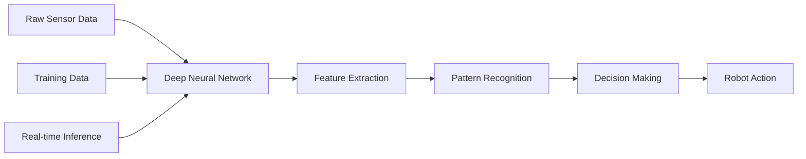

# Deep Learning Perception

Deep learning has revolutionized computer vision and robotics perception. Modern neural networks can recognize objects, understand scenes, and make decisions with unprecedented accuracy and robustness. This section covers how to integrate deep learning models into robotic perception pipelines.

## Deep Learning in Robotics Perception

Deep learning models excel at perception tasks because they can learn complex feature representations directly from data:



### Advantages of Deep Learning

- **End-to-End Learning**: Direct mapping from raw data to decisions
- **Feature Learning**: Automatically discovers relevant features
- **Generalization**: Works across different environments and conditions
- **Robustness**: Handles noisy and incomplete data
- **Scalability**: Can handle complex, high-dimensional data

### Challenges in Robotics

- **Real-time Requirements**: Need fast inference for responsive robots
- **Limited Compute**: Often constrained by power and hardware
- **Safety Critical**: Perception errors can cause accidents
- **Continuous Learning**: Need to adapt to new environments
- **Interpretability**: Need to understand model decisions

## Neural Network Architectures for Perception

### Convolutional Neural Networks (CNNs)

CNNs are the backbone of most computer vision models:

```python
#!/usr/bin/env python3
"""
CNN Perception Node Example
"""
import numpy as np
import cv2
import torch
import torch.nn as nn
import rclpy
from rclpy.node import Node
from sensor_msgs.msg import Image
from cv_bridge import CvBridge
from vision_msgs.msg import Detection2DArray, Detection2D, ObjectHypothesisWithPose

class CNNPerceptionNode(Node):
    def __init__(self):
        super().__init__('cnn_perception_node')

        # Create subscriber
        self.image_sub = self.create_subscription(
            Image, '/camera/image_raw', self.image_callback, 10)

        # Create publisher
        self.detections_pub = self.create_publisher(Detection2DArray, '/cnn_detections', 10)

        # Initialize CV bridge
        self.bridge = CvBridge()

        # Initialize CNN model
        self.model = self.build_cnn_model()

        # Load pre-trained weights (conceptual)
        # self.model.load_state_dict(torch.load('pretrained_weights.pth'))

        # Set device
        self.device = torch.device('cuda' if torch.cuda.is_available() else 'cpu')
        self.model.to(self.device)
        self.model.eval()

        # COCO class names
        self.coco_classes = [
            'person', 'bicycle', 'car', 'motorcycle', 'airplane', 'bus', 'train',
            'truck', 'boat', 'traffic light', 'fire hydrant', 'stop sign',
            'parking meter', 'bench', 'bird', 'cat', 'dog', 'horse', 'sheep',
            'cow', 'elephant', 'bear', 'zebra', 'giraffe', 'backpack', 'umbrella',
            'handbag', 'tie', 'suitcase', 'frisbee', 'skis', 'snowboard',
            'sports ball', 'kite', 'baseball bat', 'baseball glove', 'skateboard',
            'surfboard', 'tennis racket', 'bottle', 'wine glass', 'cup', 'fork',
            'knife', 'spoon', 'bowl', 'banana', 'apple', 'sandwich', 'orange',
            'broccoli', 'carrot', 'hot dog', 'pizza', 'donut', 'cake', 'chair',
            'couch', 'potted plant', 'bed', 'dining table', 'toilet', 'tv',
            'laptop', 'mouse', 'remote', 'keyboard', 'cell phone', 'microwave',
            'oven', 'toaster', 'sink', 'refrigerator', 'book', 'clock', 'vase',
            'scissors', 'teddy bear', 'hair drier', 'toothbrush'
        ]

        # Inference parameters
        self.confidence_threshold = 0.5
        self.nms_threshold = 0.4

        self.get_logger().info('CNN perception node started')

    def build_cnn_model(self):
        """Build a simple CNN model for object detection (conceptual)"""
        # In practice, you would use a pre-trained model like YOLO, SSD, or Faster R-CNN
        # This is a simplified example for illustration

        class SimpleCNN(nn.Module):
            def __init__(self, num_classes=80):
                super(SimpleCNN, self).__init__()

                # Feature extraction layers
                self.conv1 = nn.Conv2d(3, 32, kernel_size=3, padding=1)
                self.bn1 = nn.BatchNorm2d(32)
                self.relu = nn.ReLU(inplace=True)
                self.pool = nn.MaxPool2d(2, 2)

                self.conv2 = nn.Conv2d(32, 64, kernel_size=3, padding=1)
                self.bn2 = nn.BatchNorm2d(64)

                self.conv3 = nn.Conv2d(64, 128, kernel_size=3, padding=1)
                self.bn3 = nn.BatchNorm2d(128)

                # Detection head (simplified)
                self.avgpool = nn.AdaptiveAvgPool2d((1, 1))
                self.classifier = nn.Linear(128, num_classes)

            def forward(self, x):
                x = self.pool(self.relu(self.bn1(self.conv1(x))))
                x = self.pool(self.relu(self.bn2(self.conv2(x))))
                x = self.pool(self.relu(self.bn3(self.conv3(x))))

                x = self.avgpool(x)
                x = torch.flatten(x, 1)
                x = self.classifier(x)

                return x

        return SimpleCNN()

    def preprocess_image(self, image):
        """Preprocess image for CNN input"""
        # Resize image to model input size (e.g., 416x416 for YOLO)
        resized = cv2.resize(image, (416, 416))

        # Convert BGR to RGB
        rgb_image = cv2.cvtColor(resized, cv2.COLOR_BGR2RGB)

        # Normalize pixel values to [0, 1]
        normalized = rgb_image.astype(np.float32) / 255.0

        # Transpose to CHW format (PyTorch expects NCHW)
        chw_image = np.transpose(normalized, (2, 0, 1))

        # Add batch dimension
        batch_image = np.expand_dims(chw_image, axis=0)

        # Convert to PyTorch tensor
        tensor_image = torch.from_numpy(batch_image).float()

        return tensor_image

    def postprocess_detections(self, outputs, original_shape):
        """Post-process model outputs"""
        # This would typically involve:
        # 1. Converting raw outputs to bounding boxes
        # 2. Applying confidence thresholding
        # 3. Non-maximum suppression
        # 4. Scaling back to original image dimensions

        # For this example, return dummy detections
        dummy_detections = [
            {
                'bbox': [50, 50, 100, 100],  # [x, y, width, height]
                'class_id': 0,
                'confidence': 0.8,
                'class_name': 'person'
            }
        ]

        return dummy_detections

    def image_callback(self, msg):
        """Process incoming camera image with CNN"""
        try:
            cv_image = self.bridge.imgmsg_to_cv2(msg, 'bgr8')

            # Preprocess image
            input_tensor = self.preprocess_image(cv_image)
            input_tensor = input_tensor.to(self.device)

            # Run inference
            with torch.no_grad():
                outputs = self.model(input_tensor)

            # Post-process outputs
            detections = self.postprocess_detections(outputs.cpu().numpy(), cv_image.shape)

            # Create and publish detection message
            detection_array = Detection2DArray()
            detection_array.header = msg.header

            for det in detections:
                detection = Detection2D()
                detection.header = msg.header

                # Set bounding box
                bbox = detection.bbox
                bbox.center.x = det['bbox'][0] + det['bbox'][2] / 2
                bbox.center.y = det['bbox'][1] + det['bbox'][3] / 2
                bbox.size_x = det['bbox'][2]
                bbox.size_y = det['bbox'][3]

                # Set classification
                hypothesis = ObjectHypothesisWithPose()
                hypothesis.hypothesis.class_id = str(det['class_id'])
                hypothesis.hypothesis.score = det['confidence']

                detection.results.append(hypothesis)
                detection_array.detections.append(detection)

            # Publish detections
            self.detections_pub.publish(detection_array)

            # Log detection results
            self.get_logger().info(f'CNN detected {len(detections)} objects')

        except Exception as e:
            self.get_logger().error(f'Error in CNN inference: {e}')

def main(args=None):
    rclpy.init(args=args)
    node = CNNPerceptionNode()

    try:
        rclpy.spin(node)
    except KeyboardInterrupt:
        pass
    finally:
        node.destroy_node()
        rclpy.shutdown()

if __name__ == '__main__':
    main()
```

### Recurrent Neural Networks (RNNs) for Sequential Data

```python
#!/usr/bin/env python3
"""
RNN Perception for Sequential Data
"""
import numpy as np
import torch
import torch.nn as nn
import rclpy
from rclpy.node import Node
from sensor_msgs.msg import Image
from geometry_msgs.msg import Twist
from cv_bridge import CvBridge

class RNNPerceptionNode(Node):
    def __init__(self):
        super().__init__('rnn_perception_node')

        # Create subscriber
        self.image_sub = self.create_subscription(
            Image, '/camera/image_raw', self.image_callback, 10)

        # Initialize CV bridge
        self.bridge = CvBridge()

        # RNN model for temporal sequence processing
        self.rnn_model = self.build_rnn_model()

        # Device setup
        self.device = torch.device('cuda' if torch.cuda.is_available() else 'cpu')
        self.rnn_model.to(self.device)
        self.rnn_model.eval()

        # Store temporal sequence
        self.image_sequence = []
        self.max_sequence_length = 10

        self.get_logger().info('RNN perception node started')

    def build_rnn_model(self):
        """Build RNN model for sequential perception"""
        class SequentialPerceptionRNN(nn.Module):
            def __init__(self, input_size=512, hidden_size=256, num_layers=2, num_classes=10):
                super(SequentialPerceptionRNN, self).__init__()

                self.lstm = nn.LSTM(input_size, hidden_size, num_layers, batch_first=True)
                self.fc = nn.Linear(hidden_size, num_classes)

            def forward(self, x):
                # x shape: (batch_size, seq_len, input_size)
                lstm_out, (hidden, cell) = self.lstm(x)

                # Use the last output for classification
                output = self.fc(lstm_out[:, -1, :])

                return output

        return SequentialPerceptionRNN()

    def preprocess_image_for_sequence(self, image):
        """Extract features suitable for sequence processing"""
        # Resize image
        resized = cv2.resize(image, (224, 224))

        # Convert to tensor and normalize
        tensor = torch.from_numpy(resized.astype(np.float32) / 255.0).permute(2, 0, 1).unsqueeze(0)

        # Extract features (simplified - in practice, use a pre-trained CNN backbone)
        features = tensor.mean(dim=[2, 3])  # Global average pooling

        return features

    def image_callback(self, msg):
        """Process incoming camera image as part of sequence"""
        try:
            cv_image = self.bridge.imgmsg_to_cv2(msg, 'bgr8')

            # Extract features
            features = self.preprocess_image_for_sequence(cv_image)

            # Add to sequence
            self.image_sequence.append(features)

            # Maintain sequence length
            if len(self.image_sequence) > self.max_sequence_length:
                self.image_sequence.pop(0)

            # Process sequence if we have enough frames
            if len(self.image_sequence) >= 5:  # Minimum sequence length
                # Stack sequence
                sequence_tensor = torch.stack(self.image_sequence, dim=1).to(self.device)

                # Run RNN inference
                with torch.no_grad():
                    outputs = self.rnn_model(sequence_tensor)

                    # Process outputs
                    probabilities = torch.softmax(outputs, dim=1)
                    predicted_class = torch.argmax(probabilities, dim=1)

                    self.get_logger().info(f'RNN prediction: class {predicted_class.item()}, confidence: {probabilities[0][predicted_class].item():.3f}')

        except Exception as e:
            self.get_logger().error(f'Error in RNN processing: {e}')

def main(args=None):
    rclpy.init(args=args)
    node = RNNPerceptionNode()

    try:
        rclpy.spin(node)
    except KeyboardInterrupt:
        pass
    finally:
        node.destroy_node()
        rclpy.shutdown()

if __name__ == '__main__':
    main()
```

### Vision Transformers (ViTs)

```python
#!/usr/bin/env python3
"""
Vision Transformer Perception Node
"""
import numpy as np
import torch
import torch.nn as nn
import torchvision.transforms as transforms
import rclpy
from rclpy.node import Node
from sensor_msgs.msg import Image
from cv_bridge import CvBridge
from vision_msgs.msg import Detection2DArray

class VisionTransformerNode(Node):
    def __init__(self):
        super().__init__('vit_perception_node')

        # Create subscriber
        self.image_sub = self.create_subscription(
            Image, '/camera/image_raw', self.image_callback, 10)

        # Create publisher
        self.detections_pub = self.create_publisher(Detection2DArray, '/vit_detections', 10)

        # Initialize CV bridge
        self.bridge = CvBridge()

        # Initialize ViT model
        self.vit_model = self.build_vit_model()

        # Device setup
        self.device = torch.device('cuda' if torch.cuda.is_available() else 'cpu')
        self.vit_model.to(self.device)
        self.vit_model.eval()

        # Preprocessing transform
        self.transform = transforms.Compose([
            transforms.ToTensor(),
            transforms.Resize((224, 224)),
            transforms.Normalize(mean=[0.485, 0.456, 0.406],
                               std=[0.229, 0.224, 0.225])
        ])

        self.get_logger().info('Vision Transformer perception node started')

    def build_vit_model(self):
        """Build a Vision Transformer model (conceptual)"""
        # In practice, you would use a pre-trained model from torchvision or transformers
        # This is a simplified example

        class SimpleVisionTransformer(nn.Module):
            def __init__(self, image_size=224, patch_size=16, num_classes=1000, dim=768, depth=12, heads=12):
                super().__init__()

                assert image_size % patch_size == 0, 'Image dimensions must be divisible by patch size'

                num_patches = (image_size // patch_size) ** 2
                patch_dim = 3 * patch_size * patch_size

                self.patch_size = patch_size

                self.to_patch_embedding = nn.Sequential(
                    nn.Linear(patch_dim, dim),
                    nn.LayerNorm(dim)
                )

                self.pos_embedding = nn.Parameter(torch.randn(1, num_patches + 1, dim))
                self.cls_token = nn.Parameter(torch.randn(1, 1, dim))

                self.transformer = nn.TransformerEncoder(
                    nn.TransformerEncoderLayer(d_model=dim, nhead=heads, batch_first=True),
                    num_layers=depth
                )

                self.to_latent = nn.Identity()
                self.mlp_head = nn.Sequential(
                    nn.LayerNorm(dim),
                    nn.Linear(dim, num_classes)
                )

            def forward(self, img):
                batch_size, channels, height, width = img.shape
                assert height == width, 'Input image must be square'

                patch_size = self.patch_size
                assert height % patch_size == 0, 'Image dimensions must be divisible by patch size'

                num_patches = (height // patch_size) ** 2
                patch_dim = channels * patch_size * patch_size

                # Reshape image into patches
                img_patches = img.unfold(2, patch_size, patch_size).unfold(3, patch_size, patch_size)
                img_patches = img_patches.contiguous().view(batch_size, channels, num_patches, patch_size, patch_size)
                img_patches = img_patches.permute(0, 2, 1, 3, 4).contiguous().view(batch_size, num_patches, patch_dim)

                # Embed patches
                x = self.to_patch_embedding(img_patches)

                # Add class token and positional embedding
                cls_tokens = self.cls_token.expand(batch_size, -1, -1)
                x = torch.cat((cls_tokens, x), dim=1)
                x += self.pos_embedding[:, :(num_patches + 1)]

                # Apply transformer
                x = self.transformer(x)

                # Use class token for classification
                x = x[:, 0]

                x = self.to_latent(x)
                return self.mlp_head(x)

        return SimpleVisionTransformer()

    def image_callback(self, msg):
        """Process incoming camera image with Vision Transformer"""
        try:
            cv_image = self.bridge.imgmsg_to_cv2(msg, 'bgr8')

            # Preprocess image
            input_tensor = self.transform(cv_image).unsqueeze(0).to(self.device)

            # Run inference
            with torch.no_grad():
                outputs = self.vit_model(input_tensor)

                # Process outputs
                probabilities = torch.softmax(outputs, dim=1)
                predicted_class = torch.argmax(probabilities, dim=1)

                self.get_logger().info(f'ViT prediction: class {predicted_class.item()}, confidence: {probabilities[0][predicted_class].item():.3f}')

        except Exception as e:
            self.get_logger().error(f'Error in ViT inference: {e}')

def main(args=None):
    rclpy.init(args=args)
    node = VisionTransformerNode()

    try:
        rclpy.spin(node)
    except KeyboardInterrupt:
        pass
    finally:
        node.destroy_node()
        rclpy.shutdown()

if __name__ == '__main__':
    main()
```

## Object Detection with Deep Learning

### YOLO Integration

```python
#!/usr/bin/env python3
"""
YOLO Object Detection Node
"""
import numpy as np
import cv2
import torch
import rclpy
from rclpy.node import Node
from sensor_msgs.msg import Image
from cv_bridge import CvBridge
from vision_msgs.msg import Detection2DArray, Detection2D, ObjectHypothesisWithPose

class YOLODetectionNode(Node):
    def __init__(self):
        super().__init__('yolo_detection_node')

        # Create subscriber
        self.image_sub = self.create_subscription(
            Image, '/camera/image_raw', self.image_callback, 10)

        # Create publisher
        self.detections_pub = self.create_publisher(Detection2DArray, '/yolo_detections', 10)

        # Initialize CV bridge
        self.bridge = CvBridge()

        # YOLO model parameters
        self.input_width = 640
        self.input_height = 640
        self.conf_threshold = 0.5
        self.nms_threshold = 0.4

        # COCO dataset class names
        self.classes = [
            'person', 'bicycle', 'car', 'motorcycle', 'airplane', 'bus', 'train',
            'truck', 'boat', 'traffic light', 'fire hydrant', 'stop sign',
            'parking meter', 'bench', 'bird', 'cat', 'dog', 'horse', 'sheep',
            'cow', 'elephant', 'bear', 'zebra', 'giraffe', 'backpack', 'umbrella',
            'handbag', 'tie', 'suitcase', 'frisbee', 'skis', 'snowboard',
            'sports ball', 'kite', 'baseball bat', 'baseball glove', 'skateboard',
            'surfboard', 'tennis racket', 'bottle', 'wine glass', 'cup', 'fork',
            'knife', 'spoon', 'bowl', 'banana', 'apple', 'sandwich', 'orange',
            'broccoli', 'carrot', 'hot dog', 'pizza', 'donut', 'cake', 'chair',
            'couch', 'potted plant', 'bed', 'dining table', 'toilet', 'tv',
            'laptop', 'mouse', 'remote', 'keyboard', 'cell phone', 'microwave',
            'oven', 'toaster', 'sink', 'refrigerator', 'book', 'clock', 'vase',
            'scissors', 'teddy bear', 'hair drier', 'toothbrush'
        ]

        # Load YOLO model (conceptual - in practice, load actual model)
        self.load_yolo_model()

        self.get_logger().info('YOLO detection node started')

    def load_yolo_model(self):
        """Load YOLO model (conceptual)"""
        # In practice, you would load a pre-trained YOLO model here
        # This could be via PyTorch Hub, OpenCV DNN, or TensorRT
        pass

    def preprocess_image(self, image):
        """Preprocess image for YOLO inference"""
        # Resize image while maintaining aspect ratio
        height, width = image.shape[:2]
        scale = min(self.input_width / width, self.input_height / height)

        new_width = int(width * scale)
        new_height = int(height * scale)

        resized = cv2.resize(image, (new_width, new_height))

        # Pad image to maintain input size
        padded = np.full((self.input_height, self.input_width, 3), 128, dtype=np.uint8)
        pad_top = (self.input_height - new_height) // 2
        pad_bottom = self.input_height - new_height - pad_top
        pad_left = (self.input_width - new_width) // 2
        pad_right = self.input_width - new_width - pad_left

        padded[pad_top:pad_top+new_height, pad_left:pad_left+new_width] = resized

        # Convert to RGB and normalize
        rgb_image = cv2.cvtColor(padded, cv2.COLOR_BGR2RGB)
        normalized = rgb_image.astype(np.float32) / 255.0

        # Transpose to CHW format
        chw_image = np.transpose(normalized, (2, 0, 1))

        # Add batch dimension
        batch_image = np.expand_dims(chw_image, axis=0)

        return batch_image, (scale, pad_top, pad_left)

    def post_process_outputs(self, outputs, image_shape, preprocessing_params):
        """Post-process YOLO outputs"""
        # This function would typically:
        # 1. Decode bounding boxes from model outputs
        # 2. Apply confidence thresholding
        # 3. Perform non-maximum suppression
        # 4. Scale bounding boxes back to original image size

        # For this example, return dummy detections
        detections = []

        # Example of what real post-processing would do:
        # scale, pad_top, pad_left = preprocessing_params
        # original_height, original_width = image_shape[:2]

        # Process outputs...
        # Apply NMS...
        # Scale back to original size...

        # For demonstration, return some dummy detections
        if np.random.random() > 0.7:  # Sometimes return detections
            detections = [
                {
                    'bbox': [100, 100, 200, 150],  # [x, y, width, height]
                    'class_id': 0,
                    'confidence': 0.85,
                    'class_name': 'person'
                },
                {
                    'bbox': [300, 200, 150, 100],
                    'class_id': 1,
                    'confidence': 0.78,
                    'class_name': 'bicycle'
                }
            ]

        return detections

    def image_callback(self, msg):
        """Process incoming camera image with YOLO"""
        try:
            cv_image = self.bridge.imgmsg_to_cv2(msg, 'bgr8')

            # Preprocess image
            input_tensor, preprocessing_params = self.preprocess_image(cv_image)

            # Run YOLO inference (conceptual)
            # In practice, this would be: outputs = self.yolo_model(input_tensor)
            # For this example, we'll simulate outputs
            outputs = np.random.rand(1, 85, 8400)  # Simulated YOLOv8 outputs

            # Post-process outputs
            detections = self.post_process_outputs(outputs, cv_image.shape, preprocessing_params)

            # Create and publish detection message
            detection_array = Detection2DArray()
            detection_array.header = msg.header

            for det in detections:
                detection = Detection2D()
                detection.header = msg.header

                # Set bounding box
                bbox = detection.bbox
                bbox.center.x = det['bbox'][0] + det['bbox'][2] / 2
                bbox.center.y = det['bbox'][1] + det['bbox'][3] / 2
                bbox.size_x = det['bbox'][2]
                bbox.size_y = det['bbox'][3]

                # Set classification
                hypothesis = ObjectHypothesisWithPose()
                hypothesis.hypothesis.class_id = str(det['class_id'])
                hypothesis.hypothesis.score = det['confidence']

                detection.results.append(hypothesis)
                detection_array.detections.append(detection)

            # Publish detections
            self.detections_pub.publish(detection_array)

            # Log detection results
            self.get_logger().info(f'YOLO detected {len(detections)} objects')

        except Exception as e:
            self.get_logger().error(f'Error in YOLO detection: {e}')

def main(args=None):
    rclpy.init(args=args)
    node = YOLODetectionNode()

    try:
        rclpy.spin(node)
    except KeyboardInterrupt:
        pass
    finally:
        node.destroy_node()
        rclpy.shutdown()

if __name__ == '__main__':
    main()
```

### Instance Segmentation

```python
#!/usr/bin/env python3
"""
Instance Segmentation Node
"""
import numpy as np
import cv2
import torch
import rclpy
from rclpy.node import Node
from sensor_msgs.msg import Image
from cv_bridge import CvBridge
from vision_msgs.msg import Detection2DArray
from sensor_msgs.msg import CompressedImage

class InstanceSegmentationNode(Node):
    def __init__(self):
        super().__init__('instance_segmentation_node')

        # Create subscriber
        self.image_sub = self.create_subscription(
            Image, '/camera/image_raw', self.image_callback, 10)

        # Create publisher for segmented images
        self.segmented_pub = self.create_publisher(CompressedImage, '/segmented_image', 10)

        # Initialize CV bridge
        self.bridge = CvBridge()

        # Initialize segmentation model
        self.segmentation_model = self.build_segmentation_model()

        # Device setup
        self.device = torch.device('cuda' if torch.cuda.is_available() else 'cpu')
        self.segmentation_model.to(self.device)
        self.segmentation_model.eval()

        # Color palette for segmentation masks
        self.colors = np.random.randint(0, 255, size=(80, 3), dtype=np.uint8)

        self.get_logger().info('Instance segmentation node started')

    def build_segmentation_model(self):
        """Build segmentation model (conceptual)"""
        # In practice, you would use Mask R-CNN, YOLACT, or similar
        # This is a simplified example

        class SimpleSegmentation(nn.Module):
            def __init__(self, num_classes=80):
                super(SimpleSegmentation, self).__init__()

                # Feature extractor
                self.backbone = nn.Sequential(
                    nn.Conv2d(3, 64, 3, padding=1),
                    nn.ReLU(),
                    nn.Conv2d(64, 128, 3, padding=1),
                    nn.ReLU(),
                    nn.Conv2d(128, 256, 3, padding=1),
                    nn.ReLU()
                )

                # Classification head
                self.classifier = nn.Conv2d(256, num_classes, 1)

                # Segmentation head
                self.mask_head = nn.Conv2d(256, num_classes, 1)

            def forward(self, x):
                features = self.backbone(x)
                class_scores = self.classifier(features)
                masks = self.mask_head(features)

                return class_scores, masks

        return SimpleSegmentation()

    def image_callback(self, msg):
        """Process incoming camera image with instance segmentation"""
        try:
            cv_image = self.bridge.imgmsg_to_cv2(msg, 'bgr8')

            # Preprocess image
            height, width = cv_image.shape[:2]
            resized = cv2.resize(cv_image, (416, 416))
            normalized = resized.astype(np.float32) / 255.0
            chw_image = np.transpose(normalized, (2, 0, 1))
            batch_image = np.expand_dims(chw_image, axis=0)
            input_tensor = torch.from_numpy(batch_image).float().to(self.device)

            # Run segmentation inference
            with torch.no_grad():
                class_scores, masks = self.segmentation_model(input_tensor)

                # Process outputs (conceptual)
                # In practice, you would decode masks, apply thresholds, etc.

                # For this example, create a dummy segmentation result
                # and overlay it on the original image
                segmented_overlay = self.create_segmentation_overlay(cv_image, masks)

            # Publish segmented image
            compressed_msg = CompressedImage()
            compressed_msg.header = msg.header
            compressed_msg.format = "jpeg"
            compressed_msg.data = np.array(cv2.imencode('.jpg', segmented_overlay)[1]).tobytes()

            self.segmented_pub.publish(compressed_msg)

            self.get_logger().info('Instance segmentation completed')

        except Exception as e:
            self.get_logger().error(f'Error in segmentation: {e}')

    def create_segmentation_overlay(self, original_image, masks):
        """Create segmentation overlay on original image"""
        # In a real implementation, this would process the actual segmentation outputs
        # For this example, we'll create a simple overlay

        overlay = original_image.copy()

        # Create dummy masks for visualization
        height, width = original_image.shape[:2]

        # Draw some random rectangles as dummy segments
        for i in range(3):
            x = np.random.randint(0, width - 100)
            y = np.random.randint(0, height - 100)
            w = np.random.randint(50, 100)
            h = np.random.randint(50, 100)

            color = [int(c) for c in self.colors[i]]
            cv2.rectangle(overlay, (x, y), (x + w, y + h), color, 2)
            cv2.putText(overlay, f'Obj {i}', (x, y - 10), cv2.FONT_HERSHEY_SIMPLEX, 0.5, color, 2)

        return overlay

def main(args=None):
    rclpy.init(args=args)
    node = InstanceSegmentationNode()

    try:
        rclpy.spin(node)
    except KeyboardInterrupt:
        pass
    finally:
        node.destroy_node()
        rclpy.shutdown()

if __name__ == '__main__':
    main()
```

## Deep Learning Framework Integration

### PyTorch Integration

```python
#!/usr/bin/env python3
"""
PyTorch Integration Node
"""
import numpy as np
import torch
import torch.nn as nn
import torchvision.models as models
import rclpy
from rclpy.node import Node
from sensor_msgs.msg import Image
from cv_bridge import CvBridge
from std_msgs.msg import Float32MultiArray

class PyTorchIntegrationNode(Node):
    def __init__(self):
        super().__init__('pytorch_integration_node')

        # Create subscriber
        self.image_sub = self.create_subscription(
            Image, '/camera/image_raw', self.image_callback, 10)

        # Create publisher for embeddings
        self.embedding_pub = self.create_publisher(Float32MultiArray, '/image_embeddings', 10)

        # Initialize CV bridge
        self.bridge = CvBridge()

        # Load pre-trained model (ResNet as example)
        self.model = models.resnet50(pretrained=True)

        # Remove final classifier layer to get feature embeddings
        self.feature_extractor = nn.Sequential(*list(self.model.children())[:-1])

        # Set device
        self.device = torch.device('cuda' if torch.cuda.is_available() else 'cpu')
        self.feature_extractor.to(self.device)
        self.feature_extractor.eval()

        # Preprocessing transforms
        self.preprocess = torch.nn.functional.interpolate

        self.get_logger().info('PyTorch integration node started')

    def image_callback(self, msg):
        """Process incoming camera image with PyTorch model"""
        try:
            cv_image = self.bridge.imgmsg_to_cv2(msg, 'bgr8')

            # Preprocess image
            # Convert to tensor and normalize
            tensor = torch.from_numpy(cv_image).float().permute(2, 0, 1).unsqueeze(0) / 255.0
            tensor = tensor.to(self.device)

            # Resize to model input size (224x224 for ResNet)
            resized_tensor = torch.nn.functional.interpolate(tensor, size=(224, 224), mode='bilinear', align_corners=False)

            # Normalize with ImageNet stats
            mean = torch.tensor([0.485, 0.456, 0.406]).view(1, 3, 1, 1).to(self.device)
            std = torch.tensor([0.229, 0.224, 0.225]).view(1, 3, 1, 1).to(self.device)
            normalized_tensor = (resized_tensor - mean) / std

            # Extract features
            with torch.no_grad():
                features = self.feature_extractor(normalized_tensor)

                # Flatten features
                flattened_features = features.view(features.size(0), -1)

                # Convert to numpy for ROS message
                features_np = flattened_features.cpu().numpy()[0]  # Remove batch dimension

                # Publish embedding
                embedding_msg = Float32MultiArray()
                embedding_msg.layout.dim = [
                    Float32MultiArray.DIMENSION_LABELS,
                    Float32MultiArray.DIMENSION_SIZES,
                    Float32MultiArray.DIMENSION_STRIDES
                ]
                embedding_msg.data = features_np.tolist()

                self.embedding_pub.publish(embedding_msg)

                self.get_logger().info(f'Published image embedding with {len(features_np)} dimensions')

        except Exception as e:
            self.get_logger().error(f'Error in PyTorch inference: {e}')

def main(args=None):
    rclpy.init(args=args)
    node = PyTorchIntegrationNode()

    try:
        rclpy.spin(node)
    except KeyboardInterrupt:
        pass
    finally:
        node.destroy_node()
        rclpy.shutdown()

if __name__ == '__main__':
    main()
```

### TensorFlow Integration

```python
#!/usr/bin/env python3
"""
TensorFlow Integration Node
"""
import numpy as np
import tensorflow as tf
import rclpy
from rclpy.node import Node
from sensor_msgs.msg import Image
from cv_bridge import CvBridge
from std_msgs.msg import Float32MultiArray

class TensorFlowIntegrationNode(Node):
    def __init__(self):
        super().__init__('tensorflow_integration_node')

        # Create subscriber
        self.image_sub = self.create_subscription(
            Image, '/camera/image_raw', self.image_callback, 10)

        # Create publisher for predictions
        self.prediction_pub = self.create_publisher(Float32MultiArray, '/tf_predictions', 10)

        # Initialize CV bridge
        self.bridge = CvBridge()

        # Load TensorFlow model (MobileNet as example)
        self.model = tf.keras.applications.MobileNetV2(
            weights='imagenet',
            include_top=True
        )

        # Preprocessing function
        self.preprocess_input = tf.keras.applications.mobilenet_v2.preprocess_input

        self.get_logger().info('TensorFlow integration node started')

    def image_callback(self, msg):
        """Process incoming camera image with TensorFlow model"""
        try:
            cv_image = self.bridge.imgmsg_to_cv2(msg, 'bgr8')

            # Preprocess image
            resized = tf.image.resize(cv_image, [224, 224])
            batch_image = tf.expand_dims(resized, 0)
            preprocessed = self.preprocess_input(batch_image)

            # Run inference
            predictions = self.model.predict(preprocessed)

            # Get top predictions
            top_indices = tf.nn.top_k(predictions[0], k=5).indices.numpy()
            top_scores = tf.nn.top_k(predictions[0], k=5).values.numpy()

            # Create prediction message
            pred_msg = Float32MultiArray()
            pred_msg.data = top_scores.tolist()

            self.prediction_pub.publish(pred_msg)

            # Log top predictions
            imagenet_labels = tf.keras.applications.mobilenet_v2.decode_predictions(
                predictions, top=5
            )[0]

            for i, (class_id, name, score) in enumerate(imagenet_labels):
                self.get_logger().info(f'Top {i+1}: {name} ({score:.3f})')

        except Exception as e:
            self.get_logger().error(f'Error in TensorFlow inference: {e}')

def main(args=None):
    rclpy.init(args=args)
    node = TensorFlowIntegrationNode()

    try:
        rclpy.spin(node)
    except KeyboardInterrupt:
        pass
    finally:
        node.destroy_node()
        rclpy.shutdown()

if __name__ == '__main__':
    main()
```

## Performance Optimization

### Model Quantization

```python
#!/usr/bin/env python3
"""
Quantized Model Node
"""
import numpy as np
import torch
import torch.nn as nn
import rclpy
from rclpy.node import Node
from sensor_msgs.msg import Image
from cv_bridge import CvBridge

class QuantizedModelNode(Node):
    def __init__(self):
        super().__init__('quantized_model_node')

        # Create subscriber
        self.image_sub = self.create_subscription(
            Image, '/camera/image_raw', self.image_callback, 10)

        # Initialize CV bridge
        self.bridge = CvBridge()

        # Build and quantize model
        self.original_model = self.build_model()
        self.quantized_model = self.quantize_model(self.original_model)

        # Device setup
        self.device = torch.device('cpu')  # Quantized models often run on CPU
        self.quantized_model.to(self.device)
        self.quantized_model.eval()

        self.get_logger().info('Quantized model node started')

    def build_model(self):
        """Build original model"""
        class SimpleModel(nn.Module):
            def __init__(self):
                super().__init__()
                self.conv1 = nn.Conv2d(3, 16, 3, padding=1)
                self.relu = nn.ReLU()
                self.pool = nn.MaxPool2d(2, 2)
                self.conv2 = nn.Conv2d(16, 32, 3, padding=1)
                self.fc = nn.Linear(32 * 56 * 56, 10)

            def forward(self, x):
                x = self.pool(self.relu(self.conv1(x)))
                x = self.pool(self.relu(self.conv2(x)))
                x = x.view(x.size(0), -1)
                x = self.fc(x)
                return x

        return SimpleModel()

    def quantize_model(self, model):
        """Quantize model for improved performance"""
        # Set model to evaluation mode
        model.eval()

        # Fuse conv + relu layers for better quantization
        model = torch.quantization.fuse_modules(model, [['conv1', 'relu'], ['conv2', 'relu']])

        # Specify quantization configuration
        model.qconfig = torch.quantization.get_default_qconfig('fbgemm')

        # Prepare model for quantization
        model_prepared = torch.quantization.prepare(model)

        # Calibrate model with sample data (in real scenario)
        # For this example, we'll skip calibration and go directly to conversion

        # Convert to quantized model
        model_quantized = torch.quantization.convert(model_prepared)

        return model_quantized

    def image_callback(self, msg):
        """Process image with quantized model"""
        try:
            cv_image = self.bridge.imgmsg_to_cv2(msg, 'bgr8')

            # Preprocess image
            resized = cv2.resize(cv_image, (224, 224))
            normalized = resized.astype(np.float32) / 255.0
            chw_image = np.transpose(normalized, (2, 0, 1))
            batch_image = np.expand_dims(chw_image, axis=0)
            input_tensor = torch.from_numpy(batch_image).float().to(self.device)

            # Run quantized inference
            with torch.no_grad():
                start_time = time.time()
                outputs = self.quantized_model(input_tensor)
                inference_time = time.time() - start_time

                self.get_logger().info(f'Quantized inference took {inference_time:.3f}s')

        except Exception as e:
            self.get_logger().error(f'Error in quantized inference: {e}')

def main(args=None):
    rclpy.init(args=args)
    node = QuantizedModelNode()

    try:
        rclpy.spin(node)
    except KeyboardInterrupt:
        pass
    finally:
        node.destroy_node()
        rclpy.shutdown()

if __name__ == '__main__':
    main()
```

### TensorRT Integration (NVIDIA GPUs)

```python
#!/usr/bin/env python3
"""
TensorRT Integration Node (NVIDIA GPUs)
"""
import numpy as np
import rclpy
from rclpy.node import Node
from sensor_msgs.msg import Image
from cv_bridge import CvBridge

class TensorRTNode(Node):
    def __init__(self):
        super().__init__('tensorrt_node')

        # Create subscriber
        self.image_sub = self.create_subscription(
            Image, '/camera/image_raw', self.image_callback, 10)

        # Initialize CV bridge
        self.bridge = CvBridge()

        # Initialize TensorRT engine
        self.trt_engine = self.initialize_tensorrt()

        self.get_logger().info('TensorRT node started')

    def initialize_tensorrt(self):
        """Initialize TensorRT engine (conceptual)"""
        # In practice, you would load a TensorRT engine file
        # This requires NVIDIA GPU and TensorRT installation
        try:
            import tensorrt as trt
            # Engine loading code would go here
            return None  # Placeholder
        except ImportError:
            self.get_logger().warn('TensorRT not available, using CPU inference')
            return None

    def image_callback(self, msg):
        """Process image with TensorRT (if available)"""
        try:
            cv_image = self.bridge.imgmsg_to_cv2(msg, 'bgr8')

            if self.trt_engine:
                # Run TensorRT inference
                # This would involve copying data to GPU, running inference, etc.
                pass
            else:
                # Fallback to CPU inference
                # Process with regular PyTorch/TensorFlow model
                pass

        except Exception as e:
            self.get_logger().error(f'Error in TensorRT processing: {e}')

def main(args=None):
    rclpy.init(args=args)
    node = TensorRTNode()

    try:
        rclpy.spin(node)
    except KeyboardInterrupt:
        pass
    finally:
        node.destroy_node()
        rclpy.shutdown()

if __name__ == '__main__':
    main()
```

## Best Practices

### 1. Model Deployment Best Practices

```python
# Good: Efficient model deployment
def deploy_efficient_model():
    """Deploy model with optimization considerations"""
    # Use appropriate precision (FP16, INT8) when possible
    # Optimize for target hardware
    # Use model compression techniques
    # Implement proper error handling
    pass

# Bad: Naive model deployment
def deploy_naive_model():
    """Deploy model without optimization"""
    # Use FP32 unnecessarily
    # No hardware optimization
    # No error handling
    # Large model without compression
    pass
```

### 2. Memory Management

```python
# Good: Efficient memory management
def efficient_memory_management():
    """Manage memory efficiently for deep learning"""
    # Use torch.no_grad() for inference
    # Delete unused tensors
    # Use appropriate batch sizes
    # Clear GPU cache when needed
    pass

# Bad: Poor memory management
def poor_memory_management():
    """Poor memory management leading to OOM"""
    # Keep all intermediate results
    # Large batch sizes causing OOM
    # No memory cleanup
    pass
```

### 3. Real-time Performance

```python
# Good: Real-time performance optimization
def optimize_for_realtime():
    """Optimize for real-time performance"""
    # Use optimized models (e.g., MobileNet, EfficientNet)
    # Implement frame skipping if needed
    # Use threading for preprocessing/postprocessing
    # Profile and optimize bottlenecks
    pass

# Bad: No performance consideration
def no_performance_consideration():
    """No performance optimization"""
    # Use heavy models for real-time
    # No frame rate management
    # Blocking operations
    pass
```

## Common Issues and Troubleshooting

### 1. GPU Memory Issues

```python
# Solution: Proper memory management
def handle_gpu_memory():
    """Handle GPU memory issues"""
    import torch
    if torch.cuda.is_available():
        torch.cuda.empty_cache()  # Clear GPU cache
        # Use smaller batch sizes
        # Implement gradient checkpointing
        pass
```

### 2. Model Accuracy Issues

```python
# Solution: Proper model validation
def validate_model_accuracy():
    """Validate model accuracy"""
    # Test on diverse datasets
    # Monitor performance metrics
    # Handle domain shift
    # Implement confidence thresholds
    pass
```

### 3. Performance Issues

```python
# Solution: Performance profiling
def profile_performance():
    """Profile model performance"""
    # Use torch.profiler
    # Monitor inference time
    # Optimize bottlenecks
    # Use appropriate hardware
    pass
```

## Next Steps

Now that you understand deep learning perception, continue to [Perception Pipeline Integration](../week-09/pipeline-integration) to learn how to integrate perception components into complete robotic systems.

## Exercises

1. Implement a custom neural network for object detection
2. Create a perception pipeline with multiple deep learning models
3. Optimize a model for real-time inference on edge hardware
4. Build a system that combines traditional computer vision with deep learning