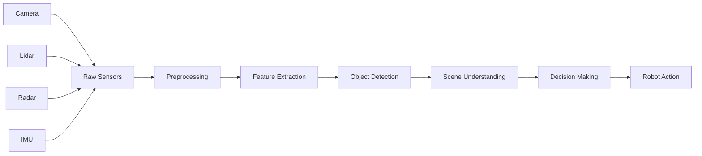

# Introduction to Perception Pipeline

Welcome to Week 9 of Module 3: The AI Robot Brain. In this week, you'll learn about **Perception Pipelines** - the critical systems that enable robots to understand and interpret their environment through sensors, computer vision, and machine learning.

## What is a Perception Pipeline?

A **Perception Pipeline** is a sequence of processing steps that transforms raw sensor data into meaningful information that robots can use for navigation, manipulation, and decision-making. The pipeline typically includes:

- **Sensor Processing**: Raw data acquisition and preprocessing
- **Feature Extraction**: Identifying relevant patterns in data
- **Object Detection**: Locating and classifying objects
- **Scene Understanding**: Interpreting the overall environment
- **Decision Making**: Using perception data for robot actions



## Why Perception Pipelines Matter

Perception pipelines address critical challenges in robotics:

| Challenge | Perception Solution |
|-----------|-------------------|
| **Environment Understanding** | Convert sensor data to meaningful representations |
| **Object Recognition** | Identify and classify objects in the environment |
| **Scene Interpretation** | Understand spatial relationships and contexts |
| **Real-time Processing** | Process data quickly for reactive behavior |
| **Robustness** | Handle varied lighting, weather, and conditions |
| **Integration** | Combine multiple sensor modalities effectively |

## Perception Pipeline Architecture

Modern perception pipelines follow these architectural principles:

### Multi-Modal Sensing
- **Cameras**: Visual information and color
- **LiDAR**: Precise 3D geometry and distances
- **Radar**: All-weather sensing and velocity
- **Sonar**: Short-range obstacle detection
- **Thermal**: Heat signatures and night vision

### Hierarchical Processing
- **Low-level**: Raw sensor data and basic features
- **Mid-level**: Object proposals and region analysis
- **High-level**: Scene understanding and reasoning
- **Decision Level**: Action selection and planning

### Parallel Processing
- **Concurrent Streams**: Multiple processing paths
- **Temporal Fusion**: Combining data over time
- **Spatial Fusion**: Combining data from different sensors
- **Model Ensemble**: Multiple models for robustness

## Core Technologies

### Computer Vision
- **Traditional CV**: Edge detection, feature matching, optical flow
- **Deep Learning**: CNNs, transformers, attention mechanisms
- **Geometric Vision**: Camera calibration, stereo vision, SFM
- **Video Processing**: Temporal consistency, tracking, segmentation

### Machine Learning
- **Supervised Learning**: Classification, regression, detection
- **Unsupervised Learning**: Clustering, anomaly detection
- **Reinforcement Learning**: Decision-making policies
- **Self-supervised Learning**: Learning without labeled data

### Sensor Fusion
- **Kalman Filters**: Tracking and state estimation
- **Particle Filters**: Multi-modal state estimation
- **Bayesian Networks**: Probabilistic reasoning
- **Deep Fusion**: Neural networks for sensor combination

## Perception Pipeline Components

### 1. Data Acquisition
- **Sensor Drivers**: Low-level hardware interfaces
- **Synchronization**: Temporal alignment of sensors
- **Calibration**: Spatial relationship determination
- **Preprocessing**: Noise reduction and normalization

### 2. Feature Processing
- **Edge Detection**: Boundary identification
- **Keypoint Detection**: Stable point identification
- **Descriptor Extraction**: Feature representation
- **Template Matching**: Pattern recognition

### 3. Object Detection
- **Classification**: Object category identification
- **Localization**: Object position determination
- **Segmentation**: Pixel-level object boundaries
- **Tracking**: Object movement over time

### 4. Scene Understanding
- **Semantic Segmentation**: Scene labeling
- **Instance Segmentation**: Individual object identification
- **Panoptic Segmentation**: Unified semantic and instance
- **3D Reconstruction**: Spatial scene modeling

## Setting Up Perception Systems

Before proceeding, ensure your development environment includes:

```bash
# Check for required dependencies
ros2 pkg list | grep -E "(vision|camera|image|lidar)"

# Verify OpenCV installation
python3 -c "import cv2; print(cv2.__version__)"

# Check for deep learning frameworks
python3 -c "import torch; print(torch.__version__)"
python3 -c "import tensorflow as tf; print(tf.__version__)"

# Verify sensor drivers
ros2 run camera_calibration cameracalibrator --size 8x6 --square 0.108
```

## Perception in ROS 2

ROS 2 provides extensive perception capabilities:

- **image_pipeline**: Image processing and camera calibration
- **vision_opencv**: OpenCV integration
- **depth_image_proc**: Depth processing
- **laser_filters**: LiDAR processing
- **pointcloud_filters**: Point cloud processing
- **object_recognition_msgs**: Object recognition interfaces
- **perception**: Generic perception tools

## Module Learning Objectives

By the end of this week, you will be able to:

1. **Design** perception pipelines for specific robot applications
2. **Implement** computer vision algorithms for robot perception
3. **Integrate** multiple sensor modalities for robust perception
4. **Deploy** machine learning models for object detection
5. **Optimize** perception systems for real-time performance
6. **Validate** perception accuracy and robustness
7. **Troubleshoot** common perception pipeline issues

## Prerequisites

- Basic computer vision knowledge (features, detection, tracking)
- Understanding of 3D geometry and transformations
- ROS 2 fundamentals (topics, TF, sensors)
- Completed Module 1-3 of this curriculum
- Basic Python and C++ programming skills
- Understanding of machine learning concepts

## Perception Pipeline Best Practices

### 1. Data Quality Management
- **Calibration**: Regular sensor calibration
- **Validation**: Data quality checks
- **Filtering**: Noise reduction
- **Normalization**: Consistent data formats

### 2. Real-time Performance
- **Efficiency**: Optimized algorithms
- **Threading**: Parallel processing
- **Memory**: Efficient data structures
- **Hardware**: GPU acceleration where possible

### 3. Robustness
- **Redundancy**: Multiple sensors when possible
- **Validation**: Cross-check results
- **Fallbacks**: Graceful degradation
- **Testing**: Varied conditions

### 4. Scalability
- **Modularity**: Reusable components
- **Configurability**: Adaptable parameters
- **Extensibility**: Easy to add new sensors
- **Maintenance**: Clear documentation

## Next Steps

Continue to [Computer Vision Fundamentals](./computer-vision) to learn about core computer vision techniques for robotics.

## Resources

- [OpenCV Documentation](https://docs.opencv.org/)
- [ROS 2 Perception Tutorials](http://wiki.ros.org/perception)
- [Computer Vision Resources](https://www.cs.ubc.ca/~lowe/vision.html)
- [Deep Learning for Vision](https://cs231n.stanford.edu/)
- [Perception Pipeline Design Patterns](https://arxiv.org/abs/2001.04032)