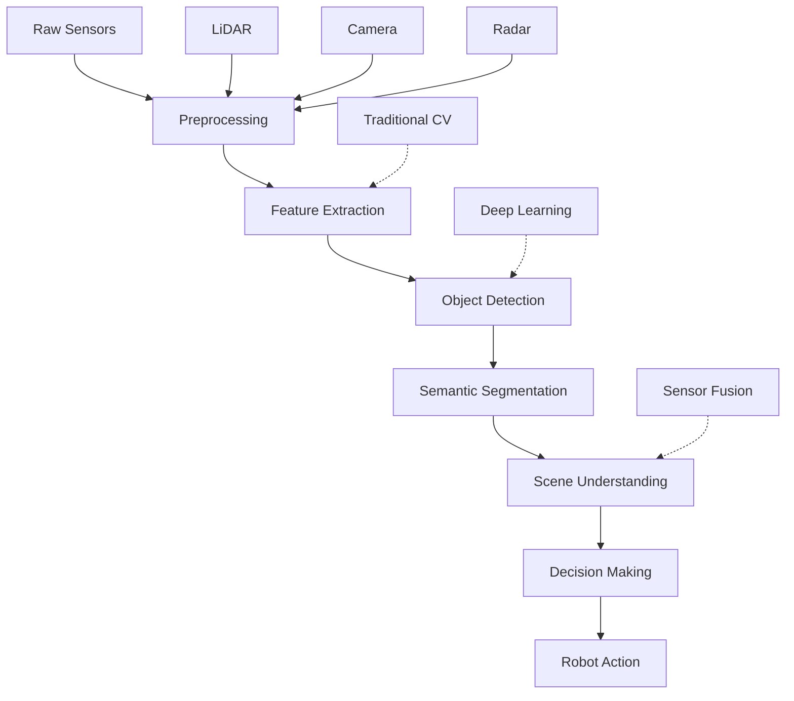

# Perception Pipeline Integration

Perception pipeline integration involves connecting multiple perception components to create a cohesive system that processes sensor data end-to-end. This section covers how to combine traditional computer vision, deep learning models, and sensor fusion to build robust perception systems.

## Perception Pipeline Architecture

A complete perception pipeline typically follows this architecture:



## Modular Perception System Design

### Perception Component Interface

```python
#!/usr/bin/env python3
"""
Perception Component Interface
"""
import rclpy
from rclpy.node import Node
from sensor_msgs.msg import Image, PointCloud2, LaserScan
from cv_bridge import CvBridge
from std_msgs.msg import Header
from typing import Dict, Any, Optional
import abc

class PerceptionComponent(abc.ABC):
    """Abstract base class for perception components"""

    def __init__(self, node: Node, name: str):
        self.node = node
        self.name = name
        self.bridge = CvBridge()

    @abc.abstractmethod
    def process(self, data: Any) -> Dict[str, Any]:
        """Process input data and return results"""
        pass

    @abc.abstractmethod
    def configure(self, params: Dict[str, Any]) -> bool:
        """Configure the component with parameters"""
        pass

class FeatureExtractor(PerceptionComponent):
    """Feature extraction component"""

    def __init__(self, node: Node, name: str = "feature_extractor"):
        super().__init__(node, name)
        self.feature_params = {}

    def process(self, image: Image) -> Dict[str, Any]:
        """Extract features from image"""
        try:
            cv_image = self.bridge.imgmsg_to_cv2(image, 'bgr8')

            # Extract features using OpenCV
            gray = cv2.cvtColor(cv_image, cv2.COLOR_BGR2GRAY)

            # Detect features (example with ORB)
            orb = cv2.ORB_create(nfeatures=self.feature_params.get('nfeatures', 500))
            keypoints, descriptors = orb.detectAndCompute(gray, None)

            results = {
                'keypoints': keypoints,
                'descriptors': descriptors,
                'feature_count': len(keypoints) if keypoints else 0,
                'timestamp': image.header.stamp
            }

            self.node.get_logger().info(f'{self.name}: Extracted {results["feature_count"]} features')
            return results

        except Exception as e:
            self.node.get_logger().error(f'Error in feature extraction: {e}')
            return {'error': str(e)}

    def configure(self, params: Dict[str, Any]) -> bool:
        """Configure feature extractor parameters"""
        self.feature_params = params
        self.node.get_logger().info(f'{self.name}: Configured with parameters {params}')
        return True

class ObjectDetector(PerceptionComponent):
    """Object detection component"""

    def __init__(self, node: Node, name: str = "object_detector"):
        super().__init__(node, name)
        self.model = None
        self.conf_threshold = 0.5

    def process(self, image: Image) -> Dict[str, Any]:
        """Detect objects in image"""
        try:
            cv_image = self.bridge.imgmsg_to_cv2(image, 'bgr8')

            # In a real implementation, this would run a deep learning model
            # For this example, we'll simulate detection
            height, width = cv_image.shape[:2]

            # Simulate detections (in real system, run actual model)
            detections = [
                {
                    'bbox': [50, 50, 100, 100],  # [x, y, width, height]
                    'class': 'person',
                    'confidence': 0.85
                },
                {
                    'bbox': [200, 150, 80, 120],
                    'class': 'car',
                    'confidence': 0.78
                }
            ]

            results = {
                'detections': detections,
                'detection_count': len(detections),
                'timestamp': image.header.stamp
            }

            self.node.get_logger().info(f'{self.name}: Detected {results["detection_count"]} objects')
            return results

        except Exception as e:
            self.node.get_logger().error(f'Error in object detection: {e}')
            return {'error': str(e)}

    def configure(self, params: Dict[str, Any]) -> bool:
        """Configure object detector parameters"""
        self.conf_threshold = params.get('conf_threshold', 0.5)
        self.node.get_logger().info(f'{self.name}: Configured with conf_threshold={self.conf_threshold}')
        return True

class DepthEstimator(PerceptionComponent):
    """Depth estimation component"""

    def __init__(self, node: Node, name: str = "depth_estimator"):
        super().__init__(node, name)
        self.depth_model = None

    def process(self, stereo_images: tuple) -> Dict[str, Any]:
        """Estimate depth from stereo images"""
        try:
            left_img, right_img = stereo_images

            # Convert ROS images to OpenCV
            left_cv = self.bridge.imgmsg_to_cv2(left_img, 'bgr8')
            right_cv = self.bridge.imgmsg_to_cv2(right_img, 'bgr8')

            # Convert to grayscale
            left_gray = cv2.cvtColor(left_cv, cv2.COLOR_BGR2GRAY)
            right_gray = cv2.cvtColor(right_cv, cv2.COLOR_BGR2GRAY)

            # Compute disparity using StereoBM
            stereo = cv2.StereoBM_create(numDisparities=16, blockSize=15)
            disparity = stereo.compute(left_gray, right_gray).astype(np.float32) / 16.0

            # Convert to depth (simplified formula)
            baseline = 0.1  # Baseline distance in meters
            focal_length = 640  # Focal length in pixels (approx)
            depth = (baseline * focal_length) / (disparity + 1e-6)  # Avoid division by zero

            results = {
                'disparity_map': disparity,
                'depth_map': depth,
                'avg_depth': np.mean(depth[depth > 0]),  # Average non-zero depth
                'timestamp': left_img.header.stamp
            }

            self.node.get_logger().info(f'{self.name}: Estimated depth, avg={results["avg_depth"]:.2f}m')
            return results

        except Exception as e:
            self.node.get_logger().error(f'Error in depth estimation: {e}')
            return {'error': str(e)}

    def configure(self, params: Dict[str, Any]) -> bool:
        """Configure depth estimator parameters"""
        # Parameters for stereo matching
        return True
```

## Perception Pipeline Manager

### Pipeline Orchestration

```python
#!/usr/bin/env python3
"""
Perception Pipeline Manager
"""
import rclpy
from rclpy.node import Node
from sensor_msgs.msg import Image, PointCloud2
from std_msgs.msg import String, Float32
from geometry_msgs.msg import PointStamped
from vision_msgs.msg import Detection2DArray
from message_filters import ApproximateTimeSynchronizer, Subscriber
from threading import Lock
from typing import Dict, List, Any
import time

class PerceptionPipelineManager(Node):
    def __init__(self):
        super().__init__('perception_pipeline_manager')

        # Initialize components
        self.components = {}
        self.pipeline_config = {}
        self.pipeline_results = {}
        self.pipeline_lock = Lock()

        # Publishers for pipeline outputs
        self.perception_status_pub = self.create_publisher(String, '/perception/status', 10)
        self.perception_results_pub = self.create_publisher(String, '/perception/results', 10)
        self.perception_timing_pub = self.create_publisher(Float32, '/perception/timing', 10)

        # Initialize perception components
        self.initialize_components()

        # Timer for pipeline execution
        self.pipeline_timer = self.create_timer(0.1, self.run_pipeline)  # 10 Hz

        # Pipeline execution parameters
        self.pipeline_active = True
        self.pipeline_execution_time = 0.0

        self.get_logger().info('Perception pipeline manager started')

    def initialize_components(self):
        """Initialize perception components"""
        # Create feature extractor
        self.components['feature_extractor'] = FeatureExtractor(self, 'feature_extractor')
        self.components['object_detector'] = ObjectDetector(self, 'object_detector')
        self.components['depth_estimator'] = DepthEstimator(self, 'depth_estimator')

        # Configure components
        self.configure_components()

    def configure_components(self):
        """Configure all perception components"""
        configs = {
            'feature_extractor': {
                'nfeatures': 500,
                'scale_factor': 1.2,
                'nlevels': 8
            },
            'object_detector': {
                'conf_threshold': 0.5,
                'nms_threshold': 0.4
            },
            'depth_estimator': {
                'min_disparity': 0,
                'num_disparities': 16
            }
        }

        for name, config in configs.items():
            if name in self.components:
                success = self.components[name].configure(config)
                if success:
                    self.get_logger().info(f'Configured {name} successfully')
                else:
                    self.get_logger().error(f'Failed to configure {name}')

    def run_pipeline(self):
        """Execute the perception pipeline"""
        if not self.pipeline_active:
            return

        start_time = time.time()

        try:
            # Acquire lock to protect shared resources
            with self.pipeline_lock:
                # Execute pipeline stages
                pipeline_results = self.execute_pipeline_stages()

                # Process and publish results
                self.publish_pipeline_results(pipeline_results)

                # Calculate execution time
                self.pipeline_execution_time = time.time() - start_time

                # Publish timing information
                timing_msg = Float32()
                timing_msg.data = self.pipeline_execution_time
                self.perception_timing_pub.publish(timing_msg)

                self.get_logger().info(f'Pipeline execution time: {self.pipeline_execution_time:.3f}s')

        except Exception as e:
            self.get_logger().error(f'Error in pipeline execution: {e}')
            status_msg = String()
            status_msg.data = f'ERROR: {str(e)}'
            self.perception_status_pub.publish(status_msg)

    def execute_pipeline_stages(self) -> Dict[str, Any]:
        """Execute individual pipeline stages"""
        results = {}

        # Stage 1: Feature Extraction
        if 'feature_extractor' in self.components:
            # In a real system, this would use actual image data
            # For this example, we'll simulate with dummy image
            results['features'] = self.components['feature_extractor'].process(self.create_dummy_image())

        # Stage 2: Object Detection
        if 'object_detector' in self.components:
            # Use the same dummy image for object detection
            results['detections'] = self.components['object_detector'].process(self.create_dummy_image())

        # Stage 3: Depth Estimation (if stereo available)
        # For this example, we'll skip stereo processing

        # Stage 4: Fusion and Analysis
        fused_results = self.fuse_perception_data(results)
        results['fused'] = fused_results

        return results

    def create_dummy_image(self):
        """Create a dummy image message for testing"""
        # In a real system, this would come from camera topic
        # For this example, we'll create a dummy message
        from sensor_msgs.msg import Image
        import numpy as np

        dummy_img = Image()
        dummy_img.header.stamp = self.get_clock().now().to_msg()
        dummy_img.header.frame_id = 'camera'
        dummy_img.height = 480
        dummy_img.width = 640
        dummy_img.encoding = 'bgr8'
        dummy_img.is_bigendian = 0
        dummy_img.step = 640 * 3  # width * channels
        dummy_img.data = [0] * (480 * 640 * 3)  # Dummy data

        return dummy_img

    def fuse_perception_data(self, results: Dict[str, Any]) -> Dict[str, Any]:
        """Fuse data from different perception components"""
        fused_data = {}

        # Example fusion: combine features and detections
        if 'features' in results and 'detections' in results:
            features = results['features']
            detections = results['detections']

            # Count total objects detected
            if 'detection_count' in detections:
                fused_data['total_objects'] = detections['detection_count']

            # Count total features extracted
            if 'feature_count' in features:
                fused_data['total_features'] = features['feature_count']

            # Calculate feature density per object
            if fused_data.get('total_objects', 0) > 0:
                fused_data['features_per_object'] = fused_data['total_features'] / fused_data['total_objects']

        # Add timestamps
        fused_data['timestamp'] = self.get_clock().now().to_msg()

        return fused_data

    def publish_pipeline_results(self, results: Dict[str, Any]):
        """Publish pipeline results"""
        # Publish status
        status_msg = String()
        status_msg.data = 'RUNNING'
        self.perception_status_pub.publish(status_msg)

        # Publish detailed results
        results_msg = String()
        results_msg.data = str(results)
        self.perception_results_pub.publish(results_msg)

    def set_pipeline_active(self, active: bool):
        """Enable/disable pipeline execution"""
        self.pipeline_active = active
        status = "ACTIVE" if active else "INACTIVE"
        self.get_logger().info(f'Pipeline set to {status}')

def main(args=None):
    rclpy.init(args=args)
    node = PerceptionPipelineManager()

    try:
        rclpy.spin(node)
    except KeyboardInterrupt:
        pass
    finally:
        node.set_pipeline_active(False)
        node.destroy_node()
        rclpy.shutdown()

if __name__ == '__main__':
    main()
```

## Sensor Fusion Integration

### Multi-Modal Sensor Fusion

```python
#!/usr/bin/env python3
"""
Sensor Fusion Node
"""
import rclpy
from rclpy.node import Node
from sensor_msgs.msg import Image, PointCloud2, LaserScan
from geometry_msgs.msg import PointStamped, PoseStamped
from std_msgs.msg import Float32MultiArray
from message_filters import ApproximateTimeSynchronizer, Subscriber
from tf2_ros import TransformListener, Buffer
import numpy as np
import cv2
from cv_bridge import CvBridge
import struct

class SensorFusionNode(Node):
    def __init__(self):
        super().__init__('sensor_fusion_node')

        # Create subscribers for different sensors
        self.camera_sub = Subscriber(self, Image, '/camera/image_raw')
        self.lidar_sub = Subscriber(self, PointCloud2, '/lidar/points')
        self.scan_sub = Subscriber(self, LaserScan, '/scan')

        # Create synchronizer for multi-sensor fusion
        self.sync = ApproximateTimeSynchronizer(
            [self.camera_sub, self.lidar_sub, self.scan_sub],
            queue_size=10,
            slop=0.1  # Allow 100ms time difference
        )
        self.sync.registerCallback(self.multi_sensor_callback)

        # Create publishers
        self.fused_data_pub = self.create_publisher(Float32MultiArray, '/fused_sensor_data', 10)
        self.fused_pointcloud_pub = self.create_publisher(PointCloud2, '/fused_pointcloud', 10)

        # Initialize CV bridge
        self.bridge = CvBridge()

        # TF buffer for coordinate transformations
        self.tf_buffer = Buffer()
        self.tf_listener = TransformListener(self.tf_buffer, self)

        # Sensor fusion parameters
        self.camera_intrinsics = np.array([
            [640, 0, 320],
            [0, 640, 240],
            [0, 0, 1]
        ])

        self.fusion_weights = {
            'camera': 0.4,
            'lidar': 0.4,
            'scan': 0.2
        }

        self.get_logger().info('Sensor fusion node started')

    def multi_sensor_callback(self, image_msg, lidar_msg, scan_msg):
        """Process synchronized sensor data"""
        try:
            # Process camera data
            camera_features = self.process_camera_data(image_msg)

            # Process LiDAR data
            lidar_points = self.process_lidar_data(lidar_msg)

            # Process laser scan data
            scan_ranges = self.process_scan_data(scan_msg)

            # Fuse sensor data
            fused_data = self.fuse_sensor_data(
                camera_features, lidar_points, scan_ranges,
                image_msg.header, lidar_msg.header, scan_msg.header
            )

            # Publish fused data
            self.publish_fused_data(fused_data, image_msg.header)

            # Log fusion results
            self.get_logger().info(f'Sensor fusion completed with {len(fused_data)} fused points')

        except Exception as e:
            self.get_logger().error(f'Error in sensor fusion: {e}')

    def process_camera_data(self, image_msg):
        """Process camera image data"""
        try:
            cv_image = self.bridge.imgmsg_to_cv2(image_msg, 'bgr8')

            # Extract features from image
            gray = cv2.cvtColor(cv_image, cv2.COLOR_BGR2GRAY)

            # Detect features (ORB as example)
            orb = cv2.ORB_create(nfeatures=200)
            keypoints, descriptors = orb.detectAndCompute(gray, None)

            # Convert keypoints to world coordinates (requires depth)
            features_3d = []
            if keypoints is not None:
                for kp in keypoints:
                    # This would require depth information to get 3D coordinates
                    # For now, we'll just store 2D coordinates with placeholder depth
                    feature_3d = {
                        'pixel_x': kp.pt[0],
                        'pixel_y': kp.pt[1],
                        'angle': kp.angle,
                        'response': kp.response
                    }
                    features_3d.append(feature_3d)

            return features_3d

        except Exception as e:
            self.get_logger().error(f'Error processing camera data: {e}')
            return []

    def process_lidar_data(self, lidar_msg):
        """Process LiDAR point cloud data"""
        try:
            # Parse point cloud
            points = []
            for point in self.parse_pointcloud(lidar_msg):
                points.append({
                    'x': point[0],
                    'y': point[1],
                    'z': point[2],
                    'intensity': point[3] if len(point) > 3 else 0.0
                })

            return points

        except Exception as e:
            self.get_logger().error(f'Error processing LiDAR data: {e}')
            return []

    def process_scan_data(self, scan_msg):
        """Process laser scan data"""
        try:
            # Process laser ranges
            ranges = []
            for i, range_val in enumerate(scan_msg.ranges):
                if not np.isinf(range_val) and not np.isnan(range_val):
                    angle = scan_msg.angle_min + i * scan_msg.angle_increment
                    x = range_val * np.cos(angle)
                    y = range_val * np.sin(angle)

                    ranges.append({
                        'x': x,
                        'y': y,
                        'range': range_val,
                        'angle': angle
                    })

            return ranges

        except Exception as e:
            self.get_logger().error(f'Error processing scan data: {e}')
            return []

    def parse_pointcloud(self, cloud_msg):
        """Parse PointCloud2 message"""
        # Implementation to parse PointCloud2 data
        # This is a simplified version - in practice, use sensor_msgs_py
        points = []
        fmt = ''
        offset = 0
        for field in cloud_msg.fields:
            if field.datatype == 7:  # FLOAT32
                fmt += 'f'
                offset += 4
            elif field.datatype == 6:  # FLOAT64
                fmt += 'd'
                offset += 8

        # Parse data
        data = list(struct.unpack(f'<{len(cloud_msg.data)//offset}{fmt}', cloud_msg.data))

        # Group data by point
        point_size = len(cloud_msg.fields)
        for i in range(0, len(data), point_size):
            points.append(data[i:i+point_size])

        return points

    def fuse_sensor_data(self, camera_features, lidar_points, scan_ranges, cam_header, lidar_header, scan_header):
        """Fuse data from multiple sensors"""
        fused_data = []

        # Example fusion: associate camera features with LiDAR points
        for cam_feat in camera_features:
            # Project 3D LiDAR point to 2D image coordinates
            # This requires knowing the camera-LiDAR extrinsic calibration
            for lidar_pt in lidar_points[:10]:  # Limit for performance
                # In a real system, you'd use the extrinsic calibration
                # to project LiDAR points to image coordinates
                projected_x = int(cam_feat['pixel_x'])  # Placeholder
                projected_y = int(cam_feat['pixel_y'])  # Placeholder

                # Associate if close in image space
                if abs(projected_x - cam_feat['pixel_x']) < 10 and \
                   abs(projected_y - cam_feat['pixel_y']) < 10:
                    fused_point = {
                        'camera_feature': cam_feat,
                        'lidar_point': lidar_pt,
                        'association_confidence': 0.8
                    }
                    fused_data.append(fused_point)

        # Also include standalone LiDAR and scan data
        for lidar_pt in lidar_points:
            fused_data.append({
                'lidar_point': lidar_pt,
                'source': 'lidar',
                'confidence': 0.9
            })

        for scan_pt in scan_ranges:
            fused_data.append({
                'scan_point': scan_pt,
                'source': 'scan',
                'confidence': 0.7
            })

        return fused_data

    def publish_fused_data(self, fused_data, header):
        """Publish fused sensor data"""
        try:
            # Create and publish fused data message
            fused_msg = Float32MultiArray()
            fused_msg.header = header

            # Flatten fused data for publishing
            flat_data = []
            for item in fused_data:
                # Convert dictionary to numeric values
                if 'camera_feature' in item:
                    flat_data.extend([
                        item['camera_feature']['pixel_x'],
                        item['camera_feature']['pixel_y'],
                        item['association_confidence']
                    ])
                elif 'lidar_point' in item:
                    pt = item['lidar_point']
                    flat_data.extend([pt['x'], pt['y'], pt['z'], pt.get('intensity', 0.0)])
                elif 'scan_point' in item:
                    pt = item['scan_point']
                    flat_data.extend([pt['x'], pt['y'], pt['range']])

            fused_msg.data = flat_data
            self.fused_data_pub.publish(fused_msg)

        except Exception as e:
            self.get_logger().error(f'Error publishing fused data: {e}')

def main(args=None):
    rclpy.init(args=args)
    node = SensorFusionNode()

    try:
        rclpy.spin(node)
    except KeyboardInterrupt:
        pass
    finally:
        node.destroy_node()
        rclpy.shutdown()

if __name__ == '__main__':
    main()
```

## Real-time Performance Optimization

### Multi-threaded Pipeline

```python
#!/usr/bin/env python3
"""
Multi-threaded Perception Pipeline
"""
import rclpy
from rclpy.node import Node
from sensor_msgs.msg import Image
from std_msgs.msg import String
from cv_bridge import CvBridge
from threading import Thread, Lock, Event
from queue import Queue, Empty
import time
from typing import Dict, Any

class MultiThreadedPerceptionNode(Node):
    def __init__(self):
        super().__init__('multithreaded_perception_node')

        # Create subscriber
        self.image_sub = self.create_subscription(
            Image, '/camera/image_raw', self.image_callback, 10)

        # Create publisher
        self.results_pub = self.create_publisher(String, '/perception_results', 10)

        # Initialize CV bridge
        self.bridge = CvBridge()

        # Queues for inter-thread communication
        self.input_queue = Queue(maxsize=10)  # Input images
        self.output_queue = Queue(maxsize=10)  # Processed results

        # Thread synchronization
        self.processing_thread = None
        self.publishing_thread = None
        self.stop_event = Event()
        self.lock = Lock()

        # Processing statistics
        self.processed_count = 0
        self.dropped_count = 0
        self.start_time = time.time()

        # Start worker threads
        self.start_worker_threads()

        self.get_logger().info('Multi-threaded perception node started')

    def start_worker_threads(self):
        """Start worker threads"""
        self.processing_thread = Thread(target=self.processing_worker, daemon=True)
        self.publishing_thread = Thread(target=self.publishing_worker, daemon=True)

        self.processing_thread.start()
        self.publishing_thread.start()

    def image_callback(self, msg):
        """Handle incoming camera image"""
        try:
            # Try to add image to input queue
            # If queue is full, drop the image (oldest first)
            if self.input_queue.full():
                try:
                    dropped = self.input_queue.get_nowait()
                    self.dropped_count += 1
                    self.get_logger().warn('Dropped image due to full input queue')
                except Empty:
                    pass

            # Add new image to queue
            self.input_queue.put(msg)

        except Exception as e:
            self.get_logger().error(f'Error in image callback: {e}')

    def processing_worker(self):
        """Worker thread for perception processing"""
        while not self.stop_event.is_set():
            try:
                # Get image from queue (with timeout)
                image_msg = self.input_queue.get(timeout=1.0)

                # Process image (simulate perception processing)
                start_time = time.time()

                # In a real system, this would run actual perception algorithms
                # For this example, we'll simulate processing time
                cv_image = self.bridge.imgmsg_to_cv2(image_msg, 'bgr8')

                # Simulate processing (replace with actual perception)
                height, width = cv_image.shape[:2]
                features = {
                    'width': width,
                    'height': height,
                    'channels': cv_image.shape[2] if len(cv_image.shape) > 2 else 1,
                    'processing_time': time.time() - start_time
                }

                # Add results to output queue
                result = {
                    'timestamp': image_msg.header.stamp,
                    'features': features,
                    'original_msg': image_msg
                }

                # If output queue is full, drop the result
                if self.output_queue.full():
                    try:
                        self.output_queue.get_nowait()
                        self.dropped_count += 1
                    except Empty:
                        pass

                self.output_queue.put(result)
                self.processed_count += 1

            except Empty:
                # Timeout - continue loop
                continue
            except Exception as e:
                self.get_logger().error(f'Error in processing worker: {e}')

    def publishing_worker(self):
        """Worker thread for publishing results"""
        while not self.stop_event.is_set():
            try:
                # Get result from queue (with timeout)
                result = self.output_queue.get(timeout=1.0)

                # Publish results
                results_msg = String()
                results_msg.data = f"Processed image: {result['features']}"
                self.results_pub.publish(results_msg)

                # Log performance statistics periodically
                if self.processed_count % 100 == 0:
                    elapsed_time = time.time() - self.start_time
                    avg_rate = self.processed_count / elapsed_time if elapsed_time > 0 else 0
                    self.get_logger().info(
                        f'Performance: {avg_rate:.2f} Hz, '
                        f'Processed: {self.processed_count}, '
                        f'Dropped: {self.dropped_count}'
                    )

            except Empty:
                # Timeout - continue loop
                continue
            except Exception as e:
                self.get_logger().error(f'Error in publishing worker: {e}')

    def destroy_node(self):
        """Override destroy_node to stop threads"""
        self.stop_event.set()
        if self.processing_thread:
            self.processing_thread.join(timeout=2.0)
        if self.publishing_thread:
            self.publishing_thread.join(timeout=2.0)

        super().destroy_node()

def main(args=None):
    rclpy.init(args=args)
    node = MultiThreadedPerceptionNode()

    try:
        rclpy.spin(node)
    except KeyboardInterrupt:
        pass
    finally:
        node.destroy_node()
        rclpy.shutdown()

if __name__ == '__main__':
    main()
```

## Pipeline Configuration and Management

### Dynamic Pipeline Configuration

```python
#!/usr/bin/env python3
"""
Dynamic Pipeline Configuration Node
"""
import rclpy
from rclpy.node import Node
from rcl_interfaces.msg import ParameterDescriptor, ParameterType
from rclpy.parameter import Parameter
from std_msgs.msg import String
import json
from typing import Dict, Any

class DynamicPipelineConfigNode(Node):
    def __init__(self):
        super().__init__('dynamic_pipeline_config_node')

        # Declare parameters for dynamic configuration
        self.declare_parameter('pipeline.enabled', True,
                              ParameterDescriptor(type=ParameterType.PARAMETER_BOOL,
                                                description='Enable/disable the entire pipeline'))
        self.declare_parameter('pipeline.feature_extraction.enabled', True,
                              ParameterDescriptor(type=ParameterType.PARAMETER_BOOL,
                                                description='Enable feature extraction stage'))
        self.declare_parameter('pipeline.object_detection.enabled', True,
                              ParameterDescriptor(type=ParameterType.PARAMETER_BOOL,
                                                description='Enable object detection stage'))
        self.declare_parameter('pipeline.confidence_threshold', 0.5,
                              ParameterDescriptor(type=ParameterType.PARAMETER_DOUBLE,
                                                description='Confidence threshold for detections'))
        self.declare_parameter('pipeline.max_objects', 10,
                              ParameterDescriptor(type=ParameterType.PARAMETER_INTEGER,
                                                description='Maximum number of objects to detect'))

        # Create publisher for configuration updates
        self.config_status_pub = self.create_publisher(String, '/pipeline/config_status', 10)

        # Timer for monitoring configuration changes
        self.config_timer = self.create_timer(1.0, self.monitor_configuration)

        # Store current configuration
        self.current_config = self.get_pipeline_configuration()

        # Configuration change callback
        self.add_on_set_parameters_callback(self.parameters_callback)

        self.get_logger().info('Dynamic pipeline configuration node started')

    def parameters_callback(self, params):
        """Handle parameter changes"""
        for param in params:
            self.get_logger().info(f'Parameter {param.name} changed to {param.value}')

        # Update configuration
        self.current_config = self.get_pipeline_configuration()

        # Publish configuration status
        config_msg = String()
        config_msg.data = json.dumps(self.current_config)
        self.config_status_pub.publish(config_msg)

        return SetParametersResult(successful=True)

    def get_pipeline_configuration(self) -> Dict[str, Any]:
        """Get current pipeline configuration"""
        config = {
            'enabled': self.get_parameter('pipeline.enabled').value,
            'stages': {
                'feature_extraction': {
                    'enabled': self.get_parameter('pipeline.feature_extraction.enabled').value
                },
                'object_detection': {
                    'enabled': self.get_parameter('pipeline.object_detection.enabled').value
                }
            },
            'thresholds': {
                'confidence': self.get_parameter('pipeline.confidence_threshold').value,
                'max_objects': self.get_parameter('pipeline.max_objects').value
            }
        }
        return config

    def monitor_configuration(self):
        """Monitor configuration changes"""
        # This could trigger pipeline reconfiguration if needed
        pass

    def update_pipeline_from_config(self):
        """Update pipeline based on current configuration"""
        # In a real system, this would reconfigure the pipeline
        # based on the current parameter values
        pass

def main(args=None):
    rclpy.init(args=args)
    node = DynamicPipelineConfigNode()

    try:
        rclpy.spin(node)
    except KeyboardInterrupt:
        pass
    finally:
        node.destroy_node()
        rclpy.shutdown()

if __name__ == '__main__':
    from rcl_interfaces.msg import SetParametersResult
    main()
```

## Quality Assurance and Validation

### Perception Pipeline Validation

```python
#!/usr/bin/env python3
"""
Perception Pipeline Validation Node
"""
import rclpy
from rclpy.node import Node
from sensor_msgs.msg import Image
from std_msgs.msg import Float32, String
from geometry_msgs.msg import PointStamped
from cv_bridge import CvBridge
import numpy as np
import cv2
from typing import Dict, Any

class PerceptionValidationNode(Node):
    def __init__(self):
        super().__init__('perception_validation_node')

        # Create subscriber
        self.image_sub = self.create_subscription(
            Image, '/camera/image_raw', self.image_callback, 10)

        # Create publishers for validation metrics
        self.quality_score_pub = self.create_publisher(Float32, '/perception/quality_score', 10)
        self.validation_status_pub = self.create_publisher(String, '/perception/validation_status', 10)

        # Initialize CV bridge
        self.bridge = CvBridge()

        # Validation metrics
        self.validation_metrics = {
            'sharpness': 0.0,
            'brightness': 0.0,
            'contrast': 0.0,
            'feature_density': 0.0,
            'motion_blur_detected': False
        }

        # Validation thresholds
        self.thresholds = {
            'sharpness': 100.0,  # Laplacian variance threshold
            'brightness': (30, 220),  # Acceptable brightness range
            'contrast': 20.0,  # Standard deviation threshold
            'feature_density': 0.01  # Features per pixel
        }

        self.get_logger().info('Perception validation node started')

    def image_callback(self, msg):
        """Process incoming image and validate perception quality"""
        try:
            cv_image = self.bridge.imgmsg_to_cv2(msg, 'bgr8')

            # Calculate validation metrics
            metrics = self.calculate_validation_metrics(cv_image)

            # Assess overall quality
            quality_score = self.assess_quality(metrics)

            # Check for specific issues
            issues = self.check_for_issues(metrics)

            # Publish validation results
            self.publish_validation_results(metrics, quality_score, issues)

            # Log validation status
            if quality_score < 0.5:
                self.get_logger().warn(f'Low perception quality detected: {quality_score:.3f}')
            elif quality_score < 0.8:
                self.get_logger().info(f'Moderate perception quality: {quality_score:.3f}')
            else:
                self.get_logger().info(f'Good perception quality: {quality_score:.3f}')

        except Exception as e:
            self.get_logger().error(f'Error in validation: {e}')

    def calculate_validation_metrics(self, image) -> Dict[str, float]:
        """Calculate various validation metrics"""
        metrics = {}

        # Convert to grayscale for some metrics
        gray = cv2.cvtColor(image, cv2.COLOR_BGR2GRAY)

        # 1. Sharpness (Laplacian variance)
        laplacian = cv2.Laplacian(gray, cv2.CV_64F)
        metrics['sharpness'] = laplacian.var()

        # 2. Brightness (mean intensity)
        metrics['brightness'] = np.mean(gray)

        # 3. Contrast (standard deviation)
        metrics['contrast'] = np.std(gray)

        # 4. Feature density (ORB features per area)
        orb = cv2.ORB_create(nfeatures=500)
        keypoints, _ = orb.detectAndCompute(gray, None)
        if keypoints is not None:
            metrics['feature_density'] = len(keypoints) / (image.shape[0] * image.shape[1])
        else:
            metrics['feature_density'] = 0.0

        # 5. Motion blur detection (FFT-based)
        metrics['motion_blur_detected'] = self.detect_motion_blur(gray)

        return metrics

    def detect_motion_blur(self, gray_image) -> bool:
        """Detect motion blur using FFT"""
        # Apply FFT
        f = np.fft.fft2(gray_image)
        fshift = np.fft.fftshift(f)
        magnitude_spectrum = 20 * np.log(np.abs(fshift))

        # Calculate variance of the magnitude spectrum
        variance = np.var(magnitude_spectrum)

        # Low variance indicates blur
        # This is a simplified detection - real implementation would be more sophisticated
        blur_threshold = 1000  # Empirical threshold
        return variance < blur_threshold

    def assess_quality(self, metrics) -> float:
        """Assess overall perception quality (0.0 to 1.0)"""
        scores = []

        # Sharpness score (higher is better, with diminishing returns)
        sharpness_score = min(1.0, metrics['sharpness'] / self.thresholds['sharpness'])
        scores.append(sharpness_score)

        # Brightness score (should be in range)
        brightness_min, brightness_max = self.thresholds['brightness']
        if brightness_min <= metrics['brightness'] <= brightness_max:
            brightness_score = 1.0
        else:
            # Score decreases as brightness moves away from acceptable range
            dist_from_range = min(
                abs(metrics['brightness'] - brightness_min),
                abs(metrics['brightness'] - brightness_max)
            )
            brightness_score = max(0.0, 1.0 - dist_from_range / 50.0)  # Adjust divisor as needed
        scores.append(brightness_score)

        # Contrast score (higher is better)
        contrast_score = min(1.0, metrics['contrast'] / self.thresholds['contrast'])
        scores.append(contrast_score)

        # Feature density score (higher is better)
        feature_score = min(1.0, metrics['feature_density'] / self.thresholds['feature_density'])
        scores.append(feature_score)

        # Motion blur penalty
        blur_penalty = -0.3 if metrics['motion_blur_detected'] else 0.0
        scores.append(max(0.0, 1.0 + blur_penalty))  # Add penalty to the base score

        # Calculate weighted average
        weights = [0.3, 0.2, 0.2, 0.2, 0.1]  # Weights for each metric
        quality_score = sum(s * w for s, w in zip(scores, weights))

        return min(1.0, max(0.0, quality_score))  # Clamp to [0, 1]

    def check_for_issues(self, metrics) -> Dict[str, bool]:
        """Check for specific perception issues"""
        issues = {}

        # Check if image is too blurry
        issues['low_sharpness'] = metrics['sharpness'] < self.thresholds['sharpness']

        # Check if lighting is poor
        brightness_min, brightness_max = self.thresholds['brightness']
        issues['low_brightness'] = metrics['brightness'] < brightness_min
        issues['high_brightness'] = metrics['brightness'] > brightness_max

        # Check for low contrast
        issues['low_contrast'] = metrics['contrast'] < self.thresholds['contrast']

        # Check for insufficient features
        issues['low_feature_density'] = metrics['feature_density'] < self.thresholds['feature_density']

        # Check for motion blur
        issues['motion_blur'] = metrics['motion_blur_detected']

        return issues

    def publish_validation_results(self, metrics, quality_score, issues):
        """Publish validation results"""
        # Publish quality score
        score_msg = Float32()
        score_msg.data = quality_score
        self.quality_score_pub.publish(score_msg)

        # Publish validation status
        status_msg = String()
        status_dict = {
            'metrics': metrics,
            'quality_score': quality_score,
            'issues': issues,
            'timestamp': self.get_clock().now().to_msg()
        }
        status_msg.data = str(status_dict)
        self.validation_status_pub.publish(status_msg)

def main(args=None):
    rclpy.init(args=args)
    node = PerceptionValidationNode()

    try:
        rclpy.spin(node)
    except KeyboardInterrupt:
        pass
    finally:
        node.destroy_node()
        rclpy.shutdown()

if __name__ == '__main__':
    main()
```

## Best Practices

### 1. Pipeline Design Best Practices

```python
# Good: Modular, testable pipeline design
class ModularPerceptionPipeline:
    def __init__(self):
        self.components = []
        self.configuration = {}

    def add_component(self, component):
        """Add a component to the pipeline"""
        self.components.append(component)

    def configure(self, config):
        """Configure the entire pipeline"""
        self.configuration = config
        for component in self.components:
            component.configure(config.get(component.name, {}))

    def process(self, data):
        """Process data through the pipeline"""
        result = data
        for component in self.components:
            result = component.process(result)
        return result

# Bad: Monolithic, hard-to-test pipeline
class MonolithicPipeline:
    def __init__(self):
        # All processing in one giant method
        pass

    def process_everything(self, data):
        # Dozens of lines of tightly coupled processing
        # Hard to test individual components
        # Difficult to modify or extend
        pass
```

### 2. Performance Best Practices

```python
# Good: Efficient processing with proper resource management
def efficient_perception_processing():
    # Use appropriate data types
    # Pre-allocate memory when possible
    # Use vectorized operations
    # Implement proper memory cleanup
    # Profile and optimize bottlenecks
    pass

# Bad: Inefficient processing
def inefficient_perception_processing():
    # Use generic data types
    # Frequent memory allocation/deallocation
    # Nested loops instead of vectorization
    # No memory management
    # No performance monitoring
    pass
```

### 3. Robustness Best Practices

```python
# Good: Robust error handling and fallbacks
def robust_perception_pipeline():
    try:
        # Primary processing
        result = primary_algorithm()
        if result is not None:
            return result
    except Exception as e:
        logger.warning(f"Primary algorithm failed: {e}")

    try:
        # Fallback processing
        result = fallback_algorithm()
        if result is not None:
            return result
    except Exception as e:
        logger.error(f"Fallback algorithm failed: {e}")

    # Return safe default
    return safe_default_result()

# Bad: No error handling
def fragile_perception_pipeline():
    # Direct processing with no error handling
    # System crashes on any error
    # No graceful degradation
    result = algorithm()
    return result
```

## Common Issues and Troubleshooting

### 1. Synchronization Issues

```python
# Solution: Proper message synchronization
def synchronize_multi_modal_data():
    """Synchronize data from different sensors"""
    # Use message_filters for time-based synchronization
    # Implement buffering for delayed messages
    # Handle different frame rates appropriately
    pass
```

### 2. Performance Bottlenecks

```python
# Solution: Profiling and optimization
def profile_perception_pipeline():
    """Profile and optimize perception pipeline"""
    import cProfile
    import pstats

    profiler = cProfile.Profile()
    profiler.enable()

    # Run pipeline
    result = perception_pipeline()

    profiler.disable()
    stats = pstats.Stats(profiler)
    stats.sort_stats('cumulative')
    stats.print_stats(10)  # Print top 10 time-consuming functions
```

### 3. Memory Management

```python
# Solution: Proper memory management
def manage_perception_memory():
    """Manage memory in perception pipeline"""
    import gc
    import torch  # If using PyTorch

    # Clear GPU cache when needed
    if torch.cuda.is_available():
        torch.cuda.empty_cache()

    # Force garbage collection
    gc.collect()

    # Use context managers for resource management
    pass
```

## Next Steps

Now that you understand perception pipeline integration, continue to [Exercise: Complete Perception System](../week-09/exercise-perception) to build a complete perception system that integrates all the concepts learned.

## Exercises

1. Build a complete perception pipeline that processes camera and LiDAR data
2. Implement a multi-threaded pipeline for real-time performance
3. Create a validation system for perception quality assessment
4. Design a dynamic configuration system for pipeline parameters