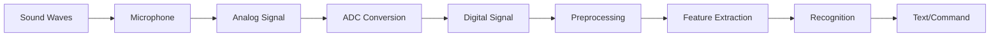

# Audio Processing and Recognition

Audio processing and speech recognition form the foundation of voice-enabled robotic systems. This section covers the technical aspects of capturing, processing, and recognizing human speech for robot command interpretation.

## Audio Signal Processing Fundamentals

Audio processing involves converting acoustic signals into digital representations that computers can analyze. The process includes:

1. **Acquisition**: Capturing sound waves with microphones
2. **Digitization**: Converting analog signals to digital format
3. **Preprocessing**: Filtering and enhancing audio quality
4. **Feature Extraction**: Extracting relevant speech characteristics
5. **Recognition**: Converting speech to text or commands



## Audio Signal Characteristics

### Sampling and Quantization

Audio signals are converted from analog to digital through sampling and quantization:

```python
#!/usr/bin/env python3
"""
Audio Signal Processing Example
"""
import numpy as np
import rclpy
from rclpy.node import Node
from std_msgs.msg import String
from audio_common_msgs.msg import AudioData
import pyaudio
import wave
import struct
from scipy import signal
import librosa

class AudioProcessingNode(Node):
    def __init__(self):
        super().__init__('audio_processing_node')

        # Create subscriber for audio data
        self.audio_sub = self.create_subscription(
            AudioData, '/audio/audio', self.audio_callback, 10)

        # Create publisher for processed audio
        self.processed_audio_pub = self.create_publisher(String, '/audio/processed', 10)

        # Audio processing parameters
        self.sample_rate = 16000  # Hz
        self.chunk_size = 1024  # Samples per chunk
        self.channels = 1  # Mono

        # Initialize audio processing
        self.audio_buffer = []
        self.buffer_size = 4096  # Total buffer size

        # Audio processing filters
        self.noise_reduction_enabled = True
        self.voice_activity_detection = True

        self.get_logger().info('Audio processing node started')

    def audio_callback(self, msg):
        """Process incoming audio data"""
        try:
            # Convert audio data from message
            audio_data = self.decode_audio_data(msg.data)

            # Apply preprocessing
            processed_audio = self.preprocess_audio(audio_data)

            # Perform voice activity detection
            if self.voice_activity_detection:
                vad_result = self.voice_activity_detection_simple(processed_audio)
                if not vad_result:
                    # No speech detected, skip further processing
                    return

            # Extract features
            features = self.extract_features(processed_audio)

            # Publish processed results
            result_msg = String()
            result_msg.data = f"Audio processed: {len(audio_data)} samples, features: {len(features)}"
            self.processed_audio_pub.publish(result_msg)

            self.get_logger().info(f'Processed audio: {len(audio_data)} samples')

        except Exception as e:
            self.get_logger().error(f'Error processing audio: {e}')

    def decode_audio_data(self, raw_data):
        """Decode raw audio data to numpy array"""
        # Assuming 16-bit PCM audio
        samples = struct.unpack('<' + 'h' * (len(raw_data) // 2), raw_data)
        audio_array = np.array(samples, dtype=np.float32) / 32768.0  # Normalize to [-1, 1]
        return audio_array

    def preprocess_audio(self, audio_data):
        """Apply preprocessing to audio signal"""
        processed = audio_data.copy()

        # Apply noise reduction if enabled
        if self.noise_reduction_enabled:
            processed = self.apply_noise_reduction(processed)

        # Apply normalization
        processed = self.normalize_audio(processed)

        # Apply high-pass filter to remove DC offset
        processed = self.apply_high_pass_filter(processed)

        return processed

    def apply_noise_reduction(self, audio_data):
        """Apply simple noise reduction"""
        # This is a simplified noise reduction approach
        # In practice, use more sophisticated methods like spectral subtraction
        # or machine learning-based denoising

        # Calculate noise floor (estimate of background noise)
        noise_floor = np.mean(np.abs(audio_data)) * 0.1

        # Apply soft thresholding
        processed = np.sign(audio_data) * np.maximum(np.abs(audio_data) - noise_floor, 0)

        return processed

    def normalize_audio(self, audio_data):
        """Normalize audio to maximum amplitude"""
        if len(audio_data) == 0:
            return audio_data

        max_amplitude = np.max(np.abs(audio_data))
        if max_amplitude > 0:
            normalized = audio_data / max_amplitude
        else:
            normalized = audio_data

        return normalized

    def apply_high_pass_filter(self, audio_data, cutoff_freq=50):
        """Apply high-pass filter to remove DC offset"""
        nyquist = self.sample_rate / 2.0
        normalized_cutoff = cutoff_freq / nyquist

        # Design Butterworth high-pass filter
        b, a = signal.butter(4, normalized_cutoff, btype='high', analog=False)

        # Apply filter
        filtered_audio = signal.filtfilt(b, a, audio_data)

        return filtered_audio

    def voice_activity_detection_simple(self, audio_data, threshold=0.01):
        """Simple voice activity detection based on energy"""
        # Calculate short-time energy
        frame_size = 256
        energy = np.array([
            np.mean(audio_data[i:i+frame_size]**2)
            for i in range(0, len(audio_data)-frame_size, frame_size)
        ])

        # Voice activity if energy exceeds threshold
        avg_energy = np.mean(energy) if len(energy) > 0 else 0
        return avg_energy > threshold

    def extract_features(self, audio_data):
        """Extract relevant audio features"""
        features = {}

        # Short-time Fourier Transform (STFT)
        n_fft = 512
        hop_length = 256
        stft = librosa.stft(audio_data, n_fft=n_fft, hop_length=hop_length)
        magnitude = np.abs(stft)

        # Spectral features
        features['spectral_centroid'] = librosa.feature.spectral_centroid(
            S=magnitude, sr=self.sample_rate
        ).mean()
        features['spectral_rolloff'] = librosa.feature.spectral_rolloff(
            S=magnitude, sr=self.sample_rate
        ).mean()
        features['zero_crossing_rate'] = librosa.feature.zero_crossing_rate(
            audio_data
        ).mean()

        # Mel-frequency cepstral coefficients (MFCCs)
        mfccs = librosa.feature.mfcc(y=audio_data, sr=self.sample_rate, n_mfcc=13)
        features['mfcc_mean'] = np.mean(mfccs, axis=1).tolist()
        features['mfcc_std'] = np.std(mfccs, axis=1).tolist()

        # Root mean square energy
        features['rms_energy'] = librosa.feature.rms(y=audio_data).mean()

        return features

def main(args=None):
    rclpy.init(args=args)
    node = AudioProcessingNode()

    try:
        rclpy.spin(node)
    except KeyboardInterrupt:
        pass
    finally:
        node.destroy_node()
        rclpy.shutdown()

if __name__ == '__main__':
    main()
```

## Microphone Array Processing

### Beamforming

Microphone arrays enable spatial filtering to enhance speech from specific directions:

```python
#!/usr/bin/env python3
"""
Microphone Array Beamforming Example
"""
import numpy as np
import rclpy
from rclpy.node import Node
from sensor_msgs.msg import PointCloud2
from std_msgs.msg import String
import struct

class MicrophoneArrayProcessor(Node):
    def __init__(self):
        super().__init__('microphone_array_processor')

        # Create subscriber for multi-channel audio
        # In practice, this would be a custom message type for multi-channel audio
        # For this example, we'll simulate multi-channel processing

        # Create publisher for beamformed audio
        self.beamformed_audio_pub = self.create_publisher(String, '/audio/beamformed', 10)

        # Microphone array configuration
        self.num_microphones = 4
        self.mic_positions = np.array([
            [0, 0, 0],      # Mic 0 (origin)
            [0.1, 0, 0],    # Mic 1 (0.1m along x-axis)
            [0, 0.1, 0],    # Mic 2 (0.1m along y-axis)
            [0.05, 0.05, 0] # Mic 3 (diagonal)
        ])  # Positions in meters

        # Processing parameters
        self.sample_rate = 16000
        self.speed_of_sound = 343.0  # m/s

        # Beamforming parameters
        self.look_direction = np.array([1, 0, 0])  # Look towards positive x
        self.beamwidth = 30  # Degrees

        self.get_logger().info('Microphone array processor started')

    def delay_and_sum_beamforming(self, multi_channel_audio):
        """Apply delay-and-sum beamforming"""
        num_samples = multi_channel_audio.shape[1]
        delays = self.calculate_delays(self.look_direction)

        # Apply delays to each channel
        beamformed_signal = np.zeros(num_samples)

        for mic_idx in range(self.num_microphones):
            delay_samples = int(delays[mic_idx] * self.sample_rate)

            # Apply delay (with zero-padding)
            delayed_signal = np.zeros(num_samples)
            if delay_samples >= 0:
                delayed_signal[delay_samples:] = multi_channel_audio[mic_idx, :-delay_samples]
            else:
                delayed_signal[:delay_samples] = multi_channel_audio[mic_idx, -delay_samples:]

            # Add to beamformed signal
            beamformed_signal += delayed_signal

        # Normalize
        beamformed_signal /= self.num_microphones

        return beamformed_signal

    def calculate_delays(self, look_direction):
        """Calculate time delays for beamforming to look in given direction"""
        delays = np.zeros(self.num_microphones)

        for i in range(self.num_microphones):
            # Calculate relative position to reference microphone (first mic)
            rel_pos = self.mic_positions[i] - self.mic_positions[0]

            # Calculate delay based on angle between mic position and look direction
            projection = np.dot(rel_pos, look_direction) / (np.linalg.norm(rel_pos) * np.linalg.norm(look_direction))

            # Time delay is distance divided by speed of sound
            distance_offset = -projection * np.linalg.norm(rel_pos)
            delays[i] = distance_offset / self.speed_of_sound

        return delays

    def steered_response_power(self, multi_channel_audio):
        """Calculate steered response power for direction of arrival estimation"""
        # This is a simplified implementation
        # In practice, this would scan through multiple directions
        directions = [
            np.array([1, 0, 0]),   # Front
            np.array([-1, 0, 0]),  # Back
            np.array([0, 1, 0]),   # Right
            np.array([0, -1, 0])   # Left
        ]

        powers = []
        for direction in directions:
            delays = self.calculate_delays(direction)
            # Calculate power for this direction
            power = self.calculate_steered_power(multi_channel_audio, delays)
            powers.append(power)

        # Return direction with highest power
        best_direction_idx = np.argmax(powers)
        return directions[best_direction_idx], powers[best_direction_idx]

    def calculate_steered_power(self, multi_channel_audio, delays):
        """Calculate power when steering to specific delays"""
        # Apply delays and sum
        num_samples = multi_channel_audio.shape[1]
        total_power = 0

        for mic_idx in range(self.num_microphones):
            delay_samples = int(delays[mic_idx] * self.sample_rate)

            # Get delayed signal
            if delay_samples >= 0:
                delayed_sig = multi_channel_audio[mic_idx, delay_samples:]
            else:
                delayed_sig = multi_channel_audio[mic_idx, :delay_samples]

            # Calculate power
            power = np.mean(delayed_sig ** 2)
            total_power += power

        return total_power

def main(args=None):
    rclpy.init(args=args)
    node = MicrophoneArrayProcessor()

    try:
        rclpy.spin(node)
    except KeyboardInterrupt:
        pass
    finally:
        node.destroy_node()
        rclpy.shutdown()

if __name__ == '__main__':
    main()
```

## Speech Recognition Systems

### Online Speech Recognition

Real-time speech recognition for immediate response:

```python
#!/usr/bin/env python3
"""
Online Speech Recognition Example
"""
import rclpy
from rclpy.node import Node
from std_msgs.msg import String
from audio_common_msgs.msg import AudioData
import speech_recognition as sr
import threading
import queue
import time

class OnlineSpeechRecognizer(Node):
    def __init__(self):
        super().__init__('online_speech_recognizer')

        # Create subscriber for audio data
        self.audio_sub = self.create_subscription(
            AudioData, '/audio/audio', self.audio_callback, 10)

        # Create publishers for recognition results
        self.recognition_pub = self.create_publisher(String, '/speech/recognition', 10)
        self.interim_results_pub = self.create_publisher(String, '/speech/interim', 10)

        # Initialize speech recognizer
        self.recognizer = sr.Recognizer()
        self.microphone = sr.Microphone()  # This would be replaced with ROS audio

        # Recognition parameters
        self.energy_threshold = 300  # Minimum audio energy to consider for recording
        self.dynamic_energy_threshold = True
        self.pause_threshold = 0.8  # Seconds of non-speaking audio before a phrase is considered complete
        self.phrase_time_limit = 10  # Maximum seconds for a phrase

        # Audio buffer and processing
        self.audio_queue = queue.Queue()
        self.recognition_thread = None
        self.is_listening = False

        # Recognition engine selection
        self.recognition_engine = "google"  # google, sphinx, wit, azure, etc.

        # Start recognition thread
        self.start_recognition_thread()

        self.get_logger().info('Online speech recognizer started')

    def audio_callback(self, msg):
        """Handle incoming audio data"""
        try:
            # Add audio data to processing queue
            self.audio_queue.put(msg)
        except Exception as e:
            self.get_logger().error(f'Error queuing audio: {e}')

    def start_recognition_thread(self):
        """Start the recognition processing thread"""
        self.is_listening = True
        self.recognition_thread = threading.Thread(target=self.recognition_worker, daemon=True)
        self.recognition_thread.start()

    def recognition_worker(self):
        """Background thread for speech recognition"""
        while self.is_listening:
            try:
                # Get audio from queue
                audio_msg = self.audio_queue.get(timeout=1.0)

                # Process audio (decode and recognize)
                recognized_text = self.process_audio_chunk(audio_msg)

                if recognized_text:
                    # Publish recognition result
                    result_msg = String()
                    result_msg.data = recognized_text
                    self.recognition_pub.publish(result_msg)

                    self.get_logger().info(f'Recognized: {recognized_text}')

            except queue.Empty:
                # Timeout, continue loop
                continue
            except Exception as e:
                self.get_logger().error(f'Error in recognition worker: {e}')

    def process_audio_chunk(self, audio_msg):
        """Process a chunk of audio data for speech recognition"""
        try:
            # In a real implementation, this would use the actual audio data
            # For this example, we'll simulate recognition

            # Decode audio data
            audio_data = self.decode_audio_data(audio_msg.data)

            # Convert to AudioData format expected by speech_recognition library
            # This is a simplified approach - in practice, handle proper audio format conversion
            audio = sr.AudioData(
                audio_msg.data,
                sample_rate=16000,
                sample_width=2  # 16-bit
            )

            # Perform recognition based on selected engine
            recognized_text = ""

            if self.recognition_engine == "google":
                try:
                    # Google Web Speech API (requires internet)
                    recognized_text = self.recognizer.recognize_google(audio)
                except sr.UnknownValueError:
                    self.get_logger().info('Google Speech Recognition could not understand audio')
                except sr.RequestError as e:
                    self.get_logger().error(f'Could not request results from Google Speech Recognition service; {e}')

            elif self.recognition_engine == "sphinx":
                try:
                    # CMU Sphinx (offline)
                    recognized_text = self.recognizer.recognize_sphinx(audio)
                except sr.UnknownValueError:
                    self.get_logger().info('Sphinx could not understand audio')
                except sr.RequestError as e:
                    self.get_logger().error(f'Sphinx error; {e}')

            return recognized_text

        except Exception as e:
            self.get_logger().error(f'Error processing audio chunk: {e}')
            return ""

    def decode_audio_data(self, raw_data):
        """Decode raw audio data"""
        # This would convert the raw audio bytes to a format suitable for recognition
        # Implementation depends on the audio format in the message
        pass

    def set_recognition_engine(self, engine_name):
        """Switch recognition engine"""
        valid_engines = ["google", "sphinx", "wit", "azure", "houndify", "ibm"]

        if engine_name in valid_engines:
            self.recognition_engine = engine_name
            self.get_logger().info(f'Switched to {engine_name} recognition engine')
        else:
            self.get_logger().warn(f'Invalid recognition engine: {engine_name}')

    def destroy_node(self):
        """Cleanup when node is destroyed"""
        self.is_listening = False
        if self.recognition_thread:
            self.recognition_thread.join(timeout=2.0)
        super().destroy_node()

def main(args=None):
    rclpy.init(args=args)
    node = OnlineSpeechRecognizer()

    try:
        rclpy.spin(node)
    except KeyboardInterrupt:
        pass
    finally:
        node.destroy_node()
        rclpy.shutdown()

if __name__ == '__main__':
    main()
```

### Offline Speech Recognition

Using local models for privacy and reliability:

```python
#!/usr/bin/env python3
"""
Offline Speech Recognition Example
"""
import rclpy
from rclpy.node import Node
from std_msgs.msg import String
from audio_common_msgs.msg import AudioData
import numpy as np
import pyaudio
import threading
import queue
import subprocess
import tempfile
import os

class OfflineSpeechRecognizer(Node):
    def __init__(self):
        super().__init__('offline_speech_recognizer')

        # Create subscriber for audio data
        self.audio_sub = self.create_subscription(
            AudioData, '/audio/audio', self.audio_callback, 10)

        # Create publisher for recognition results
        self.recognition_pub = self.create_publisher(String, '/speech/recognition_offline', 10)

        # Offline recognition parameters
        self.sample_rate = 16000
        self.audio_format = pyaudio.paInt16
        self.channels = 1
        self.chunk_size = 1024

        # Use Vosk for offline recognition
        try:
            from vosk import Model, KaldiRecognizer
            self.model = Model(lang="en-us")  # Download model files beforehand
            self.recognizer = KaldiRecognizer(self.model, self.sample_rate)
            self.use_vosk = True
        except ImportError:
            self.get_logger().warn('Vosk not available, using fallback')
            self.use_vosk = False

        # Audio processing
        self.audio_buffer = b""
        self.partial_result = ""
        self.final_result = ""

        # Recognition state
        self.recording = False
        self.silence_threshold = 500  # Amplitude threshold for silence detection

        self.get_logger().info('Offline speech recognizer started')

    def audio_callback(self, msg):
        """Process incoming audio data for offline recognition"""
        try:
            # Add audio data to buffer
            self.audio_buffer += bytes(msg.data)

            # Process audio chunks when buffer is sufficiently large
            chunk_size = 4000  # Process every 4000 bytes (about 1/4 second at 16kHz)
            if len(self.audio_buffer) >= chunk_size:
                chunk = self.audio_buffer[:chunk_size]
                self.audio_buffer = self.audio_buffer[chunk_size:]

                # Perform recognition on chunk
                if self.use_vosk:
                    result = self.recognizer.AcceptWaveform(chunk)

                    # Check if we have a partial result
                    if not result:
                        partial_result = self.recognizer.PartialResult()
                        # Extract partial text if available
                        if '"partial"' in partial_result:
                            import json
                            try:
                                partial_json = json.loads(partial_result)
                                partial_text = partial_json.get('partial', '')
                                if partial_text != self.partial_result:
                                    self.partial_result = partial_text
                                    # Publish interim result
                                    interim_msg = String()
                                    interim_msg.data = f"Partial: {partial_text}"
                                    # In a real system, you might publish to a different topic
                            except:
                                pass
                    else:
                        # Final result available
                        import json
                        try:
                            result_json = json.loads(self.recognizer.FinalResult())
                            final_text = result_json.get('text', '')

                            if final_text and final_text != self.final_result:
                                self.final_result = final_text

                                # Publish recognition result
                                result_msg = String()
                                result_msg.data = final_text
                                self.recognition_pub.publish(result_msg)

                                self.get_logger().info(f'Offline recognition: {final_text}')

                        except:
                            pass
                else:
                    # Fallback recognition (simplified)
                    self.fallback_recognition(chunk)

        except Exception as e:
            self.get_logger().error(f'Error in audio callback: {e}')

    def fallback_recognition(self, audio_chunk):
        """Fallback recognition when Vosk is not available"""
        # This would implement a simple keyword spotting or
        # connect to a local speech recognition model
        # For this example, we'll just detect basic audio energy

        # Convert bytes to numpy array for analysis
        audio_array = np.frombuffer(audio_chunk, dtype=np.int16).astype(np.float32) / 32768.0

        # Calculate energy
        energy = np.mean(audio_array ** 2)

        if energy > self.silence_threshold / 1000000:  # Adjusted for 16-bit
            # Non-silent audio detected, but we can't recognize without a model
            self.get_logger().info(f'Audio detected (energy: {energy:.6f}), but no recognition model available')

    def record_audio_segment(self):
        """Record audio until silence is detected"""
        # This would implement voice activity detection
        # to automatically segment speech from silence
        pass

    def save_audio_for_debugging(self, audio_data, filename=None):
        """Save audio data to WAV file for debugging"""
        if not filename:
            filename = tempfile.mktemp(suffix='.wav')

        # Write WAV file
        import wave
        with wave.open(filename, 'wb') as wav_file:
            wav_file.setnchannels(self.channels)
            wav_file.setsampwidth(2)  # 16-bit
            wav_file.setframerate(self.sample_rate)
            wav_file.writeframes(audio_data)

        self.get_logger().info(f'Audio saved to {filename}')

def main(args=None):
    rclpy.init(args=args)
    node = OfflineSpeechRecognizer()

    try:
        rclpy.spin(node)
    except KeyboardInterrupt:
        pass
    finally:
        node.destroy_node()
        rclpy.shutdown()

if __name__ == '__main__':
    main()
```

## Voice Activity Detection (VAD)

### Energy-Based VAD

Simple voice activity detection based on audio energy:

```python
#!/usr/bin/env python3
"""
Voice Activity Detection Example
"""
import numpy as np
import rclpy
from rclpy.node import Node
from std_msgs.msg import Bool, Float32
from audio_common_msgs.msg import AudioData

class VoiceActivityDetector(Node):
    def __init__(self):
        super().__init__('voice_activity_detector')

        # Create subscriber for audio data
        self.audio_sub = self.create_subscription(
            AudioData, '/audio/audio', self.audio_callback, 10)

        # Create publishers
        self.vad_pub = self.create_publisher(Bool, '/audio/voice_detected', 10)
        self.energy_pub = self.create_publisher(Float32, '/audio/energy', 10)

        # VAD parameters
        self.sample_rate = 16000
        self.frame_size = 512  # Samples per frame
        self.energy_threshold = 0.01  # Adjustable threshold
        self.silence_frames_before_inactive = 10  # Number of silent frames before deactivation

        # VAD state
        self.voice_active = False
        self.silence_frame_count = 0
        self.adaptation_rate = 0.001  # For adaptive threshold

        # Statistics
        self.running_energy_avg = 0.0
        self.frame_count = 0

        self.get_logger().info('Voice activity detector started')

    def audio_callback(self, msg):
        """Process audio data for voice activity detection"""
        try:
            # Decode audio data
            audio_data = self.decode_audio_data(msg.data)

            # Process in frames
            for i in range(0, len(audio_data) - self.frame_size, self.frame_size):
                frame = audio_data[i:i + self.frame_size]

                # Calculate frame energy
                frame_energy = np.mean(frame ** 2)

                # Update running average for adaptive threshold
                if self.frame_count == 0:
                    self.running_energy_avg = frame_energy
                else:
                    # Exponential moving average
                    self.running_energy_avg = (
                        self.adaptation_rate * frame_energy +
                        (1 - self.adaptation_rate) * self.running_energy_avg
                    )

                # Calculate adaptive threshold
                adaptive_threshold = self.running_energy_avg * 5  # Factor for sensitivity

                # Update frame count
                self.frame_count += 1

                # Perform VAD
                frame_has_voice = self.perform_vad(frame_energy, adaptive_threshold)

                # Publish energy
                energy_msg = Float32()
                energy_msg.data = frame_energy
                self.energy_pub.publish(energy_msg)

                # Update voice activity state
                self.update_voice_state(frame_has_voice)

                # Publish voice activity
                vad_msg = Bool()
                vad_msg.data = self.voice_active
                self.vad_pub.publish(vad_msg)

        except Exception as e:
            self.get_logger().error(f'Error in VAD callback: {e}')

    def decode_audio_data(self, raw_data):
        """Decode raw audio data to numpy array"""
        # Assuming 16-bit PCM
        samples = np.frombuffer(raw_data, dtype=np.int16).astype(np.float32) / 32768.0
        return samples

    def perform_vad(self, frame_energy, adaptive_threshold):
        """Perform voice activity detection on a single frame"""
        # Use both fixed and adaptive thresholds
        fixed_threshold_met = frame_energy > self.energy_threshold
        adaptive_threshold_met = frame_energy > adaptive_threshold

        # Voice detected if either threshold is met
        return fixed_threshold_met or adaptive_threshold_met

    def update_voice_state(self, current_frame_has_voice):
        """Update voice activity state based on current frame"""
        if current_frame_has_voice:
            # Voice detected in current frame
            self.voice_active = True
            self.silence_frame_count = 0
        else:
            # No voice in current frame
            self.silence_frame_count += 1

            # Deactivate if enough silent frames
            if self.silence_frame_count >= self.silence_frames_before_inactive:
                self.voice_active = False

    def set_energy_threshold(self, threshold):
        """Set energy threshold for VAD"""
        self.energy_threshold = threshold
        self.get_logger().info(f'Energy threshold set to {threshold}')

def main(args=None):
    rclpy.init(args=args)
    node = VoiceActivityDetector()

    try:
        rclpy.spin(node)
    except KeyboardInterrupt:
        pass
    finally:
        node.destroy_node()
        rclpy.shutdown()

if __name__ == '__main__':
    main()
```

### Spectral-Based VAD

More sophisticated VAD using spectral features:

```python
#!/usr/bin/env python3
"""
Spectral-Based Voice Activity Detection
"""
import numpy as np
from scipy import signal
import librosa
import rclpy
from rclpy.node import Node
from std_msgs.msg import Bool, Float32
from audio_common_msgs.msg import AudioData

class SpectralVAD(Node):
    def __init__(self):
        super().__init__('spectral_vad')

        # Create subscriber for audio data
        self.audio_sub = self.create_subscription(
            AudioData, '/audio/audio', self.audio_callback, 10)

        # Create publishers
        self.vad_pub = self.create_publisher(Bool, '/audio/spectral_vad', 10)
        self.spectral_features_pub = self.create_publisher(Float32, '/audio/spectral_features', 10)

        # Spectral VAD parameters
        self.sample_rate = 16000
        self.frame_size = 1024
        self.overlap_ratio = 0.5
        self.hop_length = int(self.frame_size * (1 - self.overlap_ratio))

        # Spectral features thresholds
        self.spectral_flux_threshold = 0.05
        self.zero_crossing_threshold = 0.1
        self.spectral_rolloff_threshold = 3000  # Hz

        # Noise estimation
        self.noise_estimate = None
        self.noise_update_rate = 0.01

        # Frame counting for adaptation
        self.frame_count = 0

        self.get_logger().info('Spectral VAD started')

    def audio_callback(self, msg):
        """Process audio data using spectral features for VAD"""
        try:
            # Decode audio data
            audio_data = self.decode_audio_data(msg.data)

            # Process in frames
            for i in range(0, len(audio_data) - self.frame_size, self.hop_length):
                frame = audio_data[i:i + self.frame_size]

                # Extract spectral features
                features = self.extract_spectral_features(frame)

                # Perform spectral-based VAD
                voice_detected = self.spectral_vad_decision(features)

                # Publish results
                vad_msg = Bool()
                vad_msg.data = voice_detected
                self.vad_pub.publish(vad_msg)

                # Publish spectral features
                feature_msg = Float32()
                feature_msg.data = features['spectral_flux']
                self.spectral_features_pub.publish(feature_msg)

                if voice_detected:
                    self.get_logger().debug(f'Voice detected with features: {features}')

        except Exception as e:
            self.get_logger().error(f'Error in spectral VAD callback: {e}')

    def decode_audio_data(self, raw_data):
        """Decode raw audio data to numpy array"""
        samples = np.frombuffer(raw_data, dtype=np.int16).astype(np.float32) / 32768.0
        return samples

    def extract_spectral_features(self, audio_frame):
        """Extract spectral features for VAD"""
        features = {}

        # STFT
        stft = librosa.stft(audio_frame, n_fft=self.frame_size)
        magnitude = np.abs(stft)

        # Spectral flux (change in spectrum over time)
        if self.frame_count > 0 and hasattr(self, 'prev_magnitude'):
            spectral_flux = np.mean(np.diff(magnitude, axis=1)**2)
        else:
            spectral_flux = 0.0
        self.prev_magnitude = magnitude.copy()
        features['spectral_flux'] = spectral_flux

        # Zero crossing rate
        features['zero_crossing_rate'] = librosa.feature.zero_crossing_rate(
            audio_frame
        ).mean()

        # Spectral rolloff
        features['spectral_rolloff'] = librosa.feature.spectral_rolloff(
            y=audio_frame, sr=self.sample_rate
        ).mean()

        # Spectral centroid
        features['spectral_centroid'] = librosa.feature.spectral_centroid(
            y=audio_frame, sr=self.sample_rate
        ).mean()

        # RMS energy
        features['rms_energy'] = librosa.feature.rms(y=audio_frame).mean()

        # Update frame count
        self.frame_count += 1

        return features

    def spectral_vad_decision(self, features):
        """Make VAD decision based on spectral features"""
        # Multiple criteria for robust VAD
        criteria_met = 0
        total_criteria = 4

        # Check spectral flux (indicates speech changes)
        if features['spectral_flux'] > self.spectral_flux_threshold:
            criteria_met += 1

        # Check zero crossing rate (typical of voiced speech)
        if features['zero_crossing_rate'] > self.zero_crossing_threshold:
            criteria_met += 1

        # Check spectral rolloff (energy distribution)
        if features['spectral_rolloff'] > self.spectral_rolloff_threshold:
            criteria_met += 1

        # Check RMS energy (power level)
        if features['rms_energy'] > 0.001:  # Adjust based on expected levels
            criteria_met += 1

        # Voice detected if majority of criteria are met
        voice_detected = criteria_met >= total_criteria // 2 + 1

        return voice_detected

def main(args=None):
    rclpy.init(args=args)
    node = SpectralVAD()

    try:
        rclpy.spin(node)
    except KeyboardInterrupt:
        pass
    finally:
        node.destroy_node()
        rclpy.shutdown()

if __name__ == '__main__':
    main()
```

## Noise Reduction and Audio Enhancement

### Spectral Subtraction

```python
#!/usr/bin/env python3
"""
Noise Reduction using Spectral Subtraction
"""
import numpy as np
from scipy import signal
import librosa
import rclpy
from rclpy.node import Node
from std_msgs.msg import String
from audio_common_msgs.msg import AudioData

class NoiseReductionNode(Node):
    def __init__(self):
        super().__init__('noise_reduction_node')

        # Create subscriber for audio data
        self.audio_sub = self.create_subscription(
            AudioData, '/audio/audio', self.audio_callback, 10)

        # Create publisher for enhanced audio
        self.enhanced_audio_pub = self.create_publisher(AudioData, '/audio/enhanced', 10)

        # Noise reduction parameters
        self.sample_rate = 16000
        self.frame_size = 1024
        self.overlap_ratio = 0.5
        self.hop_length = int(self.frame_size * (1 - self.overlap_ratio))

        # Noise estimation parameters
        self.noise_frames = 20  # Number of initial frames assumed to be noise
        self.noise_estimate = None
        self.noise_initialized = False

        # Spectral subtraction parameters
        self.alpha = 4.0  # Over-subtraction factor
        self.beta = 0.001  # Noise floor factor

        # Buffer for processing
        self.audio_buffer = np.array([])

        self.get_logger().info('Noise reduction node started')

    def audio_callback(self, msg):
        """Process audio data for noise reduction"""
        try:
            # Decode audio data
            new_audio = self.decode_audio_data(msg.data)

            # Add to buffer
            self.audio_buffer = np.concatenate([self.audio_buffer, new_audio])

            # Process when we have enough samples
            while len(self.audio_buffer) >= self.frame_size:
                frame = self.audio_buffer[:self.frame_size]
                remaining = self.audio_buffer[self.frame_size:]

                # Apply noise reduction
                enhanced_frame = self.spectral_subtraction(frame)

                # Publish enhanced frame
                enhanced_msg = AudioData()
                enhanced_msg.data = self.encode_audio_data(enhanced_frame)
                self.enhanced_audio_pub.publish(enhanced_msg)

                # Update buffer
                self.audio_buffer = remaining

        except Exception as e:
            self.get_logger().error(f'Error in noise reduction callback: {e}')

    def decode_audio_data(self, raw_data):
        """Decode raw audio data to numpy array"""
        samples = np.frombuffer(raw_data, dtype=np.int16).astype(np.float32) / 32768.0
        return samples

    def encode_audio_data(self, audio_array):
        """Encode numpy array back to raw audio data"""
        # Convert back to 16-bit integers
        int_samples = (audio_array * 32767).astype(np.int16)
        return int_samples.tobytes()

    def spectral_subtraction(self, audio_frame):
        """Apply spectral subtraction for noise reduction"""
        # Compute STFT
        stft = librosa.stft(audio_frame, n_fft=self.frame_size)
        magnitude = np.abs(stft)
        phase = np.angle(stft)

        # Initialize noise estimate from first frames
        if not self.noise_initialized and self.noise_estimate is None:
            self.noise_estimate = magnitude.copy()
            return audio_frame  # Return original for first frame

        # Update noise estimate (simple averaging for first few frames)
        if not self.noise_initialized:
            self.noise_estimate = 0.9 * self.noise_estimate + 0.1 * magnitude
            if hasattr(self, 'noise_frame_count'):
                self.noise_frame_count += 1
            else:
                self.noise_frame_count = 1

            if self.noise_frame_count >= self.noise_frames:
                self.noise_initialized = True

        # Apply spectral subtraction
        enhanced_magnitude = self.apply_spectral_subtraction(magnitude)

        # Reconstruct signal
        enhanced_stft = enhanced_magnitude * np.exp(1j * phase)
        enhanced_audio = librosa.istft(enhanced_stft, length=len(audio_frame))

        return enhanced_audio

    def apply_spectral_subtraction(self, magnitude):
        """Apply spectral subtraction formula"""
        # Calculate noise power spectrum
        noise_power = np.abs(self.noise_estimate) ** 2
        signal_power = magnitude ** 2

        # Apply spectral subtraction
        enhanced_power = signal_power - self.alpha * noise_power
        enhanced_power = np.maximum(enhanced_power, self.beta * noise_power)

        # Take square root to get magnitude
        enhanced_magnitude = np.sqrt(enhanced_power)

        return enhanced_magnitude

def main(args=None):
    rclpy.init(args=args)
    node = NoiseReductionNode()

    try:
        rclpy.spin(node)
    except KeyboardInterrupt:
        pass
    finally:
        node.destroy_node()
        rclpy.shutdown()

if __name__ == '__main__':
    main()
```

## Real-time Processing Considerations

### Buffer Management

```python
#!/usr/bin/env python3
"""
Real-time Audio Buffer Management
"""
import numpy as np
import rclpy
from rclpy.node import Node
from std_msgs.msg import String
from audio_common_msgs.msg import AudioData
import threading
import queue
from collections import deque

class RealTimeAudioProcessor(Node):
    def __init__(self):
        super().__init__('real_time_audio_processor')

        # Create subscriber for audio data
        self.audio_sub = self.create_subscription(
            AudioData, '/audio/audio', self.audio_callback, 10)

        # Create publisher for processing results
        self.result_pub = self.create_publisher(String, '/audio/real_time_result', 10)

        # Real-time processing parameters
        self.sample_rate = 16000
        self.buffer_size = 4096  # Total buffer size
        self.processing_latency = 1024  # Samples of latency

        # Thread-safe ring buffer
        self.audio_ring_buffer = deque(maxlen=self.buffer_size)
        self.buffer_lock = threading.Lock()

        # Processing thread
        self.processing_thread = threading.Thread(target=self.processing_loop, daemon=True)
        self.processing_active = True

        # Start processing thread
        self.processing_thread.start()

        self.get_logger().info('Real-time audio processor started')

    def audio_callback(self, msg):
        """Handle incoming audio data"""
        try:
            # Decode audio data
            new_samples = self.decode_audio_data(msg.data)

            # Add to ring buffer (thread-safe)
            with self.buffer_lock:
                for sample in new_samples:
                    self.audio_ring_buffer.append(sample)

        except Exception as e:
            self.get_logger().error(f'Error in audio callback: {e}')

    def processing_loop(self):
        """Real-time processing loop"""
        while self.processing_active:
            try:
                # Check if we have enough samples to process
                with self.buffer_lock:
                    if len(self.audio_ring_buffer) >= self.processing_latency:
                        # Get samples to process
                        samples_to_process = list(self.audio_ring_buffer)[:self.processing_latency]

                        # Remove processed samples from buffer
                        for _ in range(self.processing_latency):
                            if self.audio_ring_buffer:
                                self.audio_ring_buffer.popleft()

                # Perform real-time processing
                if len(samples_to_process) > 0:
                    result = self.real_time_process(samples_to_process)

                    # Publish result
                    result_msg = String()
                    result_msg.data = f"Processed {len(samples_to_process)} samples: {result}"
                    self.result_pub.publish(result_msg)

                # Sleep briefly to prevent busy waiting
                # In real-time systems, use proper scheduling
                import time
                time.sleep(0.01)  # 10ms sleep

            except Exception as e:
                self.get_logger().error(f'Error in processing loop: {e}')

    def decode_audio_data(self, raw_data):
        """Decode raw audio data to numpy array"""
        samples = np.frombuffer(raw_data, dtype=np.int16).astype(np.float32) / 32768.0
        return samples

    def real_time_process(self, audio_samples):
        """Perform real-time audio processing"""
        # Convert to numpy array
        audio_array = np.array(audio_samples)

        # Perform some real-time processing
        # For example: calculate energy, detect peaks, etc.
        energy = np.mean(audio_array ** 2)
        peak_amplitude = np.max(np.abs(audio_array))

        return f"Energy: {energy:.6f}, Peak: {peak_amplitude:.6f}"

    def destroy_node(self):
        """Cleanup when node is destroyed"""
        self.processing_active = False
        if self.processing_thread:
            self.processing_thread.join(timeout=2.0)
        super().destroy_node()

def main(args=None):
    rclpy.init(args=args)
    node = RealTimeAudioProcessor()

    try:
        rclpy.spin(node)
    except KeyboardInterrupt:
        pass
    finally:
        node.destroy_node()
        rclpy.shutdown()

if __name__ == '__main__':
    main()
```

## Performance Optimization

### Efficient Feature Extraction

```python
#!/usr/bin/env python3
"""
Optimized Audio Feature Extraction
"""
import numpy as np
from scipy import signal
import rclpy
from rclpy.node import Node
from std_msgs.msg import Float32MultiArray
from audio_common_msgs.msg import AudioData
import time

class OptimizedFeatureExtractor(Node):
    def __init__(self):
        super().__init__('optimized_feature_extractor')

        # Create subscriber for audio data
        self.audio_sub = self.create_subscription(
            AudioData, '/audio/audio', self.audio_callback, 10)

        # Create publisher for features
        self.features_pub = self.create_publisher(Float32MultiArray, '/audio/features', 10)

        # Optimization parameters
        self.sample_rate = 16000
        self.frame_size = 1024
        self.hop_length = 512

        # Pre-allocate arrays for efficiency
        self.window = np.hanning(self.frame_size)
        self.fft_buffer = np.zeros(self.frame_size, dtype=np.complex64)
        self.magnitude_buffer = np.zeros(self.frame_size // 2 + 1, dtype=np.float32)

        # Feature buffers
        self.mfcc_buffer = np.zeros(13, dtype=np.float32)
        self.spectral_features = np.zeros(5, dtype=np.float32)  # centroid, rolloff, bandwidth, contrast, flatness

        self.get_logger().info('Optimized feature extractor started')

    def audio_callback(self, msg):
        """Process audio data with optimized feature extraction"""
        try:
            start_time = time.time()

            # Decode audio data efficiently
            audio_data = self.decode_audio_data(msg.data)

            # Extract features efficiently
            features = self.extract_features_optimized(audio_data)

            # Publish features
            features_msg = Float32MultiArray()
            features_msg.data = features
            self.features_pub.publish(features_msg)

            processing_time = time.time() - start_time
            self.get_logger().info(f'Feature extraction took {processing_time:.4f}s')

        except Exception as e:
            self.get_logger().error(f'Error in optimized feature extraction: {e}')

    def decode_audio_data(self, raw_data):
        """Decode raw audio data efficiently"""
        # Use numpy's frombuffer for fastest decoding
        return np.frombuffer(raw_data, dtype=np.int16).astype(np.float32) / 32768.0

    def extract_features_optimized(self, audio_data):
        """Optimized feature extraction"""
        # Use pre-allocated buffers and vectorized operations
        if len(audio_data) < self.frame_size:
            # Pad with zeros if needed
            audio_data = np.pad(audio_data, (0, self.frame_size - len(audio_data)), 'constant')

        # Apply window function
        windowed = audio_data[:self.frame_size] * self.window

        # Compute FFT efficiently
        self.fft_buffer[:self.frame_size] = windowed
        fft_result = np.fft.rfft(self.fft_buffer[:self.frame_size])
        self.magnitude_buffer[:] = np.abs(fft_result)

        # Calculate spectral features
        spectral_centroid = self.calculate_spectral_centroid(self.magnitude_buffer)
        spectral_rolloff = self.calculate_spectral_rolloff(self.magnitude_buffer)
        spectral_bandwidth = self.calculate_spectral_bandwidth(self.magnitude_buffer)
        spectral_contrast = self.calculate_spectral_contrast(self.magnitude_buffer)
        spectral_flatness = self.calculate_spectral_flatness(self.magnitude_buffer)

        # Calculate MFCCs using optimized approach
        mfccs = self.calculate_mfccs_optimized(windowed)

        # Combine all features
        features = np.concatenate([
            [spectral_centroid, spectral_rolloff, spectral_bandwidth, spectral_contrast, spectral_flatness],
            mfccs
        ])

        return features.tolist()

    def calculate_spectral_centroid(self, magnitude):
        """Calculate spectral centroid efficiently"""
        freqs = np.arange(len(magnitude)) * self.sample_rate / self.frame_size
        return np.sum(freqs * magnitude) / (np.sum(magnitude) + 1e-8)

    def calculate_spectral_rolloff(self, magnitude):
        """Calculate spectral rolloff efficiently"""
        cumsum = np.cumsum(magnitude)
        threshold = 0.85 * cumsum[-1]
        rolloff_bin = np.searchsorted(cumsum, threshold)
        return rolloff_bin * self.sample_rate / self.frame_size

    def calculate_spectral_bandwidth(self, magnitude):
        """Calculate spectral bandwidth efficiently"""
        freqs = np.arange(len(magnitude)) * self.sample_rate / self.frame_size
        centroid = np.sum(freqs * magnitude) / (np.sum(magnitude) + 1e-8)
        return np.sqrt(np.sum(((freqs - centroid) ** 2) * magnitude) / (np.sum(magnitude) + 1e-8))

    def calculate_spectral_contrast(self, magnitude):
        """Calculate spectral contrast efficiently"""
        # Simple version: ratio of high freq to low freq energy
        mid_point = len(magnitude) // 2
        low_energy = np.mean(magnitude[:mid_point])
        high_energy = np.mean(magnitude[mid_point:])
        return high_energy / (low_energy + 1e-8)

    def calculate_spectral_flatness(self, magnitude):
        """Calculate spectral flatness (tonality measure)"""
        geometric_mean = np.exp(np.mean(np.log(magnitude + 1e-8)))
        arithmetic_mean = np.mean(magnitude)
        return geometric_mean / (arithmetic_mean + 1e-8)

    def calculate_mfccs_optimized(self, audio_frame):
        """Calculate MFCCs using optimized approach"""
        # Compute mel spectrogram
        mel_basis = self.compute_mel_basis()
        stft = np.abs(np.fft.rfft(audio_frame)) ** 2
        mel_spec = np.dot(mel_basis, stft)

        # Take log and apply DCT
        log_mel_spec = np.log(mel_spec + 1e-8)

        # Use scipy's DCT for efficiency
        from scipy.fftpack import dct
        mfccs = dct(log_mel_spec, type=2, norm='ortho')[:13]

        return mfccs

    def compute_mel_basis(self):
        """Compute mel filter bank basis"""
        n_fft = self.frame_size
        n_mels = 26
        sample_rate = self.sample_rate

        # Convert Hz to mel
        def hz_to_mel(hz):
            return 2595 * np.log10(1 + hz / 700.0)

        # Convert mel to Hz
        def mel_to_hz(mel):
            return 700 * (10**(mel / 2595.0) - 1)

        # Create mel frequencies
        low_mel = hz_to_mel(0)
        high_mel = hz_to_mel(sample_rate / 2)
        mel_f = np.linspace(low_mel, high_mel, n_mels + 2)

        # Convert back to Hz
        hz_f = mel_to_hz(mel_f)

        # Convert to FFT bin numbers
        bins = np.floor((n_fft + 1) * hz_f / sample_rate).astype(int)

        # Create filter bank
        fb = np.zeros((n_mels, int(np.floor(n_fft / 2)) + 1))
        for m in range(1, n_mels + 1):
            f_m_minus = bins[m - 1]
            f_m = bins[m]
            f_m_plus = bins[m + 1]

            if f_m_minus == f_m:
                left_slope = 0
            else:
                left_slope = 2.0 / (f_m - f_m_minus)

            if f_m == f_m_plus:
                right_slope = 0
            else:
                right_slope = -2.0 / (f_m_plus - f_m)

            for k in range(f_m_minus, f_m):
                fb[m - 1, k] = left_slope * (k - f_m_minus)
            for k in range(f_m, f_m_plus):
                fb[m - 1, k] = right_slope * (k - f_m_plus)

        return fb

def main(args=None):
    rclpy.init(args=args)
    node = OptimizedFeatureExtractor()

    try:
        rclpy.spin(node)
    except KeyboardInterrupt:
        pass
    finally:
        node.destroy_node()
        rclpy.shutdown()

if __name__ == '__main__':
    main()
```

## Best Practices

### 1. Audio Quality Management

```python
# Good: Comprehensive audio quality management
def manage_audio_quality():
    """Implement comprehensive audio quality management"""
    # Use appropriate sampling rates
    # Apply proper anti-aliasing filters
    # Monitor and adjust gain levels
    # Implement AGC for consistent levels
    # Use high-quality audio codecs
    pass

# Bad: No quality management
def poor_audio_quality():
    """No attention to audio quality"""
    # Use default settings only
    # No gain control
    # No noise reduction
    # No quality monitoring
    pass
```

### 2. Real-time Performance

```python
# Good: Real-time optimized processing
def real_time_optimized():
    """Optimize for real-time performance"""
    # Pre-allocate memory
    # Use efficient algorithms
    # Minimize copying
    # Use vectorized operations
    # Implement proper buffering
    pass

# Bad: No performance consideration
def performance_unaware():
    """No performance optimization"""
    # Frequent allocations
    # Inefficient algorithms
    # No buffering
    # Blocking operations
    pass
```

### 3. Robustness

```python
# Good: Robust error handling
def robust_audio_processing():
    """Implement robust error handling"""
    # Validate input data
    # Handle edge cases
    # Implement fallbacks
    # Monitor system resources
    # Graceful degradation
    pass

# Bad: Fragile implementation
def fragile_implementation():
    """No error handling"""
    # No input validation
    # No exception handling
    # No resource monitoring
    # System crashes on errors
    pass
```

## Common Issues and Troubleshooting

### 1. Audio Latency

```bash
# Check audio system latency
cat /proc/asound/card*/pcm*/sub*/hw_params

# Monitor audio processing delay
ros2 topic hz /audio/audio
ros2 topic hz /speech/recognition
```

### 2. Recognition Accuracy

```python
# Improve recognition accuracy
def improve_accuracy():
    """Techniques to improve recognition accuracy"""
    # Use high-quality microphones
    # Implement noise reduction
    # Train models on domain data
    # Use speaker adaptation
    # Implement confidence scoring
    pass
```

### 3. System Resource Usage

```bash
# Monitor CPU usage
htop

# Monitor memory usage
free -h

# Check audio processing performance
ros2 topic echo /audio/processing_time
```

## Next Steps

Now that you understand audio processing and recognition, continue to [Natural Language Understanding](../week-10/nlu) to learn about interpreting speech commands for robot action.

## Exercises

1. Implement a real-time audio processing pipeline with noise reduction
2. Create a speech recognition system that works in noisy environments
3. Build a voice activity detector that adapts to different acoustic conditions
4. Optimize audio processing for real-time performance on embedded systems