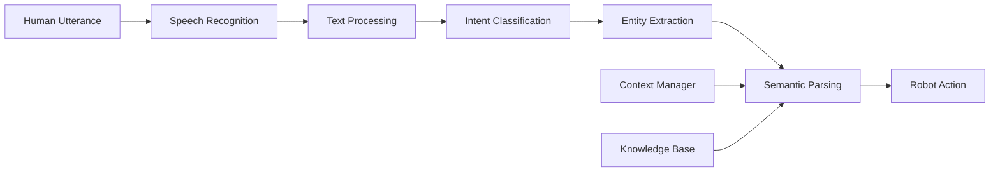

# Natural Language Understanding (NLU)

Natural Language Understanding (NLU) is the technology that enables robots to comprehend human speech and extract meaning from natural language commands. This section covers how to build systems that transform spoken language into actionable robot commands.

## Understanding Natural Language Understanding

NLU goes beyond simple keyword matching to understand the **intent** and **entities** in human language:



### NLU vs. NLP vs. NLG

- **NLP (Natural Language Processing)**: General field of processing natural language
- **NLU (Natural Language Understanding)**: Focus on comprehension and meaning extraction
- **NLG (Natural Language Generation)**: Focus on producing natural language responses

## NLU Architecture

### Traditional Pipeline Approach

```python
#!/usr/bin/env python3
"""
Traditional NLU Pipeline Example
"""
import rclpy
from rclpy.node import Node
from std_msgs.msg import String
from geometry_msgs.msg import PoseStamped
from sensor_msgs.msg import PointCloud2
from typing import Dict, List, Tuple
import re
import json
import spacy
from transformers import pipeline

class TraditionalNLUProcessor(Node):
    def __init__(self):
        super().__init__('traditional_nlu_processor')

        # Create subscriber for recognized text
        self.text_sub = self.create_subscription(
            String, '/speech/text', self.text_callback, 10)

        # Create publishers for different robot commands
        self.navigation_pub = self.create_publisher(PoseStamped, '/navigation/goal', 10)
        self.manipulation_pub = self.create_publisher(String, '/manipulation/command', 10)
        self.status_pub = self.create_publisher(String, '/nlu/status', 10)

        # Initialize NLP components
        self.setup_nlp_components()

        # Intent mapping
        self.intent_mapping = {
            'navigation': self.handle_navigation_intent,
            'manipulation': self.handle_manipulation_intent,
            'information': self.handle_information_intent,
            'social': self.handle_social_intent
        }

        # Entity extraction patterns
        self.location_patterns = [
            r'go to (\w+)',
            r'move to (\w+)',
            r'navigate to (\w+)',
            r'go (.+)',
            r'come to (.+)',
            r'bring (.+) to (.+)'
        ]

        self.object_patterns = [
            r'pick up (.+)',
            r'grab (.+)',
            r'get (.+)',
            r'fetch (.+)',
            r'bring (.+)'
        ]

        self.get_logger().info('Traditional NLU processor started')

    def setup_nlp_components(self):
        """Setup NLP processing components"""
        try:
            # Load spaCy model for linguistic analysis
            self.nlp = spacy.load('en_core_web_sm')
        except OSError:
            self.get_logger().warn('spaCy model not found, installing...')
            # In practice, you would install: python -m spacy download en_core_web_sm
            self.nlp = None

        # Simple intent classifiers (in practice, use trained models)
        self.intent_keywords = {
            'navigation': ['go', 'move', 'navigate', 'drive', 'walk', 'to', 'toward'],
            'manipulation': ['pick', 'grab', 'take', 'lift', 'hold', 'drop', 'place'],
            'information': ['what', 'how', 'tell', 'explain', 'describe', 'find'],
            'social': ['hello', 'hi', 'goodbye', 'bye', 'thank', 'please', 'help']
        }

    def text_callback(self, msg):
        """Process incoming text with NLU pipeline"""
        try:
            text = msg.data.lower().strip()

            # Step 1: Preprocessing
            processed_text = self.preprocess_text(text)

            # Step 2: Intent Classification
            intent = self.classify_intent(processed_text)

            # Step 3: Entity Extraction
            entities = self.extract_entities(processed_text)

            # Step 4: Semantic Parsing
            command = self.parse_semantic_structure(intent, entities, processed_text)

            # Step 5: Action Generation
            if intent in self.intent_mapping:
                result = self.intent_mapping[intent](entities, command)
                self.publish_action(result, intent)

            # Log results
            self.get_logger().info(f'NLU: intent={intent}, entities={entities}, command={command}')

        except Exception as e:
            self.get_logger().error(f'Error in NLU processing: {e}')

    def preprocess_text(self, text):
        """Preprocess text for NLU"""
        # Remove punctuation
        text = re.sub(r'[^\w\s]', ' ', text)
        # Normalize whitespace
        text = ' '.join(text.split())
        return text

    def classify_intent(self, text):
        """Classify intent using keyword matching and linguistic patterns"""
        # Simple keyword-based classification
        for intent, keywords in self.intent_keywords.items():
            if any(keyword in text for keyword in keywords):
                return intent

        # If no clear intent, return 'information' as default
        return 'information'

    def extract_entities(self, text):
        """Extract named entities from text"""
        entities = {
            'locations': [],
            'objects': [],
            'people': [],
            'actions': [],
            'quantities': []
        }

        if self.nlp:
            # Use spaCy for entity extraction
            doc = self.nlp(text)
            for ent in doc.ents:
                if ent.label_ in ['LOC', 'GPE', 'FAC']:  # Location entities
                    entities['locations'].append(ent.text)
                elif ent.label_ in ['PERSON']:  # Person entities
                    entities['people'].append(ent.text)
                elif ent.label_ in ['OBJECT', 'PRODUCT']:  # Object entities
                    entities['objects'].append(ent.text)

        # Pattern-based extraction
        for pattern in self.location_patterns:
            matches = re.findall(pattern, text)
            entities['locations'].extend(matches)

        for pattern in self.object_patterns:
            matches = re.findall(pattern, text)
            entities['objects'].extend(matches)

        # Extract quantities
        quantity_pattern = r'(\d+)\s*(meter|m|cm|centimeter|foot|feet|inch|inches)'
        quantities = re.findall(quantity_pattern, text)
        entities['quantities'] = quantities

        return entities

    def parse_semantic_structure(self, intent, entities, text):
        """Parse semantic structure of the utterance"""
        command = {
            'intent': intent,
            'entities': entities,
            'raw_text': text,
            'confidence': 0.8  # Default confidence
        }

        # Add semantic relations based on intent
        if intent == 'navigation':
            if entities['locations']:
                command['target_location'] = entities['locations'][0]
            if entities['objects']:
                command['target_object'] = entities['objects'][0]

        elif intent == 'manipulation':
            if entities['objects']:
                command['target_object'] = entities['objects'][0]
            if entities['locations']:
                command['target_location'] = entities['locations'][0]

        return command

    def handle_navigation_intent(self, entities, command):
        """Handle navigation commands"""
        if 'target_location' in command:
            # Create navigation goal
            goal_msg = PoseStamped()
            goal_msg.header.stamp = self.get_clock().now().to_msg()
            goal_msg.header.frame_id = 'map'

            # In a real system, you would map location names to coordinates
            # For this example, we'll use simple mapping
            location_map = {
                'kitchen': (1.0, 2.0, 0.0),
                'living room': (3.0, 1.0, 0.0),
                'bedroom': (0.0, -1.0, 0.0),
                'office': (2.0, -2.0, 0.0)
            }

            location_name = command['target_location']
            if location_name in location_map:
                x, y, theta = location_map[location_name]
                goal_msg.pose.position.x = x
                goal_msg.pose.position.y = y
                goal_msg.pose.position.z = 0.0

                # Convert theta to quaternion
                from math import sin, cos
                s = sin(theta / 2.0)
                c = cos(theta / 2.0)
                goal_msg.pose.orientation.x = 0.0
                goal_msg.pose.orientation.y = 0.0
                goal_msg.pose.orientation.z = s
                goal_msg.pose.orientation.w = c

                return goal_msg

        return None

    def handle_manipulation_intent(self, entities, command):
        """Handle manipulation commands"""
        if 'target_object' in command:
            manipulation_cmd = String()
            manipulation_cmd.data = f"manipulate_object:{command['target_object']}"
            return manipulation_cmd

        return None

    def handle_information_intent(self, entities, command):
        """Handle information requests"""
        info_cmd = String()
        info_cmd.data = f"provide_information:{command['raw_text']}"
        return info_cmd

    def handle_social_intent(self, entities, command):
        """Handle social interaction commands"""
        social_cmd = String()
        social_cmd.data = f"social_response:{command['raw_text']}"
        return social_cmd

    def publish_action(self, action_msg, intent):
        """Publish the appropriate action message"""
        if action_msg is not None:
            if intent == 'navigation':
                self.navigation_pub.publish(action_msg)
            elif intent == 'manipulation':
                self.manipulation_pub.publish(action_msg)
            else:
                self.status_pub.publish(action_msg)

def main(args=None):
    rclpy.init(args=args)
    node = TraditionalNLUProcessor()

    try:
        rclpy.spin(node)
    except KeyboardInterrupt:
        pass
    finally:
        node.destroy_node()
        rclpy.shutdown()

if __name__ == '__main__':
    main()
```

## Deep Learning-Based NLU

### Transformer-Based NLU

```python
#!/usr/bin/env python3
"""
Transformer-Based NLU Processor
"""
import rclpy
from rclpy.node import Node
from std_msgs.msg import String
from geometry_msgs.msg import PoseStamped
from transformers import AutoTokenizer, AutoModelForSequenceClassification, pipeline
import torch
import numpy as np

class TransformerNLUProcessor(Node):
    def __init__(self):
        super().__init__('transformer_nlu_processor')

        # Create subscriber and publishers
        self.text_sub = self.create_subscription(
            String, '/speech/text', self.text_callback, 10)
        self.intent_pub = self.create_publisher(String, '/nlu/intent', 10)
        self.entities_pub = self.create_publisher(String, '/nlu/entities', 10)

        # Initialize transformer model
        self.setup_transformer_model()

        # Intent-to-topic mapping
        self.intent_topics = {
            'navigation': '/navigation/goal',
            'manipulation': '/manipulation/command',
            'question_answering': '/qa/response',
            'social_interaction': '/social/command'
        }

        self.get_logger().info('Transformer NLU processor started')

    def setup_transformer_model(self):
        """Setup transformer-based NLU model"""
        try:
            # Use a pre-trained intent classification model
            # In practice, you would fine-tune on your specific domain
            self.tokenizer = AutoTokenizer.from_pretrained("microsoft/DialoGPT-medium")

            # For intent classification, use a model trained on intent datasets
            self.intent_classifier = pipeline(
                "text-classification",
                model="microsoft/DialoGPT-medium",  # Replace with intent classification model
                tokenizer=self.tokenizer,
                return_all_scores=True
            )

            # For named entity recognition
            self.ner_pipeline = pipeline(
                "ner",
                aggregation_strategy="simple"
            )

            self.get_logger().info('Transformer models loaded successfully')

        except Exception as e:
            self.get_logger().error(f'Error loading transformer models: {e}')
            # Fallback to simpler models
            self.use_fallback = True

    def text_callback(self, msg):
        """Process text with transformer-based NLU"""
        try:
            text = msg.data

            # Get intent classification
            intent_result = self.classify_intent_transformer(text)

            # Get entity extraction
            entities = self.extract_entities_transformer(text)

            # Generate response
            response = self.generate_response(intent_result, entities, text)

            # Publish results
            intent_msg = String()
            intent_msg.data = json.dumps(intent_result)
            self.intent_pub.publish(intent_msg)

            entities_msg = String()
            entities_msg.data = json.dumps(entities)
            self.entities_pub.publish(entities_msg)

            self.get_logger().info(f'Transformer NLU: {intent_result["label"]} ({intent_result["score"]:.3f})')

        except Exception as e:
            self.get_logger().error(f'Error in transformer NLU: {e}')

    def classify_intent_transformer(self, text):
        """Classify intent using transformer model"""
        if self.use_fallback:
            # Fallback to simple keyword matching
            return self.fallback_intent_classification(text)

        try:
            # Use transformer pipeline for classification
            results = self.intent_classifier(text)

            # Return the highest scoring intent
            best_result = max(results[0], key=lambda x: x['score'])
            return best_result

        except Exception as e:
            self.get_logger().error(f'Error in transformer intent classification: {e}')
            return {'label': 'unknown', 'score': 0.0}

    def extract_entities_transformer(self, text):
        """Extract entities using transformer model"""
        if self.use_fallback:
            return self.fallback_entity_extraction(text)

        try:
            # Use NER pipeline
            entities = self.ner_pipeline(text)
            return entities
        except Exception as e:
            self.get_logger().error(f'Error in transformer entity extraction: {e}')
            return []

    def generate_response(self, intent_result, entities, original_text):
        """Generate appropriate response based on NLU results"""
        response = {
            'intent': intent_result['label'],
            'confidence': intent_result['score'],
            'entities': entities,
            'original_text': original_text,
            'timestamp': self.get_clock().now().to_msg().sec
        }

        return response

    def fallback_intent_classification(self, text):
        """Fallback intent classification using simple patterns"""
        # Simple pattern matching as fallback
        if any(word in text.lower() for word in ['go', 'move', 'navigate']):
            return {'label': 'navigation', 'score': 0.8}
        elif any(word in text.lower() for word in ['pick', 'grab', 'take']):
            return {'label': 'manipulation', 'score': 0.8}
        elif any(word in text.lower() for word in ['what', 'how', 'why', 'when']):
            return {'label': 'question_answering', 'score': 0.8}
        else:
            return {'label': 'social_interaction', 'score': 0.6}

    def fallback_entity_extraction(self, text):
        """Fallback entity extraction using regex patterns"""
        import re

        entities = []

        # Location patterns
        location_matches = re.findall(r'\b(kitchen|living room|bedroom|office|dining room|bathroom)\b', text.lower())
        for loc in location_matches:
            entities.append({'word': loc, 'entity': 'LOCATION', 'confidence': 0.8})

        # Object patterns
        object_matches = re.findall(r'\b(ball|box|cup|book|phone|tablet|toy|food)\b', text.lower())
        for obj in object_matches:
            entities.append({'word': obj, 'entity': 'OBJECT', 'confidence': 0.7})

        return entities

def main(args=None):
    rclpy.init(args=args)
    node = TransformerNLUProcessor()

    try:
        rclpy.spin(node)
    except KeyboardInterrupt:
        pass
    finally:
        node.destroy_node()
        rclpy.shutdown()

if __name__ == '__main__':
    main()
```

## Dialogue Management

### State-Based Dialogue System

```python
#!/usr/bin/env python3
"""
State-Based Dialogue Manager
"""
import rclpy
from rclpy.node import Node
from std_msgs.msg import String
from geometry_msgs.msg import PoseStamped
from sensor_msgs.msg import JointState
from typing import Dict, Any, List
import json
import time

class DialogueManagerNode(Node):
    def __init__(self):
        super().__init__('dialogue_manager')

        # Create subscribers
        self.nlu_sub = self.create_subscription(
            String, '/nlu/intent', self.intent_callback, 10)
        self.user_input_sub = self.create_subscription(
            String, '/speech/text', self.user_input_callback, 10)

        # Create publishers
        self.response_pub = self.create_publisher(String, '/tts/text', 10)
        self.robot_cmd_pub = self.create_publisher(String, '/robot/command', 10)

        # Dialogue state management
        self.conversation_state = {
            'current_topic': 'greeting',
            'user_context': {},
            'robot_state': {},
            'dialogue_history': [],
            'current_intent': None,
            'waiting_for_response': False,
            'expected_entity': None
        }

        # Dialogue flows
        self.dialogue_flows = {
            'navigation': self.handle_navigation_dialogue,
            'manipulation': self.handle_manipulation_dialogue,
            'information': self.handle_information_dialogue,
            'social': self.handle_social_dialogue
        }

        # Context management
        self.context_store = {}
        self.context_lifetime = 300  # 5 minutes

        self.get_logger().info('Dialogue manager started')

    def user_input_callback(self, msg):
        """Handle user input and update dialogue state"""
        try:
            # Parse NLU result
            nlu_data = json.loads(msg.data)

            # Update conversation state
            self.conversation_state['current_intent'] = nlu_data.get('intent', 'unknown')
            self.conversation_state['entities'] = nlu_data.get('entities', [])
            self.conversation_state['confidence'] = nlu_data.get('confidence', 0.0)

            # Add to dialogue history
            self.conversation_state['dialogue_history'].append({
                'speaker': 'user',
                'text': nlu_data.get('original_text', ''),
                'intent': nlu_data.get('intent', 'unknown'),
                'timestamp': time.time()
            })

            # Process dialogue flow
            self.process_dialogue_flow(nlu_data)

        except Exception as e:
            self.get_logger().error(f'Error in dialogue processing: {e}')

    def process_dialogue_flow(self, nlu_data):
        """Process dialogue based on intent and current state"""
        intent = nlu_data.get('intent', 'unknown')
        entities = nlu_data.get('entities', [])
        confidence = nlu_data.get('confidence', 0.0)

        # Check if we're waiting for a specific response
        if self.conversation_state['waiting_for_response']:
            if self.conversation_state['expected_entity']:
                # Process expected entity
                self.handle_expected_response(entities, nlu_data)
                return

        # Process based on intent
        if intent in self.dialogue_flows:
            self.dialogue_flows[intent](nlu_data)
        else:
            self.handle_unknown_intent(nlu_data)

    def handle_navigation_dialogue(self, nlu_data):
        """Handle navigation-related dialogue"""
        entities = nlu_data.get('entities', [])
        text = nlu_data.get('original_text', '').lower()

        # Check if location is provided
        location_entities = [ent for ent in entities if ent.get('entity') == 'LOCATION']

        if location_entities:
            # We have a location, proceed with navigation
            target_location = location_entities[0]['word']
            self.execute_navigation(target_location)

            response = f"Okay, I'm navigating to the {target_location}."
            self.publish_response(response)

            # Update state
            self.conversation_state['current_topic'] = 'navigation'
            self.conversation_state['user_context']['destination'] = target_location

        else:
            # Ask for destination
            response = "Where would you like me to go?"
            self.publish_response(response)

            # Update state to wait for location
            self.conversation_state['waiting_for_response'] = True
            self.conversation_state['expected_entity'] = 'LOCATION'

    def handle_manipulation_dialogue(self, nlu_data):
        """Handle manipulation-related dialogue"""
        entities = nlu_data.get('entities', [])
        text = nlu_data.get('original_text', '').lower()

        # Check if object is specified
        object_entities = [ent for ent in entities if ent.get('entity') == 'OBJECT']

        if object_entities:
            target_object = object_entities[0]['word']

            # Check if location is also specified
            location_entities = [ent for ent in entities if ent.get('entity') == 'LOCATION']

            if location_entities:
                target_location = location_entities[0]['word']
                self.execute_manipulation(target_object, target_location)
                response = f"I'll get the {target_object} and bring it to the {target_location}."
            else:
                # Ask for location
                response = f"Where should I bring the {target_object}?"
                self.conversation_state['waiting_for_response'] = True
                self.conversation_state['expected_entity'] = 'LOCATION'
                self.conversation_state['pending_action'] = f'bring_{target_object}'

        else:
            # Ask for object
            response = "What object would you like me to manipulate?"
            self.conversation_state['waiting_for_response'] = True
            self.conversation_state['expected_entity'] = 'OBJECT'

        self.publish_response(response)

    def handle_information_dialogue(self, nlu_data):
        """Handle information-seeking dialogue"""
        text = nlu_data.get('original_text', '').lower()

        # Determine information type based on keywords
        if 'weather' in text:
            response = "I don't have access to weather information, but it looks nice outside."
        elif 'time' in text or 'hour' in text:
            import datetime
            current_time = datetime.datetime.now().strftime("%H:%M")
            response = f"The current time is {current_time}."
        elif 'date' in text:
            import datetime
            current_date = datetime.datetime.now().strftime("%B %d, %Y")
            response = f"Today is {current_date}."
        elif 'robot' in text or 'yourself' in text:
            response = "I am a robot designed to assist with various tasks. I can navigate, manipulate objects, and interact with people."
        else:
            response = "I can help with navigation, object manipulation, and basic information. What would you like to know?"

        self.publish_response(response)

    def handle_social_dialogue(self, nlu_data):
        """Handle social interaction dialogue"""
        text = nlu_data.get('original_text', '').lower()

        if 'hello' in text or 'hi' in text:
            response = "Hello! How can I help you today?"
        elif 'thank' in text:
            response = "You're welcome! Is there anything else I can help with?"
        elif 'goodbye' in text or 'bye' in text:
            response = "Goodbye! Have a great day!"
        else:
            response = "Nice to meet you! How can I assist you?"

        self.publish_response(response)

    def handle_expected_response(self, entities, nlu_data):
        """Handle expected response in multi-turn dialogue"""
        expected_entity = self.conversation_state['expected_entity']

        if expected_entity == 'LOCATION':
            location_entities = [ent for ent in entities if ent.get('entity') == 'LOCATION']
            if location_entities:
                target_location = location_entities[0]['word']

                # Execute pending action if exists
                if 'pending_action' in self.conversation_state:
                    action = self.conversation_state['pending_action']
                    if action.startswith('bring_'):
                        object_name = action.replace('bring_', '')
                        self.execute_manipulation(object_name, target_location)
                        response = f"I'll bring the {object_name} to the {target_location}."

                # Reset state
                self.conversation_state['waiting_for_response'] = False
                self.conversation_state['expected_entity'] = None
                if 'pending_action' in self.conversation_state:
                    del self.conversation_state['pending_action']

                self.publish_response(response)
            else:
                # Didn't get expected location, ask again
                response = "I didn't catch the location. Where should I go?"
                self.publish_response(response)

    def handle_unknown_intent(self, nlu_data):
        """Handle unknown or low-confidence intents"""
        confidence = nlu_data.get('confidence', 0.0)
        text = nlu_data.get('original_text', '')

        if confidence < 0.5:
            response = f"I'm not sure I understood '{text}'. Could you please rephrase that?"
        else:
            response = f"I'm not sure how to help with '{text}'. I can assist with navigation, object manipulation, and information."

        self.publish_response(response)

    def execute_navigation(self, location):
        """Execute navigation command"""
        # In a real system, this would send navigation goal
        self.get_logger().info(f'Navigating to {location}')

        # Create navigation goal
        goal_msg = PoseStamped()
        goal_msg.header.stamp = self.get_clock().now().to_msg()
        goal_msg.header.frame_id = 'map'

        # Map location names to coordinates (simplified)
        location_map = {
            'kitchen': (1.0, 2.0, 0.0),
            'living room': (3.0, 1.0, 0.0),
            'bedroom': (0.0, -1.0, 0.0),
            'office': (2.0, -2.0, 0.0)
        }

        if location in location_map:
            x, y, theta = location_map[location]
            goal_msg.pose.position.x = x
            goal_msg.pose.position.y = y
            goal_msg.pose.position.z = 0.0

            # Convert to quaternion
            from math import sin, cos
            s = sin(theta / 2.0)
            c = cos(theta / 2.0)
            goal_msg.pose.orientation.x = 0.0
            goal_msg.pose.orientation.y = 0.0
            goal_msg.pose.orientation.z = s
            goal_msg.pose.orientation.w = c

            # Publish navigation goal
            # self.navigation_pub.publish(goal_msg)

    def execute_manipulation(self, object_name, location):
        """Execute manipulation command"""
        self.get_logger().info(f'Manipulating {object_name} at {location}')

        # In a real system, this would send manipulation commands
        cmd_msg = String()
        cmd_msg.data = f"manipulate:{object_name}@{location}"
        # self.manipulation_pub.publish(cmd_msg)

    def publish_response(self, text):
        """Publish text response for TTS"""
        response_msg = String()
        response_msg.data = text
        self.response_pub.publish(response_msg)

        # Add to dialogue history
        self.conversation_state['dialogue_history'].append({
            'speaker': 'robot',
            'text': text,
            'timestamp': time.time()
        })

        self.get_logger().info(f'Robot says: {text}')

def main(args=None):
    rclpy.init(args=args)
    node = DialogueManagerNode()

    try:
        rclpy.spin(node)
    except KeyboardInterrupt:
        pass
    finally:
        node.destroy_node()
        rclpy.shutdown()

if __name__ == '__main__':
    main()
```

## Context and Memory Management

### Context-Aware Processing

```python
#!/usr/bin/env python3
"""
Context-Aware NLU Processor
"""
import rclpy
from rclpy.node import Node
from std_msgs.msg import String
from geometry_msgs.msg import PoseStamped, Point
from sensor_msgs.msg import JointState
from typing import Dict, Any, List
import json
import time
from dataclasses import dataclass
from enum import Enum

class ContextType(Enum):
    SPATIAL = "spatial"
    TEMPORAL = "temporal"
    SOCIAL = "social"
    TASK = "task"
    DOMAIN = "domain"

@dataclass
class ContextEntry:
    """Data structure for context information"""
    type: ContextType
    value: Any
    timestamp: float
    confidence: float
    source: str

class ContextAwareNLUProcessor(Node):
    def __init__(self):
        super().__init__('context_aware_nlu')

        # Create subscribers
        self.text_sub = self.create_subscription(
            String, '/speech/text', self.text_callback, 10)
        self.robot_state_sub = self.create_subscription(
            JointState, '/joint_states', self.robot_state_callback, 10)
        self.odometry_sub = self.create_subscription(
            Odometry, '/odom', self.odometry_callback, 10)

        # Create publishers
        self.enhanced_intent_pub = self.create_publisher(String, '/nlu/enhanced_intent', 10)
        self.context_pub = self.create_publisher(String, '/nlu/context', 10)

        # Context storage
        self.context_store: Dict[str, List[ContextEntry]] = {
            'spatial': [],
            'temporal': [],
            'social': [],
            'task': [],
            'domain': []
        }

        # Context expiration times (in seconds)
        self.context_expiration = {
            ContextType.SPATIAL: 300,    # 5 minutes
            ContextType.TEMPORAL: 60,    # 1 minute
            ContextType.SOCIAL: 1800,    # 30 minutes
            ContextType.TASK: 600,       # 10 minutes
            ContextType.DOMAIN: 3600     # 1 hour
        }

        # Robot state
        self.current_pose = None
        self.current_joints = None
        self.current_location = "unknown"

        # Reference resolution patterns
        self.demonstrative_patterns = [
            r'\bthis\b', r'\bthat\b', r'\bthese\b', r'\bthose\b',
            r'\bhere\b', r'\bthere\b'
        ]

        # Temporal reference patterns
        self.temporal_patterns = [
            r'\bnow\b', r'\blater\b', r'\bsoon\b', r'\byesterday\b',
            r'\btomorrow\b', r'\bnext\b', r'\bprevious\b'
        ]

        self.get_logger().info('Context-aware NLU processor started')

    def text_callback(self, msg):
        """Process text with context awareness"""
        try:
            text = msg.data

            # Get relevant context
            relevant_context = self.get_relevant_context()

            # Resolve references in text
            resolved_text = self.resolve_references(text, relevant_context)

            # Perform NLU with context
            enhanced_intent = self.enhance_intent_with_context(
                resolved_text, relevant_context
            )

            # Publish results
            enhanced_msg = String()
            enhanced_msg.data = json.dumps(enhanced_intent)
            self.enhanced_intent_pub.publish(enhanced_msg)

            # Publish context
            context_msg = String()
            context_msg.data = json.dumps(self.context_store)
            self.context_pub.publish(context_msg)

            self.get_logger().info(f'Context-enhanced NLU: {enhanced_intent["resolved_intent"]}')

        except Exception as e:
            self.get_logger().error(f'Error in context-aware NLU: {e}')

    def get_relevant_context(self) -> Dict[str, Any]:
        """Get context relevant to current processing"""
        # Clean expired context
        self.clean_expired_context()

        # Get current context
        relevant_context = {
            'spatial': self.get_recent_context(ContextType.SPATIAL),
            'temporal': self.get_recent_context(ContextType.TEMPORAL),
            'social': self.get_recent_context(ContextType.SOCIAL),
            'task': self.get_recent_context(ContextType.TASK),
            'robot_state': {
                'location': self.current_location,
                'pose': self.current_pose,
                'joints': self.current_joints
            }
        }

        return relevant_context

    def get_recent_context(self, context_type: ContextType) -> List[ContextEntry]:
        """Get recent context entries of specific type"""
        context_list = self.context_store[context_type.value]
        current_time = time.time()
        expiration_time = self.context_expiration[context_type]

        # Filter recent context
        recent_context = [
            entry for entry in context_list
            if (current_time - entry.timestamp) < expiration_time
        ]

        return recent_context

    def resolve_references(self, text: str, context: Dict[str, Any]) -> str:
        """Resolve demonstrative and temporal references in text"""
        resolved_text = text.lower()

        # Resolve spatial references ("this", "that", "here", "there")
        for pattern in self.demonstrative_patterns:
            if re.search(pattern, resolved_text):
                # Use spatial context to resolve reference
                spatial_context = context.get('spatial', [])
                if spatial_context:
                    # For example, if user says "pick up that object"
                    # and we know what object was recently mentioned
                    most_recent_obj = spatial_context[-1] if spatial_context else None
                    if most_recent_obj:
                        resolved_text = re.sub(
                            pattern, most_recent_obj.value.get('object_name', 'object'), resolved_text
                        )

        # Resolve temporal references ("now", "later", "tomorrow")
        for pattern in self.temporal_patterns:
            if re.search(pattern, resolved_text):
                # Use temporal context to resolve reference
                temporal_context = context.get('temporal', [])
                if temporal_context:
                    # For example, if user says "do that now"
                    # and we know what "that" refers to from context
                    pass

        return resolved_text

    def enhance_intent_with_context(self, text: str, context: Dict[str, Any]) -> Dict[str, Any]:
        """Enhance intent recognition with contextual information"""
        # This would typically call an NLU model
        # For this example, we'll simulate enhancement

        # Basic intent classification
        intent = self.simple_intent_classification(text)

        # Enhance with context
        enhanced_intent = {
            'original_intent': intent,
            'resolved_intent': self.resolve_intent_with_context(intent, context),
            'context_used': self.extract_context_info(context),
            'confidence': 0.8,  # Default confidence
            'resolved_text': text,
            'timestamp': time.time()
        }

        # Update context based on this interaction
        self.update_context_from_interaction(text, enhanced_intent, context)

        return enhanced_intent

    def simple_intent_classification(self, text: str) -> str:
        """Simple intent classification (in practice, use ML model)"""
        if any(word in text for word in ['go', 'move', 'navigate', 'drive']):
            return 'navigation'
        elif any(word in text for word in ['pick', 'grab', 'take', 'lift']):
            return 'manipulation'
        elif any(word in text for word in ['what', 'how', 'where', 'when']):
            return 'information_request'
        else:
            return 'social_interaction'

    def resolve_intent_with_context(self, intent: str, context: Dict[str, Any]) -> str:
        """Resolve intent based on context"""
        # Example: if user says "go there" and spatial context indicates a location
        if intent == 'navigation' and 'spatial' in context:
            spatial_items = context['spatial']
            if spatial_items and 'target_location' in spatial_items[-1].value:
                # The "there" has been resolved to a specific location
                pass

        # Example: if user says "do it again" and task context indicates previous action
        if 'again' in context.get('temporal', []) or 'repeat' in context.get('temporal', []):
            if intent == 'information_request':
                # Change to repeat previous action
                intent = 'repeat_action'

        return intent

    def extract_context_info(self, context: Dict[str, Any]) -> Dict[str, Any]:
        """Extract relevant information from context"""
        context_info = {}

        # Extract spatial information
        if 'spatial' in context and context['spatial']:
            last_spatial = context['spatial'][-1]
            context_info['last_known_location'] = last_spatial.value.get('location', 'unknown')

        # Extract task information
        if 'task' in context and context['task']:
            last_task = context['task'][-1]
            context_info['current_task'] = last_task.value.get('task_name', 'unknown')

        # Extract robot state information
        if 'robot_state' in context:
            robot_state = context['robot_state']
            context_info['robot_location'] = robot_state.get('location', 'unknown')
            context_info['robot_pose'] = robot_state.get('pose')

        return context_info

    def update_context_from_interaction(self, text: str, intent_result: Dict[str, Any], context: Dict[str, Any]):
        """Update context based on current interaction"""
        current_time = time.time()

        # Update spatial context if navigation intent
        if intent_result['resolved_intent'] == 'navigation':
            # Extract location from text or use current location as reference
            new_location = self.extract_location_from_text(text)
            if new_location:
                spatial_entry = ContextEntry(
                    type=ContextType.SPATIAL,
                    value={'location': new_location, 'reference_text': text},
                    timestamp=current_time,
                    confidence=intent_result['confidence'],
                    source='user_input'
                )
                self.context_store['spatial'].append(spatial_entry)

        # Update task context
        task_entry = ContextEntry(
            type=ContextType.TASK,
            value={
                'task_name': intent_result['resolved_intent'],
                'task_details': intent_result,
                'reference_text': text
            },
            timestamp=current_time,
            confidence=intent_result['confidence'],
            source='user_input'
        )
        self.context_store['task'].append(task_entry)

        # Update temporal context
        temporal_entry = ContextEntry(
            type=ContextType.TEMPORAL,
            value={'action_time': current_time, 'reference_text': text},
            timestamp=current_time,
            confidence=1.0,
            source='interaction'
        )
        self.context_store['temporal'].append(temporal_entry)

    def extract_location_from_text(self, text: str) -> str:
        """Extract location from text (simplified)"""
        # In practice, use more sophisticated NER
        locations = ['kitchen', 'living room', 'bedroom', 'office', 'dining room', 'bathroom']
        for loc in locations:
            if loc in text:
                return loc
        return 'unknown'

    def clean_expired_context(self):
        """Remove expired context entries"""
        current_time = time.time()

        for context_type, entries in self.context_store.items():
            expiration_time = self.context_expiration[ContextType(context_type)]
            self.context_store[context_type] = [
                entry for entry in entries
                if (current_time - entry.timestamp) < expiration_time
            ]

    def robot_state_callback(self, msg):
        """Update robot state context"""
        self.current_joints = msg
        # Update location context if pose is available
        # This would come from localization system

    def odometry_callback(self, msg):
        """Update robot pose context"""
        self.current_pose = msg.pose.pose
        # Update spatial context with current position

def main(args=None):
    rclpy.init(args=args)
    node = ContextAwareNLUProcessor()

    try:
        rclpy.spin(node)
    except KeyboardInterrupt:
        pass
    finally:
        node.destroy_node()
        rclpy.shutdown()

if __name__ == '__main__':
    main()
```

## Quality Assessment

### NLU Quality Metrics

```python
#!/usr/bin/env python3
"""
NLU Quality Assessment
"""
import rclpy
from rclpy.node import Node
from std_msgs.msg import String, Float32
from sensor_msgs.msg import PointCloud2
import numpy as np
import time
from collections import deque
import json

class NLUQualityAssessmentNode(Node):
    def __init__(self):
        super().__init__('nlu_quality_assessment')

        # Create subscribers
        self.input_sub = self.create_subscription(
            String, '/speech/text', self.input_callback, 10)
        self.output_sub = self.create_subscription(
            String, '/nlu/intent', self.output_callback, 10)

        # Create publishers for quality metrics
        self.quality_score_pub = self.create_publisher(Float32, '/nlu/quality_score', 10)
        self.comprehension_pub = self.create_publisher(String, '/nlu/comprehension_status', 10)

        # Quality assessment parameters
        self.confidence_threshold = 0.7
        self.response_time_threshold = 2.0  # seconds
        self.accuracy_window = 10  # Number of recent interactions to consider

        # Quality tracking
        self.interaction_history = deque(maxlen=self.accuracy_window)
        self.last_input_time = None
        self.average_response_time = 0.0
        self.comprehension_rate = 0.0

        # Initialize quality metrics
        self.quality_metrics = {
            'accuracy': 0.0,
            'comprehension': 0.0,
            'fluency': 0.0,
            'relevance': 0.0,
            'overall': 0.0
        }

        self.get_logger().info('NLU quality assessment node started')

    def input_callback(self, msg):
        """Track input for quality assessment"""
        self.last_input_time = time.time()

        # Log input for later assessment
        input_record = {
            'text': msg.data,
            'timestamp': time.time(),
            'type': 'input'
        }
        self.interaction_history.append(input_record)

    def output_callback(self, msg):
        """Assess output quality"""
        try:
            nlu_result = json.loads(msg.data)
            current_time = time.time()

            # Calculate response time
            response_time = 0.0
            if self.last_input_time:
                response_time = current_time - self.last_input_time

            # Assess quality metrics
            accuracy_score = self.assess_accuracy(nlu_result)
            comprehension_score = self.assess_comprehension(nlu_result)
            fluency_score = self.assess_fluency(nlu_result)
            relevance_score = self.assess_relevance(nlu_result)

            # Calculate overall quality
            overall_quality = self.calculate_overall_quality(
                accuracy_score, comprehension_score, fluency_score, relevance_score
            )

            # Update metrics
            self.quality_metrics.update({
                'accuracy': accuracy_score,
                'comprehension': comprehension_score,
                'fluency': fluency_score,
                'relevance': relevance_score,
                'overall': overall_quality
            })

            # Publish quality score
            quality_msg = Float32()
            quality_msg.data = overall_quality
            self.quality_score_pub.publish(quality_msg)

            # Publish comprehension status
            comp_msg = String()
            comp_msg.data = f"COMPREHENSION:{comprehension_score:.3f}"
            self.comprehension_pub.publish(comp_msg)

            # Log quality metrics
            self.get_logger().info(
                f'NLU Quality - Acc: {accuracy_score:.3f}, Comp: {comprehension_score:.3f}, '
                f'Fluency: {fluency_score:.3f}, Relevance: {relevance_score:.3f}, '
                f'Overall: {overall_quality:.3f}, Response: {response_time:.3f}s'
            )

        except Exception as e:
            self.get_logger().error(f'Error assessing NLU quality: {e}')

    def assess_accuracy(self, nlu_result):
        """Assess accuracy of NLU result"""
        # Accuracy based on confidence score
        confidence = nlu_result.get('confidence', 0.0)
        return min(1.0, confidence / 0.7)  # Normalize to 0-1 range with 0.7 as good threshold

    def assess_comprehension(self, nlu_result):
        """Assess comprehension quality"""
        intent = nlu_result.get('intent', 'unknown')
        entities = nlu_result.get('entities', [])

        # Comprehension is high if intent is clear and entities are detected
        if intent != 'unknown' and len(entities) > 0:
            return 0.9
        elif intent != 'unknown':
            return 0.7
        else:
            return 0.3

    def assess_fluency(self, nlu_result):
        """Assess fluency (coherence of interpretation)"""
        # In a real system, this would assess if the interpretation makes sense
        # For now, use a simple heuristic
        entities = nlu_result.get('entities', [])
        intent = nlu_result.get('intent', 'unknown')

        if intent != 'unknown' and len(entities) > 0:
            # Check if entities are compatible with intent
            if self.are_entities_compatible_with_intent(entities, intent):
                return 0.9
            else:
                return 0.7
        else:
            return 0.5

    def are_entities_compatible_with_intent(self, entities, intent):
        """Check if entities are compatible with the identified intent"""
        # Example compatibility checks
        entity_types = [ent.get('entity', '') for ent in entities]

        if intent == 'navigation':
            return 'LOCATION' in entity_types or 'PLACE' in entity_types
        elif intent == 'manipulation':
            return 'OBJECT' in entity_types
        elif intent == 'information_request':
            return True  # Most entities are OK for information requests
        else:
            return True

    def assess_relevance(self, nlu_result):
        """Assess relevance of interpretation to user intent"""
        # Relevance depends on context and user expectations
        # For now, use a simple approach
        confidence = nlu_result.get('confidence', 0.0)
        intent = nlu_result.get('intent', 'unknown')

        if intent != 'unknown' and confidence > 0.6:
            return 0.8
        elif intent != 'unknown':
            return 0.6
        else:
            return 0.2

    def calculate_overall_quality(self, accuracy, comprehension, fluency, relevance):
        """Calculate overall quality score"""
        # Weighted average of quality metrics
        weights = [0.3, 0.3, 0.2, 0.2]  # accuracy, comprehension, fluency, relevance
        scores = [accuracy, comprehension, fluency, relevance]

        overall = sum(w * s for w, s in zip(weights, scores))
        return overall

    def get_quality_summary(self):
        """Get summary of quality metrics"""
        if not self.interaction_history:
            return {'status': 'no_data'}

        recent_interactions = list(self.interaction_history)[-10:]  # Last 10 interactions

        quality_summary = {
            'total_interactions': len(self.interaction_history),
            'recent_average_quality': np.mean([entry.get('quality', 0.0) for entry in recent_interactions]),
            'trend': self.calculate_trend(recent_interactions),
            'recommendations': self.generate_recommendations()
        }

        return quality_summary

    def calculate_trend(self, recent_interactions):
        """Calculate quality trend"""
        if len(recent_interactions) < 2:
            return 'insufficient_data'

        recent_qualities = [entry.get('quality', 0.0) for entry in recent_interactions[-5:]]
        earlier_qualities = [entry.get('quality', 0.0) for entry in recent_interactions[:5]]

        if not earlier_qualities:
            return 'neutral'

        recent_avg = np.mean(recent_qualities)
        earlier_avg = np.mean(earlier_qualities)

        if recent_avg > earlier_avg + 0.1:
            return 'improving'
        elif recent_avg < earlier_avg - 0.1:
            return 'declining'
        else:
            return 'stable'

    def generate_recommendations(self):
        """Generate recommendations based on quality metrics"""
        recommendations = []

        if self.quality_metrics['accuracy'] < 0.7:
            recommendations.append('Consider retraining NLU model with domain-specific data')

        if self.quality_metrics['comprehension'] < 0.6:
            recommendations.append('Improve entity recognition capabilities')

        if self.quality_metrics['fluency'] < 0.7:
            recommendations.append('Review intent-entity compatibility rules')

        if self.quality_metrics['relevance'] < 0.7:
            recommendations.append('Enhance context-aware interpretation')

        if not recommendations:
            recommendations.append('Quality metrics are satisfactory')

        return recommendations

def main(args=None):
    rclpy.init(args=args)
    node = NLUQualityAssessmentNode()

    try:
        rclpy.spin(node)
    except KeyboardInterrupt:
        pass
    finally:
        node.destroy_node()
        rclpy.shutdown()

if __name__ == '__main__':
    main()
```

## Best Practices

### 1. Robust NLU Design

```python
# Good: Robust NLU with fallbacks
def robust_nlu_pipeline():
    """Implement robust NLU with multiple fallback strategies"""
    # 1. Primary model with confidence threshold
    # 2. Secondary model as fallback
    # 3. Keyword-based parsing as last resort
    # 4. Clarification requests when uncertain
    pass

# Bad: Single-point-of-failure NLU
def fragile_nlu_pipeline():
    """Fragile NLU with no fallbacks"""
    # Single model only
    # No error handling
    # No confidence checking
    # No clarification capability
    pass
```

### 2. Context Management

```python
# Good: Proper context management
class GoodContextManager:
    def __init__(self):
        self.context_store = {}
        self.expiration_times = {}
        self.access_timestamps = {}

    def update_context(self, key, value, expiration=300):
        """Update context with expiration tracking"""
        self.context_store[key] = value
        self.expiration_times[key] = time.time() + expiration
        self.access_timestamps[key] = time.time()

    def get_context(self, key):
        """Get context with expiration checking"""
        if key not in self.context_store:
            return None

        if time.time() > self.expiration_times[key]:
            del self.context_store[key]
            del self.expiration_times[key]
            del self.access_timestamps[key]
            return None

        self.access_timestamps[key] = time.time()
        return self.context_store[key]

    def cleanup_expired(self):
        """Remove expired context entries"""
        current_time = time.time()
        expired_keys = [
            key for key, exp_time in self.expiration_times.items()
            if current_time > exp_time
        ]

        for key in expired_keys:
            del self.context_store[key]
            del self.expiration_times[key]
            del self.access_timestamps[key]
```

### 3. Performance Optimization

```python
# Good: Optimized NLU processing
def optimized_nlu_processing():
    """Optimize NLU for real-time performance"""
    # Use efficient data structures
    # Cache frequent patterns
    # Pre-compile regex patterns
    # Use multiprocessing for heavy tasks
    # Implement early stopping for confidence-based decisions
    pass

# Bad: Unoptimized processing
def unoptimized_nlu_processing():
    """Inefficient NLU processing"""
    # Re-compile regex patterns repeatedly
    # Use inefficient data structures
    # No caching
    # Blocking operations
    # No performance monitoring
    pass
```

## Common Issues and Troubleshooting

### 1. Ambiguity Resolution

```python
# Handling ambiguous references
def resolve_ambiguity(text, context):
    """Resolve ambiguous references using context"""
    # "Pick up that" - what is "that"?
    # Use context to disambiguate
    pass
```

### 2. Out-of-Vocabulary Words

```python
# Handling unknown words
def handle_oov_words(text):
    """Handle out-of-vocabulary words"""
    # Use subword tokenization
    # Apply morphological analysis
    # Use phonetic similarity
    # Request clarification
    pass
```

### 3. Domain Adaptation

```python
# Adapting to specific domains
def adapt_to_domain(domain_specific_terms):
    """Adapt NLU to specific domain terminology"""
    # Update entity dictionaries
    # Retrain on domain data
    # Adjust confidence thresholds
    # Add domain-specific rules
    pass
```

## Next Steps

Now that you understand Natural Language Understanding, continue to [Speech Synthesis and Interaction](../week-10/speech-synthesis) to learn about generating natural responses and managing human-robot conversations.

## Exercises

1. Implement a context-aware NLU system that tracks conversation history
2. Create a dialogue manager that handles multi-turn conversations
3. Build a quality assessment system for evaluating NLU performance
4. Develop domain-specific NLU for your robot application