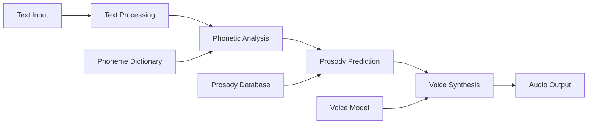

# Speech Synthesis and Natural Language Generation

Speech synthesis and Natural Language Generation (NLG) are crucial components of human-robot interaction, enabling robots to communicate with humans through natural, spoken language. This section covers text-to-speech systems, dialogue generation, and natural language response formulation.

## Overview of Speech Synthesis

Speech synthesis, also known as **Text-to-Speech (TTS)**, converts text into natural-sounding speech. Modern TTS systems use deep learning to produce human-like voices with appropriate prosody, emotion, and natural timing.



## Text-to-Speech Systems

### Traditional TTS Approaches

#### Concatenative Synthesis

Concatenative synthesis combines pre-recorded speech units to create new utterances:

```python
#!/usr/bin/env python3
"""
Concatenative TTS Example (Conceptual)
"""
import numpy as np
import rclpy
from rclpy.node import Node
from std_msgs.msg import String
from audio_common_msgs.msg import AudioData
import wave
import struct

class ConcatenativeTTSNode(Node):
    def __init__(self):
        super().__init__('concatenative_tts_node')

        # Create subscriber for text input
        self.text_sub = self.create_subscription(
            String, '/tts/input', self.text_callback, 10)

        # Create publisher for audio output
        self.audio_pub = self.create_publisher(AudioData, '/tts/output', 10)

        # Load phoneme database and audio units
        self.phoneme_database = self.load_phoneme_database()
        self.audio_units = self.load_audio_units()

        # Text processing components
        self.text_normalizer = TextNormalizer()
        self.phonetic_transcriber = PhoneticTranscriber()

        self.get_logger().info('Concatenative TTS node started')

    def load_phoneme_database(self):
        """Load phoneme-to-audio mapping database"""
        # In practice, this would load from files
        return {
            'AA': 'audio/aa.wav',
            'AE': 'audio/ae.wav',
            'AH': 'audio/ah.wav',
            # ... more phonemes
        }

    def load_audio_units(self):
        """Load audio units for concatenation"""
        # Load pre-recorded audio snippets
        units = {}
        for phoneme, filepath in self.phoneme_database.items():
            try:
                with wave.open(filepath, 'rb') as wf:
                    frames = wf.readframes(wf.getnframes())
                    audio_data = struct.unpack(f'<{len(frames)//2}h', frames)
                    units[phoneme] = np.array(audio_data, dtype=np.int16)
            except Exception as e:
                self.get_logger().warn(f'Could not load audio for {phoneme}: {e}')
        return units

    def text_callback(self, msg):
        """Process text and synthesize speech"""
        try:
            text = msg.data

            # Normalize text
            normalized_text = self.text_normalizer.normalize(text)

            # Convert to phonemes
            phonemes = self.phonetic_transcriber.transcribe(normalized_text)

            # Synthesize audio
            audio_data = self.synthesize_from_phonemes(phonemes)

            # Apply prosody (timing, emphasis)
            prosodic_audio = self.apply_prosody(audio_data, phonemes)

            # Publish audio
            audio_msg = AudioData()
            audio_msg.data = prosodic_audio.tobytes()
            self.audio_pub.publish(audio_msg)

            self.get_logger().info(f'Synthesized speech for: "{text}"')

        except Exception as e:
            self.get_logger().error(f'Error in TTS: {e}')

    def synthesize_from_phonemes(self, phonemes):
        """Synthesize audio from phoneme sequence"""
        audio_segments = []
        sample_rate = 16000

        for phoneme in phonemes:
            if phoneme in self.audio_units:
                audio_segment = self.audio_units[phoneme]
                audio_segments.append(audio_segment)
            else:
                # Use silence for unknown phonemes
                silence_duration = int(0.1 * sample_rate)  # 100ms silence
                silence = np.zeros(silence_duration, dtype=np.int16)
                audio_segments.append(silence)

        # Concatenate all segments
        if audio_segments:
            return np.concatenate(audio_segments)
        else:
            return np.zeros(int(0.5 * sample_rate), dtype=np.int16)  # Half second of silence

    def apply_prosody(self, audio_data, phonemes):
        """Apply prosodic features to audio"""
        # This would apply:
        # - Duration modification
        # - Pitch modification
        # - Intensity changes
        # - Pauses between words/phonemes
        return audio_data

class TextNormalizer:
    """Normalize text for TTS (numbers, abbreviations, etc.)"""
    def normalize(self, text):
        """Normalize text for phonetic transcription"""
        # Convert numbers to words
        import re
        text = re.sub(r'\b(\d+)\b', self.number_to_words, text)

        # Expand common abbreviations
        abbreviations = {
            'mr.': 'mister',
            'mrs.': 'missus',
            'dr.': 'doctor',
            'st.': 'street',
            'ave.': 'avenue',
            'etc.': 'et cetera'
        }

        for abbrev, expansion in abbreviations.items():
            text = text.replace(abbrev, expansion)

        return text.lower()

    def number_to_words(self, match):
        """Convert number to words"""
        number = int(match.group(1))
        # In practice, implement full number-to-word conversion
        return str(number)  # Simplified

class PhoneticTranscriber:
    """Convert text to phonetic representation"""
    def __init__(self):
        # Load pronunciation dictionary
        self.pronunciation_dict = self.load_pronunciation_dictionary()

    def load_pronunciation_dictionary(self):
        """Load pronunciation dictionary"""
        # In practice, load from CMU Pronouncing Dictionary or similar
        return {
            'hello': ['HH', 'AH', 'L', 'OW'],
            'world': ['W', 'ER', 'L', 'D'],
            'robot': ['R', 'OW', 'B', 'AH', 'T'],
            # ... more words
        }

    def transcribe(self, text):
        """Transcribe text to phonemes"""
        words = text.split()
        phonemes = []

        for word in words:
            if word in self.pronunciation_dict:
                phonemes.extend(self.pronunciation_dict[word])
            else:
                # Use simple fallback for unknown words
                phonemes.extend(self.simple_transcription(word))

            # Add word boundary marker
            phonemes.append('SP')

        return phonemes

    def simple_transcription(self, word):
        """Simple phonetic transcription for unknown words"""
        # This is a very simplified approach
        # In practice, use more sophisticated methods
        phoneme_map = {
            'a': 'AH', 'e': 'EH', 'i': 'IH', 'o': 'OW', 'u': 'UH',
            'b': 'B', 'd': 'D', 'f': 'F', 'g': 'G', 'k': 'K',
            'l': 'L', 'm': 'M', 'n': 'N', 'p': 'P', 's': 'S',
            't': 'T', 'v': 'V', 'z': 'Z'
        }

        phonemes = []
        for char in word.lower():
            if char in phoneme_map:
                phonemes.append(phoneme_map[char])

        return phonemes

def main(args=None):
    rclpy.init(args=args)
    node = ConcatenativeTTSNode()

    try:
        rclpy.spin(node)
    except KeyboardInterrupt:
        pass
    finally:
        node.destroy_node()
        rclpy.shutdown()

if __name__ == '__main__':
    main()
```

### Statistical Parametric Synthesis

Statistical parametric synthesis models the speech generation process statistically:

```python
#!/usr/bin/env python3
"""
Statistical Parametric TTS Example (Conceptual)
"""
import numpy as np
import torch
import torch.nn as nn
from sklearn.preprocessing import StandardScaler
import rclpy
from rclpy.node import Node
from std_msgs.msg import String
from audio_common_msgs.msg import AudioData

class StatisticalParametricTTS(Node):
    def __init__(self):
        super().__init__('statistical_parametric_tts')

        # Create subscriber and publisher
        self.text_sub = self.create_subscription(String, '/tts/input', self.text_callback, 10)
        self.audio_pub = self.create_publisher(AudioData, '/tts/output', 10)

        # Initialize statistical model
        self.acoustic_model = self.build_acoustic_model()
        self.duration_model = self.build_duration_model()

        # Feature extraction
        self.feature_extractor = FeatureExtractor()

        # Audio synthesis parameters
        self.sample_rate = 16000
        self.frame_shift = 0.01  # 10ms frame shift

        self.get_logger().info('Statistical parametric TTS node started')

    def build_acoustic_model(self):
        """Build acoustic model (conceptual)"""
        # In practice, this would be a trained neural network
        # For this example, we'll use a simple placeholder
        class AcousticModel(nn.Module):
            def __init__(self, input_dim=400, output_dim=80):  # 80 mel bins
                super().__init__()
                self.layers = nn.Sequential(
                    nn.Linear(input_dim, 512),
                    nn.ReLU(),
                    nn.Dropout(0.2),
                    nn.Linear(512, 512),
                    nn.ReLU(),
                    nn.Dropout(0.2),
                    nn.Linear(512, output_dim)
                )

            def forward(self, x):
                return self.layers(x)

        return AcousticModel()

    def build_duration_model(self):
        """Build duration model (conceptual)"""
        class DurationModel(nn.Module):
            def __init__(self, input_dim=200, output_dim=1):
                super().__init__()
                self.layers = nn.Sequential(
                    nn.Linear(input_dim, 256),
                    nn.ReLU(),
                    nn.Linear(256, 128),
                    nn.ReLU(),
                    nn.Linear(128, output_dim)
                )

            def forward(self, x):
                return torch.exp(self.layers(x))  # Exponential to ensure positive durations

        return DurationModel()

    def text_callback(self, msg):
        """Process text and generate speech"""
        try:
            text = msg.data

            # Extract linguistic features
            linguistic_features = self.feature_extractor.extract_features(text)

            # Generate acoustic features using statistical model
            acoustic_features = self.generate_acoustic_features(linguistic_features)

            # Synthesize waveform
            audio_waveform = self.synthesize_waveform(acoustic_features)

            # Publish audio
            audio_msg = AudioData()
            audio_msg.data = audio_waveform.astype(np.int16).tobytes()
            self.audio_pub.publish(audio_msg)

            self.get_logger().info(f'Statistical TTS: Synthesized audio for "{text}"')

        except Exception as e:
            self.get_logger().error(f'Error in statistical TTS: {e}')

    def generate_acoustic_features(self, linguistic_features):
        """Generate acoustic features from linguistic features"""
        with torch.no_grad():
            # Convert to tensor
            features_tensor = torch.FloatTensor(linguistic_features).unsqueeze(0)

            # Generate mel-spectrogram
            mel_spectrogram = self.acoustic_model(features_tensor)

            # Generate durations
            durations = self.duration_model(features_tensor)

            return mel_spectrogram.squeeze(0).numpy(), durations.squeeze(0).numpy()

    def synthesize_waveform(self, acoustic_features):
        """Synthesize audio waveform from acoustic features"""
        # In practice, use a vocoder like WaveNet, WaveGlow, or Griffin-Lim
        # For this example, we'll use a simplified approach

        mel_spectrogram, durations = acoustic_features

        # Convert mel-spectrogram back to waveform using Griffin-Lim algorithm
        # This is a simplified implementation
        waveform = self.griffin_lim_synthesis(mel_spectrogram)

        return waveform

    def griffin_lim_synthesis(self, mel_spectrogram):
        """Griffin-Lim algorithm for waveform synthesis"""
        # This is a simplified implementation
        # In practice, use proper Griffin-Lim implementation or neural vocoder

        # Convert mel-spectrogram to linear spectrogram
        linear_spectrogram = self.mel_to_linear(mel_spectrogram)

        # Apply Griffin-Lim algorithm
        n_iter = 60
        phase = np.exp(2j * np.pi * np.random.rand(*linear_spectrogram.shape))

        for i in range(n_iter):
            # Reconstruct complex spectrogram
            complex_spec = linear_spectrogram * phase

            # Convert back to time domain
            waveform = np.fft.irfft(complex_spec, axis=0)

            # Convert back to frequency domain
            reconstructed_spec = np.fft.rfft(waveform, axis=0)

            # Preserve magnitude, update phase
            phase = np.angle(reconstructed_spec)

        # Return real part of final reconstruction
        return waveform.real.flatten()

    def mel_to_linear(self, mel_spectrogram):
        """Convert mel-spectrogram to linear spectrogram"""
        # In practice, use proper mel-filterbank inversion
        # This is a simplified approximation
        return mel_spectrogram  # Placeholder

class FeatureExtractor:
    """Extract linguistic features for TTS"""
    def __init__(self):
        # Load linguistic analysis components
        self.phoneme_encoder = self.load_phoneme_encoder()
        self.prosody_analyzer = ProsodyAnalyzer()

    def extract_features(self, text):
        """Extract linguistic features from text"""
        # Tokenize text
        tokens = self.tokenize(text)

        # Convert to phonemes
        phonemes = self.phoneme_encoder.encode(tokens)

        # Analyze prosody
        prosody_features = self.prosody_analyzer.analyze(text)

        # Combine features
        linguistic_features = self.combine_features(phonemes, prosody_features)

        return linguistic_features

    def tokenize(self, text):
        """Tokenize text into words and punctuation"""
        import re
        # Simple tokenization (in practice, use more sophisticated NLP tools)
        tokens = re.findall(r'\b\w+\b|[^\w\s]', text.lower())
        return tokens

    def combine_features(self, phonemes, prosody_features):
        """Combine phonetic and prosodic features"""
        # This would create a feature vector suitable for the acoustic model
        # In practice, this would be more complex
        features = np.concatenate([
            self.encode_phonemes(phonemes),
            self.encode_prosody(prosody_features)
        ])
        return features

    def encode_phonemes(self, phonemes):
        """Encode phonemes as numerical features"""
        # In practice, use one-hot encoding or embedding lookup
        # This is a simplified approach
        encoded = []
        for ph in phonemes:
            encoded.extend([ord(c) for c in ph])  # Simple character encoding
        return np.array(encoded, dtype=np.float32)

    def encode_prosody(self, prosody_features):
        """Encode prosodic features"""
        # Encode stress, intonation, rhythm patterns
        features = []
        # Add prosodic feature values
        return np.array(features, dtype=np.float32)

class ProsodyAnalyzer:
    """Analyze prosodic features in text"""
    def analyze(self, text):
        """Analyze prosodic patterns in text"""
        features = {
            'stress_pattern': self.analyze_stress(text),
            'intonation_pattern': self.analyze_intonation(text),
            'pause_pattern': self.analyze_pauses(text)
        }
        return features

    def analyze_stress(self, text):
        """Analyze word stress patterns"""
        # In practice, use linguistic rules or learned models
        # This is a simplified approach
        words = text.split()
        stress_pattern = []
        for word in words:
            # Simple stress assignment (in practice, use dictionary or rules)
            if len(word) > 4:
                stress_pattern.append('primary')  # Longer words often stressed
            else:
                stress_pattern.append('secondary')
        return stress_pattern

    def analyze_intonation(self, text):
        """Analyze intonation patterns"""
        # Analyze sentence type (statement, question, exclamation)
        if text.endswith('?'):
            pattern = 'rising'  # Question intonation
        elif text.endswith('!'):
            pattern = 'emphatic'  # Exclamatory intonation
        else:
            pattern = 'falling'  # Statement intonation
        return pattern

    def analyze_pauses(self, text):
        """Analyze pause patterns"""
        # Analyze punctuation and syntactic boundaries
        pause_positions = []
        for i, char in enumerate(text):
            if char in '.!?;:,':
                pause_positions.append(i)
        return pause_positions

def main(args=None):
    rclpy.init(args=args)
    node = StatisticalParametricTTSNode()

    try:
        rclpy.spin(node)
    except KeyboardInterrupt:
        pass
    finally:
        node.destroy_node()
        rclpy.shutdown()

if __name__ == '__main__':
    main()
```

## Neural TTS Systems

### Tacotron-Based Systems

```python
#!/usr/bin/env python3
"""
Neural TTS with Tacotron Architecture
"""
import torch
import torch.nn as nn
import torch.nn.functional as F
import numpy as np
import rclpy
from rclpy.node import Node
from std_msgs.msg import String
from audio_common_msgs.msg import AudioData

class TacotronTTS(Node):
    def __init__(self):
        super().__init__('tacotron_tts')

        # Create subscriber and publisher
        self.text_sub = self.create_subscription(String, '/tts/input', self.text_callback, 10)
        self.audio_pub = self.create_publisher(AudioData, '/tts/output', 10)

        # Initialize Tacotron model
        self.tacotron_model = self.build_tacotron_model()
        self.vocoder = self.build_vocoder()  # Neural vocoder (WaveNet, WaveGlow, etc.)

        # Text processing
        self.text_processor = TextProcessor()

        # Audio parameters
        self.sample_rate = 22050
        self.n_mels = 80

        self.get_logger().info('Tacotron TTS node started')

    def build_tacotron_model(self):
        """Build Tacotron-style model"""
        class Tacotron2(nn.Module):
            def __init__(self, n_symbols=148, n_mels=80, encoder_embedding_dim=512,
                         encoder_n_conv_channels=512, encoder_kernel_size=5,
                         attention_dim=128, attention_location_n_filters=32,
                         attention_location_kernel_size=31,
                         decoder_rnn_dim=1024, prenet_dim=256,
                         max_decoder_steps=2000, gate_threshold=0.5,
                         p_attention_dropout=0.1, p_decoder_dropout=0.1):
                super().__init__()
                self.n_mels = n_mels
                self.n_frames_per_step = 1
                self.encoder_embedding_dim = encoder_embedding_dim
                self.max_decoder_steps = max_decoder_steps
                self.gate_threshold = gate_threshold

                self.embedding = nn.Embedding(n_symbols, encoder_embedding_dim)
                std = np.sqrt(2.0 / (n_symbols + encoder_embedding_dim))
                val = np.sqrt(3.0) * std  # uniform bounds for std
                self.embedding.weight.data.uniform_(-val, val)

                self.encoder = Encoder(encoder_n_conv_channels, encoder_kernel_size,
                                       encoder_embedding_dim)

                self.decoder = Decoder(decoder_rnn_dim, encoder_embedding_dim,
                                       n_mels, n_frames_per_step,
                                       attention_dim, attention_location_n_filters,
                                       attention_location_kernel_size,
                                       prenet_dim, max_decoder_steps, gate_threshold,
                                       p_attention_dropout, p_decoder_dropout)

                self.postnet = Postnet(n_mels)

            def parse_output(self, outputs, output_lengths=None):
                # Pack outputs if needed
                if output_lengths is not None:
                    # x is a packed variable
                    output = nn.utils.rnn.pack_padded_sequence(
                        outputs[0], output_lengths, batch_first=True)
                    output = nn.utils.rnn.pad_packed_sequence(
                        output, batch_first=True)[0]
                    return output
                else:
                    return outputs[0]

            def forward(self, inputs, input_lengths=None):
                input_embedded = self.embedding(inputs).transpose(1, 2)
                encoder_outputs = self.encoder(input_embedded, input_lengths)
                mel_outputs, gate_outputs, alignments = self.decoder(
                    encoder_outputs, input_lengths)
                mel_outputs_postnet = self.postnet(mel_outputs)
                mel_outputs_postnet = mel_outputs + mel_outputs_postnet

                return self.parse_output(
                    [mel_outputs, mel_outputs_postnet, gate_outputs, alignments])

        return Tacotron2()

    def text_callback(self, msg):
        """Process text and generate speech with neural TTS"""
        try:
            text = msg.data

            # Preprocess text
            sequence = self.text_processor.text_to_sequence(text)

            # Convert to tensor
            text_tensor = torch.LongTensor(sequence).unsqueeze(0).to(self.device)

            # Generate mel-spectrogram
            with torch.no_grad():
                mel_output, mel_output_postnet, gate_outputs, alignments = self.tacotron_model(text_tensor)

                # Generate audio waveform using vocoder
                audio = self.vocoder(mel_output_postnet)

                # Convert to audio message
                audio_msg = AudioData()
                audio_msg.data = audio.cpu().numpy().astype(np.int16).tobytes()
                self.audio_pub.publish(audio_msg)

                self.get_logger().info(f'Neural TTS: Generated speech for "{text}"')

        except Exception as e:
            self.get_logger().error(f'Error in neural TTS: {e}')

class TextProcessor:
    """Process text for neural TTS"""
    def __init__(self):
        # Define symbol set (simplified)
        self.symbols = '_ABCDEFGHIJKLMNOPQRSTUVWXYZabcdefghijklmnopqrstuvwxyz!\'(),-.:;? '
        self.symbol_to_id = {s: i for i, s in enumerate(self.symbols)}
        self.id_to_symbol = {i: s for i, s in enumerate(self.symbols)}

    def text_to_sequence(self, text):
        """Convert text to sequence of symbol IDs"""
        sequence = []
        for symbol in text:
            if symbol in self.symbol_to_id:
                sequence.append(self.symbol_to_id[symbol])
            else:
                # Use unknown symbol or space
                sequence.append(self.symbol_to_id.get(' ', 0))
        return sequence

    def sequence_to_text(self, sequence):
        """Convert sequence of IDs back to text"""
        result = ''
        for symbol_id in sequence:
            if symbol_id in self.id_to_symbol:
                result += self.id_to_symbol[symbol_id]
        return result

class Encoder(nn.Module):
    """Tacotron encoder"""
    def __init__(self, encoder_n_conv_channels, encoder_kernel_size, encoder_embedding_dim):
        super().__init__()
        convolutions = []
        for i in range(3):
            conv_layer = nn.Sequential(
                ConvNorm(encoder_embedding_dim if i == 0 else encoder_n_conv_channels,
                         encoder_n_conv_channels,
                         kernel_size=encoder_kernel_size, stride=1,
                         padding=int((encoder_kernel_size - 1) / 2), dilation=1,
                         w_init_gain='relu'),
                nn.BatchNorm1d(encoder_n_conv_channels))
            convolutions.append(conv_layer)
        self.convolutions = nn.ModuleList(convolutions)

        self.lstm = nn.LSTM(encoder_n_conv_channels, int(encoder_n_conv_channels / 2), 1,
                            batch_first=True, bidirectional=True)

    def forward(self, x, input_lengths):
        for conv in self.convolutions:
            x = F.dropout(F.relu(conv(x)), 0.5, self.training)

        x = x.transpose(1, 2)

        # pytorch tensor are not reversible, therefore we transpose
        input_lengths = input_lengths.cpu().numpy()
        x = nn.utils.rnn.pack_padded_sequence(
            x, input_lengths, batch_first=True)

        self.lstm.flatten_parameters()
        outputs, _ = self.lstm(x)

        outputs, _ = nn.utils.rnn.pad_packed_sequence(
            outputs, batch_first=True)

        return outputs

class Decoder(nn.Module):
    """Tacotron decoder"""
    def __init__(self, decoder_rnn_dim, encoder_embedding_dim, n_mels,
                 n_frames_per_step, attention_dim, attention_location_n_filters,
                 attention_location_kernel_size, prenet_dim, max_decoder_steps,
                 gate_threshold, p_attention_dropout, p_decoder_dropout):
        super().__init__()
        self.n_mels = n_mels
        self.n_frames_per_step = n_frames_per_step
        self.encoder_embedding_dim = encoder_embedding_dim
        self.attention_rnn_dim = decoder_rnn_dim
        self.decoder_rnn_dim = decoder_rnn_dim
        self.prenet_dim = prenet_dim
        self.max_decoder_steps = max_decoder_steps
        self.gate_threshold = gate_threshold
        self.p_attention_dropout = p_attention_dropout
        self.p_decoder_dropout = p_decoder_dropout

        self.prenet = Prenet(
            n_mels * n_frames_per_step,
            [prenet_dim, prenet_dim])

        self.attention_rnn = nn.LSTMCell(
            prenet_dim + encoder_embedding_dim,
            decoder_rnn_dim,
            1)

        self.attention_layer = Attention(
            decoder_rnn_dim, encoder_embedding_dim,
            attention_dim, attention_location_n_filters,
            attention_location_kernel_size)

        self.decoder_rnn = nn.LSTMCell(
            decoder_rnn_dim + encoder_embedding_dim,
            decoder_rnn_dim, 1)

        self.linear_projection = LinearNorm(
            decoder_rnn_dim + encoder_embedding_dim,
            n_mels * n_frames_per_step)

        self.gate_layer = LinearNorm(
            decoder_rnn_dim + encoder_embedding_dim, 1,
            bias=True, w_init_gain='sigmoid')

    def get_go_frame(self, memory):
        """Get all zeros frames to use as first decoder input"""
        B = memory.size(0)
        decoder_input = memory.new_zeros(
            B, self.n_mels * self.n_frames_per_step)
        return decoder_input

    def initialize_decoder_states(self, memory, mask):
        """Initialize decoder states"""
        B = memory.size(0)
        MAX_TIME = memory.size(1)

        self.attention_hidden = memory.new_zeros(
            B, self.attention_rnn_dim)
        self.attention_cell = memory.new_zeros(
            B, self.attention_rnn_dim)

        self.decoder_hidden = memory.new_zeros(
            B, self.decoder_rnn_dim)
        self.decoder_cell = memory.new_zeros(
            B, self.decoder_rnn_dim)

        self.attention_weights = memory.new_zeros(
            B, MAX_TIME)
        self.attention_weights_cum = memory.new_zeros(
            B, MAX_TIME)
        self.attention_context = memory.new_zeros(
            B, self.encoder_embedding_dim)

        self.memory = memory
        self.processed_memory = self.attention_layer.memory_layer(memory)
        self.mask = mask

    def parse_decoder_inputs(self, decoder_inputs):
        """Prepare decoder inputs, i.e. mel outputs"""
        # (B, n_mels, T_out) -> (B, T_out, n_mels)
        decoder_inputs = decoder_inputs.transpose(1, 2)
        decoder_inputs = decoder_inputs.view(
            decoder_inputs.size(0),
            int(decoder_inputs.size(1)/self.n_frames_per_step), -1)
        # (B, T_out, n_mels*n_frames_per_step)
        decoder_inputs = decoder_inputs.transpose(0, 1)
        # (T_out, B, n_mels*n_frames_per_step)
        return decoder_inputs

    def parse_decoder_outputs(self, mel_outputs, gate_outputs, alignments):
        """Merge a tensor B of shape (T_out, B, N) to a tensor of shape (B, N, T_out)"""
        # (T_out, B, N) -> (B, T_out, N)
        mel_outputs = mel_outputs.transpose(0, 1).contiguous()
        # (B, T_out, N) -> (B, N, T_out)
        mel_outputs = mel_outputs.transpose(1, 2)

        gate_outputs = gate_outputs.transpose(0, 1).contiguous()
        alignments = alignments.transpose(0, 1).contiguous()

        return mel_outputs, gate_outputs, alignments

    def decode(self, decoder_input):
        """Decode a single frame"""
        cell_input = torch.cat((decoder_input, self.attention_context), -1)

        self.attention_hidden, self.attention_cell = self.attention_rnn(
            cell_input, (self.attention_hidden, self.attention_cell))

        attention_weights_cat = torch.cat(
            (self.attention_weights.unsqueeze(1),
             self.attention_weights_cum.unsqueeze(1)), dim=1)
        self.attention_context, self.attention_weights = self.attention_layer(
            self.attention_hidden,
            self.memory,
            self.processed_memory,
            attention_weights_cat,
            self.mask)

        self.attention_weights_cum += self.attention_weights
        decoder_input = torch.cat(
            (self.attention_hidden, self.attention_context), -1)

        self.decoder_hidden, self.decoder_cell = self.decoder_rnn(
            decoder_input, (self.decoder_hidden, self.decoder_cell))

        decoder_hidden_attention_context = torch.cat(
            (self.decoder_hidden, self.attention_context), dim=1)
        decoder_output = self.linear_projection(
            decoder_hidden_attention_context)

        gate_prediction = self.gate_layer(decoder_hidden_attention_context)
        return decoder_output, gate_prediction, self.attention_weights

    def forward(self, memory, decoder_inputs, memory_lengths):
        """Forward pass"""
        decoder_input = self.get_go_frame(memory).unsqueeze(0)
        decoder_inputs = self.parse_decoder_inputs(decoder_inputs)
        decoder_inputs = torch.cat((decoder_input, decoder_inputs), dim=0)
        decoder_inputs = self.prenet(decoder_inputs)

        self.initialize_decoder_states(
            memory, mask=~get_mask_from_lengths(memory_lengths))

        mel_outputs, gate_outputs, alignments = [], [], []
        while len(mel_outputs) < decoder_inputs.size(0) - 1:
            decoder_input = decoder_inputs[len(mel_outputs)]
            mel_output, gate_output, attention_weights = self.decode(
                decoder_input)
            mel_outputs += [mel_output.squeeze(1)]
            gate_outputs += [gate_output.squeeze(1)]
            alignments += [attention_weights]

        mel_outputs, gate_outputs, alignments = self.parse_decoder_outputs(
            mel_outputs, gate_outputs, alignments)

        return mel_outputs, gate_outputs, alignments

class Postnet(nn.Module):
    """Postnet module for Tacotron"""
    def __init__(self, n_mels):
        super().__init__()
        self.convolutions = nn.ModuleList()

        self.convolutions.append(
            nn.Sequential(
                ConvNorm(n_mels, 512,
                         kernel_size=5, stride=1,
                         padding=2,
                         dilation=1, w_init_gain='tanh'),
                nn.BatchNorm1d(512)))
        for i in range(1, 5 - 1):
            self.convolutions.append(
                nn.Sequential(
                    ConvNorm(512,
                             512,
                             kernel_size=5, stride=1,
                             padding=2,
                             dilation=1, w_init_gain='tanh'),
                    nn.BatchNorm1d(512)))
        self.convolutions.append(
            nn.Sequential(
                ConvNorm(512, n_mels, kernel_size=5, stride=1,
                         padding=2, dilation=1, w_init_gain='linear'),
                nn.BatchNorm1d(n_mels)))

    def forward(self, x):
        for i in range(len(self.convolutions) - 1):
            x = F.dropout(torch.tanh(self.convolutions[i](x)), 0.5, self.training)
        x = F.dropout(self.convolutions[-1](x), 0.5, self.training)

        return x

def main(args=None):
    rclpy.init(args=args)
    node = TacotronTTSNode()

    try:
        rclpy.spin(node)
    except KeyboardInterrupt:
        pass
    finally:
        node.destroy_node()
        rclpy.shutdown()

if __name__ == '__main__':
    main()
```

## Natural Language Generation (NLG)

### Template-Based NLG

```python
#!/usr/bin/env python3
"""
Template-Based Natural Language Generation
"""
import rclpy
from rclpy.node import Node
from std_msgs.msg import String
from geometry_msgs.msg import PoseStamped
from sensor_msgs.msg import BatteryState
import json
import random
from string import Template

class TemplateNLGNode(Node):
    def __init__(self):
        super().__init__('template_nlg_node')

        # Create subscribers for different robot states
        self.battery_sub = self.create_subscription(BatteryState, '/battery/state', self.battery_callback, 10)
        self.pose_sub = self.create_subscription(PoseStamped, '/robot/pose', self.pose_callback, 10)
        self.status_sub = self.create_subscription(String, '/robot/status', self.status_callback, 10)

        # Create publisher for generated responses
        self.response_pub = self.create_publisher(String, '/nlg/response', 10)

        # NLG templates
        self.templates = {
            'battery_low': [
                'Warning: My battery level is at $percentage%. I should recharge soon.',
                'My battery is low at $percentage%. Initiating return to charging station.',
                'Battery alert: Current level is $percentage%. Returning to dock for charging.'
            ],
            'battery_critical': [
                'Critical battery level: $percentage%. Emergency shutdown initiated.',
                'Battery critically low at $percentage%. Activating emergency protocols.',
                'Emergency: Battery at $percentage%. Shutting down non-essential systems.'
            ],
            'navigation_success': [
                'Successfully reached destination at $location.',
                'Arrived at $location. Navigation complete.',
                'Destination $location reached successfully.'
            ],
            'navigation_failure': [
                'Unable to reach $location. Obstacle detected in path.',
                'Navigation failed to $location. Path blocked.',
                'Could not reach $location. Retrying with alternative route.'
            ],
            'greeting': [
                'Hello! How can I assist you today?',
                'Greetings! Ready to help with your tasks.',
                'Hi there! What would you like me to do?'
            ],
            'farewell': [
                'Goodbye! See you later.',
                'Farewell! Have a great day.',
                'Until next time!'
            ],
            'status_update': [
                'Current status: $status. Battery: $battery%.',
                'System status: $status. Power level: $battery%.',
                'Operating normally: $status. Charge: $battery%.'
            ]
        }

        # Context storage
        self.robot_state = {
            'battery_level': 100.0,
            'location': 'home_base',
            'status': 'idle',
            'last_update': self.get_clock().now().nanoseconds
        }

        self.get_logger().info('Template-based NLG node started')

    def battery_callback(self, msg):
        """Handle battery state updates"""
        self.robot_state['battery_level'] = msg.percentage * 100.0
        self.check_battery_status()

    def pose_callback(self, msg):
        """Handle pose updates"""
        # In practice, convert pose to meaningful location names
        self.robot_state['location'] = self.get_location_name(msg.pose)

    def status_callback(self, msg):
        """Handle status updates"""
        self.robot_state['status'] = msg.data
        self.generate_status_response()

    def check_battery_status(self):
        """Check battery level and generate appropriate response"""
        battery_level = self.robot_state['battery_level']

        if battery_level < 10.0:
            template_type = 'battery_critical'
        elif battery_level < 20.0:
            template_type = 'battery_low'
        else:
            return  # No need to speak about good battery

        # Select random template
        templates = self.templates[template_type]
        template_str = random.choice(templates)

        # Substitute variables
        template = Template(template_str)
        response_text = template.substitute(
            percentage=f'{battery_level:.1f}',
            location=self.robot_state['location']
        )

        self.publish_response(response_text)

    def get_location_name(self, pose):
        """Convert pose to meaningful location name"""
        # In practice, use a map of poses to location names
        # This is a simplified example
        x, y = pose.position.x, pose.position.y

        if abs(x) < 0.5 and abs(y) < 0.5:
            return 'home base'
        elif x > 2.0:
            return 'kitchen'
        elif x < -2.0:
            return 'office'
        elif y > 2.0:
            return 'living room'
        elif y < -2.0:
            return 'bedroom'
        else:
            return 'unknown location'

    def generate_status_response(self):
        """Generate response based on robot status"""
        if self.robot_state['status'] in ['idle', 'charging']:
            return  # Don't speak about idle status

        # Select template based on status
        if 'error' in self.robot_state['status'].lower():
            template_type = 'navigation_failure'
        else:
            template_type = 'status_update'

        templates = self.templates[template_type]
        template_str = random.choice(templates)

        # Substitute variables
        template = Template(template_str)
        response_text = template.substitute(
            status=self.robot_state['status'],
            battery=f'{self.robot_state["battery_level"]:.1f}',
            location=self.robot_state['location']
        )

        self.publish_response(response_text)

    def publish_response(self, text):
        """Publish generated response"""
        response_msg = String()
        response_msg.data = text
        self.response_pub.publish(response_msg)

        self.get_logger().info(f'NLG: {text}')

def main(args=None):
    rclpy.init(args=args)
    node = TemplateNLGNode()

    try:
        rclpy.spin(node)
    except KeyboardInterrupt:
        pass
    finally:
        node.destroy_node()
        rclpy.shutdown()

if __name__ == '__main__':
    main()
```

### Neural NLG

```python
#!/usr/bin/env python3
"""
Neural Natural Language Generation
"""
import rclpy
from rclpy.node import Node
from std_msgs.msg import String
from geometry_msgs.msg import PoseStamped
from sensor_msgs.msg import BatteryState
import torch
import torch.nn as nn
import numpy as np
from transformers import GPT2LMHeadModel, GPT2Tokenizer

class NeuralNLGNode(Node):
    def __init__(self):
        super().__init__('neural_nlg_node')

        # Create subscribers
        self.battery_sub = self.create_subscription(BatteryState, '/battery/state', self.battery_callback, 10)
        self.pose_sub = self.create_subscription(PoseStamped, '/robot/pose', self.pose_callback, 10)
        self.status_sub = self.create_subscription(String, '/robot/status', self.status_callback, 10)

        # Create publisher
        self.response_pub = self.create_publisher(String, '/nlg/neural_response', 10)

        # Initialize neural NLG model
        self.tokenizer = GPT2Tokenizer.from_pretrained('gpt2')
        self.model = GPT2LMHeadModel.from_pretrained('gpt2')

        # Add padding token if not present
        if self.tokenizer.pad_token is None:
            self.tokenizer.pad_token = self.tokenizer.eos_token

        # Robot context
        self.robot_context = {
            'name': 'Robot',
            'capabilities': ['navigation', 'manipulation', 'conversation'],
            'current_task': 'idle',
            'battery_level': 100.0,
            'location': 'home_base'
        }

        self.get_logger().info('Neural NLG node started')

    def battery_callback(self, msg):
        """Handle battery updates"""
        self.robot_context['battery_level'] = msg.percentage * 100.0

        if self.robot_context['battery_level'] < 20.0:
            prompt = f"The robot's battery is low at {self.robot_context['battery_level']:.1f}%. Generate a polite message requesting to return to charging station:"
            response = self.generate_response(prompt)
            self.publish_response(response)

    def pose_callback(self, msg):
        """Handle pose updates"""
        self.robot_context['location'] = self.get_location_name(msg.pose)

    def status_callback(self, msg):
        """Handle status updates"""
        self.robot_context['current_task'] = msg.data

        # Generate context-appropriate response
        if 'navigation' in msg.data.lower():
            prompt = f"Robot is navigating to a destination. Generate a status update message:"
            response = self.generate_response(prompt)
            self.publish_response(response)

    def generate_response(self, prompt):
        """Generate response using neural model"""
        try:
            # Encode prompt
            inputs = self.tokenizer.encode(prompt, return_tensors='pt', truncation=True, max_length=512)

            # Generate response
            with torch.no_grad():
                outputs = self.model.generate(
                    inputs,
                    max_length=inputs.shape[1] + 50,
                    num_return_sequences=1,
                    temperature=0.7,
                    do_sample=True,
                    pad_token_id=self.tokenizer.eos_token_id,
                    attention_mask=torch.ones_like(inputs)
                )

            # Decode response
            response = self.tokenizer.decode(outputs[0], skip_special_tokens=True)

            # Extract only the generated part (remove prompt)
            generated_part = response[len(prompt):].strip()

            # Clean up response
            if generated_part:
                # Take first sentence to avoid overly long responses
                sentences = generated_part.split('.')
                return sentences[0] + '.' if sentences else generated_part
            else:
                return "I'm ready to assist you."

        except Exception as e:
            self.get_logger().error(f'Error in neural generation: {e}')
            return "I'm ready to assist you."

    def get_location_name(self, pose):
        """Convert pose to location name"""
        # Simplified location mapping
        x, y = pose.position.x, pose.position.y

        if abs(x) < 0.5 and abs(y) < 0.5:
            return 'home base'
        elif x > 2.0:
            return 'kitchen'
        elif y > 2.0:
            return 'living room'
        else:
            return 'unknown location'

    def publish_response(self, text):
        """Publish generated response"""
        response_msg = String()
        response_msg.data = text
        self.response_pub.publish(response_msg)

        self.get_logger().info(f'Neural NLG: {text}')

def main(args=None):
    rclpy.init(args=args)
    node = NeuralNLGNode()

    try:
        rclpy.spin(node)
    except KeyboardInterrupt:
        pass
    finally:
        node.destroy_node()
        rclpy.shutdown()

if __name__ == '__main__':
    main()
```

## Dialogue Management

### Context-Aware Dialogue System

```python
#!/usr/bin/env python3
"""
Context-Aware Dialogue Management System
"""
import rclpy
from rclpy.node import Node
from std_msgs.msg import String
from geometry_msgs.msg import PoseStamped
from sensor_msgs.msg import BatteryState
import json
from typing import Dict, List, Any
import time

class DialogueManagerNode(Node):
    def __init__(self):
        super().__init__('dialogue_manager_node')

        # Create subscribers
        self.user_input_sub = self.create_subscription(String, '/speech/user_input', self.user_input_callback, 10)
        self.nlu_sub = self.create_subscription(String, '/nlu/intent', self.nlu_callback, 10)
        self.robot_state_subs = [
            self.create_subscription(BatteryState, '/battery/state', self.battery_callback, 10),
            self.create_subscription(PoseStamped, '/robot/pose', self.pose_callback, 10),
            self.create_subscription(String, '/robot/status', self.status_callback, 10)
        ]

        # Create publishers
        self.response_pub = self.create_publisher(String, '/tts/input', 10)
        self.dialogue_state_pub = self.create_publisher(String, '/dialogue/state', 10)

        # Dialogue state management
        self.conversation_context = {
            'current_topic': 'greeting',
            'user_profile': {},
            'robot_state': {},
            'dialogue_history': [],
            'current_intent': None,
            'pending_requests': [],
            'last_interaction_time': time.time()
        }

        # Dialogue flow management
        self.dialogue_flows = {
            'navigation': self.handle_navigation_dialogue,
            'information': self.handle_information_dialogue,
            'social': self.handle_social_dialogue,
            'task': self.handle_task_dialogue
        }

        # Context expiration
        self.context_timeout = 300  # 5 minutes

        self.get_logger().info('Dialogue manager node started')

    def user_input_callback(self, msg):
        """Handle user input and manage dialogue flow"""
        try:
            user_text = msg.data

            # Update dialogue history
            self.conversation_context['dialogue_history'].append({
                'speaker': 'user',
                'text': user_text,
                'timestamp': time.time(),
                'context_snapshot': self.conversation_context.copy()
            })

            # Trim history if too long
            if len(self.conversation_context['dialogue_history']) > 20:
                self.conversation_context['dialogue_history'] = self.conversation_context['dialogue_history'][-20:]

            # Process with NLU (in practice, this would be separate node)
            # For this example, we'll simulate NLU processing
            nlu_result = self.simulate_nlu_processing(user_text)

            # Update context with NLU result
            self.conversation_context['current_intent'] = nlu_result.get('intent', 'unknown')

            # Handle dialogue based on intent and context
            response = self.process_dialogue(nlu_result)

            # Publish response
            if response:
                response_msg = String()
                response_msg.data = response
                self.response_pub.publish(response_msg)

                # Update dialogue history with response
                self.conversation_context['dialogue_history'].append({
                    'speaker': 'robot',
                    'text': response,
                    'timestamp': time.time()
                })

                self.get_logger().info(f'Dialogue: {response}')

        except Exception as e:
            self.get_logger().error(f'Error in dialogue processing: {e}')

    def simulate_nlu_processing(self, text):
        """Simulate NLU processing (in practice, use actual NLU node)"""
        # This is a simplified simulation
        # In practice, this would be handled by NLU node
        text_lower = text.lower()

        if any(word in text_lower for word in ['navigate', 'go', 'move', 'drive', 'walk']):
            intent = 'navigation'
        elif any(word in text_lower for word in ['what', 'how', 'where', 'when', 'tell', 'describe']):
            intent = 'information'
        elif any(word in text_lower for word in ['hello', 'hi', 'hey', 'goodbye', 'bye', 'thanks']):
            intent = 'social'
        else:
            intent = 'task'

        return {
            'intent': intent,
            'confidence': 0.8,
            'entities': [],
            'original_text': text
        }

    def process_dialogue(self, nlu_result):
        """Process dialogue based on NLU result and context"""
        intent = nlu_result.get('intent', 'unknown')
        confidence = nlu_result.get('confidence', 0.0)

        # Check if we're in a multi-turn dialogue expecting specific input
        if self.conversation_context.get('waiting_for_response'):
            return self.handle_expected_response(nlu_result)

        # If confidence is low, ask for clarification
        if confidence < 0.6:
            return self.ask_for_clarification(nlu_result['original_text'])

        # Process based on intent
        if intent in self.dialogue_flows:
            return self.dialogue_flows[intent](nlu_result)
        else:
            return self.handle_unknown_intent(nlu_result)

    def handle_navigation_dialogue(self, nlu_result):
        """Handle navigation-related dialogue"""
        text = nlu_result['original_text'].lower()
        entities = nlu_result.get('entities', [])

        # Extract destination
        destination = self.extract_destination(text, entities)

        if destination:
            # Generate response about navigation
            response = f"Okay, I'll navigate to the {destination}."

            # Publish navigation command (would be handled by navigation system)
            nav_msg = String()
            nav_msg.data = f"navigate_to:{destination}"
            # In practice, publish to navigation command topic

            # Update context
            self.conversation_context['current_topic'] = 'navigation'
            self.conversation_context['destination'] = destination

            return response
        else:
            # Ask for destination
            self.conversation_context['waiting_for_response'] = True
            self.conversation_context['expected_entity'] = 'LOCATION'
            return "Where would you like me to go?"

    def handle_information_dialogue(self, nlu_result):
        """Handle information-seeking dialogue"""
        text = nlu_result['original_text'].lower()

        if 'battery' in text or 'power' in text:
            battery_level = self.conversation_context['robot_state'].get('battery_level', 100.0)
            return f"My battery level is {battery_level:.1f}%."
        elif 'location' in text or 'where' in text:
            location = self.conversation_context['robot_state'].get('location', 'unknown')
            return f"I am currently at {location}."
        elif 'time' in text or 'hour' in text:
            import datetime
            current_time = datetime.datetime.now().strftime("%H:%M")
            return f"The current time is {current_time}."
        else:
            return "I can provide information about my battery level, location, and time. What would you like to know?"

    def handle_social_dialogue(self, nlu_result):
        """Handle social interaction dialogue"""
        text = nlu_result['original_text'].lower()

        if 'hello' in text or 'hi' in text:
            return "Hello! How can I assist you today?"
        elif 'thank' in text:
            return "You're welcome! Is there anything else I can help with?"
        elif 'goodbye' in text or 'bye' in text:
            return "Goodbye! Have a great day!"
        else:
            return "Nice to meet you! How can I assist you?"

    def handle_task_dialogue(self, nlu_result):
        """Handle task-related dialogue"""
        text = nlu_result['original_text'].lower()

        # In a real system, this would interface with task planning system
        return "I can help with navigation and basic information. What would you like me to do?"

    def handle_unknown_intent(self, nlu_result):
        """Handle unknown or unclear intents"""
        text = nlu_result['original_text']

        # Try to infer intent from context
        if len(self.conversation_context['dialogue_history']) > 1:
            last_user_msg = self.conversation_context['dialogue_history'][-2]  # Previous user message
            if 'navigation' in last_user_msg.get('text', '').lower():
                # User might be continuing a navigation request
                self.conversation_context['waiting_for_response'] = True
                self.conversation_context['expected_entity'] = 'LOCATION'
                return "Could you specify the location you'd like me to go to?"

        return f"I'm not sure I understood '{text}'. Could you please rephrase that?"

    def ask_for_clarification(self, original_text):
        """Ask user to clarify their request"""
        return f"I didn't quite catch that. Could you please rephrase '{original_text}'?"

    def handle_expected_response(self, nlu_result):
        """Handle responses to expected queries"""
        expected_entity = self.conversation_context.get('expected_entity')
        text = nlu_result['original_text'].lower()

        if expected_entity == 'LOCATION':
            # Extract location from response
            location = self.extract_destination(text, nlu_result.get('entities', []))
            if location:
                # Process the location
                response = f"Okay, I'll navigate to the {location}."

                # Publish navigation command
                nav_msg = String()
                nav_msg.data = f"navigate_to:{location}"
                # In practice, publish to navigation command topic

                # Reset context
                self.conversation_context['waiting_for_response'] = False
                self.conversation_context['expected_entity'] = None

                return response
            else:
                return "I didn't understand the location. Could you please specify where you'd like me to go?"

        # Reset if unexpected response
        self.conversation_context['waiting_for_response'] = False
        self.conversation_context['expected_entity'] = None
        return self.process_dialogue(nlu_result)

    def extract_destination(self, text, entities):
        """Extract destination from text"""
        # In practice, use proper NER and location extraction
        # For this example, use simple keyword matching

        locations = ['kitchen', 'bedroom', 'living room', 'office', 'bathroom', 'garage', 'garden']

        for loc in locations:
            if loc in text:
                return loc

        # Check entities if provided
        for entity in entities:
            if entity.get('type') == 'LOCATION':
                return entity.get('value')

        return None

    def battery_callback(self, msg):
        """Update robot state with battery information"""
        self.conversation_context['robot_state']['battery_level'] = msg.percentage * 100.0

    def pose_callback(self, msg):
        """Update robot state with pose information"""
        self.conversation_context['robot_state']['pose'] = {
            'x': msg.pose.position.x,
            'y': msg.pose.position.y,
            'z': msg.pose.position.z
        }
        self.conversation_context['robot_state']['location'] = self.get_location_name(msg.pose)

    def status_callback(self, msg):
        """Update robot state with status information"""
        self.conversation_context['robot_state']['status'] = msg.data

    def get_location_name(self, pose):
        """Convert pose to meaningful location name"""
        x, y = pose.position.x, pose.position.y

        if abs(x) < 0.5 and abs(y) < 0.5:
            return 'home base'
        elif x > 2.0:
            return 'kitchen'
        elif x < -2.0:
            return 'office'
        elif y > 2.0:
            return 'living room'
        elif y < -2.0:
            return 'bedroom'
        else:
            return 'unknown location'

    def cleanup_context(self):
        """Clean up expired context information"""
        current_time = time.time()

        # Remove old dialogue history
        self.conversation_context['dialogue_history'] = [
            entry for entry in self.conversation_context['dialogue_history']
            if (current_time - entry['timestamp']) < self.context_timeout
        ]

def main(args=None):
    rclpy.init(args=args)
    node = DialogueManagerNode()

    # Timer for context cleanup
    cleanup_timer = node.create_timer(60.0, node.cleanup_context)  # Cleanup every minute

    try:
        rclpy.spin(node)
    except KeyboardInterrupt:
        pass
    finally:
        node.destroy_node()
        rclpy.shutdown()

if __name__ == '__main__':
    main()
```

## Quality Assessment and Optimization

### Speech Quality Metrics

```python
#!/usr/bin/env python3
"""
Speech Quality Assessment
"""
import numpy as np
import librosa
from scipy import signal
import rclpy
from rclpy.node import Node
from audio_common_msgs.msg import AudioData
from std_msgs.msg import Float32, String

class SpeechQualityAssessmentNode(Node):
    def __init__(self):
        super().__init__('speech_quality_assessment_node')

        # Create subscriber for audio
        self.audio_sub = self.create_subscription(AudioData, '/tts/output', self.audio_callback, 10)

        # Create publishers for quality metrics
        self.intelligibility_pub = self.create_publisher(Float32, '/tts/intelligibility', 10)
        self.naturalness_pub = self.create_publisher(Float32, '/tts/naturalness', 10)
        self.quality_status_pub = self.create_publisher(String, '/tts/quality_status', 10)

        # Quality assessment parameters
        self.sample_rate = 16000
        self.frame_size = 1024
        self.hop_length = 512

        # Initialize quality metrics
        self.quality_metrics = {
            'intelligibility': 0.0,
            'naturalness': 0.0,
            'quality_score': 0.0,
            'snr': 0.0,
            'spectral_features': {}
        }

        self.get_logger().info('Speech quality assessment node started')

    def audio_callback(self, msg):
        """Assess quality of generated speech"""
        try:
            # Decode audio data
            audio_data = np.frombuffer(msg.data, dtype=np.int16).astype(np.float32) / 32768.0

            # Calculate quality metrics
            metrics = self.calculate_quality_metrics(audio_data)

            # Publish metrics
            self.publish_quality_metrics(metrics)

            # Log quality assessment
            self.get_logger().info(
                f'Speech Quality - Intelligibility: {metrics["intelligibility"]:.3f}, '
                f'Naturalness: {metrics["naturalness"]:.3f}, '
                f'SNR: {metrics["snr"]:.2f}dB'
            )

        except Exception as e:
            self.get_logger().error(f'Error in speech quality assessment: {e}')

    def calculate_quality_metrics(self, audio_data):
        """Calculate various speech quality metrics"""
        metrics = {}

        # Signal-to-Noise Ratio (SNR)
        metrics['snr'] = self.calculate_snr(audio_data)

        # Spectral features for naturalness assessment
        spectral_features = self.extract_spectral_features(audio_data)
        metrics['spectral_features'] = spectral_features

        # Intelligibility estimation (simplified)
        metrics['intelligibility'] = self.estimate_intelligibility(audio_data)

        # Naturalness estimation (simplified)
        metrics['naturalness'] = self.estimate_naturalness(spectral_features)

        # Overall quality score
        metrics['quality_score'] = self.calculate_overall_quality(metrics)

        return metrics

    def calculate_snr(self, audio_data):
        """Calculate Signal-to-Noise Ratio"""
        # This is a simplified SNR calculation
        # In practice, use more sophisticated methods
        signal_power = np.mean(audio_data ** 2)
        noise_power = np.var(audio_data)  # Approximate noise as variance
        snr_db = 10 * np.log10(signal_power / (noise_power + 1e-10))  # Add small value to avoid division by zero
        return snr_db

    def extract_spectral_features(self, audio_data):
        """Extract spectral features for quality assessment"""
        # Compute STFT
        stft = librosa.stft(audio_data, n_fft=self.frame_size, hop_length=self.hop_length)
        magnitude = np.abs(stft)

        # Spectral centroid (measure of brightness)
        spectral_centroid = librosa.feature.spectral_centroid(S=magnitude)[0]
        avg_centroid = np.mean(spectral_centroid)

        # Spectral rolloff (frequency where 85% of energy is below)
        spectral_rolloff = librosa.feature.spectral_rolloff(S=magnitude)[0]
        avg_rolloff = np.mean(spectral_rolloff)

        # Zero crossing rate (measure of noisiness)
        zcr = librosa.feature.zero_crossing_rate(audio_data)[0]
        avg_zcr = np.mean(zcr)

        # MFCCs (for naturalness)
        mfccs = librosa.feature.mfcc(S=librosa.power_to_db(magnitude**2), n_mels=13)
        mfcc_mean = np.mean(mfccs, axis=1)

        return {
            'spectral_centroid': avg_centroid,
            'spectral_rolloff': avg_rolloff,
            'zero_crossing_rate': avg_zcr,
            'mfcc_mean': mfcc_mean.tolist()
        }

    def estimate_intelligibility(self, audio_data):
        """Estimate speech intelligibility"""
        # Simplified intelligibility estimation based on:
        # - SNR
        # - Spectral characteristics
        # - Temporal characteristics

        snr_score = min(1.0, max(0.0, (self.quality_metrics['snr'] - 10) / 20))  # Normalize SNR to 0-1

        # Estimate based on spectral features typical for human speech
        centroid_score = min(1.0, max(0.0, (self.quality_metrics['spectral_features']['spectral_centroid'] - 1000) / 2000))

        # Combine scores
        intelligibility = 0.6 * snr_score + 0.4 * centroid_score

        return min(1.0, max(0.0, intelligibility))

    def estimate_naturalness(self, spectral_features):
        """Estimate speech naturalness"""
        # Naturalness based on:
        # - Spectral characteristics matching human voice
        # - Smoothness of spectral transitions
        # - Natural prosodic patterns

        # Compare MFCCs to typical human voice patterns
        mfccs = np.array(spectral_features['mfcc_mean'])
        human_voice_template = np.array([0, -10, -5, -8, -12, -15, -18, -20, -22, -25, -28, -30, -32])  # Typical human voice MFCCs

        # Calculate similarity to human voice template
        similarity = 1.0 - np.mean(np.abs(mfccs - human_voice_template)) / 50.0  # Normalize

        # Zero-crossing rate should be in typical human range (not too breathy, not too harsh)
        zcr = spectral_features['zero_crossing_rate']
        zcr_target = 0.03  # Typical human voice ZCR
        zcr_score = 1.0 - abs(zcr - zcr_target) / 0.02  # Allow 0.02 deviation

        # Combine scores
        naturalness = 0.7 * max(0.0, min(1.0, similarity)) + 0.3 * max(0.0, min(1.0, zcr_score))

        return min(1.0, max(0.0, naturalness))

    def calculate_overall_quality(self, metrics):
        """Calculate overall speech quality score"""
        # Weighted combination of all metrics
        weights = {
            'intelligibility': 0.4,
            'naturalness': 0.4,
            'snr': 0.2  # Normalize SNR contribution
        }

        # Normalize SNR to 0-1 range (assume 0-40dB range)
        snr_normalized = min(1.0, max(0.0, metrics['snr'] / 40.0))

        overall_quality = (
            weights['intelligibility'] * metrics['intelligibility'] +
            weights['naturalness'] * metrics['naturalness'] +
            weights['snr'] * snr_normalized
        )

        return overall_quality

    def publish_quality_metrics(self, metrics):
        """Publish quality metrics"""
        # Publish intelligibility
        intelligibility_msg = Float32()
        intelligibility_msg.data = metrics['intelligibility']
        self.intelligibility_pub.publish(intelligibility_msg)

        # Publish naturalness
        naturalness_msg = Float32()
        naturalness_msg.data = metrics['naturalness']
        self.naturalness_pub.publish(naturalness_msg)

        # Publish quality status
        status_msg = String()
        status_msg.data = f"QUALITY:{metrics['quality_score']:.3f}:INTELLIGIBILITY:{metrics['intelligibility']:.3f}:NATURALNESS:{metrics['naturalness']:.3f}"
        self.quality_status_pub.publish(status_msg)

def main(args=None):
    rclpy.init(args=args)
    node = SpeechQualityAssessmentNode()

    try:
        rclpy.spin(node)
    except KeyboardInterrupt:
        pass
    finally:
        node.destroy_node()
        rclpy.shutdown()

if __name__ == '__main__':
    main()
```

## Best Practices

### 1. Performance Optimization

```python
# Good: Optimized TTS processing
def optimized_tts_processing():
    """Implement performance-optimized TTS"""
    # Use efficient data structures
    # Pre-allocate memory
    # Use vectorized operations
    # Implement proper buffering
    # Optimize neural network inference
    pass

# Bad: Inefficient processing
def inefficient_tts_processing():
    """Inefficient TTS implementation"""
    # Repeated memory allocation
    # Inefficient loops
    # No optimization
    # Blocking operations
    pass
```

### 2. Quality Management

```python
# Good: Quality-focused design
def quality_focused_design():
    """Focus on speech quality"""
    # Use high-quality models
    # Implement quality assessment
    # Monitor performance metrics
    # Adapt to environmental conditions
    pass

# Bad: No quality consideration
def quality_neglect_design():
    """No attention to quality"""
    # Use lowest quality settings
    # No quality monitoring
    # No adaptation
    # Poor audio processing
    pass
```

### 3. Robustness

```python
# Good: Robust error handling
def robust_error_handling():
    """Implement robust error handling"""
    # Validate inputs
    # Handle exceptions gracefully
    # Provide fallback mechanisms
    # Log errors appropriately
    pass

# Bad: Fragile implementation
def fragile_implementation():
    """Fragile with no error handling"""
    # No input validation
    # No exception handling
    # System crashes on errors
    # No fallbacks
    pass
```

## Common Issues and Troubleshooting

### 1. Audio Quality Issues

```bash
# Check audio device
aplay -l
arecord -l

# Monitor audio processing
rostopic hz /tts/output
rostopic echo /tts/quality_metrics
```

### 2. Performance Issues

```python
# Monitor TTS performance
def monitor_tts_performance():
    """Monitor TTS performance metrics"""
    # Processing time
    # Memory usage
    # CPU utilization
    # Real-time factor
    pass
```

### 3. Quality Degradation

```python
# Implement quality monitoring
def quality_monitoring():
    """Monitor speech quality"""
    # Intelligibility metrics
    # Naturalness scores
    # User feedback integration
    # Adaptive quality adjustment
    pass
```

## Next Steps

Now that you understand speech synthesis and natural language generation, continue to [Exercise: Complete Speech System](../week-10/exercise-speech) to build a complete speech processing system that integrates all the concepts learned.

## Exercises

1. Implement a neural TTS system with attention mechanisms
2. Create a dialogue manager with personality traits
3. Build a quality assessment system for speech output
4. Develop a multilingual speech synthesis system