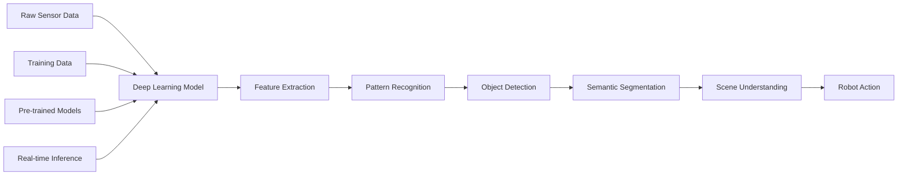

# Deep Learning Perception for Robotics

Deep learning has revolutionized robotics perception, enabling robots to understand their environment with unprecedented accuracy and robustness. This section covers how to integrate deep learning models for object detection, semantic segmentation, and scene understanding in robotic systems.

## Deep Learning in Robotics Perception

Deep learning models excel at perception tasks by learning complex feature representations directly from data:



### Advantages of Deep Learning Perception

| Advantage | Description |
|-----------|-------------|
| **Feature Learning** | Automatically learns relevant features from data |
| **Generalization** | Handles unseen environments and conditions |
| **Robustness** | Tolerates noise and variations in input |
| **Scalability** | Can handle complex, high-dimensional data |
| **Performance** | Achieves state-of-the-art accuracy |

### Challenges in Robotics

| Challenge | Solution |
|-----------|----------|
| **Real-time Requirements** | Model optimization and efficient inference |
| **Limited Compute** | Edge-optimized models and quantization |
| **Safety Critical** | Validation and quality assurance |
| **Data Scarcity** | Transfer learning and synthetic data |
| **Domain Adaptation** | Fine-tuning and domain adaptation |

## Neural Network Architectures for Perception

### Convolutional Neural Networks (CNNs)

CNNs are fundamental for visual perception:

```python
#!/usr/bin/env python3
"""
CNN Perception Node
"""
import rclpy
from rclpy.node import Node
from sensor_msgs.msg import Image
from vision_msgs.msg import Detection2DArray, Detection2D, ObjectHypothesisWithPose
from cv_bridge import CvBridge
import numpy as np
import torch
import torch.nn as nn
import torchvision.transforms as transforms

class CNNPerceptionNode(Node):
    def __init__(self):
        super().__init__('cnn_perception_node')

        # Create subscriber
        self.image_sub = self.create_subscription(
            Image, '/camera/image_raw', self.image_callback, 10)

        # Create publisher for detections
        self.detections_pub = self.create_publisher(Detection2DArray, '/cnn_detections', 10)

        # Initialize CV bridge
        self.bridge = CvBridge()

        # Initialize device
        self.device = torch.device('cuda' if torch.cuda.is_available() else 'cpu')

        # Load pre-trained model (conceptual - in practice, use actual model)
        self.model = self.load_model()
        self.model.to(self.device)
        self.model.eval()

        # Preprocessing transforms
        self.transform = transforms.Compose([
            transforms.ToTensor(),
            transforms.Resize((416, 416)),
            transforms.Normalize(mean=[0.485, 0.456, 0.406], std=[0.229, 0.224, 0.225])
        ])

        # COCO class names
        self.coco_classes = [
            'person', 'bicycle', 'car', 'motorcycle', 'airplane', 'bus', 'train',
            'truck', 'boat', 'traffic light', 'fire hydrant', 'stop sign',
            'parking meter', 'bench', 'bird', 'cat', 'dog', 'horse', 'sheep',
            'cow', 'elephant', 'bear', 'zebra', 'giraffe', 'backpack', 'umbrella',
            'handbag', 'tie', 'suitcase', 'frisbee', 'skis', 'snowboard',
            'sports ball', 'kite', 'baseball bat', 'baseball glove', 'skateboard',
            'surfboard', 'tennis racket', 'bottle', 'wine glass', 'cup', 'fork',
            'knife', 'spoon', 'bowl', 'banana', 'apple', 'sandwich', 'orange',
            'broccoli', 'carrot', 'hot dog', 'pizza', 'donut', 'cake', 'chair',
            'couch', 'potted plant', 'bed', 'dining table', 'toilet', 'tv',
            'laptop', 'mouse', 'remote', 'keyboard', 'cell phone', 'microwave',
            'oven', 'toaster', 'sink', 'refrigerator', 'book', 'clock', 'vase',
            'scissors', 'teddy bear', 'hair drier', 'toothbrush'
        ]

        self.get_logger().info('CNN perception node started')

    def load_model(self):
        """Load CNN model (conceptual)"""
        # In practice, load a pre-trained model like YOLOv5, YOLOv8, etc.
        # For this example, we'll use a dummy model
        class DummyModel(nn.Module):
            def __init__(self):
                super().__init__()

            def forward(self, x):
                # Return dummy detections (in practice, run actual model)
                batch_size = x.shape[0]
                # Simulate YOLO output format [batch, num_anchors, num_classes + 5]
                dummy_output = torch.zeros(batch_size, 25200, 85)  # YOLOv5 format
                return [dummy_output]

        return DummyModel()

    def image_callback(self, msg):
        """Process camera image with CNN"""
        try:
            # Convert ROS image to OpenCV
            cv_image = self.bridge.imgmsg_to_cv2(msg, 'bgr8')

            # Preprocess image
            input_tensor = self.preprocess_image(cv_image)

            # Run inference
            with torch.no_grad():
                outputs = self.model(input_tensor.to(self.device))

            # Post-process outputs
            detections = self.postprocess_outputs(outputs, cv_image.shape)

            # Publish detections
            self.publish_detections(detections, msg.header)

            self.get_logger().info(f'Detected {len(detections)} objects')

        except Exception as e:
            self.get_logger().error(f'Error in CNN perception: {e}')

    def preprocess_image(self, image):
        """Preprocess image for CNN"""
        # Resize and normalize
        resized = cv2.resize(image, (416, 416))
        normalized = resized.astype(np.float32) / 255.0

        # Convert to tensor and add batch dimension
        tensor = torch.from_numpy(normalized).permute(2, 0, 1).unsqueeze(0)

        return tensor

    def postprocess_outputs(self, outputs, image_shape):
        """Post-process CNN outputs"""
        # In a real implementation, this would decode the model outputs
        # For this example, we'll simulate detection results

        # Example: convert model outputs to bounding boxes
        # This is highly dependent on the specific model architecture
        detections = []

        # Simulate detections for demonstration
        height, width = image_shape[:2]
        for i in range(min(5, int(np.random.uniform(1, 6)))):  # 1-5 random detections
            # Random bounding box
            x = int(np.random.uniform(0, width - 100))
            y = int(np.random.uniform(0, height - 100))
            w = int(np.random.uniform(50, 200))
            h = int(np.random.uniform(50, 200))

            # Random class
            class_id = int(np.random.uniform(0, len(self.coco_classes)))
            class_name = self.coco_classes[class_id]

            # Random confidence
            confidence = np.random.uniform(0.5, 0.99)

            detection = {
                'bbox': [x, y, w, h],
                'class_id': class_id,
                'class_name': class_name,
                'confidence': confidence
            }

            detections.append(detection)

        return detections

    def publish_detections(self, detections, header):
        """Publish detection results"""
        detection_array = Detection2DArray()
        detection_array.header = header

        for det in detections:
            detection = Detection2D()
            detection.header = header

            # Set bounding box
            bbox = detection.bbox
            bbox.center.x = det['bbox'][0] + det['bbox'][2] / 2  # Center x
            bbox.center.y = det['bbox'][1] + det['bbox'][3] / 2  # Center y
            bbox.size_x = det['bbox'][2]  # Width
            bbox.size_y = det['bbox'][3]  # Height

            # Set classification
            hypothesis = ObjectHypothesisWithPose()
            hypothesis.hypothesis.class_id = det['class_name']
            hypothesis.hypothesis.score = det['confidence']
            detection.results.append(hypothesis)

            detection_array.detections.append(detection)

        self.detections_pub.publish(detection_array)

def main(args=None):
    rclpy.init(args=args)
    node = CNNPerceptionNode()

    try:
        rclpy.spin(node)
    except KeyboardInterrupt:
        pass
    finally:
        node.destroy_node()
        rclpy.shutdown()

if __name__ == '__main__':
    main()
```

## Object Detection Models

### YOLO (You Only Look Once)

YOLO provides real-time object detection:

```python
#!/usr/bin/env python3
"""
YOLO Object Detection Node
"""
import rclpy
from rclpy.node import Node
from sensor_msgs.msg import Image
from vision_msgs.msg import Detection2DArray, Detection2D, ObjectHypothesisWithPose
from cv_bridge import CvBridge
import numpy as np
import cv2

class YOLODetectionNode(Node):
    def __init__(self):
        super().__init__('yolo_detection_node')

        # Create subscriber
        self.image_sub = self.create_subscription(
            Image, '/camera/image_raw', self.image_callback, 10)

        # Create publisher
        self.detections_pub = self.create_publisher(Detection2DArray, '/yolo_detections', 10)

        # Initialize CV bridge
        self.bridge = CvBridge()

        # YOLO parameters
        self.conf_threshold = 0.5
        self.nms_threshold = 0.4
        self.input_width = 416
        self.input_height = 416

        # Load YOLO model (conceptual)
        self.net = self.load_yolo_model()

        self.get_logger().info('YOLO detection node started')

    def load_yolo_model(self):
        """Load YOLO model (conceptual)"""
        # In practice, load YOLO weights and configuration
        # net = cv2.dnn.readNet('yolov8.weights', 'yolov8.cfg')
        # For this example, return None and simulate detection
        return None

    def image_callback(self, msg):
        """Process image with YOLO detection"""
        try:
            cv_image = self.bridge.imgmsg_to_cv2(msg, 'bgr8')

            # Preprocess image
            blob = cv2.dnn.blobFromImage(
                cv_image, 1/255.0, (self.input_width, self.input_height),
                swapRB=True, crop=False)

            # Run YOLO inference (conceptual)
            if self.net is not None:
                self.net.setInput(blob)
                outputs = self.net.forward(self.get_output_layers())
            else:
                # Simulate YOLO outputs for demonstration
                outputs = self.simulate_yolo_outputs(cv_image.shape)

            # Process outputs
            detections = self.process_yolo_outputs(outputs, cv_image.shape)

            # Publish results
            self.publish_detections(detections, msg.header)

            self.get_logger().info(f'YOLO detected {len(detections)} objects')

        except Exception as e:
            self.get_logger().error(f'Error in YOLO detection: {e}')

    def simulate_yolo_outputs(self, image_shape):
        """Simulate YOLO outputs for demonstration"""
        # In a real implementation, this would come from the actual YOLO model
        # For this example, we'll create simulated outputs

        height, width = image_shape[:2]
        simulated_outputs = []

        # Simulate some detections
        for i in range(int(np.random.uniform(1, 6))):  # 1-5 random detections
            x = np.random.uniform(0, width)
            y = np.random.uniform(0, height)
            w = np.random.uniform(20, 200)
            h = np.random.uniform(20, 200)

            # Ensure bounding box stays within image bounds
            x = max(0, min(width - w, x))
            y = max(0, min(height - h, y))

            # Random class and confidence
            class_id = int(np.random.uniform(0, 80))  # 80 COCO classes
            confidence = np.random.uniform(0.5, 0.99)

            simulated_outputs.append({
                'x': x, 'y': y, 'w': w, 'h': h,
                'class_id': class_id, 'confidence': confidence
            })

        return simulated_outputs

    def process_yolo_outputs(self, outputs, image_shape):
        """Process YOLO outputs to get detections"""
        rows = outputs.shape[0]
        image_height, image_width = image_shape[:2]

        # Format: [center_x, center_y, width, height, conf, class_score0, class_score1, ...]
        # Filter based on confidence
        confidences = outputs[:, 4]
        class_ids = np.argmax(outputs[:, 5:], axis=1)
        class_scores = np.max(outputs[:, 5:], axis=1)

        # Apply confidence threshold
        mask = confidences > self.conf_threshold
        if not np.any(mask):
            return []

        # Apply class score threshold
        class_mask = class_scores > self.conf_threshold
        mask = mask & class_mask

        if not np.any(mask):
            return []

        # Get filtered results
        filtered_outputs = outputs[mask]
        filtered_confidences = confidences[mask]
        filtered_class_ids = class_ids[mask]
        filtered_class_scores = class_scores[mask]

        # Convert to bounding boxes
        boxes = []
        for i in range(len(filtered_outputs)):
            center_x = int(filtered_outputs[i, 0] * image_width)
            center_y = int(filtered_outputs[i, 1] * image_height)
            width = int(filtered_outputs[i, 2] * image_width)
            height = int(filtered_outputs[i, 3] * image_height)

            # Convert to top-left corner format
            left = int(center_x - width / 2)
            top = int(center_y - height / 2)

            boxes.append([left, top, width, height])

        # Apply non-maximum suppression
        indices = cv2.dnn.NMSBoxes(
            boxes, filtered_confidences.tolist(), self.conf_threshold, self.nms_threshold)

        if len(indices) == 0:
            return []

        # Prepare final detections
        detections = []
        for i in indices.flatten():
            left, top, width, height = boxes[i]
            class_id = int(filtered_class_ids[i])
            confidence = float(filtered_confidences[i])

            detection = {
                'bbox': [left, top, width, height],
                'class_id': class_id,
                'class_name': self.get_coco_class_name(class_id),
                'confidence': confidence
            }
            detections.append(detection)

        return detections

    def get_coco_class_name(self, class_id):
        """Get COCO class name for class ID"""
        coco_classes = [
            'person', 'bicycle', 'car', 'motorcycle', 'airplane', 'bus', 'train',
            'truck', 'boat', 'traffic light', 'fire hydrant', 'stop sign',
            'parking meter', 'bench', 'bird', 'cat', 'dog', 'horse', 'sheep',
            'cow', 'elephant', 'bear', 'zebra', 'giraffe', 'backpack', 'umbrella',
            'handbag', 'tie', 'suitcase', 'frisbee', 'skis', 'snowboard',
            'sports ball', 'kite', 'baseball bat', 'baseball glove', 'skateboard',
            'surfboard', 'tennis racket', 'bottle', 'wine glass', 'cup', 'fork',
            'knife', 'spoon', 'bowl', 'banana', 'apple', 'sandwich', 'orange',
            'broccoli', 'carrot', 'hot dog', 'pizza', 'donut', 'cake', 'chair',
            'couch', 'potted plant', 'bed', 'dining table', 'toilet', 'tv',
            'laptop', 'mouse', 'remote', 'keyboard', 'cell phone', 'microwave',
            'oven', 'toaster', 'sink', 'refrigerator', 'book', 'clock', 'vase',
            'scissors', 'teddy bear', 'hair drier', 'toothbrush'
        ]

        if 0 <= class_id < len(coco_classes):
            return coco_classes[class_id]
        else:
            return f'unknown_{class_id}'

    def get_output_layers(self):
        """Get output layer names (for real YOLO model)"""
        # In practice, get output layer names from YOLO model
        return ['output']

    def publish_detections(self, detections, header):
        """Publish detection results"""
        detection_array = Detection2DArray()
        detection_array.header = header

        for det in detections:
            detection = Detection2D()
            detection.header = header

            # Set bounding box
            bbox = detection.bbox
            bbox.center.x = det['bbox'][0] + det['bbox'][2] / 2  # Center x
            bbox.center.y = det['bbox'][1] + det['bbox'][3] / 2  # Center y
            bbox.size_x = det['bbox'][2]  # Width
            bbox.size_y = det['bbox'][3]  # Height

            # Set classification
            hypothesis = ObjectHypothesisWithPose()
            hypothesis.hypothesis.class_id = det['class_name']
            hypothesis.hypothesis.score = det['confidence']
            detection.results.append(hypothesis)

            detection_array.detections.append(detection)

        self.detections_pub.publish(detection_array)

def main(args=None):
    rclpy.init(args=args)
    node = YOLODetectionNode()

    try:
        rclpy.spin(node)
    except KeyboardInterrupt:
        pass
    finally:
        node.destroy_node()
        rclpy.shutdown()

if __name__ == '__main__':
    main()
```

## Semantic Segmentation

Semantic segmentation assigns class labels to each pixel:

```python
#!/usr/bin/env python3
"""
Semantic Segmentation Node
"""
import rclpy
from rclpy.node import Node
from sensor_msgs.msg import Image
from std_msgs.msg import UInt8MultiArray
from cv_bridge import CvBridge
import numpy as np
import cv2

class SemanticSegmentationNode(Node):
    def __init__(self):
        super().__init__('semantic_segmentation_node')

        # Create subscriber
        self.image_sub = self.create_subscription(
            Image, '/camera/image_raw', self.image_callback, 10)

        # Create publisher for segmentation mask
        self.segmentation_pub = self.create_publisher(UInt8MultiArray, '/segmentation_mask', 10)

        # Initialize CV bridge
        self.bridge = CvBridge()

        # Initialize segmentation model (conceptual)
        self.model = self.load_segmentation_model()

        # Color palette for visualization
        self.color_palette = self.create_color_palette()

        self.get_logger().info('Semantic segmentation node started')

    def load_segmentation_model(self):
        """Load segmentation model (conceptual)"""
        # In practice, load a model like DeepLab, PSPNet, etc.
        # For this example, return None and simulate segmentation
        return None

    def create_color_palette(self):
        """Create color palette for segmentation classes"""
        # 21 classes for PASCAL VOC (example)
        palette = np.array([
            [0, 0, 0],        # background
            [128, 0, 0],      # aeroplane
            [0, 128, 0],      # bicycle
            [128, 128, 0],    # bird
            [0, 0, 128],      # boat
            [128, 0, 128],    # bottle
            [0, 128, 128],    # bus
            [128, 128, 128],  # car
            [64, 0, 0],       # cat
            [192, 0, 0],      # chair
            [64, 128, 0],     # cow
            [192, 128, 0],    # dining table
            [64, 0, 128],     # dog
            [192, 0, 128],    # horse
            [64, 128, 128],   # motorbike
            [192, 128, 128],  # person
            [0, 64, 0],       # potted plant
            [128, 64, 0],     # sheep
            [0, 192, 0],      # sofa
            [128, 192, 0],    # train
            [0, 64, 128]      # tv/monitor
        ], dtype=np.uint8)
        return palette

    def image_callback(self, msg):
        """Process image with semantic segmentation"""
        try:
            cv_image = self.bridge.imgmsg_to_cv2(msg, 'bgr8')

            # Preprocess image
            input_tensor = self.preprocess_image(cv_image)

            # Run segmentation (conceptual)
            if self.model is not None:
                segmentation_mask = self.model(input_tensor)
            else:
                # Simulate segmentation for demonstration
                segmentation_mask = self.simulate_segmentation(cv_image.shape)

            # Publish segmentation results
            self.publish_segmentation(segmentation_mask, msg.header)

            # Log some statistics
            unique_labels, counts = np.unique(segmentation_mask, return_counts=True)
            self.get_logger().info(f'Segmented {len(unique_labels)} classes: {dict(zip(unique_labels, counts))}')

        except Exception as e:
            self.get_logger().error(f'Error in semantic segmentation: {e}')

    def preprocess_image(self, image):
        """Preprocess image for segmentation model"""
        # Resize image
        resized = cv2.resize(image, (512, 512))  # Common segmentation input size

        # Normalize
        normalized = resized.astype(np.float32) / 255.0

        # Convert to tensor format (CHW)
        tensor = np.transpose(normalized, (2, 0, 1))

        return tensor

    def simulate_segmentation(self, image_shape):
        """Simulate segmentation for demonstration"""
        height, width = image_shape[:2]

        # Create simulated segmentation mask
        segmentation_mask = np.zeros((height, width), dtype=np.uint8)

        # Add some random regions for different classes
        for class_id in range(1, min(10, len(self.color_palette))):  # Skip background
            # Create random region
            center_x = np.random.randint(width//4, 3*width//4)
            center_y = np.random.randint(height//4, 3*height//4)
            radius = np.random.randint(20, min(width, height)//4)

            # Create circular region
            y, x = np.ogrid[:height, :width]
            mask = (x - center_x)**2 + (y - center_y)**2 <= radius**2
            segmentation_mask[mask] = class_id

        return segmentation_mask

    def publish_segmentation(self, segmentation_mask, header):
        """Publish segmentation mask"""
        # Convert to message format
        mask_msg = UInt8MultiArray()
        mask_msg.header = header

        # Set layout (for 2D array)
        mask_msg.layout.dim = [
            UInt8MultiArray.DIMENSION_LABELS,
            UInt8MultiArray.DIMENSION_SIZES,
            UInt8MultiArray.DIMENSION_STRIDES
        ]

        # Flatten mask and publish
        mask_msg.data = segmentation_mask.flatten().tolist()

        self.segmentation_pub.publish(mask_msg)

        # Optionally publish colored visualization
        self.publish_colored_segmentation(segmentation_mask, header)

    def publish_colored_segmentation(self, segmentation_mask, header):
        """Publish colored segmentation for visualization"""
        # Convert segmentation mask to colored image
        colored_mask = self.color_palette[segmentation_mask]

        # Convert to ROS image message
        colored_msg = self.bridge.cv2_to_imgmsg(colored_mask, encoding='rgb8')
        colored_msg.header = header

        # Publish as image (with different topic)
        # In practice, you might want to create a separate publisher
        # self.colored_seg_pub.publish(colored_msg)

def main(args=None):
    rclpy.init(args=args)
    node = SemanticSegmentationNode()

    try:
        rclpy.spin(node)
    except KeyboardInterrupt:
        pass
    finally:
        node.destroy_node()
        rclpy.shutdown()

if __name__ == '__main__':
    main()
```

## Instance Segmentation

Instance segmentation distinguishes between different instances of the same class:

```python
#!/usr/bin/env python3
"""
Instance Segmentation Node
"""
import rclpy
from rclpy.node import Node
from sensor_msgs.msg import Image
from vision_msgs.msg import Detection2DArray, Detection2D, ObjectHypothesisWithPose
from geometry_msgs.msg import Point32
from cv_bridge import CvBridge
import numpy as np
import cv2

class InstanceSegmentationNode(Node):
    def __init__(self):
        super().__init__('instance_segmentation_node')

        # Create subscriber
        self.image_sub = self.create_subscription(
            Image, '/camera/image_raw', self.image_callback, 10)

        # Create publisher for instance detections
        self.instance_detections_pub = self.create_publisher(Detection2DArray, '/instance_detections', 10)

        # Initialize CV bridge
        self.bridge = CvBridge()

        # Initialize instance segmentation model (conceptual)
        self.model = self.load_instance_model()

        self.get_logger().info('Instance segmentation node started')

    def load_instance_model(self):
        """Load instance segmentation model (conceptual)"""
        # In practice, load Mask R-CNN, YOLACT, etc.
        # For this example, return None and simulate detection
        return None

    def image_callback(self, msg):
        """Process image with instance segmentation"""
        try:
            cv_image = self.bridge.imgmsg_to_cv2(msg, 'bgr8')

            # Run instance segmentation (conceptual)
            if self.model is not None:
                results = self.model(cv_image)
            else:
                # Simulate instance segmentation
                results = self.simulate_instance_segmentation(cv_image)

            # Publish results
            self.publish_instance_detections(results, msg.header)

            self.get_logger().info(f'Detected {len(results)} instances')

        except Exception as e:
            self.get_logger().error(f'Error in instance segmentation: {e}')

    def simulate_instance_segmentation(self, image):
        """Simulate instance segmentation for demonstration"""
        height, width = image.shape[:2]
        results = []

        # Simulate instance detections
        for i in range(int(np.random.uniform(1, 5))):  # 1-4 random instances
            # Random bounding box
            x = int(np.random.uniform(0, width - 100))
            y = int(np.random.uniform(0, height - 100))
            w = int(np.random.uniform(50, 200))
            h = int(np.random.uniform(50, 200))

            # Random class
            class_id = int(np.random.uniform(0, 80))  # COCO class ID

            # Random confidence
            confidence = np.random.uniform(0.6, 0.99)

            # Create random segmentation mask (simplified)
            mask = np.zeros((height, width), dtype=np.uint8)
            center_x, center_y = x + w//2, y + h//2
            radius = min(w, h) // 2

            # Create circular mask
            cv2.circle(mask, (center_x, center_y), radius, 1, -1)

            instance_result = {
                'bbox': [x, y, w, h],
                'class_id': class_id,
                'class_name': self.get_coco_class_name(class_id),
                'confidence': confidence,
                'mask': mask,
                'instance_id': i  # Unique instance identifier
            }

            results.append(instance_result)

        return results

    def publish_instance_detections(self, results, header):
        """Publish instance detection results"""
        detection_array = Detection2DArray()
        detection_array.header = header

        for result in results:
            detection = Detection2D()
            detection.header = header

            # Set bounding box
            bbox = detection.bbox
            bbox.center.x = result['bbox'][0] + result['bbox'][2] / 2  # Center x
            bbox.center.y = result['bbox'][1] + result['bbox'][3] / 2  # Center y
            bbox.size_x = result['bbox'][2]  # Width
            bbox.size_y = result['bbox'][3]  # Height

            # Set classification
            hypothesis = ObjectHypothesisWithPose()
            hypothesis.hypothesis.class_id = result['class_name']
            hypothesis.hypothesis.score = result['confidence']
            detection.results.append(hypothesis)

            # In a real implementation, you would also publish the segmentation mask
            # This would require a custom message type or encoding in the Detection2D

            detection_array.detections.append(detection)

        self.instance_detections_pub.publish(detection_array)

    def get_coco_class_name(self, class_id):
        """Get COCO class name for class ID"""
        coco_classes = [
            'person', 'bicycle', 'car', 'motorcycle', 'airplane', 'bus', 'train',
            'truck', 'boat', 'traffic light', 'fire hydrant', 'stop sign',
            'parking meter', 'bench', 'bird', 'cat', 'dog', 'horse', 'sheep',
            'cow', 'elephant', 'bear', 'zebra', 'giraffe', 'backpack', 'umbrella',
            'handbag', 'tie', 'suitcase', 'frisbee', 'skis', 'snowboard',
            'sports ball', 'kite', 'baseball bat', 'baseball glove', 'skateboard',
            'surfboard', 'tennis racket', 'bottle', 'wine glass', 'cup', 'fork',
            'knife', 'spoon', 'bowl', 'banana', 'apple', 'sandwich', 'orange',
            'broccoli', 'carrot', 'hot dog', 'pizza', 'donut', 'cake', 'chair',
            'couch', 'potted plant', 'bed', 'dining table', 'toilet', 'tv',
            'laptop', 'mouse', 'remote', 'keyboard', 'cell phone', 'microwave',
            'oven', 'toaster', 'sink', 'refrigerator', 'book', 'clock', 'vase',
            'scissors', 'teddy bear', 'hair drier', 'toothbrush'
        ]

        if 0 <= class_id < len(coco_classes):
            return coco_classes[class_id]
        else:
            return f'unknown_{class_id}'

def main(args=None):
    rclpy.init(args=args)
    node = InstanceSegmentationNode()

    try:
        rclpy.spin(node)
    except KeyboardInterrupt:
        pass
    finally:
        node.destroy_node()
        rclpy.shutdown()

if __name__ == '__main__':
    main()
```

## 3D Object Detection

### Point Cloud Processing

```python
#!/usr/bin/env python3
"""
3D Object Detection Node
"""
import rclpy
from rclpy.node import Node
from sensor_msgs.msg import PointCloud2, Image
from vision_msgs.msg import Detection3DArray, Detection3D, ObjectHypothesisWithPose
from geometry_msgs.msg import Point, Pose, Quaternion
from cv_bridge import CvBridge
import numpy as np
import sensor_msgs_py.point_cloud2 as pc2

class PointCloud3DNode(Node):
    def __init__(self):
        super().__init__('pointcloud_3d_node')

        # Create subscriber for point cloud
        self.pc_sub = self.create_subscription(
            PointCloud2, '/lidar/points', self.pointcloud_callback, 10)

        # Create publisher for 3D detections
        self.detections_3d_pub = self.create_publisher(Detection3DArray, '/3d_detections', 10)

        # Initialize CV bridge (for potential RGB-D fusion)
        self.bridge = CvBridge()

        # Initialize 3D detection model (conceptual)
        self.model = self.load_3d_model()

        # 3D detection parameters
        self.min_points_threshold = 10  # Minimum points for object
        self.cluster_tolerance = 0.5    # Distance tolerance for clustering
        self.min_cluster_size = 10      # Minimum cluster size
        self.max_cluster_size = 25000   # Maximum cluster size

        self.get_logger().info('3D object detection node started')

    def load_3d_model(self):
        """Load 3D detection model (conceptual)"""
        # In practice, load PointNet++, VoteNet, etc.
        # For this example, return None and simulate detection
        return None

    def pointcloud_callback(self, msg):
        """Process point cloud with 3D object detection"""
        try:
            # Convert PointCloud2 to numpy array
            points = self.pointcloud_to_array(msg)

            if len(points) == 0:
                return

            # Run 3D detection (conceptual)
            if self.model is not None:
                results = self.model(points)
            else:
                # Simulate 3D detection
                results = self.simulate_3d_detection(points)

            # Publish results
            self.publish_3d_detections(results, msg.header)

            self.get_logger().info(f'3D detected {len(results)} objects')

        except Exception as e:
            self.get_logger().error(f'Error in 3D detection: {e}')

    def pointcloud_to_array(self, cloud_msg):
        """Convert PointCloud2 to numpy array"""
        points = []
        for point in pc2.read_points(cloud_msg, field_names=("x", "y", "z"), skip_nans=True):
            points.append([point[0], point[1], point[2]])

        return np.array(points)

    def simulate_3d_detection(self, points):
        """Simulate 3D object detection for demonstration"""
        if len(points) == 0:
            return []

        results = []

        # Simple clustering-based approach (in practice, use deep learning)
        # This is a simplified simulation
        for i in range(min(5, len(points) // 100)):  # Create up to 5 clusters
            # Random center for object
            center_idx = np.random.randint(0, len(points))
            center = points[center_idx]

            # Create object around center
            object_points = points[
                np.linalg.norm(points - center, axis=1) < 1.0  # Within 1m radius
            ]

            if len(object_points) >= self.min_points_threshold:
                # Calculate bounding box
                min_coords = np.min(object_points, axis=0)
                max_coords = np.max(object_points, axis=0)

                # Calculate center and dimensions
                center_3d = (min_coords + max_coords) / 2
                dimensions = max_coords - min_coords

                # Random class and confidence
                class_id = int(np.random.uniform(0, 80))  # COCO class ID
                confidence = np.random.uniform(0.6, 0.95)

                detection = {
                    'center': center_3d,
                    'dimensions': dimensions,
                    'points': object_points,
                    'class_id': class_id,
                    'class_name': self.get_coco_class_name(class_id),
                    'confidence': confidence
                }

                results.append(detection)

        return results

    def publish_3d_detections(self, results, header):
        """Publish 3D detection results"""
        detection_array = Detection3DArray()
        detection_array.header = header

        for result in results:
            detection = Detection3D()
            detection.header = header

            # Set 3D pose
            pose = detection.bbox.center
            pose.position.x = result['center'][0]
            pose.position.y = result['center'][1]
            pose.position.z = result['center'][2]

            # Set orientation (simplified - in practice, estimate from object shape)
            pose.orientation.w = 1.0
            pose.orientation.x = 0.0
            pose.orientation.y = 0.0
            pose.orientation.z = 0.0

            # Set 3D dimensions
            dims = detection.bbox.size
            dims.x = result['dimensions'][0]
            dims.y = result['dimensions'][1]
            dims.z = result['dimensions'][2]

            # Set classification
            hypothesis = ObjectHypothesisWithPose()
            hypothesis.hypothesis.class_id = result['class_name']
            hypothesis.hypothesis.score = result['confidence']
            detection.results.append(hypothesis)

            detection_array.detections.append(detection)

        self.detections_3d_pub.publish(detection_array)

    def get_coco_class_name(self, class_id):
        """Get COCO class name for class ID"""
        coco_classes = [
            'person', 'bicycle', 'car', 'motorcycle', 'airplane', 'bus', 'train',
            'truck', 'boat', 'traffic light', 'fire hydrant', 'stop sign',
            'parking meter', 'bench', 'bird', 'cat', 'dog', 'horse', 'sheep',
            'cow', 'elephant', 'bear', 'zebra', 'giraffe', 'backpack', 'umbrella',
            'handbag', 'tie', 'suitcase', 'frisbee', 'skis', 'snowboard',
            'sports ball', 'kite', 'baseball bat', 'baseball glove', 'skateboard',
            'surfboard', 'tennis racket', 'bottle', 'wine glass', 'cup', 'fork',
            'knife', 'spoon', 'bowl', 'banana', 'apple', 'sandwich', 'orange',
            'broccoli', 'carrot', 'hot dog', 'pizza', 'donut', 'cake', 'chair',
            'couch', 'potted plant', 'bed', 'dining table', 'toilet', 'tv',
            'laptop', 'mouse', 'remote', 'keyboard', 'cell phone', 'microwave',
            'oven', 'toaster', 'sink', 'refrigerator', 'book', 'clock', 'vase',
            'scissors', 'teddy bear', 'hair drier', 'toothbrush'
        ]

        if 0 <= class_id < len(coco_classes):
            return coco_classes[class_id]
        else:
            return f'unknown_{class_id}'

def main(args=None):
    rclpy.init(args=args)
    node = PointCloud3DNode()

    try:
        rclpy.spin(node)
    except KeyboardInterrupt:
        pass
    finally:
        node.destroy_node()
        rclpy.shutdown()

if __name__ == '__main__':
    main()
```

## Deep Learning Model Integration

### PyTorch Integration

```python
#!/usr/bin/env python3
"""
PyTorch Model Integration Node
"""
import rclpy
from rclpy.node import Node
from sensor_msgs.msg import Image
from vision_msgs.msg import Detection2DArray
from cv_bridge import CvBridge
import torch
import torchvision
from torchvision import transforms

class PyTorchPerceptionNode(Node):
    def __init__(self):
        super().__init__('pytorch_perception_node')

        # Create subscriber
        self.image_sub = self.create_subscription(
            Image, '/camera/image_raw', self.image_callback, 10)

        # Create publisher
        self.detections_pub = self.create_publisher(Detection2DArray, '/pytorch_detections', 10)

        # Initialize CV bridge
        self.bridge = CvBridge()

        # Initialize device
        self.device = torch.device('cuda' if torch.cuda.is_available() else 'cpu')

        # Load pre-trained model
        self.model = self.load_model()
        self.model.to(self.device)
        self.model.eval()

        # Preprocessing transforms
        self.transform = transforms.Compose([
            transforms.ToTensor(),
            transforms.Resize((640, 640)),
            transforms.Normalize(mean=[0.485, 0.456, 0.406], std=[0.229, 0.224, 0.225])
        ])

        # Model-specific parameters
        self.confidence_threshold = 0.5
        self.nms_threshold = 0.4

        self.get_logger().info(f'PyTorch perception node started on {self.device}')

    def load_model(self):
        """Load PyTorch model"""
        try:
            # Load pre-trained model (e.g., Faster R-CNN)
            model = torchvision.models.detection.fasterrcnn_resnet50_fpn(pretrained=True)
            model.eval()
            return model
        except Exception as e:
            self.get_logger().warn(f'Could not load pre-trained model: {e}')
            self.get_logger().info('Using dummy model for demonstration')
            return self.create_dummy_model()

    def create_dummy_model(self):
        """Create a dummy model for demonstration"""
        class DummyModel(torch.nn.Module):
            def __init__(self):
                super().__init__()

            def forward(self, x):
                # Return dummy detections in format similar to torchvision models
                batch_size = x.shape[0]
                dummy_boxes = torch.tensor([[[100, 100, 200, 200], [300, 300, 400, 400]]]).repeat(batch_size, 1, 1)
                dummy_scores = torch.tensor([[0.9, 0.8]]).repeat(batch_size, 1)
                dummy_labels = torch.tensor([[1, 2]]).repeat(batch_size, 1)

                return [{'boxes': dummy_boxes[0], 'scores': dummy_scores[0], 'labels': dummy_labels[0]}]

        return DummyModel()

    def image_callback(self, msg):
        """Process image with PyTorch model"""
        try:
            cv_image = self.bridge.imgmsg_to_cv2(msg, 'bgr8')

            # Preprocess image
            input_tensor = self.preprocess_image(cv_image)

            # Run inference
            with torch.no_grad():
                outputs = self.model(input_tensor)

            # Process outputs
            detections = self.process_pytorch_outputs(outputs, cv_image.shape)

            # Publish results
            self.publish_detections(detections, msg.header)

            self.get_logger().info(f'PyTorch detected {len(detections)} objects')

        except Exception as e:
            self.get_logger().error(f'Error in PyTorch perception: {e}')

    def preprocess_image(self, image):
        """Preprocess image for PyTorch model"""
        # Convert BGR to RGB
        rgb_image = cv2.cvtColor(image, cv2.COLOR_BGR2RGB)

        # Apply transforms
        tensor = self.transform(rgb_image)

        # Add batch dimension
        batch_tensor = tensor.unsqueeze(0)

        return batch_tensor.to(self.device)

    def process_pytorch_outputs(self, outputs, image_shape):
        """Process PyTorch model outputs"""
        height, width = image_shape[:2]
        detections = []

        for output in outputs:
            boxes = output['boxes'].cpu().numpy()
            scores = output['scores'].cpu().numpy()
            labels = output['labels'].cpu().numpy()

            # Filter by confidence
            valid_indices = scores > self.confidence_threshold

            for i in valid_indices.nonzero()[0]:
                box = boxes[i]
                score = scores[i]
                label = labels[i]

                # Convert to image coordinates
                x1, y1, x2, y2 = box
                x = int(x1 * width / 640)  # Scale back to original image size
                y = int(y1 * height / 640)
                w = int((x2 - x1) * width / 640)
                h = int((y2 - y1) * height / 640)

                detection = {
                    'bbox': [x, y, w, h],
                    'class_id': int(label),
                    'class_name': self.get_coco_class_name(int(label)),
                    'confidence': float(score)
                }

                detections.append(detection)

        return detections

def main(args=None):
    rclpy.init(args=args)
    node = PyTorchPerceptionNode()

    try:
        rclpy.spin(node)
    except KeyboardInterrupt:
        pass
    finally:
        node.destroy_node()
        rclpy.shutdown()

if __name__ == '__main__':
    main()
```

## Performance Optimization

### Model Quantization

```python
#!/usr/bin/env python3
"""
Quantized Model Node for Performance
"""
import rclpy
from rclpy.node import Node
from sensor_msgs.msg import Image
from vision_msgs.msg import Detection2DArray
from cv_bridge import CvBridge
import torch
import torch.quantization

class QuantizedPerceptionNode(Node):
    def __init__(self):
        super().__init__('quantized_perception_node')

        # Create subscriber
        self.image_sub = self.create_subscription(
            Image, '/camera/image_raw', self.image_callback, 10)

        # Create publisher
        self.detections_pub = self.create_publisher(Detection2DArray, '/quantized_detections', 10)

        # Initialize CV bridge
        self.bridge = CvBridge()

        # Initialize device
        self.device = torch.device('cuda' if torch.cuda.is_available() else 'cpu')

        # Load and quantize model
        self.model = self.load_and_quantize_model()
        self.model.to(self.device)
        self.model.eval()

        self.get_logger().info(f'Quantized perception node started on {self.device}')

    def load_and_quantize_model(self):
        """Load and quantize model for better performance"""
        try:
            # Load original model
            model = torch.hub.load('ultralytics/yolov5', 'yolov5s', pretrained=True)

            # Set to evaluation mode
            model.eval()

            # Quantize the model
            quantized_model = torch.quantization.quantize_dynamic(
                model, {torch.nn.Conv2d, torch.nn.Linear}, dtype=torch.qint8
            )

            self.get_logger().info('Model successfully quantized')
            return quantized_model

        except Exception as e:
            self.get_logger().error(f'Error in model quantization: {e}')
            # Fallback to original model
            return model

    def image_callback(self, msg):
        """Process image with quantized model"""
        try:
            cv_image = self.bridge.imgmsg_to_cv2(msg, 'bgr8')

            # Preprocess image
            input_tensor = self.preprocess_image(cv_image)

            # Run inference
            with torch.no_grad():
                start_time = self.get_clock().now()
                outputs = self.model(input_tensor)
                inference_time = (self.get_clock().now() - start_time).nanoseconds / 1e9

            # Process outputs
            detections = self.process_outputs(outputs, cv_image.shape)

            # Publish results
            self.publish_detections(detections, msg.header)

            self.get_logger().info(
                f'Quantized model detected {len(detections)} objects in {inference_time:.3f}s'
            )

        except Exception as e:
            self.get_logger().error(f'Error in quantized perception: {e}')

    def preprocess_image(self, image):
        """Preprocess image for quantized model"""
        # Resize and normalize
        resized = cv2.resize(image, (640, 640))
        normalized = resized.astype(np.float32) / 255.0

        # Convert to tensor and add batch dimension
        tensor = torch.from_numpy(normalized).permute(2, 0, 1).unsqueeze(0)

        return tensor.to(self.device)

def main(args=None):
    rclpy.init(args=args)
    node = QuantizedPerceptionNode()

    try:
        rclpy.spin(node)
    except KeyboardInterrupt:
        pass
    finally:
        node.destroy_node()
        rclpy.shutdown()

if __name__ == '__main__':
    main()
```

## Quality Assurance and Validation

### Perception Quality Metrics

```python
#!/usr/bin/env python3
"""
Perception Quality Assessment Node
"""
import rclpy
from rclpy.node import Node
from sensor_msgs.msg import Image
from vision_msgs.msg import Detection2DArray
from std_msgs.msg import Float32
import numpy as np
import cv2

class PerceptionQualityNode(Node):
    def __init__(self):
        super().__init__('perception_quality_node')

        # Create subscribers
        self.image_sub = self.create_subscription(Image, '/camera/image_raw', self.image_callback, 10)
        self.detections_sub = self.create_subscription(Detection2DArray, '/detections', self.detections_callback, 10)

        # Create publishers for quality metrics
        self.image_quality_pub = self.create_publisher(Float32, '/image_quality', 10)
        self.detection_quality_pub = self.create_publisher(Float32, '/detection_quality', 10)
        self.overall_quality_pub = self.create_publisher(Float32, '/overall_quality', 10)

        # Initialize CV bridge
        self.bridge = CvBridge()

        # Quality assessment parameters
        self.min_sharpness = 100.0
        self.min_brightness = 30.0
        self.max_brightness = 220.0
        self.min_contrast = 20.0
        self.min_feature_density = 0.01

        # Quality history for temporal assessment
        self.image_quality_history = []
        self.detection_quality_history = []
        self.max_history = 30  # 30 frames = 3 seconds at 10Hz

        self.get_logger().info('Perception quality assessment node started')

    def image_callback(self, msg):
        """Assess image quality"""
        try:
            cv_image = self.bridge.imgmsg_to_cv2(msg, 'bgr8')

            # Calculate image quality metrics
            sharpness = self.calculate_sharpness(cv_image)
            brightness = self.calculate_brightness(cv_image)
            contrast = self.calculate_contrast(cv_image)
            feature_density = self.calculate_feature_density(cv_image)

            # Calculate image quality score
            image_quality = self.calculate_image_quality(
                sharpness, brightness, contrast, feature_density
            )

            # Publish image quality
            quality_msg = Float32()
            quality_msg.data = image_quality
            self.image_quality_pub.publish(quality_msg)

            # Store in history
            self.image_quality_history.append(image_quality)
            if len(self.image_quality_history) > self.max_history:
                self.image_quality_history.pop(0)

            self.get_logger().debug(f'Image quality: {image_quality:.3f} (sharpness: {sharpness:.1f}, brightness: {brightness:.1f})')

        except Exception as e:
            self.get_logger().error(f'Error in image quality assessment: {e}')

    def detections_callback(self, msg):
        """Assess detection quality"""
        try:
            # Calculate detection quality metrics
            num_detections = len(msg.detections)
            avg_confidence = np.mean([result.results[0].hypothesis.score if result.results else 0.0 for result in msg.detections]) if msg.detections else 0.0

            # Calculate detection quality score
            detection_quality = self.calculate_detection_quality(num_detections, avg_confidence)

            # Publish detection quality
            quality_msg = Float32()
            quality_msg.data = detection_quality
            self.detection_quality_pub.publish(quality_msg)

            # Store in history
            self.detection_quality_history.append(detection_quality)
            if len(self.detection_quality_history) > self.max_history:
                self.detection_quality_history.pop(0)

            # Calculate overall quality (combines image and detection quality)
            overall_quality = self.calculate_overall_quality()

            # Publish overall quality
            overall_msg = Float32()
            overall_msg.data = overall_quality
            self.overall_quality_pub.publish(overall_msg)

            self.get_logger().info(
                f'Detection quality: {detection_quality:.3f} (count: {num_detections}, avg_conf: {avg_confidence:.3f}), '
                f'Overall: {overall_quality:.3f}'
            )

        except Exception as e:
            self.get_logger().error(f'Error in detection quality assessment: {e}')

    def calculate_sharpness(self, image):
        """Calculate image sharpness using Laplacian variance"""
        gray = cv2.cvtColor(image, cv2.COLOR_BGR2GRAY)
        laplacian = cv2.Laplacian(gray, cv2.CV_64F)
        return laplacian.var()

    def calculate_brightness(self, image):
        """Calculate image brightness"""
        gray = cv2.cvtColor(image, cv2.COLOR_BGR2GRAY)
        return np.mean(gray)

    def calculate_contrast(self, image):
        """Calculate image contrast"""
        gray = cv2.cvtColor(image, cv2.COLOR_BGR2GRAY)
        return np.std(gray)

    def calculate_feature_density(self, image):
        """Calculate feature density (corners per pixel)"""
        gray = cv2.cvtColor(image, cv2.COLOR_BGR2GRAY)

        # Use Shi-Tomasi corner detection
        corners = cv2.goodFeaturesToTrack(gray, maxCorners=1000, qualityLevel=0.01, minDistance=10)
        feature_count = len(corners) if corners is not None else 0

        height, width = image.shape[:2]
        total_pixels = height * width

        return feature_count / total_pixels if total_pixels > 0 else 0.0

    def calculate_image_quality(self, sharpness, brightness, contrast, feature_density):
        """Calculate overall image quality score (0-1)"""
        # Normalize each metric to 0-1 range
        sharpness_score = min(1.0, sharpness / self.min_sharpness)
        brightness_score = 1.0 if self.min_brightness <= brightness <= self.max_brightness else 0.5
        contrast_score = min(1.0, contrast / self.min_contrast)
        feature_score = min(1.0, feature_density / self.min_feature_density)

        # Weighted average
        weights = [0.3, 0.2, 0.2, 0.3]  # Sharpness, brightness, contrast, features
        scores = [sharpness_score, brightness_score, contrast_score, feature_score]

        quality = sum(w * s for w, s in zip(weights, scores))

        return quality

    def calculate_detection_quality(self, num_detections, avg_confidence):
        """Calculate detection quality score (0-1)"""
        # More detections are generally better (up to a point)
        detection_count_score = min(1.0, num_detections / 10.0)  # Assume 10 is good

        # Higher confidence is better
        confidence_score = min(1.0, avg_confidence)

        # Weighted combination
        quality = 0.4 * detection_count_score + 0.6 * confidence_score

        return quality

    def calculate_overall_quality(self):
        """Calculate overall perception quality"""
        if not self.image_quality_history or not self.detection_quality_history:
            return 0.5  # Default medium quality

        avg_image_quality = np.mean(self.image_quality_history)
        avg_detection_quality = np.mean(self.detection_quality_history)

        # Weighted combination (detection quality may be more important)
        overall_quality = 0.3 * avg_image_quality + 0.7 * avg_detection_quality

        return overall_quality

def main(args=None):
    rclpy.init(args=args)
    node = PerceptionQualityNode()

    try:
        rclpy.spin(node)
    except KeyboardInterrupt:
        pass
    finally:
        node.destroy_node()
        rclpy.shutdown()

if __name__ == '__main__':
    main()
```

## Best Practices

### 1. Model Deployment Best Practices

```python
# Good: Efficient model deployment
class GoodModelDeployment:
    def __init__(self):
        # Use appropriate precision (INT8, FP16 when possible)
        # Implement proper batching
        # Use model optimization techniques
        # Implement caching for repeated inputs
        pass

    def preprocess_input(self, image):
        """Efficient preprocessing"""
        # Resize with appropriate interpolation
        # Normalize efficiently
        # Use vectorized operations
        pass

    def postprocess_output(self, raw_output):
        """Efficient post-processing"""
        # Use vectorized operations
        # Minimize memory allocations
        # Apply thresholds efficiently
        pass

# Bad: Inefficient model deployment
class BadModelDeployment:
    def __init__(self):
        # Use FP32 unnecessarily
        # No batching
        # No optimization
        # Inefficient preprocessing
        pass

    def process_frame(self, image):
        """Inefficient processing"""
        # Multiple loops
        # Repeated allocations
        # No vectorization
        # Blocking operations
        pass
```

### 2. Resource Management

```python
# Good: Proper resource management
def good_resource_management():
    """Efficient resource usage"""
    # Pre-allocate memory
    # Use appropriate data types
    # Implement proper cleanup
    # Monitor memory usage
    # Use context managers
    pass

# Bad: Poor resource management
def poor_resource_management():
    """Inefficient resource usage"""
    # Frequent allocations/deallocations
    # Memory leaks
    # No cleanup
    # Inappropriate data types
    # No monitoring
    pass
```

### 3. Real-time Performance

```python
# Good: Real-time performance optimization
def real_time_optimized():
    """Optimized for real-time performance"""
    # Use threading for preprocessing
    # Implement frame skipping when needed
    # Use efficient data structures
    # Optimize for target hardware
    # Monitor and adjust processing rate
    pass

# Bad: No performance consideration
def performance_unaware():
    """No performance optimization"""
    # Process every frame regardless of system load
    # No frame skipping
    # Inefficient algorithms
    # No rate control
    pass
```

## Common Issues and Troubleshooting

### 1. Performance Issues

```bash
# Monitor GPU usage
nvidia-smi

# Monitor CPU usage
htop

# Check processing rates
ros2 topic hz /camera/image_raw
ros2 topic hz /perception/detections
```

### 2. Memory Issues

```python
# Monitor memory usage in your node
import psutil
import os

def monitor_memory():
    """Monitor memory usage"""
    process = psutil.Process(os.getpid())
    memory_info = process.memory_info()
    print(f"Memory usage: {memory_info.rss / 1024 / 1024:.2f} MB")
```

### 3. Model Accuracy Issues

```python
# Validate model outputs
def validate_model_outputs(outputs):
    """Validate model outputs"""
    # Check for NaN values
    # Verify output dimensions
    # Validate confidence scores
    # Check for reasonable bounding boxes
    pass
```

## Next Steps

Now that you understand deep learning perception, continue to [Sensor Fusion and Integration](../week-11/sensor-fusion) to learn how to combine multiple sensor modalities for robust perception.

## Exercises

1. Implement a custom neural network for specific robot tasks
2. Create a perception pipeline with multiple deep learning models
3. Build a quality assessment system for perception outputs
4. Optimize a model for real-time performance on edge hardware