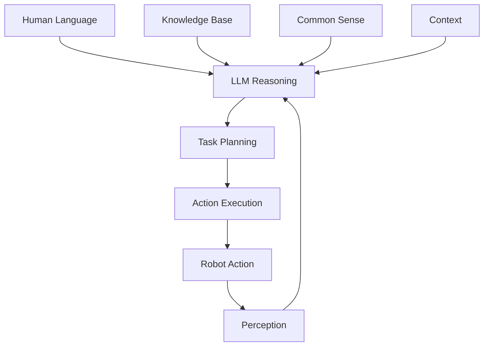
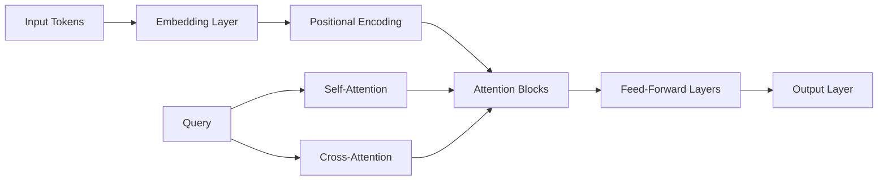

# Introduction to Large Language Models for Robotics

Welcome to Week 11 of Module 4: Vision-Language-Action Systems. In this week, you'll learn about **Large Language Models (LLMs)** and how they can be integrated with robotic systems to enable sophisticated reasoning, planning, and natural human-robot interaction.

## What are Large Language Models?

**Large Language Models (LLMs)** are artificial neural networks with billions of parameters that can understand and generate human language. In robotics, LLMs serve as high-level cognitive systems that can:

- **Interpret natural language commands** from humans
- **Generate natural responses** for human-robot interaction
- **Perform logical reasoning** about robot tasks and environment
- **Plan complex multi-step tasks** with common-sense knowledge
- **Integrate symbolic reasoning** with perception and action



## Why LLMs Matter for Robotics

LLMs address critical challenges in robotics:

| Challenge | LLM Solution |
|-----------|--------------|
| **Natural Interaction** | Understand and respond to natural language commands |
| **Complex Reasoning** | Handle multi-step tasks requiring common sense |
| **Symbolic Knowledge** | Incorporate world knowledge and relationships |
| **Flexible Commands** | Interpret varied ways of expressing the same intent |
| **Learning from Demonstration** | Learn new tasks through language instruction |
| **Explainable Behavior** | Provide natural explanations for robot actions |

## LLM Architecture Overview

Modern LLMs are based on the **Transformer architecture**:



### Key Components

1. **Transformer Architecture**: Attention mechanisms for sequence processing
2. **Pre-training**: Learning language patterns from massive text corpora
3. **Fine-tuning**: Adapting to specific domains and tasks
4. **Prompt Engineering**: Crafting inputs to guide model behavior
5. **Context Windows**: Managing limited memory for conversation history

## LLM Integration Patterns

### 1. Command Interpretation

```python
#!/usr/bin/env python3
"""
LLM Command Interpreter Example
"""
import rclpy
from rclpy.node import Node
from std_msgs.msg import String
from geometry_msgs.msg import PoseStamped
import openai
import json
import asyncio

class LLMCommandInterpreter(Node):
    def __init__(self):
        super().__init__('llm_command_interpreter')

        # Create subscriber for natural language commands
        self.command_sub = self.create_subscription(
            String, '/speech/text', self.command_callback, 10)

        # Create publisher for parsed commands
        self.parsed_cmd_pub = self.create_publisher(String, '/parsed_commands', 10)
        self.navigation_pub = self.create_publisher(PoseStamped, '/navigation/goal', 10)

        # Initialize LLM client
        self.llm_client = self.initialize_llm_client()

        # Robot context and capabilities
        self.robot_capabilities = {
            'navigation': ['go to', 'move to', 'navigate to', 'drive to'],
            'manipulation': ['pick up', 'grasp', 'take', 'grab', 'place'],
            'perception': ['look at', 'find', 'locate', 'detect'],
            'interaction': ['greet', 'say', 'speak', 'communicate']
        }

        # Task history for context
        self.task_history = []

        self.get_logger().info('LLM command interpreter started')

    def initialize_llm_client(self):
        """Initialize LLM client (OpenAI, Hugging Face, etc.)"""
        # In practice, configure with your API key and preferred model
        # For this example, we'll use a mock client
        return MockLLMClient()

    def command_callback(self, msg):
        """Process natural language command with LLM"""
        try:
            user_command = msg.data

            # Create structured prompt for LLM
            prompt = self.create_structured_prompt(user_command)

            # Get LLM response
            llm_response = self.llm_client.generate_response(prompt)

            # Parse LLM response into robot commands
            parsed_commands = self.parse_llm_response(llm_response, user_command)

            # Execute or publish commands
            self.execute_parsed_commands(parsed_commands)

            # Update task history
            self.task_history.append({
                'command': user_command,
                'response': llm_response,
                'parsed': parsed_commands,
                'timestamp': self.get_clock().now().nanoseconds
            })

            self.get_logger().info(f'LLM processed: "{user_command}" -> {len(parsed_commands)} commands')

        except Exception as e:
            self.get_logger().error(f'Error in LLM command processing: {e}')
            # Fallback to simple command parsing
            self.handle_command_fallback(msg)

    def create_structured_prompt(self, user_command):
        """Create structured prompt for LLM"""
        # Context about robot capabilities
        capabilities_context = json.dumps(self.robot_capabilities, indent=2)

        prompt = f"""
You are a command interpreter for a robot system. Your job is to convert natural language commands into structured robot commands.

Robot capabilities:
{capabilities_context}

Current command: "{user_command}"

Please respond in JSON format with the following structure:
{{
    "intent": "navigation|manipulation|perception|interaction|unknown",
    "action": "specific_action_to_perform",
    "parameters": {{
        "target": "target_object_or_location",
        "location": "specific_location_if_applicable",
        "description": "additional_details"
    }},
    "confidence": 0.0-1.0,
    "explanation": "why this interpretation was chosen"
}}

Only respond with the JSON object, nothing else.
        """

        return prompt

    def parse_llm_response(self, llm_response, original_command):
        """Parse LLM response into executable commands"""
        try:
            # Extract JSON from LLM response
            json_start = llm_response.find('{')
            json_end = llm_response.rfind('}') + 1

            if json_start != -1 and json_end != 0:
                json_str = llm_response[json_start:json_end]
                parsed_data = json.loads(json_str)

                # Validate required fields
                required_fields = ['intent', 'action', 'parameters']
                if all(field in parsed_data for field in required_fields):
                    return [parsed_data]
                else:
                    self.get_logger().warn('LLM response missing required fields')
                    return self.generate_fallback_commands(original_command)

            else:
                self.get_logger().error('Could not find JSON in LLM response')
                return self.generate_fallback_commands(original_command)

        except json.JSONDecodeError as e:
            self.get_logger().error(f'Error parsing LLM response JSON: {e}')
            return self.generate_fallback_commands(original_command)

    def execute_parsed_commands(self, parsed_commands):
        """Execute parsed commands"""
        for cmd in parsed_commands:
            intent = cmd.get('intent', 'unknown')
            action = cmd.get('action', 'unknown')
            params = cmd.get('parameters', {})

            if intent == 'navigation':
                self.execute_navigation_command(action, params)
            elif intent == 'manipulation':
                self.execute_manipulation_command(action, params)
            elif intent == 'perception':
                self.execute_perception_command(action, params)
            elif intent == 'interaction':
                self.execute_interaction_command(action, params)
            else:
                self.get_logger().warn(f'Unknown intent: {intent}')

    def execute_navigation_command(self, action, params):
        """Execute navigation command"""
        if action in ['go to', 'move to', 'navigate to', 'drive to']:
            target_location = params.get('location', params.get('target', 'unknown'))

            # In a real system, this would trigger navigation
            goal_msg = PoseStamped()
            goal_msg.header.stamp = self.get_clock().now().to_msg()
            goal_msg.header.frame_id = 'map'

            # Convert location name to coordinates (would use map lookup in real system)
            location_coords = self.lookup_location_coordinates(target_location)
            if location_coords:
                goal_msg.pose.position.x = location_coords[0]
                goal_msg.pose.position.y = location_coords[1]
                goal_msg.pose.position.z = 0.0

                # Set orientation (face forward in direction of movement)
                goal_msg.pose.orientation.w = 1.0

                self.navigation_pub.publish(goal_msg)
                self.get_logger().info(f'Navigating to: {target_location} at {location_coords}')

    def execute_manipulation_command(self, action, params):
        """Execute manipulation command"""
        target_object = params.get('target', 'unknown')
        location = params.get('location', 'unknown')

        # In a real system, this would trigger manipulation
        cmd_msg = String()
        cmd_msg.data = f"manipulation:{action}:{target_object}@{location}"
        # self.manipulation_pub.publish(cmd_msg)

        self.get_logger().info(f'Manipulation: {action} {target_object} at {location}')

    def execute_perception_command(self, action, params):
        """Execute perception command"""
        target_object = params.get('target', 'unknown')

        # In a real system, this would trigger perception
        cmd_msg = String()
        cmd_msg.data = f"perception:{action}:{target_object}"
        # self.perception_pub.publish(cmd_msg)

        self.get_logger().info(f'Perception: {action} for {target_object}')

    def execute_interaction_command(self, action, params):
        """Execute interaction command"""
        message = params.get('target', params.get('description', 'Hello'))

        # In a real system, this would trigger speech synthesis
        cmd_msg = String()
        cmd_msg.data = f"interaction:{action}:{message}"
        # self.tts_pub.publish(cmd_msg)

        self.get_logger().info(f'Interaction: {action} - {message}')

    def lookup_location_coordinates(self, location_name):
        """Lookup coordinates for location name (simplified)"""
        # In a real system, this would use a map or knowledge base
        location_map = {
            'kitchen': (2.0, 1.0),
            'living room': (0.0, 2.0),
            'bedroom': (-1.0, -1.0),
            'office': (1.5, -0.5),
            'home base': (0.0, 0.0)
        }

        return location_map.get(location_name.lower(), (0.0, 0.0))

    def generate_fallback_commands(self, original_command):
        """Generate fallback commands when LLM parsing fails"""
        # Simple keyword-based fallback
        command_lower = original_command.lower()

        if any(word in command_lower for word in ['go', 'move', 'navigate', 'drive']):
            intent = 'navigation'
            action = 'go to'
            target = 'unknown location'  # Would extract from command
        elif any(word in command_lower for word in ['pick', 'grasp', 'take', 'grab']):
            intent = 'manipulation'
            action = 'pick up'
            target = 'unknown object'
        elif any(word in command_lower for word in ['find', 'look', 'detect']):
            intent = 'perception'
            action = 'find'
            target = 'unknown object'
        else:
            intent = 'interaction'
            action = 'speak'
            target = original_command

        return [{
            'intent': intent,
            'action': action,
            'parameters': {
                'target': target,
                'location': 'unknown'
            },
            'confidence': 0.5,
            'explanation': 'Fallback command interpretation'
        }]

class MockLLMClient:
    """Mock LLM client for demonstration"""
    def __init__(self):
        pass

    def generate_response(self, prompt):
        """Generate mock response (in practice, call real LLM API)"""
        # This is a simplified mock response
        # In practice, you would call OpenAI, Hugging Face, etc.
        if 'kitchen' in prompt.lower():
            return '''{
    "intent": "navigation",
    "action": "go to",
    "parameters": {
        "target": "kitchen",
        "location": "kitchen",
        "description": "navigate to kitchen area"
    },
    "confidence": 0.9,
    "explanation": "Command contains navigation verb and location"
}'''
        elif 'pick up' in prompt.lower():
            return '''{
    "intent": "manipulation",
    "action": "pick up",
    "parameters": {
        "target": "red cup",
        "location": "table",
        "description": "grasp red cup from table"
    },
    "confidence": 0.85,
    "explanation": "Command contains manipulation verb and object reference"
}'''
        else:
            return '''{
    "intent": "unknown",
    "action": "unknown",
    "parameters": {
        "target": "unknown",
        "location": "unknown",
        "description": "unknown command"
    },
    "confidence": 0.3,
    "explanation": "Could not determine intent from command"
}'''

def main(args=None):
    rclpy.init(args=args)
    node = LLMCommandInterpreter()

    try:
        rclpy.spin(node)
    except KeyboardInterrupt:
        pass
    finally:
        node.destroy_node()
        rclpy.shutdown()

if __name__ == '__main__':
    main()
```

## LLM Integration Approaches

### 1. API-Based Integration

```python
#!/usr/bin/env python3
"""
API-Based LLM Integration
"""
import openai
import requests
import json
import rclpy
from rclpy.node import Node
from std_msgs.msg import String

class APILLMNode(Node):
    def __init__(self):
        super().__init__('api_llm_node')

        # Create subscriber for commands
        self.command_sub = self.create_subscription(String, '/user_command', self.command_callback, 10)

        # Create publisher for responses
        self.response_pub = self.create_publisher(String, '/llm_response', 10)

        # Initialize OpenAI client
        self.api_key = self.declare_parameter('openai_api_key', '').value
        if self.api_key:
            openai.api_key = self.api_key
            self.use_openai = True
        else:
            self.get_logger().warn('No OpenAI API key provided, using local model')
            self.use_openai = False
            # Initialize local model here

        self.get_logger().info('API-based LLM node started')

    def command_callback(self, msg):
        """Process command through LLM API"""
        try:
            if self.use_openai:
                response = self.call_openai_api(msg.data)
            else:
                response = self.call_local_model(msg.data)

            # Publish response
            response_msg = String()
            response_msg.data = response
            self.response_pub.publish(response_msg)

            self.get_logger().info(f'LLM response: {response[:50]}...')

        except Exception as e:
            self.get_logger().error(f'LLM API error: {e}')

    def call_openai_api(self, command):
        """Call OpenAI API for reasoning"""
        try:
            response = openai.ChatCompletion.create(
                model="gpt-3.5-turbo",
                messages=[
                    {"role": "system", "content": "You are a helpful robot assistant that interprets commands and provides structured responses for robot execution."},
                    {"role": "user", "content": command}
                ],
                temperature=0.7,
                max_tokens=150
            )

            return response.choices[0].message.content

        except Exception as e:
            self.get_logger().error(f'OpenAI API error: {e}')
            return "I'm sorry, I couldn't process that command."

    def call_local_model(self, command):
        """Call local model (conceptual)"""
        # In practice, use local models like LLaMA, Mistral, etc.
        # with libraries like transformers, llama-cpp-python, etc.
        return f"Local model response to: {command}"

def main(args=None):
    rclpy.init(args=args)
    node = APILLMNode()

    try:
        rclpy.spin(node)
    except KeyboardInterrupt:
        pass
    finally:
        node.destroy_node()
        rclpy.shutdown()

if __name__ == '__main__':
    main()
```

### 2. Local Model Integration

```python
#!/usr/bin/env python3
"""
Local LLM Integration
"""
import torch
from transformers import AutoModelForCausalLM, AutoTokenizer
import rclpy
from rclpy.node import Node
from std_msgs.msg import String

class LocalLLMNode(Node):
    def __init__(self):
        super().__init__('local_llm_node')

        # Create subscriber for commands
        self.command_sub = self.create_subscription(String, '/user_command', self.command_callback, 10)

        # Create publisher for responses
        self.response_pub = self.create_publisher(String, '/llm_response', 10)

        # Initialize local model
        self.model_name = self.declare_parameter('model_name', 'facebook/opt-350m').value
        self.device = torch.device('cuda' if torch.cuda.is_available() else 'cpu')

        try:
            self.tokenizer = AutoTokenizer.from_pretrained(self.model_name)
            self.model = AutoModelForCausalLM.from_pretrained(self.model_name)
            self.model.to(self.device)
            self.model.eval()

            # Add padding token if not present
            if self.tokenizer.pad_token is None:
                self.tokenizer.pad_token = self.tokenizer.eos_token

            self.get_logger().info(f'Loaded local model: {self.model_name}')

        except Exception as e:
            self.get_logger().error(f'Error loading local model: {e}')
            self.tokenizer = None
            self.model = None

    def command_callback(self, msg):
        """Process command with local LLM"""
        if not self.model or not self.tokenizer:
            return

        try:
            # Create structured prompt
            prompt = self.create_robot_prompt(msg.data)

            # Tokenize input
            inputs = self.tokenizer.encode(prompt, return_tensors='pt').to(self.device)

            # Generate response
            with torch.no_grad():
                outputs = self.model.generate(
                    inputs,
                    max_length=inputs.shape[1] + 100,
                    temperature=0.7,
                    do_sample=True,
                    pad_token_id=self.tokenizer.eos_token_id
                )

            # Decode response
            response = self.tokenizer.decode(outputs[0], skip_special_tokens=True)

            # Extract only the generated part (remove prompt)
            generated_part = response[len(prompt):].strip()

            # Publish response
            response_msg = String()
            response_msg.data = generated_part
            self.response_pub.publish(response_msg)

            self.get_logger().info(f'Local LLM response: {generated_part[:50]}...')

        except Exception as e:
            self.get_logger().error(f'Local LLM error: {e}')

    def create_robot_prompt(self, command):
        """Create structured prompt for robot tasks"""
        return f"""You are a helpful robot assistant. Convert the following command into structured robot instructions:

Command: {command}

Structured Response:"""

def main(args=None):
    rclpy.init(args=args)
    node = LocalLLMNode()

    try:
        rclpy.spin(node)
    except KeyboardInterrupt:
        pass
    finally:
        node.destroy_node()
        rclpy.shutdown()

if __name__ == '__main__':
    main()
```

## Context Management

### Memory and Context Handling

```python
#!/usr/bin/env python3
"""
Context Management for LLM Integration
"""
import rclpy
from rclpy.node import Node
from std_msgs.msg import String
from geometry_msgs.msg import PoseStamped
from collections import deque
import json
import time

class LLMContextManager(Node):
    def __init__(self):
        super().__init__('llm_context_manager')

        # Create subscribers
        self.command_sub = self.create_subscription(String, '/user_command', self.command_callback, 10)
        self.robot_state_sub = self.create_subscription(PoseStamped, '/robot/pose', self.robot_state_callback, 10)

        # Create publishers
        self.enhanced_command_pub = self.create_publisher(String, '/enhanced_commands', 10)

        # Context storage
        self.conversation_history = deque(maxlen=20)  # Keep last 20 exchanges
        self.robot_state = {
            'location': 'unknown',
            'orientation': [0, 0, 0, 1],
            'battery_level': 100.0,
            'current_task': 'idle'
        }
        self.object_memory = {}  # Remember objects seen/referenced
        self.location_memory = {}  # Remember locations

        # Context parameters
        self.max_context_length = 2000  # Max characters in context
        self.context_timeout = 300  # 5 minutes before forgetting

        self.get_logger().info('LLM context manager started')

    def command_callback(self, msg):
        """Process command with context awareness"""
        try:
            user_command = msg.data

            # Add to conversation history
            self.conversation_history.append({
                'speaker': 'user',
                'text': user_command,
                'timestamp': time.time()
            })

            # Create enhanced prompt with context
            enhanced_prompt = self.create_context_enhanced_prompt(user_command)

            # Store for LLM processing
            enhanced_msg = String()
            enhanced_msg.data = enhanced_prompt
            self.enhanced_command_pub.publish(enhanced_msg)

            self.get_logger().info(f'Enhanced command with context: {user_command[:30]}...')

        except Exception as e:
            self.get_logger().error(f'Error in context management: {e}')

    def robot_state_callback(self, msg):
        """Update robot state in context"""
        self.robot_state.update({
            'location': self.get_location_name(msg.pose),
            'orientation': [
                msg.pose.orientation.x,
                msg.pose.orientation.y,
                msg.pose.orientation.z,
                msg.pose.orientation.w
            ],
            'position': [
                msg.pose.position.x,
                msg.pose.position.y,
                msg.pose.position.z
            ]
        })

    def create_context_enhanced_prompt(self, user_command):
        """Create prompt with relevant context"""
        # Build context string
        context_parts = []

        # Add robot state
        context_parts.append(f"Robot State:")
        context_parts.append(f"- Current location: {self.robot_state['location']}")
        context_parts.append(f"- Current task: {self.robot_state['current_task']}")
        context_parts.append(f"- Battery level: {self.robot_state['battery_level']:.1f}%")

        # Add recent conversation history
        if self.conversation_history:
            context_parts.append("\nRecent Conversation:")
            for entry in list(self.conversation_history)[-3:]:  # Last 3 exchanges
                timestamp = time.strftime('%H:%M:%S', time.localtime(entry['timestamp']))
                context_parts.append(f"[{timestamp}] {entry['speaker']}: {entry['text']}")

        # Add object memory (if any)
        if self.object_memory:
            context_parts.append("\nRemembered Objects:")
            for obj_name, obj_info in list(self.object_memory.items())[-5:]:  # Last 5 objects
                context_parts.append(f"- {obj_name}: {obj_info['location']} (seen at {obj_info['timestamp']})")

        # Add the user command
        context_parts.append(f"\nCurrent Command: {user_command}")

        # Add instructions for context-aware response
        context_parts.append("""
Instructions:
- Use the provided context to understand references (e.g., "that object", "the previous location")
- Consider the robot's current state when interpreting commands
- If the command refers to previous interactions, use the conversation history
- If objects or locations are referenced, use the remembered information
- Generate a response that accounts for the full context, not just the current command
        """)

        enhanced_prompt = "\n".join(context_parts)

        # Truncate if too long
        if len(enhanced_prompt) > self.max_context_length:
            # Keep recent history and essential context
            recent_context = "\n".join(context_parts[-10:])  # Keep last few parts
            truncated_prompt = f"[CONTEXT TRUNCATED]\n{recent_context}\n\nCurrent Command: {user_command}"
            enhanced_prompt = truncated_prompt

        return enhanced_prompt

    def get_location_name(self, pose):
        """Convert pose to location name"""
        # In practice, use semantic map or location recognition
        x, y = pose.position.x, pose.position.y

        if abs(x) < 0.5 and abs(y) < 0.5:
            return 'home base'
        elif x > 2.0:
            return 'kitchen'
        elif x < -2.0:
            return 'office'
        elif y > 2.0:
            return 'living room'
        elif y < -2.0:
            return 'bedroom'
        else:
            return f'coordinates_{x:.1f}_{y:.1f}'

    def remember_object(self, object_name, location, timestamp=None):
        """Remember an object and its location"""
        if timestamp is None:
            timestamp = time.time()

        self.object_memory[object_name] = {
            'location': location,
            'timestamp': timestamp,
            'seen_count': self.object_memory.get(object_name, {}).get('seen_count', 0) + 1
        }

        # Clean up old memories
        self.cleanup_old_memories()

    def remember_location(self, location_name, description):
        """Remember information about a location"""
        self.location_memory[location_name] = {
            'description': description,
            'timestamp': time.time(),
            'visited_count': self.location_memory.get(location_name, {}).get('visited_count', 0) + 1
        }

    def cleanup_old_memories(self):
        """Remove old memories that have expired"""
        current_time = time.time()
        expired_objects = [
            name for name, info in self.object_memory.items()
            if (current_time - info['timestamp']) > self.context_timeout
        ]

        for obj_name in expired_objects:
            del self.object_memory[obj_name]

        expired_locations = [
            name for name, info in self.location_memory.items()
            if (current_time - info['timestamp']) > self.context_timeout
        ]

        for loc_name in expired_locations:
            del self.location_memory[loc_name]

def main(args=None):
    rclpy.init(args=args)
    node = LLMContextManager()

    try:
        rclpy.spin(node)
    except KeyboardInterrupt:
        pass
    finally:
        node.destroy_node()
        rclpy.shutdown()

if __name__ == '__main__':
    main()
```

## Reasoning and Planning

### Symbolic Reasoning Integration

```python
#!/usr/bin/env python3
"""
Symbolic Reasoning with LLMs
"""
import rclpy
from rclpy.node import Node
from std_msgs.msg import String
import json
import re

class SymbolicReasoningNode(Node):
    def __init__(self):
        super().__init__('symbolic_reasoning_node')

        # Create subscriber for high-level commands
        self.high_level_cmd_sub = self.create_subscription(String, '/high_level_command', self.command_callback, 10)

        # Create publisher for low-level plans
        self.low_level_plan_pub = self.create_publisher(String, '/low_level_plan', 10)

        # Knowledge base
        self.knowledge_base = {
            'locations': {
                'kitchen': {'accessible': True, 'contains': ['cup', 'plate', 'fridge']},
                'living_room': {'accessible': True, 'contains': ['sofa', 'tv', 'table']},
                'bedroom': {'accessible': True, 'contains': ['bed', 'desk', 'closet']},
                'office': {'accessible': True, 'contains': ['desk', 'computer', 'chair']}
            },
            'objects': {
                'cup': {'movable': True, 'graspable': True, 'size': 'small'},
                'plate': {'movable': True, 'graspable': True, 'size': 'medium'},
                'book': {'movable': True, 'graspable': True, 'size': 'small'},
                'sofa': {'movable': False, 'graspable': False, 'size': 'large'}
            },
            'capabilities': {
                'navigation': ['move_to', 'go_to', 'navigate_to'],
                'manipulation': ['pick_up', 'place', 'grasp', 'release'],
                'perception': ['find', 'detect', 'locate']
            }
        }

        # Reasoning patterns
        self.reasoning_patterns = {
            'navigation': self.reason_about_navigation,
            'manipulation': self.reason_about_manipulation,
            'perception': self.reason_about_perception
        }

        self.get_logger().info('Symbolic reasoning node started')

    def command_callback(self, msg):
        """Process high-level command with symbolic reasoning"""
        try:
            command = msg.data

            # Parse command to identify intent and entities
            parsed_command = self.parse_command(command)

            # Apply symbolic reasoning
            if parsed_command['intent'] in self.reasoning_patterns:
                plan = self.reasoning_patterns[parsed_command['intent']](parsed_command)
            else:
                plan = self.generate_generic_plan(parsed_command)

            # Publish low-level plan
            plan_msg = String()
            plan_msg.data = json.dumps(plan)
            self.low_level_plan_pub.publish(plan_msg)

            self.get_logger().info(f'Symbolic reasoning completed: {command[:30]}... -> {len(plan)} steps')

        except Exception as e:
            self.get_logger().error(f'Error in symbolic reasoning: {e}')

    def parse_command(self, command_text):
        """Parse command text to identify intent and entities"""
        command_lower = command_text.lower()

        # Simple intent classification (in practice, use LLM or NLU)
        if any(word in command_lower for word in ['go', 'move', 'navigate', 'drive', 'to']):
            intent = 'navigation'
        elif any(word in command_lower for word in ['pick', 'grasp', 'take', 'get', 'bring']):
            intent = 'manipulation'
        elif any(word in command_lower for word in ['find', 'look', 'locate', 'see', 'where']):
            intent = 'perception'
        else:
            intent = 'unknown'

        # Extract entities (simplified)
        entities = self.extract_entities(command_text)

        return {
            'original_text': command_text,
            'intent': intent,
            'entities': entities,
            'parsed_at': self.get_clock().now().nanoseconds
        }

    def extract_entities(self, text):
        """Extract entities from text (simplified)"""
        entities = {
            'locations': [],
            'objects': [],
            'actions': []
        }

        text_lower = text.lower()

        # Extract known locations
        for location in self.knowledge_base['locations']:
            if location in text_lower:
                entities['locations'].append(location)

        # Extract known objects
        for obj in self.knowledge_base['objects']:
            if obj in text_lower:
                entities['objects'].append(obj)

        # Extract known actions
        for capability, actions in self.knowledge_base['capabilities'].items():
            for action in actions:
                if action in text_lower:
                    entities['actions'].append(action)

        return entities

    def reason_about_navigation(self, parsed_command):
        """Apply symbolic reasoning for navigation tasks"""
        entities = parsed_command['entities']
        intent = parsed_command['intent']

        plan = []

        # Find target location
        target_location = entities['locations'][0] if entities['locations'] else None

        if not target_location:
            # Extract from command using LLM reasoning
            target_location = self.infer_location_from_command(parsed_command['original_text'])

        if target_location and target_location in self.knowledge_base['locations']:
            # Check if location is accessible
            if self.knowledge_base['locations'][target_location]['accessible']:
                # Create navigation plan
                plan.append({
                    'action': 'navigate_to',
                    'target': target_location,
                    'parameters': {
                        'location': target_location
                    },
                    'reasoning': f'Navigating to {target_location} as requested'
                })

                # Add any relevant sub-actions based on location content
                location_contents = self.knowledge_base['locations'][target_location].get('contains', [])
                if location_contents:
                    plan.append({
                        'action': 'perceive_environment',
                        'target': f'contents_of_{target_location}',
                        'parameters': {
                            'location': target_location,
                            'objects_to_look_for': location_contents
                        },
                        'reasoning': f'Perceiving contents of {target_location}'
                    })
            else:
                plan.append({
                    'action': 'report_error',
                    'target': 'inaccessible_location',
                    'parameters': {
                        'location': target_location,
                        'error': 'Location is not accessible'
                    },
                    'reasoning': f'Cannot navigate to {target_location} - location not accessible'
                })
        else:
            plan.append({
                'action': 'ask_for_clarification',
                'target': 'unknown_location',
                'parameters': {
                    'original_command': parsed_command['original_text'],
                    'suggested_locations': list(self.knowledge_base['locations'].keys())
                },
                'reasoning': 'Unknown location, need clarification'
            })

        return plan

    def reason_about_manipulation(self, parsed_command):
        """Apply symbolic reasoning for manipulation tasks"""
        entities = parsed_command['entities']
        intent = parsed_command['intent']

        plan = []

        # Find target object
        target_object = entities['objects'][0] if entities['objects'] else None

        if not target_object:
            # Extract from command
            target_object = self.infer_object_from_command(parsed_command['original_text'])

        if target_object and target_object in self.knowledge_base['objects']:
            object_props = self.knowledge_base['objects'][target_object]

            # Check if object is manipulable
            if object_props['graspable']:
                # Find object location (would use perception in real system)
                object_location = self.estimate_object_location(target_object)

                if object_location:
                    # Create manipulation plan
                    plan.extend([
                        {
                            'action': 'navigate_to',
                            'target': object_location,
                            'parameters': {
                                'location': object_location
                            },
                            'reasoning': f'Navigating to {object_location} to find {target_object}'
                        },
                        {
                            'action': 'find_object',
                            'target': target_object,
                            'parameters': {
                                'object_name': target_object,
                                'location': object_location
                            },
                            'reasoning': f'Locating {target_object} at {object_location}'
                        },
                        {
                            'action': 'grasp_object',
                            'target': target_object,
                            'parameters': {
                                'object_name': target_object,
                                'location': object_location
                            },
                            'reasoning': f'Grasping {target_object}'
                        }
                    ])
                else:
                    plan.append({
                        'action': 'find_object',
                        'target': target_object,
                        'parameters': {
                            'object_name': target_object
                        },
                        'reasoning': f'Looking for {target_object} in environment'
                    })
            else:
                plan.append({
                    'action': 'report_error',
                    'target': 'ungraspable_object',
                    'parameters': {
                        'object': target_object,
                        'reason': 'Object is not graspable'
                    },
                    'reasoning': f'Cannot manipulate {target_object} - object not graspable'
                })
        else:
            plan.append({
                'action': 'ask_for_clarification',
                'target': 'unknown_object',
                'parameters': {
                    'original_command': parsed_command['original_text'],
                    'known_objects': list(self.knowledge_base['objects'].keys())
                },
                'reasoning': 'Unknown object, need clarification'
            })

        return plan

    def infer_location_from_command(self, command):
        """Infer location from command text (simplified)"""
        # In practice, use more sophisticated NLP or LLM
        location_keywords = {
            'kitchen': ['kitchen', 'fridge', 'stove', 'counter'],
            'living_room': ['living', 'sofa', 'couch', 'tv', 'television'],
            'bedroom': ['bed', 'sleep', 'bedroom'],
            'office': ['office', 'desk', 'computer', 'work']
        }

        for location, keywords in location_keywords.items():
            if any(keyword in command.lower() for keyword in keywords):
                return location

        return None

    def infer_object_from_command(self, command):
        """Infer object from command text (simplified)"""
        # In practice, use more sophisticated NLP or LLM
        object_keywords = {
            'cup': ['cup', 'glass', 'mug'],
            'plate': ['plate', 'dish'],
            'book': ['book', 'novel', 'text'],
            'ball': ['ball', 'sphere']
        }

        for obj, keywords in object_keywords.items():
            if any(keyword in command.lower() for keyword in keywords):
                return obj

        return None

    def estimate_object_location(self, object_name):
        """Estimate likely location of object"""
        # In practice, use perception or more sophisticated reasoning
        object_location_map = {
            'cup': ['kitchen', 'office'],
            'plate': ['kitchen'],
            'book': ['office', 'living_room'],
            'ball': ['living_room', 'bedroom']
        }

        possible_locations = object_location_map.get(object_name, [])
        return possible_locations[0] if possible_locations else 'unknown'

    def generate_generic_plan(self, parsed_command):
        """Generate generic plan for unknown intents"""
        return [{
            'action': 'unknown_intent',
            'target': 'unknown',
            'parameters': {
                'original_command': parsed_command['original_text'],
                'parsed_intent': parsed_command['intent']
            },
            'reasoning': 'Could not determine specific intent, need clarification'
        }]

def main(args=None):
    rclpy.init(args=args)
    node = SymbolicReasoningNode()

    try:
        rclpy.spin(node)
    except KeyboardInterrupt:
        pass
    finally:
        node.destroy_node()
        rclpy.shutdown()

if __name__ == '__main__':
    main()
```

## Prompt Engineering for Robotics

### Effective Prompt Design

```python
#!/usr/bin/env python3
"""
Prompt Engineering for Robotics
"""
import rclpy
from rclpy.node import Node
from std_msgs.msg import String
import json

class PromptEngineeringNode(Node):
    def __init__(self):
        super().__init__('prompt_engineering_node')

        # Create subscriber for user commands
        self.command_sub = self.create_subscription(String, '/user_command', self.command_callback, 10)

        # Create publisher for processed commands
        self.processed_cmd_pub = self.create_publisher(String, '/processed_commands', 10)

        # Predefined prompt templates
        self.prompt_templates = {
            'navigation': self.create_navigation_prompt,
            'manipulation': self.create_manipulation_prompt,
            'perception': self.create_perception_prompt,
            'reasoning': self.create_reasoning_prompt
        }

        # Robot-specific context
        self.robot_context = {
            'name': 'RoboHelper',
            'capabilities': ['navigation', 'manipulation', 'perception', 'interaction'],
            'current_location': 'home_base',
            'battery_level': 85.0,
            'last_action': 'idle'
        }

        self.get_logger().info('Prompt engineering node started')

    def command_callback(self, msg):
        """Process command with appropriate prompt template"""
        try:
            user_command = msg.data

            # Determine intent and select appropriate prompt template
            intent = self.classify_intent(user_command)

            if intent in self.prompt_templates:
                enhanced_prompt = self.prompt_templates[intent](user_command)
            else:
                enhanced_prompt = self.create_general_prompt(user_command)

            # Publish enhanced prompt
            prompt_msg = String()
            prompt_msg.data = enhanced_prompt
            self.processed_cmd_pub.publish(prompt_msg)

            self.get_logger().info(f'Enhanced prompt for {intent}: {user_command[:30]}...')

        except Exception as e:
            self.get_logger().error(f'Error in prompt engineering: {e}')

    def classify_intent(self, command):
        """Classify command intent (simplified)"""
        command_lower = command.lower()

        if any(word in command_lower for word in ['go', 'move', 'navigate', 'drive', 'to']):
            return 'navigation'
        elif any(word in command_lower for word in ['pick', 'grasp', 'take', 'get', 'put', 'place']):
            return 'manipulation'
        elif any(word in command_lower for word in ['find', 'look', 'see', 'where', 'what']):
            return 'perception'
        elif any(word in command_lower for word in ['why', 'how', 'explain', 'reason']):
            return 'reasoning'
        else:
            return 'general'

    def create_navigation_prompt(self, command):
        """Create navigation-specific prompt"""
        return f"""
Robot Navigation Assistant

Robot Capabilities:
- Navigation: Can move to locations in the environment
- Current location: {self.robot_context['current_location']}
- Battery level: {self.robot_context['battery_level']}%

Environment:
- Known locations: kitchen, living room, bedroom, office, home base
- Obstacle avoidance: Yes
- Path planning: Yes

Task: Convert the following command to a structured navigation command.

Command: "{command}"

Response Format:
{{
    "action": "navigate_to",
    "parameters": {{
        "destination": "target_location_name",
        "path_preference": "shortest|safest|avoid_obstacles"
    }},
    "confidence": 0.0-1.0,
    "reasoning": "why this destination was chosen"
}}

Only respond with the JSON object.
        """

    def create_manipulation_prompt(self, command):
        """Create manipulation-specific prompt"""
        return f"""
Robot Manipulation Assistant

Robot Capabilities:
- Manipulation: Can pick up and place objects
- Gripper type: Parallel jaw gripper
- Max payload: 2kg
- Reach: 1m from base

Environment:
- Known objects: cup, plate, book, ball, bottle
- Object properties: movable, graspable, size
- Surface types: table, shelf, floor

Task: Convert the following command to a structured manipulation command.

Command: "{command}"

Response Format:
{{
    "action": "manipulate_object",
    "parameters": {{
        "object_name": "target_object",
        "action_type": "pick_up|place|grasp|release",
        "destination": "placement_location_if_applicable"
    }},
    "confidence": 0.0-1.0,
    "reasoning": "why this manipulation was chosen"
}}

Only respond with the JSON object.
        """

    def create_perception_prompt(self, command):
        """Create perception-specific prompt"""
        return f"""
Robot Perception Assistant

Robot Capabilities:
- Object detection: Can identify known objects
- Location: Can determine where objects are
- Tracking: Can follow moving objects
- Sensors: RGB camera, depth sensor, LiDAR

Environment:
- Known objects: cup, plate, book, ball, bottle
- Common locations: kitchen, living room, bedroom, office

Task: Convert the following command to a structured perception command.

Command: "{command}"

Response Format:
{{
    "action": "perceive_environment",
    "parameters": {{
        "task": "find_object|detect_objects|track_object|count_objects",
        "target_object": "object_to_find_if_specified",
        "search_area": "specific_area_or_environment"
    }},
    "confidence": 0.0-1.0,
    "reasoning": "why this perception task was chosen"
}}

Only respond with the JSON object.
        """

    def create_reasoning_prompt(self, command):
        """Create reasoning-specific prompt"""
        return f"""
Robot Reasoning Assistant

Robot Context:
- Current location: {self.robot_context['current_location']}
- Current task: {self.robot_context['last_action']}
- Battery level: {self.robot_context['battery_level']}%
- Capabilities: navigation, manipulation, perception

Environment:
- Known locations: kitchen, living room, bedroom, office, home base
- Known objects: cup, plate, book, ball, bottle

Task: Provide reasoning about the following query.

Query: "{command}"

Response Format:
{{
    "type": "explanation|plan|answer",
    "content": "detailed_reasoning_or_answer",
    "confidence": 0.0-1.0,
    "sources": ["robot_state", "knowledge_base", "common_sense"]
}}

Only respond with the JSON object.
        """

    def create_general_prompt(self, command):
        """Create general-purpose prompt"""
        return f"""
Robot Assistant

Robot Context:
- Name: {self.robot_context['name']}
- Current location: {self.robot_context['current_location']}
- Battery level: {self.robot_context['battery_level']}%
- Last action: {self.robot_context['last_action']}
- Capabilities: navigation, manipulation, perception, interaction

Environment:
- Known locations: kitchen, living room, bedroom, office, home base
- Known objects: cup, plate, book, ball, bottle

Task: Process the following user command and respond appropriately.

Command: "{command}"

Response Format:
{{
    "intent": "navigation|manipulation|perception|interaction|reasoning|unknown",
    "action": "specific_robot_action",
    "parameters": {{}},
    "response_text": "natural_language_response_for_user",
    "confidence": 0.0-1.0,
    "reasoning": "why this interpretation was chosen"
}}

Only respond with the JSON object.
        """

def main(args=None):
    rclpy.init(args=args)
    node = PromptEngineeringNode()

    try:
        rclpy.spin(node)
    except KeyboardInterrupt:
        pass
    finally:
        node.destroy_node()
        rclpy.shutdown()

if __name__ == '__main__':
    main()
```

## Best Practices

### 1. LLM Integration Best Practices

```python
# Good: Well-structured LLM integration
def good_llm_integration():
    """Best practices for LLM integration"""
    # Use appropriate models for tasks
    # Implement proper error handling
    # Cache frequently used responses
    # Monitor API usage and costs
    # Validate LLM outputs
    # Implement fallback mechanisms
    pass

# Bad: Poor LLM integration
def bad_llm_integration():
    """Poor practices in LLM integration"""
    # No error handling
    # No output validation
    # Excessive API calls
    # No caching
    # No fallbacks
    # No monitoring
    pass
```

### 2. Context Management Best Practices

```python
# Good: Proper context management
def good_context_management():
    """Best practices for context management"""
    # Limit context length
    # Prioritize recent information
    # Clean up old memories
    # Use efficient data structures
    # Implement context compression
    pass

# Bad: Poor context management
def bad_context_management():
    """Poor practices in context management"""
    # Unlimited context growth
    # No memory cleanup
    # Inefficient storage
    # No context prioritization
    # Memory leaks
    pass
```

### 3. Performance Best Practices

```python
# Good: Performance-optimized LLM usage
def good_performance_practices():
    """Performance optimization for LLMs"""
    # Use appropriate model sizes
    # Implement batching where possible
    # Cache deterministic responses
    # Use local models when privacy required
    # Optimize prompt lengths
    pass

# Bad: Performance issues
def bad_performance_practices():
    """Performance anti-patterns"""
    # Always use largest models
    # No caching
    # Excessive API calls
    # Long, inefficient prompts
    # No batching
    pass
```

## Quality Assurance and Validation

### LLM Output Validation

```python
#!/usr/bin/env python3
"""
LLM Output Validation
"""
import json
import rclpy
from rclpy.node import Node
from std_msgs.msg import String
from typing import Dict, Any, List

class LLMValidatorNode(Node):
    def __init__(self):
        super().__init__('llm_validator_node')

        # Create subscriber for LLM responses
        self.response_sub = self.create_subscription(String, '/llm_response', self.response_callback, 10)

        # Create publisher for validated responses
        self.validated_pub = self.create_publisher(String, '/validated_response', 10)
        self.quality_score_pub = self.create_publisher(Float32, '/llm_quality_score', 10)

        # Validation parameters
        self.required_fields = ['action', 'parameters', 'confidence']
        self.confidence_threshold = 0.5
        self.max_response_length = 1000

        self.get_logger().info('LLM validator started')

    def response_callback(self, msg):
        """Validate LLM response"""
        try:
            response_text = msg.data

            # Parse JSON response
            parsed_response = self.parse_json_response(response_text)

            if parsed_response:
                # Validate response structure
                is_valid, validation_errors = self.validate_response(parsed_response)

                # Calculate quality score
                quality_score = self.calculate_quality_score(parsed_response, validation_errors)

                # Publish validation results
                if is_valid and quality_score >= self.confidence_threshold:
                    validated_msg = String()
                    validated_msg.data = json.dumps(parsed_response)
                    self.validated_pub.publish(validated_msg)

                    self.get_logger().info(f'Valid response with quality: {quality_score:.3f}')
                else:
                    self.get_logger().warn(f'Invalid response: {validation_errors}')

                # Publish quality score
                score_msg = Float32()
                score_msg.data = quality_score
                self.quality_score_pub.publish(score_msg)

            else:
                self.get_logger().error('Could not parse LLM response as JSON')

        except Exception as e:
            self.get_logger().error(f'Error validating LLM response: {e}')

    def parse_json_response(self, response_text):
        """Parse JSON from LLM response"""
        try:
            # Find JSON in response (handle cases where LLM adds text)
            start_idx = response_text.find('{')
            end_idx = response_text.rfind('}') + 1

            if start_idx != -1 and end_idx != 0:
                json_str = response_text[start_idx:end_idx]
                return json.loads(json_str)
        except json.JSONDecodeError:
            pass

        return None

    def validate_response(self, response: Dict[str, Any]) -> tuple[bool, List[str]]:
        """Validate response structure and content"""
        errors = []

        # Check required fields
        for field in self.required_fields:
            if field not in response:
                errors.append(f'Missing required field: {field}')

        # Validate confidence value
        confidence = response.get('confidence', 0.0)
        if not isinstance(confidence, (int, float)) or not 0.0 <= confidence <= 1.0:
            errors.append(f'Invalid confidence value: {confidence}')

        # Validate action type
        action = response.get('action', '')
        if not isinstance(action, str) or len(action.strip()) == 0:
            errors.append(f'Invalid action: {action}')

        # Validate parameters structure
        params = response.get('parameters', {})
        if not isinstance(params, dict):
            errors.append('Parameters must be a dictionary')

        return len(errors) == 0, errors

    def calculate_quality_score(self, response: Dict[str, Any], validation_errors: List[str]) -> float:
        """Calculate quality score for LLM response"""
        score = 1.0

        # Subtract for validation errors
        score -= len(validation_errors) * 0.2

        # Check confidence value
        confidence = response.get('confidence', 0.0)
        score *= confidence

        # Check response completeness
        if 'explanation' not in response:
            score -= 0.1  # Bonus for explanations

        # Check for empty or placeholder content
        action = response.get('action', '')
        if action.lower() in ['unknown', 'none', 'null']:
            score -= 0.5

        return max(0.0, min(1.0, score))

def main(args=None):
    rclpy.init(args=args)
    node = LLMValidatorNode()

    try:
        rclpy.spin(node)
    except KeyboardInterrupt:
        pass
    finally:
        node.destroy_node()
        rclpy.shutdown()

if __name__ == '__main__':
    main()
```

## Common Issues and Troubleshooting

### 1. API Issues

```bash
# Check API key configuration
echo $OPENAI_API_KEY

# Verify network connectivity
curl -I https://api.openai.com/v1/models

# Monitor API usage
# Use OpenAI dashboard or API endpoint
```

### 2. Context Issues

```python
# Monitor context length
def monitor_context_length(context_string):
    """Monitor context length to avoid exceeding limits"""
    max_tokens = 4096  # Example limit
    estimated_tokens = len(context_string) // 4  # Rough estimate

    if estimated_tokens > max_tokens * 0.8:  # 80% threshold
        print(f'Warning: Context approaching limit ({estimated_tokens}/{max_tokens})')
```

### 3. Performance Issues

```python
# Monitor LLM response times
def monitor_response_time():
    """Monitor LLM performance"""
    import time

    start_time = time.time()
    # Call LLM
    response_time = time.time() - start_time

    if response_time > 5.0:  # 5 second threshold
        print(f'Warning: LLM response time too high: {response_time:.2f}s')
```

## Next Steps

Now that you understand LLM integration for robotics, continue to [Exercise: LLM-Powered Robot Assistant](../week-11/exercise-llm-robot) to build a complete system that uses LLMs for high-level robot control.

## Exercises

1. Implement a context-aware LLM interface for robot navigation
2. Create a symbolic reasoning system that uses LLMs for plan generation
3. Build a natural language interface for robot task specification
4. Develop a quality assurance system for LLM-based robot commands