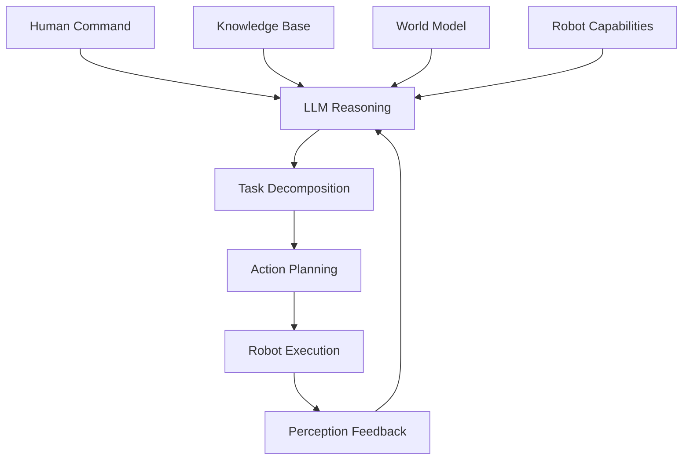

# Large Language Model Reasoning for Robotics

Large Language Models (LLMs) have emerged as powerful tools for high-level reasoning in robotics. This section explores how to integrate LLMs for planning, decision-making, and natural interaction with robots.

## Understanding LLM Reasoning in Robotics

LLMs bring several capabilities to robotics:



### Key Capabilities

| Capability | Robotics Application |
|------------|---------------------|
| **Natural Language Understanding** | Interpreting complex human commands |
| **Logical Reasoning** | Planning multi-step tasks |
| **Common-Sense Knowledge** | Understanding physical world |
| **Context Awareness** | Remembering conversation history |
| **Abstraction** | High-level task specification |
| **Learning from Demonstration** | Acquiring new skills through instruction |

## LLM Integration Approaches

### 1. API-Based Integration

```python
#!/usr/bin/env python3
"""
LLM API Integration Node
"""
import rclpy
from rclpy.node import Node
from std_msgs.msg import String
from geometry_msgs.msg import PoseStamped
from action_msgs.msg import GoalStatus
import openai
import json
import asyncio

class LLMIntegrationNode(Node):
    def __init__(self):
        super().__init__('llm_integration_node')

        # Create subscriber for natural language commands
        self.command_sub = self.create_subscription(
            String, '/natural_language_command', self.command_callback, 10)

        # Create publisher for robot commands
        self.navigation_pub = self.create_publisher(PoseStamped, '/navigation/goal', 10)
        self.manipulation_pub = self.create_publisher(String, '/manipulation/command', 10)
        self.response_pub = self.create_publisher(String, '/llm_response', 10)

        # Initialize LLM client
        self.api_key = self.declare_parameter('openai_api_key', '').value
        if self.api_key:
            openai.api_key = self.api_key
            self.use_openai = True
        else:
            self.get_logger().warn('No OpenAI API key provided')
            self.use_openai = False

        # Robot state and capabilities
        self.robot_state = {
            'location': 'home_base',
            'battery': 85.0,
            'capabilities': ['navigation', 'manipulation', 'perception'],
            'current_task': 'idle'
        }

        # Conversation history for context
        self.conversation_history = []

        self.get_logger().info('LLM integration node started')

    def command_callback(self, msg):
        """Process natural language command with LLM"""
        try:
            user_command = msg.data

            # Create structured prompt with context
            prompt = self.create_structured_prompt(user_command)

            if self.use_openai:
                # Call OpenAI API
                response = self.call_openai_api(prompt)
            else:
                # Fallback to local model or mock response
                response = self.generate_mock_response(user_command)

            # Parse LLM response
            parsed_command = self.parse_llm_response(response)

            # Execute parsed command
            self.execute_parsed_command(parsed_command)

            # Update conversation history
            self.conversation_history.append({
                'role': 'user',
                'content': user_command
            })
            self.conversation_history.append({
                'role': 'assistant',
                'content': response
            })

            # Keep history manageable
            if len(self.conversation_history) > 20:
                self.conversation_history = self.conversation_history[-20:]

            self.get_logger().info(f'Processed command: {user_command[:50]}...')

        except Exception as e:
            self.get_logger().error(f'Error processing LLM command: {e}')

    def create_structured_prompt(self, user_command):
        """Create structured prompt for LLM"""
        prompt = f"""
You are a helpful robot assistant. Interpret the user's command and provide structured robot instructions.

Robot Capabilities: {self.robot_state['capabilities']}
Current Location: {self.robot_state['location']}
Current Task: {self.robot_state['current_task']}
Battery Level: {self.robot_state['battery']}%

User Command: "{user_command}"

Provide your response in JSON format with the following structure:
{{
    "intent": "navigation|manipulation|perception|information|unknown",
    "action": "specific_robot_action",
    "parameters": {{
        "target": "target_object_or_location",
        "location": "specific_location_if_applicable",
        "description": "additional_details"
    }},
    "confidence": 0.0-1.0,
    "explanation": "why this interpretation was chosen"
}}

Only respond with the JSON object, nothing else.
        """

        return prompt

    def call_openai_api(self, prompt):
        """Call OpenAI API for reasoning"""
        try:
            response = openai.ChatCompletion.create(
                model="gpt-3.5-turbo",
                messages=[
                    {"role": "system", "content": "You are a robot command interpreter. Respond only with valid JSON."},
                    {"role": "user", "content": prompt}
                ],
                temperature=0.3,
                max_tokens=200
            )

            return response.choices[0].message.content

        except Exception as e:
            self.get_logger().error(f'OpenAI API error: {e}')
            return '{"intent": "unknown", "action": "unknown", "parameters": {}, "confidence": 0.0, "explanation": "API error"}'

    def parse_llm_response(self, llm_response):
        """Parse LLM response into structured command"""
        try:
            # Extract JSON from response
            json_start = llm_response.find('{')
            json_end = llm_response.rfind('}') + 1

            if json_start != -1 and json_end != 0:
                json_str = llm_response[json_start:json_end]
                parsed_data = json.loads(json_str)

                # Validate required fields
                required_fields = ['intent', 'action', 'parameters']
                if all(field in parsed_data for field in required_fields):
                    return parsed_data

            self.get_logger().warn('LLM response missing required fields')
            return {
                'intent': 'unknown',
                'action': 'unknown',
                'parameters': {},
                'confidence': 0.0,
                'explanation': 'Invalid response format'
            }

        except json.JSONDecodeError as e:
            self.get_logger().error(f'Error parsing LLM response: {e}')
            return {
                'intent': 'unknown',
                'action': 'unknown',
                'parameters': {},
                'confidence': 0.0,
                'explanation': f'JSON parsing error: {e}'
            }

    def execute_parsed_command(self, parsed_command):
        """Execute parsed command based on intent"""
        intent = parsed_command.get('intent', 'unknown')
        action = parsed_command.get('action', 'unknown')
        params = parsed_command.get('parameters', {})

        if intent == 'navigation':
            self.execute_navigation_command(action, params)
        elif intent == 'manipulation':
            self.execute_manipulation_command(action, params)
        elif intent == 'perception':
            self.execute_perception_command(action, params)
        elif intent == 'information':
            self.execute_information_command(action, params)
        else:
            self.get_logger().warn(f'Unknown intent: {intent}')
            self.respond_with_error(f'Unknown command intent: {intent}')

    def execute_navigation_command(self, action, params):
        """Execute navigation command"""
        target_location = params.get('location', params.get('target', 'unknown'))

        if target_location == 'unknown':
            self.respond_with_error('No target location specified')
            return

        # Create navigation goal
        goal_msg = PoseStamped()
        goal_msg.header.stamp = self.get_clock().now().to_msg()
        goal_msg.header.frame_id = 'map'

        # Convert location name to coordinates (simplified)
        coords = self.location_to_coordinates(target_location)
        if coords:
            goal_msg.pose.position.x = coords[0]
            goal_msg.pose.position.y = coords[1]
            goal_msg.pose.position.z = 0.0

            # Set orientation (face forward)
            goal_msg.pose.orientation.w = 1.0

            self.navigation_pub.publish(goal_msg)
            self.get_logger().info(f'Navigating to: {target_location} at {coords}')
        else:
            self.respond_with_error(f'Unknown location: {target_location}')

    def location_to_coordinates(self, location_name):
        """Convert location name to coordinates (simplified)"""
        # In practice, use semantic map or navigation system
        location_map = {
            'home_base': (0.0, 0.0),
            'kitchen': (2.0, 1.0),
            'living_room': (0.0, 2.0),
            'bedroom': (-1.0, -1.0),
            'office': (1.5, -0.5)
        }

        return location_map.get(location_name.lower())

    def execute_manipulation_command(self, action, params):
        """Execute manipulation command"""
        target_object = params.get('target', 'unknown')

        if target_object == 'unknown':
            self.respond_with_error('No target object specified')
            return

        # Create manipulation command
        cmd_msg = String()
        cmd_msg.data = f"{action}:{target_object}"
        self.manipulation_pub.publish(cmd_msg)

        self.get_logger().info(f'Manipulation command: {action} {target_object}')

    def respond_with_error(self, error_message):
        """Publish error response"""
        response_msg = String()
        response_msg.data = f"Error: {error_message}"
        self.response_pub.publish(response_msg)

def main(args=None):
    rclpy.init(args=args)
    node = LLMIntegrationNode()

    try:
        rclpy.spin(node)
    except KeyboardInterrupt:
        pass
    finally:
        node.destroy_node()
        rclpy.shutdown()

if __name__ == '__main__':
    main()
```

### 2. Local Model Integration

```python
#!/usr/bin/env python3
"""
Local LLM Integration Node
"""
import rclpy
from rclpy.node import Node
from std_msgs.msg import String
from sensor_msgs.msg import Image
from cv_bridge import CvBridge
import torch
from transformers import AutoModelForCausalLM, AutoTokenizer

class LocalLLMNode(Node):
    def __init__(self):
        super().__init__('local_llm_node')

        # Create subscriber for commands
        self.command_sub = self.create_subscription(
            String, '/natural_language_command', self.command_callback, 10)

        # Create publisher for responses
        self.response_pub = self.create_publisher(String, '/local_llm_response', 10)

        # Initialize CV bridge for image processing
        self.bridge = CvBridge()

        # Initialize local LLM
        self.model_name = self.declare_parameter('model_name', 'facebook/opt-350m').value
        self.device = torch.device('cuda' if torch.cuda.is_available() else 'cpu')

        try:
            self.tokenizer = AutoTokenizer.from_pretrained(self.model_name)
            self.model = AutoModelForCausalLM.from_pretrained(self.model_name)
            self.model.to(self.device)
            self.model.eval()

            # Add padding token if not present
            if self.tokenizer.pad_token is None:
                self.tokenizer.pad_token = self.tokenizer.eos_token

            self.get_logger().info(f'Loaded local model: {self.model_name}')

        except Exception as e:
            self.get_logger().error(f'Error loading local model: {e}')
            self.tokenizer = None
            self.model = None

        self.get_logger().info('Local LLM node started')

    def command_callback(self, msg):
        """Process command with local LLM"""
        if not self.model or not self.tokenizer:
            self.get_logger().error('No model loaded')
            return

        try:
            user_command = msg.data

            # Create structured prompt
            prompt = self.create_robot_prompt(user_command)

            # Tokenize input
            inputs = self.tokenizer.encode(prompt, return_tensors='pt').to(self.device)

            # Generate response
            with torch.no_grad():
                outputs = self.model.generate(
                    inputs,
                    max_length=inputs.shape[1] + 100,
                    temperature=0.7,
                    do_sample=True,
                    pad_token_id=self.tokenizer.eos_token_id
                )

            # Decode response
            response = self.tokenizer.decode(outputs[0], skip_special_tokens=True)

            # Extract only the generated part (remove prompt)
            generated_part = response[len(prompt):].strip()

            # Publish response
            response_msg = String()
            response_msg.data = generated_part
            self.response_pub.publish(response_msg)

            self.get_logger().info(f'Local LLM response: {generated_part[:50]}...')

        except Exception as e:
            self.get_logger().error(f'Error in local LLM processing: {e}')

    def create_robot_prompt(self, command):
        """Create structured prompt for robot tasks"""
        return f"""You are a helpful robot assistant. Interpret the following command and provide structured robot instructions:

Command: {command}

Response:"""

def main(args=None):
    rclpy.init(args=args)
    node = LocalLLMNode()

    try:
        rclpy.spin(node)
    except KeyboardInterrupt:
        pass
    finally:
        node.destroy_node()
        rclpy.shutdown()

if __name__ == '__main__':
    main()
```

## Reasoning and Planning with LLMs

### Task Decomposition

```python
#!/usr/bin/env python3
"""
LLM Task Decomposition Node
"""
import rclpy
from rclpy.node import Node
from std_msgs.msg import String
from geometry_msgs.msg import PoseStamped
import json
import re

class TaskDecompositionNode(Node):
    def __init__(self):
        super().__init__('task_decomposition_node')

        # Create subscribers
        self.high_level_command_sub = self.create_subscription(
            String, '/high_level_command', self.high_level_command_callback, 10)

        # Create publishers
        self.low_level_commands_pub = self.create_publisher(String, '/low_level_commands', 10)
        self.task_plan_pub = self.create_publisher(String, '/task_plan', 10)

        # Robot capabilities knowledge
        self.robot_capabilities = {
            'navigation': {
                'actions': ['go_to', 'move_to', 'navigate_to', 'follow_path'],
                'constraints': {'min_distance': 0.1, 'max_distance': 10.0}
            },
            'manipulation': {
                'actions': ['pick_up', 'place', 'grasp', 'release', 'transport'],
                'constraints': {'max_weight': 2.0, 'reach_distance': 1.0}
            },
            'perception': {
                'actions': ['detect', 'identify', 'locate', 'track'],
                'constraints': {'detection_range': 5.0, 'accuracy': 0.9}
            }
        }

        self.get_logger().info('Task decomposition node started')

    def high_level_command_callback(self, msg):
        """Process high-level command and decompose into subtasks"""
        try:
            high_level_command = msg.data

            # Create decomposition prompt
            prompt = self.create_decomposition_prompt(high_level_command)

            # Get LLM response (in practice, call actual LLM API)
            # For this example, we'll simulate the response
            task_plan = self.simulate_task_decomposition(high_level_command)

            # Validate task plan
            if self.validate_task_plan(task_plan):
                # Publish low-level commands
                self.publish_low_level_commands(task_plan)

                # Publish task plan
                plan_msg = String()
                plan_msg.data = json.dumps(task_plan)
                self.task_plan_pub.publish(plan_msg)

                self.get_logger().info(f'Decomposed task into {len(task_plan["subtasks"])} subtasks')
            else:
                self.get_logger().error('Invalid task plan generated')

        except Exception as e:
            self.get_logger().error(f'Error in task decomposition: {e}')

    def create_decomposition_prompt(self, command):
        """Create prompt for task decomposition"""
        return f"""
Decompose the following high-level robot command into a sequence of low-level executable tasks:

Command: "{command}"

Robot Capabilities:
{json.dumps(self.robot_capabilities, indent=2)}

Provide your response in JSON format:
{{
    "original_command": "the original high-level command",
    "decomposed_tasks": [
        {{
            "id": 1,
            "action": "low_level_action",
            "parameters": {{"param1": "value1", "param2": "value2"}},
            "preconditions": ["list", "of", "preconditions"],
            "postconditions": ["list", "of", "expected", "outcomes"],
            "dependencies": [list_of_task_ids_this_depends_on],
            "estimated_duration": seconds
        }}
    ],
    "overall_confidence": 0.0-1.0,
    "reasoning": "explain your decomposition approach"
}}

Only respond with the JSON object.
        """

    def simulate_task_decomposition(self, command):
        """Simulate task decomposition (in practice, use real LLM)"""
        # This is a simplified simulation
        # In practice, call actual LLM with the prompt

        # Example: "Go to kitchen and bring me a cup"
        if 'kitchen' in command.lower() and ('cup' in command.lower() or 'bring' in command.lower()):
            return {
                "original_command": command,
                "decomposed_tasks": [
                    {
                        "id": 1,
                        "action": "navigate_to",
                        "parameters": {"location": "kitchen"},
                        "preconditions": ["robot_at_home", "battery_level_sufficient"],
                        "postconditions": ["robot_at_kitchen"],
                        "dependencies": [],
                        "estimated_duration": 30.0
                    },
                    {
                        "id": 2,
                        "action": "detect_object",
                        "parameters": {"object_type": "cup", "search_area": "kitchen"},
                        "preconditions": ["robot_at_kitchen"],
                        "postconditions": ["cup_located"],
                        "dependencies": [1],
                        "estimated_duration": 10.0
                    },
                    {
                        "id": 3,
                        "action": "grasp_object",
                        "parameters": {"object_id": "identified_cup"},
                        "preconditions": ["cup_located", "gripper_free"],
                        "postconditions": ["cup_grasped"],
                        "dependencies": [2],
                        "estimated_duration": 5.0
                    },
                    {
                        "id": 4,
                        "action": "navigate_to",
                        "parameters": {"location": "home_base"},
                        "preconditions": ["cup_grasped"],
                        "postconditions": ["robot_at_home", "object_delivered"],
                        "dependencies": [3],
                        "estimated_duration": 30.0
                    }
                ],
                "overall_confidence": 0.85,
                "reasoning": "Command involves navigation, object detection, grasping, and return navigation"
            }

        # Default case
        return {
            "original_command": command,
            "decomposed_tasks": [
                {
                    "id": 1,
                    "action": "unknown",
                    "parameters": {},
                    "preconditions": [],
                    "postconditions": [],
                    "dependencies": [],
                    "estimated_duration": 10.0
                }
            ],
            "overall_confidence": 0.3,
            "reasoning": "Could not understand command"
        }

    def validate_task_plan(self, plan):
        """Validate generated task plan"""
        required_fields = ['original_command', 'decomposed_tasks', 'overall_confidence']

        if not all(field in plan for field in required_fields):
            return False

        if not isinstance(plan['decomposed_tasks'], list):
            return False

        for task in plan['decomposed_tasks']:
            if not all(key in task for key in ['id', 'action', 'parameters', 'preconditions', 'postconditions']):
                return False

        return True

    def publish_low_level_commands(self, task_plan):
        """Publish low-level commands for execution"""
        for task in task_plan['decomposed_tasks']:
            cmd_msg = String()
            cmd_msg.data = json.dumps(task)
            self.low_level_commands_pub.publish(cmd_msg)

def main(args=None):
    rclpy.init(args=args)
    node = TaskDecompositionNode()

    try:
        rclpy.spin(node)
    except KeyboardInterrupt:
        pass
    finally:
        node.destroy_node()
        rclpy.shutdown()

if __name__ == '__main__':
    main()
```

## Knowledge Integration

### External Knowledge Base

```python
#!/usr/bin/env python3
"""
Knowledge Integration Node
"""
import rclpy
from rclpy.node import Node
from std_msgs.msg import String
from std_srvs.srv import Trigger
import json
import sqlite3
from pathlib import Path

class KnowledgeIntegrationNode(Node):
    def __init__(self):
        super().__init__('knowledge_integration_node')

        # Create subscriber for knowledge queries
        self.knowledge_query_sub = self.create_subscription(
            String, '/knowledge_query', self.knowledge_query_callback, 10)

        # Create publisher for knowledge responses
        self.knowledge_response_pub = self.create_publisher(String, '/knowledge_response', 10)

        # Create service for knowledge updates
        self.update_knowledge_srv = self.create_service(
            Trigger, '/update_knowledge', self.update_knowledge_callback)

        # Initialize knowledge base
        self.knowledge_db_path = self.declare_parameter(
            'knowledge_db_path', '~/knowledge_base.db').value
        self.knowledge_db = self.initialize_knowledge_db()

        # Common-sense knowledge
        self.commonsense_knowledge = {
            'physics': {
                'gravity': 9.81,
                'friction_coefficients': {
                    'wood_wood': 0.5,
                    'metal_concrete': 0.7,
                    'rubber_road': 0.8
                }
            },
            'object_properties': {
                'cup': {'size': 'small', 'weight': 'light', 'function': 'contain_liquid'},
                'chair': {'size': 'medium', 'weight': 'medium', 'function': 'support_human'},
                'table': {'size': 'large', 'weight': 'heavy', 'function': 'surface_support'}
            },
            'spatial_relations': {
                'on_top_of': 'z_greater_than',
                'underneath': 'z_less_than',
                'next_to': 'distance_less_than_1m',
                'inside': 'bounding_box_contains'
            }
        }

        self.get_logger().info('Knowledge integration node started')

    def initialize_knowledge_db(self):
        """Initialize knowledge database"""
        db_path = Path(self.knowledge_db_path).expanduser()
        conn = sqlite3.connect(db_path)

        # Create tables if they don't exist
        conn.execute('''
            CREATE TABLE IF NOT EXISTS facts (
                id INTEGER PRIMARY KEY,
                subject TEXT,
                predicate TEXT,
                object TEXT,
                confidence REAL,
                timestamp DATETIME DEFAULT CURRENT_TIMESTAMP
            )
        ''')

        conn.execute('''
            CREATE TABLE IF NOT EXISTS relations (
                id INTEGER PRIMARY KEY,
                entity1 TEXT,
                relation TEXT,
                entity2 TEXT,
                confidence REAL,
                timestamp DATETIME DEFAULT CURRENT_TIMESTAMP
            )
        ''')

        conn.commit()
        return conn

    def knowledge_query_callback(self, msg):
        """Process knowledge queries"""
        try:
            query = json.loads(msg.data)
            query_type = query.get('type', 'fact')
            query_content = query.get('content', '')

            if query_type == 'fact':
                result = self.query_fact(query_content)
            elif query_type == 'relation':
                result = self.query_relation(query_content)
            elif query_type == 'commonsense':
                result = self.query_commonsense(query_content)
            else:
                result = {'error': f'Unknown query type: {query_type}'}

            # Publish result
            response_msg = String()
            response_msg.data = json.dumps(result)
            self.knowledge_response_pub.publish(response_msg)

            self.get_logger().info(f'Knowledge query processed: {query_content[:30]}...')

        except Exception as e:
            self.get_logger().error(f'Error processing knowledge query: {e}')

    def query_fact(self, fact_query):
        """Query facts from knowledge base"""
        try:
            cursor = self.knowledge_db.cursor()
            cursor.execute(
                "SELECT subject, predicate, object, confidence FROM facts WHERE subject LIKE ? OR object LIKE ?",
                (f'%{fact_query}%', f'%{fact_query}%')
            )
            results = cursor.fetchall()

            facts = []
            for row in results:
                facts.append({
                    'subject': row[0],
                    'predicate': row[1],
                    'object': row[2],
                    'confidence': row[3]
                })

            return {
                'type': 'facts',
                'query': fact_query,
                'results': facts,
                'count': len(facts)
            }

        except Exception as e:
            return {'error': f'Database query error: {e}'}

    def query_relation(self, relation_query):
        """Query relations from knowledge base"""
        try:
            cursor = self.knowledge_db.cursor()
            cursor.execute(
                "SELECT entity1, relation, entity2, confidence FROM relations WHERE entity1 LIKE ? OR entity2 LIKE ?",
                (f'%{relation_query}%', f'%{relation_query}%')
            )
            results = cursor.fetchall()

            relations = []
            for row in results:
                relations.append({
                    'entity1': row[0],
                    'relation': row[1],
                    'entity2': row[2],
                    'confidence': row[3]
                })

            return {
                'type': 'relations',
                'query': relation_query,
                'results': relations,
                'count': len(relations)
            }

        except Exception as e:
            return {'error': f'Database query error: {e}'}

    def query_commonsense(self, commonsense_query):
        """Query common-sense knowledge"""
        # Search through common-sense knowledge
        results = []

        # Search in physics knowledge
        for category, knowledge in self.commonsense_knowledge.items():
            if isinstance(knowledge, dict):
                for key, value in knowledge.items():
                    if commonsense_query.lower() in key.lower() or \
                       (isinstance(value, str) and commonsense_query.lower() in value.lower()) or \
                       (isinstance(value, dict) and commonsense_query.lower() in str(value).lower()):
                        results.append({
                            'category': category,
                            'key': key,
                            'value': value
                        })

        return {
            'type': 'commonsense',
            'query': commonsense_query,
            'results': results,
            'count': len(results)
        }

    def update_knowledge_callback(self, request, response):
        """Handle knowledge base updates"""
        try:
            # In practice, this would receive knowledge updates
            # For this example, we'll just acknowledge
            response.success = True
            response.message = 'Knowledge base update service ready'
            return response
        except Exception as e:
            self.get_logger().error(f'Error in knowledge update: {e}')
            response.success = False
            response.message = f'Error: {e}'
            return response

    def add_fact(self, subject, predicate, obj, confidence=1.0):
        """Add fact to knowledge base"""
        try:
            cursor = self.knowledge_db.cursor()
            cursor.execute(
                "INSERT INTO facts (subject, predicate, object, confidence) VALUES (?, ?, ?, ?)",
                (subject, predicate, obj, confidence)
            )
            self.knowledge_db.commit()
            return True
        except Exception as e:
            self.get_logger().error(f'Error adding fact: {e}')
            return False

    def add_relation(self, entity1, relation, entity2, confidence=1.0):
        """Add relation to knowledge base"""
        try:
            cursor = self.knowledge_db.cursor()
            cursor.execute(
                "INSERT INTO relations (entity1, relation, entity2, confidence) VALUES (?, ?, ?, ?)",
                (entity1, relation, entity2, confidence)
            )
            self.knowledge_db.commit()
            return True
        except Exception as e:
            self.get_logger().error(f'Error adding relation: {e}')
            return False

def main(args=None):
    rclpy.init(args=args)
    node = KnowledgeIntegrationNode()

    try:
        rclpy.spin(node)
    except KeyboardInterrupt:
        pass
    finally:
        node.knowledge_db.close()
        node.destroy_node()
        rclpy.shutdown()

if __name__ == '__main__':
    main()
```

## Context Management

### Conversation Context and Memory

```python
#!/usr/bin/env python3
"""
Context Management Node
"""
import rclpy
from rclpy.node import Node
from std_msgs.msg import String
from geometry_msgs.msg import PoseStamped
from std_msgs.msg import Header
from collections import deque
import time
import json

class ContextManagementNode(Node):
    def __init__(self):
        super().__init__('context_management_node')

        # Create subscribers
        self.user_input_sub = self.create_subscription(
            String, '/user_input', self.user_input_callback, 10)
        self.robot_state_sub = self.create_subscription(
            String, '/robot_state', self.robot_state_callback, 10)

        # Create publishers
        self.enhanced_command_pub = self.create_publisher(String, '/enhanced_command', 10)
        self.context_state_pub = self.create_publisher(String, '/context_state', 10)

        # Context management
        self.conversation_history = deque(maxlen=20)  # Keep last 20 exchanges
        self.entity_memory = {}  # Remember entities mentioned
        self.location_memory = {}  # Remember locations
        self.task_memory = {}  # Remember ongoing tasks
        self.robot_state = {}  # Current robot state

        # Context parameters
        self.context_timeout = 300  # 5 minutes before forgetting
        self.max_entity_memory = 50  # Max entities to remember

        # Pronoun resolution
        self.pronoun_antecedents = {
            'it': None,
            'they': None,
            'them': None,
            'this': None,
            'that': None,
            'these': None,
            'those': None
        }

        self.get_logger().info('Context management node started')

    def user_input_callback(self, msg):
        """Process user input with context enhancement"""
        try:
            user_text = msg.data

            # Add to conversation history
            self.conversation_history.append({
                'timestamp': time.time(),
                'speaker': 'user',
                'text': user_text
            })

            # Resolve pronouns and references
            resolved_text = self.resolve_references(user_text)

            # Enhance with context
            enhanced_command = self.enhance_with_context(resolved_text)

            # Publish enhanced command
            enhanced_msg = String()
            enhanced_msg.data = json.dumps(enhanced_command)
            self.enhanced_command_pub.publish(enhanced_msg)

            # Update context state
            self.publish_context_state()

            self.get_logger().info(f'Context-enhanced: {user_text[:30]}...')

        except Exception as e:
            self.get_logger().error(f'Error in context processing: {e}')

    def resolve_references(self, text):
        """Resolve pronouns and references using context"""
        # Simple pronoun resolution
        words = text.split()
        resolved_words = []

        for word in words:
            lower_word = word.lower().strip('.,!?;:')

            if lower_word in self.pronoun_antecedents:
                antecedent = self.pronoun_antecedents[lower_word]
                if antecedent:
                    # Replace pronoun with antecedent
                    resolved_words.append(antecedent)
                    self.get_logger().info(f'Resolved "{lower_word}" to "{antecedent}"')
                else:
                    resolved_words.append(word)
            else:
                resolved_words.append(word)

                # If this is a noun, consider it as potential antecedent
                # This is a simplified approach - in practice, use NLP
                if self.is_potential_referent(lower_word):
                    # Update pronoun antecedents
                    for pronoun in ['it', 'they', 'this', 'that']:
                        if self.pronoun_antecedents[pronoun] is None:
                            self.pronoun_antecedents[pronoun] = lower_word

        return ' '.join(resolved_words)

    def is_potential_referent(self, word):
        """Check if word is a potential referent for pronouns"""
        # Simple heuristic - could be improved with NLP
        common_objects = ['robot', 'cup', 'table', 'chair', 'door', 'window', 'object', 'item']
        common_locations = ['kitchen', 'living room', 'bedroom', 'office', 'hallway', 'room']
        common_entities = common_objects + common_locations

        return word in common_entities

    def enhance_with_context(self, text):
        """Enhance command with contextual information"""
        enhanced = {
            'original_text': text,
            'resolved_text': text,
            'context': {
                'previous_commands': [],
                'current_location': self.robot_state.get('location', 'unknown'),
                'remembered_entities': dict(list(self.entity_memory.items())[-5:]),  # Last 5
                'ongoing_tasks': list(self.task_memory.keys()),
                'timestamp': time.time()
            },
            'intent': 'unknown',
            'parameters': {}
        }

        # Add recent conversation context
        for entry in list(self.conversation_history)[-3:]:  # Last 3 exchanges
            if entry['speaker'] == 'user':
                enhanced['context']['previous_commands'].append(entry['text'])

        # Infer intent based on context
        enhanced['intent'] = self.infer_intent_from_context(text, enhanced['context'])

        return enhanced

    def infer_intent_from_context(self, text, context):
        """Infer intent considering context"""
        text_lower = text.lower()

        # Check for navigation intents
        navigation_keywords = ['go', 'move', 'navigate', 'drive', 'walk', 'to', 'towards']
        if any(keyword in text_lower for keyword in navigation_keywords):
            # Check if location is specified or needs to be inferred from context
            if self.contains_location_reference(text_lower):
                return 'navigation_explicit'
            else:
                # Look for location in context
                for prev_cmd in context['previous_commands']:
                    if self.contains_location_reference(prev_cmd.lower()):
                        return 'navigation_contextual'

        # Check for manipulation intents
        manipulation_keywords = ['pick', 'grasp', 'take', 'get', 'bring', 'give', 'place', 'put']
        if any(keyword in text_lower for keyword in manipulation_keywords):
            return 'manipulation'

        # Check for information requests
        info_keywords = ['where', 'what', 'how', 'when', 'who', 'which', 'find', 'locate']
        if any(keyword in text_lower for keyword in info_keywords):
            return 'information_request'

        return 'unknown'

    def contains_location_reference(self, text):
        """Check if text contains location reference"""
        known_locations = ['kitchen', 'living room', 'bedroom', 'office', 'dining room', 'bathroom', 'garage', 'garden', 'home', 'base']
        return any(loc in text for loc in known_locations)

    def robot_state_callback(self, msg):
        """Update robot state from robot state messages"""
        try:
            state_data = json.loads(msg.data)
            self.robot_state.update(state_data)

            # Update location memory
            if 'location' in state_data:
                self.location_memory[state_data['location']] = time.time()

        except Exception as e:
            self.get_logger().error(f'Error processing robot state: {e}')

    def publish_context_state(self):
        """Publish current context state"""
        context_msg = String()
        context_data = {
            'conversation_history_length': len(self.conversation_history),
            'entity_memory_size': len(self.entity_memory),
            'location_memory': list(self.location_memory.keys()),
            'task_memory_size': len(self.task_memory),
            'robot_state': self.robot_state,
            'timestamp': time.time()
        }
        context_msg.data = json.dumps(context_data)
        self.context_state_pub.publish(context_msg)

    def cleanup_expired_context(self):
        """Clean up expired context entries"""
        current_time = time.time()
        expired_entities = [
            key for key, timestamp in self.entity_memory.items()
            if (current_time - timestamp) > self.context_timeout
        ]
        for entity in expired_entities:
            del self.entity_memory[entity]

        expired_locations = [
            key for key, timestamp in self.location_memory.items()
            if (current_time - timestamp) > self.context_timeout
        ]
        for location in expired_locations:
            del self.location_memory[location]

def main(args=None):
    rclpy.init(args=args)
    node = ContextManagementNode()

    # Timer for cleanup
    cleanup_timer = node.create_timer(60.0, node.cleanup_expired_context)  # Cleanup every minute

    try:
        rclpy.spin(node)
    except KeyboardInterrupt:
        pass
    finally:
        node.destroy_node()
        rclpy.shutdown()

if __name__ == '__main__':
    main()
```

## Quality Assurance and Validation

### LLM Response Validation

```python
#!/usr/bin/env python3
"""
LLM Response Validation Node
"""
import rclpy
from rclpy.node import Node
from std_msgs.msg import String
from geometry_msgs.msg import PoseStamped
import json
import re
from typing import Dict, Any

class LLMResponseValidationNode(Node):
    def __init__(self):
        super().__init__('llm_response_validation_node')

        # Create subscribers
        self.llm_response_sub = self.create_subscription(
            String, '/llm_response', self.llm_response_callback, 10)

        # Create publishers
        self.validated_response_pub = self.create_publisher(String, '/validated_response', 10)
        self.validation_status_pub = self.create_publisher(String, '/validation_status', 10)

        # Validation parameters
        self.confidence_threshold = 0.5
        self.max_response_length = 1000
        self.allowed_intents = [
            'navigation', 'manipulation', 'perception',
            'information', 'greeting', 'farewell', 'unknown'
        ]

        # Validation patterns
        self.json_pattern = re.compile(r'\{.*\}', re.DOTALL)
        self.command_pattern = re.compile(r'^(go|move|navigate|pick|grasp|take|find|locate|tell|show|greet|bye)', re.IGNORECASE)

        self.get_logger().info('LLM response validation node started')

    def llm_response_callback(self, msg):
        """Validate LLM response"""
        try:
            response_text = msg.data

            # Validate response format
            is_valid, validation_results = self.validate_response(response_text)

            if is_valid:
                # Publish validated response
                self.validated_response_pub.publish(msg)

                # Publish validation success
                status_msg = String()
                status_msg.data = json.dumps({
                    'status': 'VALID',
                    'confidence': validation_results.get('confidence', 0.0),
                    'reasoning': 'Response passed all validation checks'
                })
                self.validation_status_pub.publish(status_msg)

                self.get_logger().info('LLM response validated successfully')
            else:
                # Publish validation failure
                status_msg = String()
                status_msg.data = json.dumps({
                    'status': 'INVALID',
                    'errors': validation_results.get('errors', []),
                    'reasoning': 'Response failed validation checks'
                })
                self.validation_status_pub.publish(status_msg)

                self.get_logger().warn(f'LLM response validation failed: {validation_results.get("errors", [])}')

        except Exception as e:
            self.get_logger().error(f'Error in response validation: {e}')

    def validate_response(self, response_text):
        """Validate LLM response"""
        results = {
            'is_valid': True,
            'errors': [],
            'warnings': [],
            'confidence': 0.0
        }

        # Check if response contains JSON
        json_match = self.json_pattern.search(response_text)
        if not json_match:
            results['is_valid'] = False
            results['errors'].append('No JSON found in response')
            return results, results

        try:
            # Extract and parse JSON
            json_str = json_match.group(0)
            parsed_response = json.loads(json_str)

            # Validate required fields
            required_fields = ['intent', 'action', 'parameters']
            for field in required_fields:
                if field not in parsed_response:
                    results['is_valid'] = False
                    results['errors'].append(f'Missing required field: {field}')

            # Validate intent
            intent = parsed_response.get('intent', 'unknown')
            if intent not in self.allowed_intents:
                results['warnings'].append(f'Unrecognized intent: {intent}')

            # Validate confidence
            confidence = parsed_response.get('confidence', 0.0)
            if not isinstance(confidence, (int, float)) or not 0 <= confidence <= 1:
                results['is_valid'] = False
                results['errors'].append(f'Invalid confidence value: {confidence}')
            else:
                results['confidence'] = confidence

            # Validate parameters structure
            params = parsed_response.get('parameters', {})
            if not isinstance(params, dict):
                results['is_valid'] = False
                results['errors'].append('Parameters must be a dictionary')

            # Check for excessively long responses
            if len(response_text) > self.max_response_length:
                results['warnings'].append('Response exceeds maximum length')

            # Validate confidence threshold
            if confidence < self.confidence_threshold:
                results['warnings'].append(f'Confidence below threshold: {confidence} < {self.confidence_threshold}')

        except json.JSONDecodeError as e:
            results['is_valid'] = False
            results['errors'].append(f'Invalid JSON: {e}')
        except Exception as e:
            results['is_valid'] = False
            results['errors'].append(f'Validation error: {e}')

        return results['is_valid'], results

def main(args=None):
    rclpy.init(args=args)
    node = LLMResponseValidationNode()

    try:
        rclpy.spin(node)
    except KeyboardInterrupt:
        pass
    finally:
        node.destroy_node()
        rclpy.shutdown()

if __name__ == '__main__':
    main()
```

## Best Practices

### 1. LLM Integration Best Practices

```python
# Good: Well-structured LLM integration
class GoodLLMIntegration:
    def __init__(self):
        self.client = self.initialize_llm_client()
        self.cache = {}  # Cache for deterministic responses
        self.fallback_system = self.setup_fallback_system()
        self.monitoring = self.setup_monitoring()

    def initialize_llm_client(self):
        """Properly initialize LLM client with error handling"""
        pass

    def setup_fallback_system(self):
        """Implement fallback for when LLM fails"""
        pass

    def setup_monitoring(self):
        """Monitor LLM performance and quality"""
        pass

# Bad: Poor LLM integration
class BadLLMIntegration:
    def __init__(self):
        # No error handling
        # No fallback system
        # No monitoring
        # No caching
        # No validation
        pass
```

### 2. Context Management Best Practices

```python
# Good: Proper context management
def good_context_management():
    # Limit context size
    # Clean up expired entries
    # Use efficient data structures
    # Maintain entity linking
    # Handle pronoun resolution
    pass

# Bad: Poor context management
def bad_context_management():
    # Unlimited context growth
    # No cleanup
    # Inefficient storage
    # No entity tracking
    # No memory management
    pass
```

### 3. Performance Best Practices

```python
# Good: Performance-optimized LLM usage
def good_performance_practices():
    # Use appropriate model sizes
    # Implement caching for repeated queries
    # Batch requests when possible
    # Use local models for simple tasks
    # Monitor API usage
    pass

# Bad: Performance issues
def bad_performance_practices():
    # Always use largest models
    # No caching
    # Excessive API calls
    # No performance monitoring
    # No resource management
    pass
```

## Common Issues and Troubleshooting

### 1. API Issues

```bash
# Check API key configuration
echo $OPENAI_API_KEY

# Test API connectivity
curl -H "Authorization: Bearer $OPENAI_API_KEY" \
     -H "Content-Type: application/json" \
     https://api.openai.com/v1/models
```

### 2. Context Issues

```python
# Monitor context length
def monitor_context_length(context_messages):
    """Monitor context length to avoid exceeding limits"""
    total_tokens = sum(len(msg['content'].split()) for msg in context_messages)
    max_tokens = 4096  # Example limit

    if total_tokens > max_tokens * 0.8:  # 80% threshold
        print(f'Warning: Context approaching limit ({total_tokens}/{max_tokens})')
```

### 3. Quality Issues

```python
# Validate response quality
def validate_response_quality(response):
    """Validate LLM response quality"""
    if not response or len(response.strip()) == 0:
        return False, "Empty response"

    if len(response) > 1000:  # Too long
        return False, "Response too long"

    # Check for hallucinations (implementation-specific)
    # Check for coherence
    # Validate structure

    return True, "Valid response"
```

## Next Steps

Now that you understand LLM integration for robotics, continue to [Exercise: LLM-Powered Robot Assistant](../week-11/exercise-llm-assistant) to build a complete system that uses LLMs for high-level robot control.

## Exercises

1. Implement a context-aware LLM interface for robot navigation
2. Create a knowledge base system for robot capabilities and environment
3. Build a task decomposition system using LLM reasoning
4. Develop a quality assurance system for LLM-based robot commands