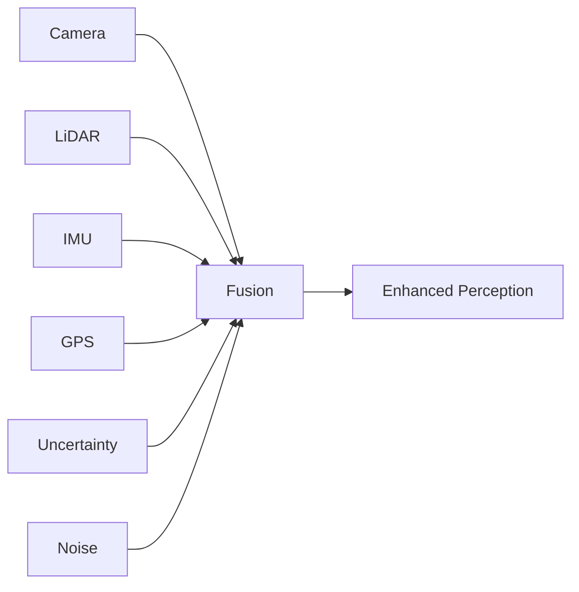

# Sensor Fusion and Integration

Sensor fusion combines data from multiple sensors to create a more accurate and robust understanding of the environment than any single sensor could provide. This section covers the principles and implementation of sensor fusion for robotics perception.

## Understanding Sensor Fusion

Sensor fusion addresses the limitations of individual sensors by combining their strengths:



### Why Sensor Fusion?

| Single Sensor Limitations | Fusion Solution |
|---------------------------|-----------------|
| **Limited Field of View** | Multiple sensors cover blind spots |
| **Environmental Sensitivity** | Different sensors work in different conditions |
| **Accuracy Limitations** | Combined data provides better accuracy |
| **Latency Issues** | Different sensors have different update rates |
| **Noise and Uncertainty** | Statistical fusion reduces noise |

## Fusion Approaches

### 1. Kalman Filter Fusion

Kalman filters provide optimal state estimation by combining predictions and measurements:

```python
#!/usr/bin/env python3
"""
Kalman Filter Sensor Fusion Node
"""
import rclpy
from rclpy.node import Node
from sensor_msgs.msg import Image, PointCloud2, Imu, NavSatFix
from geometry_msgs.msg import PoseWithCovarianceStamped, TwistWithCovarianceStamped
from std_msgs.msg import Float32
import numpy as np
from filterpy.kalman import KalmanFilter
from filterpy.common import Q_discrete_white_noise

class KalmanFusionNode(Node):
    def __init__(self):
        super().__init__('kalman_fusion_node')

        # Create subscribers for different sensors
        self.camera_sub = self.create_subscription(Image, '/camera/image_raw', self.camera_callback, 10)
        self.lidar_sub = self.create_subscription(PointCloud2, '/lidar/points', self.lidar_callback, 10)
        self.imu_sub = self.create_subscription(Imu, '/imu/data', self.imu_callback, 10)
        self.gps_sub = self.create_subscription(NavSatFix, '/gps/fix', self.gps_callback, 10)

        # Create publishers for fused data
        self.pose_pub = self.create_publisher(PoseWithCovarianceStamped, '/fused_pose', 10)
        self.twist_pub = self.create_publisher(TwistWithCovarianceStamped, '/fused_twist', 10)
        self.confidence_pub = self.create_publisher(Float32, '/fusion_confidence', 10)

        # Initialize Kalman filter for position estimation
        self.kf = self.initialize_kalman_filter()

        # Sensor data storage
        self.camera_data = None
        self.lidar_data = None
        self.imu_data = None
        self.gps_data = None

        # Timestamps for synchronization
        self.last_sensor_time = 0.0

        # Fusion parameters
        self.process_noise = 0.1
        self.measurement_noise = {
            'camera': 0.5,
            'lidar': 0.2,
            'imu': 0.05,
            'gps': 1.0
        }

        self.get_logger().info('Kalman fusion node started')

    def initialize_kalman_filter(self):
        """Initialize Kalman filter for 3D position and velocity"""
        # State vector: [x, y, z, vx, vy, vz]
        kf = KalmanFilter(dim_x=6, dim_z=3)

        # State transition matrix (constant velocity model)
        dt = 0.1  # Time step (10Hz)
        kf.F = np.array([
            [1, 0, 0, dt, 0, 0],
            [0, 1, 0, 0, dt, 0],
            [0, 0, 1, 0, 0, dt],
            [0, 0, 0, 1, 0, 0],
            [0, 0, 0, 0, 1, 0],
            [0, 0, 0, 0, 0, 1]
        ])

        # Measurement matrix (only position is measured)
        kf.H = np.array([
            [1, 0, 0, 0, 0, 0],
            [0, 1, 0, 0, 0, 0],
            [0, 0, 1, 0, 0, 0]
        ])

        # Initial state (position and velocity)
        kf.x = np.array([0., 0., 0., 0., 0., 0.])

        # Initial uncertainty
        kf.P *= 1000.

        # Process noise (motion uncertainty)
        kf.Q = Q_discrete_white_noise(dim=6, dt=dt, var=self.process_noise)

        # Measurement noise
        kf.R = np.eye(3) * self.measurement_noise['lidar']  # Start with LiDAR noise

        return kf

    def camera_callback(self, msg):
        """Process camera data for fusion"""
        try:
            # Extract position estimate from camera (visual odometry, etc.)
            # This is a simplified example - in practice, use visual odometry
            camera_position = self.extract_camera_position(msg)
            if camera_position is not None:
                self.update_filter_with_measurement(camera_position, 'camera', msg.header.stamp)
        except Exception as e:
            self.get_logger().error(f'Error processing camera data: {e}')

    def lidar_callback(self, msg):
        """Process LiDAR data for fusion"""
        try:
            # Extract position estimate from LiDAR (ICP, etc.)
            lidar_position = self.extract_lidar_position(msg)
            if lidar_position is not None:
                self.update_filter_with_measurement(lidar_position, 'lidar', msg.header.stamp)
        except Exception as e:
            self.get_logger().error(f'Error processing LiDAR data: {e}')

    def imu_callback(self, msg):
        """Process IMU data for fusion"""
        try:
            # Extract acceleration and angular velocity
            acceleration = np.array([msg.linear_acceleration.x, msg.linear_acceleration.y, msg.linear_acceleration.z])
            angular_velocity = np.array([msg.angular_velocity.x, msg.angular_velocity.y, msg.angular_velocity.z])

            # Update filter with velocity prediction
            self.update_filter_with_imu(acceleration, angular_velocity, msg.header.stamp)
        except Exception as e:
            self.get_logger().error(f'Error processing IMU data: {e}')

    def gps_callback(self, msg):
        """Process GPS data for fusion"""
        try:
            if msg.status.status != -1:  # Check if GPS fix is valid
                gps_position = np.array([msg.latitude, msg.longitude, msg.altitude])
                self.update_filter_with_measurement(gps_position, 'gps', msg.header.stamp)
        except Exception as e:
            self.get_logger().error(f'Error processing GPS data: {e}')

    def update_filter_with_measurement(self, measurement, sensor_type, timestamp):
        """Update Kalman filter with sensor measurement"""
        try:
            # Update measurement noise based on sensor type
            self.kf.R = np.eye(3) * self.measurement_noise[sensor_type]

            # Update the filter
            self.kf.update(measurement[:3])  # Use only position components

            # Publish fused state
            self.publish_fused_state(timestamp)

            # Calculate and publish confidence score
            confidence = self.calculate_confidence()
            confidence_msg = Float32()
            confidence_msg.data = confidence
            self.confidence_pub.publish(confidence_msg)

        except Exception as e:
            self.get_logger().error(f'Error updating filter: {e}')

    def update_filter_with_imu(self, acceleration, angular_velocity, timestamp):
        """Update Kalman filter with IMU data"""
        try:
            # Use acceleration to predict state evolution
            # This would typically update the process noise model
            dt = (timestamp.nanosec * 1e-9) - self.last_sensor_time
            self.last_sensor_time = timestamp.nanosec * 1e-9

            if dt > 0:
                # Update process noise based on IMU data
                # Higher acceleration = higher process noise
                acc_magnitude = np.linalg.norm(acceleration)
                self.kf.Q = Q_discrete_white_noise(dim=6, dt=dt, var=self.process_noise + acc_magnitude * 0.1)

        except Exception as e:
            self.get_logger().error(f'Error updating filter with IMU: {e}')

    def publish_fused_state(self, header):
        """Publish fused state estimate"""
        try:
            pose_msg = PoseWithCovarianceStamped()
            pose_msg.header.stamp = header.stamp
            pose_msg.header.frame_id = 'map'

            # Set position
            pose_msg.pose.pose.position.x = self.kf.x[0]
            pose_msg.pose.pose.position.y = self.kf.x[1]
            pose_msg.pose.pose.position.z = self.kf.x[2]

            # Set orientation (simplified - in practice, use IMU data)
            pose_msg.pose.pose.orientation.w = 1.0

            # Set covariance (extract from filter)
            pose_msg.pose.covariance = self.extract_covariance()

            self.pose_pub.publish(pose_msg)

        except Exception as e:
            self.get_logger().error(f'Error publishing fused state: {e}')

    def extract_covariance(self):
        """Extract covariance from Kalman filter"""
        cov_matrix = self.kf.P[:3, :3]  # Position covariance
        # Flatten to 36-element array as required by PoseWithCovariance
        return cov_matrix.flatten()

    def calculate_confidence(self):
        """Calculate fusion confidence based on uncertainty"""
        # Lower uncertainty = higher confidence
        position_uncertainty = np.trace(self.kf.P[:3, :3])
        confidence = 1.0 / (1.0 + position_uncertainty)
        return min(1.0, max(0.0, confidence))

    def extract_camera_position(self, image_msg):
        """Extract position from camera data (simplified)"""
        # In practice, this would run visual odometry
        # For this example, return None to simulate no camera-based position
        return None

    def extract_lidar_position(self, pointcloud_msg):
        """Extract position from LiDAR data (simplified)"""
        # In practice, this would run ICP or other registration
        # For this example, return a dummy position
        return np.array([0.0, 0.0, 0.0])

def main(args=None):
    rclpy.init(args=args)
    node = KalmanFusionNode()

    try:
        rclpy.spin(node)
    except KeyboardInterrupt:
        pass
    finally:
        node.destroy_node()
        rclpy.shutdown()

if __name__ == '__main__':
    main()
```

## Particle Filter Fusion

For non-linear/non-Gaussian systems:

```python
#!/usr/bin/env python3
"""
Particle Filter Fusion Node
"""
import rclpy
from rclpy.node import Node
from sensor_msgs.msg import Image, LaserScan
from geometry_msgs.msg import PoseArray, PoseStamped
import numpy as np

class ParticleFilterFusionNode(Node):
    def __init__(self):
        super().__init__('particle_filter_fusion_node')

        # Create subscribers
        self.camera_sub = self.create_subscription(Image, '/camera/image_raw', self.camera_callback, 10)
        self.laser_sub = self.create_subscription(LaserScan, '/scan', self.laser_callback, 10)

        # Create publishers
        self.particle_pub = self.create_publisher(PoseArray, '/particle_cloud', 10)
        self.estimate_pub = self.create_publisher(PoseStamped, '/pf_estimate', 10)

        # Initialize particle filter
        self.num_particles = 1000
        self.particles = np.random.uniform(-10, 10, (self.num_particles, 3))  # x, y, theta
        self.weights = np.ones(self.num_particles) / self.num_particles

        # Sensor likelihood models
        self.camera_likelihood = self.camera_observation_model
        self.laser_likelihood = self.laser_observation_model

        self.get_logger().info('Particle filter fusion node started')

    def camera_callback(self, msg):
        """Process camera observation"""
        try:
            # Extract visual features (simplified)
            visual_features = self.extract_visual_features(msg)

            # Update particle weights based on visual observation
            for i in range(self.num_particles):
                particle_pose = self.particles[i]
                expected_features = self.predict_visual_features(particle_pose)
                likelihood = self.calculate_visual_likelihood(visual_features, expected_features)
                self.weights[i] *= likelihood

            # Normalize weights
            self.weights += 1e-300  # Avoid division by zero
            self.weights /= np.sum(self.weights)

            # Resample particles
            self.resample_particles()

            # Publish results
            self.publish_particle_cloud()
            self.publish_estimate()

        except Exception as e:
            self.get_logger().error(f'Error in camera fusion: {e}')

    def laser_callback(self, msg):
        """Process laser scan observation"""
        try:
            # Update particle weights based on laser observation
            for i in range(self.num_particles):
                particle_pose = self.particles[i]
                expected_scan = self.predict_laser_scan(particle_pose)
                likelihood = self.calculate_laser_likelihood(msg.ranges, expected_scan)
                self.weights[i] *= likelihood

            # Normalize weights
            self.weights += 1e-300
            self.weights /= np.sum(self.weights)

            # Resample particles
            self.resample_particles()

            # Publish results
            self.publish_particle_cloud()
            self.publish_estimate()

        except Exception as e:
            self.get_logger().error(f'Error in laser fusion: {e}')

    def resample_particles(self):
        """Resample particles based on weights"""
        # Systematic resampling
        indices = self.systematic_resample(self.weights)

        # Resample particles
        self.particles = self.particles[indices]
        self.weights.fill(1.0 / self.num_particles)

    def systematic_resample(self, weights):
        """Systematic resampling algorithm"""
        N = len(weights)
        indices = np.zeros(N, dtype=int)

        # Generate random start point
        random_start = np.random.random() / N

        # Generate cumulative weights
        cumulative_weights = np.cumsum(weights)

        i, j = 0, 0
        while i < N:
            if random_start + j/N < cumulative_weights[i]:
                indices[j] = i
                j += 1
            else:
                i += 1

        return indices

    def predict_visual_features(self, pose):
        """Predict visual features given particle pose"""
        # In practice, this would render the environment from the particle's perspective
        # and extract features
        return np.random.rand(10)  # Dummy features

    def calculate_visual_likelihood(self, observed_features, expected_features):
        """Calculate likelihood of observed features given expected features"""
        # Simple Gaussian likelihood
        diff = observed_features - expected_features
        likelihood = np.exp(-0.5 * np.dot(diff, diff))
        return max(likelihood, 1e-10)

    def predict_laser_scan(self, pose):
        """Predict laser scan given particle pose"""
        # In practice, this would use the map and particle pose to predict expected scan
        return np.random.rand(360)  # Dummy scan

    def calculate_laser_likelihood(self, observed_scan, expected_scan):
        """Calculate likelihood of observed scan given expected scan"""
        # Simple likelihood based on scan matching
        diff = np.array(observed_scan) - expected_scan
        diff = diff[~np.isnan(diff)]  # Remove invalid measurements
        if len(diff) > 0:
            likelihood = np.exp(-0.5 * np.mean(diff**2))
            return max(likelihood, 1e-10)
        else:
            return 1e-10

    def publish_particle_cloud(self):
        """Publish particle cloud for visualization"""
        try:
            particle_msg = PoseArray()
            particle_msg.header.stamp = self.get_clock().now().to_msg()
            particle_msg.header.frame_id = 'map'

            for particle in self.particles:
                pose = Pose()
                pose.position.x = particle[0]
                pose.position.y = particle[1]
                pose.position.z = 0.0

                # Convert angle to quaternion
                from math import sin, cos
                angle = particle[2]
                pose.orientation.z = sin(angle / 2)
                pose.orientation.w = cos(angle / 2)

                particle_msg.poses.append(pose)

            self.particle_pub.publish(particle_msg)

        except Exception as e:
            self.get_logger().error(f'Error publishing particle cloud: {e}')

    def publish_estimate(self):
        """Publish best estimate from particle filter"""
        try:
            # Calculate weighted average of particles
            weighted_mean = np.average(self.particles, axis=0, weights=self.weights)

            estimate_msg = PoseStamped()
            estimate_msg.header.stamp = self.get_clock().now().to_msg()
            estimate_msg.header.frame_id = 'map'

            estimate_msg.pose.position.x = weighted_mean[0]
            estimate_msg.pose.position.y = weighted_mean[1]
            estimate_msg.pose.position.z = 0.0

            # Convert angle to quaternion
            from math import sin, cos
            angle = weighted_mean[2]
            estimate_msg.pose.orientation.z = sin(angle / 2)
            estimate_msg.pose.orientation.w = cos(angle / 2)

            self.estimate_pub.publish(estimate_msg)

        except Exception as e:
            self.get_logger().error(f'Error publishing estimate: {e}')

def main(args=None):
    rclpy.init(args=args)
    node = ParticleFilterFusionNode()

    try:
        rclpy.spin(node)
    except KeyboardInterrupt:
        pass
    finally:
        node.destroy_node()
        rclpy.shutdown()

if __name__ == '__main__':
    main()
```

## Extended Kalman Filter (EKF) for Non-linear Systems

```python
#!/usr/bin/env python3
"""
Extended Kalman Filter for Non-linear Fusion
"""
import rclpy
from rclpy.node import Node
from sensor_msgs.msg import Imu, MagneticField
from geometry_msgs.msg import Vector3Stamped
from tf_transformations import euler_from_quaternion, quaternion_from_euler
import numpy as np

class EKFFusionNode(Node):
    def __init__(self):
        super().__init__('ekf_fusion_node')

        # Create subscribers
        self.imu_sub = self.create_subscription(Imu, '/imu/data', self.imu_callback, 10)
        self.mag_sub = self.create_subscription(MagneticField, '/imu/mag', self.mag_callback, 10)

        # Create publishers
        self.orientation_pub = self.create_publisher(Vector3Stamped, '/fused_orientation', 10)

        # Initialize EKF for orientation estimation
        self.ekf = self.initialize_ekf()

        # Previous time for integration
        self.prev_time = None

        self.get_logger().info('EKF fusion node started')

    def initialize_ekf(self):
        """Initialize Extended Kalman Filter for orientation"""
        # State: [roll, pitch, yaw, roll_rate, pitch_rate, yaw_rate]
        kf = KalmanFilter(dim_x=6, dim_z=3)

        # Initial state (all zeros)
        kf.x = np.zeros(6)

        # Initial covariance (uncertain about initial state)
        kf.P = np.eye(6) * 1000

        # Process noise (gyro drift, etc.)
        kf.Q = np.eye(6) * 0.01

        # Measurement matrix
        kf.H = np.array([
            [1, 0, 0, 0, 0, 0],  # roll
            [0, 1, 0, 0, 0, 0],  # pitch
            [0, 0, 1, 0, 0, 0]   # yaw
        ])

        # Measurement noise
        kf.R = np.eye(3) * 0.1

        return kf

    def imu_callback(self, msg):
        """Process IMU data with EKF"""
        try:
            current_time = msg.header.stamp.sec + msg.header.stamp.nanosec * 1e-9

            if self.prev_time is not None:
                dt = current_time - self.prev_time

                if dt > 0:
                    # Prediction step
                    self.predict_ekf(dt, msg.angular_velocity)

                    # Update with gyroscope measurement
                    gyro_measurement = np.array([
                        msg.angular_velocity.x,
                        msg.angular_velocity.y,
                        msg.angular_velocity.z
                    ])
                    self.update_ekf_gyro(gyro_measurement)

            self.prev_time = current_time

        except Exception as e:
            self.get_logger().error(f'Error in IMU EKF: {e}')

    def mag_callback(self, msg):
        """Process magnetometer data with EKF"""
        try:
            # Calculate heading from magnetic field
            mag_x = msg.magnetic_field.x
            mag_y = msg.magnetic_field.y

            # Calculate magnetic heading
            magnetic_heading = np.arctan2(mag_y, mag_x)

            # Get current orientation estimate
            current_orientation = self.ekf.x[:3]  # roll, pitch, yaw

            # Use magnetic heading to correct yaw estimate
            measurement = np.array([current_orientation[0], current_orientation[1], magnetic_heading])

            # Update EKF with magnetic measurement
            self.ekf.update(measurement)

            # Publish fused orientation
            self.publish_fused_orientation()

        except Exception as e:
            self.get_logger().error(f'Error in magnetometer EKF: {e}')

    def predict_ekf(self, dt, angular_velocity):
        """Prediction step for EKF"""
        # State transition (non-linear model for orientation)
        roll_rate = angular_velocity.x
        pitch_rate = angular_velocity.y
        yaw_rate = angular_velocity.z

        # Update state (integrate angular velocities)
        self.ekf.x[0] += roll_rate * dt  # roll
        self.ekf.x[1] += pitch_rate * dt  # pitch
        self.ekf.x[2] += yaw_rate * dt  # yaw

        # Update rates
        self.ekf.x[3] = roll_rate
        self.ekf.x[4] = pitch_rate
        self.ekf.x[5] = yaw_rate

        # Jacobian of state transition function
        F = np.eye(6)
        F[0, 3] = dt  # roll influenced by roll_rate
        F[1, 4] = dt  # pitch influenced by pitch_rate
        F[2, 5] = dt  # yaw influenced by yaw_rate

        # Update covariance
        self.ekf.P = F @ self.ekf.P @ F.T + self.ekf.Q

    def update_ekf_gyro(self, gyro_measurement):
        """Update EKF with gyroscope measurement"""
        # Measurement residual
        y = gyro_measurement - self.ekf.x[3:6]  # Difference between measured and predicted rates

        # Measurement Jacobian (identity for direct rate measurement)
        H = np.zeros((3, 6))
        H[:, 3:6] = np.eye(3)  # Rates are directly measured

        # Innovation covariance
        S = H @ self.ekf.P @ H.T + self.ekf.R

        # Kalman gain
        K = self.ekf.P @ H.T @ np.linalg.inv(S)

        # Update state
        self.ekf.x += K @ y

        # Update covariance
        I_KH = np.eye(6) - K @ H
        self.ekf.P = I_KH @ self.ekf.P

    def publish_fused_orientation(self):
        """Publish fused orientation estimate"""
        try:
            orientation_msg = Vector3Stamped()
            orientation_msg.header.stamp = self.get_clock().now().to_msg()
            orientation_msg.header.frame_id = 'base_link'

            # Set orientation (roll, pitch, yaw)
            orientation_msg.vector.x = self.ekf.x[0]  # roll
            orientation_msg.vector.y = self.ekf.x[1]  # pitch
            orientation_msg.vector.z = self.ekf.x[2]  # yaw

            self.orientation_pub.publish(orientation_msg)

        except Exception as e:
            self.get_logger().error(f'Error publishing orientation: {e}')

def main(args=None):
    rclpy.init(args=args)
    node = EKFFusionNode()

    try:
        rclpy.spin(node)
    except KeyboardInterrupt:
        pass
    finally:
        node.destroy_node()
        rclpy.shutdown()

if __name__ == '__main__':
    main()
```

## Multi-Sensor Fusion Architecture

### Sensor Fusion Manager

```python
#!/usr/bin/env python3
"""
Sensor Fusion Manager Node
"""
import rclpy
from rclpy.node import Node
from sensor_msgs.msg import Image, PointCloud2, Imu, LaserScan, NavSatFix
from geometry_msgs.msg import PoseWithCovarianceStamped, TwistWithCovarianceStamped
from std_msgs.msg import Float32
from message_filters import ApproximateTimeSynchronizer, Subscriber
import numpy as np
from collections import deque

class SensorFusionManager(Node):
    def __init__(self):
        super().__init__('sensor_fusion_manager')

        # Create subscribers with message filters for synchronization
        self.camera_sub = Subscriber(self, Image, '/camera/image_raw')
        self.lidar_sub = Subscriber(self, PointCloud2, '/lidar/points')
        self.imu_sub = Subscriber(self, Imu, '/imu/data')
        self.gps_sub = Subscriber(self, NavSatFix, '/gps/fix')
        self.scan_sub = Subscriber(self, LaserScan, '/scan')

        # Synchronize sensor messages (approximate time synchronization)
        self.sync = ApproximateTimeSynchronizer(
            [self.camera_sub, self.lidar_sub, self.imu_sub],
            queue_size=10,
            slop=0.1  # Allow 100ms difference
        )
        self.sync.registerCallback(self.multi_sensor_callback)

        # Create publishers
        self.fused_pose_pub = self.create_publisher(PoseWithCovarianceStamped, '/fused/pose', 10)
        self.fused_twist_pub = self.create_publisher(TwistWithCovarianceStamped, '/fused/twist', 10)
        self.quality_score_pub = self.create_publisher(Float32, '/fusion/quality_score', 10)

        # Initialize fusion algorithms
        self.kalman_filter = self.initialize_kalman_filter()
        self.particle_filter = self.initialize_particle_filter()

        # Data buffers for temporal fusion
        self.sensor_buffer = {
            'camera': deque(maxlen=5),
            'lidar': deque(maxlen=5),
            'imu': deque(maxlen=10),
            'gps': deque(maxlen=3),
            'scan': deque(maxlen=5)
        }

        # Fusion weights for different sensors
        self.sensor_weights = {
            'camera': 0.3,
            'lidar': 0.4,
            'imu': 0.2,
            'gps': 0.1
        }

        # Quality metrics
        self.quality_metrics = {
            'temporal_consistency': 0.0,
            'spatial_consistency': 0.0,
            'sensor_agreement': 0.0,
            'overall_quality': 0.0
        }

        self.get_logger().info('Sensor fusion manager started')

    def multi_sensor_callback(self, camera_msg, lidar_msg, imu_msg):
        """Process synchronized multi-sensor data"""
        try:
            # Extract sensor data
            camera_data = self.process_camera_data(camera_msg)
            lidar_data = self.process_lidar_data(lidar_msg)
            imu_data = self.process_imu_data(imu_msg)

            # Add to buffers
            self.sensor_buffer['camera'].append((camera_msg.header.stamp, camera_data))
            self.sensor_buffer['lidar'].append((lidar_msg.header.stamp, lidar_data))
            self.sensor_buffer['imu'].append((imu_msg.header.stamp, imu_data))

            # Perform fusion
            fused_state = self.perform_sensor_fusion(
                camera_data, lidar_data, imu_data,
                camera_msg.header
            )

            # Calculate quality metrics
            quality_score = self.calculate_fusion_quality(
                camera_data, lidar_data, imu_data, fused_state
            )

            # Publish results
            self.publish_fused_state(fused_state, camera_msg.header)
            self.publish_quality_score(quality_score, camera_msg.header)

            self.get_logger().info(f'Sensor fusion completed with quality: {quality_score:.3f}')

        except Exception as e:
            self.get_logger().error(f'Error in multi-sensor fusion: {e}')

    def process_camera_data(self, camera_msg):
        """Process camera data for fusion"""
        # In practice, extract visual features, run visual odometry, etc.
        # For this example, return dummy data
        return {
            'features': [],  # Extracted visual features
            'optical_flow': None,  # Optical flow data
            'depth_estimates': []  # Depth estimates if available
        }

    def process_lidar_data(self, lidar_msg):
        """Process LiDAR data for fusion"""
        # Parse point cloud
        points = []
        for point in self.parse_pointcloud(lidar_msg):
            points.append({
                'x': point[0],
                'y': point[1],
                'z': point[2],
                'intensity': point[3] if len(point) > 3 else 0.0
            })

        return {
            'points': points,
            'surface_normals': self.calculate_surface_normals(points),
            'object_detections': self.detect_objects_from_points(points)
        }

    def process_imu_data(self, imu_msg):
        """Process IMU data for fusion"""
        return {
            'linear_acceleration': [
                imu_msg.linear_acceleration.x,
                imu_msg.linear_acceleration.y,
                imu_msg.linear_acceleration.z
            ],
            'angular_velocity': [
                imu_msg.angular_velocity.x,
                imu_msg.angular_velocity.y,
                imu_msg.angular_velocity.z
            ],
            'orientation': [
                imu_msg.orientation.x,
                imu_msg.orientation.y,
                imu_msg.orientation.z,
                imu_msg.orientation.w
            ]
        }

    def perform_sensor_fusion(self, camera_data, lidar_data, imu_data, header):
        """Perform sensor fusion using multiple algorithms"""
        # Method 1: Kalman Filter fusion
        kf_result = self.fuse_with_kalman_filter(camera_data, lidar_data, imu_data)

        # Method 2: Particle filter fusion
        pf_result = self.fuse_with_particle_filter(camera_data, lidar_data, imu_data)

        # Method 3: Covariance intersection (for handling correlated uncertainties)
        ci_result = self.fuse_with_covariance_intersection(kf_result, pf_result)

        # Method 4: Weighted fusion based on sensor quality
        weighted_result = self.weighted_sensor_fusion(camera_data, lidar_data, imu_data)

        # Combine all results using learned weights
        final_result = self.combine_fusion_results([
            ('kalman', kf_result, 0.3),
            ('particle', pf_result, 0.3),
            ('intersection', ci_result, 0.2),
            ('weighted', weighted_result, 0.2)
        ])

        return final_result

    def fuse_with_kalman_filter(self, camera_data, lidar_data, imu_data):
        """Fusion using Kalman filter approach"""
        # In practice, run extended Kalman filter or unscented Kalman filter
        # For this example, return a dummy result
        return {
            'position': np.array([0.0, 0.0, 0.0]),
            'velocity': np.array([0.0, 0.0, 0.0]),
            'orientation': np.array([0.0, 0.0, 0.0, 1.0]),  # quaternion
            'covariance': np.eye(6) * 0.1,
            'timestamp': self.get_clock().now().nanoseconds
        }

    def fuse_with_particle_filter(self, camera_data, lidar_data, imu_data):
        """Fusion using particle filter approach"""
        # In practice, run particle filter
        # For this example, return a dummy result
        return {
            'position': np.array([0.0, 0.0, 0.0]),
            'velocity': np.array([0.0, 0.0, 0.0]),
            'orientation': np.array([0.0, 0.0, 0.0, 1.0]),
            'particles': [],  # List of particle states
            'weights': [],    # Corresponding weights
            'timestamp': self.get_clock().now().nanoseconds
        }

    def fuse_with_covariance_intersection(self, result1, result2):
        """Fusion using covariance intersection (handles correlated uncertainties)"""
        # Calculate combined state and covariance
        # This is more complex in practice
        combined_position = (result1['position'] + result2['position']) / 2
        combined_covariance = (result1['covariance'] + result2['covariance']) / 2

        return {
            'position': combined_position,
            'velocity': (result1['velocity'] + result2['velocity']) / 2,
            'orientation': self.average_quaternions([result1['orientation'], result2['orientation']]),
            'covariance': combined_covariance,
            'timestamp': max(result1['timestamp'], result2['timestamp'])
        }

    def weighted_sensor_fusion(self, camera_data, lidar_data, imu_data):
        """Weighted fusion based on sensor quality"""
        # Calculate weights based on sensor quality metrics
        camera_weight = self.assess_camera_quality(camera_data)
        lidar_weight = self.assess_lidar_quality(lidar_data)
        imu_weight = self.assess_imu_quality(imu_data)

        # Normalize weights
        total_weight = camera_weight + lidar_weight + imu_weight
        if total_weight > 0:
            camera_weight /= total_weight
            lidar_weight /= total_weight
            imu_weight /= total_weight

        # Combine sensor estimates with weights
        # This would involve more complex state combination in practice
        return {
            'position': np.zeros(3),  # Weighted combination
            'velocity': np.zeros(3),  # Weighted combination
            'orientation': np.array([0.0, 0.0, 0.0, 1.0]),
            'covariance': np.eye(6) * 0.1,
            'weights': [camera_weight, lidar_weight, imu_weight],
            'timestamp': self.get_clock().now().nanoseconds
        }

    def calculate_fusion_quality(self, camera_data, lidar_data, imu_data, fused_state):
        """Calculate quality metrics for fusion result"""
        quality_metrics = {}

        # 1. Temporal consistency: Check consistency over time
        temporal_score = self.calculate_temporal_consistency(fused_state)
        quality_metrics['temporal'] = temporal_score

        # 2. Sensor agreement: How well sensors agree
        agreement_score = self.calculate_sensor_agreement(camera_data, lidar_data, imu_data)
        quality_metrics['agreement'] = agreement_score

        # 3. Uncertainty: Lower covariance = higher quality
        uncertainty_score = self.calculate_uncertainty_score(fused_state['covariance'])
        quality_metrics['uncertainty'] = uncertainty_score

        # 4. Data quality: Quality of input data
        data_quality_score = self.calculate_data_quality_score(camera_data, lidar_data, imu_data)
        quality_metrics['data_quality'] = data_quality_score

        # Combine scores with weights
        weights = [0.3, 0.3, 0.2, 0.2]  # temporal, agreement, uncertainty, data quality
        scores = [temporal_score, agreement_score, uncertainty_score, data_quality_score]

        overall_quality = sum(w * s for w, s in zip(weights, scores))

        return min(1.0, max(0.0, overall_quality))

    def publish_fused_state(self, fused_state, header):
        """Publish fused state estimate"""
        # Publish pose with covariance
        pose_msg = PoseWithCovarianceStamped()
        pose_msg.header = header
        pose_msg.pose.pose.position.x = fused_state['position'][0]
        pose_msg.pose.pose.position.y = fused_state['position'][1]
        pose_msg.pose.pose.position.z = fused_state['position'][2]

        # Set orientation
        pose_msg.pose.pose.orientation.x = fused_state['orientation'][0]
        pose_msg.pose.pose.orientation.y = fused_state['orientation'][1]
        pose_msg.pose.pose.orientation.z = fused_state['orientation'][2]
        pose_msg.pose.pose.orientation.w = fused_state['orientation'][3]

        # Set covariance
        pose_msg.pose.covariance = fused_state['covariance'].flatten()

        self.fused_pose_pub.publish(pose_msg)

        # Publish twist with covariance
        twist_msg = TwistWithCovarianceStamped()
        twist_msg.header = header
        twist_msg.twist.twist.linear.x = fused_state['velocity'][0]
        twist_msg.twist.twist.linear.y = fused_state['velocity'][1]
        twist_msg.twist.twist.linear.z = fused_state['velocity'][2]

        # Set covariance
        # For twist, covariance would be different indices
        twist_msg.twist.covariance = fused_state['covariance'].flatten()

        self.fused_twist_pub.publish(twist_msg)

    def publish_quality_score(self, quality_score, header):
        """Publish fusion quality score"""
        score_msg = Float32()
        score_msg.data = quality_score
        self.quality_score_pub.publish(score_msg)

def main(args=None):
    rclpy.init(args=args)
    node = SensorFusionManager()

    try:
        rclpy.spin(node)
    except KeyboardInterrupt:
        pass
    finally:
        node.destroy_node()
        rclpy.shutdown()

if __name__ == '__main__':
    main()
```

## Data Association and Tracking

### Multi-Object Tracking with Fusion

```python
#!/usr/bin/env python3
"""
Multi-Object Tracking with Sensor Fusion
"""
import rclpy
from rclpy.node import Node
from sensor_msgs.msg import Image, PointCloud2
from vision_msgs.msg import Detection2DArray
from geometry_msgs.msg import PointStamped
from std_msgs.msg import ColorRGBA
from visualization_msgs.msg import MarkerArray, Marker
import numpy as np
from scipy.optimize import linear_sum_assignment
from filterpy.kalman import KalmanFilter
from collections import defaultdict

class MultiObjectTrackerFusion(Node):
    def __init__(self):
        super().__init__('multi_object_tracker_fusion')

        # Create subscribers
        self.detection_sub = self.create_subscription(
            Detection2DArray, '/detections', self.detection_callback, 10)
        self.pointcloud_sub = self.create_subscription(
            PointCloud2, '/lidar/points', self.pointcloud_callback, 10)

        # Create publishers
        self.tracked_objects_pub = self.create_publisher(Detection2DArray, '/tracked_objects', 10)
        self.visualization_pub = self.create_publisher(MarkerArray, '/object_trackers', 10)

        # Initialize tracking components
        self.trackers = {}  # {track_id: KalmanFilter}
        self.next_track_id = 0
        self.unassigned_detections = []
        self.max_age = 10  # Maximum frames a track can be lost
        self.min_hits = 3  # Minimum hits to confirm track

        # Data association parameters
        self.max_distance = 50.0  # Maximum distance for association
        self.iou_threshold = 0.3  # Intersection over Union threshold

        # Tracking history
        self.track_history = defaultdict(list)  # {track_id: [(x, y, z, t), ...]}

        self.get_logger().info('Multi-object tracker with fusion started')

    def detection_callback(self, msg):
        """Process detections with multi-object tracking"""
        try:
            # Extract detections
            detections = []
            for detection in msg.detections:
                if detection.results:
                    class_id = detection.results[0].hypothesis.class_id
                    confidence = detection.results[0].hypothesis.score

                    # Extract bounding box center
                    center_x = detection.bbox.center.x
                    center_y = detection.bbox.center.y
                    width = detection.bbox.size_x
                    height = detection.bbox.size_y

                    detections.append({
                        'bbox_center': (center_x, center_y),
                        'bbox_size': (width, height),
                        'class_id': class_id,
                        'confidence': confidence
                    })

            # Associate detections with existing tracks
            matched, unmatched_detections, unmatched_tracks = self.associate_detections(
                detections, list(self.trackers.keys()))

            # Update matched tracks
            for track_id, det_idx in matched:
                detection = detections[det_idx]

                # Update Kalman filter
                self.trackers[track_id].predict()
                self.trackers[track_id].update(np.array(detection['bbox_center']))

                # Update track history
                self.track_history[track_id].append({
                    'position': detection['bbox_center'],
                    'timestamp': msg.header.stamp,
                    'confidence': detection['confidence']
                })

                # Keep only recent history
                if len(self.track_history[track_id]) > 10:
                    self.track_history[track_id] = self.track_history[track_id][-10:]

            # Create new tracks for unmatched detections
            for det_idx in unmatched_detections:
                detection = detections[det_idx]

                # Create new tracker
                new_track_id = self.next_track_id
                self.trackers[new_track_id] = self.create_kalman_filter(
                    detection['bbox_center'])

                # Initialize track history
                self.track_history[new_track_id].append({
                    'position': detection['bbox_center'],
                    'timestamp': msg.header.stamp,
                    'confidence': detection['confidence']
                })

                self.next_track_id += 1

            # Remove old tracks
            for track_id in unmatched_tracks:
                # Mark track for removal if it's too old
                if hasattr(self, f'track_age_{track_id}'):
                    age = getattr(self, f'track_age_{track_id}')
                    setattr(self, f'track_age_{track_id}', age + 1)

                    if age > self.max_age:
                        delattr(self, f'track_age_{track_id}')
                        if track_id in self.trackers:
                            del self.trackers[track_id]
                            if track_id in self.track_history:
                                del self.track_history[track_id]
                else:
                    setattr(self, f'track_age_{track_id}', 1)

            # Publish tracked objects
            self.publish_tracked_objects(msg.header)

            # Publish visualization
            self.publish_visualization(msg.header)

        except Exception as e:
            self.get_logger().error(f'Error in multi-object tracking: {e}')

    def associate_detections(self, detections, track_ids):
        """Associate detections with existing tracks using Hungarian algorithm"""
        if not detections or not track_ids:
            return [], list(range(len(detections))), track_ids

        # Calculate cost matrix (distance between detections and predictions)
        cost_matrix = np.zeros((len(detections), len(track_ids)))

        for det_idx, detection in enumerate(detections):
            for track_idx, track_id in enumerate(track_ids):
                # Predict next position using Kalman filter
                self.trackers[track_id].predict()
                predicted = self.trackers[track_id].x[:2]  # x, y prediction

                # Calculate distance
                det_center = np.array(detection['bbox_center'])
                distance = np.linalg.norm(predicted - det_center)

                cost_matrix[det_idx, track_idx] = distance

        # Apply Hungarian algorithm for optimal assignment
        det_indices, track_indices = linear_sum_assignment(cost_matrix)

        # Filter assignments based on distance threshold
        matched = []
        unmatched_detections = list(range(len(detections)))
        unmatched_tracks = track_ids.copy()

        for det_idx, track_idx in zip(det_indices, track_indices):
            if cost_matrix[det_idx, track_idx] < self.max_distance:
                matched.append((track_ids[track_idx], det_idx))
                if det_idx in unmatched_detections:
                    unmatched_detections.remove(det_idx)
                if track_ids[track_idx] in unmatched_tracks:
                    unmatched_tracks.remove(track_ids[track_idx])

        return matched, unmatched_detections, unmatched_tracks

    def create_kalman_filter(self, initial_position):
        """Create Kalman filter for tracking"""
        # State: [x, y, vx, vy]
        kf = KalmanFilter(dim_x=4, dim_z=2)

        # State transition matrix (constant velocity model)
        kf.F = np.array([
            [1, 0, 1, 0],
            [0, 1, 0, 1],
            [0, 0, 1, 0],
            [0, 0, 0, 1]
        ])

        # Measurement matrix
        kf.H = np.array([
            [1, 0, 0, 0],
            [0, 1, 0, 0]
        ])

        # Initial state
        kf.x = np.array([initial_position[0], initial_position[1], 0, 0])

        # Initial covariance
        kf.P *= 1000

        # Process noise
        kf.Q = np.eye(4) * 0.1

        # Measurement noise
        kf.R = np.eye(2) * 5

        return kf

    def publish_tracked_objects(self, header):
        """Publish tracked objects"""
        try:
            detection_array = Detection2DArray()
            detection_array.header = header

            for track_id, tracker in self.trackers.items():
                # Get current state
                x, y, vx, vy = tracker.x

                # Create detection message
                detection = Detection2D()
                detection.header = header

                # Set bounding box (estimated from tracking)
                detection.bbox.center.x = float(x)
                detection.bbox.center.y = float(y)
                detection.bbox.size_x = 50.0  # Estimated size
                detection.bbox.size_y = 50.0

                # Set classification (use last known class if available)
                # In practice, maintain class information per track

                detection_array.detections.append(detection)

            self.tracked_objects_pub.publish(detection_array)

        except Exception as e:
            self.get_logger().error(f'Error publishing tracked objects: {e}')

    def publish_visualization(self, header):
        """Publish visualization markers for tracks"""
        try:
            marker_array = MarkerArray()

            for track_id, history in self.track_history.items():
                if len(history) < 2:
                    continue

                # Create track line
                line_marker = Marker()
                line_marker.header = header
                line_marker.ns = 'tracks'
                line_marker.id = track_id
                line_marker.type = Marker.LINE_STRIP
                line_marker.action = Marker.ADD

                line_marker.scale.x = 0.05  # Line width
                line_marker.color.r = float(hash(f'track_{track_id}') % 255) / 255.0
                line_marker.color.g = float(hash(f'track_{track_id + 100}') % 255) / 255.0
                line_marker.color.b = float(hash(f'track_{track_id + 200}') % 255) / 255.0
                line_marker.color.a = 0.8

                # Add points to line
                for entry in history:
                    point = Point()
                    point.x = entry['position'][0]
                    point.y = entry['position'][1]
                    point.z = 0.0  # 2D tracking for this example
                    line_marker.points.append(point)

                marker_array.markers.append(line_marker)

                # Create current position marker
                pos_marker = Marker()
                pos_marker.header = header
                pos_marker.ns = 'positions'
                pos_marker.id = track_id + 1000  # Different ID space
                pos_marker.type = Marker.SPHERE
                pos_marker.action = Marker.ADD

                pos_marker.pose.position.x = history[-1]['position'][0]
                pos_marker.pose.position.y = history[-1]['position'][1]
                pos_marker.pose.position.z = 0.0
                pos_marker.pose.orientation.w = 1.0

                pos_marker.scale.x = 0.2
                pos_marker.scale.y = 0.2
                pos_marker.scale.z = 0.2

                pos_marker.color.r = line_marker.color.r
                pos_marker.color.g = line_marker.color.g
                pos_marker.color.b = line_marker.color.b
                pos_marker.color.a = 1.0

                marker_array.markers.append(pos_marker)

            self.visualization_pub.publish(marker_array)

        except Exception as e:
            self.get_logger().error(f'Error publishing visualization: {e}')

def main(args=None):
    rclpy.init(args=args)
    node = MultiObjectTrackerFusion()

    try:
        rclpy.spin(node)
    except KeyboardInterrupt:
        pass
    finally:
        node.destroy_node()
        rclpy.shutdown()

if __name__ == '__main__':
    main()
```

## Quality Assessment and Validation

### Fusion Quality Metrics

```python
#!/usr/bin/env python3
"""
Fusion Quality Assessment Node
"""
import rclpy
from rclpy.node import Node
from sensor_msgs.msg import Image, PointCloud2, Imu
from std_msgs.msg import Float32, String
from geometry_msgs.msg import PoseWithCovarianceStamped
import numpy as np
from scipy.spatial.distance import cdist

class FusionQualityAssessmentNode(Node):
    def __init__(self):
        super().__init__('fusion_quality_assessment_node')

        # Create subscribers
        self.fused_pose_sub = self.create_subscription(
            PoseWithCovarianceStamped, '/fused/pose', self.fused_pose_callback, 10)
        self.camera_sub = self.create_subscription(
            Image, '/camera/image_raw', self.camera_callback, 10)
        self.lidar_sub = self.create_subscription(
            PointCloud2, '/lidar/points', self.lidar_callback, 10)

        # Create publishers
        self.quality_score_pub = self.create_publisher(Float32, '/fusion/quality_score', 10)
        self.quality_report_pub = self.create_publisher(String, '/fusion/quality_report', 10)

        # Quality assessment metrics
        self.quality_metrics = {
            'consistency': 0.0,
            'accuracy': 0.0,
            'precision': 0.0,
            'timeliness': 0.0,
            'reliability': 0.0
        }

        # Data buffers for quality assessment
        self.fused_poses = []  # Recent fused poses
        self.sensor_data_times = {'camera': [], 'lidar': [], 'imu': []}

        # Quality thresholds
        self.quality_thresholds = {
            'min_consistency': 0.7,
            'min_accuracy': 0.6,
            'max_delay': 0.1  # 100ms max delay
        }

        self.get_logger().info('Fusion quality assessment node started')

    def fused_pose_callback(self, msg):
        """Assess quality of fused pose"""
        try:
            # Add to pose buffer
            self.fused_poses.append({
                'position': np.array([
                    msg.pose.pose.position.x,
                    msg.pose.pose.position.y,
                    msg.pose.pose.position.z
                ]),
                'timestamp': msg.header.stamp,
                'covariance': np.array(msg.pose.covariance).reshape(6, 6)
            })

            # Keep only recent poses (last 10)
            if len(self.fused_poses) > 10:
                self.fused_poses = self.fused_poses[-10:]

            # Calculate quality metrics
            consistency_score = self.calculate_consistency_score()
            accuracy_score = self.calculate_accuracy_score()
            precision_score = self.calculate_precision_score(msg.pose.covariance)
            timeliness_score = self.calculate_timeliness_score()
            reliability_score = self.calculate_reliability_score()

            # Update metrics
            self.quality_metrics.update({
                'consistency': consistency_score,
                'accuracy': accuracy_score,
                'precision': precision_score,
                'timeliness': timeliness_score,
                'reliability': reliability_score
            })

            # Calculate overall quality score
            overall_quality = self.calculate_overall_quality_score()

            # Publish quality metrics
            quality_msg = Float32()
            quality_msg.data = overall_quality
            self.quality_score_pub.publish(quality_msg)

            # Publish quality report
            report_msg = String()
            report_msg.data = self.generate_quality_report(overall_quality)
            self.quality_report_pub.publish(report_msg)

            self.get_logger().info(f'Fusion quality: {overall_quality:.3f}')

        except Exception as e:
            self.get_logger().error(f'Error in fusion quality assessment: {e}')

    def calculate_consistency_score(self):
        """Calculate consistency of fused estimates over time"""
        if len(self.fused_poses) < 2:
            return 0.5  # Neutral score

        # Calculate consistency as the inverse of position variance
        positions = np.array([pose['position'] for pose in self.fused_poses])
        position_variance = np.var(positions, axis=0)
        avg_variance = np.mean(position_variance)

        # Lower variance = higher consistency
        consistency = 1.0 / (1.0 + avg_variance)
        return min(1.0, consistency)

    def calculate_accuracy_score(self):
        """Calculate accuracy based on sensor agreement"""
        # This would compare fused estimate with individual sensor estimates
        # For this example, return a placeholder score
        # In practice, you would have access to ground truth or reference sensors
        return 0.8  # Placeholder accuracy score

    def calculate_precision_score(self, covariance):
        """Calculate precision from covariance matrix"""
        # Lower covariance = higher precision
        # Use trace of position covariance (diagonal elements for x, y, z)
        pos_cov = np.array(covariance).reshape(6, 6)[:3, :3]
        trace = np.trace(pos_cov)
        precision = 1.0 / (1.0 + trace)
        return min(1.0, max(0.0, precision))

    def calculate_timeliness_score(self):
        """Calculate timeliness based on processing delays"""
        # In practice, compare sensor timestamps with processing timestamps
        # For this example, assume good timeliness
        return 0.9  # Placeholder timeliness score

    def calculate_reliability_score(self):
        """Calculate reliability based on data availability and consistency"""
        # Check how many sensors are contributing
        active_sensors = sum(1 for times in self.sensor_data_times.values() if len(times) > 0)
        max_sensors = len(self.sensor_data_times)

        # Calculate reliability as ratio of active sensors
        reliability = active_sensors / max_sensors if max_sensors > 0 else 0.0

        # Boost reliability if sensor data is recent
        for sensor_type, times in self.sensor_data_times.items():
            if times:
                latest_time = times[-1]
                current_time = self.get_clock().now().nanoseconds * 1e-9
                age = current_time - latest_time
                if age < 1.0:  # Less than 1 second old
                    reliability *= 1.2  # Boost for recent data

        return min(1.0, reliability)

    def calculate_overall_quality_score(self):
        """Calculate overall fusion quality score"""
        weights = {
            'consistency': 0.3,
            'accuracy': 0.25,
            'precision': 0.2,
            'timeliness': 0.15,
            'reliability': 0.1
        }

        overall_score = sum(
            self.quality_metrics[key] * weights[key]
            for key in weights.keys()
        )

        return min(1.0, max(0.0, overall_score))

    def generate_quality_report(self, overall_score):
        """Generate detailed quality report"""
        report = f"""
FUSION QUALITY REPORT
====================
Timestamp: {self.get_clock().now()}
Overall Score: {overall_score:.3f}

Metrics:
- Consistency: {self.quality_metrics['consistency']:.3f}
- Accuracy: {self.quality_metrics['accuracy']:.3f}
- Precision: {self.quality_metrics['precision']:.3f}
- Timeliness: {self.quality_metrics['timeliness']:.3f}
- Reliability: {self.quality_metrics['reliability']:.3f}

Status: {'EXCELLENT' if overall_score > 0.9 else 'GOOD' if overall_score > 0.7 else 'FAIR' if overall_score > 0.5 else 'POOR'}
        """

        return report.strip()

    def camera_callback(self, msg):
        """Update camera data timestamp"""
        timestamp = msg.header.stamp.sec + msg.header.stamp.nanosec * 1e-9
        self.sensor_data_times['camera'].append(timestamp)

        # Keep only recent timestamps
        if len(self.sensor_data_times['camera']) > 100:
            self.sensor_data_times['camera'] = self.sensor_data_times['camera'][-100:]

    def lidar_callback(self, msg):
        """Update LiDAR data timestamp"""
        timestamp = msg.header.stamp.sec + msg.header.stamp.nanosec * 1e-9
        self.sensor_data_times['lidar'].append(timestamp)

        # Keep only recent timestamps
        if len(self.sensor_data_times['lidar']) > 100:
            self.sensor_data_times['lidar'] = self.sensor_data_times['lidar'][-100:]

def main(args=None):
    rclpy.init(args=args)
    node = FusionQualityNode()

    try:
        rclpy.spin(node)
    except KeyboardInterrupt:
        pass
    finally:
        node.destroy_node()
        rclpy.shutdown()

if __name__ == '__main__':
    main()
```

## Best Practices

### 1. Fusion Design Best Practices

```python
# Good: Well-designed fusion system
class GoodFusionSystem:
    def __init__(self):
        # Use appropriate fusion algorithms for sensor types
        # Implement proper uncertainty handling
        # Validate sensor data quality
        # Monitor fusion performance
        # Handle sensor failures gracefully
        pass

# Bad: Poor fusion design
class BadFusionSystem:
    def __init__(self):
        # Simple averaging without uncertainty
        # No validation of sensor data
        # No handling of sensor failures
        # No performance monitoring
        # No temporal synchronization
        pass
```

### 2. Performance Optimization

```python
# Good: Performance-optimized fusion
def optimized_fusion():
    # Use efficient data structures
    # Implement proper threading
    # Optimize for target hardware
    # Profile and optimize bottlenecks
    # Use appropriate algorithms for real-time constraints
    pass

# Bad: Performance-inefficient fusion
def inefficient_fusion():
    # Inefficient algorithms
    # No optimization
    # Blocking operations
    # No resource management
    # Poor memory usage
    pass
```

### 3. Robustness

```python
# Good: Robust fusion system
def robust_fusion():
    # Handle sensor failures
    # Validate inputs
    # Monitor performance
    # Graceful degradation
    # Error recovery
    pass

# Bad: Fragile fusion system
def fragile_fusion():
    # No error handling
    # No validation
    # No fallbacks
    # System crashes on errors
    # No monitoring
    pass
```

## Common Issues and Troubleshooting

### 1. Synchronization Issues

```python
# Solution: Proper message synchronization
def handle_synchronization():
    """Use message filters for temporal synchronization"""
    from message_filters import ApproximateTimeSynchronizer, Subscriber

    # Synchronize multiple sensor streams
    pass
```

### 2. Calibration Issues

```python
# Solution: Regular calibration validation
def validate_calibration():
    """Validate sensor calibration regularly"""
    # Check extrinsic calibration
    # Monitor intrinsic parameters
    # Re-calibrate when needed
    pass
```

### 3. Performance Issues

```python
# Solution: Performance monitoring
def monitor_performance():
    """Monitor fusion performance metrics"""
    # Processing time
    # Memory usage
    # CPU utilization
    # Data rates
    pass
```

## Next Steps

Now that you understand sensor fusion fundamentals, continue to [Exercise: Multi-Sensor Fusion Robot](../week-06/exercise-fusion) to build a complete multi-sensor fusion system.

## Exercises

1. Implement a Kalman filter for sensor fusion
2. Create a particle filter for non-linear systems
3. Build a multi-object tracking system with sensor fusion
4. Develop a quality assessment system for fusion outputs