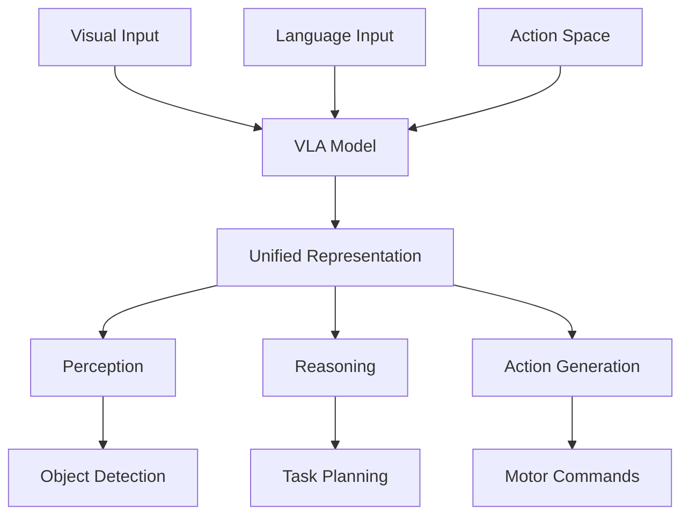

# Introduction to Vision-Language-Action Models

Welcome to Week 12 of Module 4: Vision-Language-Action Systems. In this week, you'll explore **Vision-Language-Action (VLA) Models** - the cutting-edge AI systems that integrate perception, reasoning, and action in unified architectures. VLA models represent the next generation of embodied AI for robotics.

## What are Vision-Language-Action Models?

**Vision-Language-Action (VLA) Models** are multimodal neural networks that jointly process visual input, understand natural language commands, and generate appropriate robot actions. Unlike traditional systems that treat perception, language understanding, and action generation as separate modules, VLA models learn these capabilities end-to-end.



## Why VLA Models Matter

VLA models address critical challenges in robotics:

| Traditional Approach | VLA Approach |
|---------------------|--------------|
| **Separate Modules** | End-to-end learning |
| **Error Propagation** | Joint optimization |
| **Limited Generalization** | Cross-modal understanding |
| **Manual Integration** | Learned integration |
| **Modular Design** | Holistic reasoning |

### Key Benefits

1. **Embodied Learning**: Models learn from real robot interactions
2. **Cross-Modal Understanding**: Vision and language inform each other
3. **Generalization**: Transfer to novel tasks and environments
4. **Adaptability**: Learn from demonstrations and corrections
5. **Efficiency**: Reduced computational overhead compared to pipelines

## VLA Model Architectures

### 1. Transformer-Based Architectures

Most modern VLA models use transformer architectures adapted for multimodal inputs:

```python
#!/usr/bin/env python3
"""
VLA Model Architecture Example
"""
import torch
import torch.nn as nn
import torch.nn.functional as F
from transformers import CLIPVisionModel, CLIPTextModel, CLIPProcessor
from typing import Dict, Any, Optional

class VLATransformer(nn.Module):
    def __init__(self, vision_model, text_model, action_space_dim, hidden_dim=512):
        super().__init__()

        # Vision encoder (e.g., CLIP visual encoder)
        self.vision_encoder = vision_model

        # Text encoder (e.g., CLIP text encoder)
        self.text_encoder = text_model

        # Cross-modal attention layers
        self.cross_attention = nn.MultiheadAttention(
            embed_dim=hidden_dim,
            num_heads=8,
            dropout=0.1
        )

        # Action generation head
        self.action_head = nn.Sequential(
            nn.Linear(hidden_dim, hidden_dim),
            nn.ReLU(),
            nn.Dropout(0.1),
            nn.Linear(hidden_dim, action_space_dim)
        )

        # Action parameter head (for continuous actions)
        self.param_head = nn.Sequential(
            nn.Linear(hidden_dim, hidden_dim),
            nn.ReLU(),
            nn.Dropout(0.1),
            nn.Linear(hidden_dim, action_space_dim)  # Parameters for each action
        )

        # Confidence estimation
        self.confidence_head = nn.Sequential(
            nn.Linear(hidden_dim, hidden_dim // 2),
            nn.ReLU(),
            nn.Linear(hidden_dim // 2, 1),
            nn.Sigmoid()
        )

    def forward(self, images, text_queries, attention_mask=None):
        """
        Forward pass through VLA model

        Args:
            images: Batch of image tensors (B, C, H, W)
            text_queries: Batch of text tokens (B, T)
            attention_mask: Attention mask for text (B, T)

        Returns:
            Dictionary with action predictions and confidence
        """
        # Encode visual features
        vision_features = self.vision_encoder(images).last_hidden_state
        vision_features = vision_features.mean(dim=1)  # Global average pooling

        # Encode text features
        text_features = self.text_encoder(
            input_ids=text_queries,
            attention_mask=attention_mask
        ).last_hidden_state
        text_features = text_features.mean(dim=1)  # Global average pooling

        # Cross-modal attention
        attended_features, attention_weights = self.cross_attention(
            query=text_features.unsqueeze(0),
            key=vision_features.unsqueeze(0),
            value=vision_features.unsqueeze(0)
        )

        attended_features = attended_features.squeeze(0)

        # Generate action predictions
        action_logits = self.action_head(attended_features)
        action_params = self.param_head(attended_features)
        confidence = self.confidence_head(attended_features)

        return {
            'action_logits': action_logits,
            'action_parameters': action_params,
            'confidence': confidence,
            'attention_weights': attention_weights
        }

class VLAInferenceNode:
    def __init__(self, model_path: str, device: str = 'cuda'):
        self.device = torch.device(device if torch.cuda.is_available() else 'cpu')

        # Load pre-trained models
        self.clip_vision = CLIPVisionModel.from_pretrained("openai/clip-vit-base-patch32")
        self.clip_text = CLIPTextModel.from_pretrained("openai/clip-vit-base-patch32")

        # Initialize VLA model
        self.model = VLATransformer(
            vision_model=self.clip_vision,
            text_model=self.clip_text,
            action_space_dim=7  # Example: 3D position + 3D orientation + gripper
        )

        # Load trained weights
        self.model.load_state_dict(torch.load(model_path))
        self.model.to(self.device)
        self.model.eval()

        # Initialize CLIP processor
        self.processor = CLIPProcessor.from_pretrained("openai/clip-vit-base-patch32")

    def process_command(self, image: torch.Tensor, command: str) -> Dict[str, Any]:
        """
        Process visual input and natural language command

        Args:
            image: Input image tensor
            command: Natural language command

        Returns:
            Action prediction with confidence
        """
        # Preprocess inputs
        inputs = self.processor(
            text=[command],
            images=image,
            return_tensors="pt",
            padding=True
        )

        inputs = {k: v.to(self.device) for k, v in inputs.items()}

        with torch.no_grad():
            outputs = self.model(
                images=inputs['pixel_values'],
                text_queries=inputs['input_ids'],
                attention_mask=inputs.get('attention_mask')
            )

        return outputs

def main():
    # Example usage
    vla_node = VLAInferenceNode("path/to/pretrained/vla/model.pth")

    # Example inference
    dummy_image = torch.randn(1, 3, 224, 224)  # Batch of 1, 3 channels, 224x224
    command = "Pick up the red cup from the table"

    result = vla_node.process_command(dummy_image, command)

    print(f"Action logits: {result['action_logits']}")
    print(f"Confidence: {result['confidence']}")

if __name__ == "__main__":
    main()
```

### 2. Diffusion-Based Action Generation

Some VLA models use diffusion processes for action generation:

```python
#!/usr/bin/env python3
"""
Diffusion-Based VLA Model
"""
import torch
import torch.nn as nn
import numpy as np

class DiffusionActionGenerator(nn.Module):
    def __init__(self, input_dim, action_dim, time_emb_dim=128):
        super().__init__()

        # Time embedding
        self.time_mlp = nn.Sequential(
            nn.Linear(time_emb_dim, time_emb_dim * 4),
            nn.SiLU(),
            nn.Linear(time_emb_dim * 4, time_emb_dim)
        )

        # Visual-text conditioning
        self.condition_encoder = nn.Sequential(
            nn.Linear(input_dim, 512),
            nn.SiLU(),
            nn.Linear(512, 512)
        )

        # Diffusion backbone
        self.diffusion_backbone = nn.Sequential(
            nn.Linear(512 + time_emb_dim, 512),
            nn.SiLU(),
            nn.Linear(512, 512),
            nn.SiLU(),
            nn.Linear(512, action_dim)
        )

        # Sinusoidal time embedding
        self.time_embedding = nn.Embedding(1000, time_emb_dim)

    def forward(self, x, t, condition):
        """
        Diffusion forward pass

        Args:
            x: Action noise
            t: Timestep
            condition: Visual-text conditioning
        """
        # Embed timestep
        t_emb = self.time_embedding(t)
        t_emb = self.time_mlp(t_emb)

        # Encode condition
        cond_emb = self.condition_encoder(condition)

        # Combine embeddings
        combined = torch.cat([cond_emb, t_emb], dim=-1)

        # Generate action
        action = self.diffusion_backbone(combined)

        return action

class VLADiffusionModel(nn.Module):
    def __init__(self, vision_dim=512, text_dim=512, action_dim=7):
        super().__init__()

        # Vision and text encoders
        self.vision_encoder = nn.Linear(vision_dim, 256)
        self.text_encoder = nn.Linear(text_dim, 256)

        # Combined embedding
        self.combined_encoder = nn.Linear(512, 512)

        # Diffusion action generator
        self.action_generator = DiffusionActionGenerator(512, action_dim)

        # Variance schedule for diffusion
        self.register_buffer('betas', self.get_variance_schedule())
        self.alphas = 1.0 - self.betas
        self.alphas_cumprod = torch.cumprod(self.alphas, dim=0)

    def get_variance_schedule(self):
        """Get beta schedule for diffusion"""
        return torch.linspace(0.0001, 0.02, 1000)  # Linear schedule

    def forward(self, images, texts, actions=None, num_steps=1000):
        """
        Forward pass for VLA diffusion model

        Args:
            images: Visual features
            texts: Text features
            actions: Ground truth actions (for training)
            num_steps: Number of diffusion steps
        """
        # Encode visual and textual inputs
        vision_features = self.vision_encoder(images)
        text_features = self.text_encoder(texts)

        # Combine features
        combined_features = torch.cat([vision_features, text_features], dim=-1)
        combined_features = self.combined_encoder(combined_features)

        if self.training and actions is not None:
            # Training: Add noise and compute loss
            noise = torch.randn_like(actions)
            timesteps = torch.randint(0, num_steps, (actions.size(0),), device=actions.device)

            noisy_actions = self.add_noise(actions, noise, timesteps)
            predicted_noise = self.action_generator(noisy_actions, timesteps, combined_features)

            loss = F.mse_loss(predicted_noise, noise)
            return {'loss': loss}
        else:
            # Inference: Sample actions using reverse diffusion
            batch_size = images.size(0)
            action_dim = self.action_generator.action_space_dim

            # Start with random noise
            x = torch.randn(batch_size, action_dim, device=images.device)

            # Reverse diffusion process
            for i in reversed(range(num_steps)):
                t = torch.full((batch_size,), i, device=images.device, dtype=torch.long)
                noise_pred = self.action_generator(x, t, combined_features)

                # Apply reverse diffusion step
                x = self.reverse_diffusion_step(x, noise_pred, t)

            return {'predicted_actions': x}

    def add_noise(self, original, noise, timesteps):
        """Add noise to original sample"""
        sqrt_alpha_prod = self.alphas_cumprod[timesteps] ** 0.5
        sqrt_one_minus_alpha_prod = (1 - self.alphas_cumprod[timesteps]) ** 0.5

        return sqrt_alpha_prod * original + sqrt_one_minus_alpha_prod * noise

    def reverse_diffusion_step(self, x, noise_pred, t):
        """Single step of reverse diffusion"""
        # Simplified reverse step - in practice, use proper DDPM/DDIM formulas
        alpha_t = self.alphas[t]
        alpha_bar_t = self.alphas_cumprod[t]

        # Calculate mean and variance for reverse process
        mean = (x - (1 - alpha_t) / (1 - alpha_bar_t) ** 0.5 * noise_pred) / alpha_t ** 0.5
        variance = (1 - alpha_t) * (1 - self.alphas_cumprod[t-1 if t > 0 else 0]) / (1 - self.alphas_cumprod[t])

        # Add noise (except for last step)
        if t[0] > 0:
            noise = torch.randn_like(x)
            x = mean + variance ** 0.5 * noise
        else:
            x = mean

        return x
```

## VLA Training Paradigms

### 1. Behavioral Cloning

Learning from human demonstrations:

```python
#!/usr/bin/env python3
"""
VLA Behavioral Cloning Training
"""
import torch
import torch.nn as nn
import numpy as np
from torch.utils.data import Dataset, DataLoader

class VLADataSet(Dataset):
    def __init__(self, demonstrations):
        """
        VLA demonstration dataset

        Args:
            demonstrations: List of (image, command, action) tuples
        """
        self.demonstrations = demonstrations

    def __len__(self):
        return len(self.demonstrations)

    def __getitem__(self, idx):
        image, command, action = self.demonstrations[idx]
        return {
            'image': image,
            'command': command,
            'action': action
        }

def behavioral_cloning_train(model, dataloader, optimizer, num_epochs=10):
    """Train VLA model using behavioral cloning"""
    model.train()

    for epoch in range(num_epochs):
        total_loss = 0
        for batch in dataloader:
            images = batch['image']
            commands = batch['command']
            actions = batch['action']

            optimizer.zero_grad()

            # Forward pass
            outputs = model(images, commands)
            predicted_actions = outputs['action_parameters']

            # Compute loss (MSE for continuous actions)
            loss = nn.MSELoss()(predicted_actions, actions)

            # Backward pass
            loss.backward()
            optimizer.step()

            total_loss += loss.item()

        avg_loss = total_loss / len(dataloader)
        print(f"Epoch {epoch+1}/{num_epochs}, Loss: {avg_loss:.4f}")

def main():
    # Initialize model
    model = VLATransformer(...)
    optimizer = torch.optim.Adam(model.parameters(), lr=1e-4)

    # Load dataset
    dataset = VLADataSet(load_demonstrations())
    dataloader = DataLoader(dataset, batch_size=32, shuffle=True)

    # Train model
    behavioral_cloning_train(model, dataloader, optimizer)

if __name__ == "__main__":
    main()
```

### 2. Reinforcement Learning with Human Feedback (RLHF)

Incorporating human feedback for better alignment:

```python
#!/usr/bin/env python3
"""
VLA RLHF Training
"""
import torch
import torch.nn as nn
import torch.nn.functional as F

class VLAActorCritic(nn.Module):
    def __init__(self, vla_model, action_space_dim):
        super().__init__()

        self.vla_model = vla_model  # Pre-trained VLA model

        # Critic network
        self.critic = nn.Sequential(
            nn.Linear(512, 256),
            nn.ReLU(),
            nn.Linear(256, 1)
        )

    def forward(self, images, commands):
        """Forward pass for actor-critic"""
        # Get action predictions from VLA
        vla_outputs = self.vla_model(images, commands)

        # Get state value from critic
        state_features = self.get_state_representation(vla_outputs)
        value = self.critic(state_features)

        return {
            'action_logits': vla_outputs['action_logits'],
            'action_parameters': vla_outputs['action_parameters'],
            'value': value,
            'confidence': vla_outputs['confidence']
        }

    def get_state_representation(self, vla_outputs):
        """Extract state representation for critic"""
        # Combine action features and confidence
        action_features = vla_outputs['action_parameters']
        confidence = vla_outputs['confidence']

        return torch.cat([action_features, confidence], dim=-1)

def rlhf_training_step(model, batch, human_feedback):
    """Single RLHF training step"""
    images = batch['images']
    commands = batch['commands']
    actions = batch['actions']

    # Forward pass
    outputs = model(images, commands)

    # Compute rewards based on human feedback
    rewards = compute_reward_from_feedback(
        outputs['action_parameters'],
        human_feedback
    )

    # Actor loss (policy gradient)
    action_probs = F.softmax(outputs['action_logits'], dim=-1)
    log_probs = torch.log(action_probs + 1e-8)
    actor_loss = -(log_probs * (rewards - outputs['value'])).mean()

    # Critic loss
    critic_loss = F.mse_loss(outputs['value'].squeeze(), rewards)

    # Total loss
    total_loss = actor_loss + 0.5 * critic_loss

    return total_loss, actor_loss, critic_loss

def compute_reward_from_feedback(predicted_actions, human_feedback):
    """Compute reward from human feedback"""
    # In practice, this would be more sophisticated
    # For example, comparing predicted vs demonstrated actions
    # or using preference rankings from humans

    # Simplified reward computation
    if human_feedback == 'good':
        return torch.ones(predicted_actions.size(0))
    elif human_feedback == 'bad':
        return torch.zeros(predicted_actions.size(0))
    else:
        return torch.full((predicted_actions.size(0),), 0.5)  # Neutral
```

## VLA Model Families

### 1. OpenVLA

OpenVLA is an open-source VLA model family:

```python
#!/usr/bin/env python3
"""
OpenVLA-style Model Implementation
"""
import torch
import torch.nn as nn
from transformers import AutoModel, AutoTokenizer

class OpenVLAModel(nn.Module):
    def __init__(self, vision_model_name, language_model_name, action_space_dim):
        super().__init__()

        # Vision encoder
        self.vision_encoder = AutoModel.from_pretrained(vision_model_name)

        # Language encoder
        self.language_encoder = AutoModel.from_pretrained(language_model_name)

        # Fusion layers
        self.fusion_layers = nn.ModuleList([
            nn.TransformerEncoderLayer(d_model=512, nhead=8)
            for _ in range(6)
        ])

        # Action decoder
        self.action_decoder = nn.Sequential(
            nn.Linear(512, 512),
            nn.ReLU(),
            nn.Dropout(0.1),
            nn.Linear(512, action_space_dim)
        )

        # Confidence predictor
        self.confidence_predictor = nn.Sequential(
            nn.Linear(512, 256),
            nn.ReLU(),
            nn.Linear(256, 1),
            nn.Sigmoid()
        )

    def forward(self, pixel_values, input_ids, attention_mask=None):
        # Encode vision
        vision_features = self.vision_encoder(pixel_values=pixel_values).last_hidden_state

        # Encode language
        language_features = self.language_encoder(
            input_ids=input_ids,
            attention_mask=attention_mask
        ).last_hidden_state

        # Fuse modalities
        combined_features = torch.cat([vision_features, language_features], dim=1)

        for layer in self.fusion_layers:
            combined_features = layer(combined_features)

        # Extract fused representation
        fused_repr = combined_features.mean(dim=1)  # Global average

        # Generate action
        action = self.action_decoder(fused_repr)
        confidence = self.confidence_predictor(fused_repr)

        return {
            'actions': action,
            'confidence': confidence,
            'fused_features': fused_repr
        }
```

### 2. RT-1 (Robotics Transformer 1)

RT-1-style architecture for robot learning:

```python
#!/usr/bin/env python3
"""
RT-1 Style Model Implementation
"""
import torch
import torch.nn as nn

class RT1Transformer(nn.Module):
    def __init__(self, vocab_size, hidden_dim=512, num_layers=6, num_heads=8):
        super().__init__()

        # Token embeddings
        self.token_embedding = nn.Embedding(vocab_size, hidden_dim)
        self.position_embedding = nn.Embedding(1024, hidden_dim)  # Max sequence length

        # Vision processing
        self.vision_projection = nn.Linear(768, hidden_dim)  # CLIP visual features

        # Transformer layers
        self.transformer_layers = nn.ModuleList([
            nn.TransformerEncoderLayer(
                d_model=hidden_dim,
                nhead=num_heads,
                dim_feedforward=hidden_dim * 4,
                dropout=0.1,
                batch_first=True
            ) for _ in range(num_layers)
        ])

        # Action token prediction
        self.action_predictor = nn.Linear(hidden_dim, 256)  # Action vocabulary size

        # Reward prediction (for RL)
        self.reward_predictor = nn.Linear(hidden_dim, 1)

    def forward(self, vision_features, language_tokens, timesteps=None):
        """
        Forward pass for RT-1 style model

        Args:
            vision_features: (B, num_patches, 768) from vision encoder
            language_tokens: (B, seq_len) token IDs
            timesteps: (B, seq_len) for temporal conditioning
        """
        B, V_seq_len, _ = vision_features.shape
        B, L_seq_len = language_tokens.shape

        # Project vision features
        vision_embeds = self.vision_projection(vision_features)

        # Embed language tokens
        language_embeds = self.token_embedding(language_tokens)

        # Add position embeddings
        lang_positions = torch.arange(L_seq_len, device=language_tokens.device)
        lang_pos_embeds = self.position_embedding(lang_positions)
        language_embeds = language_embeds + lang_pos_embeds

        # Combine modalities
        combined_embeds = torch.cat([vision_embeds, language_embeds], dim=1)

        # Apply transformer
        for layer in self.transformer_layers:
            combined_embeds = layer(combined_embeds)

        # Extract action predictions (from the end of sequence)
        action_embeds = combined_embeds[:, -L_seq_len:, :]  # Language portion
        action_logits = self.action_predictor(action_embeds)

        # Predict reward
        pooled_features = combined_embeds.mean(dim=1)  # Global average
        reward_pred = self.reward_predictor(pooled_features)

        return {
            'action_logits': action_logits,
            'reward_prediction': reward_pred,
            'combined_features': combined_embeds
        }
```

## Practical Implementation Considerations

### 1. Real-time Performance

```python
#!/usr/bin/env python3
"""
Real-time VLA Optimization
"""
import torch
import torch_tensorrt
import time

class OptimizedVLANode:
    def __init__(self, model_path):
        self.device = torch.device('cuda' if torch.cuda.is_available() else 'cpu')

        # Load model
        self.model = torch.load(model_path).to(self.device)
        self.model.eval()

        # Optimize model
        self.optimized_model = self.optimize_model()

        # Warm up model
        self.warmup_model()

    def optimize_model(self):
        """Optimize model for inference"""
        # Example optimizations:

        # 1. TensorRT optimization (if available)
        if torch_tensorrt:
            optimized_model = torch_tensorrt.compile(
                self.model,
                inputs=[
                    torch_tensorrt.Input(shape=[1, 3, 224, 224]),  # Image
                    torch_tensorrt.Input(shape=[1, 64])           # Text tokens
                ],
                enabled_precisions={torch.float16}  # Use FP16 for speed
            )
            return optimized_model

        # 2. TorchScript optimization
        with torch.no_grad():
            example_inputs = (
                torch.randn(1, 3, 224, 224).to(self.device),
                torch.randint(0, 1000, (1, 64)).to(self.device)
            )
            traced_model = torch.jit.trace(self.model, example_inputs)
            optimized_model = torch.jit.optimize_for_inference(traced_model)
            return optimized_model

    def warmup_model(self):
        """Warm up model to reduce first-inference latency"""
        dummy_image = torch.randn(1, 3, 224, 224).to(self.device)
        dummy_text = torch.randint(0, 1000, (1, 64)).to(self.device)

        with torch.no_grad():
            for _ in range(5):  # Warm up 5 times
                _ = self.optimized_model(dummy_image, dummy_text)

    def process_inference(self, image, text_tokens, timeout=0.1):
        """Process inference with timing constraints"""
        start_time = time.time()

        with torch.no_grad():
            result = self.optimized_model(image, text_tokens)

        inference_time = time.time() - start_time

        if inference_time > timeout:
            print(f"Warning: Inference took {inference_time:.3f}s, exceeded timeout {timeout}s")

        return result
```

### 2. Memory Management

```python
#!/usr/bin/env python3
"""
VLA Memory Management
"""
import torch
import gc

class VLAMemoryManager:
    def __init__(self):
        self.max_cache_size = 100  # Maximum cached examples
        self.example_cache = []
        self.device = torch.device('cuda' if torch.cuda.is_available() else 'cpu')

    def cache_example(self, image, command, action):
        """Cache example for potential reuse"""
        if len(self.example_cache) >= self.max_cache_size:
            self.example_cache.pop(0)  # Remove oldest

        cached_item = {
            'image': image.cpu(),  # Move to CPU to save GPU memory
            'command': command,
            'action': action,
            'timestamp': time.time()
        }
        self.example_cache.append(cached_item)

    def clear_cache(self):
        """Clear example cache"""
        self.example_cache.clear()
        gc.collect()
        if self.device.type == 'cuda':
            torch.cuda.empty_cache()

    def get_similar_examples(self, query_image, query_command, threshold=0.8):
        """Retrieve similar cached examples"""
        similar_examples = []

        for cached in self.example_cache:
            # Simple similarity check (in practice, use embedding similarity)
            if self.compute_similarity(query_command, cached['command']) > threshold:
                similar_examples.append(cached)

        return similar_examples

    def compute_similarity(self, cmd1, cmd2):
        """Compute similarity between commands"""
        # Simplified similarity - in practice, use embedding-based similarity
        return 1.0 if cmd1 == cmd2 else 0.0
```

## Integration with ROS 2

### VLA Node Implementation

```python
#!/usr/bin/env python3
"""
VLA ROS 2 Node
"""
import rclpy
from rclpy.node import Node
from sensor_msgs.msg import Image
from std_msgs.msg import String
from geometry_msgs.msg import Twist
from vision_msgs.msg import Detection2DArray
from cv_bridge import CvBridge
import torch
import numpy as np

class VLANode(Node):
    def __init__(self):
        super().__init__('vla_node')

        # Create subscribers
        self.image_sub = self.create_subscription(
            Image, '/camera/image_raw', self.image_callback, 10)
        self.command_sub = self.create_subscription(
            String, '/natural_language_command', self.command_callback, 10)

        # Create publishers
        self.action_pub = self.create_publisher(Twist, '/vla_action', 10)
        self.confidence_pub = self.create_publisher(Float32, '/vla_confidence', 10)

        # Initialize CV bridge
        self.bridge = CvBridge()

        # Load VLA model
        self.model = self.load_vla_model()
        self.model.eval()

        # Store latest image and command
        self.latest_image = None
        self.pending_command = None

        # Processing lock
        self.processing_lock = threading.Lock()

        self.get_logger().info('VLA node initialized')

    def load_vla_model(self):
        """Load pre-trained VLA model"""
        try:
            # In practice, load actual VLA model
            # For this example, we'll use a dummy model
            model = torch.load('path/to/vla_model.pth')
            return model
        except Exception as e:
            self.get_logger().error(f'Failed to load VLA model: {e}')
            # Return a simple placeholder model
            return torch.nn.Linear(1000, 6)  # 6 DoF action space

    def image_callback(self, msg):
        """Process camera image"""
        try:
            cv_image = self.bridge.imgmsg_to_cv2(msg, 'bgr8')

            # Preprocess image
            processed_image = self.preprocess_image(cv_image)

            with self.processing_lock:
                self.latest_image = processed_image

                # If we have a pending command, process both together
                if self.pending_command is not None:
                    self.process_vla_inference(processed_image, self.pending_command)
                    self.pending_command = None

        except Exception as e:
            self.get_logger().error(f'Error processing image: {e}')

    def command_callback(self, msg):
        """Process natural language command"""
        command = msg.data

        with self.processing_lock:
            if self.latest_image is not None:
                # Process immediately with latest image
                self.process_vla_inference(self.latest_image, command)
            else:
                # Store for later processing when image arrives
                self.pending_command = command

    def process_vla_inference(self, image, command):
        """Process VLA inference with image and command"""
        try:
            # Preprocess inputs
            image_tensor = torch.from_numpy(image).unsqueeze(0).float()
            command_tokens = self.tokenize_command(command)
            command_tensor = torch.tensor(command_tokens).unsqueeze(0)

            # Run inference
            with torch.no_grad():
                start_time = time.time()
                outputs = self.model(image_tensor, command_tensor)
                inference_time = time.time() - start_time

            # Extract action and confidence
            action = outputs.get('actions', outputs)
            confidence = outputs.get('confidence', torch.tensor([[0.5]]))

            # Convert to ROS message
            action_msg = self.convert_action_to_ros(action)
            confidence_msg = Float32()
            confidence_msg.data = confidence.item()

            # Publish results
            self.action_pub.publish(action_msg)
            self.confidence_pub.publish(confidence_msg)

            self.get_logger().info(
                f'VLA inference completed in {inference_time:.3f}s, '
                f'action: {action[:3]}, confidence: {confidence_msg.data:.3f}'
            )

        except Exception as e:
            self.get_logger().error(f'Error in VLA inference: {e}')

    def preprocess_image(self, cv_image):
        """Preprocess image for VLA model"""
        # Resize image
        resized = cv2.resize(cv_image, (224, 224))

        # Normalize
        normalized = resized.astype(np.float32) / 255.0

        # Convert to CHW format
        chw_image = np.transpose(normalized, (2, 0, 1))

        return chw_image

    def tokenize_command(self, command):
        """Tokenize natural language command"""
        # In practice, use proper tokenizer
        # For this example, use simple word-to-id mapping
        tokens = command.lower().split()
        token_ids = [hash(token) % 1000 for token in tokens]  # Simplified hashing
        return token_ids[:64]  # Limit to 64 tokens

    def convert_action_to_ros(self, action_tensor):
        """Convert action tensor to ROS message"""
        action = action_tensor.cpu().numpy().squeeze()

        twist_msg = Twist()
        twist_msg.linear.x = float(action[0]) if len(action) > 0 else 0.0
        twist_msg.linear.y = float(action[1]) if len(action) > 1 else 0.0
        twist_msg.linear.z = float(action[2]) if len(action) > 2 else 0.0
        twist_msg.angular.x = float(action[3]) if len(action) > 3 else 0.0
        twist_msg.angular.y = float(action[4]) if len(action) > 4 else 0.0
        twist_msg.angular.z = float(action[5]) if len(action) > 5 else 0.0

        return twist_msg

def main(args=None):
    rclpy.init(args=args)
    node = VLANode()

    try:
        rclpy.spin(node)
    except KeyboardInterrupt:
        pass
    finally:
        node.destroy_node()
        rclpy.shutdown()

if __name__ == '__main__':
    main()
```

## Quality Assurance and Evaluation

### VLA Model Evaluation

```python
#!/usr/bin/env python3
"""
VLA Model Evaluation
"""
import torch
import numpy as np
from sklearn.metrics import accuracy_score, precision_score, recall_score

class VLAEvaluator:
    def __init__(self, model, test_dataset):
        self.model = model
        self.test_dataset = test_dataset

    def evaluate_model(self):
        """Evaluate VLA model performance"""
        self.model.eval()

        total_accuracy = 0
        total_success_rate = 0
        total_confidence = 0
        num_samples = 0

        with torch.no_grad():
            for batch in self.test_dataset:
                images = batch['images']
                commands = batch['commands']
                ground_truth_actions = batch['actions']

                outputs = self.model(images, commands)
                predicted_actions = outputs['action_parameters']
                confidence = outputs['confidence']

                # Calculate accuracy metrics
                accuracy = self.calculate_action_accuracy(
                    predicted_actions, ground_truth_actions
                )

                # Calculate success rate (whether action achieved goal)
                success_rate = self.calculate_success_rate(
                    predicted_actions, batch['goals']
                )

                total_accuracy += accuracy
                total_success_rate += success_rate
                total_confidence += confidence.mean().item()
                num_samples += 1

        avg_accuracy = total_accuracy / num_samples
        avg_success_rate = total_success_rate / num_samples
        avg_confidence = total_confidence / num_samples

        evaluation_results = {
            'accuracy': avg_accuracy,
            'success_rate': avg_success_rate,
            'confidence': avg_confidence,
            'num_evaluated': num_samples
        }

        return evaluation_results

    def calculate_action_accuracy(self, predicted, ground_truth, threshold=0.1):
        """Calculate action prediction accuracy"""
        # For continuous actions, use distance-based accuracy
        distances = torch.norm(predicted - ground_truth, dim=-1)
        accurate_predictions = (distances < threshold).float()
        accuracy = accurate_predictions.mean().item()
        return accuracy

    def calculate_success_rate(self, actions, goals):
        """Calculate task success rate"""
        # In practice, this would run actions in simulator/environment
        # and measure whether goals were achieved
        # For this example, return a placeholder
        return 0.7  # 70% success rate

def main():
    # Load model and test dataset
    model = torch.load('vla_model.pth')
    test_dataset = load_test_dataset()  # Implementation-dependent

    # Evaluate model
    evaluator = VLAEvaluator(model, test_dataset)
    results = evaluator.evaluate_model()

    print(f"Evaluation Results:")
    print(f"  Accuracy: {results['accuracy']:.3f}")
    print(f"  Success Rate: {results['success_rate']:.3f}")
    print(f"  Confidence: {results['confidence']:.3f}")
    print(f"  Samples: {results['num_evaluated']}")

if __name__ == "__main__":
    main()
```

## Best Practices

### 1. Model Architecture Best Practices

```python
# Good: Well-designed VLA architecture
def good_vla_architecture():
    """Best practices for VLA model design"""
    # Use appropriate fusion mechanisms
    # Implement proper attention mechanisms
    # Include uncertainty estimation
    # Use efficient architectures for real-time
    # Implement proper regularization
    pass

# Bad: Poor architecture choices
def bad_vla_architecture():
    """Poor practices in VLA model design"""
    # No cross-modal attention
    # No uncertainty estimation
    # Too complex for deployment
    # No regularization
    # Inefficient attention mechanisms
    pass
```

### 2. Training Best Practices

```python
# Good: Proper training methodology
def good_vla_training():
    """Best practices for VLA training"""
    # Use diverse, representative data
    # Implement proper data augmentation
    # Use appropriate loss functions
    # Monitor training metrics
    # Implement validation procedures
    pass

# Bad: Poor training practices
def bad_vla_training():
    """Poor practices in VLA training"""
    # Biased or unrepresentative data
    # No data augmentation
    # Wrong loss functions
    # No validation
    # No monitoring
    pass
```

### 3. Deployment Best Practices

```python
# Good: Proper deployment
def good_vla_deployment():
    """Best practices for VLA deployment"""
    # Model optimization for inference
    # Proper error handling
    # Performance monitoring
    # Safety checks
    # Gradual rollout
    pass

# Bad: Poor deployment practices
def bad_vla_deployment():
    """Poor practices in VLA deployment"""
    # No optimization
    # No error handling
    # No monitoring
    # No safety checks
    # Immediate full deployment
    pass
```

## Common Issues and Troubleshooting

### 1. Performance Issues

```bash
# Monitor GPU utilization
nvidia-smi

# Check model inference time
ros2 topic hz /vla_action

# Monitor memory usage
htop
```

### 2. Quality Issues

```python
# Validate VLA outputs
def validate_vla_outputs(outputs):
    """Validate VLA model outputs"""
    # Check for NaN values
    # Validate action ranges
    # Check confidence scores
    # Verify output format
    pass
```

### 3. Training Issues

```python
# Monitor training stability
def monitor_training():
    """Monitor VLA training"""
    # Track loss curves
    # Check for overfitting
    # Monitor gradient norms
    # Validate on held-out data
    pass
```

## Next Steps

Now that you understand Vision-Language-Action models, continue to [Exercise: Deploying VLA Models](../week-12/exercise-vla-deployment) to learn how to deploy these models on real robotic systems.

## Exercises

1. Implement a VLA model for a specific robot task
2. Create a dataset for training VLA models
3. Fine-tune a pre-trained VLA model on your robot data
4. Evaluate VLA model performance in simulation and real-world