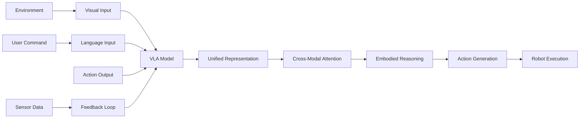

# VLA Model Architecture and Design

Vision-Language-Action (VLA) models represent a paradigm shift in robotics, moving from separate perception, planning, and control modules to unified systems that learn cross-modal relationships end-to-end. This section explores the architectural patterns, design principles, and implementation strategies for building effective VLA models.

## VLA Architecture Fundamentals

### The VLA Triad

VLA models integrate three core modalities:



### Key Architectural Components

1. **Encoder Networks**: Process individual modalities
2. **Cross-Modal Fusion**: Combine information across modalities
3. **Reasoning Module**: Perform high-level planning and decision making
4. **Action Decoder**: Generate specific robot actions
5. **Memory System**: Store and retrieve past experiences

## Encoder Architectures

### Vision Encoder

The vision encoder processes visual input to extract spatial and semantic features:

```python
#!/usr/bin/env python3
"""
Vision Encoder for VLA Models
"""
import torch
import torch.nn as nn
import torchvision.models as models
from transformers import CLIPVisionModel, CLIPProcessor
import numpy as np

class VisionEncoder(nn.Module):
    def __init__(self, backbone='clip_vision', freeze_backbone=True):
        super().__init__()

        if backbone == 'clip_vision':
            self.encoder = CLIPVisionModel.from_pretrained("openai/clip-vit-base-patch32")
            self.feature_dim = 768  # CLIP base model output
        elif backbone == 'resnet50':
            self.encoder = models.resnet50(pretrained=True)
            self.encoder.fc = nn.Identity()  # Remove classification head
            self.feature_dim = 2048
        elif backbone == 'efficientnet':
            from efficientnet_pytorch import EfficientNet
            self.encoder = EfficientNet.from_pretrained('efficientnet-b0')
            self.encoder._dropout = nn.Identity()
            self.encoder._fc = nn.Identity()
            self.feature_dim = 1280
        else:
            raise ValueError(f"Unknown backbone: {backbone}")

        if freeze_backbone:
            for param in self.encoder.parameters():
                param.requires_grad = False

        # Additional processing layers
        self.projection = nn.Linear(self.feature_dim, 512)
        self.layer_norm = nn.LayerNorm(512)
        self.dropout = nn.Dropout(0.1)

    def forward(self, images):
        """
        Forward pass through vision encoder

        Args:
            images: Batch of image tensors (B, C, H, W)

        Returns:
            Dictionary with encoded features
        """
        if hasattr(self.encoder, 'forward'):  # CLIP model
            outputs = self.encoder(pixel_values=images)
            features = outputs.last_hidden_state  # (B, num_patches, feature_dim)
        else:  # ResNet/EfficientNet
            features = self.encoder(images)  # (B, feature_dim)
            features = features.unsqueeze(1)  # Add sequence dimension

        # Project features to common space
        projected = self.projection(features)
        normalized = self.layer_norm(projected)
        output = self.dropout(normalized)

        return {
            'features': output,  # (B, seq_len, 512)
            'global_features': output.mean(dim=1),  # (B, 512)
            'patch_features': output  # (B, num_patches, 512)
        }

class MultiViewVisionEncoder(nn.Module):
    """Vision encoder for multi-view inputs"""
    def __init__(self, num_views=4, feature_dim=512):
        super().__init__()

        # Shared encoder for all views
        self.shared_encoder = VisionEncoder()

        # View-specific processing
        self.view_processors = nn.ModuleList([
            nn.Sequential(
                nn.Linear(feature_dim, feature_dim),
                nn.ReLU(),
                nn.Linear(feature_dim, feature_dim)
            ) for _ in range(num_views)
        ])

        # View fusion
        self.view_fusion = nn.MultiheadAttention(
            embed_dim=feature_dim,
            num_heads=8,
            dropout=0.1
        )

        self.feature_dim = feature_dim

    def forward(self, multi_view_images):
        """
        Process multi-view images

        Args:
            multi_view_images: List of image tensors [(B, C, H, W), ...]

        Returns:
            Fused multi-view features
        """
        view_features = []

        for i, view_img in enumerate(multi_view_images):
            # Encode each view
            encoded = self.shared_encoder(view_img)
            processed = self.view_processors[i](encoded['global_features'])
            view_features.append(processed.unsqueeze(1))  # Add sequence dim

        # Stack view features
        stacked_features = torch.cat(view_features, dim=1)  # (B, num_views, feature_dim)

        # Apply cross-view attention to fuse information
        fused_features, attention_weights = self.view_fusion(
            query=stacked_features,
            key=stacked_features,
            value=stacked_features
        )

        return {
            'fused_features': fused_features.mean(dim=1),  # (B, feature_dim)
            'view_features': stacked_features,  # (B, num_views, feature_dim)
            'attention_weights': attention_weights
        }
```

### Language Encoder

The language encoder processes natural language commands:

```python
#!/usr/bin/env python3
"""
Language Encoder for VLA Models
"""
import torch
import torch.nn as nn
from transformers import AutoTokenizer, AutoModel, BertModel, RobertaModel
import numpy as np

class LanguageEncoder(nn.Module):
    def __init__(self, model_name='bert-base-uncased', freeze_backbone=True):
        super().__init__()

        # Initialize tokenizer
        self.tokenizer = AutoTokenizer.from_pretrained(model_name)

        # Initialize language model
        if 'bert' in model_name:
            self.encoder = BertModel.from_pretrained(model_name)
        elif 'roberta' in model_name:
            self.encoder = RobertaModel.from_pretrained(model_name)
        else:
            self.encoder = AutoModel.from_pretrained(model_name)

        if freeze_backbone:
            for param in self.encoder.parameters():
                param.requires_grad = False

        # Get model config
        self.hidden_size = self.encoder.config.hidden_size

        # Projection to common space
        self.projection = nn.Linear(self.hidden_size, 512)
        self.layer_norm = nn.LayerNorm(512)
        self.dropout = nn.Dropout(0.1)

    def forward(self, text_inputs, attention_mask=None):
        """
        Forward pass through language encoder

        Args:
            text_inputs: Tokenized text (B, seq_len)
            attention_mask: Attention mask (B, seq_len)

        Returns:
            Dictionary with encoded text features
        """
        outputs = self.encoder(
            input_ids=text_inputs,
            attention_mask=attention_mask
        )

        # Use [CLS] token representation for the entire sentence
        sentence_features = outputs.last_hidden_state[:, 0, :]  # [CLS] token

        # Use all token representations for sequence modeling
        token_features = outputs.last_hidden_state

        # Project to common space
        projected_sentence = self.projection(sentence_features)
        projected_tokens = self.projection(token_features)

        # Apply normalization and dropout
        normalized_sentence = self.layer_norm(projected_sentence)
        normalized_tokens = self.layer_norm(projected_tokens)
        output_sentence = self.dropout(normalized_sentence)
        output_tokens = self.dropout(normalized_tokens)

        return {
            'sentence_features': output_sentence,  # (B, 512)
            'token_features': output_tokens,      # (B, seq_len, 512)
            'attention_mask': attention_mask
        }

    def tokenize_commands(self, commands, max_length=64):
        """Tokenize natural language commands"""
        tokenized = self.tokenizer(
            commands,
            padding=True,
            truncation=True,
            max_length=max_length,
            return_tensors='pt'
        )
        return tokenized

class HierarchicalLanguageEncoder(nn.Module):
    """Language encoder with hierarchical processing"""
    def __init__(self, model_name='bert-base-uncased'):
        super().__init__()

        self.word_encoder = LanguageEncoder(model_name)
        self.sentence_encoder = nn.TransformerEncoder(
            nn.TransformerEncoderLayer(d_model=512, nhead=8),
            num_layers=2
        )
        self.paragraph_encoder = nn.TransformerEncoder(
            nn.TransformerEncoderLayer(d_model=512, nhead=8),
            num_layers=2
        )

    def forward(self, commands):
        """
        Hierarchical encoding of commands

        Args:
            commands: List of command strings or tokenized commands

        Returns:
            Hierarchically encoded features
        """
        # Tokenize commands
        if isinstance(commands[0], str):
            tokenized = self.word_encoder.tokenize_commands(commands)
            input_ids = tokenized['input_ids']
            attention_mask = tokenized['attention_mask']
        else:
            input_ids = commands
            attention_mask = torch.ones_like(input_ids)

        # Word-level encoding
        word_features = self.word_encoder(input_ids, attention_mask)

        # Sentence-level encoding (using transformer on token features)
        sentence_encoded = self.sentence_encoder(word_features['token_features'])

        # Paragraph-level encoding (if multiple sentences)
        paragraph_encoded = self.paragraph_encoder(sentence_encoded)

        return {
            'word_features': word_features['token_features'],
            'sentence_features': sentence_encoded,
            'paragraph_features': paragraph_encoded,
            'global_features': paragraph_encoded.mean(dim=1)
        }
```

### Action Encoder/Decoder

The action encoder processes and generates robot actions:

```python
#!/usr/bin/env python3
"""
Action Encoder/Decoder for VLA Models
"""
import torch
import torch.nn as nn
import numpy as np

class ActionEncoder(nn.Module):
    def __init__(self, action_space_dim, hidden_dim=512):
        super().__init__()

        # Action embedding layers
        self.position_encoder = nn.Linear(3, hidden_dim // 4)  # x, y, z
        self.orientation_encoder = nn.Linear(4, hidden_dim // 4)  # quaternion
        self.velocity_encoder = nn.Linear(6, hidden_dim // 4)  # linear + angular vel
        self.gripper_encoder = nn.Linear(1, hidden_dim // 4)  # gripper state

        # Combine all action components
        self.action_combiner = nn.Sequential(
            nn.Linear(hidden_dim, hidden_dim),
            nn.ReLU(),
            nn.Linear(hidden_dim, hidden_dim),
            nn.LayerNorm(hidden_dim)
        )

    def forward(self, actions):
        """
        Encode robot actions

        Args:
            actions: Dictionary containing action components
                   {'position': (B, 3), 'orientation': (B, 4), 'velocity': (B, 6), 'gripper': (B, 1)}

        Returns:
            Encoded action features
        """
        position_features = self.position_encoder(actions['position'])
        orientation_features = self.orientation_encoder(actions['orientation'])
        velocity_features = self.velocity_encoder(actions['velocity'])
        gripper_features = self.gripper_encoder(actions['gripper'])

        # Combine all features
        combined = torch.cat([
            position_features,
            orientation_features,
            velocity_features,
            gripper_features
        ], dim=-1)

        # Process combined features
        output = self.action_combiner(combined)

        return output

class ActionDecoder(nn.Module):
    def __init__(self, hidden_dim=512, action_space_dim=14):
        super().__init__()

        self.action_space_dim = action_space_dim

        # Action decoder network
        self.decoder = nn.Sequential(
            nn.Linear(hidden_dim, hidden_dim),
            nn.ReLU(),
            nn.Dropout(0.1),
            nn.Linear(hidden_dim, hidden_dim),
            nn.ReLU(),
            nn.Dropout(0.1),
            nn.Linear(hidden_dim, action_space_dim)
        )

        # Activation functions for different action types
        self.position_activation = nn.Sigmoid()  # For position (0-1 range, then scaled)
        self.orientation_activation = nn.Tanh()  # For orientation (constrain magnitude)
        self.velocity_activation = nn.Tanh()    # For velocity (constrain magnitude)
        self.gripper_activation = nn.Sigmoid()  # For gripper (0-1 range)

    def forward(self, features):
        """
        Decode features to robot actions

        Args:
            features: Encoded features from fusion module (B, hidden_dim)

        Returns:
            Dictionary of decoded action components
        """
        raw_actions = self.decoder(features)

        # Split raw actions into components
        position = raw_actions[:, :3]
        orientation = raw_actions[:, 3:7]
        velocity = raw_actions[:, 7:13]
        gripper = raw_actions[:, 13:14]

        # Apply appropriate activations
        position = self.position_activation(position)
        orientation = self.orientation_activation(orientation)
        velocity = self.velocity_activation(velocity)
        gripper = self.gripper_activation(gripper)

        return {
            'position': position,      # (B, 3) - x, y, z
            'orientation': orientation, # (B, 4) - quaternion
            'velocity': velocity,      # (B, 6) - linear + angular velocity
            'gripper': gripper,        # (B, 1) - gripper state
            'raw_actions': raw_actions  # (B, action_space_dim)
        }

class ContinuousActionDecoder(nn.Module):
    """Specialized decoder for continuous action spaces"""
    def __init__(self, hidden_dim=512, action_dim=7):
        super().__init__()

        self.action_dim = action_dim

        # Separate decoders for different action types
        self.translation_decoder = nn.Sequential(
            nn.Linear(hidden_dim, hidden_dim // 2),
            nn.ReLU(),
            nn.Linear(hidden_dim // 2, 3),  # x, y, z translation
            nn.Tanh()  # Constrain to [-1, 1]
        )

        self.rotation_decoder = nn.Sequential(
            nn.Linear(hidden_dim, hidden_dim // 2),
            nn.ReLU(),
            nn.Linear(hidden_dim // 2, 4),  # quaternion
            nn.Softsign()  # Constrain magnitude
        )

        self.velocity_decoder = nn.Sequential(
            nn.Linear(hidden_dim, hidden_dim // 2),
            nn.ReLU(),
            nn.Linear(hidden_dim // 2, 6),  # 6-DoF velocity
            nn.Tanh()
        )

    def forward(self, features):
        """Decode to continuous robot actions"""
        translations = self.translation_decoder(features) * 0.5  # Scale to reasonable range
        rotations = self.rotation_decoder(features)
        velocities = self.velocity_decoder(features) * 0.2  # Scale to reasonable range

        # Normalize quaternion
        rotations = rotations / (torch.norm(rotations, dim=1, keepdim=True) + 1e-8)

        return {
            'translation': translations,
            'rotation': rotations,
            'velocity': velocities,
            'action_vector': torch.cat([translations, rotations, velocities], dim=1)
        }
```

## Cross-Modal Fusion

### Attention-Based Fusion

```python
#!/usr/bin/env python3
"""
Cross-Modal Fusion Module
"""
import torch
import torch.nn as nn
import math

class CrossModalAttention(nn.Module):
    def __init__(self, feature_dim=512, num_heads=8, dropout=0.1):
        super().__init__()

        self.feature_dim = feature_dim
        self.num_heads = num_heads
        self.head_dim = feature_dim // num_heads
        self.scale = math.sqrt(self.head_dim)

        # Query, key, value projections for each modality
        self.vision_q = nn.Linear(feature_dim, feature_dim)
        self.vision_k = nn.Linear(feature_dim, feature_dim)
        self.vision_v = nn.Linear(feature_dim, feature_dim)

        self.language_q = nn.Linear(feature_dim, feature_dim)
        self.language_k = nn.Linear(feature_dim, feature_dim)
        self.language_v = nn.Linear(feature_dim, feature_dim)

        # Output projection
        self.out_proj = nn.Linear(feature_dim, feature_dim)
        self.dropout = nn.Dropout(dropout)

        # Layer normalization
        self.norm_vision = nn.LayerNorm(feature_dim)
        self.norm_language = nn.LayerNorm(feature_dim)
        self.norm_fused = nn.LayerNorm(feature_dim)

    def forward(self, vision_features, language_features):
        """
        Cross-modal attention between vision and language

        Args:
            vision_features: (B, vision_seq_len, feature_dim)
            language_features: (B, lang_seq_len, feature_dim)

        Returns:
            Fused features incorporating both modalities
        """
        B, V_seq_len, _ = vision_features.shape
        B, L_seq_len, _ = language_features.shape

        # Project vision features
        v_q = self.vision_q(vision_features).view(B, V_seq_len, self.num_heads, self.head_dim).transpose(1, 2)
        v_k = self.vision_k(vision_features).view(B, V_seq_len, self.num_heads, self.head_dim).transpose(1, 2)
        v_v = self.vision_v(vision_features).view(B, V_seq_len, self.num_heads, self.head_dim).transpose(1, 2)

        # Project language features
        l_q = self.language_q(language_features).view(B, L_seq_len, self.num_heads, self.head_dim).transpose(1, 2)
        l_k = self.language_k(language_features).view(B, L_seq_len, self.num_heads, self.head_dim).transpose(1, 2)
        l_v = self.language_v(language_features).view(B, L_seq_len, self.num_heads, self.head_dim).transpose(1, 2)

        # Cross-modal attention: vision attends to language
        v_attn = torch.matmul(
            torch.softmax(torch.matmul(v_q, l_k.transpose(-2, -1)) / self.scale, dim=-1),
            l_v
        ).transpose(1, 2).contiguous().view(B, V_seq_len, self.feature_dim)

        # Cross-modal attention: language attends to vision
        l_attn = torch.matmul(
            torch.softmax(torch.matmul(l_q, v_k.transpose(-2, -1)) / self.scale, dim=-1),
            v_v
        ).transpose(1, 2).contiguous().view(B, L_seq_len, self.feature_dim)

        # Apply normalization
        v_attn = self.norm_vision(vision_features + v_attn)
        l_attn = self.norm_language(language_features + l_attn)

        # Fuse the attended features
        fused_features = torch.cat([
            v_attn.mean(dim=1),  # Global vision features
            l_attn.mean(dim=1)   # Global language features
        ], dim=-1)

        # Project back to original dimension
        fused_output = self.out_proj(fused_features)
        fused_output = self.norm_fused(fused_output)
        fused_output = self.dropout(fused_output)

        return {
            'fused_features': fused_output,
            'vision_attended': v_attn,
            'language_attended': l_attn,
            'cross_attention_weights': torch.softmax(torch.matmul(v_q, l_k.transpose(-2, -1)) / self.scale, dim=-1)
        }

class HierarchicalFusion(nn.Module):
    """Hierarchical fusion with multiple levels of attention"""
    def __init__(self, feature_dim=512, num_heads=8, num_layers=3):
        super().__init__()

        # Multi-level fusion layers
        self.fusion_layers = nn.ModuleList([
            CrossModalAttention(feature_dim, num_heads) for _ in range(num_layers)
        ])

        # Temporal attention for sequence processing
        self.temporal_attention = nn.MultiheadAttention(
            embed_dim=feature_dim * 2,  # Doubled for concatenated features
            num_heads=num_heads,
            dropout=0.1,
            batch_first=True
        )

        # Final projection
        self.final_projection = nn.Sequential(
            nn.Linear(feature_dim * 2, feature_dim),
            nn.ReLU(),
            nn.Dropout(0.1),
            nn.Linear(feature_dim, feature_dim),
            nn.LayerNorm(feature_dim)
        )

    def forward(self, vision_features, language_features, temporal_features=None):
        """
        Hierarchical fusion with temporal processing

        Args:
            vision_features: (B, V_seq_len, feature_dim)
            language_features: (B, L_seq_len, feature_dim)
            temporal_features: (B, T_seq_len, feature_dim * 2) - if available

        Returns:
            Hierarchically fused features
        """
        current_features = {'vision': vision_features, 'language': language_features}

        # Apply multiple fusion layers
        for i, fusion_layer in enumerate(self.fusion_layers):
            fused = fusion_layer(current_features['vision'], current_features['language'])

            # Update current features for next layer
            current_features['vision'] = fused['vision_attended']
            current_features['language'] = fused['language_attended']

        # Final fused representation
        final_fused = fused['fused_features']

        # Apply temporal attention if temporal features are provided
        if temporal_features is not None:
            temporal_input = torch.cat([
                final_fused.unsqueeze(1),  # Add sequence dimension
                temporal_features
            ], dim=1)

            attended_temporal, _ = self.temporal_attention(
                query=final_fused.unsqueeze(1),
                key=temporal_input,
                value=temporal_input
            )

            final_output = self.final_projection(
                torch.cat([final_fused, attended_temporal.squeeze(1)], dim=-1)
            )
        else:
            # Project concatenated features
            final_output = self.final_projection(final_fused)

        return final_output
```

### Memory-Augmented Fusion

```python
#!/usr/bin/env python3
"""
Memory-Augmented VLA Fusion
"""
import torch
import torch.nn as nn
import numpy as np

class ExternalMemory(nn.Module):
    """External memory for storing and retrieving experiences"""
    def __init__(self, memory_size=1000, feature_dim=512, key_dim=128):
        super().__init__()

        self.memory_size = memory_size
        self.feature_dim = feature_dim
        self.key_dim = key_dim

        # Memory storage
        self.memory_keys = nn.Parameter(torch.randn(memory_size, key_dim))
        self.memory_values = nn.Parameter(torch.randn(memory_size, feature_dim))
        self.usage = nn.Parameter(torch.zeros(memory_size))  # Track memory usage

        # Key and value encoders
        self.key_encoder = nn.Linear(feature_dim, key_dim)
        self.value_encoder = nn.Linear(feature_dim, feature_dim)

        # Memory update mechanism
        self.update_gate = nn.Sequential(
            nn.Linear(feature_dim * 2, feature_dim),
            nn.Sigmoid()
        )

    def forward(self, query_features):
        """
        Retrieve from external memory

        Args:
            query_features: Query features (B, feature_dim)

        Returns:
            Retrieved features and attention weights
        """
        # Encode query
        query_keys = self.key_encoder(query_features)  # (B, key_dim)

        # Compute similarities
        similarities = torch.matmul(query_keys, self.memory_keys.t())  # (B, memory_size)
        attention_weights = torch.softmax(similarities, dim=-1)

        # Retrieve values
        retrieved_values = torch.matmul(attention_weights, self.memory_values)  # (B, feature_dim)

        # Update usage counts
        with torch.no_grad():
            self.usage = self.usage * 0.9 + attention_weights.mean(dim=0) * 0.1

        return {
            'retrieved_features': retrieved_values,
            'attention_weights': attention_weights,
            'usage': self.usage
        }

    def write_memory(self, features, values):
        """Write to external memory"""
        keys = self.key_encoder(features)
        values = self.value_encoder(values)

        # Find least used memory slot
        with torch.no_grad():
            least_used_idx = torch.argmin(self.usage)

        # Update memory
        self.memory_keys[least_used_idx] = keys.detach()
        self.memory_values[least_used_idx] = values.detach()
        self.usage[least_used_idx] = 1.0  # Mark as used

class MemoryAugmentedFusion(nn.Module):
    """Fusion with external memory for experience replay"""
    def __init__(self, feature_dim=512, memory_size=1000):
        super().__init__()

        self.feature_dim = feature_dim

        # Internal fusion module
        self.internal_fusion = CrossModalAttention(feature_dim)

        # External memory
        self.external_memory = ExternalMemory(
            memory_size=memory_size,
            feature_dim=feature_dim
        )

        # Memory fusion layer
        self.memory_fusion = nn.Sequential(
            nn.Linear(feature_dim * 2, feature_dim),
            nn.ReLU(),
            nn.Dropout(0.1),
            nn.Linear(feature_dim, feature_dim),
            nn.LayerNorm(feature_dim)
        )

    def forward(self, vision_features, language_features):
        """Fusion with memory augmentation"""
        # Internal fusion
        internal_result = self.internal_fusion(vision_features, language_features)
        internal_fused = internal_result['fused_features']

        # Retrieve from memory
        memory_result = self.external_memory(internal_fused)
        retrieved_features = memory_result['retrieved_features']

        # Fuse with memory
        combined_features = torch.cat([internal_fused, retrieved_features], dim=-1)
        final_fused = self.memory_fusion(combined_features)

        return {
            'fused_features': final_fused,
            'internal_fused': internal_fused,
            'retrieved_features': retrieved_features,
            'memory_attention': memory_result['attention_weights']
        }

    def store_experience(self, vision_features, language_features, action_features):
        """Store experience in memory"""
        # Fuse vision and language to create key
        fusion_result = self.internal_fusion(vision_features, language_features)
        key_features = fusion_result['fused_features']

        # Store action as value
        self.external_memory.write_memory(key_features, action_features)
```

## Reasoning Modules

### Planning and Reasoning

```python
#!/usr/bin/env python3
"""
Planning and Reasoning Module for VLA
"""
import torch
import torch.nn as nn
import numpy as np

class TaskPlanner(nn.Module):
    """Task planning module that reasons about high-level goals"""
    def __init__(self, feature_dim=512, max_plan_length=20):
        super().__init__()

        self.feature_dim = feature_dim
        self.max_plan_length = max_plan_length

        # Plan encoder - processes goal and current state
        self.plan_encoder = nn.TransformerEncoder(
            nn.TransformerEncoderLayer(d_model=feature_dim, nhead=8),
            num_layers=4
        )

        # Plan decoder - generates sequence of subtasks
        self.plan_decoder = nn.TransformerDecoder(
            nn.TransformerDecoderLayer(d_model=feature_dim, nhead=8),
            num_layers=4
        )

        # Action generator - converts plan to executable actions
        self.action_generator = nn.Sequential(
            nn.Linear(feature_dim, feature_dim),
            nn.ReLU(),
            nn.Dropout(0.1),
            nn.Linear(feature_dim, 7)  # 6-DoF + gripper
        )

        # Subtask classifier
        self.subtask_classifier = nn.Linear(feature_dim, 100)  # 100 different subtasks

    def forward(self, goal_features, state_features, current_plan=None):
        """
        Generate plan from goal and current state

        Args:
            goal_features: Features representing the goal (B, feature_dim)
            state_features: Features representing current state (B, feature_dim)
            current_plan: Current partial plan if available (B, plan_len, feature_dim)

        Returns:
            Planned subtasks and actions
        """
        # Combine goal and state
        combined_input = torch.stack([goal_features, state_features], dim=1)  # (B, 2, feature_dim)

        # Encode the combined input
        encoded = self.plan_encoder(combined_input)

        # If we have a current plan, use it as target for refinement
        if current_plan is not None:
            plan_output = self.plan_decoder(current_plan, encoded)
        else:
            # Generate initial plan
            plan_output = encoded.repeat(1, self.max_plan_length, 1)

        # Generate subtask predictions
        subtask_logits = self.subtask_classifier(plan_output)

        # Generate action predictions for each subtask
        actions = self.action_generator(plan_output)

        return {
            'subtask_predictions': subtask_logits,
            'action_predictions': actions,
            'plan_features': plan_output,
            'current_plan': current_plan
        }

class WorldModel(nn.Module):
    """World model for predicting future states"""
    def __init__(self, feature_dim=512, action_dim=7, prediction_horizon=10):
        super().__init__()

        self.feature_dim = feature_dim
        self.action_dim = action_dim
        self.prediction_horizon = prediction_horizon

        # State encoder
        self.state_encoder = nn.Sequential(
            nn.Linear(feature_dim, feature_dim),
            nn.ReLU(),
            nn.Linear(feature_dim, feature_dim)
        )

        # Action encoder
        self.action_encoder = nn.Sequential(
            nn.Linear(action_dim, feature_dim // 2),
            nn.ReLU(),
            nn.Linear(feature_dim // 2, feature_dim)
        )

        # Dynamics predictor
        self.dynamics_predictor = nn.LSTM(
            input_size=feature_dim * 2,  # State + action features
            hidden_size=feature_dim,
            num_layers=2,
            batch_first=True
        )

        # State decoder
        self.state_decoder = nn.Sequential(
            nn.Linear(feature_dim, feature_dim),
            nn.ReLU(),
            nn.Linear(feature_dim, feature_dim)
        )

    def forward(self, current_state, actions_sequence):
        """
        Predict future states given current state and action sequence

        Args:
            current_state: Current state features (B, feature_dim)
            actions_sequence: Sequence of actions (B, horizon, action_dim)

        Returns:
            Predicted future states
        """
        B = current_state.size(0)
        horizon = actions_sequence.size(1)

        # Encode current state
        encoded_state = self.state_encoder(current_state).unsqueeze(1)  # (B, 1, feature_dim)

        # Encode actions
        encoded_actions = self.action_encoder(actions_sequence)  # (B, horizon, feature_dim)

        # Combine state and actions
        combined_inputs = []
        for t in range(horizon):
            combined = torch.cat([
                encoded_state.expand(B, 1, self.feature_dim),
                encoded_actions[:, t:t+1, :]
            ], dim=-1)
            combined_inputs.append(combined)

        combined_inputs = torch.cat(combined_inputs, dim=1)  # (B, horizon, feature_dim * 2)

        # Predict future states
        predicted_states, _ = self.dynamics_predictor(combined_inputs)

        # Decode to state representations
        decoded_states = self.state_decoder(predicted_states)

        return {
            'predicted_states': decoded_states,  # (B, horizon, feature_dim)
            'state_sequence': torch.cat([current_state.unsqueeze(1), decoded_states], dim=1)  # Include current state
        }

class VLAReasoningModule(nn.Module):
    """Complete reasoning module for VLA systems"""
    def __init__(self, feature_dim=512, action_dim=7):
        super().__init__()

        # Task planning component
        self.task_planner = TaskPlanner(feature_dim)

        # World modeling component
        self.world_model = WorldModel(feature_dim, action_dim)

        # Value estimation for action selection
        self.value_estimator = nn.Sequential(
            nn.Linear(feature_dim, feature_dim),
            nn.ReLU(),
            nn.Dropout(0.1),
            nn.Linear(feature_dim, 1),
            nn.Sigmoid()  # Probability of success
        )

        # Action refinement
        self.action_refiner = nn.Sequential(
            nn.Linear(feature_dim + action_dim, feature_dim),
            nn.ReLU(),
            nn.Linear(feature_dim, action_dim)
        )

    def forward(self, vision_features, language_features, current_state=None, goal_state=None):
        """
        Complete reasoning pipeline

        Args:
            vision_features: Current visual features
            language_features: Language command features
            current_state: Current robot state (optional)
            goal_state: Goal state (optional)

        Returns:
            Reasoned actions and plan
        """
        # Combine vision and language features
        combined_features = torch.cat([vision_features, language_features], dim=-1)
        fused_features = torch.mean(combined_features, dim=1)  # Average fusion

        # If we have goal information, plan task
        if goal_state is not None:
            plan_result = self.task_planner(goal_state, fused_features, current_plan=None)

            # Predict outcomes of planned actions
            if current_state is not None:
                world_prediction = self.world_model(current_state, plan_result['action_predictions'])

                # Estimate values of different action sequences
                values = self.value_estimator(world_prediction['predicted_states'])
                best_plan_idx = torch.argmax(values.mean(dim=1), dim=1)  # Best sequence overall

                # Refine actions based on current state
                refined_actions = []
                for i in range(len(plan_result['action_predictions'])):
                    refined = self.action_refiner(
                        torch.cat([fused_features[i:i+1], plan_result['action_predictions'][i:i+1]], dim=-1)
                    )
                    refined_actions.append(refined)

                refined_actions = torch.cat(refined_actions, dim=0)

                return {
                    'actions': refined_actions,
                    'plan': plan_result['subtask_predictions'],
                    'predictions': world_prediction['predicted_states'],
                    'values': values,
                    'best_plan': best_plan_idx
                }

        # If no goal provided, return direct action prediction
        direct_action = self.action_generator(fused_features)
        value = self.value_estimator(fused_features)

        return {
            'actions': direct_action,
            'value': value,
            'plan': None,
            'predictions': None
        }
```

## Model Training Strategies

### Multi-Task Learning

```python
#!/usr/bin/env python3
"""
Multi-Task Learning for VLA Models
"""
import torch
import torch.nn as nn
import torch.nn.functional as F

class MultiTaskVLANetwork(nn.Module):
    """VLA model with multi-task learning capabilities"""
    def __init__(self, shared_feature_dim=512):
        super().__init__()

        # Shared encoder backbone
        self.shared_encoder = nn.Sequential(
            nn.Linear(1024, shared_feature_dim),  # Combined vision+language input
            nn.ReLU(),
            nn.Dropout(0.1),
            nn.Linear(shared_feature_dim, shared_feature_dim),
            nn.LayerNorm(shared_feature_dim)
        )

        # Task-specific heads
        self.task_heads = nn.ModuleDict({
            'navigation': nn.Sequential(
                nn.Linear(shared_feature_dim, shared_feature_dim // 2),
                nn.ReLU(),
                nn.Linear(shared_feature_dim // 2, 3)  # x, y, theta
            ),
            'manipulation': nn.Sequential(
                nn.Linear(shared_feature_dim, shared_feature_dim // 2),
                nn.ReLU(),
                nn.Linear(shared_feature_dim // 2, 7)  # 6-DoF + gripper
            ),
            'detection': nn.Sequential(
                nn.Linear(shared_feature_dim, shared_feature_dim // 2),
                nn.ReLU(),
                nn.Linear(shared_feature_dim // 2, 80)  # COCO classes
            ),
            'grasping': nn.Sequential(
                nn.Linear(shared_feature_dim, shared_feature_dim // 2),
                nn.ReLU(),
                nn.Linear(shared_feature_dim // 2, 6)  # Grasp pose (position + orientation)
            )
        })

        # Task attention mechanism
        self.task_attention = nn.MultiheadAttention(
            embed_dim=shared_feature_dim,
            num_heads=8,
            dropout=0.1,
            batch_first=True
        )

        # Task selector (determines which task to focus on)
        self.task_selector = nn.Linear(shared_feature_dim, len(self.task_heads))

    def forward(self, vision_features, language_features, task_mask=None):
        """
        Forward pass with multi-task learning

        Args:
            vision_features: Vision features (B, feature_dim)
            language_features: Language features (B, feature_dim)
            task_mask: Which tasks to compute (B, num_tasks) - optional

        Returns:
            Dictionary with all task outputs
        """
        # Combine vision and language
        combined_features = torch.cat([vision_features, language_features], dim=-1)

        # Shared encoding
        shared_rep = self.shared_encoder(combined_features)

        # Task-specific processing
        task_outputs = {}
        task_weights = F.softmax(self.task_selector(shared_rep), dim=-1)

        for i, (task_name, task_head) in enumerate(self.task_heads.items()):
            # Apply task-specific attention
            attended_features, _ = self.task_attention(
                query=shared_rep.unsqueeze(1),
                key=shared_rep.unsqueeze(1),
                value=shared_rep.unsqueeze(1)
            )
            attended_features = attended_features.squeeze(1)

            # Apply task head
            task_output = task_head(attended_features)
            task_outputs[task_name] = task_output

        return {
            'task_outputs': task_outputs,
            'task_weights': task_weights,
            'shared_representation': shared_rep
        }

def multi_task_loss_function(outputs, targets, task_weights):
    """Compute multi-task loss with dynamic weighting"""
    losses = {}
    total_loss = 0

    for task_name, target in targets.items():
        if task_name in outputs['task_outputs']:
            pred = outputs['task_outputs'][task_name]

            # Compute task-specific loss
            if task_name == 'navigation':
                loss = F.mse_loss(pred, target)
            elif task_name == 'detection':
                loss = F.cross_entropy(pred, target)
            elif task_name == 'manipulation':
                loss = F.mse_loss(pred, target)
            else:
                loss = F.mse_loss(pred, target)

            # Apply dynamic task weighting
            task_idx = list(outputs['task_weights'].keys()).index(task_name)
            weight = task_weights[:, task_idx].mean()  # Average across batch

            weighted_loss = weight * loss
            losses[f'{task_name}_loss'] = weighted_loss
            total_loss += weighted_loss

    return total_loss, losses
```

### Curriculum Learning

```python
#!/usr/bin/env python3
"""
Curriculum Learning for VLA Models
"""
import torch
import torch.nn as nn
from torch.utils.data import DataLoader, Sampler

class CurriculumSampler(Sampler):
    """Sampler that implements curriculum learning by difficulty"""
    def __init__(self, dataset, difficulty_levels, current_stage=0):
        self.dataset = dataset
        self.difficulty_levels = difficulty_levels
        self.current_stage = current_stage

    def __iter__(self):
        # Select samples up to current difficulty level
        indices = [i for i, diff in enumerate(self.difficulty_levels) if diff <= self.current_stage]
        return iter(indices)

    def __len__(self):
        return sum(1 for diff in self.difficulty_levels if diff <= self.current_stage)

class CurriculumTrainer:
    """Trainer that implements curriculum learning"""
    def __init__(self, model, optimizer, curriculum_stages):
        self.model = model
        self.optimizer = optimizer
        self.curriculum_stages = curriculum_stages
        self.current_stage = 0
        self.stage_thresholds = [0.7, 0.8, 0.85, 0.9]  # Performance thresholds

    def advance_curriculum(self, validation_performance):
        """Advance to next curriculum stage if performance threshold is met"""
        if (self.current_stage < len(self.stage_thresholds) and
            validation_performance >= self.stage_thresholds[self.current_stage]):
            self.current_stage += 1
            print(f"Advancing to curriculum stage {self.current_stage + 1}")

    def train_epoch(self, dataloader):
        """Train for one epoch with current curriculum stage"""
        self.model.train()
        total_loss = 0

        for batch in dataloader:
            # Only process batch if it matches current curriculum difficulty
            if self.is_compatible_with_stage(batch):
                self.optimizer.zero_grad()

                outputs = self.model(
                    batch['vision'], batch['language'], batch['actions']
                )

                loss = self.compute_loss(outputs, batch['targets'])
                loss.backward()

                self.optimizer.step()
                total_loss += loss.item()

        return total_loss / len(dataloader)

    def is_compatible_with_stage(self, batch):
        """Check if batch is compatible with current curriculum stage"""
        # In practice, this would check batch difficulty against current stage
        return True  # Simplified for example
```

## Performance Optimization

### Model Compression

```python
#!/usr/bin/env python3
"""
VLA Model Compression Techniques
"""
import torch
import torch.nn as nn
from torch.quantization import QuantStub, DeQuantStub

class QuantizedVLAModel(nn.Module):
    """Quantized VLA model for efficient inference"""
    def __init__(self, vla_model):
        super().__init__()

        self.vla_model = vla_model

        # Quantization stubs
        self.quant = QuantStub()
        self.dequant = DeQuantStub()

    def forward(self, vision_input, language_input):
        vision_input = self.quant(vision_input)
        language_input = self.quant(language_input)

        outputs = self.vla_model(vision_input, language_input)

        # Quantize outputs
        if isinstance(outputs, dict):
            for key, value in outputs.items():
                if torch.is_tensor(value):
                    outputs[key] = self.dequant(value)
        else:
            outputs = self.dequant(outputs)

        return outputs

    def fuse_model(self):
        """Fuse model for better quantization"""
        torch.quantization.fuse_modules(self.vla_model, [['conv', 'bn', 'relu']], inplace=True)

    def quantize_model(self):
        """Prepare model for quantization"""
        self.qconfig = torch.quantization.get_default_qconfig('qnnpack')
        torch.quantization.prepare(self, inplace=True)

    def convert_to_quantized(self):
        """Convert to fully quantized model"""
        torch.quantization.convert(self, inplace=True)

def apply_pruning(model, sparsity=0.2):
    """Apply pruning to reduce model size"""
    import torch.nn.utils.prune as prune

    for name, module in model.named_modules():
        if isinstance(module, (nn.Linear, nn.Conv2d)):
            prune.l1_unstructured(module, name='weight', amount=sparsity)

    # Remove pruning reparametrization
    for name, module in model.named_modules():
        if isinstance(module, (nn.Linear, nn.Conv2d)):
            prune.remove(module, 'weight')

    return model
```

## Best Practices

### 1. Architecture Best Practices

```python
# Good: Well-structured VLA architecture
class GoodVLAArchitecture:
    def __init__(self):
        # Modular components
        self.vision_encoder = VisionEncoder()
        self.language_encoder = LanguageEncoder()
        self.fusion_module = CrossModalFusion()
        self.reasoning_module = ReasoningModule()
        self.action_decoder = ActionDecoder()

    def forward(self, vision, language):
        # Clear processing pipeline
        vis_features = self.vision_encoder(vision)
        lang_features = self.language_encoder(language)
        fused_features = self.fusion_module(vis_features, lang_features)
        reasoned_output = self.reasoning_module(fused_features)
        actions = self.action_decoder(reasoned_output)
        return actions

# Bad: Monolithic architecture
class BadVLAArchitecture(nn.Module):
    def __init__(self):
        super().__init__()
        # Single large network with no clear separation
        self.large_network = nn.Sequential(
            # Mixed vision, language, and action processing layers
            # Hard to debug, modify, or understand
        )
```

### 2. Training Best Practices

```python
# Good: Proper training methodology
def good_vla_training():
    """Best practices for VLA training"""
    # Use appropriate loss functions for each modality
    # Implement proper data augmentation
    # Monitor cross-modal alignment
    # Use curriculum learning
    # Apply regularization appropriately
    pass

# Bad: Poor training practices
def bad_vla_training():
    """Poor practices in VLA training"""
    # Single loss for all modalities
    # No data augmentation
    # No monitoring of modality alignment
    # No curriculum learning
    # Insufficient regularization
    pass
```

### 3. Evaluation Best Practices

```python
# Good: Comprehensive evaluation
def good_vla_evaluation():
    """Best practices for VLA evaluation"""
    # Evaluate on multiple metrics
    # Test cross-modal generalization
    # Assess real-time performance
    # Validate safety constraints
    # Test in diverse environments
    pass

# Bad: Insufficient evaluation
def bad_vla_evaluation():
    """Poor practices in VLA evaluation"""
    # Single metric evaluation
    # Only test in training environment
    # No real-time performance assessment
    # No safety validation
    # No generalization testing
    pass
```

## Common Issues and Troubleshooting

### 1. Alignment Issues

```python
# Monitor cross-modal alignment
def monitor_alignment(vision_features, language_features):
    """Monitor alignment between modalities"""
    # Calculate cosine similarity between modalities
    alignment_score = F.cosine_similarity(vision_features, language_features).mean()

    if alignment_score < 0.3:  # Threshold for poor alignment
        print(f"Warning: Poor cross-modal alignment: {alignment_score:.3f}")
```

### 2. Training Instability

```python
# Implement gradient clipping for stability
def train_with_stability(model, data_loader, optimizer):
    """Training with stability measures"""
    for batch in data_loader:
        optimizer.zero_grad()
        loss = model(batch).loss
        loss.backward()

        # Gradient clipping
        torch.nn.utils.clip_grad_norm_(model.parameters(), max_norm=1.0)

        optimizer.step()
```

### 3. Performance Issues

```python
# Profile model performance
def profile_vla_model(model, sample_input):
    """Profile VLA model performance"""
    import time

    start_time = time.time()
    with torch.no_grad():
        _ = model(*sample_input)
    end_time = time.time()

    inference_time = end_time - start_time
    print(f"Inference time: {inference_time:.4f}s")

    return inference_time
```

## Next Steps

Now that you understand VLA model architecture and design, continue to [VLA Training and Deployment](../week-12/vla-training) to learn about training strategies and deployment considerations for VLA models.

## Exercises

1. Implement a cross-modal attention mechanism for your VLA model
2. Create a memory-augmented fusion system
3. Build a multi-task VLA model that handles navigation and manipulation
4. Design a curriculum learning approach for your VLA model